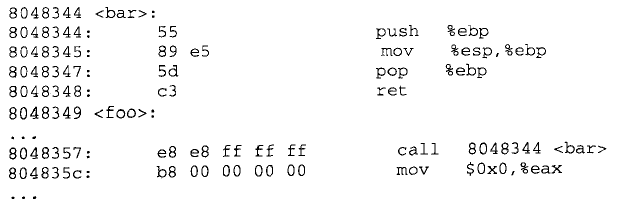
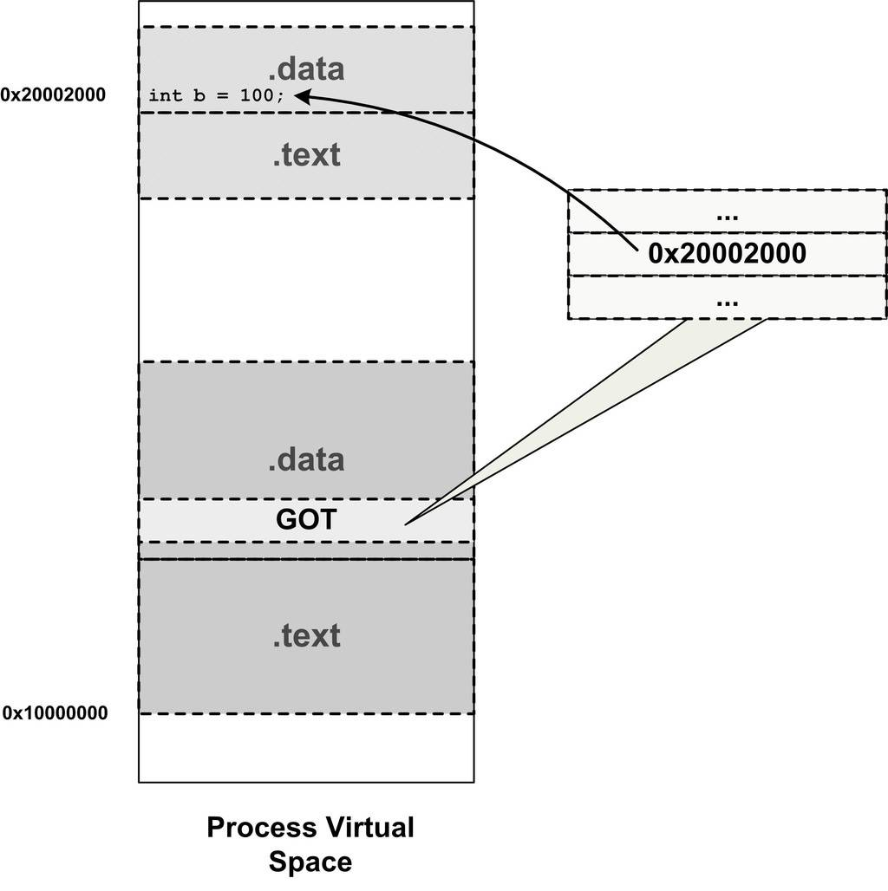
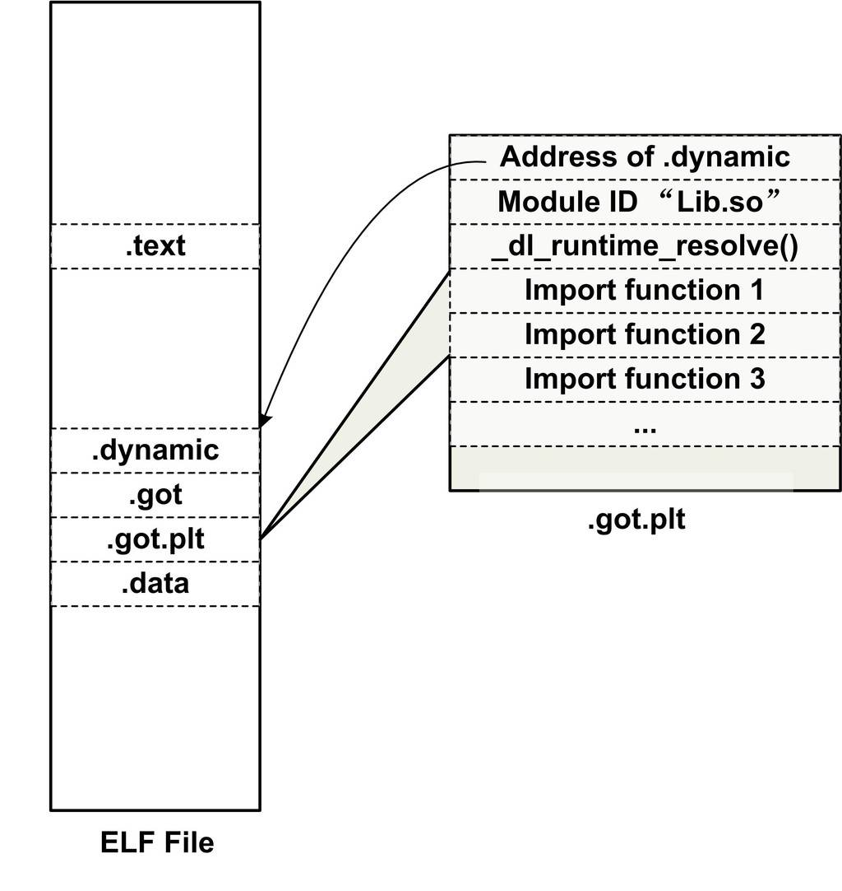

# 内容

1. 库文件
2. 静态库
3. 共享库（动态链接库）

# 一段代码

```c
#include<stdio.h>
int main()
{
    printf("hello, world!");
    return 0;
}
```

众所周知，引入的`.h`文件只是引入了一堆函数的声明，在这个源代码和`.h`文件中并没有实现这些函数。那么`printf`谁帮我们实现的呢？

答案就是，c程序自动链接了`libc.so`库文件。

# 举例

C语言编程中经常使用的`printf()`，显然不是我们自己实现的，它是在c标准库中实现的。c标准库即`libc.so`（后面带`.6`表示版本号，如`libc.so.6`），此库文件在系统中充当共享库。

库中存放的是什么？——预先编译好的方法，把这些方法打包为一个集合，就是库文件。

比如，`add.c`、`max.c`分别编译为`add.o`、`max.o`，把编译好的二进制文件打包到`libfoo.a`或`libfoo.so`。以后我们要是想使用`add.o`或`max.o`中的方法时，链接`libfoo`库即可成功调用。为了方便他人使用，往往会给调用方再提供一个头文件`foo.h`，以声明此库中包含哪些接口。

# 库文件

预先编译好的方法（函数）的集合。

库文件通常存放到`/lib`、`/usr/lib`下。

头文件通常存放到`/usr/include`下。

## 库文件使编译链接方便了

* 我们编写第一个版本的代码，只有一个文件`main.c`

```c
#include<stdio.h>
int add(int a, int b);
int main()
{
    int a = 10;
    int b = 20;
    int c = add(a, b);
    printf("a + b = %d\n", c);
    return 0;
}
int add(int a, int b)
{
    return a + b;
}
```

此版本我们把`add`函数的声明、实现全部写到了此文件中。

测试编译链接——单文件的编译链接很方便。

```bash
gcc -o main main.c
```

按上面语句编译即可成功。

* 我们编写第二个版本的代码，把add函数抽出来写到第二个文件中。

```c
int add(int a, int b)
{
    return a + b;
}
```

改写main.c，对于add函数只在此文件中声明

```c
#include<stdio.h>
int add(int a, int b);
int main()
{
    int a = 10;
    int b = 20;
    int c = add(a, b);
    printf("a + b = %d\n", c);
    return 0;
}
```

此时如果再像第一次那样编译就行不通了`gcc -o main main.c`，报错：


这时，就得这样编译链接才能通过：

```bash
gcc -o main main.c add.c
```

后面得加个`add.c`才行。

**这时，就很有可能出现了一个现象：好多人可能都需要调用`add.c`里面的函数**。

此时出现了诸多问题：

1. 如果直接给你add.c，这个源码就要暴露给所有人了，不利于隐藏代码实现细节。
2. 实际上，`gcc -o main main.c add.c`不是一步到位生成main的，而是隐藏了好多过程，如果大家都要用add.c那么大家在每一次生成main之前，都需要另外先编译好add.c，才能与main.o链接生成main。这样重复的工作我们是要想办法避免的，即直接给你编译好的`.o`文件。

针对以上问题，我们`gcc -c add.c`编译add.c文件为.o文件。直接给用户编译好的`.o`文件，即可解决此问题。

此时，我们要想通过`main.c`和`add.o`生成`main`可执行文件时，可以如此：

```bash
gcc -o main main.c add.o
```

生成`.o`文件解决了两个问题，接下来的问题：**以后我们可能不止有`add.o`，还可能有很多其他的`.o`文件，比如`max.o`。能不能打包为一个文件呢？这样就很方便了。——这就是库文件**。

# 静态库

`libxx.a`。

编译链接时，把被链接的库程序的一部分包含到要生成的可执行文件中。

## 如何生产静态库？ar命令

我们把`add.c`和`max.c`做成一个静态库。

add.c文件内容略。

max.c文件：

```c
int max(int a, int b)
{
    return a > b ? a : b;
}
```

把两个.c文件分别`gcc -c add.c max.c`生成了两个.o文件。

然后，使用ar命令将指出的.o文件生成静态库。

> 为什么是ar呢？因为静态库的英文是archive。

ar命令格式：`ar [选项] 库名 若干.o文件`

| ar命令的选项参数 | 意义             |
| ---------------- | ---------------- |
| c                | 创建库           |
| r                | 将方法添加到库中 |
| v                | 显示过程         |

则用以下命令即可把add.o、max.o打包为一个静态库文件`libfoo.a`

```bash
ar crv libfoo.a add.o max.o
```

执行结果：

## 链接静态库

我们当前目录下只有`libfoo.a`、`main.c`。

首先，`gcc -o main main.c`肯定是不能编译通过的。

其次，`gcc -o main main.c libfoo.a`是可以编译通过的。但是这不是一个好的办法，这样做的话每次链接需要把库文件拷贝到当前目录，而且还需要打出库的全名。

* 标准的做法：`-L`指明库所在的目录，`-l`指明你要链接的库名。
  * 在我们的例子中，库所在的目录是`.`；库名为`foo`，即`"lib"`的后半部分，不带`.a`。

```bash
gcc -o main main.c -L. -lfoo
```

## 库文件及其头文件标准目录

我们为了给调用者声明它可以通过某库文件调用哪些函数，需要另外编写一个`foo.h`头文件。

**注意，在编写`.c`文件时，需要`#include<foo.h>`**，如此就不用一个个自己声明函数了。

foo.h文件

```c
int add(int a, int b);
int max(int a, int b);
```

改写main.c文件

```c
#include<stdio.h>
#include<foo.h>
int main()
{
    int a = 10;
    int b = 20;
    int c = add(a, b);	// add函数已经声明于foo.h
    printf("a + b = %d\n", c);
    return 0;
}
```

* 标准目录

标准的位置，同时是`gcc`程序链接时默认扫描的位置是`/usr/include`。

相应的库文件的默认扫描位置，`/lib`、`/usr/lib`。

我们把我们自己编写的`foo.h`和`libfoo.a`移到标准目录。

```bash
su root
mv foo.h /usr/include
mv libfoo.a /usr/lib
```

现在的编译链接过程，由于头文件、库文件都在标准目录底下，可以不加`-L`参数，但是仍然必须在后面指定`-l库名`，即`-lfoo`，便可编译链接成功。

**注意：除了链接`libc.so`c标准库，`-l`通常不可省略，这就相当于c标准库是系统亲生的，用得很多，就默认可以省略。**

```bash
gcc -o main main.c -lfoo
```


# 动态库

`libxx.so`。

编译链接时，不会把被链接的库程序的一部分包含到要生成的可执行文件中。只做一个标记，只验证链接的库有没有问题。生成的可执行文件在运行时动态地加载动态库去运行，所以动态库一旦删除则无法运行。

再回到那个众人皆知的代码。

```c
#include<stdio.h>
int main()
{
    printf("hello, world!");
    return 0;
}
```

我们编译它。

```bash
gcc -o main main.c
```

怎么证明`main`程序链接了`libc.so`库文件呢？

## ldd命令

`ldd`命令可以查看编译好的二进制程序需要链接的库文件信息。

```bash
ldd main
```

我们的main程序使用到了`printf`的库，即`libc.so`，bash下输入`ldd main`的结果是：


## 如何生产动态库？

我们把`add.o`和`max.o`做成一个动态库。

生成动态库，使用的是gcc命令。

```bash
gcc -shared -fPIC -o libfoo.so add.o max.o
```

其中，`-shared`参数表示产生共享对象，`-fPIC`：

## 链接动态库

暂且如下编译链接main.c程序

```bash
gcc -o main main.c ./libfoo.so
```

这样得到了一个程序`main`，此程序使用了`libfoo.so`里面的`add`函数。从`main.c`的角度看，自己被链接成为可执行文件的这一步，在之前的静态链接中会把`main.o`和`libfoo.so`结合到一起。但是在动态链接里，`libfoo.so`没有被链接进来，链接的输入目标文件只有`main.o`（当然还有C语言运行库，我们这里暂时忽略）。但是上面gcc的命令行中，后面也加上了`./libfoo.so`这是咋回事？

> * **关于模块**
>
> 在静态链接时，整个程序最终只有一个可执行文件，它是一个不可分割的整体；
>
> 但在动态链接下，一个程序被分成了若干个文件，有程序的主要部分，即可执行文件`main`和程序所依赖的共享对象`libfoo.so`。很多时候我们把这些部分称为模块，即动态链接下的可执行文件和共享对象都可看作是程序的模块。

## 动态链接的原理细节

谈谈动态链接的机制，当程序模块`main.c`被编译成为`main.o`时，编译器还不知道`add`函数的地址。当链接器将`main.o`链接成可执行文件时，这时候**链接器必须确定`main.o`中所引用的`add`函数的性质**：

1. 如果`add`是一个定义于其他静态目标模块中的函数，那么链接器将会按照静态链接的规则，将`main.o`中的`add`地址引用**重定位**；
2. 如果`add`是一个定义在某个动态共享对象中的函数，**那么链接器就会将这个符号的引用标记为一个动态链接的符号，不对它进行地址重定位，把这个过程留到装载时再进行**。

那么这里就有个问题，链接器如何知道`add`的引用是一个静态符号还是一个动态符号？这实际上就是我们的gcc命令后面要写`libfoo.so`的原因。`libfoo.so`中保存了完整的符号信息（因为运行时进行动态链接还须使用符号信息)，把`libfoo.so`也作为链接的输入文件之一，链接器在解析符号时就可以知道：`add`是一个定义在`libfoo.so`的动态符号。这样链接器就可以对`add`的引用做特殊的处理，使它成为一个对动态符号的引用。

## 动态链接程序运行时地址空间分布

对于静态链接的可执行文件来说，整个进程只有一个文件要被映射，那就是可执行文件本身，静态链接下的进程虚拟地址空间的分布很清晰明了。但是对于动态链接来说，除了可执行文件本身之外，还有它所依赖的共享目标文件。那么这种情况下，进程的地址空间分布又会怎样呢？

我们还是以上面的程序为例，我们对程序做适当的修改，在`main.c`中里面调用`sleep`函数。

```bash
xcg@instance-bkdrtyrm:~/ld-learn$ ./main &
[1] 764261
xcg@instance-bkdrtyrm:~/ld-learn$ 10 + 20 = 30
cat /proc/764261/maps 
55f2437e2000-55f2437e3000 r--p 00000000 fc:01 1201223            /home/xcg/ld-learn/main
55f2437e3000-55f2437e4000 r-xp 00001000 fc:01 1201223            /home/xcg/ld-learn/main
55f2437e4000-55f2437e5000 r--p 00002000 fc:01 1201223            /home/xcg/ld-learn/main
55f2437e5000-55f2437e6000 r--p 00002000 fc:01 1201223            /home/xcg/ld-learn/main
55f2437e6000-55f2437e7000 rw-p 00003000 fc:01 1201223            /home/xcg/ld-learn/main
55f244377000-55f244398000 rw-p 00000000 00:00 0                  [heap]
7f814f30e000-7f814f311000 rw-p 00000000 00:00 0 
7f814f311000-7f814f333000 r--p 00000000 fc:01 394589             /usr/lib/x86_64-linux-gnu/libc-2.31.so
7f814f333000-7f814f4ab000 r-xp 00022000 fc:01 394589             /usr/lib/x86_64-linux-gnu/libc-2.31.so
7f814f4ab000-7f814f4f9000 r--p 0019a000 fc:01 394589             /usr/lib/x86_64-linux-gnu/libc-2.31.so
7f814f4f9000-7f814f4fd000 r--p 001e7000 fc:01 394589             /usr/lib/x86_64-linux-gnu/libc-2.31.so
7f814f4fd000-7f814f4ff000 rw-p 001eb000 fc:01 394589             /usr/lib/x86_64-linux-gnu/libc-2.31.so
7f814f4ff000-7f814f503000 rw-p 00000000 00:00 0 
7f814f50b000-7f814f50c000 r--p 00000000 fc:01 1201222            /home/xcg/ld-learn/libfoo.so
7f814f50c000-7f814f50d000 r-xp 00001000 fc:01 1201222            /home/xcg/ld-learn/libfoo.so
7f814f50d000-7f814f50e000 r--p 00002000 fc:01 1201222            /home/xcg/ld-learn/libfoo.so
7f814f50e000-7f814f50f000 r--p 00002000 fc:01 1201222            /home/xcg/ld-learn/libfoo.so
7f814f50f000-7f814f510000 rw-p 00003000 fc:01 1201222            /home/xcg/ld-learn/libfoo.so
7f814f510000-7f814f512000 rw-p 00000000 00:00 0 
7f814f512000-7f814f513000 r--p 00000000 fc:01 394574             /usr/lib/x86_64-linux-gnu/ld-2.31.so
7f814f513000-7f814f536000 r-xp 00001000 fc:01 394574             /usr/lib/x86_64-linux-gnu/ld-2.31.so
7f814f536000-7f814f53e000 r--p 00024000 fc:01 394574             /usr/lib/x86_64-linux-gnu/ld-2.31.so
7f814f53f000-7f814f540000 r--p 0002c000 fc:01 394574             /usr/lib/x86_64-linux-gnu/ld-2.31.so
7f814f540000-7f814f541000 rw-p 0002d000 fc:01 394574             /usr/lib/x86_64-linux-gnu/ld-2.31.so
7f814f541000-7f814f542000 rw-p 00000000 00:00 0 
7ffc5ff25000-7ffc5ff46000 rw-p 00000000 00:00 0                  [stack]
7ffc5fff5000-7ffc5fff8000 r--p 00000000 00:00 0                  [vvar]
7ffc5fff8000-7ffc5fff9000 r-xp 00000000 00:00 0                  [vdso]
ffffffffff600000-ffffffffff601000 --xp 00000000 00:00 0          [vsyscall]
```

我们看到，整个进程虚拟地址空间中，多出了几个文件的映射：

1. `libfoo.so`与`main`一样，它们都是被操作系统用同样的方法映射至进程的虚拟地址空间，只是**它们占据的虚拟地址和长度不同**。
2. `main`除了使用`libfoo.so`以外，它还用到了动态链接形式的C语言运行库`libc-2.31.so`。

3. 另外还有一个很值得关注的共享对象就是`ld-2.31.so`，它实际上是Linux下的动态链接器。动态链接器与普通共享对象一样被映射到了进程的地址空间。

在系统开始运行`main`之前，首先会把控制权交给动态链接器，由它完成所有的动态链接工作以后再把控制权交给`main`，然后开始执行。

我们通过readelf工具来查看`libfoo.so`的装载属性，就如我们在前面查看普通程序一样：

```bash
readelf -l libfoo.so
```

```bash
xcg@instance-bkdrtyrm:~/ld-learn$ readelf -l libfoo.so 

Elf file type is DYN (Shared object file)
Entry point 0x1040
There are 11 program headers, starting at offset 64

Program Headers:
  Type           Offset             VirtAddr           PhysAddr
                 FileSiz            MemSiz              Flags  Align
  LOAD           0x0000000000000000 0x0000000000000000 0x0000000000000000
                 0x00000000000004c8 0x00000000000004c8  R      0x1000
  LOAD           0x0000000000001000 0x0000000000001000 0x0000000000001000
                 0x0000000000000139 0x0000000000000139  R E    0x1000
  LOAD           0x0000000000002000 0x0000000000002000 0x0000000000002000
                 0x00000000000000cc 0x00000000000000cc  R      0x1000
  LOAD           0x0000000000002e80 0x0000000000003e80 0x0000000000003e80
                 0x00000000000001a0 0x00000000000001a8  RW     0x1000
  DYNAMIC        0x0000000000002e90 0x0000000000003e90 0x0000000000003e90
                 0x0000000000000150 0x0000000000000150  RW     0x8
  NOTE           0x00000000000002a8 0x00000000000002a8 0x00000000000002a8
                 0x0000000000000020 0x0000000000000020  R      0x8
  NOTE           0x00000000000002c8 0x00000000000002c8 0x00000000000002c8
                 0x0000000000000024 0x0000000000000024  R      0x4
  GNU_PROPERTY   0x00000000000002a8 0x00000000000002a8 0x00000000000002a8
                 0x0000000000000020 0x0000000000000020  R      0x8
  GNU_EH_FRAME   0x0000000000002000 0x0000000000002000 0x0000000000002000
                 0x000000000000002c 0x000000000000002c  R      0x4
  GNU_STACK      0x0000000000000000 0x0000000000000000 0x0000000000000000
                 0x0000000000000000 0x0000000000000000  RW     0x10
  GNU_RELRO      0x0000000000002e80 0x0000000000003e80 0x0000000000003e80
                 0x0000000000000180 0x0000000000000180  R      0x1

 Section to Segment mapping:
  Segment Sections...
   00     .note.gnu.property .note.gnu.build-id .gnu.hash .dynsym .dynstr .rela.dyn 
   01     .init .plt .plt.got .text .fini 
   02     .eh_frame_hdr .eh_frame 
   03     .init_array .fini_array .dynamic .got .got.plt .data .bss 
   04     .dynamic 
   05     .note.gnu.property 
   06     .note.gnu.build-id 
   07     .note.gnu.property 
   08     .eh_frame_hdr 
   09     
   10     .init_array .fini_array .dynamic .got
```

动态库文件除了文件的类型与普通程序不同以外，其他几乎与普通程序一样。有一点比较不同的是，**动态链接模块的装载地址是从地址`0x00000000`开始的**。我们知道这个地址是无效地址，并且从**上面的进程虚拟空间分布看到，`libfoo.so`的最终装载地址并不是`0x00000000`，而是其他具体值**。从这一点我们可以推断，**共享对象的最终装载地址在编译时是不确定的**，而**是在装载时，装载器根据当前地址空间的空闲情况，动态分配一块足够大小的虚拟地址空间给相应的共享对象**。

当然，这仅仅是一个推断，至于为什么要这样做，为什么不将每个共享对象在进程中的地址固定，或者在真正的系统中是怎么运作的？

## 装载地址

我们设想是否可以让共享对象在任意地址加载？这个问题另一种表述方法就是：共享对象在编译时不能假设自己在进程虚拟地址空间中的位置。与此不同的是，可执行文件基本可以确定自己在进程虚拟空间中的起始位置，因为可执行文件往往是第一个被加载的文件，它可以选择一个固定空闲的地址，比如Linux下一般都是0x08040000，Windows下一般都是0x0040000。

### 装载时重定位

为了能够使共享对象在任意地址装载，我们首先能想到的方法就是静态链接中的重定位。这个想法的基本思路是在链接时，对所有绝对地址的引用不作重定位，而把这一步推迟到装载时再完成。一旦模块装载地址确定，即目标地址确定，那么系统就对程序中所有的绝对地址引用进行重定位。假设函数`add`相对于代码段的起始地址是0x100，当模块被装载到0x10000000时，我们假设代码段位于模块的最开始，即代码段的装载地址也是0x10000000，那么我们就可以确定`add`的地址为0x10000100。这时候，系统遍历模块中的重定位表，把所有对`add`的地址引用都重定位至0x10000100。

事实上，类似的方法在很早以前就存在。早在没有虚拟存储概念的情况下，程序是直接被装载进物理内存的。当同时有多个程序运行的时候，操作系统根据当时内存空闲情况，动态分配一块大小合适的物理内存给程序，所以程序被装载的地址是不确定的。系统在装载程序的时候需要对程序的指令和数据中对绝对地址的引用进行重定位。但这种重定位比前面提到过的静态链接中的重定位要简单得多，因为整个程序是按照一个整体被加载的，程序中指令和数据的相对位置是不会改变的。比如一个程序在编译时假设被装载的目标地址为0x1000，但是在装载时操作系统发现0x1000这个地址已经被别的程序使用了，从0x4000开始有一块足够大的空间可以容纳该程序，那么该程序就可以被装载至0x4000，程序指令或数据中的所有绝对引用只要都加上0x3000的偏移量就可以了。

我们前面在静态链接时提到过重定位，那时的重定位叫做**链接时重定位**(Link Time Relocation)，而现在这种情况经常被称为**装载时重定位**(Load Time Relocation)。在Windows中，这种装载时重定位又被叫做**基址重置**(Rebasing)。

这种情况与我们碰到的问题很相似，**都是程序模块在编译时目标地址不确定而需要在装载时将模块重定位**。但是装载时重定位的方法并不适合用来解决上面的共享对象中所存在的问题。可以想象，动态链接模块被装载映射至虚拟空间后，指令部分是在多个进程之间共享的，**由于装载时重定位的方法需要修改指令，所以没有办法做到同一份指令被多个进程共享，因为指令被重定位后对于每个进程来讲是不同的**。当然，动态连接库中的可修改数据部分对于不同的进程来说有多个副本，所以它们可以采用装载时重定位的方法来解决。

Liux和GCC支持这种装载时重定位的方法，我们前面在产生共享对象时，使用了两个GCC参数`-shared`和`-fPIC`，如果只使用`-shared`，那么输出的共享对象就是使用装载时重定位的方法。

### 地址无关代码

那么什么是`-fPIC`呢？使用这个参数会有什么效果呢？

装载时重定位是**解决动态模块中有绝对地址引用**的办法之一，但是它有一个很大的**缺点是指令部分无法在多个进程之间共享，这样就失去了动态链接节省内存的一大优势**。我们还需要有一种更好的方法解决共享对象指令中对绝对地址的重定位问题。其实我们的目的很简单，**希望程序模块中共享的指令部分在装载时不需要因为装载地址的改变而改变**，所以实现的基本想法就是**把指令中那些需要被修改的部分分离出来**，**跟数据部分放在一起**，这样指令部分就可以保持不变，而数据部分可以在每个进程中拥有一个副本。这种方案就是目前被称为**地址无关代码(PIC, Position-independent Code)的技术**。

对于现代的机器来说，产生地址无关的代码并不麻烦。我们先来分析模块中各种类型的地址引用方式。

#### 模块中各种类型的地址引用方式

1. **把共享对象模块中的地址引用按照是否为跨模块分成两类**：模块内部引用和模块外部引用；
2. **按照不同的引用方式**又可以分为指令引用（函数）和数据访问。

则得到了4种情况。

1. 模块内部的函数调用、跳转等。
2. 模块内部的数据访问，比如模块中定义的全局变量、静态变量。
3. 是模块外部的函数调用、跳转等。
4. 是模块外部的数据访问，比如其他模块中定义的全局变量。

```c
static int a;
extern int b;
extern void ext();
void bar()
{
    a = 1;	//case 2, inner-module data
    b = 2;	//case 4, inter-module data
}
void foo()
{
    bar();	//case 1, inner-module function
    ext();	//case 3, inter-module function
}
```

> * **关于模块内部和模块外部**
>
> 当编译器在编译时，它实际上并不能确定变量b和函数ext()是模块外部的还是模块内部的，因为它们有可能被定义在同一个共享对象的其他目标文件中。由于没法确定，编译器只能把它们都当作模块外部的函数和变量来处理。MSVC编译器提供了`__declspec(dllimport)`编译器扩展来表示一个符号是模块内部的还是模块外部的。

* 模块内部调用或跳转

这4种情况中，第一种类型应该是最简单的，那就是模块内部调用。因为被调用的函数与调用者都处于同一个模块，它们之间的相对位置是固定的，所以这种情况比较简单。对于现代的系统来讲，模块内部的跳转、函数调用都可以是相对地址调用，或者是基于寄存器的相对调用，所以对于这种指令是不需要重定位的。比如上面例子中foo对bar的调用可能产生如下代码：



foo中对bar的调用的那条指令实际上是一条相对地址调用指令，相对偏移调用指令如图。


这条指令中的后4个字节是目的地址相对于当前指令的下一条指令的偏移，即`0xFFFFFFE8`（小端）。`0xFFFFFFE8`是`-24`的补码形式，即`bar`的地址为`0x804835c+(-24)=0x8048344`。那么只要bar和foo的相对位置不变，这条指令是地址无关的。即无论模块被装载到哪个位置，这条指令都是有效的。这种相对地址的方式对于jmp指令也有效。

这样看起来第一个模块内部调用或跳转很容易解决，但实际上这种方式还有一定的问题，这里存在一个叫做**共享对象全局符号介入(Global Symbol Interposition)问题**，但在这里，可以简单地把它当作相对地址调用/跳转。

* 模块内部数据访问

接着来看看第二种类型，模块内部的数据访问。很明显，指令中不能直接包含数据的绝对地址，那么唯一的办法就是**相对寻址**。我们知道，一个模块前面一般是若干个页的代码，后面紧跟着若千个页的数据，这些页之间的相对位置是固定的，也就是说，**任何一条指令与它需要访问的模块内部数据之间的相对位置是固定的**，那么**只需要相对于当前指令加上固定的偏移量就可以访问模块内部数据**了。

现代的体系结构中，数据的相对寻址往往没有相对与当前指令地址（PC）的寻址方式，所以ELF用了一个很巧妙的办法来得到当前的PC值，然后再加上一个偏移量就可以达到访问相应变量的目的了。得到PC值的方法很多，我们来看看最常用的一种，也是现在ELF的共享对象里面用的一种方法：


这是对上面的例子中的代码先编译成共享对象然后反汇编的结果。用粗体表示的是`bar()`函数中访问模块内部变量`a`的相应代码。

从上面的指令中可以看到，它先调用了一个叫`__i686.get_pc_thunk.cx`的函数，这个函数的作用就是把返回地址的值放到ecx寄存器，即把call的下一条指令的地址放到ecx寄存器。

>我们知道当处理器执行call指令以后，下一条指令的地址会被压到栈顶，而esp寄存器就是始终指向栈顶的，那么当`__i686.get_pc_thunk.cx`执行`mov(%esp), %ecx`的时候，返回地址就被赋值到ecx寄存器了。

接着执行一条add指令和一条mov指令，可以看到变量`a`的地址是add指令地址（保存在ecx寄存器）加上两个偏移量`0x118c`和`0x28`（`0x28(%ecx)`相当于`%ecx+0x28`），即如果模块被装载到`0x10000000`这个地址的话，那么变量a的实际地址将是`0x10000000+0x454+0x118c+0x28=0x10001608`。


* 模块间数据访问

模块间的数据访问比模块内部稍微麻烦一点，因为模块间的数据访问目标地址要等到装载时才决定，比如上面例子中的变量b，它被定义在其他模块中，并且该地址在装载时才能确定。我们前面提到要使得代码地址无关，基本的思想就是把跟地址相关的部分放到数据段里面，很明显，这些其他模块的全局变量的地址是跟模块装载地址有关的。**ELF的做法是在数据段里面建立一个指向这些变量的指针数组，也被称为全局偏移表**(GlobalOffset Table, GOT)，当代码需要引用该全局变量时，可以通过GOT中相对应的项间接引用，它的基本机制如图所示。


当指令中需要访问变量b时，程序会先找到GOT，然后根据GOT中变量所对应的项找到变量的目标地址。每个变量都对应一个4个字节的地址，链接器在装载模块的时候会查找每个变量所在的地址，然后填充GOT中的各个项，以确保每个指针所指向的地址正确。由于GOT本身是放在数据段的，所以它可以在模块装载时被修改，并且每个进程都可以有独立的副本，相互不受影响。

我们来看看GOT如何做到指令的地址无关性。从第二种类型的数据访问我们了解到，模块在编译时可以确定模块内部变量相对与当前指令的偏移，那么我们也可以**在编译时确定GOT相对于当前指令的偏移**。确定GOT的位置跟上面的访问变量a的方法基本一样，通过得到PC值然后加上一个偏移量，就可以得到GOT的位置。然后我们根据变量地址在GOT中的偏移就可以得到变量的地址，当然GOT中每个地址对应于哪个变量是由编译器决定的，比如第一个地址对应变量b，第二个对应变量c等。

让我们再回顾刚才函数`bar()`的反汇编代码。为访问变量b，我们的程序首先计算出变量b的地址在GOT中的位置，即`0x10000000+0x454+0x118c+(-8)=0x100015d8`（`0xfffffff8`为`-8`的补码表示），然后使用寄存器间接寻址方式给变量b赋值2。


我们也可以使用objdump来查看GOT的位置：


可以看到GOT在文件中的偏移是`0x15d0`，我们再来看看`pic.so`的需要在动态链接时重定位项：


可以看到变量b的地址需要重定位，它位于`0x15d8`，也就是GOT中偏移8，相当于是GOT中的第三项(每四个字节一项) 。从上面重定位项中看到，变量b的地址的偏移为`0x15d8`，正好对应了我们前面通过指令计算出来的偏移值，即`0x100015d8-0x10000000=0x15d8`。

* 模块间调用、跳转

对于模块间调用和跳转，我们也可以采用上面的方法来解决。与上面的类型有所不同的是，GOT中相应的项保存的是目标函数的地址，当模块需要调用目标函数时，可以通过GOT中的项进行间接跳转，基本的原理如图所示。


调用`ext()`函数的方法与上面访问变量b的方法基本类似，先得到当前指令地址PC，然后加上一个偏移得到函数地址在GOT中的偏移，然后一个间接调用。


* 小结

4种地址引用方式在理论上都实现了地址无关性，将它们总结一下，如表。


## -fPIC

生成动态库用到的参数`fPIC`即是指明GCC产生地址无关代码。实际上GCC还提供了另外一个类似的参数叫做`-fpic`，即`PIC`3个字母小写。这两个参数从功能上来讲完全一样，都是指示GCC产生地址无关代码。唯一的区别是，`-fPIC`产生的代码要大，而`-fpic`产生的代码相对较小，而且较快。

那么我们为什么不使用`-fpic`而要使用`-fPIC`呢？原因是，由于地址无关代码都是跟硬件平台相关的，不同的平台有着不同的实现， `-fpic`在某些平台上会有一些限制，比如全局符号的数量或者代码的长度等，而`-fPIC`则没有这样的限制。所以为了方便起见，绝大部分情况下我们都使用`-fPIC`参数来产生地址无关代码。

* 如何区分一个DSO(Dynamic Shared Object, 动态共享对象)是否为PIC？

```bash
readelf -d foo.so | grep TEXTREL
```

如果上面的命令有任何输出那么`foo.so`就不是PIC的，否则为PIC的。因为PIC的DSO是不会包含任何代码段重定位表的，TEXTREL表示代码段重定位表地址。

* PIC与PIE

地址无关代码技术除了可以用在共享对象上面，它也可以用于可执行文件，一个以地址无关方式编译的可执行文件被称作地址无关可执行文件(PIE, Position-Independent Executable)。与GCC的`-fPIC`和`-fpic`参数类似，产生PIE的参数为`-fPIE`或`-f pie`。

## 共享模块的全局变量问题

在谈到动态库的装载地址时，说到了地址无关性问题。地址无关性问题就这么解决了吗？看起来好像是的。但仔细看看前面的4种地址引用方式的分类，会有一个小问题：我们上面的情况中没有包含**定义在模块内部的全局变量**的情况。把它跟模块内部的静态变量一样处理可以吗？的确，粗略一看模块内部的全局变量和静态变量的地址都可以通过上面所列出的类型两种方法来解决。但是有一种情况很特殊，我们来看看会产生什么问题。

有一种很特殊的情况是，当**一个模块引用了一个定义在共享对象的全局变量**的时候，比如一个共享对象定义了一个全局变量global，而模块module.c中是这么引用的：

```c
extern int global;	//定义在一个共享对象
int foo()
{
    global = 1;
}
```

当编译器编译module.c时，它**无法根据这个上下文判断global是定义在同一个模块的的其他目标文件还是定义在另外一个共享对象之中**，即**无法判断是否为跨模块间的调用**。
假设module.c是程序可执行文件的一部分，那么在这种情况下，由于程序主模块的代码并不是地址无关代码，也就是说代码不会使用这种类似于PIC的机制，它引用这个全局变量的方式跟普通数据访问方式一样，编译器会产生这样的代码：
`movl $0x1, xxxxxxxx`

`XXXXXXXX`就是global的地址。由于可执行文件在运行时并不进行代码重定位，所以变量的地址必须在链接过程中确定下来。为了能够使得链接过程正常进行，链接器会在创建可执行文件时，在它的“.bss”段创建一个global变量的副本。那么问题就很明显了，现在global变量定义在原先的共享对象中，而在可执行文件的“.bss”段还有一个副本。如果同一个变量同时存在于多个位置中，这在程序实际运行过程中肯定是不可行的。

于是解决的办法只有一个，那就是所有的使用这个变量的指令都指向位于可执行文件中的那个副本。**ELF共享库在编译时，默认都把定义在模块内部的全局变量当作定义在其他模块的全局变量**，也就是说当作前面的类型四，通过GOT来实现变量的访问。当共享模块被装载时，如果某个全局变量在可执行文件中拥有副本，那么动态链接器就会把GOT中的相应地址指向该副本，这样该变量在运行时实际上最终就只有一个实例。如果变量在共享模块中被初始化，那么动态链接器还需要将该初始化值复制到程序主模块中的变量副本；如果该全局变量在程序主模块中没有副本， 那么GOT中的相应地址就指向模块内部的该变量副本。

假设module.c是一个共享对象的一部分，那么GCC编译器在`-fPIC`的情况下，就会把对global的调用按照跨模块模式产生代码。原因也很简单：**编译器无法确定对global的引用是跨模块的还是模块内部的**。**即使是模块内部的，即模块内部的全局变量的引用，按照上面的结论，还是会产生跨模块代码，因为global可能被可执行文件引用**，从而使得共享模块中对global的引用要执行可执行文件中的global副本。

> Q&A
>
> Q：如果一个共享对象`lib.so`中定义了一个全局变量`G`，而进程A和进程B都使用了`lib.so`，那么当进程A改变这个全局变量`G`的值时，进程B中的G会受到影响吗？
> A：不会。因为当`lib.so`被两个进程加载时，它的数据段部分在每个进程中都有独立的副本，从这个角度看，**共享对象中的全局变量实际上和定义在程序内部的全局变量没什么区别**。任何一个进程访问的只是自己的那个副本，而不会影响其他进程。
>
> Q：那么，如果我们把这个问题的条件改成同一个进程中的线程A和线程B，它们是否看得到对方对`lib.so`中的全局变量G的修改呢？
> A：对于同一个进程的两个线程来说，它们访问的是同一个进程地址空间，也就是同一个`lib.so`的副本，所以它们对G的修改，对方都是看得到的。
>
> Q：那么我们可不可以做到跟前面答案相反的情况呢？比如要求**两个进程共享一个共享对象的副本**或要求**两个线程访问全局变量的不同副本**，这两种需求都是存在的，比如多个进程可以共享同一个全局变量就可以用来实现进程间通信；而多个线程访问全局变量的不同副本可以防止不同线程之间对全局变量的干扰，比如C语言运行库的erron全局变量。
> A：实际上这两种需求都是有相应的解决方法的，**多进程共享全局变量又叫做“共享数据段”**，在介绍Windows DLL的时候会碰到它。而**多个线程访问不同的全局变量副本又被叫做“线程私有存储”**(Thread Local Storage)。

## 数据段地址无关性

通过上面的方法，我们能够保证共享对象中的代码部分地址无关，但是数据部分是不是也有绝对地址引用的问题呢？让我们来看看这样一段代码：
```c
static int a;
static int * p = &a;
```

如果某个共享对象里面有这样一段代码的话，那么指针p的地址就是一个绝对地址，它指向变量a，而变量a的地址会随着共享对象的装载地址改变而改变。那么有什么办法解决这个问题呢？

**对于数据段来说，它在每个进程都有一份独立的副本**，所以并不担心被进程改变。从这点来看，我们**可以选择装载时重定位**的方法来解决数据段中绝对地址引用问题。**对于共享对象来说，如果数据段中有绝对地址引用，那么编译器和链接器就会产生一个重定位表**，这个重定位表里面包含了`R_386_RELATIVE`类型的重定位入口，用于解决上述问题。当动态链接器装载共享对象时，如果发现该共享对象有这样的重定位入口，那么动态链接器就会对该共享对象进行重定位。

实际上，我们**甚至可以让代码段也使用这种装载时重定位的方法，而不使用地址无关代码**。从前面的例子中我们看到，我们在编译共享对象时使用了`-fPIC`参数，这个参数表示产生地址无关的代码段。如果我们不使用这个参数来产生共享对象又会怎么样呢？

```bash
gcc -shared -o pic.so pic.c
```

上面这个命令就会产生一个不使用地址无关代码而使用装载时重定位的共享对象。但正如我们前面分析过的一样，如果代码不是地址无关的，它就不能被多个进程之间共享，于是也就失去了节省内存的优点。但是装载时重定位的共享对象的运行速度要比使用地址无关代码的共享对象快，因为它**省去了地址无关代码中每次访问全局数据和函数时需要做一次计算当前地址以及间接地址寻址的过程**。

对于可执行文件来说，**默认情况下，如果可执行文件是动态链接的，那么GCC会使用PIC的方法来产生可执行文件的代码段部分**，以便于不同的进程能够共享代码段，节省内存。

所以我们可以看到，动态链接的可执行文件中存在“.got”这样的段。

# 延迟绑定

动态链接的确有很多优势，比静态链接要灵活得多，但它是以牺牲一部分性能为代价的。据统计ELF程序在静态链接下要比动态库稍微快点，大约为`1%~5%`，当然这取决于程序本身的特性及运行环境等。

动态链接比静态链接慢的主要原因是：

1. 动态链接下对于全局和静态的数据访问都要进行复杂的GOT定位，然后间接寻址；对于模块间的调用也要先定位GOT，然后再进行间接跳转，如此一来，程序的运行速度必定会减慢。
2. 另外一个减慢运行速度的原因是动态链接的链接工作在运行时完成，即程序开始执行时，动态链接器都要进行一次链接工作，正如我们上面提到的，动态链接器会寻找并装载所需要的共享对象，然后进行符号查找地址重定位等工作，这些工作势必减慢程序的启动速度。

这是影响动态链接性能的两个主要问题，我们将介绍优化动态链接性能的一些方法。

## 优化的突破口

在动态链接下，程序模块之间包含了大量的函数引用（全局变量往往比较少，因为大量的全局变量会导致模块之间耦合度变大）。所以在程序开始执行前，动态链接会耗费不少时间用于解决模块之间的函数引用的符号查找以及重定位，这也是我们上面提到的减慢动态链接性能的第二个原因。

不过可以想象，在一个**程序运行过程中，可能很多函数在程序执行完时都不会被用到，比如一些错误处理函数或者是一些用户很少用到的功能模块等，如果一开始就把所有函数都链接好实际上是一种浪费**。所以ELF采用了一种叫做**延迟绑定(Lazy Binding)**的做法，**基本的思想就是当函数第一次被用到时才由动态链接器进行绑定（符号查找、重定位等）**，如果没有用到则不进行绑定。这样的做法可以大大加快程序的启动速度，特别有利于一些有大量函数引用和大量模块的程序。

## 延迟绑定实现

ELF使用**PLT(Procedure Linkage Table)**的方法来实现，这种方法使用了一些很精巧的指令序列来完成。

在开始详细介绍PLT之前，我们先从动态链接器的角度设想一下：

假设`liba.so`需要调用`libc.so`中的`bar()`函数，那么当`liba.so`中第一次调用`bar()`时，这时候就需要**调用动态链接器中的某个函数来完成地址绑定工作**，我们假设这个函数叫做`lookup()`，那么`lookup()`需要知道哪些必要的信息才能完成这个函数地址绑定工作呢？答案很明显，**`lookup()`至少需要知道这个地址绑定发生在哪个模块，哪个函数**。那么我们可以假设`lookup`的原型为`lookup(module, function)`，这两个参数的值在我们这个例子中分别为`liba.so`和`bar()`。

在`Glibc`中，我们这里的`lookup()`函数真正的名字叫`_dl_runtime_resolve()`。

当我们调用某个外部模块的函数时，如果按照通常的做法应该是通过GOT中相应的项进行间接跳转。**PLT为了实现延迟绑定，在这个过程中间又增加了一层间接跳转**。调用函数并**不直接通过GOT跳转，而是通过一个叫作PLT项的结构来进行跳转**。每个外部函数在PLT中都有一个相应的项，比如`bar()`函数在PLT中的项的地址我们称之为`bar@plt`。让我们来看看bar@plt的实现：

```x86asm
bar@plt:
jmp *(bar@GOT)
push n
push moduleID
jump _dl_runtime_resolve
```

`bar@plt`的第一条指令是一条通过GOT间接跳转的指令。`bar@GOT`表示GOT中保存`bar()`这个函数相应的项。如果链接器在初始化阶段已经初始化该项，并且将`bar()`的地址填入该项，那么这个跳转指令的结果就是我们所期望的，跳转到`bar()`，实现函数正确调用。

但是为了实现延迟绑定，链接器在初始化阶段并没有将`bar()`的地址填入到该项，而是将上面代码中第二条指令`push n`的地址填入到`bar@GOT`中，这个步骤不需要查找任何符号，所以代价很低。很明显，第一条指令的效果是跳转到第二条指令，相当于没有进行任何操作。

第二条指令将一个数字n压入堆栈中，这个数字是bar这个符号引用在重定位表`.rel.plt`中的下标，接着又是一条`push`指令将模块的ID压入到堆栈，然后跳转到`_dl_runtime_resolve`。这实际上就是在实现我们前面提到的`lookup(module, function)`这个函数的调用：先将所需要决议符号的下标压入堆栈，再将模块ID压入堆栈，然后调用动态链接器的`_dl_runtime_resolve()`函数来完成符号解析和重定位工作。`_dl_runtime_resolve()`在进行一系列工作以后将`bar()`的真正地址填入到`bar@GOT`中。

一旦`bar()`这个函数被解析完毕，当我们再次调用`bar@plt`时，第一条`jmp`指令就能够跳转到真正的`bar()`函数中，`bar()`函数返回的时候会根据堆栈里面保存的`EIP`直接返回到调用者，而不会再继续执行`bar@plt`中第二条指令开始的那段代码，那段代码只会在符号未被解析时执行一次。

上面我们描述的是PLT的基本原理，PLT真正的实现要比它的结构稍微复杂一些。ELF将GOT拆分成了两个表叫做`.got`和`.got.plt`。其中`.got`用来保存全局变量引用的地址，`.got.plt`用来保存函数引用的地址。也就是说，所有对于外部函数的引用全部被分离出来放到了`.got.plt`中。另外`.got.plt`还有一个特殊的地方是它的前三项是有特殊意义的，分别含义如下：

1. 第一项保存的是`.dynamic`段的地址，这个段描述了本模块动态链接相关的信息，我们在后面还会介绍`.dynamic`段。
2. 第二项保存的是本模块的ID。
3. 第三项保存的是`_dl_runtime_resolve()`的地址。

其中第二项和第三项由动态链接器在装载共享模块的时候负责将它们初始化。`.got.plt`的其余项分别对应每个外部函数的引用。PLT的结构也与我们示例中的PLT稍有不同，为了减少代码的重复，ELF把上面例子中的最后两条指令放到PLT中的第一项。并且规定每一项的长度是16个字节，刚好用来存放3条指令，实际的PLT基本结构如图所示。


实际的PLT基本结构代码如下：

```x86asm
PLT0:
push *(GOT + 4)
jump *(GOT + 8)
...

bar@plt:
jmp *(bar@GOT)
push n
jump PLT0
```

PLT在ELF文件中以独立的段存放，段名通常叫做`.plt`，因为它本身是一些地址无关的代码，所以可以跟代码段等一起合并成同一个可读可执行的`Segment`被装载入内存。

# 总结

我们分析了使用动态链接技术的原因，即使用动态链接可以更加有效地利用内存和磁盘资源，可以更加方便地维护升级程序，可以让程序的重用变得更加可行和有效。

接着我们介绍了动态链接的基本例子，分析了动态链接中装载地址不确定时如何解决绝对地址引用的问题。

**装载时重定位**和**地址无关代码**是解决绝对地址引用问题的两个方法。

1. 装载时重定位的缺点是**无法共享代码段，但是它的运行速度较快**；
2. 地址无关代码的缺点是**运行速度稍慢，但它可以实现代码段在各个进程之间的共享**。
