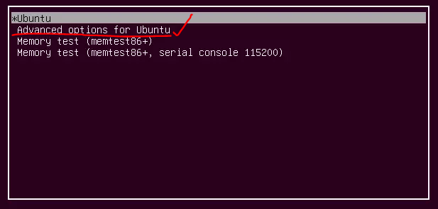

1. 重启ubuntu系统，启动时持续点按ESC，直到进入GRUB界面，选择Advanced option for ubuntu，按下回车键。
   
2. 选择recovery mode，按回车，进入Recovery Menu，选择"Root Drop to root shell prompt"）
3. 进入shell界面，使用`passwd`命令重新设定密码：`password root`，回车确认。
4. 输入新密码，两次。
5. sudo reboot，重启系统进入GUI界面。

>可能会在其中很有可能会出现”Authentication token manipulation error“的错误。别先执行”`mount -rw -o remount /`“，然后再执行第3步就可以了。
