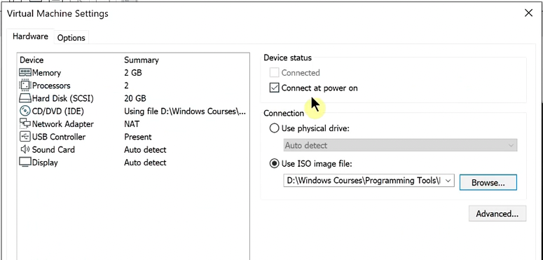
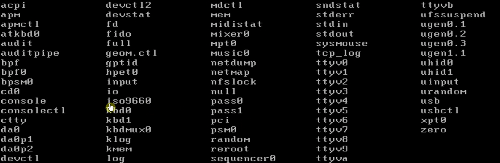
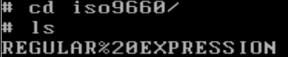
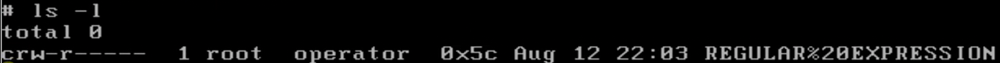
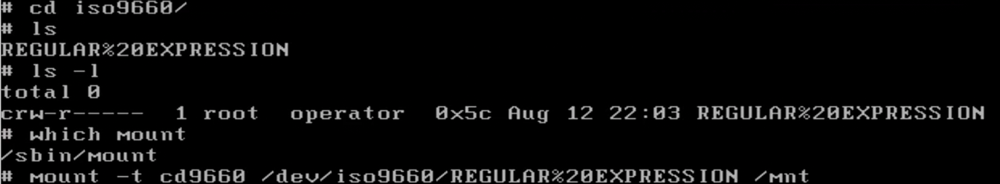
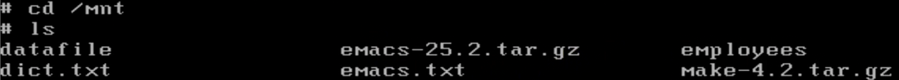
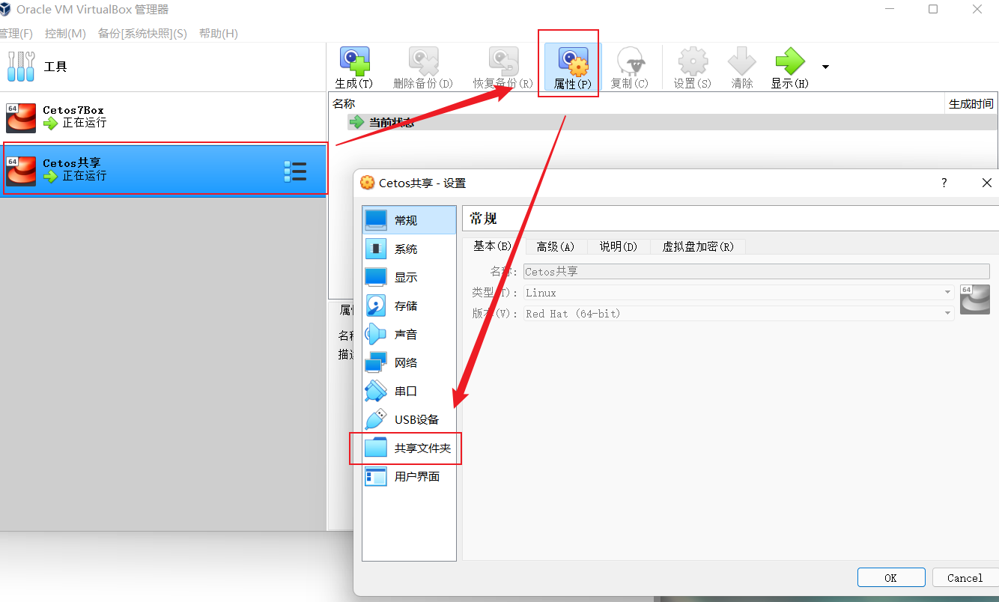
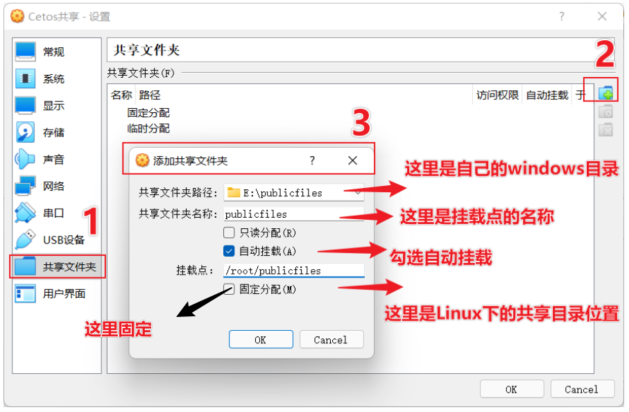

# Unix 挂载光盘
VMware - 虚拟机设置：


在根目录下的dev中：`/dev/`（dev代表设备）

可以看到一个iso9660的目录。这是光盘设备在Unix系统上的存在形式。

进入，可以看到我们的光盘内容名称`Regular Expression`已经列在其中。

是c，代表字符形式的文件。（字符类文件代表可以像文件流一样读取）

它实际只是一个驱动器，需要把它挂载到系统的一个文件夹下。
使用mount指令，把它挂载到`/mnt`下。
```sh
mount -t cd9660 /dev/iso9660/REGULAR%20EXPRESSION /mnt
```



现在进入`/mnt`，可以看到光盘内实际的文件了。

# VirtualBox

下挂载共享文件夹
参考：https://blog.csdn.net/qq_33827423/article/details/126019729

1. 在Windows下创建一个文件夹方便作为一个**共享目录**，目录名随意，但尽量方便自己辨识。
2. VirtualBox虚拟机共享文件夹的设置：
   1. 选中需要建立共享的虚拟机并打开`设置-共享文件夹`
      
   2. 添加共享文件夹
      
