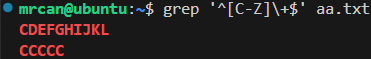

# 正则表达式
Regular Expression

主要参考文档：
https://legacy.cplusplus.com/reference/regex/ECMAScript/

[[Linux_Shell编程#结合正则表达式的示例]]：case的示例中

```sh
[][][]代表三个字符。
[]代表一个字符。
[]里可以填正则表达式。
1.[a-z]表示一个小写的a到z均可
2.[abcde]表示一个字符的可取范围
```
# Quantifiers（`*`、`+`、`?`、`{n}`）
量词

代表通用的信息的部分。
1. `*`：可能有（0到无数个）前导字符。`*`只是指示符，本身不参与，指示前面的字符会重复0到无数次。
2. `+`：最少1个前导字符。
3. `?`：只有1个前导字符。
4. `{n}`：有n个前导字符。
    1. `{n,}`：有大于等于n个的前导字符。
    2. `{min,max}`：至少有min个，但不超过max个（左闭右开）
# Special Pattern Characters（`[]`）
特殊模式字符

1. `.`：匹配任意单个字符
2. `[...]`：匹配`[]`中包含的任意字符。
    1. 比如`[1234567890]`或`[0-9]`都表示：字符0到9
    2. `[A-Z]`表示大写字母
    3. `[A-Za-z]`表示大小写字母。
    4. 分类字符，见《[Character classes](#Character%20classes)（字符类）》一节
3. `\s`：表示空格字符，空格、制表符都可以。（可替代`[[:space:]]`）

更多特殊字符见手册。
https://legacy.cplusplus.com/reference/regex/ECMAScript/

`.*`表示所有字符。
## Character classes
字符类
1. `[:alpha:]`：表示所有字母
    1. `grep '[[:alpha:]]' file.txt`
2. `[:digit:]`：表示数字
3. `[:alnum:]`：表示字母+数字
4. `^[:alpha:]`：表示除了字母以外
    1. `grep '[^[:alpha:]]' file.txt`
# Assertions（`^`、`$`）
断言

1. `^`：出现在行首的指定字符串。
    1. 注意，在`[]`内外，`^`表达的意思是不一样的。
        1. 在`[]`内，表示“非”
        2. 在`[]`外，才表示“首”
        3. 对于分类字符（比如`[:alpha:]`），需要放到两层`[]`之内，分类字符的`[]`之外，即：`[^[:alpha:]]`。
2. `$`：出现在行尾的指定字符串。

# Alternatives（或关系：`|`）


找出带A或带B的行。
相当于求了两次grep，结果合在一起。

注意`|`需要转义。
# Groups
组

## 核心概念：分组的作用

1. ​**​将量词应用于字符序列：​**​ 这是最基本的作用。想象你要匹配多次出现的单词“hello”而不是单个字母“l”多次。你需要把“hello”当成一个整体来量化。
    - _错误示例：_ `hel{2,}o`：这个匹配的是 'he' + ​**​至少2个'l'​**​ + 'o'， 可以匹配 "hello", "hellllo"，但不能匹配 "hellohello" (两个hello连在一起)。
    - _正确示例：_ `(hello){2,}`：这个匹配的是 ​**​"(hello)"这个整体​**​ 至少出现2次，可以匹配 "hellohello", "hellohellohello" 等。
2. ​**​创建子匹配项（反向引用）：​**​ 这是普通分组 `(subpattern)` 独特且强大的功能。它不仅仅是匹配，还会​**​记住​**​分组内匹配到的​**​具体内容​**​，并分配一个​**​编号​**​（按照左括号 `(` 出现的顺序）。这些被记住的内容称为“子匹配项”或“捕获组”。
## 普通分组（分组且捕获）：`(subpattern)`
- 将 `subpattern` 作为一个整体单元进行操作（特别是应用量词）。
- 捕获 `subpattern` 匹配到的实际文本内容。
- （重要）创建反向引用（在​**​同一个正则表达式内部​**​，用 `\1`, `\2`, `\3`... 来指代第1、2、3...个分组捕获的内容）。
- 在​**​正则匹配结果​**​中，可以通过索引（如 C++ 的 `smatch[1]`, `smatch[2]`）获取每个子匹配项的值。
- 在​**​替换操作​**​中，可以通过类似 `$1`, `$2`, `$3`... 的语法来引用这些子匹配项。
### 示例1：匹配重复的单词或连续字母
```
正则: (\w+)\s+\1
解释:
  (\w+) : 第1个分组，匹配一个或多个字母数字下划线（就是一个单词），并把匹配到的词记住。
  \s+   : 匹配一个或多个空白字符（空格、制表符等）。
  \1    : 反向引用，匹配的内容必须与第1个分组捕获的内容 完全相同。

目标字符串: "hello world hello again"
匹配结果: 匹配到 "hello hello"（第一个 "hello" 被捕获为分组1，\1 要求再次出现 "hello"）
         "world"和"again" 不会被匹配，因为 "world" != "again"
```
### 示例2：提取日期各部分（年、月、日）
```
正则: (\d{4})-(\d{2})-(\d{2})
解释:
  (\d{4}) : 第1个分组，匹配4位数字（年），捕获。
  -       : 匹配横杠 "-"
  (\d{2}) : 第2个分组，匹配2位数字（月），捕获。
  -       : 匹配横杠 "-"
  (\d{2}) : 第3个分组，匹配2位数字（日），捕获。

目标字符串: "Today is 2023-10-27."
匹配结果:
    整个匹配: "2023-10-27"
    子匹配项:
     smatch[0] 或 $0: "2023-10-27" (整个匹配项)
     smatch[1] 或 $1: "2023"        (第1分组捕获的年)
     smatch[2] 或 $2: "10"          (第2分组捕获的月)
     smatch[3] 或 $3: "27"          (第3分组捕获的日)
编程中访问: match[1], match[2], match[3] (C++的smatch索引通常从1开始表示分组)
```
## 被动/非捕获分组：`(?:subpattern)`
### 作用
- 将 `subpattern` 作为一个整体单元进行操作（应用量词）。
- ​**​不会​**​捕获匹配到的文本内容。
- ​**​不会​**​创建子匹配项。
- ​**​不分配​**​分组编号（因此不会影响其他普通分组的编号）。
- ​**​无法​**​在正则表达式内部用 `\n` 反向引用。
- ​**​无法​**​在匹配结果或替换操作中单独访问。

为什么需要它？​
- ​**​性能：​**​ 如果不关心分组内容，避免捕获可以提高效率（尤其是在大量重复匹配时）。
- ​**​简化编号：​**​ 当你只想分组应用量词，但又不想这个分组计入编号体系、干扰你真正关心的捕获组（普通分组）时。它让后续普通分组的编号更清晰。
- ​**​避免不必要的内存开销：​**​ 不用存储不关心的匹配文本。

### 示例：匹配文件扩展名（但只关心扩展名本身）
```
目标：从 "report.txt", "data.csv.zip", "image.png" 中提取扩展名 (txt, zip, png)
正则：\.(?:[a-z]{3,4})$   (不理想，只为演示非捕获)
理想正则：\.([a-z]{3,4})$  (一个捕获组就够)

但假设有个更复杂的模式：
正则：^(?:https?:\/\/)?(?:www\.)?example\.com\/(\w+)\.html$
解释:
  ^            : 字符串开始
  (?:https?:\/\/)? : 非捕获分组，匹配可选的 "http://" 或 "https://" (?匹配0次或1次)
  (?:www\.)?     : 非捕获分组，匹配可选的 "www."
  example\.com  : 匹配固定域名
  \/            : 匹配斜杠 "/"
  (\w+)         : **普通捕获分组1!** 匹配并捕获一个或多个字母数字下划线（文件名）
  \.html        : 匹配 ".html"
  $            : 字符串结束

目标字符串: "https://www.example.com/news.html"
匹配结果:
    整个匹配: "https://www.example.com/news.html"
    子匹配项:
        [1]: "news" (唯一捕获的分组)
    所有 `(?:...)` 分组匹配的内容 (http, www) 都不会被捕获或分配编号。我们关心的只是文件名 "news"。
    
如果没有非捕获分组：
    正则： ^(https?:\/\/)?(www\.)?example\.com\/(\w+)\.html$
    子匹配项:
        [1]: "https://"   (可能不需要)
        [2]: "www."       (可能不需要)
        [3]: "news"       (我们想要的)
    此时要访问文件名就需要 [3] 而不是 [1]，非捕获分组让关心的部分编号更清晰。
```
### 示例2：应用量词但不捕获（纯粹为了结构）
```
匹配连续出现的 "hello" 或 "world" 两次
正则: (?:hello|world){2}
解释:
    (?:hello|world) : 非捕获分组，匹配整体 "hello" 或 "world"。
    {2}             : 要求前面这个非捕获分组整体出现2次。

可以匹配: "hellohello", "helloworld", "worldhello", "worldworld"
匹配结果中找不到哪个分组匹配了 "hello" 还是 "world"，因为它没有被捕获。
使用普通分组也可以 `(hello|world){2}` 但会额外捕获了每次的内容（可能用不到）。
```
## 总结

# grep
Get Regular Expression Print
## `*`
```sh
echo "AAAA" > aa.txt
echo "BB"  >> aa.txt
```

```sh
grep B* aa.txt
```
结果：
```
AAAA
BB
```
如上结果，因为`B*`代表前面的B可能会出现`0`到`n`次。所以，AAAA也匹配上了。

```sh
grep BB* aa.txt
```
结果：
```
BB
```
如上结果，这次没出现AAAA，因为我们限制了`BB*`，即第一个字符必须是B后面可能出现0到n个B。可以用`B+`替代上述语义：[`+`](#`+`)。

因此`*`还是要慎用，能代表的范围太大了。
## `+`
类似于`*`，区别是1到n次。排除了0次的可能。
```sh
grep 'B\+' aa.txt
```

**需要转义，并在单引号中使用**。

结果：
```
BB
```
### 示例1
```sh
echo "123.456" >> aa.txt
echo "222.333" >> aa.txt
echo "845.143" >> aa.txt
echo "a2a.7a3" >> aa.txt
echo "a23.833" >> aa.txt
echo "a23.83q" >> aa.txt
```
怎么提取出`.`前后全是数字的**行**？
```sh
grep '[0-9]\+\.[0-9]\+' aa.txt
```
以上命令表示：
1. `\.`是转义，意思是中间有个`.`
2. `.`前面有最少1个`0到9`的字符
3. `.`后面有最少1个`0到9`的字符


结果：

### 示例2 - 精确指示n个字符
需要用到`{}`，注意在单引号中，`{`和`}`均需转义。

指示有4个`A到Z`字符。
```sh
grep '[A-Z]\{4\}' aa.txt
```
结果：AAAA

指示有大于等于2个的`A到Z`字符。在右括号前加`,`
```sh
grep '[A-Z]\{3,\}' aa.txt
```
结果：
```
AAAA
BB
```
### 结合分类字符（如`[:alpha:]`）
注意外面还需要加一层`[]`

想找到文件中带数字的行：
```sh
grep '[[:digit:]]' aa.txt
```

想找到文件中带字母的行：

想找到文件中带字母或有0到3字符的行：

想找到文件中**有非字母字符**的行：

想找到文件中**有非字母、非数字字符**的行：

## `?`
只出现了1次前面的字符。
## `$`
以什么字符结尾。
```sh
grep '[C-Z]\+$' aa.txt
```
表示：结尾最少有1个C到Z的字符。

如果`aa.txt`的内容是：
```
AAAA
BB
123.456
CABCC
ABCC
CDEFGHIJKL
CCCCC
```
则执行`grep '[C-Z]\+$' aa.txt`的结果：

## 既以...为开头，又以它为结尾？
```sh
grep '^[C-Z]\+$' aa.txt
```
我原先想的是，这个命令表示既以至少1个`C到Z的字符`开头，又以至少1个`C到Z的字符`结尾。（错误解释！）
让Deepseek分析后，不是这样解释的。而是：

正则表达式 `^[C-Z]\+$` 要求：
- 整行​**​必须完全由​**​ C-Z 的大写字母组成（字母必须 ≥ C）
- ​**​A和B字母不被允许​**​
- ​**​无任何数字/符号/小写字母**

因此，如果`aa.txt`的内容是：
```
AAAA
BB
123.456
CABCC
ABCC
CDEFGHIJKL
CCCCC
```
则执行`grep '^[C-Z]\+$' aa.txt`的结果：

### 表达式拆解与执行逻辑

1. ​**​`^` 锚点​**​（行首）
    
    - 强制匹配​**​必须从行首开始​**​
2. ​**​`[C-Z]` + `\+` 组合​**​
    
    - `[C-Z]` 只匹配 ​**​单个​**​ C-Z 范围内的大写字母
    - `\+` 表示前面的 `[C-Z]` ​**​至少出现一次​**​（可以出现多次）
    - ​**​关键效果​**​：每一个位置都需匹配 `[C-Z]`  
        （不能是空格/数字/小写字母/其他字符）
3. ​**​`$` 锚点​**​（行尾）
    
    - 强制匹配​**​必须延伸到行尾结束​**

### 强制约束的逻辑链

当正则引擎执行 `^[C-Z]\+$` 时，它的匹配规则如下：

1. 从行首 (`^`) 开始检查第一个字符  
    → 必须是 `C-Z` 的大写字母
2. 继续检查后续字符  
    → 因为 `\+` 要求连续多个匹配，所以​**​第二个字符必须也是​**​ `C-Z` 的大写字母  
    → 第三个、第四个...所有字符都必须满足
3. 直到遇见行尾 (`$`)  
    → 此时整行已被完全匹配

> ✨ ​**​核心机制​**​：`[C-Z]\+` 作为连续的整体充当了 ​**​“填充内容”​**​ 的角色，它从行首一直延伸到行尾，不允许中间插入任何非 C-Z 字符。


这种严格约束主要用于验证​**​格式纯净的字符串​**​，典型场景包括：

- 检测不含空格的英文单词（如 `"PYTHON"`）
- 过滤无数字/符号的纯大写文本（如验证商品代码 `"SKUXYZ"`）
- 也可以有等效的、更简洁的形式：`grep -x '[C-Z]\+' aa.txt` （`-x` 表示整行匹配）
# awk
**A**lfred Aho, Peter **W**einberger, Brian **K**ernighan


grep是扫描每一整行的，按行为单位。而awk是按一行中的每个字段为单位查询的，类似于excel表格，可以切分各个字段。即可以按列操作。
## 结合正则表达式
>在 awk命令中，`/tty/`中的 `​​/`（正斜杠）​​ 是​​正则表达式（Regular Expression）的定界符​​。它表示中间的内容（tty）是一个需要匹配的模式。

```sh
awk '/tty/{print $0}' ps.txt
```

假如`ps.txt`文件内容如上，我们想找到字段有`tty`的字段。
则，在awk命令后面先用`单引号' '`包裹，再在里面写`斜杠/ /`包裹正则表达式。后半部分再用`大括号{ }`包裹要进行的打印操作。

## print可以自定义内容


### 可以用printf进行格式化输出
ps内容：


## 单独指定匹配每一行的第n列，其他列跳过
employees文件内容：

形式：
```sh
awk '$2~/^[A-z][a-z]+/ {print $1}' employees
```
即，在`' '`内的前面加一个第几列`$2`和波浪号`~`。


第一句awk的意思是搜索**每一行**的**所有列**，查找以大写字母开头，后面至少有一个小写字母。匹配到后，打印该行的第1列。
第二句awk的意思是只搜索**每一行**的**第2列**，查找以大写字母开头，后面至少有一个小写字母。匹配到后，打印该行的第1列。
第二句awk的意思是只搜索**每一行**的**第3列**，查找以大写字母开头，后面至少有一个小写字母。匹配到后，打印该行的第1列。由于第三列全是数字，没有匹配到符合条件的行，所以打印空。

## 可以在`{}`中对文件信息进行修改

以上语句的意思：找每一行的第1列中含Billy的，之后，把该行第1列修改为`Gilly`。之后，打印匹配到的所有行。
## 在单引号中，内置了数字大小比较器
ps内容：

我们想要输出所有PID大于776的：
可以在awk后的`' '`单引号内写`$1>776`，它内置了把字符串转换为数字之后比较的操作，之后帮我们筛选出符合条件的。


甚至还可以在里面写一些简单的运算：（`'$1>776+1'`）

# sed
Stream Editor

用于处理流。把字符串、文件按流的方式处理。流的特点是只能单向，不能后撤。
