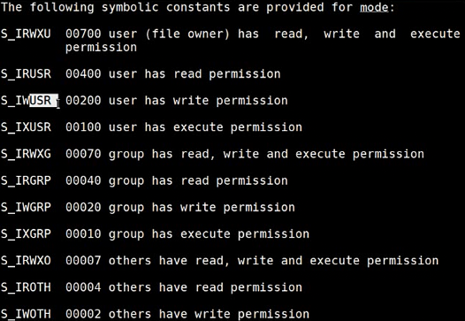

# 文件操作

打开，读或写，关闭

open

read

write

close

C语言中的打开文件函数：`fopen`，库函数，返回值为`FILE *`，有`stdin`、`stdout`、`stderr`。
## 文件描述符
fd

是一个`>=0`的整数。每打开一个文件，就按照**最小可用原则**占用一个文件描述符（假如现在已被占用的fd最大值为10，而0号是空缺的，则占用0号）。

多次打开同一个文件，可得到多个不同的文件描述符。
### 预定义的文件描述符
* 0：标准输入，默认是键盘
* 1：标准输出，默认是Shell对应的显示器
* 2：标准错误，也是Shell对应的显示器
## write
write to a file descriptor。包含于`<unistd.h>`

可通过`man 2 write`查询用法。`man 2`中大多都是系统调用的函数手册。
而`man 1`也有一个和write同名的，和系统调用不同，它是命令程序，多用于shell。

接口：
```c
ssize_t write(int fd, const void *buf, size_t count);
```
返回值：有符号整数。
成功则返回已写入的字节大小。失败则返回`-1`，设置errno值。

## 文件指针
文件刚打开时，文件的位置指针在头部。
## read
read from a file descriptor。包含于`<unistd.h>

接口：
```c
ssize_t read(int fd, void *buf, size_t count);
```
返回值：有符号整数
成功：
1. 返回已经读到的字节大小。并将文件指针向前移动该字节数。
2. 返回 0 则表示已经读到了文件末尾。

失败则返回`-1`，设置errno值。在这种情况下，文件指针是否发生变化是未定义的。

需要注意的是，手册里提到，如果返回值小于我们请求的大小，**不能定义为失败：
1. 可能是因为目前可读到的字节比较少：这种情况，可能是因为接近文件末尾，也可能是正在从一个管道或从一个终端读取。
2. 也可能读操作正在被一个信号（signal）中断。

ERRORS：
1. EAGAIN：文件描述符 fd 指向一个非套接字文件，且已被标记为非阻塞 (`O_NONBLOCK`)，读取操作将阻塞。有关 `O_NONBLOCK` 标志的更多详细信息，请参阅 `open(2)`。
2. EAGAIN 或 EWOULDBLOCK：文件描述符 fd 指向一个套接字文件，且已被标记为非阻塞 (`O_NONBLOCK`)，读取操作将阻塞。POSIX.1-2001 允许在这种情况下返回任一错误，并且不要求这些常量具有相同的值，因此可移植应用程序应该检查这两种可能性。

## open
需要包含以下头文件：
1. `<sys/types.h>`
2. `<sys/stat.h>`
3. `<fcntl.h>`

接口
```c
int open(const char *pathname, int flags);
int open(const char *pathname, int flags, mode_t mode);
```
flags，指示打开文件的方式。

1. `O_CREAT`：如果文件不存在则创建该文件。并且使用第3个参数`mode`设置权限。
    1. 如果搭配`O_EXCL`使用，可以防止多进程同时创建文件。如果文件存在，则返回错误EEXIST。
2. `O_WRONLY`：只写
3. `O_RDONLY`：只读
4. `O_RDWR`：读写
5. `O_APPEND`：尾部追加方式（打开后文件指针指向末尾）
6. `O_TRUNC`：若文件存在，且在`O_WRONLY`或`O_RDWR`的前提下，则文件长度将被截断为 0（清空）。如果文件是 FIFO 或终端设备文件，则 `O_TRUNC` 标志将被忽略。
7. `O_NONBLOCK` or `O_NDELAY`：以非阻塞模式打开文件，`open()` 以及对返回的文件描述符执行的任何后续 I/O 操作都不会导致调用进程等待。
    1. 注意，此标志的设置对 `poll(2)`、`select(2)`、`epoll(7)` 及类似接口的操作没有影响，因为这些接口仅通知调用者文件描述符是否“就绪”，这意味着在 `O_NONBLOCK` 标志已清除的情况下对文件描述符执行的 I/O 操作不会阻塞。
    2. 注意，此标志对常规文件和块设备没有影响；也就是说，无论是否设置了 `O_NONBLOCK`，当需要设备活动时，I/O 操作都会（短暂地）阻塞。由于 `O_NONBLOCK` 语义最终可能会实现，因此应用程序在为常规文件和块设备指定此标志时不应依赖于阻塞行为。

mode，指示`O_CREAT`创建文件时，赋予的权限。
有定义好的常量。
命名是有规律的：
`S_I`是固定开头
`RWX`表示可读、可写、可执行。
当前面是`RWX`3个权限都有时，后缀只有1个字符：`U`代表user，`G`代表group，`O`代表other。
当前面只有1个权限（R、W、X）时，后缀是3个字符：`USR`代表user，`GRP`代表group，`OTH`代表other。


实际的值（比如00700）代表什么意思？
1. 这是一个八进制数，所以要以0开头。
2. 首先，前面两位都是0
3. 后面三位：
    1. 第1个数对应用户权限；第2个数对应组权限；第3个数对应其他人权限。
    2. 每一位上，
        1. 1代表可执行（二进制的001）、
        2. 2代表可写（二进制的010）、
        3. 4代表可读（二进制的100）、
        4. 7代表可读可写可执行（二进制的111）。
    3. 那么，我们可以推断出，
        1. 可读可写是二进制的（110）即6。
        2. 可读可执行是二进制的（101）即5。
        3. 可写可执行是二进制的（011）即3。
4. 因此，一般的文件，可以设置为`0666`，即所有人可读可写。也可以设置为`0600`，表示只有拥有者可读可写。
## close
需要包含头文件`<unistd.h>`
接口
```c
int close(int fd);
```
返回值
成功返回0；
失败返回-1。
## lseek
重新定位文件偏移量
需要包含头文件：
1. `<sys/types.h>`
2. `<unistd.h>`

接口：
```c
off_t lseek(int fd, off_t offset, int whence);
```
offset，有符号。如果要往末尾方向偏移则需要正数，往头方向则需要负数。
whence，指示在哪个位置进行偏移。
1. `SEEK_SET`，从0偏移offset。
2. `SEEK_CUR`，从当前位置偏移offset。
3. `SEEK_END`，从末尾偏移offset。如果offset被设置为0则返回文件大小。这是通过fd取文件大小的唯一方法。

返回值：
返回当前文件指针相对于文件头部的偏移量。
发生错误则返回`-1`。
# mybash

```c
#include<stdio.h>
#include<unistd.h>
#include<stdlib.h>
#include<assert.h>
#include<string.h>
#include<sys/wait.h>
#include<errno.h>
#include<pwd.h>
char * get_cmd(char buff[], char* myargv[])
{
    if(NULL==buff || NULL==myargv)
    {
        return NULL;
    }
    char *s = strtok(buff," ");
    int i = 0;
    while(s != NULL)
    {
        myargv[i++] = s;
        s = strtok(NULL," ");
    }
    return myargv[0];
}
void print_info()
{
    //getuid -->unistd.h
    int id = getuid();
    char *s = "$";
    if(id == 0)//root is 0
    {
        s = "#";
    }
    //#inlcude<pwd.h>
    //getpwuid
    struct passwd* ptr = getpwuid(id);//get info of user through uid
    if(ptr == NULL)
    {
        printf("$");
        fflush(stdout);
        return;
    }
    //gethostname-->unistd.h
    char hostname[64] = {0};
    if(gethostname(hostname,64)==-1)
    { 
        printf("$");
        fflush(stdout);
        return;
    }
    //chdir & getcwd --> #include<unistd.h>
    char pwd_buff[128] = {0};
    if(getcwd(pwd_buff, 128)==NULL)
    {    
        printf("$");
        fflush(stdout);
        return;
    }
    //ptr->pw_name:用户名字。（xcg）				   -->getpwuid-->pwd.h
    //hostname:主机名。（ubuntu）					   -->gethostname-->unistd.h
    //pwd_buff:当前目录完整信息（/home/xcg/c219/1024） -->getcwd-->unistd.h
    //s:管理员或普通标识（#为管理员，$为普通）			-->getuid-->unistd.h
    //最后效果：xcg @ ubuntu : /home/xcg/c219/1024 $
    printf("%s@%s:%s%s ", ptr->pw_name, hostname, pwd_buff,s);
    fflush(stdout);
    /*
    char **p = engv;
    while(*p != NULL)
    {
        if(strncmp(*p,"PWD",3)==0)
        {
            char *s = &((*p)[4]);
            printf("%s",s);
            break;
        }
        p++;
    }
    printf("$ ");
    */
}
int main(int argc, char* argv[], char* engv[])
{
    while(1)
    {
        print_info();//打印[用户名字@主机信息:当前目录$]
        
        //键盘获取[命令、命令参数]字符串
        char buff[128] = {0};
        fgets(buff,128,stdin);
        buff[strlen(buff)-1] = 0;//remove the \n
        //存放解析的命令参数
        char * myargv[10] = {0};
        char * cmd = get_cmd(buff,myargv);
        if(NULL == cmd)
        {
            continue;
        }
        else if(strcmp(cmd,"exit") == 0)
        {
            break;
        }
        else if(strcmp(cmd,"cd")==0)
        {
            //chdir()
            if(myargv[1] == NULL)
            {
                continue;
            }
            if(chdir(myargv[1]) == -1)//chdir-->unistd.h
            {
                perror("cd err"); //#include<errno.h>
            }
            continue;//redo the bash
        }
        else
        {
            //fork + exec
            pid_t pid = fork();
            if(pid == -1)
            {
                printf("error\n");
                continue;
            }
            if(pid == 0)
            {
                execvp(cmd,myargv);
                printf("execvp error\n");
                exit(1);
            }
            wait(NULL);
        }
    }
}

```

# pwd和ls

pwd可以输出当前目录的路径信息。

用unistd.h下的getcwd函数获取到buff字符串中即可。

```c
#include<unistd.h>
int main()
{
    char buff[128] = {0};
    if(getcwd(buff,128)==NULL)
    {
        return;
    }
    printf("%s\n",buff);
    exit(0);
}
```

ls是打印当前目录下的所有文件名。

即需要扫描目录。

## 目录流

目录实际上是一个抽象的概念，因为实际上并没有实际的文件来存储目录，而是一个目录流。就类似于“219班”这个概念，实际上并没有219班这个人，只是抽象出来的一个可以代表一些文件的集合名词。

与目录操作有关的函数在dirent.h头文件中声明，使用一个名为DIR的结构作为目录操作的基础。指向这个结构体的指针（DIR \*）被称为目录流，用于完成各种目录的操作。与操作普通文件的文件流（FILE \*）非常相似。

涉及到的函数有：

1. opendir
   1. 
2. readdir
   1. 
   2. 返回的指针的指向的结构体是dirent。包含的内容有：
      
3. telldir
4. seekdir
5. closedir

```c
#include<unistd.h>
#include<string.h>
#include<dirent.h>
int main()
{
    char buff[128] = {0};
    if(getcwd(buff,128))==NULL)
    {
        return 0;
    }
    DIR * p = opendir(buff);//打开通过getcwd获取的当前目录字符串所指定的目录，获取一个目录流
    if(p==NULL)
    {
        return 0;
    }
    struct dirent * p_dirent = NULL;
    while((p_dirent = readdir(p))!=NULL)
    {
        printf("%s  ",p_dirent->d_name);
    }
    closedir(p);
    return 0;
}
```

```bash

```

