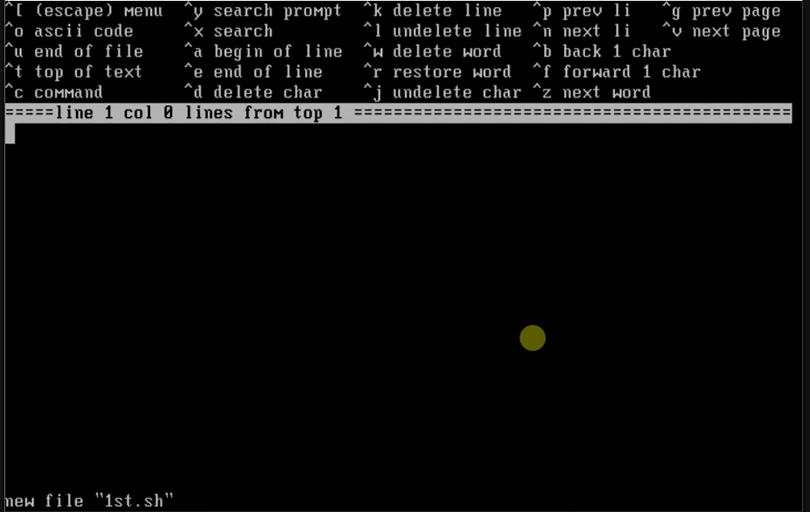
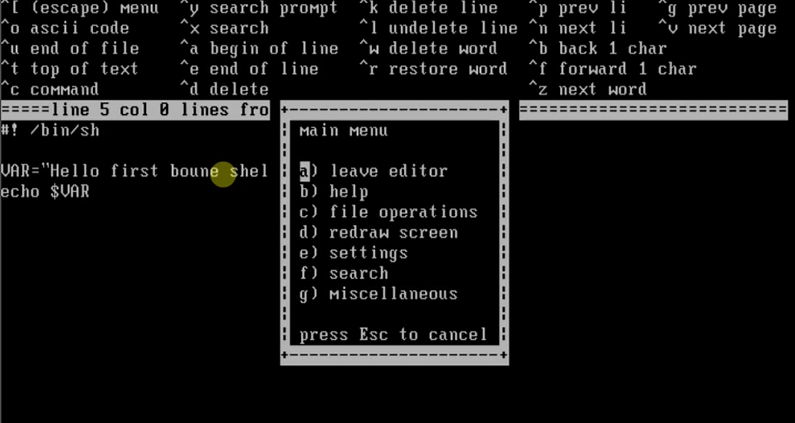
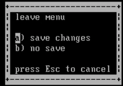
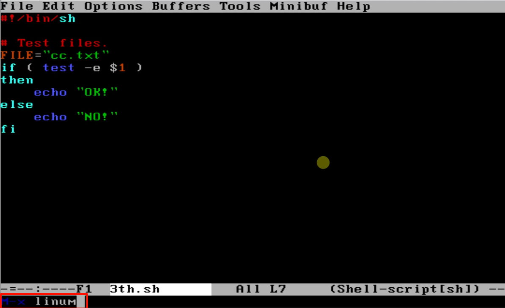
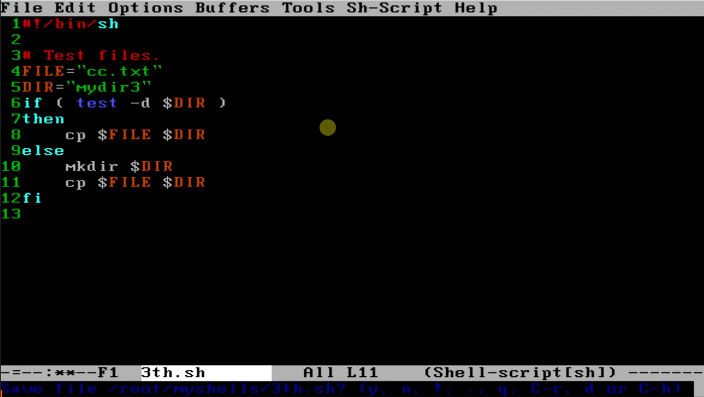

# 有哪些
vi、vim、Emacs、ee（Unix自带的）

Emacs是最难用的，但是如果掌握了，能获益不少？
# ee编辑器
```shell
ee 1st.sh
```
进入编辑器后的样子：

上半部分：按Ctrl加相应的符号可以调用一些功能。



## 按Ctrl加`[`或按ESC进入菜单


在按`a`离开编辑器时，如果没保存文件会提示你保存：


# Emacs编辑器
打开文件。

```sh
emacs 3th.sh
```

按一下ESC，再按一下x（映射Emacs的M-x命令）。在底行输入linum，表示：Line Num，设置显示行号。



## 退出、保存
Ctrl加x、Ctrl加c是退出。
之后，底行会问你，是否保存，按y即可保存。


