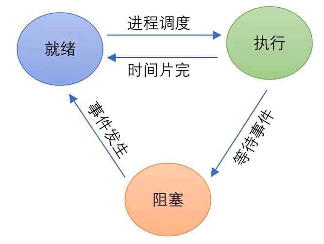
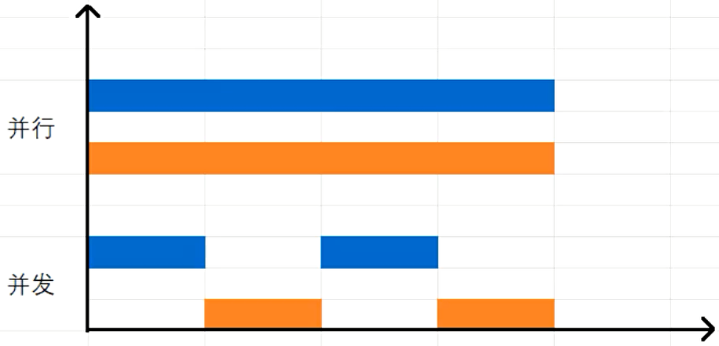
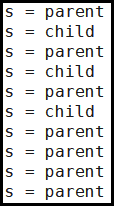
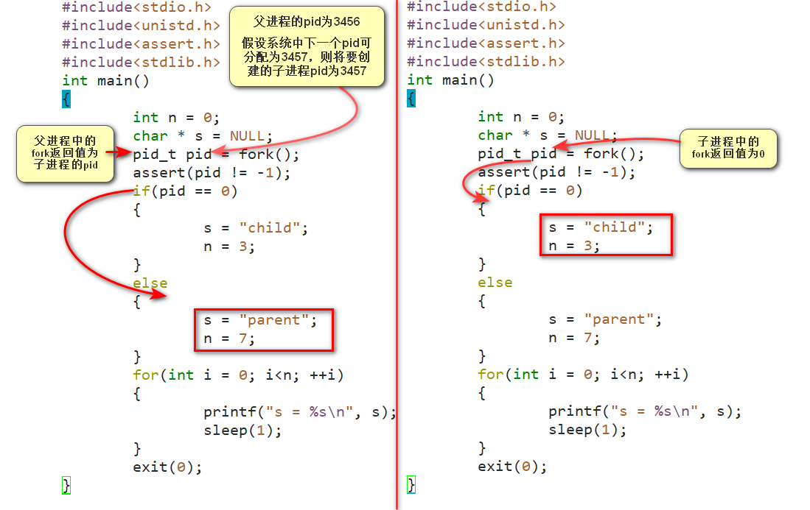
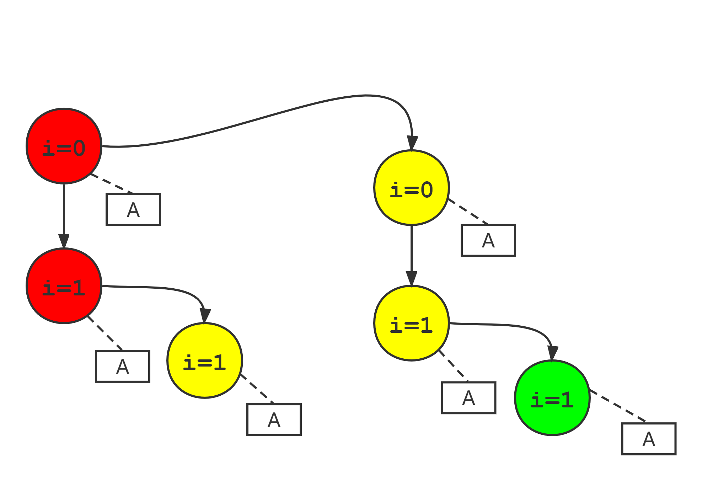
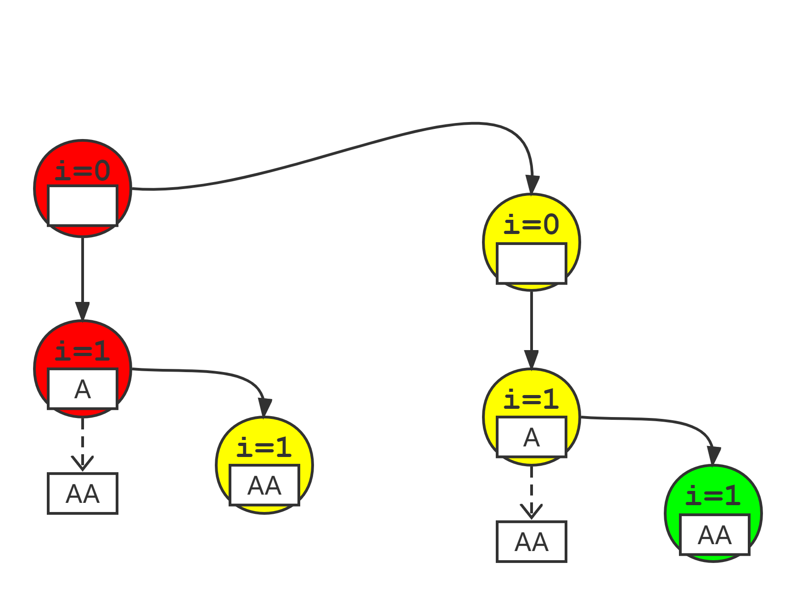
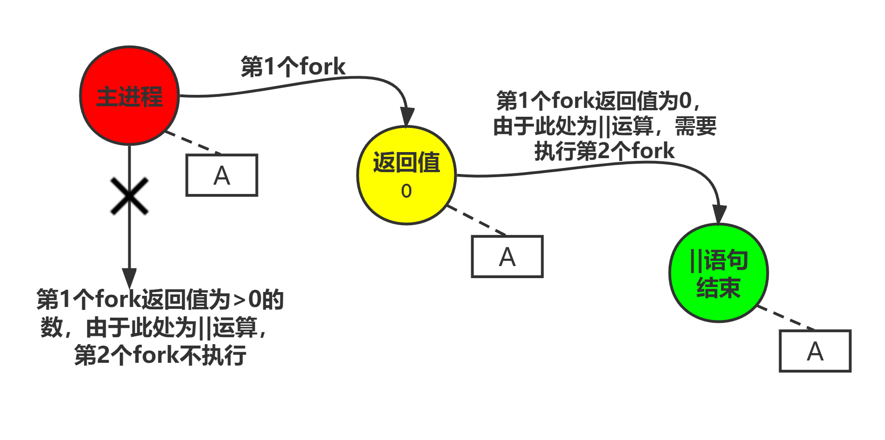
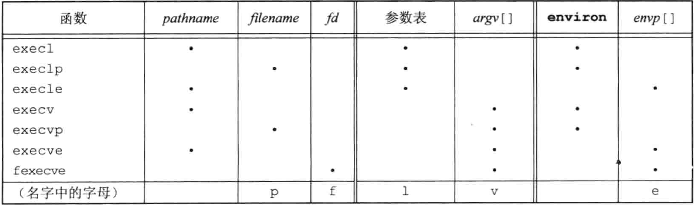
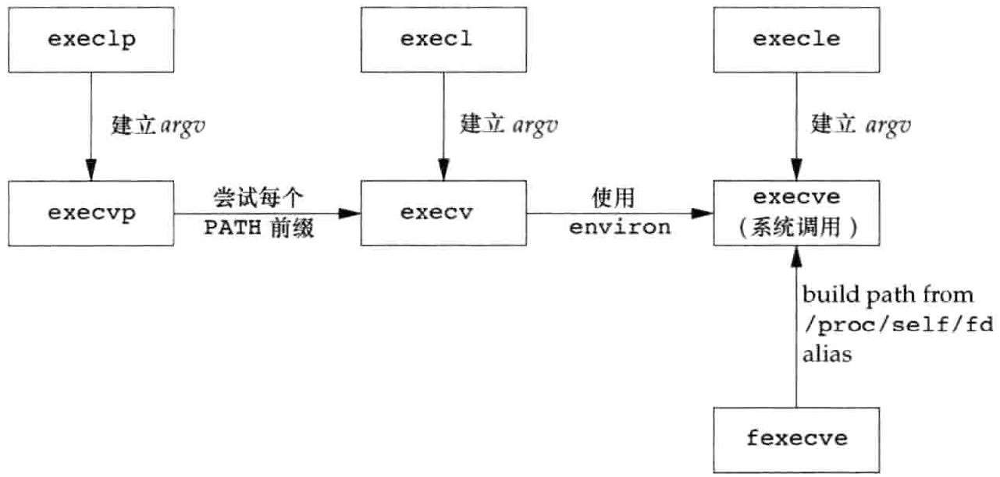

# 内容

1. 进程的概念
2. 进程控制块、pid
3. 进程状态
4. 进程的并发、并行
5. 相关命令
6. 进程的复制
7. printf引出的思考
8. 孤儿进程
9. 僵死进程
10. 写时拷贝技术
11. 进程的替换

# 进程

进程：一个正在执行（运行）的程序。

程序：由一条条的指令构成。

# 进程控制块

进程控制块，即pcb，process control block，对应于Linux上的数据结构是`struct task_struct`。

里面包含了关于进程的详细的信息，如**进程标识符(pid)**、**进程名字(name)**、**用户标识符(uid, 用于区分进程属于哪个用户)**、组标识符(gid)、**进程退出码(`exit_code`)**等等。但最为重要的，只需要记住——`pid`，即进程标识符，它是唯一标识一个进程的id号。

## 相关api

* 获取pid

```c
#include<unistd.h>
pid_t getpid(void);		//获得当前进程pid
pit_t getppid(void);	//获得当前进程父进程的pid
```


# 进程状态

就绪、运行、阻塞


# 并发与并行



并发不一定可以并行。但可以模拟并行，实际不是并行。

并行一定并发。并行是一种特殊的并发情况。只有在多处理器或多核环境中才能并行。

# 相关命令

## ps

可以查看终端中当前运行的进程

```bash
ps -f #查看更详细的信息
ps -e #显示系统所有的进程（不加e的话默认只是该用户的进程）
ps -ef #是e和f的复合命令
```

## kill

结束进程

```bash
Ctrl + C只可以结束在前台的进程。
Ctrl + Z停止一个前台的进程
kill pid #
kill -9 pid #强制
pkill 进程名 #把所有叫某名的进程都结束
ps -ef | grep sleep
```

## &

后台运行符

```bash
sleep 100 &

```

## jobs

显示当前终端的任务

```bash
#把前台运行的程序转到后台运行
sleep 200
^Z
jobs #显示当前终端（后台）的任务
[1] 已停止		sleep 200
bg %1 	
		#bg %任务号 将后台运行或挂起的进程挪到前台执行
		#fg %任务号 将挂起的进程唤醒到后台执行
```

## bg/fg

`bg %任务号`将后台运行或挂起的进程挪到前台执行

`fg %任务号`将挂起的进程唤醒到后台执行

## top

查看系统资源使用情况以及进程信息（按q退出）

# 编译链接过程

win可执行文件的标识是PE，linux的标识是ELF。

* gcc分步编译链接过程

1. 预编译 - `gcc -E main.c -o main.i`
   1. 展开头文件，扫描`/usr/include`中引用到的头文件
2. 编译 - `gcc -S main.i -o main.s`
   1. 检查语法错误，生成汇编代码。
3. 汇编 - `gcc -c main.s -o main.o`
   1. 转换为二进制代码（ELF文件格式）。还不可执行。只是把自己写的代码翻译成了二进制代码，还有其他的main函数之前的引入的库函数，除了自己的代码，还要链接别人的代码。
4. 链接

* 一步编译链接：`gcc -o main main.o`

## 多文件编译

```bash
#两步编译链接

#先全部编译为机器指令--.o文件
gcc -c main.c add.c max.c
#再链接成一个文件
gcc -o main add.o max.o main.o	#文件顺序可以不一样
```

```bash
#一步编译链接
gcc -o main main.c add.c max.c	
```

更多的编译链接内容请查看“Linux_库”。

# 进程的复制 - fork

`pid_t fork(void);`

对于返回值`pid_t`，Linux内核`2.4.0`版本的定义为：

```c
typedef int		__kernel_pid_t;
typedef __kernel_pid_t	 pid_t;
//	相当于pid_t 就是 int类型。
```

调用fork函数会生成一个进程，调用者的进程身份成为父进程，生成的新进程为子进程。在父进程中fork函数返回值：成功则返回子进程的pid，失败则返回-1；在子进程中fork函数返回值为0。

## 一个代码说明要点

```c
#include<stdio.h>	//printf
#include<unistd.h>	//sleep	fork
#include<assert.h>	//assert
#include<stdlib.h>	//exit
int main()
{
    int n = 0;
    char * s = NULL;
    pid_t pid = fork();
    assert(pid != -1);
    if(pid == 0)
    {
        s = "child";
        n = 3;
    }
    else
    {
        s = "parent";
        n = 7;
    }
    for(int i = 0; i < n; ++i)
    {
        printf("s = %s\n", s);
        sleep(1);
    }
    exit(0);
}
```

运行结果



分析



## 要点

1. fork后子进程复制父进程的地址空间作为副本，包括数据段、栈段、堆段等等，但子进程和父进程共享代码段。（没有使用写时拷贝技术时）
2. 父进程复制生成子进程后，**由于进程会记录目前代码运行的过程信息，则子进程就会从fork处开始执行代码，前面的代码不再执行**。父进程和子进程从fork处开始分支。
   * 虽然子进程前面的代码不再执行，但是不意味着前面的变量是个随机值。而是利用了父进程执行过前面的指令，子进程复制过来可以读取、使用。
3. fork之后父子进程各自独立，并发运行。所以程序运行结果可能呈现出不确定性。因此打印的先后顺序无所谓，没有正确不正确之分。

## fork函数的变体

Linux 3.2.0提供了另一种新进程创建函数`clone(2)`系统调用。这是一种fork的推广形式，它允许调用者控制哪些部分由父进程和子进程共享。

FreeBSD 8.0提供了`rfork(2)`系统调用，它类似于Linux的`clone`系统调用。`rfork`调用是从Plan 9操作系统派生出来的。

Solaris 10提供了两个线程库：一个用于POSIX线程(pthreads)，另一个用于Solaris线程。在这两个线程库中，fork的行为有所不同。对于POSIX线程，fork创建一个进程，它仅包含调用该fork的线程；但对于Solaris线程，fork创建的进程包含了调用线程所在进程的所有线程的副本。在Solaris 10中，这种行为改变了。不管使用哪种线程库，fork创建的子进程只保留调用线程的副本。Solaris也提供了`fork1`函数，它创建的进程只复制调用线程。还有`forkall`函数，它创建的进程复制了进程中所有的线程。

# 写时拷贝技术

没有改变页面内容，暂时共享。要改变页面，再复制。

由于在fork之后经常跟随着exec，所以现在的很多实现并不执行一个父进程数据段、栈和堆的完全副本。作为替代，使用了写时复制(Copy-On-Write, COW)技术。这些区域由父进程和子进程共享，而且内核将它们的访问权限改变为只读。**如果父进程和子进程中的任一个试图修改这些区域，则内核只为修改区域的那块内存制作一个副本**，通常是虚拟存储系统中的一“页”。

## 细节

进程复制的具体过程：

1. 向系统申请一个pcb进程控制块，生成新的pid。
2. 若申请成功，则复制父进程的pcb进程控制块结构体信息到子进程的pcb中。
3. 把进程体内存空间浅拷贝给子进程。即映射各种资源。
4. 子进程试图改写进程体空间信息时，再实际深拷贝一份空间，最终改的是自己的空间。

# printf引出的思考

## 前期铺垫

```c
#include<stdio.h>	//printf
#include<unistd.h>	//exit
#include<stdlib.h>	//sleep
int main()
{
    printf("hello");
    sleep(3);
    exit(0);
}
//睡眠3秒后，退出前才打印。
```

```c
#include<stdio.h>
#include<unistd.h>
#include<stdlib.h>
int main()
{
    printf("hello");
    sleep(3);
    _exit(0);
}
//睡眠3秒后，不打印，直接退出。
```

```c
#include<stdio.h>
#include<unistd.h>
#include<stdlib.h>
int main()
{
    printf("hello");
    fflush(stdout);
    sleep(3);
    _exit(0);
}
//先打印，再睡眠3秒，退出。
```

> `exit`和`_exit`的区别：
>
> `_exit`啥也不干，直接鲁莽退出程序。
>
> `exit`会先帮你刷新缓冲区，才退出程序，以面错过遗留信息。相当于`fflush(stdout)`+`_exit(0)`。`return`和`exit`相似。

printf函数并不会直接将数据输出到屏幕，而是先放到缓冲区中，待某时把缓冲区数据再发送给内核，内核处理后写入到IO设备中。只有以下三种情况满足，才会输出到屏幕。 

1. 缓冲区满
2. 强制刷新缓冲区，即调用`fflush(stdout)`。
3. 调用`exit(0)`程序结束时，注意，必须是`exit(0)`，不能直接`_exit(0)`。

## 开始试探

```c
#include<stdio.h>
#include<stdlib.h>
#include<unistd.h>
int main()
{
    for(int i = 0; i<2; ++i)
    {
        fork();
        printf("A\n");
    }
    exit(0);
}
```

运行结果

```
A
A
A
A
A
A

```

分析


每换行一次即清空**行缓冲区**，会立即输出，不会遗留给子进程。

## 再来一个

```c
#include<stdio.h>
#include<stdlib.h>
#include<unistd.h>
int main()
{
    for(int i = 0; i<2; ++i)
    {
        fork();
        printf("A");
    }
    exit(0);
}
```

运行结果

```
AAAAAAAA
```

分析


每次的`printf`函数不会立即输出，内容放到了缓冲区，而且会遗留给子进程。直到进程结束才会输出。本质：两个父进程分别输出两个A，两个子进程也分别输出两个A。

## 试试这个

```c
#include<stdio.h>
#include<stdlib.h>
#include<unistd.h>
int main()
{
    fork() || fork();
    printf("A\n");
    exit(0);
}
```

运行结果

```
A
A
A

```

分析


做完了题，别急着走！你还没收拾摊子。

# 孤儿进程

子进程未结束，父进程先结束时，子进程就变成了孤儿进程，其父进程会改变，通常变为1。详见"Linux_exit"。

# 僵死进程

子进程先结束，父进程没有调用wait获取子进程的退出码，那么子进程就成为僵死进程。wait函数的参数是用于接收退出码的指针变量。详见"Linux_exit"。

# 进程替换 - exec

用fork函数创建新的子进程后，子进程往往要调用一种`exec`函数以执行另个程序。当进程调用一种`exec`函数时，该进程执行的程序完全替换为新程序，而新程序则从其`main`函数开始执行。因为调用`exec`并不创建新进程，所以前后的进程ID并未改变。**exec只是用磁盘上的一个新程序替换了当前进程的正文段、数据段、堆段和栈段。**

exec函数不是一个具体的函数，而是一系列函数。有7种不同的exec函数可供使用，它们常常被统称为`exec`函数，我们可以使用这7个函数中的任一个。这些exec函数使得UNIX系统进程控制原语更加完善。用`fork`可以创建新进程，用`exec`可以初始执行新的程序。`exit`函数和`wait`函数处理终止和等待终止。这些是我们需要的基本的进程控制原语。可以使用这些原语构造另外一些如`popen`和`system`之类的函数。

> 控制UNIX进程的四大原语：`fork`、`exec`、`exit`、`wait`

## API

```c
#include<unistd.h>
int execl(const char *pathname, const char *arg0, .../* (char*)0 */);
int execv(const char *pathname, char * const argv[]);
int execle(const char *pathname, const char *arg0, ... /* (char*)0, char * const envp[] */);
int execve(const char *pathname, char * const argv[], char * const envp[]);

int execlp(const char *filename, const char * arg0, ... /* (char*)0 */);
int execvp(const char * filename, char * const argv[]);
int fexecve(int fd, char * const argv[], char * const envp[]);
//7个函数返回值：若出错，返回-1；若成功，不返回。
```

## 区别

这些函数之间的第一个区别是前4个函数取**路径名**作为参数，后2个函数则取**文件名**作为参数，最后一个取**文件描述符**作为参数。

当指定`filename`作为参数时（即`execlp, execvp`）：

1. 如果filename中包含`/`，则就将其视为路径名；
2. 否则就按`PATH`环境变量，在它所指定的各目录中搜寻可执行文件。

> `PATH`变量包含了一张目录表（称为路径前缀），目录之间用冒号（`:`）分隔。例如，下列`name=value`环境字符串指定在4个目录中进行搜索。
>
> `PATH=/bin:/usr/bin:/usr/local/bin:.`
>
> 最后的路径前缀`.`表示当前目录。（零长前缀也表示当前目录。在value的开始处可用`:`表示，在行中间则要用`::`表示，在行尾以`:`表示。）

> 出于安全性方面的考虑，有些人要求在搜索路径中决不要包括当前目录。参见`Garfinkel等[2003]`。

> 如果`execlp`或`execvp`使用路径前缀中的一个找到了一个可执行文件，但是该文件不是由连接编辑器产生的机器可执行文件，则就认为该文件是一个shell脚本，于是试着调用`/bin/sh`，并以该`filename`作为shell的输入。

`fexecve`函数避免了**寻找**正确的可执行文件，而是**依赖调用进程(rely on the caller)**来完成这项工作。通过使用一个文件描述符，**调用进程(the caller)**可以使用文件描述符验证所需要的文件并且无竞争地执行该文件。否则，拥有特权的恶意用户就可以在**找到文件位置并且验证之后**，但**在调用进程(the caller)执行该文件之前**，**替换可执行文件（或可执行文件的部分路径）**，具体可参考TOCTTOU错误(time-of-check-to-time-of-use)。

>TOCTTOU错误的基本思想是：
>
>如果有两个基于文件的函数调用，其中二个调用依赖于第一个调用的结果，则程序是脆弱的。因为两个调用并不是原子操作，在两个函数调用之间文件可能改变了，这样也就造成了第一个调用的结果就不再有效，使得程序最终的结果是错误的。
>
>文件系统命名空间中的TOCTTOU错误通常处理的就是那些颠覆文件系统权限的小把戏，这些小把戏通过骗取特权程序降低特权文件的权限控制或者让特权文件打开一个安全漏洞等方式进行。
>
>`Wei和Pu[2005]`在UNIX文件系统接口中讨论了`TOCTTOU`的缺陷。

---

第二个区别与参数表的传递有关(`l`表示列表`list`，`v`表示矢量`vector`)。函数`execl`、`execlp`和`execle`要求将新程序的每个命令行参数都说明为一个单独的参数。这种参数表以空指针结尾。对于另外4个函数(`execv`、`execvp`、`execve`和`fexecve`)，则应先构造一个指向各参数的指针数组，然后将该数组地址作为这4个函数的参数。

在使用`ISO C`原型之前，对`execl`、`execle`和`execlp`三个函数表示命令行参数的一般方法是：
`char *arg0, char *arg1, ..., char *argn, (char *)0`
这种语法显式地说明了最后一个命令行参数之后跟了一个空指针。如果用常量0来表示一个空指针，则必须将它强制转换为一个指针；否则它将被解释为整型参数。如果一个整型数的长度与`char *`的长度不同，那么exec函数的实际参数将出错。

---

最后一个区别与向新程序传递环境表相关。以`e`结尾的3个函数(`execle`，`execve`和`fexecve`)可以传递一个指向环境字符串指针数组的指针。其他4个函数则使用调用进程中的`environ`变量为新程序复制现有的环境(如果系统支持`setenv`和`putenv`这样的函数，则可更改当前环境和后面生成的子进程的环境，但不能影响父进程的环境)。

通常，一个进程允许将其环境传播给其子进程，但有时也有这种情况：进程想要为子进程指定某一个确定的环境。例如，在初始化一个新登录的shell时，login程序通常创建一个只定义少数几个变量的特殊环境，而在我们登录时，可以通过shell启动文件，将其他变量加到环境中。

在使用`ISO C`原型之前，`execle`的参数是：

`char *pathname, char *arg0, ..., char *argn, (char *)O, char *envp[]`

从中可见，最后一个参数是指向环境字符串的各字符指针构成的数组的指针。而在`ISO C`原型中，所有命令行参数、空指针和envp指针都用省略号(`...`)表示。

这7个exec函数的参数很难记忆。函数名中的字符会给我们一些帮助。字母p表示该函数取`filename`作为参数，并且用`PATH`环境变量寻找可执行文件。字母`l`表示该函数取一个参数表，它与字母`v`互斥。`v`表示该函数取一个`argv[]`矢量。最后，字母`e`表示该函数取`envp[]`数组，而不使用当前环境。



execl：路径加名称（指定的是哪个程序），加可变参（第一个参数是当前程序的**名字**），直到空指针。默认是当前环境变量。

execlp：和execl一样。p指的是当前环境命令。可以直接写“ps”，不用写绝对路径。

execle：比execl的NULL后多了一个参数，需要传入自定义的环境变量。

**execv**：路径加名称（指定的是哪个程序），中间的可变参换为了一个字符串数组。我们传入的数组可以多余开辟空间，填充0。则NULL参数可以省略。**较灵活，常用**。

execvp：p指的是当前环境下，即**默认使用的是系统/usr/bin下的相关命令**。比如可以直接写“ps”，不用写绝对路径。中间的可变参换为了一个字符串数组。我们传入的数组可以多余开辟空间，填充0。则NULL参数可以省略。**较灵活，常用**。

在很多UNIX实现中，这7个函数中只有`execve`是内核的系统调用。另外6个只是库函数它们最终都要调用该系统调用。这7个函数之间的关系如图。



在这种安排中，库函数`execlp`和`execvp`使用`PATH`环境变量，查找第一个包含名为`filename`的可执行文件的路径名前缀。`fexecve`库函数使用`/proc`把文件描述符参数转换成路径名，`execve`用该路径名去执行程序。

这描述了在`FreeBSD 8.0`和`Linux 3.2.0`中是如何实现`fexecve`的。其他系统采用的方法可能不同。例如，没有`/proc`和`/dev/fd`的系统可能把`fexecve`实现为系统调用，把文件描述符参数转换成`i节点指针`，把`execve`实现为系统调用，把路径名参数转换成`i节点指针`，然后把`execve`和`fexecve`中剩余的`exec`公共代码放到单独的函数中，调用该函数时传入执行文件的`i节点指针`。

## 属性迭代

在执行exec后，进程ID没有改变。且新程序从调用进程继承了下列属性：

| 继承的属性                                               |
| -------------------------------------------------------- |
| 进程ID和父进程ID                                         |
| 实际用户ID和实际组ID                                     |
| 附属组ID                                                 |
| 进程组ID                                                 |
| 会话ID                                                   |
| 控制终端                                                 |
| 闹钟尚余留的时间                                         |
| 当前工作目录                                             |
| 根目录                                                   |
| 文件模式创建屏蔽字                                       |
| 文件锁                                                   |
| 进程信号屏蔽                                             |
| 未处理信号                                               |
| 资源限制                                                 |
| nice值（遵循XSI的系统）                                  |
| `tms_utime`、`tms_stime`、`tms_cutime`以及`tms_cstime`值 |

> 对打开文件的处理与每个描述符的**执行时关闭(close-on-exec)标志值**有关。这个与`FD_CLOEXEC`标志有关，进程中每个打开描述符都有一个执行时关闭标志。若设置了此标志，则在执行exec时关闭该描述符；否则该描述符仍打开。所以，除非特地用`fcntl`设置了该执行时关闭标志，否则系统的默认操作是在exec后仍保持这种描述符打开。
>
> `POSIX.1`明确要求在`exec`时关闭**打开目录流(open directory streams)**。这通常是由opendir函数实现的，它调用`fcntl`函数为对应于打开目录流的描述符设置执行时关闭标志。

注意，在exec前后实际用户ID和实际组ID保持不变，而有效ID是否改变则取决于所执行程序文件的设置用户ID位和设置组ID位是否设置。**如果新程序的设置用户ID位已设置，则有效用户ID变成程序文件所有者的ID；否则有效用户ID不变**。对组ID的处理方式与此相同。
