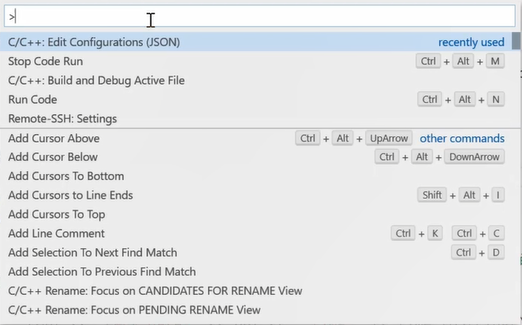
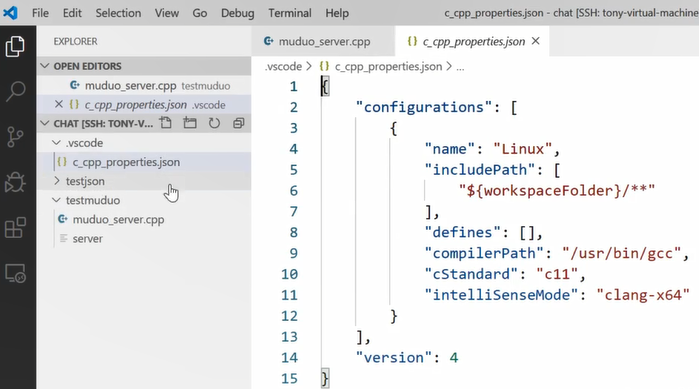
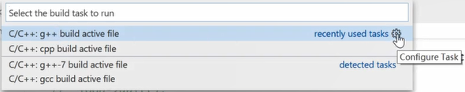
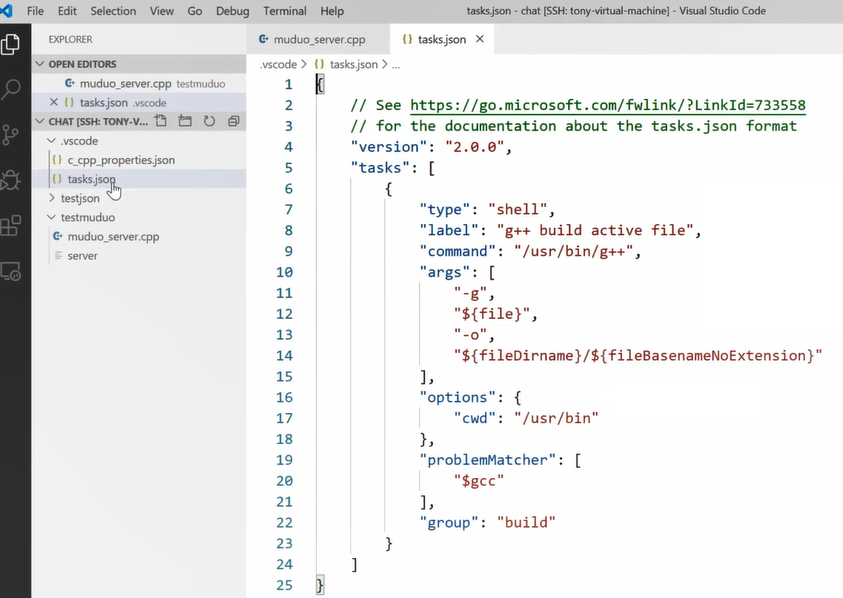

# 如何在vscode下配置链接库(.so)

* 配置头文件的搜索路径
* 配置库文件的搜索路径
* 配置需要链接的.so库

按快捷键F1可把vscode的配置对话框打开，进行检索，我们对cpp文件的编译链接进行配置，输入Edit，找C/C++的条目。




此处的json文件就是cpp文件编译的配置文件。



```bash
配置要点：
	g++ -I头文件搜索路径 -L库文件搜索路径 -l库的名称
	includePath可以自定义添加文件的搜索路径	# usr/(local/)include不用加，是全系统通用的
	cppstandard - 如: "cppStandard" : "c++11"
	
```

`Ctrl + shift + B`：是对build相关的配置，选择C/C++条目后面的齿轮。点进去发现是一个`task.json`。





```bash
配置要点：
	"command"是选择哪个路径下的C++编译器
	"args"是编译链接指令后面所带的可加参数的配置信息
		可在最后一行后面加自己相加的参数
		比如: "${...}",
			 "-lmuduo_net",
			 "-lmuduo_base",
			 "-lpthread"
```

除了`c_cpp_properties.json`、`tasks.json`还有个`launch.json`配置文件，是关于调试、运行的。
