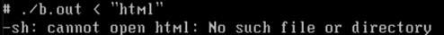
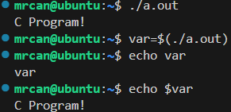
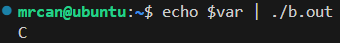

# 有哪些
有标准输入、标准输出重定向。
有命令代换。
有管道。
# 标准输出重定向
```c
#include <stdio.h>
int main()
{
    printf("C Program!\n");
    return 0;
}
```
编译为`a.out`。
`>`为完全覆盖写。
```sh
./a.out > aa.txt
```
目前`aa.txt`内容为
```
C Program!
```
`>>`为追加写。
```sh
./a.out >> aa.txt
```
目前`aa.txt`内容为
```
C Program!
C Program!
```
## 应用🌟
>我们想在命令行把程序执行后的输出结果输出到文件中时，可以这样：`./cmpxz DCE 20250709 >log.txt 2>&1`
# 标准输入重定向
```c
#include <stdio.h>
int main()
{
    char str[50];
    scanf("%s", str);
    printf("%s\n", str);
    return 0;
}
```
编译为`b.out`
```sh
./b.out < "hello"
```
提示：

所以标准输入重定向不能是简单的字符串，而是要重定向到一个文件。
先用`echo`把一些内容输入到一个文件中：
```sh
echo "hello" > aa.txt
./b.out < aa.txt
```
执行结果：
```
hello
```
# 管道
我们上面讲的标准输入、标准输出重定向都是文件和程序之间的交互。
而管道是进程之间的交互。

用上面的`a.out`和`b.out`示例一下管道：
```sh
./a.out | ./b.out
```
执行结果：
```
C
```
（没有显示全`C Program!`，是因为中间有空格，scanf只输入了空格前的C字符。）
# 命令代换
Command Substitution

形如：
```sh
var2=$(./a.out)
var3=$(./1st.sh)
```
即，可以把**程序、shell脚本运行的结果写入到环境变量**中。

便于脚本编写中涉及到的命令中转，可以先保存到环境变量中。使用命令代换，避免了在代码中编写读写文件的繁琐。




