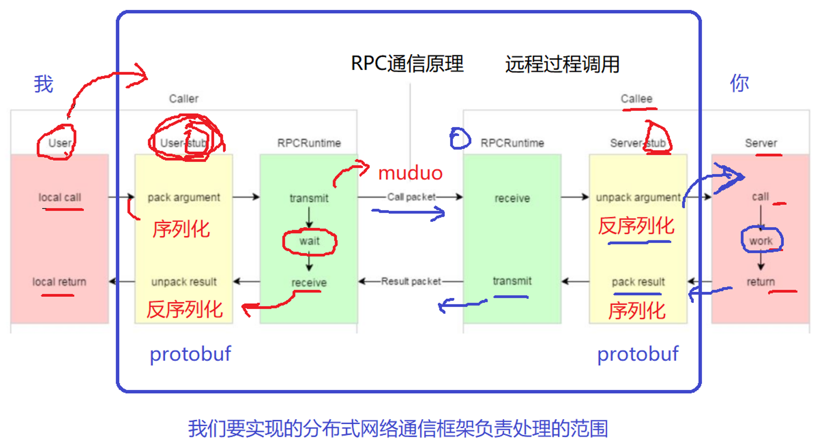

# RPC通信原理

remote procedure call，远程过程调用。分布式通信靠此实现。也是分布式通信底层要解决的问题。

# 整体流程

rpc方法名字，参数。参数一般需要打包。

从caller端的User到RPCRuntime，中间需要序列化的流程，即把参数打包的流程。序列化之后就可以通过网络传到远端另外的机器。网络可以选用muduo网络库。

caller端

1. User - **用户可见**
   1. local call - **用户可见**
2. User-stub
   1. pack argument
3. RPCRuntime
   1. transmit
   2. wait

远端callee端接收到RPC请求之后，从网络底层上报上来，需要把打包的参数进行解析，即反序列化为具体的信息，比如方法的标识、参数。传递到进程中执行某个函数。

callee端

1. RPCRuntime
   1. receive
2. Server-stub
   1. unpack argument
3. Server - **服务器可见**
   1. call - **服务器可见**
   2. work（执行函数） - **服务器可见**
   3. return - **服务器可见**

远端callee返回结果时，需要pack result，给结果内容打包，序列化。传送给caller。

1. Server
   1. return
2. Server-stub
   1. pack result
3. RPCRuntime
   1. transmit

caller端收到返回包后，唤醒，反序列化，解析为unpack result，生成本地对象。

1. RPCRuntime
   1. receive
2. User-stub
   1. unpack result
3. User - **用户可见**
   1. local return - **用户可见**

我们RPC框架要实现的东西，除了标识的用户可见、服务器可见的地方之外，都要实现并封装。



黄色部分：设计rpc方法参数的打包和解析， 也就是数据的序列化和反序列化， **使用Protobuf**。此部分称之为stub，意思是桩，是一个代理类的角色。

绿色部分：网络部分，包括寻找rpc服务主机，发起rpc调用请求和响应rpc调用结果，**使用muduo网络库和zookeeper服务配置中心**（专门做服务发现）。

mprpc框架主要包含以上两个部分的内容。

# 序列化、反序列化工具

用protobuf。

protobuf是二进制存储的。相比于xml、json的文本存储形式来说，
1. 二进制存储有节省空间的优点。在同等网络环境下，性能更优。
2. protobuf不需要存储额外的信息，而json存储的是key-value。protobuf只存储值数据。

可能的形式：
Json：
```json
name: "zhang san",
pwd: "123456"
```
Protobuf：
```protobuf
"zhangsan""123456"
```