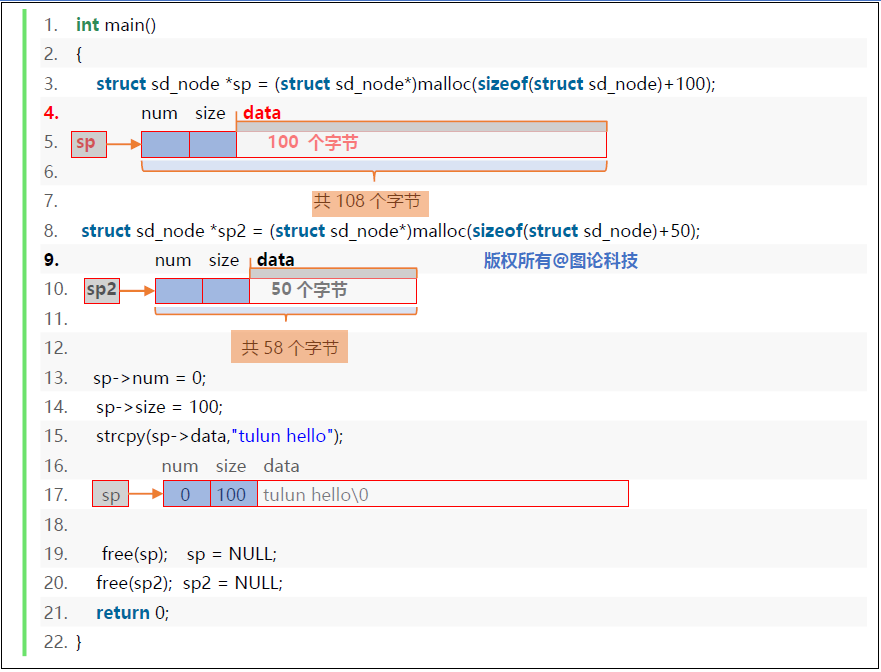
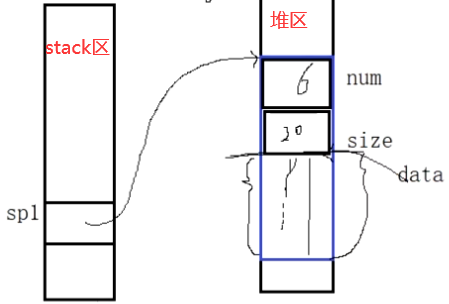
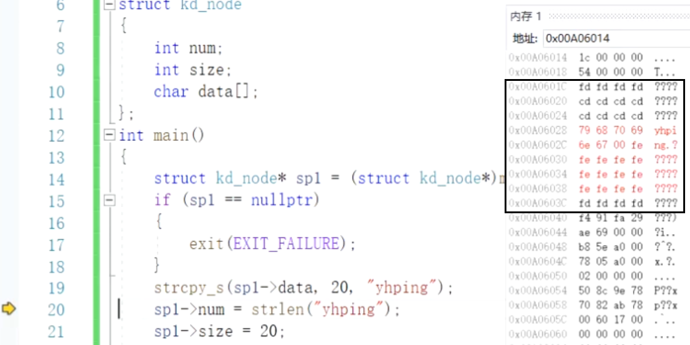
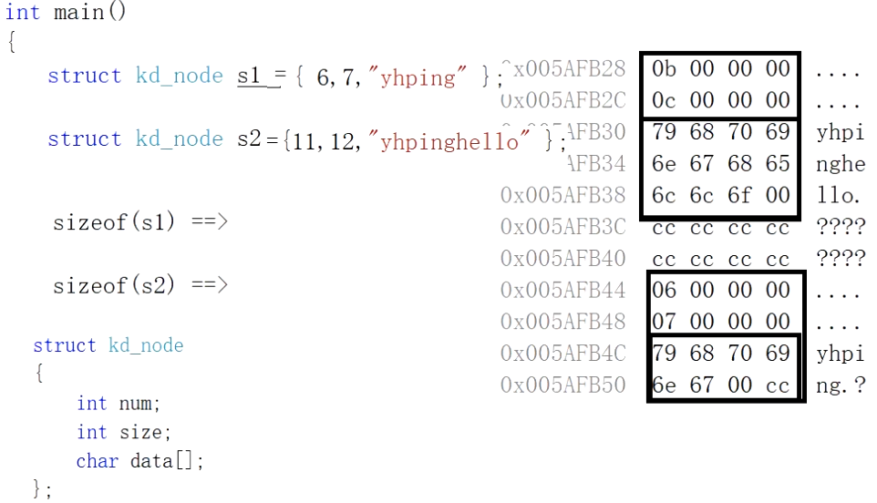
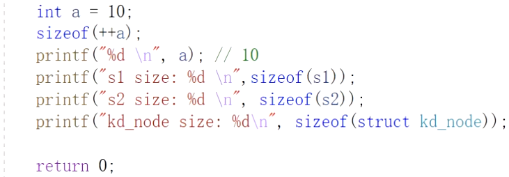
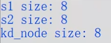
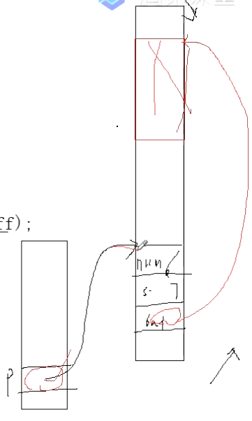
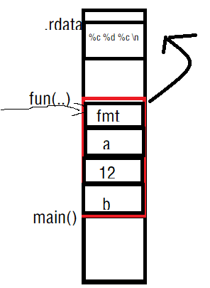

SDS指simple dynamic string，即简单动态字符串。

# Memcached与Redis的区别和选择

Memcached与Redis的区别和选择https://blog.csdn.net/qq_18671415/article/details/104540628

https://zhuanlan.zhihu.com/p/183993817

Redis 这几年的大热，现在已经替代 Memcached 成为缓存技术的首要中间件，作为大厂的带头兵，在 BAT 里面，Redis 也已经逐渐取代了 Memcached，广泛使用 Redis 作为缓存应用方案。

**1）速度更快**

Memcached 使用的是多线程模型，既然是多线程，就会因为全局加锁而带来性能损耗。而 Redis 使用的是单线程模型，没有锁竞争，速度非常快。

**2）数据类型更丰富**

Memcached 数据类型非常单一，只支持 String 数据类型，在业务实现上就非常有瓶颈。

而 Redis 支持 string(字符串)、hash(哈希)、list(列表)、set(集合)、zset(sorted set:有序集合) 等……丰富的数据类型可以让 Redis 在业务上大展拳脚。

这也是 Redis 能代替 Memcached 最重要的原因之一。

并且，Memcached 值最大上限为：1M，而 Redis 最大可以到：1GB。

**3）数据持久化**

Memcached 不支持持久化，Redis 支持。

缓存服务器断电后，Memcached 的数据是不能恢复的，而 Redis 可以将数据保久化在磁盘中，服务器重启的后可以加载再次使用，不会造成数据断电丢失。

比如，有些数据是直接放在缓存数据库中的，其他地方可能没有备份，如果丢失了，那可能会造成业务影响，这也是 Redis 非常有用的一个保障特性。

# 柔性数组

先看一个结构体的设计

```c
#define MAXLEN 1024 //1K  //对于操作系统层面来讲，分配、管理内存是以一页为单位的，占4K即1024*4=4096字节
typedef struct kd_node
{
    struct kd_node* left;
    struct kd_node* right;
    int dim;
    unsigned long long data[MAXLEN];//数据  //占用了1024*sizeof(unsigned long long)=8k字节
}kd_node;
```

在上面这段代码中，为了存储数据，申请了长度为1024的unsigned long long型数组。若是数据的长度远远小于MAXLEN，这样的设计是很浪费空间的。

对于数组，我们的原则是大开小用（尽可能开辟足够的空间，但使用时不能全都用上）。而对于动态内存分配，我们就可以更加的灵活运用，但代价是使用完后要释放掉。

C99标准中给出了新的设计方法，通过柔性数组可以解决这个问题。

```c
struct sd_node
{
    int num;//数据的长度，即已填入的数据占用的长度
    int size;//总长度
    char data[];//或char data[0];
    //数组的大小声明为0或不给出大小，称之为柔性数组。必须在最后位置声明，且一旦声明后面不能再声明其他结构。全局数组和局部数组不可如此定义。
};
int main()
{
    sizeof(struct sd_node);//8
}
```

在struct sd_node结构体中data仅仅是一个待使用的标识符，不占用存储空间。

用途：柔性数组的主要用途是为了满足长度可变的结构体。

用法：在一个结构体的最后，声明一个长度为0的数组，就可以使得这个结构体是可变长的。**对于编译器来说**，此时长度为0的数组并不占用空间，因为数组名本身不占空间，它只是一个偏移量。数组名这个符号本身代表了一个**不可修改的地址常量**。但对于这个数组的大小，我们可以进行动态分配。

注意：如果结构体是通过calloc/malloc/realloc等动态分配方式生成的，在不使用时需要释放相应的空间。

优点：比起在结构体中声明一个指针变量再进行动态分配的做法，柔性数组方法效率要高，因为简单。

缺点：在结构体中，数组为0的数组必须在最后声明，在设计结构体类型时有一定限制。



```c
int main()
{
    struct kd_node* sp1 = (struct kd_node*)malloc(sizeof(struct kd_node)+20);
    if(sp1==nullptr)
    {
        exit(EXIT_FAILURE);
    }
    strcpy_s(sp1->data,20,"yhping");//20指sp1->data的最大空间，使其安全拷贝
    sp1->num = strlen("yhping");
    sp1->size = 20;
    
    printf("size: %d \n",sp1->size);
    printf("num: %d \n",sp1->num);
    printf("data: %s \n",sp1->data);
    
    free(sp1);
    sp1 = nullptr;
    return 0;
}
```





## 易错





运行结果



sizeof的运算只发生在编译时期，因此只计算变量的类型的大小，经典的例子就是sizeof(++a)，再次输出a时发现没有+1，是因为sizeof(++a)根本没有执行。

## 与另一种实现方法的对比

```c
struct kd_buff
{
    int num;
    int size;
    char* buff;
};
int main()
{
    kd_buff* p = (kd_buff*)malloc(sizeof(kd_buff));
    
    p->buff = (char*)malloc(sizeof(char)*strlen("yhping"));
    strcpy(p->buff,strlen("yhping"),"yhping");
    
    p->num = strlen("yhping")-1;
    p->size = strlen("yhping");
}
```

显然，指向字符串指针的方法的操作起来比柔性数组操作起来要繁杂一些。


而且，这种结构需要分两次申请空间，导致到最后必须释放两次。而柔性数组只申请一次空间，最后释放时直接释放一次即可。因此，综合考虑，柔性数组明显是优于上述结构的。

# 退出方案

`exit()`, `_exit()`, `return`, `abort()`函数的区别
https://blog.csdn.net/lyf47/article/details/44203499

在Redis中我们采用的是`abort();`

```c
static void adsOomAbort()
{
    fprintf(stderr,"SDS: out of memory \n");
    abort();
}
```

## `abort()`

## `exit(EXIT_FAILURE)`

## `_exit()`

# 代码

```c
typedef sds char*;
void sdsclear(sds s)
{
    struct sdshdr* sh=(struct sdshdr*)s-sizeof(struct*(sdshdr));
    sh->free+=sh->len;
    sh->len=0;
    sh->buf[0]='\0';
}
sds sdscat(sds stra,sds strb)
{
    struct sdshar* sh_a=(struct sdshdr*)stra-sizeof(struct*(sdshdr));
    struct sdshar* sh_b=(struct sdshdr*)strb-sizeof(struct*(sdshdr));
    if(sh_a->free>=str->free)
    {
        memcpy_s("")
    }
    stra[6]
}
```
# string.h

## memcpy

函数原型为`void *memcpy(void *destin, void *source, unsigned n)`。函数的功能是从源内存地址的起始位置开始拷贝若干个字节到目标内存地址中，即从源source中拷贝n个字节到目标destin中。

# C语言传统的字符串

即以空字符结尾的字符数组。

1. 在.rdata数据区里

```c
char* sp = "yhping";
```

2. 数组存放

```c
char stra[] = "yhping";
```

3. 堆区开辟，并用strcpy_s(cp,10,"yhping");复制

```c
int main()
{
    char* cp = (char*)malloc(sizeof(char)*10);
    strcpy_s(cp,10,"yhping");
}
```
# redis的字符串

```c
typedef char* sds;
struct sdshdr
{
    int len; //已输入的字符串不包括\0的长度
    int free;//还未使用的字节数，同样不包括\0
    char buf[];
}
//传入一个init指针（多为字符串）和其长度，长度不计算\0，memcpy写入内存时不包括\0的写入，\0是单独用memset处理的
sds sdsnewlen(const void *init, size_t initlen) {
    struct sdshdr *sh;//声明定义一个sdshdr结构体指针 

    sh = zmalloc(sizeof(struct sdshdr)+initlen+1);//开辟sdshdr结构体类型大小（8字节）+initlen+1（存放\0）字节。 头部赋给指针sh 
#ifdef SDS_ABORT_ON_OOM
    if (sh == NULL) sdsOomAbort();
#else
    if (sh == NULL) return NULL;
#endif
    sh->len = initlen;//把initlen数值赋给sh->len 
    sh->free = 0;//sh->free暂时初始化为0 
    if (initlen) {
        if (init) memcpy(sh->buf, init, initlen);//如果init不为空 则 将init指针开始的initlen长度内存空间中的内容复制给sh->buf同样长度 
        else memset(sh->buf,0,initlen);//如果init为空 则 将sh->开始的initlen长度的空间的内容赋为0 
    }
    sh->buf[initlen] = '\0';  //无论如何，buf的initlen下标处（也就是不包含\0的字符串的尾部的后一位）赋值为\0 
    return (char*)sh->buf;//返回一个指向buf的sds指针 
}
//将字符串传入，生成对应的sds，适用于直接传一个常规的字符串，只写一个参数即可 
sds sdsnew(const char *init) {
    size_t initlen = (init == NULL) ? 0 : strlen(init); //字符串为空则initlen=0，不为空则initlen等于不包含\0的字符串长度 
    return sdsnewlen(init, initlen);//调用sdsnewlen创建sds结构体 
}
int main()
{
	sds sdsp = sdsnew("yhping");
}
```

# sds函数

## 创建

### `sdsnew`/`sdsnewlen`

其中`sdsnew`调用了`sdsnewlen`
### `sdsempty`

创建柔性数组内只含有`'\0'`的`sdshdr`
### sdsdup

创建sdshdr的副本
## 属性

sdslen返回已使用空间字节数即len；sdsavail返回未使用空间字节数即free。
## 释放

### sdsfree

对应于创建sdshdr的sdsnew，即释放sdshdr
### sdsclear

惰性释放，只删除字符串内容，更新len属性和free属性，结构保留。

```c
void sdsclear(sds s)
{
    struct sdshdr* sh = (struct sdshdr*)(s-sizeof(struct sdshdr));
    sh->free += sh->len;
    sh->len=0;
    sh->buf[0]='\0';//不显式清零字符串内存空间内容，而是在逻辑上使字符串buf[0]=\0标志，使之无法访问。
}
```

## 扩展

### sdsgrowzero

将柔性数组长度扩展到指定长度，多余空间用'\\0'填充。
### sdscatlen

# 可变参数

```c
int a=10,b=20;
char buff[20];

printf("a=%d b=%d\n",a,b);//stdout a=10 b=20
sprintf(buff,"a=%d b=%d \n",a,b);
//把数据放到了buff中
sprintf_s(buff,20,"a=%d b=%d \n",a,b);
```

```c
int a = 10,b = 20;
char buff[20];
int len = sprintf(buff,"a = %d b = %d \n",a,b);//返回字符串的长度15，格式化转化后存放的是"a = 10 b = 20 \n\0"，但算长度时不包含\0长度
sprintf(buff,20,"a = %d b = %d \n",a,b);//相比于不带_s的sprintf更安全，因为限制了长度
```

```c
void funa(int a,char cx,int b,char cy)
{
    printf("%p => %d \n",&a,a);
    printf("%p => %c \n",&cx,cx);
    printf("%p => %d \n",&b,b);
    printf("%p => %d \n",&cy,cy);
}
void funb(int a,float ft,double dx,char c)
{
    printf("%p => %d \n",&a,a);
    printf("%p => %f \n",&ft,ft);
    printf("%p => %f \n",&dx,dx);
    printf("%p => %c \n",&c,c);
}
void fun(int num, ...)//fun(3,'a',12,'b');
{
    int* p = &num;
    int* p1 = p+1;
    printf("%d\n",*p1);
    int* p2 = p1+1;
    printf("%c\n",*p2);
    int* p3 = p2+1;
    printf("%d\n",*p3);
    int* p4 = p3+1;
    printf("%c\n",*p4);
}
int main()
{
    funa(12,'a',23,'b');
    funb(12,12.25,25.50,'b');//80-84-88-差了8个字节-90
    //fun(0);
    //fun(1,23);
    //fun(2,23,34);
    fun(3,'a',12,'b');
    return 0;
}
```


```c
void fun(const char* fmt, ...)
{
    
}
int main()
{
    fun("%c %d %c \n",'a',12,'b');
}
```



```c
#include<stdarg.h>
void fun(const char* fmt, ...)
{
    va_list ap = nullptr;
    va_start(ap,fmt);
    va_start(ap,char);
    va_start(ap,int);
    va_start(ap,char);
    
    va_end(ap);
}
```


```c
#include<stdarg.h>
void fun(const char* fmt, ...)
{
    va_list ap = nullptr;//typedef char* va_list
    char* p = nullptr, * sval = nullptr;
    int ival = 0;
    double dval = 0;
    va_start(ap,fmt);
    for(p=fmt;*p!='\0';++p)
    {
        if(*p!='%')
        {
            switch(*++p)
            {
                case 'd':
                    ival = va_arg(ap,int);
                    printf("%d",ival);
                    break;
                case 'f':
                    fval = va_arg(ap,float);
                    printf("%f",dval);
                    break;
                case 's':
                    sval = va_arg(ap,char*);
                    printf("%s",sval);
                    break;
                default:
                    putchar(*p);
                    break;
            }
        }
    }
    va_end(ap);
}
int main()
{
    fun("a = %d\nft = %f\nstr = %s\n",12,12.25f,"hello tulun");
}
//#define va_start __crt_va_start
//#define va_arg   __crt_va_arg
//#define va_end   __crt_va_end
//#define va_copy(destination, source) ((destination) = (source))
//#define __crt_va_start(ap, x) __crt_va_start_a(ap, x)
//#define __crt_va_start_a(ap, v) ((void)(ap = (va_list)_ADDRESSOF(v) + _INTSIZEOF(v)))
//#define __crt_va_arg(ap, t)     (*(t*)((ap += _INTSIZEOF(t)) - _INTSIZEOF(t)))
//#define __crt_va_end(ap)        ((void)(ap = (va_list)0))
```

