# 引例

图书馆借书问题，图书馆有成千上万本图书，最初，需要有一个本子记录哪一天学生记录的情况。最初以日期为编号记录某一天来借书的情况。当有人来还书时，需要先问清借书者是几号来借的，然后还要在这天的记录里依次找到具体信息。如果借书者清楚自己是几号借的还好说，但是如果不记得了呢？比如说他只记得好像是上上个月来借的，那么就需要一天一天的从头到尾查找记录，显然效率是低下的。
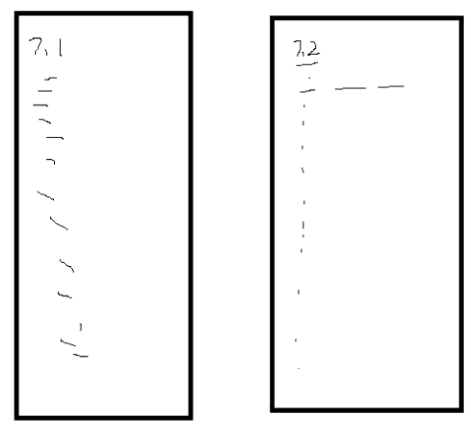
那么我们可以如此改进：我们搞一个`000 0000 0000 ~ 199 9999 9999`页的本子，某同学借书时让他提供电话号码，以电话号码为基准记录信息。待还书时，只需要报电话号则可以直接找到记录。但此方法不现实，因为本子太厚，要花费的空间太大。
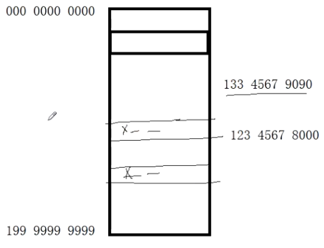
再改进：做一个1000页的本子，因为电话号码的范围远远大于页数，我们要想办法使电话号码映射到页数，则这个映射方案则称为“哈希函数”。如A同学电话号码为137 3456 9090，可取后三位090，存到90页。B同学电话号码为186 7890 1234，取后三位234，存到234页。
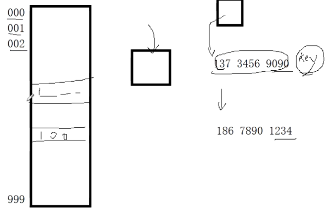
此时又来了一个C同学，电话号码为156 9090 1234，虽然关键码与B同学不一样，但位置信息一样，则称之为“哈希冲突”。
# 哈希表

## 什么是哈希表

严蔚敏版本的数据结构教材中指出，在诸如线性表、树结构中，“记录”中结构中的相对位置是随机的，和“记录”的关键字之间不存在确定的关系，因此，在结构中查找记录时需进行一系列和关键字的比较。比如，数组存放的从小到大的10个数据，要用二分查找法找出某value的下标值就需要一直探测。这一类查找方法建立在“比较”的基础上。在顺序查找时，比较的结果为“=”与“≠”两种可能；在折半查找、二叉排序树查找和B树查找时，比较的结果为“<”、“=”和“>”3种可能。查找的效率依赖于查找过程中所进行的比较次数。

我们所向往的理想的情况是希望不经过任何比较，一次存取便能得到所查记录，那就必须在记录的**存储位置**和它的**关键字**之间建立一个确定的对应关系f，使每个关键字和结构中一个惟一的存储位置相对应。因而在查找时只要根据这个对应关系f找到给定值K的“像”f(K)便能找到其存储位置。若结构中存在关键字和K相等的记录，则必定在f(K)这个存储位置上，由此不需要比较便可直接取得所查记录。在此我们称这个对应关系f为**哈希（Hash）函数**，由此思想建立的表称为**哈希表**。

```c
#include<stdio.h>
#include<assert.h>
#define NIL -1
#define m 13
typedef int KeyType;
struct ElemType
{
  	KeyType key;
    void* ptr;	//value
};
typedef struct
{
    ElemType data[m];
    int cursize;
}HashTable;
```

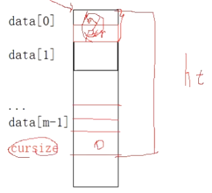

```c
void Init_HashTable(HashTable* pt)
{
    assert(pt != nullptr);
    pt->cursize = 0;
    for(int i=0;i<m;++i)
    {
        pt->data[i].key = NIL;
        pt->data[i].ptr = nullptr;
    }
}
int Hash(KeyType kx)
{
    return kx%m;
}
bool Insert_Item(HashTable* pt, ElemType item)
{
    assert(pt != nullptr);
    int index = Hash(item.key);
    pt->data[index] = item;
    pt->cursize += 1;
}
int main()
{
    HashTable ht;
    Init_HashTable(&ht);
    int ar[]={12,23,25,8,19,29};
    int n=sizeof(ar)/sizeof(ar[0]);
    for(int i=0;i<n;++i)
    {
        struct ElemType item = {ar[i],nullptr};
        bool tag = Insert_Item(&ht,item);
    }
}
```

但是这种Insert_Item函数是有问题的，没有解决**哈希冲突**问题，比如在插入key为25的元素时会替换掉前期已经插入的key为12的元素。

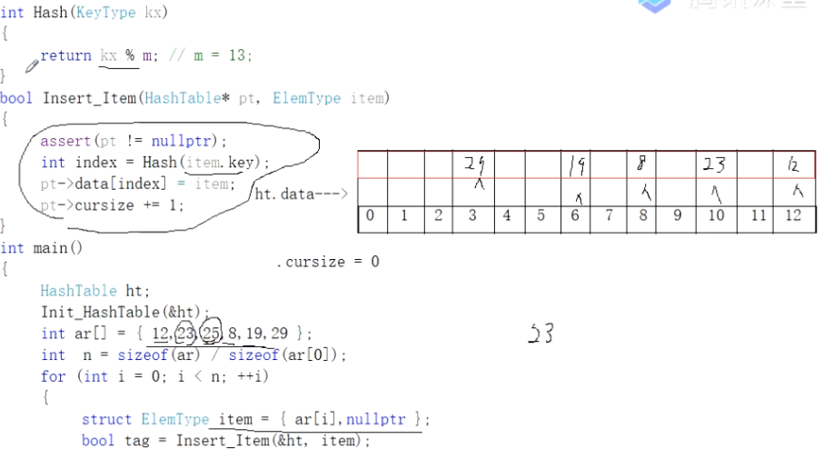

以下来通过 **（增量）线性探测法**来解决哈希冲突。

```c
int Inc(int i)
{
    return i;
}
int Hash_Inc(KeyType kx, int i)
{
    return (Hash(kx) + Inc(i))%m;
}
bool Insert_Item(HashTable* pt, ElemType item)
{
    assert(pt != nullptr);
    for(int i = 0;i<m;++i)
    {
        int index = Hash_Inc(item.key, i);
        if(pt->data[i].key == NIL)//随着Inc更迭，找到一个空位置
        {
            pt->data[index] = item;
            pt->cursize += 1;
            return true;
        }
    }
    return false;
}
```

```c
int main()
{
    HashTable ht;
    Init_HashTable(&ht);
    int ar[]={12,15,28,23,25,38,36,49,14};
    int n=sizeof(ar)/sizeof(ar[0]);
    for(int i=0;i<n;++i)
    {
        struct ElemType item = {ar[i],nullptr};
        bool tag = Insert_Item(&ht,item);
    }
}
```

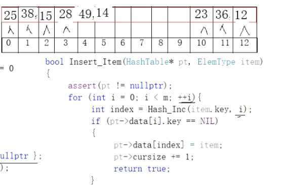

这种**线性探测法**虽然解决了哈希冲突，但最终的数据分布太堆积化。可以通过**平方探测法**改善此问题。

```c
int Inc(int i)
{
    return i*i;
}
```

但无论是**线性探测法**存储还是**平方探测法**存储，在这种纯顺序表（数组）中实现哈希表会遇到一个严重的问题！即插入数据后，不能轻易删除某一个数据，因为删除了某一数据后，查找另外的数据就会出现数据断层导致不能正常探测。比如下图：如果把3下标的28删除，则查找key为49的元素时，第一次探测49%13=10，23不等于49，第二次探测（线性探测，下标+1），36不等于49，第三次探测，12不等于49，……，直到探测到下标3，发现key值为-1。如果我们停止探测返回，则是错误的；所以我们只能遇到-1不停止继续探测，那么就失去了哈希表的意义，这相当于在查某个key对应的value时有可能把整个表都遍历了一遍。

```c
void* FindValue(HashTable* pt, KeyType kx)
{
    assert(pt != nullptr);
    for(int i = 0;i<m;++i)
    {
        int pos = Hash_Inc(kx,i);
        if(pt->data[pos].key==kx)
        {
            return pt->data[pos].ptr;
        }
        if(pt->data[pos].key==NIL)
        {
            return nullptr;
        }
    }
}
```

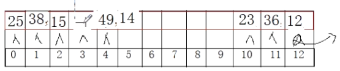

## 链地址法

所以我们要改变这种存储哈希表的方式，改用**链地址法**存储。（视频01:27:42）

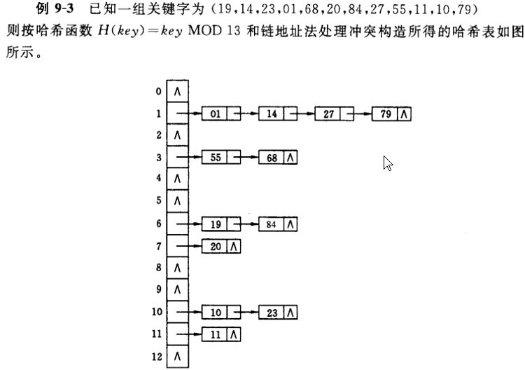

看图设计结构

```c
#include<stdio.h>
#include<assert.h>
#define m 13
typedef int KeyType;
typedef struct ElemType
{
    KeyType key;
    void* ptr;
}ElemType;
typedef struct HashNode
{
    ElemType data;
    struct HashNode* next;
}HashNode;
typedef struct HashTable
{
    HashNode* table[m];
    int cursize;
}HashTable;
```

### 测试代码

```c
int Hash(KeyType kx)
{
    return kx % m;
}
void Init_Hash(HashTable* pt)
{
    assert(pt!=nullptr);
    for(int i = 0;i<m;++i)
    {
        pt->table[i] = nullptr;
    }
    pt->cursize = 0;
}
void Insert_Item(HashTable* pt, ElemType item)//但是此函数没有解决存在相同key时的情况
{
    assert(pt!=nullptr);
    int index = Hash(item.key);
    HashNode* s = (HashNode*)malloc(sizeof(HashNode));
    if(nullptr == s) exit(1);
    s->data = item;
    s->next = pt->table[index];
    pt->table[index] = s;
    pt->cursize += 1;
}
int main()
{
    int ar[]={1,55,19,20,10,11,14,68,84,23,27,79};
    int n = sizeof(ar)/sizeof(ar[0]);
    HashTable ht;
    Init_Hash(&ht);
    for(int i = 0;i<n;++i)
    {
        ElemType elem = {ar[i],nullptr};
        Insert_Item(&ht,elem);
    }
}
```

## API

### Init

```c
void Init_Hash(HashTable* pt)
{
    assert(pt != nullptr);
    for(int i = 0;i<m;++i)
    {
        pt->table[i]=nullptr;
    }
    pt->cursize=0;
}
```

### Insert

```c
void Insert_Item(HashTable* pt, ElemType item)
{
    assert(pt != nullptr);
    int index = Hash(item.key);
    HashNode* pnode = (HashNode*)malloc(sizeof(*pnode));
    if (nullptr == pnode) exit(1);
    pnode->data = item;//讲外部elem封装到新建结点的数据域
    //以下两步为入表操作，采用头插法，时间复杂度为O(1)，不用判头结点是否为空
    pnode->next = pt->table[index];
    pt->table[index] = pnode;
    
    pt->cursize++;//现有大小+1
}
```

### FindNode

查看字典中是否已存在某key值对应的节点并返回。

```c
HashNode* FindNode(HashTable* pt, KeyType kx)
{
	int index = Hash(kx);
	HashNode* p = pt->data[index];
	while (p != nullptr && p->item.key != kx)
	{
		p = p->next;
	}
	return p;
}
```

### Clear

自己写的

```c
//free掉所有节点，HashTable的指针数组数据全赋空
void ClearTable(HashTable* pt)
{
	for (int i = 0;i < m;++i)
	{
		HashNode* p = pt->data[i];
		HashNode* q = nullptr;
		while (p)
		{
			q = p->next;
			free(p);
			pt->cursize--;
			p = q;
		}
		pt->data[i] = nullptr;
	}
}
```

老师写的

```c
void ClearHash(HashTable* pt)
{
    for(int i = 0;i<m;++i)
    {
        while(pt->data[i]!=nullptr)
        {
            HashNode* q = pt->data[i];
            pt->data[i]=q->next;
            free(q);
        }
    }
    pt->cursize=0;
}
```

### Remove

```c
//删除某一节点，需用到两个指针变量，一前一后。
void RemoveNode(HashTable* pt, KeyType kx)
{

	int index = Hash(kx);
	HashNode* p = pt->data[index];
	if (p == nullptr) exit(1);//不存在要删除的key的对应节点，因为Table数组此下标的值既然为空则肯定不会有key值相应的节点存在
	HashNode* q = p->next;
	//若删除的节点为头结点，则特殊处理
	if (p->item.key == kx)
	{
		pt->data[index] = q;
		free(p);
	}
	else//
	{
		while (q != nullptr && q->item.key != kx)
		{
			p = p->next;
			q = q->next;
		}
		if (q == nullptr) exit(1);//不存在要删除的key的对应节点，因为遍历这一条链后不存在相同的key值对应的节点。
		else//q->item.key == kx
		{
			p->next = q->next;
			free(q);
		}
	}
	pt->cursize--;
	return;
}
```

老师写法

```c
//Remove节点更老套的写法：
bool Remove(HashTable* pt,KeyType kx)
{
    assert(pt!=nullptr);
    int index=Hash(kx);
    HashNode* pr=nullptr;//前驱指针
    HashNode* p=pt->table[index];
    while(p!=nullptr)
    {
        if(p->item.key==kx)
        {
            if(pr!=nullptr)
            {
                pr->next=p->next;
            }
            else
            {
                pt->table[index]=p->next;
            }
            free(p);
            pt->total-=1;
            return true;
        }
        pr=p;
        p=p->next;
    }
    return false;
}
```

## 习题

定义大小为100 的整型数组，使用随机函数给数组元素赋值。数值的范围是1 .. 100 ，并且不容许重复。

```c
int* My_NonRepeating_RandArr(int* ar, int n)
{
    assert(ar != nullptr);
    int br[101];
    for (int i = 0;i < n + 1;++i)
    {
        br[i]=0;
    }
    int temp;
    srand(time(NULL));
    int i = 0;
    do
    {
        temp = rand() % 100 + 1;
        if (br[temp] != 1)
        {
            br[temp] = 1;
            ar[i] = temp;
            ++i;
        }
    } while (i<n);
    return ar;
}
```

如果题中数组大小改为1000000，那么数组开辟空间就很大，如果仍然按照旧的方式去做肯定是对程序不利的。考虑用哈希算法解决！

```c
#include<stdio.h>
#include<assert.h>
#define m 100
typedef int KeyType;
typedef struct ElemType
{
    KeyType key;
    void* ptr;
}ElemType;
typedef struct HashNode
{
    ElemType data;
    struct HashNode* next;
}HashNode;
typedef struct HashTable
{
    HashNode* table[m];
    int cursize;
}HashTable;
void Init_Hash(HashTable* pt)
{
    assert(pt != nullptr);
    for(int i = 0;i<m;++i)
    {
        pt->table[i]=nullptr;
    }
    pt->cursize=0;
}
void Insert_Item(HashTable* pt, ElemType item)
{
    assert(pt != nullptr);
    int index = Hash(item.key);
    HashNode* pnode = (HashNode*)malloc(sizeof(*pnode));
    if (nullptr == pnode) exit(1);
    pnode->data = item;//讲外部elem封装到新建结点的数据域
    //以下两步为入表操作，采用头插法，时间复杂度为O(1)，不用判头结点是否为空
    pnode->next = pt->table[index];
    pt->table[index] = pnode;
    
    pt->cursize++;//现有大小+1
}
int Hash(KeyType kx)
{
    return kx%m;
}
HashNode* FindValue(HashTable* pt, KeyType kx)
{
    int index = Hash(kx);
    HashNode* p = pt->table[index];
    while(p != nullptr && p->data.key != kx)
    {
        p=p->next;
    }
    return p;
}
int* My_NonRepeating_Hash(int* ar, int n)
{
    assert(ar != nullptr);
    HashTable ht;
    Init_Hash(&ht);
    int temp;
    srand(time(NULL));
    int i = 0;
    do
    {
        temp = rand()* rand() % 1000000 + 1;
        if (FindValue(&ht, temp) == nullptr || *(int*)(FindValue(&ht, temp)->data.ptr) != 1)
        {
            ElemType item = { temp,new int(1) };
            Insert_Item(&ht, item);
            ar[i] = temp;
            ++i;
        }
    } while (i < n);
    return ar;
}
int main()
{
    
}
```

老师写的

```c
#include<assert.h>
#define m 13
#define INC	2
typedef int KeyType;
typedef struct
{
    KeyType key;
    void* ptr;
}ElemType;
typedef struct HashNode
{
    ElemType data;
    struct HashNode* next;
}HashNode;
typedef struct HashTable
{
    HashNode** table;
    int capacity;
    int total;
}HashTable;
int Hash(HashTable* pt, KeyType kx)
{
    //return kx % m; //原始不考虑增容的情况下默认%m
    return kx % pt->capacity;
}
void Init_Hash(HashTable* pt)
{
    assert(pt!=nullptr);
    pt->table = (HashNode**)malloc(sizeof(HashNode*)*m);
    if(pt->table == nullptr)exit(EXIT_FAILURE);
    pt->capacity = m;
    for(int i = 0;i<pt->capacity;++i)
    {
        pt->table[i] = nullptr;
    }
    pt->total = 0;
}
HashNode* FindNode(HashTable* pt, KeyType kx)
{
    int index = Hash(pt,kx);
    HashNode* p = pt->table[index];
    while(p != nullptr && p->data.key != kx)
    {
        p=p->next;
    }
    return p;
}
bool Inc(HashTable* pt)//对哈希表的增容操作
{
    int incsize = pt->capacity * INC;//INC为增容系数，默认为2，incsize表示增容后的新大小，为此前哈希表容量的2倍。
    HashNode** newtable = (HashNode**)malloc(sizeof(HashNode*)*incsize);
    if(newtable == nullptr)return false;
    for(int i = 0;i<incsize;++i)
    {
        newtable[i] = nullptr;
    }
    pt->captacity = incsize;
    //以上，开辟新的哈希表完毕，下面要把旧表复制到新表
    int oldsize = pt->capacity;
    for(int i = 0;i<oldsize;++i)
    {
        if(pt->table[i]!=nullptr)
        {
            
        }
    }
}
bool Insert_Item(HashTable* pt, ElemType item)
{
    assert(pt!=nullptr);
    HashNode* p = FindNode(pt,item.key);
    if(p!=nullptr)return false;//哈希表中已存在相同key值的节点
    if(pt->total > pt->capacity && !Inc(pt))//需要增容但没有增容成功
    {
        return false;
    }
    int index 
}
```

C++就一个东西引用返回，B站的老师永远搞不清楚

# Redis字典

字典，又称为符号表(symbol table)、关联数组(associative array)或映射(map)，是一种用于保存键值对(key-value pair)的抽象数据结构。
在字典中，一个键(key)可以和一个值(value)进行关联（或者说将键映射为值），这些关联的键和值就称为键值对。
字典中的每个键都是独一无二的，程序可以在字典中根据键查找与之关联的值，或者通过键来更新值，又或者根据键来删除整个键值对，等等。
字典经常作为一种数据结构内置在很多高级编程语言里面，但Redis所使用的C语言并没有内置这种数据结构，因此 Redis构建了自己的字典实现。
字典在Redis中的应用相当广泛，比如 Redis的数据库就是使用字典来作为底层实现的，对数据库的增、删、查、改操作也是构建在对字典的操作之上的。

## 与相似结构对比

HashTable是无序的；
Map是有序的；HashMap是无序的，底层有红黑树实现。因此Map效率较低。

## 字典的实现

Redis的字典使用哈希表作为底层实现，一个哈希表里面可以有多个哈希表节点，而每个哈希表节点就保存了字典中的一个键值对。

### 哈希表

Redis字典所使用的哈希表由dict.h/dictht结构定义：

```c
typedef struct dictht
{
    dictEntry** table;//哈希表数组
    unsigned long size;//哈希表大小
    unsigned long sizemark;//哈希表大小掩码，用于计算索引值。总是等于size-1
    unsigned long used;//表中已有节点的数量
}dictht;
```

成员table的功能是一个数组（指向首元素的指针），数组中的每个元素都是一个指向dict.h/dictEntry结构的指针，每个dictEntry结构保存着一个键值对。

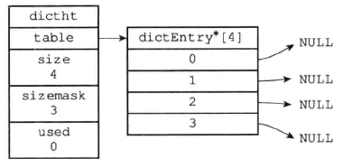

### 哈希表节点

即dictEntry结构。

```c
typedef struct dictEntry
{
    void* key;
    union
    {
        void* val;
        uint64_tu64;
        int64_ts64;
    }v;
    struct dictEntry* next;
}dictEntry;
```

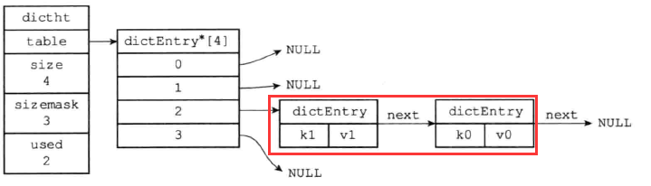

### 字典

Redis中的字典由dict.h/dict结构表示

```c
typedef struct dictType 
{
    // 计算哈希值的函数
    unsigned int (*hashFunction)(const void *key);
    // 复制键的函数
    void *(*keyDup)(void *privdata, const void *key);
    // 复制值的函数
    void *(*valDup)(void *privdata, const void *obj);
    // 对比键的函数
    int (*keyCompare)(void *privdata, const void *key1, const void *key2);
    // 销毁键的函数
    void (*keyDestructor)(void *privdata, void *key);
    // 销毁值的函数
    void (*valDestructor)(void *privdata, void *obj);
} dictType;
typedef struct dict
{
    dictType* type;//结构体指针，用于存放特定类型的操作函数
    void* privdata;//私有数据
    dictht ht[2];//内部定义了两个哈希表
    int rehashidx;//当没有在rehash时值为-1
}dict;
```

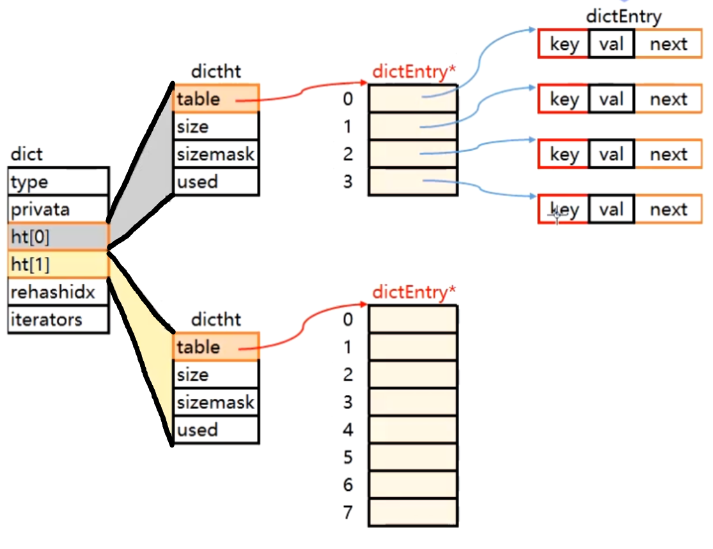

# 面试

1. 渐进式增容/缩容
2. 一致性哈希--解决负载均衡的问题。比如登陆项目。一千万个用户同时登陆。
3. 操作系统一定要开始看了，内存管理、进程管理、线程管理。

# dictDelete

1. 删除第一节点
2. 删除后个数会少，要处理

# time

```c
/*
 * 返回以毫秒为单位的 UNIX 时间戳
 *
 * T = O(1)
 */
long long timeInMilliseconds(void) 
{
    struct timeval tv;

    gettimeofday(&tv,NULL);
    return (((long long)tv.tv_sec)*1000)+(tv.tv_usec/1000);
}
/* Rehash for an amount of time between ms milliseconds and ms+1 milliseconds */
/*
 * 在给定毫秒数内，以 100 步为单位，对字典进行 rehash 。
 *
 * T = O(N)
 */
int dictRehashMilliseconds(dict *d, int ms) 
{
    // 记录开始时间
    long long start = timeInMilliseconds();
    int rehashes = 0;

    while(dictRehash(d,100)) {
        rehashes += 100;
        // 如果时间已过，跳出
        if (timeInMilliseconds()-start > ms) break;
    }

    return rehashes;
}
```

