# 进程和线程的关系
1. 进程是程序的运行实例。包含全局变量。
2. 一个进程至少包含一个线程
3. 程序运行的最小单位是函数，线程则是函数的运行实例。
4. 线程是操作系统的术语，而对于处理器来说线程是任务，每个逻辑处理器（或是处理器核心）都可以对应一个线程，并且可以在一个处理器上同时运行不同进程的线程。
5. 线程中包含线程栈。
# 卖票程序
```cpp
#include <iostream>
constinit int tickets = 100;
int main()
{
    while (true)
    {
        std::wcout << L"Station main: " << tickets-- << std::endl;
        if (tickets == 0)
        {
            break;
        }
    }   
}
```
## CreateThread创建线程
官方文档：[CreateThread function (processthreadsapi.h) - Win32 apps | Microsoft Learn](https://learn.microsoft.com/en-us/windows/win32/api/processthreadsapi/nf-processthreadsapi-createthread)

通常引入`<Windows.h>`即可使用。
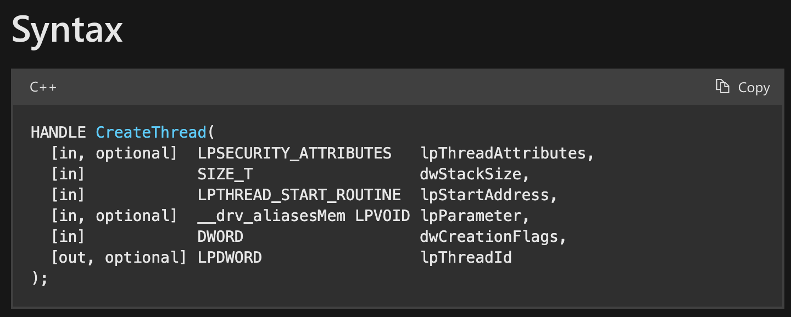

1. 可选，LP即long pointer，看作pointer就行。Security Attributes意为安全描述符。
    1. 用于ACLs，Access Control Lists。微软常用的手段，哪些东西可以访问，有什么权限等等。可以填NULL得到默认的安全描述符。
2. 线程栈大小，填 0 意为默认值，Windows下是1M，Linux是4M。
3. 线程函数的地址，告知线程具体从哪里执行。需要遵循函数签名。[ThreadProc callback function (Windows) | Microsoft Learn](https://learn.microsoft.com/en-us/previous-versions/windows/desktop/legacy/ms686736(v=vs.85))
    1. `DWORD WINAPI ThreadProc(_In_ LPVOID lpParameter);`
        1. 以上是线程函数的签名形式。返回值为0代表线程函数执行成功。
    2. LPVOID指的是`void *`
    3. `_In_`是一个 SAL（Source Annotation Language）宏， 用于注释 Windows API 函数参数。它提供有关函数参数的额外信息，以帮助编译器进行静态分析和代码检查。我们可以省略。
    4. WINAPI指`__stdcall`
    5. 因此可以简化为：`DWORD WINAPI ThreadProc(void * lpParameter);`
    6. `C++`中传入函数地址时，需要在函数名字之前加一个`&`取地址。
4. 可选，函数的参数
5. 线程的控制符。
    1. 0表示创建后立即执行
    2. `CREATE_SUSPENDED`表示创建后挂起，直到调用ResumeThread
6. 可选，输出值，给一个指针可以获得线程ID。此线程ID与Handle不同。可填NULL。
7. 返回值：如果创建成功，返回此线程的句柄。

创建完线程并执行后，需要关闭Handle，但这不意味着关闭线程，只不过是说此句柄不再绑定这个线程，不对线程进行管理了，那么线程运行结束之后就会自行停止。
```cpp
#include <Windows.h>
#include <iostream>
#include <format>
#include <print>
constinit int tickets = 10;
DWORD WINAPI ThreadProc(void* lpParameter);
int main()
{
    // start a new thread
    HANDLE hThread = ::CreateThread(nullptr, 0, &ThreadProc, nullptr, 0, nullptr);
    if (hThread) ::CloseHandle(hThread);
    hThread = nullptr;

    while (true)
    {
        if (tickets > 0)
        {
            std::wcout << L"Station main: " << tickets-- << std::endl;
        }
        else
        {
            break;
        }
    }
}
DWORD WINAPI ThreadProc(void* parameter)
{
    while (true)
    {
        if (tickets > 0)
        {
            std::wcout << L"Station 1: " << tickets-- << std::endl;
        }
        else
        {
            break;
        }
    }
    return 0;
}
```
可能在输出结果中看到两个线程抢占式的输出，导致内容杂乱。
```
Station main: 10Station 1: 9

Station main: 8
Station main: 7
Station main: 6
Station 1: 5
Station 1: 4
Station 1: 3
Station 1: 2
Station main: 1
Station 1: 0

```
以上输出有两个问题：
1. 还未换行时，线程被抢占。导致换行延后。多行内容在一行显示
2. 子线程把0号票卖掉了，这是错误的。

关于输出问题，可以用`C++20<format>`的`std::format`或者`C++23<print>`的`std::print`解决。
```cpp
std::wcout << std::format(L"Station main: {}\n", tickets--);
```
或
```cpp
std::println("Station main: {}", tickets--);
```

## Sleep把时间片放大，观察错误
通过sleep把时间片放大，可以让多线程中隐患的几率增大。
>Windows下的Sleep定义于`Windows.h`，参数是毫秒。

```cpp
#include <Windows.h>
#include <iostream>
#include <format>
#include <print>
constinit int tickets = 10;
DWORD WINAPI ThreadProc(void* lpParameter);
int main()
{
    // start a new thread
    HANDLE hThread = ::CreateThread(nullptr, 0, &ThreadProc, nullptr, 0, nullptr);
    if (hThread) ::CloseHandle(hThread);
    hThread = nullptr;

    while (true)
    {
        if (tickets > 0)
        {
            ::Sleep(5);
            std::println("Station main: {}", tickets--);
        }
        else
        {
            break;
        }
    }
    ::Sleep(500);
    std::println("Finally, tickets remain: {}", tickets);
    return 0;
}
DWORD WINAPI ThreadProc(void* parameter)
{
    while (true)
    {
        if (tickets > 0)
        {
            ::Sleep(5);
            std::println("Station 1: {}", tickets--);
        }
        else
        {
            break;
        }
    }
    return 0;
}
```

最后可能输出的情况：main线程把0号票卖了，最后导致票余量为-1。
```
Station main: 9
Station 1: 10
Station 1: 8
Station main: 7
Station main: 6
Station 1: 6
Station main: 4
Station 1: 5
Station main: 3
Station 1: 2
Station 1: 1
Station main: 0
Finally, tickets remain: -1

```
可能的情况：main线程判断tickets为1后准备卖票，睡了5ms期间被1线程卖掉了最后一张票，之后main线程唤醒后是不知道的，依旧减了票量到-1。

>我们发现，如果使用的是`std::println`，0号票卖掉的概率大大下降。大多数情况剩余票数为0（正确行为）。这可能是因为`std::println`/控制台输出内部通常有锁，调用很“重”，会让线程轮换得更慢，进一步降低了极端交错（比如刚好重读为 0 再减）的概率。但这样对 `tickets` 的访问并不会变安全。
>总结：控制台输出里自带锁，反而会“串行化”一部分时间，**不利**于制造极端交错。
## CreateMutex创建互斥量
[CreateMutexW function (synchapi.h) - Win32 apps | Microsoft Learn](https://learn.microsoft.com/en-us/windows/win32/api/synchapi/nf-synchapi-createmutexw)

通常引入`<Windows.h>`即可使用。
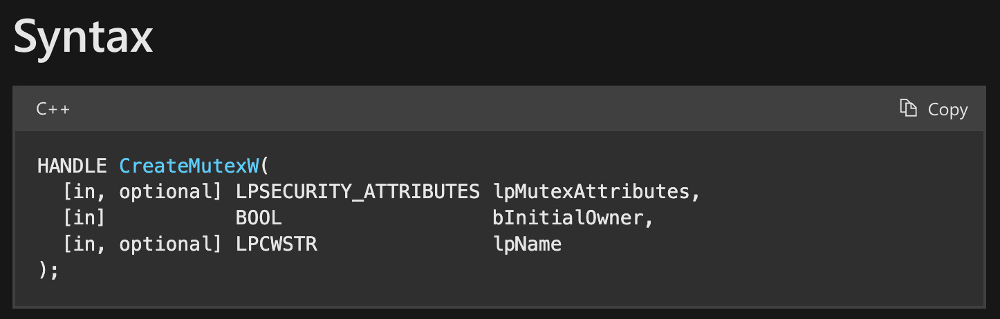
1. 可选，安全描述符，可填NULL获得默认的。
2. 是否起始就占有互斥量：此时的线程是不是立马持有互斥量而其他线程无法访问。
3. 可选，名字。
4. 返回值是句柄。

在此例我们要给这个互斥量一个全局可访问的句柄。
## WaitForSingleObject - 加锁
在临界区之前需要`WaitForSingleObject`等待互斥量的信号。相当于加锁
[WaitForSingleObject function (synchapi.h) - Win32 apps | Microsoft Learn](https://learn.microsoft.com/en-us/windows/win32/api/synchapi/nf-synchapi-waitforsingleobject)
通常引入`<Windows.h>`即可使用。
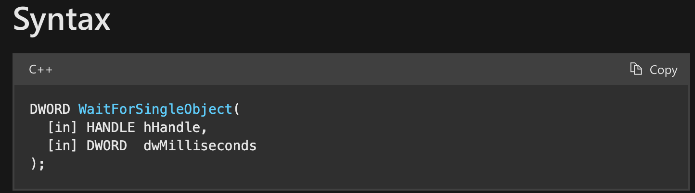
1. 指明等待的对象的句柄
2. 等待的时间
    1. 可填非0的值
    2. 如果填0，而没有信号，则会立即返回，一直重复试探、空转。
    3. 可以填INFINITE，无限期等下去。
## ReleaseMutex - 释放互斥量
临界区后需要`ReleaseMutex(hMutex)`释放互斥量。而且要注意，在if语句的每个情况下都需要写释放锁语句。
### 卖票代码
```cpp
#include <Windows.h>
#include <iostream>
#include <print>
constinit int tickets = 10;
constinit HANDLE hMutex = nullptr;
DWORD WINAPI ThreadProc(void* lpParameter);
int main()
{
    hMutex = ::CreateMutex(nullptr, false, nullptr);
    // start a new thread
    HANDLE hThread = ::CreateThread(nullptr, 0, &ThreadProc, nullptr, 0, nullptr);
    if (hThread) ::CloseHandle(hThread);
    hThread = nullptr;

    while (true)
    {
        ::WaitForSingleObject(hMutex, INFINITE);
        if (tickets > 0)
        {
            ::Sleep(5);
            std::println("Station main: {}", tickets--);
            ::ReleaseMutex(hMutex);
        }
        else
        {
            ::ReleaseMutex(hMutex);
            break;
        }
    }
    ::Sleep(500);
    ::CloseHandle(hMutex);
    hMutex = nullptr;
    std::println("Finally, tickets remain: {}", tickets);
    return 0;
}
DWORD WINAPI ThreadProc(void* parameter)
{
    while (true)
    {
        ::WaitForSingleObject(hMutex, INFINITE);
        if (tickets > 0)
        {
            ::Sleep(5);
            std::println("Station 1: {}", tickets--);
            ::ReleaseMutex(hMutex);
        }
        else
        {
            ::ReleaseMutex(hMutex);
            break;
        }
    }
    return 0;
}
```
结果：
```
Station main: 10
Station 1: 9
Station main: 8
Station 1: 7
Station main: 6
Station 1: 5
Station main: 4
Station 1: 3
Station main: 2
Station 1: 1
Finally, tickets remain: 0

```
不会出现卖0号票的情况。
## 使用标准线程库创建2个子线程卖票
```cpp
#include <Windows.h>
#include <iostream>
#include <print>
#include <thread>
constinit int tickets = 10;
constinit HANDLE hMutex = nullptr;
void seller(std::string const& name);
int main()
{
    hMutex = ::CreateMutex(nullptr, false, nullptr);
    // start a new thread
    std::jthread th1(seller, "seller 1:");
    std::jthread th2(seller, "seller 2:");
    //::Sleep(500); // 不用Sleep了，而是join
    th1.join();
    th2.join();
    
    ::CloseHandle(hMutex);
    hMutex = nullptr;
    std::println("Finally, tickets remain: {}", tickets);
    return 0;
}
void seller(std::string const& name)
{
    while (true)
    {
        ::WaitForSingleObject(hMutex, INFINITE);
        if (tickets > 0)
        {
            ::Sleep(5);
            std::println("{} {}", name, tickets--);
            ::ReleaseMutex(hMutex);
        }
        else
        {
            ::ReleaseMutex(hMutex);
            break;
        }
    }
}
```
由于我们在子线程结束后还有CloseHandle、输出最后票数的操作，使用需要手动控制`th.join()`的位置。
```cpp
    th1.join();
    th2.join();
    //::Sleep(1000); // 不用Sleep了
```

或者也可以detach，但是主线程要在末尾主动`Sleep`一段时间。
```cpp
    th1.detach();
    th2.detach();
    ::Sleep(1000);
```

结果：
```
seller 1: 10
seller 2: 9
seller 1: 8
seller 2: 7
seller 1: 6
seller 2: 5
seller 1: 4
seller 2: 3
seller 1: 2
seller 2: 1
Finally, tickets remain: 0
```
## 命名锁
比如要想做应用程序的单例模式。
可以用锁和内核对象进行控制。
为什么要用名字呢？
因为每个线程创建完之后内核返回的句柄值时随机的，线程只知道自己的，而不知道其他人的句柄。但当程序员主动在创建线程时给了名字后，系统就有所感知，你之前已经创建过这个东西，就会把之前的句柄返回给你，就可以访问相同的对象了。
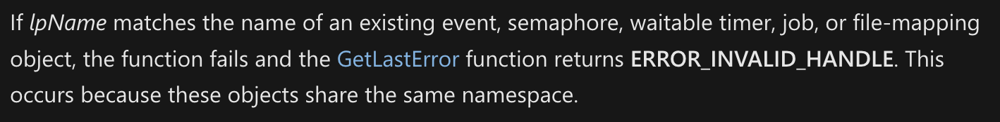


```cpp
constinit HANDLE hMutex = nullptr;
constinit HANDLE hSingletonMx = nullptr;

int main()
{
    // 起始 主线程 拥有锁
    hSingletonMx = ::CreateMutex(nullptr, false, L"AppSingleton");
    if (::GetLastError() == ERROR_ALREADY_EXISTS)
    {
        ::CloseHandle(hSingletonMx);
        return 0;  // break point
    }
    hMutex = ::CreateMutex(nullptr, false, nullptr);
    ::ReleaseMutex(hMutex);
    
    HANDLE hThread = ::CreateThread(nullptr, 0, &ThreadProc, nullptr, 0, nullptr);
    ::CloseHandle(hThread);
    hThread = ::CreateThread(nullptr, 0, &ThreadProc2, nullptr, 0, nullptr);
    ::CloseHandle(hThread);
    hThread = nullptr;

    ::Sleep(10000);
    ::CloseHandle(hSingletonMx);
    return 0;
}
```
### VS下多线程调试
1. 下断点。
2. 先运行一个程序。
3. 在Sleep 10s结束之前。右击项目名，Debug，Start New Instance。
4. 会发现，第二个程序会直接到达`closeHandle(hSingletonMx)`。
5. 这就是跨应用程序的singleton
# CreateEvent创建事件（信号、条件变量） - Windows下的独特锁
事件提供了比Mutex更多的功能。
用`CreateEvent`创建。
[CreateEventW function (synchapi.h) - Win32 apps | Microsoft Learn](https://learn.microsoft.com/en-us/windows/win32/api/synchapi/nf-synchapi-createeventw)
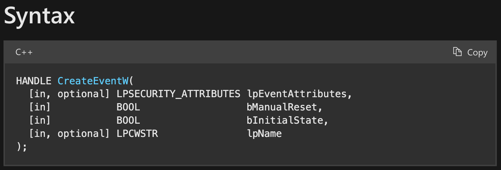
1. 可选，安全描述符，填NULL表示获取默认描述符。
2. 是否手动重置，意思是如果是手动重置则需要在`WaitForSingleObject`之后`ResetEvent(hEvent)`手动上锁，在此期间可能会被其他人抢占该信号。如果是自动重置则是Wait后自动上锁。
3. 初始状态，true为有信号（signaled），false为无信号（nonsignaled）。有信号意为没有上锁，无信号时需要自己把锁打开。
4. 可选，命名或匿名。
## SetEvent：释放信号
对于Event来说，退出临界区的方法为`SetEvent(hEvent)`
## 卖票代码修改
使用Event时需要做以下修改：
1. main函数中`CreateEvent`
2. main函数最后`CloseHandle`参数改为hEvent
3. 线程函数中
    1. WaitForSingleObject参数改为hEvent
    2. 退出临界区的开锁对于Event来说方法为`SetEvent(hEvent)`

以下，创建2个子线程。
```cpp
constinit HANDLE hEvent = nullptr;
int main()
{
    hEvent = CreateEvent(nullptr, false, true, nullptr);
    
    HANDLE hThread = ::CreateThread(nullptr, 0, &ThreadProc, nullptr, 0, nullptr);
    ::CloseHandle(hThread);
    
    hThread = ::CreateThread(nullptr, 0, &ThreadProc2, nullptr, 0, nullptr);
    ::CloseHandle(hThread);
    hThread = nullptr;

    ::Sleep(10000);
    ::CloseHandle(hEvent);
    return 0;
}
DWORD WINAPI ThreadProc(void* parameter)
{
    while (true)
    {
        ::WaitForSingleObject(hEvent, INFINITE);
        if (tickets > 0)
        {
            ::Sleep(5); // 5ms
            std::wcout << L"Station #main: " << tickets-- << std::endl;
            ::SetEvent(hEvent);
        }
        else
        {
            ::SetEvent(hEvent);
            break;
        }
    }
}
```
## 不同
1. Mutex与拥有者绑定，只能听从拥有者支配。
2. Event没有绑定拥有者，任何人只要拿到它的句柄就可以支配。
3. Event更像是一个信号的概念，给别人通知。Linux下的对标物：条件变量

## WaitForMultipleObjects
使用`WaitForMultipleObjects`。常常用于：当作主线程的信号接收器，当两个子线程**全部**发出结尾的SetEvent信号时，主线程就可以停止阻塞，继续执行，从而取代了死板的Sleep。
[WaitForMultipleObjects function (synchapi.h) - Win32 apps | Microsoft Learn](https://learn.microsoft.com/en-us/windows/win32/api/synchapi/nf-synchapi-waitformultipleobjects)
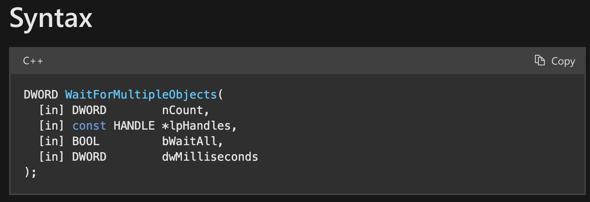
1. 事件对象的个数
2. 事件对象句柄数组的首元素指针
3. 是否等待所有事件对象全部到位再退出
4. 0是空转，INFINITE是无限期，非0是最多等多久后退出。

两个子线程的完成事件信号，初始状态必须是无信号，即在创建时，`CreateEvent`的第三个参数为false。
两个子线程在结束时，需要`SetEvent(hEventExits[0 or 1]);`进行开锁。
```cpp
constinit int tickets = 100;
DWORD WINAPI ThreadProc(void * lpParameter);
DWORD WINAPI ThreadProc2(void * lpParameter);

constinit HANDLE hEvent = nullptr;
constinit HANDLE hEventExits[2] = {nullptr, nullptr};
int main()
{
    hEvent = CreateEvent(nullptr, false, true, nullptr);
    hEventExits[0] = CreateEvent(nullptr, false, false, nullptr);
    hEventExits[1] = CreateEvent(nullptr, false, false, nullptr);
    HANDLE hThread = ::CreateThread(nullptr, 0, &ThreadProc, nullptr, 0, nullptr);
    ::CloseHandle(hThread);
    hThread = ::CreateThread(nullptr, 0, &ThreadProc2, nullptr, 0, nullptr);
    ::CloseHandle(hThread);
    hThread = nullptr;

    ::WaitForMultipleObjects(2, hEventExits, true, INFINITE);
    ::CloseHandle(hEvent);
    ::CloseHandle(hEventExits[0]);
    ::CloseHandle(hEventExits[1]);
    ::DeleteCriticalSection(&cs);
    return 0;
}
DWORD WINAPI ThreadProc(void* parameter)
{
    while (true)
    {
        ::WaitForSingleObject(hEvent, INFINITE);
        if (tickets > 0)
        {
            ::Sleep(5); // 5ms
            std::wcout << L"Station #1: " << tickets-- << std::endl;
            ::SetEvent(hEvent);
        }
        else
        {
            ::SetEvent(hEvent);
            break;
        }
    }
    SetEvent(hEventExits[0]);
    return 0;
}
DWORD WINAPI ThreadProc2(void* parameter)
{
    while (true)
    {
        ::WaitForSingleObject(hEvent, INFINITE);
        if (tickets > 0)
        {
            ::Sleep(5); // 5ms
            std::wcout << L"Station #2: " << tickets-- << std::endl;
            ::SetEvent(hEvent);
        }
        else
        {
            ::SetEvent(hEvent);
            break;
        }
    }
    SetEvent(hEventExits[1]);
    return 0;
}
```
输出：
```
 ...
Station #1: 20
Station #2: 19
Station #1: 18
Station #2: 17
Station #1: 16
Station #2: 15
Station #1: 14
Station #2: 13
Station #1: 12
Station #2: 11
Station #1: 10
Station #2: 9
Station #1: 8
Station #2: 7
Station #1: 6
Station #2: 5
Station #1: 4
Station #2: 3
Station #1: 2
Station #2: 1
```
# Windows临界区
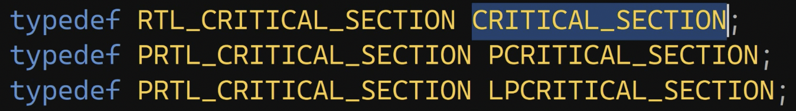
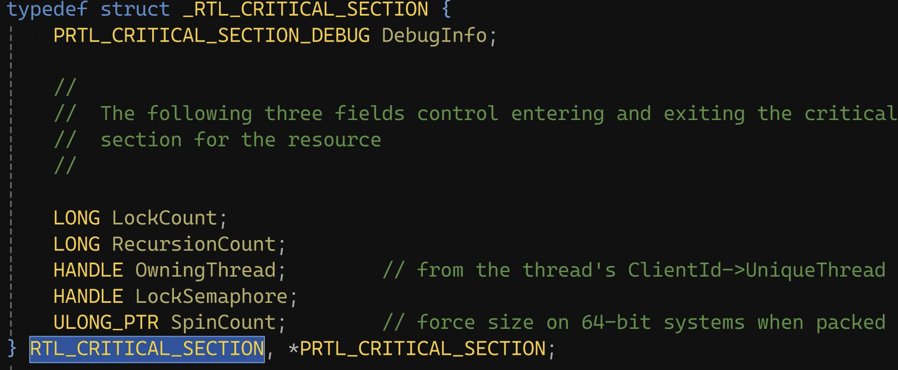
1. 不是Windows内核对象，只是C语言下用户态的结构体。
2. 用`CRITICAL_SECTION`声明、定义。
3. 用`InitializeCriticalSection`初始化
4. 用临界区就不用Mutex或Event了
5. 保护临界区用`EnterCriticalSection`
6. 离开临界区用`LeaveCriticalSection`
7. 进程的最后要销毁，`DeleteCriticalSection`

```cpp
constinit int tickets = 100;
DWORD WINAPI ThreadProc(void * lpParameter);
DWORD WINAPI ThreadProc2(void * lpParameter);

constinit HANDLE hEventExits[2] = {nullptr, nullptr};

CRITICAL_SECTION cs;
int main()
{
    hEventExits[0] = CreateEvent(nullptr, false, false, nullptr);
    hEventExits[1] = CreateEvent(nullptr, false, false, nullptr);

    ::InitializeCriticalSection(&cs);

    HANDLE hThread = ::CreateThread(nullptr, 0, &ThreadProc, nullptr, 0, nullptr);
    ::CloseHandle(hThread);
    hThread = ::CreateThread(nullptr, 0, &ThreadProc2, nullptr, 0, nullptr);
    ::CloseHandle(hThread);
    hThread = nullptr;

    ::WaitForMultipleObjects(2, hEventExits, true, INFINITE);
    ::CloseHandle(hEventExits[0]);
    ::CloseHandle(hEventExits[1]);
    ::DeleteCriticalSection(&cs);
    return 0;
}
DWORD WINAPI ThreadProc(void* parameter)
{
    while (true)
    {
        ::EnterCriticalSection(&cs);
        if (tickets > 0)
        {
            // ::Sleep(5); // 5ms
            std::wcout << L"Station #1: " << tickets-- << std::endl;
            ::LeaveCriticalSection(&cs);
        }
        else
        {
            ::LeaveCriticalSection(&cs);
            break;
        }
    }
    SetEvent(hEventExits[0]);
    return 0;
}
DWORD WINAPI ThreadProc2(void* parameter)
{
    while (true)
    {
        ::EnterCriticalSection(&cs);
        if (tickets > 0)
        {
            // ::Sleep(5); // 5ms
            std::wcout << L"Station #2: " << tickets-- << std::endl;
            ::LeaveCriticalSection(&cs);
        }
        else
        {
            ::LeaveCriticalSection(&cs);
            break;
        }
    }
    SetEvent(hEventExits[1]);
    return 0;
}
```
## 输出
```
Station #1: 1000
Station #1: 999
...
Station #1: ...
...
Station #1: 704
Station #1: 703
Station #1: 702
Station #2: 701
Station #2: 700
...
Station #2: ...
...
Station #2: 260
Station #2: 259
Station #2: 258
Station #1: 257
Station #1: 256
...
Station #1: ...
...
Station #1: 229
Station #1: 228
Station #1: 227
Station #2: 226
Station #2: 225
...
Station #2: ...
...
Station #2: 213
Station #2: 212
Station #1: 211
Station #1: 210
...
Station #1: ...
...
Station #1: 4
Station #1: 3
Station #1: 2
Station #1: 1
```
## 特点总结
1. 在用户态下，速度比内核态的Event、Mutex快
2. 也能实现同步保护，但是调配度没有那么细致，某一线程一直独占临界区的概率较大。
# 死锁
1. 加一个临界区对象
2. 线程1先进入临界区1再进入临界区2，退出时先退出2再退出1
2. 线程2先进入临界区2再进入临界区1，退出时先退出1再退出2

```cpp
CRITICAL_SECTION cs;
CRITICAL_SECTION cs2;
int main()
{
    hEventExits[0] = CreateEvent(nullptr, false, false, nullptr);
    hEventExits[1] = CreateEvent(nullptr, false, false, nullptr);

    ::InitializeCriticalSection(&cs);
    ::InitializeCriticalSection(&cs2);

    HANDLE hThread = ::CreateThread(nullptr, 0, &ThreadProc, nullptr, 0, nullptr);
    ::CloseHandle(hThread);
    hThread = ::CreateThread(nullptr, 0, &ThreadProc2, nullptr, 0, nullptr);
    ::CloseHandle(hThread);
    hThread = nullptr;

    ::WaitForMultipleObjects(2, hEventExits, true, INFINITE);
    ::CloseHandle(hEventExits[0]);
    ::CloseHandle(hEventExits[1]);
    ::DeleteCriticalSection(&cs);
    ::DeleteCriticalSection(&cs2);
    return 0;
}
DWORD WINAPI ThreadProc(void* parameter)
{
    while (true)
    {
        ::EnterCriticalSection(&cs);
        ::EnterCriticalSection(&cs2);
        if (tickets > 0)
        {
            ::Sleep(5); // 5ms
            std::wcout << L"Station #1: " << tickets-- << std::endl;
            ::LeaveCriticalSection(&cs2);
            ::LeaveCriticalSection(&cs);
        }
        else
        {
            ::LeaveCriticalSection(&cs2);
            ::LeaveCriticalSection(&cs);
            break;
        }
    }
    SetEvent(hEventExits[0]);
    return 0;
}
DWORD WINAPI ThreadProc2(void* parameter)
{
    while (true)
    {
        ::EnterCriticalSection(&cs2);
        ::EnterCriticalSection(&cs);
        if (tickets > 0)
        {
            ::Sleep(5); // 5ms
            std::wcout << L"Station #1: " << tickets-- << std::endl;
            ::LeaveCriticalSection(&cs);
            ::LeaveCriticalSection(&cs2);
        }
        else
        {
            ::LeaveCriticalSection(&cs);
            ::LeaveCriticalSection(&cs2);
            break;
        }
    }
    SetEvent(hEventExits[0]);
    return 0;
}
```
## 输出
```
Station #1: 1000
Station #1: 999
Station #1: 998
Station #1: 997
Station #1: 996
Station #1: 995
Station #1: 994
Station #1: 993
Station #1: 992
Station #1: 991
Station #1: 990
Station #1: 989
Station #1: 988
Station #1: 987
Station #1: 986
Station #1: 985
Station #1: 984
Station #1: 983
Station #1: 982
Station #1: 981
Station #1: 980
Station #1: 979
Station #1: 978
Station #1: 977
Station #1: 976
Station #1: 975
Station #1: 974
Station #1: 973
Station #1: 972
Station #1: 971
Station #1: 970
Station #1: 969
Station #1: 968
Station #1: 967
Station #1: 966
Station #1: 965
Station #1: 964
Station #1: 963
Station #1: 962
Station #1: 961
Station #1: 960
Station #1: 959
Station #1: 958
Station #1: 957
Station #1: 956
Station #1: 955
Station #1: 954
Station #1: 953
Station #1: 952
Station #1: 951
Station #1: 950
Station #1: 949
Station #1: 948
Station #1: 947
Station #1: 946
Station #1: 945
Station #1: 944
|               ---> block
```
这种情况是因为双方各自都需要两种锁，但是各自只持有一种锁，都在等待另一种锁释放。
# 多线程UI
VS新建项目，Windows Desktop Wizard，下一步，改名为`Multi-Threading-WithUI`，Create。弹出Windows Desktop Project，Application Type选择Desktop Application (.exe)，Additional options选择Empty project，OK。
手写创建控件。手册查阅：
[Progress Bar - Win32 apps | Microsoft Learn](https://learn.microsoft.com/en-us/windows/win32/controls/progress-bar-control-reference)
[About Progress Bar Controls - Win32 apps | Microsoft Learn](https://learn.microsoft.com/en-us/windows/win32/controls/progress-bar-control)
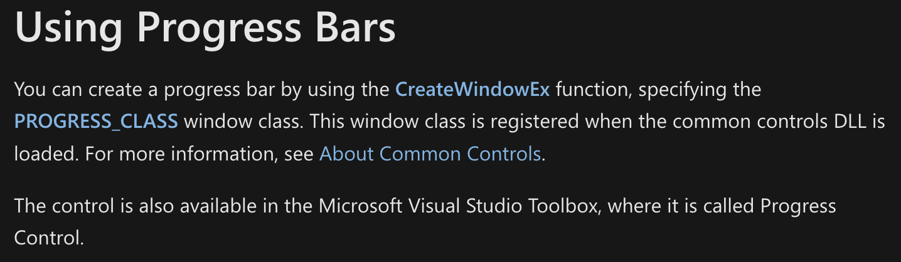
可以通过使用`CreateWindowEx`函数并指定`PROGRESS_CLASS`窗口类（定义于`CommCtrl.h`）来创建进度条。这个窗口类是公共控件DLL被加载后注册的。
即需要在ShowWindow显示主窗口后再`CreateWindowEx`创建一个子窗口。参数如下：
1. dwExStyle为叠放式
2. 类名为PROGRESS_CLASS
3. 窗口对象名字
4. dwStyle为子窗口WS_CHILDWINDOW
5. X、Y，宽度、高度
6. 父窗口hWndParent
7. hMenu
8. hInstance
9. lpParam

>Windows遵循“一切皆窗口”原则，进度条也是一个窗口，因此需要通过创建子窗口来创建进度条。

在WndProcedure的`case WM_CREATE`中创建。
自定义消息，创建进度条完成：
```cpp
#define CONTROL_FIN WM_USER + 1
```
在`case CONTROL_FIN`中，可以发送进度条的消息：
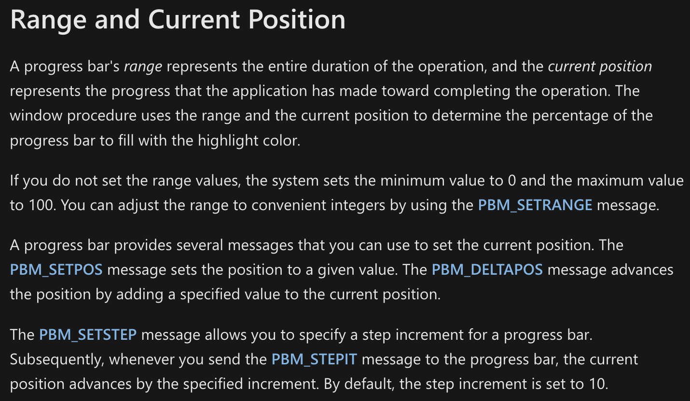
1. [PBM_SETRANGE message](https://learn.microsoft.com/en-us/windows/win32/controls/pbm-setrange)用于设置进度条的最小值和最大值，并重绘进度条以反映新的范围。
2. [PBM_SETPOS message](https://learn.microsoft.com/en-us/windows/win32/controls/pbm-setpos)用于设置进度条的当前位置并重绘进度条以反映新位置。

```cpp
HWND hProgressBar = nullptr;
int __stdcall wWinMain(HINSTANCE hInstance, HINSTANCE hPreInstance, wchar_t* lpCmdLine, int )
{
    // wcex ...
    if (!RegisterClassEx(&wcex))
    {
        return -1;
    }
    HWND hWnd = NULL;
    hWnd = CreateWindowEx(WS_EX_OVERLAPPEDWINDOW, szAppName, L"App", WS_OVERLAPPEDWINDOW, CW_USEDEFAULT, 0, CW_USEDEFAULT, 0, NULL, NULL, hIntance, NULL);
    ShowWindow(hWnd, iCmdShow);
    UpdateWindow(hWnd);

    // 创建控件：
    hProgressBar = CreateWindowEx(WS_EX_OVERLAPPEDWINDOW, PROGRESS_CLASS, L"Bar",
        WS_CHILDWINDOW, 100, 100, 200, 20,
        hWnd, nullptr, hInstance, nullptr);
    ::PostMessage(hWnd, CONTROL_FIN, 0, 0);
    ShowWindow(hProgressBar, iCmdShow);
    UpdateWindow(hProgressBar);

    MSG msg;
    while (GetMessage(&msg, NULL, 0, 0))
    {
        TranslateMessage(&msg);
        DispatchMessage(&msg);
    }
    return msg.wParam;
}
LRESULT CALLBACK WndProcedure(HWND hWnd, UINT message, WPARAM wParam, LPARAM lParam)
{
    HDC hDC = NULL;
    PAINTSTRUCT ps;
    switch (message)
    {
    case WM_CREATE:
    {
        return 0;
    }
    case CONTROL_FIN: // 自定义消息：创建进度条完成
    {
        // 用于设置进度条的最小值和最大值，并重绘进度条以反映新的范围
        ::PostMessage(hProgressBar, PBM_SETRANGE, 0, MAKELPARAM(0, 100));
        // 用于设置进度条的当前位置并重绘进度条以反映新位置。
        ::PostMessage(hProgressBar, PBM_SETPOS, 50, 0);
        return 0;
    }
    case WM_PAINT:
    {
        hDC = BeginPaint(hWnd, &ps);
        EndPaint(hWnd, &ps);
        return 0;
    }
    case WM_DESTROY:
    {
        PostQuitMessage(0);
        return 0;
    }
    }
    return DefWindowProc(hWnd, message, wParam, lParam);
}
int  __stdcall DlgProcedure(HWND hDlg, UINT message, WPARAM wParam, LPARAM lParam)
{
    switch (message)
    {
    case WM_INITDIALOG:
    {
        return false;
    }
    case WM_CLOSE:
    {
        EndDialog(hDlg, 0);
        return true;
    }
    case WM_COMMAND:
    {
        switch (LOWORD(wParam))
        {
        case IDCANCEL:
        {
            return true;
        }
        case IDOK:
        {
            return true;
        }
        }
        return false;
    }
    }
    return false;
}
```
以上UI程序的效果：

一个主窗口，包含一个进度条，50%。
## 单线程消息循环实现进度条动画
1. 想要通过按某个键，触发、通知进度条上涨至100%。
2. 并能同时显示多个进度条，每个进度条按不同速度走。
3. 同一时刻要让最多两个进度条能动。

[PBM_STEPIT message](https://learn.microsoft.com/en-us/windows/win32/controls/pbm-stepit)用于将进度条的当前位置向前推进步长增量，并重绘进度条以反映新位置。应用程序通过发送PBM_SETSTEP消息来设置步长增量。
```cpp
    case CONTROL_FIN: // 自定义消息：创建进度条完成
    {
        // 用于设置进度条的最小值和最大值，并重绘进度条以反映新的范围
        ::PostMessage(hProgressBar, PBM_SETRANGE, 0, MAKELPARAM(0, 100));
        // 用于设置进度条的当前位置并重绘进度条以反映新位置。
        ::PostMessage(hProgressBar, PBM_SETPOS, 0, 0);
        // 设置步长，每次走1
        ::PostMessage(hProgressBar, PBM_SETPOS, 1, 0);
        return 0;
    }
    case WM_KEYDOWN:
    {
        if (wParam == 'A')
        {
            for (int i = 0; i < 100; ++i)
            {
                ::PostMessage(hProgressBar, PBM_STEPIT, 0, 0);
                std::this_thread::sleep_for(100ms);
            }
        }
        return 0
    }
```
以上程序的问题是，一直没有进度条的动画，必须得等for循环完毕，进度条才能动，但是是一下子到头。
因为：
我们现在是PostMessage发送进度条消息，导致其他消息不能同时处理。
因此要用SendMessage，不进消息队列，直接操作控件，控件就可以立即响应了。
但是仍然存在问题：进度条结束前不能移动主窗口（移动主窗口是发送MOVE消息）。
UI消息驱动工作的原理是什么？
wWinMain函数中有一个消息循环。
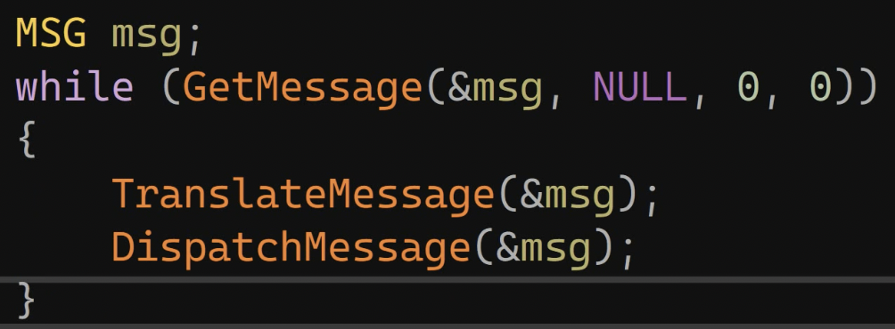
我们需要在`case WM_KEYDOWN`中也加入这样一个消息循环。

但是，GetMessage是以阻塞方式获取消息的，需要切换为PeekMessage。[PeekMessageW function (winuser.h) - Win32 apps | Microsoft Learn](https://learn.microsoft.com/en-us/windows/win32/api/winuser/nf-winuser-peekmessagew)
```cpp
    case WM_KEYDOWN:
    {
        if (wParam == 'A')
        {
            for (int i = 0; i < 100; ++i)
            {
                ::SendMessage(hProgressBar, PBM_STEPIT, 0, 0);
                std::this_thread::sleep_for(100ms);
                                
                MSG msg;
                while (::PeekMessage(&msg, NULL, 0, 0, PM_REMOVE))
                {
                    TranslateMessage(&msg);
                    DispatchMessage(&msg);
                }
            }
        }
        return 0;
    }
```
## 多线程消息处理
按下S键后，创建一个子线程，在子线程中进行发送消息。
子线程发送消息时，就没必要使用SendMessage了，使用PostMessage就可以，PostMessage是往主线程中的消息队列里投放消息。
但是要注意，由于创建的是jthread线程，最后会自动join，导致主线程会等待其操作完毕，那么主窗口就不能处理其他消息，因此子线程需要detach。
```cpp
    case WM_KEYDOWN:
    {
        if (wParam == 'A')
        {
            // ...
        }
        else if (wParam == 'S')
        {
            std::jthread t([]() -> void
                {
                    for (int i = 0; i < 100; ++i)
                    {
                        ::PostMessage(hProgressBar, PBM_STEPIT, 0, 0);
                        std::this_thread::sleep_for(100ms);
                    }
                });
            t.detach();
        }
        else if (wParam == 'F')
        {
            
        }
        return 0;
        
    }
```
### 通过条件变量控制子线程
我们把原本按下S键的内容直接让其在`case CONTROL_FIN`中完成，意味着创建进度条完成后，并且设置好进度条的属性后，立即创建子线程，但是要用条件变量控制：
#### 用Event控制
1. 在全局定义一个`h_start_event`
2. 在`case CONTROL_FIN`中CreateEvent与`h_start_event`绑定
3. 在jthread t函数体中，WaitForSingleObject等待`h_start_event`
4. 在`case WM_KEYDOWN`的F键中，SetEvent

```cpp
HANDLE h_start_event{ nullptr };

LRESULT CALLBACK WndProcedure(HWND hWnd, UINT message, WPARAM wParam, LPARAM lParam)
{
    HDC hDC = NULL;
    PAINTSTRUCT ps;
    switch (message)
    {
    case WM_CREATE:
    {
        return 0;
    }
    case CONTROL_FIN: // 自定义消息：创建进度条完成
    {
        h_start_event = ::CreateEvent(nullptr, false, false, nullptr);
        // 用于设置进度条的最小值和最大值，并重绘进度条以反映新的范围
        ::PostMessage(hProgressBar, PBM_SETRANGE, 0, MAKELPARAM(0, 100));
        // 用于设置进度条的当前位置并重绘进度条以反映新位置。
        ::PostMessage(hProgressBar, PBM_SETPOS, 0, 0);
        // 设置步长，每次走1
        ::PostMessage(hProgressBar, PBM_SETPOS, 1, 0);

        std::jthread t([]() -> void
            {
                ::WaitForSingleObject(h_start_event, INFINITE);
                
                for (int i = 0; i < 100; ++i)
                {
                    ::PostMessage(hProgressBar, PBM_STEPIT, 0, 0);
                    std::this_thread::sleep_for(100ms);
                }
            });
        t.detach();
        return 0;
    }
    case WM_KEYDOWN:
    {
        // ...
        else if (wParam == 'F')
        {
            ::SetEvent(h_start_event);
        }
        return 0;
    }
    // ...
    
}
```
#### 跨平台条件变量控制
1. 在全局定义一个`std::mutex start_mx`和`std::condition_variable start_cv`。
2. 在jthread t函数体中，定义`unique_lock lck{start_mx}`获取锁，之后`start_cv.wait(lck)`
3. 在`case WM_KEYDOWN`的F键中，`start_cv.notify_one()`

```cpp
std::mutex start_mx;
std::condition_variable start_cv;

LRESULT CALLBACK WndProcedure(HWND hWnd, UINT message, WPARAM wParam, LPARAM lParam)
{
    HDC hDC = NULL;
    PAINTSTRUCT ps;
    switch (message)
    {
    case WM_CREATE:
    {
        return 0;
    }
    case CONTROL_FIN: // 自定义消息：创建进度条完成
    {
        // 用于设置进度条的最小值和最大值，并重绘进度条以反映新的范围
        ::PostMessage(hProgressBar, PBM_SETRANGE, 0, MAKELPARAM(0, 100));
        // 用于设置进度条的当前位置并重绘进度条以反映新位置。
        ::PostMessage(hProgressBar, PBM_SETPOS, 0, 0);
        // 设置步长，每次走1
        ::PostMessage(hProgressBar, PBM_SETPOS, 1, 0);

        std::jthread t([]() -> void
            {
                std::unique_lock lck{ start_mx };
                start_cv.wait(lck);
                
                for (int i = 0; i < 100; ++i)
                {
                    ::PostMessage(hProgressBar, PBM_STEPIT, 0, 0);
                    std::this_thread::sleep_for(100ms);
                }
            });
        t.detach();
        return 0;
    }
    case WM_KEYDOWN:
    {
        // ...
        else if (wParam == 'F')
        {
            start_cv.notify_one();
        }
        return 0;
    }
    // ...
    
}
```
### 多个进度条
1. 全局定义3个`hProgressBar`。
2. 在wWinMain中CreateWindowEx创建这3个进度条，可以赋予不同初始属性。并且要三个全部show、Update
3. `case CONTROL_FIN`中PostMessage配置每个ProgressBar的属性。

```cpp
HWND hProgressBar{ nullptr }, hProgressBar2{ nullptr }, hProgress3{ nullptr };
int __stdcall wWinMain(HINSTANCE hInstance, HINSTANCE hPreInstance, wchar_t* lpCmdLine, )
{
    // ..,
    hProgressBar = CreateWindowEx(WS_EX_OVERLAPPEDWINDOW, PROGRESS_CLASS, L"Bar",
        WS_CHILDWINDOW, 100, 100, 300, 20,
        hWnd, nullptr, hInstance, nullptr);
    hProgressBar2 = CreateWindowEx(WS_EX_OVERLAPPEDWINDOW, PROGRESS_CLASS, L"Bar2",
        WS_CHILDWINDOW, 100, 150, 300, 20,
        hWnd, nullptr, hInstance, nullptr);
    hProgressBar3 = CreateWindowEx(WS_EX_OVERLAPPEDWINDOW, PROGRESS_CLASS, L"Bar3",
        WS_CHILDWINDOW, 100, 200, 300, 20,
        hWnd, nullptr, hInstance, nullptr);
    ::PostMessage(hWnd, CONTROL_FIN, 0, 0);

    ShowWindow(hProgressBar, iCmdShow);
    ShowWindow(hProgressBar2, iCmdShow);
    ShowWindow(hProgressBar3, iCmdShow);
    UpdateWindow(hProgressBar);
    UpdateWindow(hProgressBar2);
    UpdateWindow(hProgressBar3);
    // ...
}
// ...
{
    case CONTROL_FIN:
    {
        ::PostMessage(hProgressBar, PBM_SETRANGE, 0, MAKELPARAM(0, 100));
        ::PostMessage(hProgressBar, PBM_SETPOS, 0, 0);
        ::PostMessage(hProgressBar, PBM_SETSTEP, 1, 0);

        ::PostMessage(hProgressBar2, PBM_SETRANGE, 0, MAKELPARAM(0, 100));
        ::PostMessage(hProgressBar2, PBM_SETPOS, 34, 0);
        ::PostMessage(hProgressBar2, PBM_SETSTEP, 1, 0);

        ::PostMessage(hProgressBar3, PBM_SETRANGE, 0, MAKELPARAM(0, 100));
        ::PostMessage(hProgressBar3, PBM_SETPOS, 67, 0);
        ::PostMessage(hProgressBar3, PBM_SETSTEP, 1, 0);
        // ...
    }
}
```
效果如下：

# Windows信号量
## CreateSemaphore创建信号量
创建的API为`CreateSemaphore`
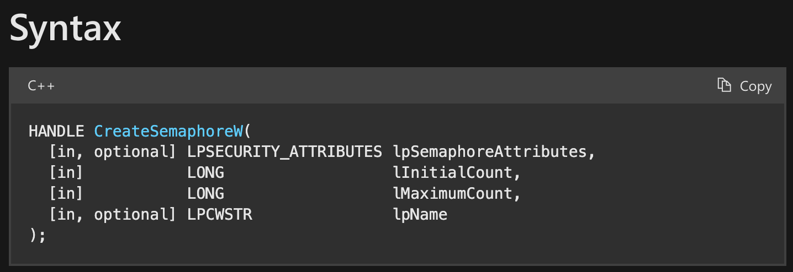
1. 可选，安全描述符，如果是NULL则获得默认的安全描述符。如果是NULL则该句柄不能被子进程继承。
2. 信号量的初始值。必须大于等于0。
3. 信号量的最大值。必须大于0。
4. 可选，信号量内核对象的名字。如果是NULL则没有名称。
## WaitForSingleObject信号量减
```cpp
::WaitForSingleObject(h_semaphore, INFINITE);
```
## ReleaseSemaphore信号量加
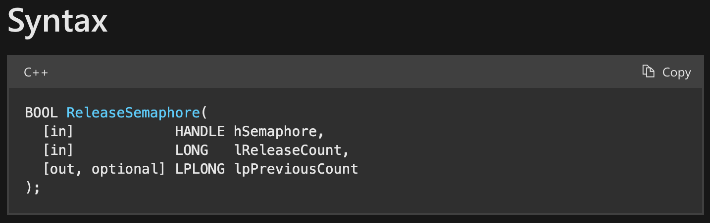
1. 信号量对象的句柄
2. 要增加的量，必须大于0。但是如果该值大于信号量的最大值，则无效，不做更改，返回FALSE。
3. 一个指针，用于接收信号量先前的数值，可以为NULL。
## 示例：多个进度条同时动画
1. 以下程序的效果是，按下F键后，同时可以有两个条进行加载，两个条中如果有一个加载完后，第三个条开始加载。
2. 三个线程需要有条件变量来等待F键按下，而条件变量需要锁，而后wait。
3. case F需要给他们notify_all
4. wait成功后进行获取信号量，信号量初始值、最大值为2。
5. 但是要求要有两个同时加载，所以某一个线程不能一直拿着一把锁，因此需要wait成功后unlock。
6. 结束for循环后释放信号量，即加1。

在上一节《[多个进度条](#多个进度条)》的基础上，需要做的是：
1. 在`case CONTROL_FIN`中创建3个线程，对应3个进度条。
2. 在`case CONTROL_FIN`中创建信号量`h_semaphore`。
3. 每个线程需要wait按下F键的通知，所以需要先获取锁。
4. wait成功后需要unlock。
5. 获取信号量。
6. for循环结束后，释放信号量。
7. 3个jthread线程在最后detach。

```cpp
{
    case CONTROL_FIN:
    {
        h_semaphore = ::CreateSemaphore(nullptr, 2, 2, nullptr);
        std::jthread t([]() -> void
        {
            std::unique_lock lck{ start_mx };
            start_cv.wait(lck);
            lck.unlock();
            ::WaitForSingleObject(h_semaphore, INFINITE);
            for (int i = 0; i < 33; ++i)
            {
                ::PostMessage(hProgress, PBM_SETPIT, 0, 0);
                std::this_thread::sleep_for(100ms);
            }
            ::ReleaseSemaphore(h_semaphore, 1, nullptr);
        });
        std::jthread t2([]() -> void
        {
            std::unique_lock lck{ start_mx };
            start_cv.wait(lck);
            lck.unlock();
            ::WaitForSingleObject(h_semaphore, INFINITE);
            for (int i = 33; i < 66; ++i)
            {
                ::PostMessage(hProgress, PBM_SETPIT, 0, 0);
                std::this_thread::sleep_for(100ms);
            }
            ::ReleaseSemaphore(h_semaphore, 1, nullptr);
        });
        std::jthread t3([]() -> void
        {
            std::unique_lock lck{ start_mx };
            start_cv.wait(lck);
            lck.unlock();
            ::WaitForSingleObject(h_semaphore, INFINITE);
            for (int i = 66; i < 100; ++i)
            {
                ::PostMessage(hProgress, PBM_SETPIT, 0, 0);
                std::this_thread::sleep_for(100ms);
            }
            ::ReleaseSemaphore(h_semaphore, 1, nullptr);
        });
        t.detach();
        t2.detach();
        t3.detach();
    }
    case WM_KETDOWN:
    {
        // ...
        else if (wParam == 'F')
        {
            start_cv.notify_all();
        }
        return 0;
    }
    // ...
}
```