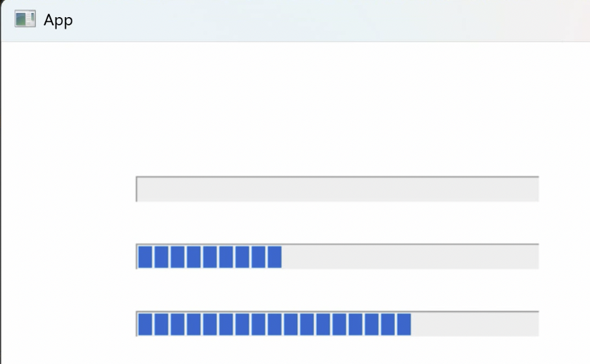

# 进程和线程的关系
1. 进程是程序的运行实例。包含全局变量。
2. 一个进程至少包含一个线程
3. 程序运行的最小单位是函数，线程则是函数的运行实例。
4. 线程是操作系统的术语，而对于处理器来说线程是任务，每个逻辑处理器（或是处理器核心）都可以对应一个线程，并且可以在一个处理器上同时运行不同进程的线程。
5. 线程中包含线程栈。
# 卖票程序
```cpp
#include <iostream>
constinit int tickets = 100;
int main()
{
    while (true)
    {
        std::wcout << L"Station main: " << tickets-- << std::endl;
        if (tickets == 0)
        {
            break;
        }
    }   
}
```
## 引入Window线程
官方文档：[CreateThread function (processthreadsapi.h) - Win32 apps | Microsoft Learn](https://learn.microsoft.com/en-us/windows/win32/api/processthreadsapi/nf-processthreadsapi-createthread)


1. 可选，LP即long pointer，看作pointer就行。Security Attributes意为安全描述符。
    1. 用于ACLs，Access Control Lists。微软常用的手段，哪些东西可以访问，有什么权限等等。可以填NULL得到默认的安全描述符。
2. 线程栈大小，填0意为默认值，Windows下是1M，Linux是4M。
3. 函数的地址，告知线程具体从哪里执行。需要遵循函数签名。[ThreadProc callback function (Windows) | Microsoft Learn](https://learn.microsoft.com/en-us/previous-versions/windows/desktop/legacy/ms686736(v=vs.85))
    1. `DWORD WINAPI ThreadProc(_In_ LPVOID lpParameter);`
    2. LPVOID指的是`void *`
    3. `_In_`是一个 SAL（Source Annotation Language）宏， 用于注释 Windows API 函数参数。它提供有关函数参数的额外信息，以帮助编译器进行静态分析和代码检查。我们可以省略。
    4. WINAPI指`__stdcall`
    5. 因此可以简化为：`DWORD WINAPI ThreadProc(void * lpParameter);`
    6. `C++`中传入函数地址时，需要在函数名字之前加一个`&`取地址。
4. 可选，函数的参数
5. 线程的控制符。
    1. 0表示创建后立即执行
    2. `CREATE_SUSPENDED`表示创建后挂起，直到调用ResumeThread
6. 可选，输出值，给一个指针可以获得线程ID。此线程ID与Handle不同。可填NULL。
7. 返回值：如果创建成功，返回此线程的句柄。

创建完线程并执行后，需要关闭Handle，但这不意味着关闭线程，只不过是说此句柄不再绑定这个线程，不对线程进行管理了，那么线程运行结束之后就会自行停止。
```cpp
#include <Windows.h>
constinit int tickets = 100;
DWORD WINAPI ThreadProc(void * lpParameter);
int main()
{
    // start a new thread
    HANDLE hThread = ::CreateThread(nullptr, 0, &ThreadProc, nullptr, 0, nullptr);
    ::CloseHandle(hThread);
    hThread = nullptr;
    
    while (true)
    {
        std::wcout << L"Station main: " << tickets-- << std::endl;
        if (tickets == 0)
        {
            break;
        }
    }
}
DWORD WINAPI ThreadProc(void* parameter)
{
    while(true)
    {
        std::wcout << L"Station main: " << tickets-- << std::endl;
        if (tickets == 0)
        {
            break;
        }
    }
}
```
可能在输出结果中看到两个线程抢占式的输出，导致内容杂乱。
## 改一下结构
```cpp
// ...
int main()
{
    // ...
    
    while (true)
    {
        if (tickets > 0)
        {
            std::wcout << L"Station #main: " << tickets-- << std::endl;
        }
        else
            break;
    }
}
DWORD WINAPI ThreadProc(void* parameter)
{
    while(true)
    {
        if (tickets > 0)
        {
            std::wcout << L"Station #1: " << tickets-- << std::endl;
        }
        else
            break;
    }
}
```
## 通过sleep把时间片放大
通过sleep把时间片放大，可以让多线程中隐患的几率增大。
```cpp
// ...
int main()
{
    // ...
    
    while (true)
    {
        if (tickets > 0)
        {
            ::Sleep(5); // 5ms
            std::wcout << L"Station #main: " << tickets-- << std::endl;
        }
        else
            break;
    }
    ::Sleep(5000); // 等待所有线程出来
}
DWORD WINAPI ThreadProc(void* parameter)
{
    while(true)
    {
        if (tickets > 0)
        {
            ::Sleep(5); // 5ms
            std::wcout << L"Station #1: " << tickets-- << std::endl;
        }
        else
            break;
    }
}
```
最后输出发现，main线程把0号票卖了，最后导致票余量为-1。

可能的情况：main线程判断tickets为1后准备卖票，睡了5ms期间被1线程卖掉了最后一张票，之后main线程唤醒后是不知道的，依旧减了票量到-1。
## 通过锁保护
CreateMutex - 互斥锁
[CreateMutexW function (synchapi.h) - Win32 apps | Microsoft Learn](https://learn.microsoft.com/en-us/windows/win32/api/synchapi/nf-synchapi-createmutexw)

1. 可选，安全描述符，可填NULL获得默认的。
2. 此时的线程是不是立马持有锁而其他线程无法访问。
3. 可选，名字。
4. 返回值是句柄。

在此例我们要给这个锁一个全局可访问的句柄。

在临界区之前需要`WaitForSingleObject`等待锁的信号。
[WaitForSingleObject function (synchapi.h) - Win32 apps | Microsoft Learn](https://learn.microsoft.com/en-us/windows/win32/api/synchapi/nf-synchapi-waitforsingleobject)

1. 指明等待的对象的句柄
2. 等待的时间
    1. 可填非0的值
    2. 如果填0，而没有信号，则会立即返回，一直重复试探、空转。
    3. 可以填INFINITE，无限期等下去。

临界区后需要`ReleaseMutex`释放锁。而且要注意，在if语句的每个情况下都需要写释放锁语句。

```cpp
constinit HANDLE hMutex = nullptr;
int main()
{
    hMutex = ::CreateMutex(nullptr, false, nullptr);
    // start a new thread
      // ...
    while (true)
    {
        ::WaitForSingleObject(hThread, INFINITE);
        if (tickets > 0)
        {
            ::Sleep(5); // 5ms
            std::wcout << L"Station #main: " << tickets-- << std::endl;
            ::ReleaseMutex(hMutex);
        }
        else
        {
            ::ReleaseMutex(hMutex);
            break;
        }
    }
    ::Sleep(5000); // 等待所有线程出来
}
DWORD WINAPI ThreadProc(void* parameter)
{
    while (true)
    {
        ::WaitForSingleObject(hThread, INFINITE);
        if (tickets > 0)
        {
            ::Sleep(5); // 5ms
            std::wcout << L"Station #main: " << tickets-- << std::endl;
            ::ReleaseMutex(hMutex);
        }
        else
        {
            ::ReleaseMutex(hMutex);
            break;
        }
    }
}
```


## 两个子线程
```cpp
DWORD WINAPI ThreadProc(void* parameter);
DWORD WINAPI ThreadProc2(void* parameter);
int main()
{
    // 起始 主线程 拥有锁
    hMutex = ::CreateMutex(nullptr, true, nullptr);
    ::ReleaseMutex(hMutex);
    
    HANDLE hThread = ::CreateThread(nullptr, 0, &ThreadProc, nullptr, 0, nullptr);
    ::CloseHandle(hThread);
    hThread = ::CreateThread(nullptr, 0, &ThreadProc2, nullptr, 0, nullptr);
    ::CloseHandle(hThread);
    hThread = nullptr;

    ::Sleep(5000);
}
DWORD WINAPI ThreadProc(void* parameter)
{
    while (true)
    {
        ::WaitForSingleObject(hThread, INFINITE);
        if (tickets > 0)
        {
            ::Sleep(5); // 5ms
            std::wcout << L"Station #main: " << tickets-- << std::endl;
            ::ReleaseMutex(hMutex);
        }
        else
        {
            ::ReleaseMutex(hMutex);
            break;
        }
    }
}
DWORD WINAPI ThreadProc2(void* parameter)
{
    while (true)
    {
        ::WaitForSingleObject(hThread, INFINITE);
        if (tickets > 0)
        {
            ::Sleep(5); // 5ms
            std::wcout << L"Station #main: " << tickets-- << std::endl;
            ::ReleaseMutex(hMutex);
        }
        else
        {
            ::ReleaseMutex(hMutex);
            break;
        }
    }
}
```
## 命名锁
比如要想做应用程序的单例模式。
可以用锁和内核对象进行控制。
为什么要用名字呢？
因为每个线程创建完之后内核返回的句柄值时随机的，线程只知道自己的，而不知道其他人的句柄。但当程序员主动在创建线程时给了名字后，系统就有所感知，你之前已经创建过这个东西，就会把之前的句柄返回给你，就可以访问相同的对象了。


```cpp
constinit HANDLE hMutex = nullptr;
constinit HANDLE hSingletonMx = nullptr;

int main()
{
    // 起始 主线程 拥有锁
    hSingletonMx = ::CreateMutex(nullptr, false, L"AppSingleton");
    if (::GetLastError() == ERROR_ALREADY_EXISTS)
    {
        ::CloseHandle(hSingletonMx);
        return 0;  // break point
    }
    hMutex = ::CreateMutex(nullptr, false, nullptr);
    ::ReleaseMutex(hMutex);
    
    HANDLE hThread = ::CreateThread(nullptr, 0, &ThreadProc, nullptr, 0, nullptr);
    ::CloseHandle(hThread);
    hThread = ::CreateThread(nullptr, 0, &ThreadProc2, nullptr, 0, nullptr);
    ::CloseHandle(hThread);
    hThread = nullptr;

    ::Sleep(10000);
    ::CloseHandle(hSingletonMx);
    return 0;
}
```
### VS下多线程调试
1. 下断点。
2. 先运行一个程序。
3. 在Sleep 10s结束之前。右击项目名，Debug，Start New Instance。
4. 会发现，第二个程序会直接到达`closeHandle(hSingletonMx)`。
5. 这就是跨应用程序的singleton
# Windows下的独特锁：事件
事件提供了比Mutex更多的功能。
用`CreateEvent`创建。
[CreateEventW function (synchapi.h) - Win32 apps | Microsoft Learn](https://learn.microsoft.com/en-us/windows/win32/api/synchapi/nf-synchapi-createeventw)

1. 可选，安全描述符，填NULL表示获取默认描述符。
2. 是否手动重置，意思是如果是手动重置则需要在`WaitForSingleObject`之后`ResetEvent(hEvent)`手动上锁，在此期间可能会被其他人抢占该信号。如果是自动重置则是Wait后自动上锁。
3. 初始状态，true为有信号（signaled），false为无信号（nonsignaled）。有信号意为没有上锁，无信号时需要自己把锁打开。
4. 可选，命名或匿名。
使用Event时需要做以下修改：
1. main函数中`CreateEvent`
2. main函数最后`CloseHandle`参数改为hEvent
3. 线程函数中
    1. WaitForSingleObject参数改为hEvent
    2. 退出临界区的开锁对于Event来说方法为`SetEvent(hEvent)`

```cpp
constinit HANDLE hEvent = nullptr;
int main()
{
    hEvent = CreateEvent(nullptr, false, true, nullptr);
    
    HANDLE hThread = ::CreateThread(nullptr, 0, &ThreadProc, nullptr, 0, nullptr);
    ::CloseHandle(hThread);
    hThread = ::CreateThread(nullptr, 0, &ThreadProc2, nullptr, 0, nullptr);
    ::CloseHandle(hThread);
    hThread = nullptr;

    ::Sleep(10000);
    ::CloseHandle(hEvent);
    return 0;
}
DWORD WINAPI ThreadProc(void* parameter)
{
    while (true)
    {
        ::WaitForSingleObject(hEvent, INFINITE);
        if (tickets > 0)
        {
            ::Sleep(5); // 5ms
            std::wcout << L"Station #main: " << tickets-- << std::endl;
            ::SetEvent(hEvent);
        }
        else
        {
            ::SetEvent(hEvent);
            break;
        }
    }
}
```
## 不同
1. Mutex与拥有者绑定，只能听从拥有者支配。
2. Event没有绑定拥有者，任何人只要拿到它的句柄就可以支配。
3. Event更像是一个信号的概念，给别人通知。Linux下的对标物：条件变量

以下，可以当作主线程的信号接收器，当两个子线程全部发出结尾的信号时，主线程就可以停止阻塞，继续执行，从而取代了死板的Sleep。
使用`WaitForMultipleObjects`。
[WaitForMultipleObjects function (synchapi.h) - Win32 apps | Microsoft Learn](https://learn.microsoft.com/en-us/windows/win32/api/synchapi/nf-synchapi-waitformultipleobjects)

1. 事件对象的个数
2. 事件对象句柄数组的首元素指针
3. 是否等待所有事件对象全部到位再退出
4. 0是空转，INFINITE是无限期，非0是最多等多久后退出。

两个子线程的完成事件信号，初始状态必须是无信号，即在创建时，`CreateEvent`的第三个参数为false。
两个子线程在结束时，需要`SetEvent(hEventExits[0 or 1]);`进行开锁。
```cpp
constinit int tickets = 100;
DWORD WINAPI ThreadProc(void * lpParameter);
DWORD WINAPI ThreadProc2(void * lpParameter);

constinit HANDLE hEvent = nullptr;
constinit HANDLE hEventExits[2] = {nullptr, nullptr};
int main()
{
    hEvent = CreateEvent(nullptr, false, true, nullptr);
    hEventExits[0] = CreateEvent(nullptr, false, false, nullptr);
    hEventExits[1] = CreateEvent(nullptr, false, false, nullptr);
    HANDLE hThread = ::CreateThread(nullptr, 0, &ThreadProc, nullptr, 0, nullptr);
    ::CloseHandle(hThread);
    hThread = ::CreateThread(nullptr, 0, &ThreadProc2, nullptr, 0, nullptr);
    ::CloseHandle(hThread);
    hThread = nullptr;

    ::WaitForMultipleObjects(2, hEventExits, true, INFINITE);
    ::CloseHandle(hEvent);
    ::CloseHandle(hEventExits[0]);
    ::CloseHandle(hEventExits[1]);
    ::DeleteCriticalSection(&cs);
    return 0;
}
DWORD WINAPI ThreadProc(void* parameter)
{
    while (true)
    {
        ::WaitForSingleObject(hEvent, INFINITE);
        if (tickets > 0)
        {
            ::Sleep(5); // 5ms
            std::wcout << L"Station #1: " << tickets-- << std::endl;
            ::SetEvent(hEvent);
        }
        else
        {
            ::SetEvent(hEvent);
            break;
        }
    }
    SetEvent(hEventExits[0]);
    return 0;
}
DWORD WINAPI ThreadProc2(void* parameter)
{
    while (true)
    {
        ::WaitForSingleObject(hEvent, INFINITE);
        if (tickets > 0)
        {
            ::Sleep(5); // 5ms
            std::wcout << L"Station #2: " << tickets-- << std::endl;
            ::SetEvent(hEvent);
        }
        else
        {
            ::SetEvent(hEvent);
            break;
        }
    }
    SetEvent(hEventExits[1]);
    return 0;
}
```
输出：
```
 ...
Station #1: 20
Station #2: 19
Station #1: 18
Station #2: 17
Station #1: 16
Station #2: 15
Station #1: 14
Station #2: 13
Station #1: 12
Station #2: 11
Station #1: 10
Station #2: 9
Station #1: 8
Station #2: 7
Station #1: 6
Station #2: 5
Station #1: 4
Station #2: 3
Station #1: 2
Station #2: 1
```
# Windows临界区


1. 不是Windows内核对象，只是C语言下用户态的结构体。
2. 用`CRITICAL_SECTION`声明、定义。
3. 用`InitializeCriticalSection`初始化
4. 用临界区就不用Mutex或Event了
5. 保护临界区用`EnterCriticalSection`
6. 离开临界区用`LeaveCriticalSection`
7. 进程的最后要销毁，`DeleteCriticalSection`

```cpp
constinit int tickets = 100;
DWORD WINAPI ThreadProc(void * lpParameter);
DWORD WINAPI ThreadProc2(void * lpParameter);

constinit HANDLE hEventExits[2] = {nullptr, nullptr};

CRITICAL_SECTION cs;
int main()
{
    hEventExits[0] = CreateEvent(nullptr, false, false, nullptr);
    hEventExits[1] = CreateEvent(nullptr, false, false, nullptr);

    ::InitializeCriticalSection(&cs);

    HANDLE hThread = ::CreateThread(nullptr, 0, &ThreadProc, nullptr, 0, nullptr);
    ::CloseHandle(hThread);
    hThread = ::CreateThread(nullptr, 0, &ThreadProc2, nullptr, 0, nullptr);
    ::CloseHandle(hThread);
    hThread = nullptr;

    ::WaitForMultipleObjects(2, hEventExits, true, INFINITE);
    ::CloseHandle(hEventExits[0]);
    ::CloseHandle(hEventExits[1]);
    ::DeleteCriticalSection(&cs);
    return 0;
}
DWORD WINAPI ThreadProc(void* parameter)
{
    while (true)
    {
        ::EnterCriticalSection(&cs);
        if (tickets > 0)
        {
            // ::Sleep(5); // 5ms
            std::wcout << L"Station #1: " << tickets-- << std::endl;
            ::LeaveCriticalSection(&cs);
        }
        else
        {
            ::LeaveCriticalSection(&cs);
            break;
        }
    }
    SetEvent(hEventExits[0]);
    return 0;
}
DWORD WINAPI ThreadProc2(void* parameter)
{
    while (true)
    {
        ::EnterCriticalSection(&cs);
        if (tickets > 0)
        {
            // ::Sleep(5); // 5ms
            std::wcout << L"Station #2: " << tickets-- << std::endl;
            ::LeaveCriticalSection(&cs);
        }
        else
        {
            ::LeaveCriticalSection(&cs);
            break;
        }
    }
    SetEvent(hEventExits[1]);
    return 0;
}
```
## 输出
```
Station #1: 1000
Station #1: 999
Station #1: 998
Station #1: 997
Station #1: 996
Station #1: 995
Station #1: 994
Station #1: 993
Station #1: 992
Station #1: 991
Station #1: 990
Station #1: 989
Station #1: 988
Station #1: 987
Station #1: 986
Station #1: 985
Station #1: 984
Station #1: 983
Station #1: 982
Station #1: 981
Station #1: 980
Station #1: 979
Station #1: 978
Station #1: 977
Station #1: 976
Station #1: 975
Station #1: 974
Station #1: 973
Station #1: 972
Station #1: 971
Station #1: 970
Station #1: 969
Station #1: 968
Station #1: 967
Station #1: 966
Station #1: 965
Station #1: 964
Station #1: 963
Station #1: 962
Station #1: 961
Station #1: 960
Station #1: 959
Station #1: 958
Station #1: 957
Station #1: 956
Station #1: 955
Station #1: 954
Station #1: 953
Station #1: 952
Station #1: 951
Station #1: 950
Station #1: 949
Station #1: 948
Station #1: 947
Station #1: 946
Station #1: 945
Station #1: 944
Station #1: 943
Station #1: 942
Station #1: 941
Station #1: 940
Station #1: 939
Station #1: 938
Station #1: 937
Station #1: 936
Station #1: 935
Station #1: 934
Station #1: 933
Station #1: 932
Station #1: 931
Station #1: 930
Station #1: 929
Station #1: 928
Station #1: 927
Station #1: 926
Station #1: 925
Station #1: 924
Station #1: 923
Station #1: 922
Station #1: 921
Station #1: 920
Station #1: 919
Station #1: 918
Station #1: 917
Station #1: 916
Station #1: 915
Station #1: 914
Station #1: 913
Station #1: 912
Station #1: 911
Station #1: 910
Station #1: 909
Station #1: 908
Station #1: 907
Station #1: 906
Station #1: 905
Station #1: 904
Station #1: 903
Station #1: 902
Station #1: 901
Station #1: 900
Station #1: 899
Station #1: 898
Station #1: 897
Station #1: 896
Station #1: 895
Station #1: 894
Station #1: 893
Station #1: 892
Station #1: 891
Station #1: 890
Station #1: 889
Station #1: 888
Station #1: 887
Station #1: 886
Station #1: 885
Station #1: 884
Station #1: 883
Station #1: 882
Station #1: 881
Station #1: 880
Station #1: 879
Station #1: 878
Station #1: 877
Station #1: 876
Station #1: 875
Station #1: 874
Station #1: 873
Station #1: 872
Station #1: 871
Station #1: 870
Station #1: 869
Station #1: 868
Station #1: 867
Station #1: 866
Station #1: 865
Station #1: 864
Station #1: 863
Station #1: 862
Station #1: 861
Station #1: 860
Station #1: 859
Station #1: 858
Station #1: 857
Station #1: 856
Station #1: 855
Station #1: 854
Station #1: 853
Station #1: 852
Station #1: 851
Station #1: 850
Station #1: 849
Station #1: 848
Station #1: 847
Station #1: 846
Station #1: 845
Station #1: 844
Station #1: 843
Station #1: 842
Station #1: 841
Station #1: 840
Station #1: 839
Station #1: 838
Station #1: 837
Station #1: 836
Station #1: 835
Station #1: 834
Station #1: 833
Station #1: 832
Station #1: 831
Station #1: 830
Station #1: 829
Station #1: 828
Station #1: 827
Station #1: 826
Station #1: 825
Station #1: 824
Station #1: 823
Station #1: 822
Station #1: 821
Station #1: 820
Station #1: 819
Station #1: 818
Station #1: 817
Station #1: 816
Station #1: 815
Station #1: 814
Station #1: 813
Station #1: 812
Station #1: 811
Station #1: 810
Station #1: 809
Station #1: 808
Station #1: 807
Station #1: 806
Station #1: 805
Station #1: 804
Station #1: 803
Station #1: 802
Station #1: 801
Station #1: 800
Station #1: 799
Station #1: 798
Station #1: 797
Station #1: 796
Station #1: 795
Station #1: 794
Station #1: 793
Station #1: 792
Station #1: 791
Station #1: 790
Station #1: 789
Station #1: 788
Station #1: 787
Station #1: 786
Station #1: 785
Station #1: 784
Station #1: 783
Station #1: 782
Station #1: 781
Station #1: 780
Station #1: 779
Station #1: 778
Station #1: 777
Station #1: 776
Station #1: 775
Station #1: 774
Station #1: 773
Station #1: 772
Station #1: 771
Station #1: 770
Station #1: 769
Station #1: 768
Station #1: 767
Station #1: 766
Station #1: 765
Station #1: 764
Station #1: 763
Station #1: 762
Station #1: 761
Station #1: 760
Station #1: 759
Station #1: 758
Station #1: 757
Station #1: 756
Station #1: 755
Station #1: 754
Station #1: 753
Station #1: 752
Station #1: 751
Station #1: 750
Station #1: 749
Station #1: 748
Station #1: 747
Station #1: 746
Station #1: 745
Station #1: 744
Station #1: 743
Station #1: 742
Station #1: 741
Station #1: 740
Station #1: 739
Station #1: 738
Station #1: 737
Station #1: 736
Station #1: 735
Station #1: 734
Station #1: 733
Station #1: 732
Station #1: 731
Station #1: 730
Station #1: 729
Station #1: 728
Station #1: 727
Station #1: 726
Station #1: 725
Station #1: 724
Station #1: 723
Station #1: 722
Station #1: 721
Station #1: 720
Station #1: 719
Station #1: 718
Station #1: 717
Station #1: 716
Station #1: 715
Station #1: 714
Station #1: 713
Station #1: 712
Station #1: 711
Station #1: 710
Station #1: 709
Station #1: 708
Station #1: 707
Station #1: 706
Station #1: 705
Station #1: 704
Station #1: 703
Station #1: 702
Station #2: 701
Station #2: 700
Station #2: 699
Station #2: 698
Station #2: 697
Station #2: 696
Station #2: 695
Station #2: 694
Station #2: 693
Station #2: 692
Station #2: 691
Station #2: 690
Station #2: 689
Station #2: 688
Station #2: 687
Station #2: 686
Station #2: 685
Station #2: 684
Station #2: 683
Station #2: 682
Station #2: 681
Station #2: 680
Station #2: 679
Station #2: 678
Station #2: 677
Station #2: 676
Station #2: 675
Station #2: 674
Station #2: 673
Station #2: 672
Station #2: 671
Station #2: 670
Station #2: 669
Station #2: 668
Station #2: 667
Station #2: 666
Station #2: 665
Station #2: 664
Station #2: 663
Station #2: 662
Station #2: 661
Station #2: 660
Station #2: 659
Station #2: 658
Station #2: 657
Station #2: 656
Station #2: 655
Station #2: 654
Station #2: 653
Station #2: 652
Station #2: 651
Station #2: 650
Station #2: 649
Station #2: 648
Station #2: 647
Station #2: 646
Station #2: 645
Station #2: 644
Station #2: 643
Station #2: 642
Station #2: 641
Station #2: 640
Station #2: 639
Station #2: 638
Station #2: 637
Station #2: 636
Station #2: 635
Station #2: 634
Station #2: 633
Station #2: 632
Station #2: 631
Station #2: 630
Station #2: 629
Station #2: 628
Station #2: 627
Station #2: 626
Station #2: 625
Station #2: 624
Station #2: 623
Station #2: 622
Station #2: 621
Station #2: 620
Station #2: 619
Station #2: 618
Station #2: 617
Station #2: 616
Station #2: 615
Station #2: 614
Station #2: 613
Station #2: 612
Station #2: 611
Station #2: 610
Station #2: 609
Station #2: 608
Station #2: 607
Station #2: 606
Station #2: 605
Station #2: 604
Station #2: 603
Station #2: 602
Station #2: 601
Station #2: 600
Station #2: 599
Station #2: 598
Station #2: 597
Station #2: 596
Station #2: 595
Station #2: 594
Station #2: 593
Station #2: 592
Station #2: 591
Station #2: 590
Station #2: 589
Station #2: 588
Station #2: 587
Station #2: 586
Station #2: 585
Station #2: 584
Station #2: 583
Station #2: 582
Station #2: 581
Station #2: 580
Station #2: 579
Station #2: 578
Station #2: 577
Station #2: 576
Station #2: 575
Station #2: 574
Station #2: 573
Station #2: 572
Station #2: 571
Station #2: 570
Station #2: 569
Station #2: 568
Station #2: 567
Station #2: 566
Station #2: 565
Station #2: 564
Station #2: 563
Station #2: 562
Station #2: 561
Station #2: 560
Station #2: 559
Station #2: 558
Station #2: 557
Station #2: 556
Station #2: 555
Station #2: 554
Station #2: 553
Station #2: 552
Station #2: 551
Station #2: 550
Station #2: 549
Station #2: 548
Station #2: 547
Station #2: 546
Station #2: 545
Station #2: 544
Station #2: 543
Station #2: 542
Station #2: 541
Station #2: 540
Station #2: 539
Station #2: 538
Station #2: 537
Station #2: 536
Station #2: 535
Station #2: 534
Station #2: 533
Station #2: 532
Station #2: 531
Station #2: 530
Station #2: 529
Station #2: 528
Station #2: 527
Station #2: 526
Station #2: 525
Station #2: 524
Station #2: 523
Station #2: 522
Station #2: 521
Station #2: 520
Station #2: 519
Station #2: 518
Station #2: 517
Station #2: 516
Station #2: 515
Station #2: 514
Station #2: 513
Station #2: 512
Station #2: 511
Station #2: 510
Station #2: 509
Station #2: 508
Station #2: 507
Station #2: 506
Station #2: 505
Station #2: 504
Station #2: 503
Station #2: 502
Station #2: 501
Station #2: 500
Station #2: 499
Station #2: 498
Station #2: 497
Station #2: 496
Station #2: 495
Station #2: 494
Station #2: 493
Station #2: 492
Station #2: 491
Station #2: 490
Station #2: 489
Station #2: 488
Station #2: 487
Station #2: 486
Station #2: 485
Station #2: 484
Station #2: 483
Station #2: 482
Station #2: 481
Station #2: 480
Station #2: 479
Station #2: 478
Station #2: 477
Station #2: 476
Station #2: 475
Station #2: 474
Station #2: 473
Station #2: 472
Station #2: 471
Station #2: 470
Station #2: 469
Station #2: 468
Station #2: 467
Station #2: 466
Station #2: 465
Station #2: 464
Station #2: 463
Station #2: 462
Station #2: 461
Station #2: 460
Station #2: 459
Station #2: 458
Station #2: 457
Station #2: 456
Station #2: 455
Station #2: 454
Station #2: 453
Station #2: 452
Station #2: 451
Station #2: 450
Station #2: 449
Station #2: 448
Station #2: 447
Station #2: 446
Station #2: 445
Station #2: 444
Station #2: 443
Station #2: 442
Station #2: 441
Station #2: 440
Station #2: 439
Station #2: 438
Station #2: 437
Station #2: 436
Station #2: 435
Station #2: 434
Station #2: 433
Station #2: 432
Station #2: 431
Station #2: 430
Station #2: 429
Station #2: 428
Station #2: 427
Station #2: 426
Station #2: 425
Station #2: 424
Station #2: 423
Station #2: 422
Station #2: 421
Station #2: 420
Station #2: 419
Station #2: 418
Station #2: 417
Station #2: 416
Station #2: 415
Station #2: 414
Station #2: 413
Station #2: 412
Station #2: 411
Station #2: 410
Station #2: 409
Station #2: 408
Station #2: 407
Station #2: 406
Station #2: 405
Station #2: 404
Station #2: 403
Station #2: 402
Station #2: 401
Station #2: 400
Station #2: 399
Station #2: 398
Station #2: 397
Station #2: 396
Station #2: 395
Station #2: 394
Station #2: 393
Station #2: 392
Station #2: 391
Station #2: 390
Station #2: 389
Station #2: 388
Station #2: 387
Station #2: 386
Station #2: 385
Station #2: 384
Station #2: 383
Station #2: 382
Station #2: 381
Station #2: 380
Station #2: 379
Station #2: 378
Station #2: 377
Station #2: 376
Station #2: 375
Station #2: 374
Station #2: 373
Station #2: 372
Station #2: 371
Station #2: 370
Station #2: 369
Station #2: 368
Station #2: 367
Station #2: 366
Station #2: 365
Station #2: 364
Station #2: 363
Station #2: 362
Station #2: 361
Station #2: 360
Station #2: 359
Station #2: 358
Station #2: 357
Station #2: 356
Station #2: 355
Station #2: 354
Station #2: 353
Station #2: 352
Station #2: 351
Station #2: 350
Station #2: 349
Station #2: 348
Station #2: 347
Station #2: 346
Station #2: 345
Station #2: 344
Station #2: 343
Station #2: 342
Station #2: 341
Station #2: 340
Station #2: 339
Station #2: 338
Station #2: 337
Station #2: 336
Station #2: 335
Station #2: 334
Station #2: 333
Station #2: 332
Station #2: 331
Station #2: 330
Station #2: 329
Station #2: 328
Station #2: 327
Station #2: 326
Station #2: 325
Station #2: 324
Station #2: 323
Station #2: 322
Station #2: 321
Station #2: 320
Station #2: 319
Station #2: 318
Station #2: 317
Station #2: 316
Station #2: 315
Station #2: 314
Station #2: 313
Station #2: 312
Station #2: 311
Station #2: 310
Station #2: 309
Station #2: 308
Station #2: 307
Station #2: 306
Station #2: 305
Station #2: 304
Station #2: 303
Station #2: 302
Station #2: 301
Station #2: 300
Station #2: 299
Station #2: 298
Station #2: 297
Station #2: 296
Station #2: 295
Station #2: 294
Station #2: 293
Station #2: 292
Station #2: 291
Station #2: 290
Station #2: 289
Station #2: 288
Station #2: 287
Station #2: 286
Station #2: 285
Station #2: 284
Station #2: 283
Station #2: 282
Station #2: 281
Station #2: 280
Station #2: 279
Station #2: 278
Station #2: 277
Station #2: 276
Station #2: 275
Station #2: 274
Station #2: 273
Station #2: 272
Station #2: 271
Station #2: 270
Station #2: 269
Station #2: 268
Station #2: 267
Station #2: 266
Station #2: 265
Station #2: 264
Station #2: 263
Station #2: 262
Station #2: 261
Station #2: 260
Station #2: 259
Station #2: 258
Station #1: 257
Station #1: 256
Station #1: 255
Station #1: 254
Station #1: 253
Station #1: 252
Station #1: 251
Station #1: 250
Station #1: 249
Station #1: 248
Station #1: 247
Station #1: 246
Station #1: 245
Station #1: 244
Station #1: 243
Station #1: 242
Station #1: 241
Station #1: 240
Station #1: 239
Station #1: 238
Station #1: 237
Station #1: 236
Station #1: 235
Station #1: 234
Station #1: 233
Station #1: 232
Station #1: 231
Station #1: 230
Station #1: 229
Station #1: 228
Station #1: 227
Station #2: 226
Station #2: 225
Station #2: 224
Station #2: 223
Station #2: 222
Station #2: 221
Station #2: 220
Station #2: 219
Station #2: 218
Station #2: 217
Station #2: 216
Station #2: 215
Station #2: 214
Station #2: 213
Station #2: 212
Station #1: 211
Station #1: 210
Station #1: 209
Station #1: 208
Station #1: 207
Station #1: 206
Station #1: 205
Station #1: 204
Station #1: 203
Station #1: 202
Station #1: 201
Station #1: 200
Station #1: 199
Station #1: 198
Station #1: 197
Station #1: 196
Station #1: 195
Station #1: 194
Station #1: 193
Station #1: 192
Station #1: 191
Station #1: 190
Station #1: 189
Station #1: 188
Station #1: 187
Station #1: 186
Station #1: 185
Station #1: 184
Station #1: 183
Station #1: 182
Station #1: 181
Station #1: 180
Station #1: 179
Station #1: 178
Station #1: 177
Station #1: 176
Station #1: 175
Station #1: 174
Station #1: 173
Station #1: 172
Station #1: 171
Station #1: 170
Station #1: 169
Station #1: 168
Station #1: 167
Station #1: 166
Station #1: 165
Station #1: 164
Station #1: 163
Station #1: 162
Station #1: 161
Station #1: 160
Station #1: 159
Station #1: 158
Station #1: 157
Station #1: 156
Station #1: 155
Station #1: 154
Station #1: 153
Station #1: 152
Station #1: 151
Station #1: 150
Station #1: 149
Station #1: 148
Station #1: 147
Station #1: 146
Station #1: 145
Station #1: 144
Station #1: 143
Station #1: 142
Station #1: 141
Station #1: 140
Station #1: 139
Station #1: 138
Station #1: 137
Station #1: 136
Station #1: 135
Station #1: 134
Station #1: 133
Station #1: 132
Station #1: 131
Station #1: 130
Station #1: 129
Station #1: 128
Station #1: 127
Station #1: 126
Station #1: 125
Station #1: 124
Station #1: 123
Station #1: 122
Station #1: 121
Station #1: 120
Station #1: 119
Station #1: 118
Station #1: 117
Station #1: 116
Station #1: 115
Station #1: 114
Station #1: 113
Station #1: 112
Station #1: 111
Station #1: 110
Station #1: 109
Station #1: 108
Station #1: 107
Station #1: 106
Station #1: 105
Station #1: 104
Station #1: 103
Station #1: 102
Station #1: 101
Station #1: 100
Station #1: 99
Station #1: 98
Station #1: 97
Station #1: 96
Station #1: 95
Station #1: 94
Station #1: 93
Station #1: 92
Station #1: 91
Station #1: 90
Station #1: 89
Station #1: 88
Station #1: 87
Station #1: 86
Station #1: 85
Station #1: 84
Station #1: 83
Station #1: 82
Station #1: 81
Station #1: 80
Station #1: 79
Station #1: 78
Station #1: 77
Station #1: 76
Station #1: 75
Station #1: 74
Station #1: 73
Station #1: 72
Station #1: 71
Station #1: 70
Station #1: 69
Station #1: 68
Station #1: 67
Station #1: 66
Station #1: 65
Station #1: 64
Station #1: 63
Station #1: 62
Station #1: 61
Station #1: 60
Station #1: 59
Station #1: 58
Station #1: 57
Station #1: 56
Station #1: 55
Station #1: 54
Station #1: 53
Station #1: 52
Station #1: 51
Station #1: 50
Station #1: 49
Station #1: 48
Station #1: 47
Station #1: 46
Station #1: 45
Station #1: 44
Station #1: 43
Station #1: 42
Station #1: 41
Station #1: 40
Station #1: 39
Station #1: 38
Station #1: 37
Station #1: 36
Station #1: 35
Station #1: 34
Station #1: 33
Station #1: 32
Station #1: 31
Station #1: 30
Station #1: 29
Station #1: 28
Station #1: 27
Station #1: 26
Station #1: 25
Station #1: 24
Station #1: 23
Station #1: 22
Station #1: 21
Station #1: 20
Station #1: 19
Station #1: 18
Station #1: 17
Station #1: 16
Station #1: 15
Station #1: 14
Station #1: 13
Station #1: 12
Station #1: 11
Station #1: 10
Station #1: 9
Station #1: 8
Station #1: 7
Station #1: 6
Station #1: 5
Station #1: 4
Station #1: 3
Station #1: 2
Station #1: 1
```
## 特点总结
1. 在用户态下，速度比内核态的Event、Mutex快
2. 也能实现同步保护，但是调配度没有那么细致，某一线程一直独占临界区的概率较大。
# 死锁
1. 加一个临界区对象
2. 线程1先进入临界区1再进入临界区2，退出时先退出2再退出1
2. 线程2先进入临界区2再进入临界区1，退出时先退出1再退出2

```cpp
CRITICAL_SECTION cs;
CRITICAL_SECTION cs2;
int main()
{
    hEventExits[0] = CreateEvent(nullptr, false, false, nullptr);
    hEventExits[1] = CreateEvent(nullptr, false, false, nullptr);

    ::InitializeCriticalSection(&cs);
    ::InitializeCriticalSection(&cs2);

    HANDLE hThread = ::CreateThread(nullptr, 0, &ThreadProc, nullptr, 0, nullptr);
    ::CloseHandle(hThread);
    hThread = ::CreateThread(nullptr, 0, &ThreadProc2, nullptr, 0, nullptr);
    ::CloseHandle(hThread);
    hThread = nullptr;

    ::WaitForMultipleObjects(2, hEventExits, true, INFINITE);
    ::CloseHandle(hEventExits[0]);
    ::CloseHandle(hEventExits[1]);
    ::DeleteCriticalSection(&cs);
    ::DeleteCriticalSection(&cs2);
    return 0;
}
DWORD WINAPI ThreadProc(void* parameter)
{
    while (true)
    {
        ::EnterCriticalSection(&cs);
        ::EnterCriticalSection(&cs2);
        if (tickets > 0)
        {
            ::Sleep(5); // 5ms
            std::wcout << L"Station #1: " << tickets-- << std::endl;
            ::LeaveCriticalSection(&cs2);
            ::LeaveCriticalSection(&cs);
        }
        else
        {
            ::LeaveCriticalSection(&cs2);
            ::LeaveCriticalSection(&cs);
            break;
        }
    }
    SetEvent(hEventExits[0]);
    return 0;
}
DWORD WINAPI ThreadProc2(void* parameter)
{
    while (true)
    {
        ::EnterCriticalSection(&cs2);
        ::EnterCriticalSection(&cs);
        if (tickets > 0)
        {
            ::Sleep(5); // 5ms
            std::wcout << L"Station #1: " << tickets-- << std::endl;
            ::LeaveCriticalSection(&cs);
            ::LeaveCriticalSection(&cs2);
        }
        else
        {
            ::LeaveCriticalSection(&cs);
            ::LeaveCriticalSection(&cs2);
            break;
        }
    }
    SetEvent(hEventExits[0]);
    return 0;
}
```
## 输出
```
Station #1: 1000
Station #1: 999
Station #1: 998
Station #1: 997
Station #1: 996
Station #1: 995
Station #1: 994
Station #1: 993
Station #1: 992
Station #1: 991
Station #1: 990
Station #1: 989
Station #1: 988
Station #1: 987
Station #1: 986
Station #1: 985
Station #1: 984
Station #1: 983
Station #1: 982
Station #1: 981
Station #1: 980
Station #1: 979
Station #1: 978
Station #1: 977
Station #1: 976
Station #1: 975
Station #1: 974
Station #1: 973
Station #1: 972
Station #1: 971
Station #1: 970
Station #1: 969
Station #1: 968
Station #1: 967
Station #1: 966
Station #1: 965
Station #1: 964
Station #1: 963
Station #1: 962
Station #1: 961
Station #1: 960
Station #1: 959
Station #1: 958
Station #1: 957
Station #1: 956
Station #1: 955
Station #1: 954
Station #1: 953
Station #1: 952
Station #1: 951
Station #1: 950
Station #1: 949
Station #1: 948
Station #1: 947
Station #1: 946
Station #1: 945
Station #1: 944
|               ---> block
```
这种情况是因为双方各自都需要两种锁，但是各自只持有一种锁，都在等待另一种锁释放。
# 多线程UI
VS新建项目，Windows Desktop Wizard，下一步，改名为`Multi-Threading-WithUI`，Create。弹出Windows Desktop Project，Application Type选择Desktop Application (.exe)，Additional options选择Empty project，OK。
手写创建控件。手册查阅：
[Progress Bar - Win32 apps | Microsoft Learn](https://learn.microsoft.com/en-us/windows/win32/controls/progress-bar-control-reference)
[About Progress Bar Controls - Win32 apps | Microsoft Learn](https://learn.microsoft.com/en-us/windows/win32/controls/progress-bar-control)

可以通过使用`CreateWindowEx`函数并指定`PROGRESS_CLASS`窗口类（定义于`CommCtrl.h`）来创建进度条。这个窗口类是公共控件DLL被加载后注册的。
即需要在ShowWindow显示主窗口后再`CreateWindowEx`创建一个子窗口。参数如下：
1. dwExStyle为叠放式
2. 类名为PROGRESS_CLASS
3. 窗口对象名字
4. dwStyle为子窗口WS_CHILDWINDOW
5. X、Y，宽度、高度
6. 父窗口hWndParent
7. hMenu
8. hInstance
9. lpParam

>Windows遵循“一切皆窗口”原则，进度条也是一个窗口，因此需要通过创建子窗口来创建进度条。

在WndProcedure的`case WM_CREATE`中创建。
自定义消息，创建进度条完成：
```cpp
#define CONTROL_FIN WM_USER + 1
```
在`case CONTROL_FIN`中，可以发送进度条的消息：

1. [PBM_SETRANGE message](https://learn.microsoft.com/en-us/windows/win32/controls/pbm-setrange)用于设置进度条的最小值和最大值，并重绘进度条以反映新的范围。
2. [PBM_SETPOS message](https://learn.microsoft.com/en-us/windows/win32/controls/pbm-setpos)用于设置进度条的当前位置并重绘进度条以反映新位置。

```cpp
HWND hProgressBar = nullptr;
int __stdcall wWinMain(HINSTANCE hInstance, HINSTANCE hPreInstance, wchar_t* lpCmdLine, int )
{
    // wcex ...
    if (!RegisterClassEx(&wcex))
    {
        return -1;
    }
    HWND hWnd = NULL;
    hWnd = CreateWindowEx(WS_EX_OVERLAPPEDWINDOW, szAppName, L"App", WS_OVERLAPPEDWINDOW, CW_USEDEFAULT, 0, CW_USEDEFAULT, 0, NULL, NULL, hIntance, NULL);
    ShowWindow(hWnd, iCmdShow);
    UpdateWindow(hWnd);

    // 创建控件：
    hProgressBar = CreateWindowEx(WS_EX_OVERLAPPEDWINDOW, PROGRESS_CLASS, L"Bar",
        WS_CHILDWINDOW, 100, 100, 200, 20,
        hWnd, nullptr, hInstance, nullptr);
    ::PostMessage(hWnd, CONTROL_FIN, 0, 0);
    ShowWindow(hProgressBar, iCmdShow);
    UpdateWindow(hProgressBar);

    MSG msg;
    while (GetMessage(&msg, NULL, 0, 0))
    {
        TranslateMessage(&msg);
        DispatchMessage(&msg);
    }
    return msg.wParam;
}
LRESULT CALLBACK WndProcedure(HWND hWnd, UINT message, WPARAM wParam, LPARAM lParam)
{
    HDC hDC = NULL;
    PAINTSTRUCT ps;
    switch (message)
    {
    case WM_CREATE:
    {
        return 0;
    }
    case CONTROL_FIN: // 自定义消息：创建进度条完成
    {
        // 用于设置进度条的最小值和最大值，并重绘进度条以反映新的范围
        ::PostMessage(hProgressBar, PBM_SETRANGE, 0, MAKELPARAM(0, 100));
        // 用于设置进度条的当前位置并重绘进度条以反映新位置。
        ::PostMessage(hProgressBar, PBM_SETPOS, 50, 0);
        return 0;
    }
    case WM_PAINT:
    {
        hDC = BeginPaint(hWnd, &ps);
        EndPaint(hWnd, &ps);
        return 0;
    }
    case WM_DESTROY:
    {
        PostQuitMessage(0);
        return 0;
    }
    }
    return DefWindowProc(hWnd, message, wParam, lParam);
}
int  __stdcall DlgProcedure(HWND hDlg, UINT message, WPARAM wParam, LPARAM lParam)
{
    switch (message)
    {
    case WM_INITDIALOG:
    {
        return false;
    }
    case WM_CLOSE:
    {
        EndDialog(hDlg, 0);
        return true;
    }
    case WM_COMMAND:
    {
        switch (LOWORD(wParam))
        {
        case IDCANCEL:
        {
            return true;
        }
        case IDOK:
        {
            return true;
        }
        }
        return false;
    }
    }
    return false;
}
```
以上UI程序的效果：

一个主窗口，包含一个进度条，50%。
## 单线程消息循环实现进度条动画
1. 想要通过按某个键，触发、通知进度条上涨至100%。
2. 并能同时显示多个进度条，每个进度条按不同速度走。
3. 同一时刻要让最多两个进度条能动。

[PBM_STEPIT message](https://learn.microsoft.com/en-us/windows/win32/controls/pbm-stepit)用于将进度条的当前位置向前推进步长增量，并重绘进度条以反映新位置。应用程序通过发送PBM_SETSTEP消息来设置步长增量。
```cpp
    case CONTROL_FIN: // 自定义消息：创建进度条完成
    {
        // 用于设置进度条的最小值和最大值，并重绘进度条以反映新的范围
        ::PostMessage(hProgressBar, PBM_SETRANGE, 0, MAKELPARAM(0, 100));
        // 用于设置进度条的当前位置并重绘进度条以反映新位置。
        ::PostMessage(hProgressBar, PBM_SETPOS, 0, 0);
        // 设置步长，每次走1
        ::PostMessage(hProgressBar, PBM_SETPOS, 1, 0);
        return 0;
    }
    case WM_KEYDOWN:
    {
        if (wParam == 'A')
        {
            for (int i = 0; i < 100; ++i)
            {
                ::PostMessage(hProgressBar, PBM_STEPIT, 0, 0);
                std::this_thread::sleep_for(100ms);
            }
        }
        return 0
    }
```
以上程序的问题是，一直没有进度条的动画，必须得等for循环完毕，进度条才能动，但是是一下子到头。
因为：
我们现在是PostMessage发送进度条消息，导致其他消息不能同时处理。
因此要用SendMessage，不进消息队列，直接操作控件，控件就可以立即响应了。
但是仍然存在问题：进度条结束前不能移动主窗口（移动主窗口是发送MOVE消息）。
UI消息驱动工作的原理是什么？
wWinMain函数中有一个消息循环。

我们需要在`case WM_KEYDOWN`中也加入这样一个消息循环。

但是，GetMessage是以阻塞方式获取消息的，需要切换为PeekMessage。[PeekMessageW function (winuser.h) - Win32 apps | Microsoft Learn](https://learn.microsoft.com/en-us/windows/win32/api/winuser/nf-winuser-peekmessagew)
```cpp
    case WM_KEYDOWN:
    {
        if (wParam == 'A')
        {
            for (int i = 0; i < 100; ++i)
            {
                ::SendMessage(hProgressBar, PBM_STEPIT, 0, 0);
                std::this_thread::sleep_for(100ms);
                                
                MSG msg;
                while (::PeekMessage(&msg, NULL, 0, 0, PM_REMOVE))
                {
                    TranslateMessage(&msg);
                    DispatchMessage(&msg);
                }
            }
        }
        return 0;
    }
```
## 多线程消息处理
按下S键后，创建一个子线程，在子线程中进行发送消息。
子线程发送消息时，就没必要使用SendMessage了，使用PostMessage就可以，PostMessage是往主线程中的消息队列里投放消息。
但是要注意，由于创建的是jthread线程，最后会自动join，导致主线程会等待其操作完毕，那么主窗口就不能处理其他消息，因此子线程需要detach。
```cpp
    case WM_KEYDOWN:
    {
        if (wParam == 'A')
        {
            // ...
        }
        else if (wParam == 'S')
        {
            std::jthread t([]() -> void
                {
                    for (int i = 0; i < 100; ++i)
                    {
                        ::PostMessage(hProgressBar, PBM_STEPIT, 0, 0);
                        std::this_thread::sleep_for(100ms);
                    }
                });
            t.detach();
        }
        else if (wParam == 'F')
        {
            
        }
        return 0;
        
    }
```
### 通过条件变量控制子线程
我们把原本按下S键的内容直接让其在`case CONTROL_FIN`中完成，意味着创建进度条完成后，并且设置好进度条的属性后，立即创建子线程，但是要用条件变量控制：
#### 用Event控制
1. 在全局定义一个`h_start_event`
2. 在`case CONTROL_FIN`中CreateEvent与`h_start_event`绑定
3. 在jthread t函数体中，WaitForSingleObject等待`h_start_event`
4. 在`case WM_KEYDOWN`的F键中，SetEvent

```cpp
HANDLE h_start_event{ nullptr };

LRESULT CALLBACK WndProcedure(HWND hWnd, UINT message, WPARAM wParam, LPARAM lParam)
{
    HDC hDC = NULL;
    PAINTSTRUCT ps;
    switch (message)
    {
    case WM_CREATE:
    {
        return 0;
    }
    case CONTROL_FIN: // 自定义消息：创建进度条完成
    {
        h_start_event = ::CreateEvent(nullptr, false, false, nullptr);
        // 用于设置进度条的最小值和最大值，并重绘进度条以反映新的范围
        ::PostMessage(hProgressBar, PBM_SETRANGE, 0, MAKELPARAM(0, 100));
        // 用于设置进度条的当前位置并重绘进度条以反映新位置。
        ::PostMessage(hProgressBar, PBM_SETPOS, 0, 0);
        // 设置步长，每次走1
        ::PostMessage(hProgressBar, PBM_SETPOS, 1, 0);

        std::jthread t([]() -> void
            {
                ::WaitForSingleObject(h_start_event, INFINITE);
                
                for (int i = 0; i < 100; ++i)
                {
                    ::PostMessage(hProgressBar, PBM_STEPIT, 0, 0);
                    std::this_thread::sleep_for(100ms);
                }
            });
        t.detach();
        return 0;
    }
    case WM_KEYDOWN:
    {
        // ...
        else if (wParam == 'F')
        {
            ::SetEvent(h_start_event);
        }
        return 0;
    }
    // ...
    
}
```
#### 跨平台条件变量控制
1. 在全局定义一个`std::mutex start_mx`和`std::condition_variable start_cv`。
2. 在jthread t函数体中，定义`unique_lock lck{start_mx}`获取锁，之后`start_cv.wait(lck)`
3. 在`case WM_KEYDOWN`的F键中，`start_cv.notify_one()`

```cpp
std::mutex start_mx;
std::condition_variable start_cv;

LRESULT CALLBACK WndProcedure(HWND hWnd, UINT message, WPARAM wParam, LPARAM lParam)
{
    HDC hDC = NULL;
    PAINTSTRUCT ps;
    switch (message)
    {
    case WM_CREATE:
    {
        return 0;
    }
    case CONTROL_FIN: // 自定义消息：创建进度条完成
    {
        // 用于设置进度条的最小值和最大值，并重绘进度条以反映新的范围
        ::PostMessage(hProgressBar, PBM_SETRANGE, 0, MAKELPARAM(0, 100));
        // 用于设置进度条的当前位置并重绘进度条以反映新位置。
        ::PostMessage(hProgressBar, PBM_SETPOS, 0, 0);
        // 设置步长，每次走1
        ::PostMessage(hProgressBar, PBM_SETPOS, 1, 0);

        std::jthread t([]() -> void
            {
                std::unique_lock lck{ start_mx };
                start_cv.wait(lck);
                
                for (int i = 0; i < 100; ++i)
                {
                    ::PostMessage(hProgressBar, PBM_STEPIT, 0, 0);
                    std::this_thread::sleep_for(100ms);
                }
            });
        t.detach();
        return 0;
    }
    case WM_KEYDOWN:
    {
        // ...
        else if (wParam == 'F')
        {
            start_cv.notify_one();
        }
        return 0;
    }
    // ...
    
}
```
### 多个进度条
1. 全局定义3个`hProgressBar`。
2. 在wWinMain中CreateWindowEx创建这3个进度条，可以赋予不同初始属性。并且要三个全部show、Update
3. `case CONTROL_FIN`中PostMessage配置每个ProgressBar的属性。

```cpp
HWND hProgressBar{ nullptr }, hProgressBar2{ nullptr }, hProgress3{ nullptr };
int __stdcall wWinMain(HINSTANCE hInstance, HINSTANCE hPreInstance, wchar_t* lpCmdLine, )
{
    // ..,
    hProgressBar = CreateWindowEx(WS_EX_OVERLAPPEDWINDOW, PROGRESS_CLASS, L"Bar",
        WS_CHILDWINDOW, 100, 100, 300, 20,
        hWnd, nullptr, hInstance, nullptr);
    hProgressBar2 = CreateWindowEx(WS_EX_OVERLAPPEDWINDOW, PROGRESS_CLASS, L"Bar2",
        WS_CHILDWINDOW, 100, 150, 300, 20,
        hWnd, nullptr, hInstance, nullptr);
    hProgressBar3 = CreateWindowEx(WS_EX_OVERLAPPEDWINDOW, PROGRESS_CLASS, L"Bar3",
        WS_CHILDWINDOW, 100, 200, 300, 20,
        hWnd, nullptr, hInstance, nullptr);
    ::PostMessage(hWnd, CONTROL_FIN, 0, 0);

    ShowWindow(hProgressBar, iCmdShow);
    ShowWindow(hProgressBar2, iCmdShow);
    ShowWindow(hProgressBar3, iCmdShow);
    UpdateWindow(hProgressBar);
    UpdateWindow(hProgressBar2);
    UpdateWindow(hProgressBar3);
    // ...
}
// ...
{
    case CONTROL_FIN:
    {
        ::PostMessage(hProgressBar, PBM_SETRANGE, 0, MAKELPARAM(0, 100));
        ::PostMessage(hProgressBar, PBM_SETPOS, 0, 0);
        ::PostMessage(hProgressBar, PBM_SETSTEP, 1, 0);

        ::PostMessage(hProgressBar2, PBM_SETRANGE, 0, MAKELPARAM(0, 100));
        ::PostMessage(hProgressBar2, PBM_SETPOS, 34, 0);
        ::PostMessage(hProgressBar2, PBM_SETSTEP, 1, 0);

        ::PostMessage(hProgressBar3, PBM_SETRANGE, 0, MAKELPARAM(0, 100));
        ::PostMessage(hProgressBar3, PBM_SETPOS, 67, 0);
        ::PostMessage(hProgressBar3, PBM_SETSTEP, 1, 0);
        // ...
    }
}
```
效果如下：

# Windows信号量
## 创建
创建的API为`CreateSemaphore`

1. 可选，安全描述符，如果是NULL则获得默认的安全描述符。如果是NULL则该句柄不能被子进程继承。
2. 信号量的初始值。必须大于等于0。
3. 信号量的最大值。必须大于0。
4. 可选，信号量内核对象的名字。如果是NULL则没有名称。
## ReleaseSemaphore

1. 信号量对象的句柄
2. 要增加的量，必须大于0。但是如果该值大于信号量的最大值，则无效，不做更改，返回FALSE。
3. 一个指针，用于接收信号量先前的数值，可以为NULL。
## 示例：多个进度条同时动画
1. 以下程序的效果是，按下F键后，同时可以有两个条进行加载，两个条中如果有一个加载完后，第三个条开始加载。
2. 三个线程需要有条件变量来等待F键按下，而条件变量需要锁，而后wait。
3. case F需要给他们notify_all
4. wait成功后进行获取信号量，信号量初始值、最大值为2。
5. 但是要求要有两个同时加载，所以某一个线程不能一直拿着一把锁，因此需要wait成功后unlock。
6. 结束for循环后释放信号量，即加1。

在上一节《[多个进度条](#多个进度条)》的基础上，需要做的是：
1. 在`case CONTROL_FIN`中创建3个线程，对应3个进度条。
2. 在`case CONTROL_FIN`中创建信号量`h_semaphore`。
3. 每个线程需要wait按下F键的通知，所以需要先获取锁。
4. wait成功后需要unlock。
5. 获取信号量。
6. for循环结束后，释放信号量。
7. 3个jthread线程在最后detach。

```cpp
{
    case CONTROL_FIN:
    {
        h_semaphore = ::CreateSemaphore(nullptr, 2, 2, nullptr);
        std::jthread t([]() -> void
            {
                std::unique_lock lck{ start_mx };
                start_cv.wait(lck);
                lck.unlock();
                ::WaitForSingleObject(h_semaphore, INFINITE);
                for (int i = 0; i < 33; ++i)
                {
                    ::PostMessage(hProgress, PBM_SETPIT, 0, 0);
                    std::this_thread::sleep_for(100ms);
                }
                ::ReleaseSemaphore(h_semaphore, 1, nullptr);
            });
        std::jthread t2([]() -> void
            {
                std::unique_lock lck{ start_mx };
                start_cv.wait(lck);
                lck.unlock();
                ::WaitForSingleObject(h_semaphore, INFINITE);
                for (int i = 33; i < 66; ++i)
                {
                    ::PostMessage(hProgress, PBM_SETPIT, 0, 0);
                    std::this_thread::sleep_for(100ms);
                }
                ::ReleaseSemaphore(h_semaphore, 1, nullptr);
            });
        std::jthread t3([]() -> void
            {
                std::unique_lock lck{ start_mx };
                start_cv.wait(lck);
                lck.unlock();
                ::WaitForSingleObject(h_semaphore, INFINITE);
                for (int i = 66; i < 100; ++i)
                {
                    ::PostMessage(hProgress, PBM_SETPIT, 0, 0);
                    std::this_thread::sleep_for(100ms);
                }
                ::ReleaseSemaphore(h_semaphore, 1, nullptr);
            });
        t.detach();
        t2.detach();
        t3.detach();
    }
    case WM_KETDOWN:
    {
        // ...
        else if (wParam == 'F')
        {
            start_cv.notify_all();
        }
        return 0;
    }
    // ...
}
```