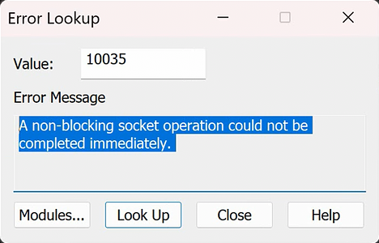

# 异步选择模型
这里的异步修饰的是等待、选择，指的不是同时通信，而是同时等待。一个线程可以同时监控多个对象。但是只是监控SOCKET的活动，具体业务还是需要程序员完善（比如某个socket有数据只是返回通知一下，不会主动帮你读）。
具体的实现方法，根据操作系统的实现，有轮询方法，软中断方法（有数据时发信号），有利于节省系统资源。
Windows中的异步选择模型有：
1. Select：在类Unix系统下，几乎都用的这个，Berkeley Socket
2. WSAAsyncSelect
3. WSAEventSelect
## 异步通信模型
上面讨论的是异步选择模型，此处的功能更强大了，叫做异步通信模型，意思是一个线程不仅可以同时监控多个连接，还可以处理通信业务（比如某个socket有数据，会主动帮你读，通过系统内部的线程或中断，自动填入你之前给它的缓冲区。等到它通知你时，读写已经处理完毕）。
# WSAAsyncSelect
[WSAAsyncSelect function (winsock.h)](https://learn.microsoft.com/en-us/windows/win32/api/winsock/nf-winsock-wsaasyncselect)
函数原型：

1. 参数1：Socket，需要监控哪个socket
2. 参数2：窗口句柄，用于标识在发生网络事件时将接收消息的窗口。
3. 参数3：发生网络事件时要接收的消息类型（投送到消息队列的消息类型）。
4. 参数4：指定对哪个或哪些网络事件感兴趣，用位掩码表示。
5. 返回值：成功返回0，失败时返回`SOCKET_ERROR`，可以通过调用WSAGetLastError来检索错误号。
## 创建项目
由于WSAAsyncSelect需要消息循环，需要创建一个`Windows Desktop Wizard`项目，取名为`WSAAsyncSelectModel`，选择Application Type为Desktop Application (.exe)，Additional Options选择Empty Project。
新建源文件`wsa_async_select.cpp`。
代码拷贝Element Studio中的Spawn中Most Used中的Message Loop的代码。
同时在main函数前部贴入`file_server.cpp`中从初始化到建立`listen_sock`的代码。

需要注意，`#pragma comment(lib, "Ws2_32.lib")`别忘了复制过去，否则会报以下的错误：
（最后，别忘记在wWinMain函数return的前一句`WSACleanup()`）
```
Build started at 8:10 AM...
1>------ Build started: Project: WSAAsyncSelectModel, Configuration: Debug x64 ------
1>wsa_async_select.cpp
1>C:\Users\mrcan\source\repos\MetaLearning\WSAAsyncSelectModel\wsa_async_select.cpp(68,15): warning C4244: 'return': conversion from 'WPARAM' to 'int', possible loss of data
1>wsa_async_select.obj : error LNK2019: unresolved external symbol __imp_socket referenced in function wWinMain
1>wsa_async_select.obj : error LNK2019: unresolved external symbol __imp_WSAStartup referenced in function wWinMain
1>wsa_async_select.obj : error LNK2019: unresolved external symbol __imp_WSAGetLastError referenced in function wWinMain
1>wsa_async_select.obj : error LNK2019: unresolved external symbol __imp_WSAAsyncSelect referenced in function wWinMain
1>C:\Users\mrcan\source\repos\MetaLearning\x64\Debug\WSAAsyncSelectModel.exe : fatal error LNK1120: 4 unresolved externals
1>Done building project "WSAAsyncSelectModel.vcxproj" -- FAILED.
========== Build: 0 succeeded, 1 failed, 0 up-to-date, 0 skipped ==========
========== Build completed at 8:10 AM and took 00.582 seconds ==========
```
编译失败的原因是链接器无法找到 WinSock 库中的相关函数定义。WinSock 函数如 `socket()`、`WSAStartup()`、`WSAGetLastError()` 和 `WSAAsyncSelect()` 都在 `Ws2_32.lib` 中定义，因此需要在项目中显式地链接该库。
## 注意（非阻塞模式）
WSAAsyncSelect函数自动将套接字s设置为非阻塞模式，而不考虑`lEvent`的值。要将套接字s设置回阻塞模式，首先必须通过调用`将lEvent设置为零的WSAAsyncSelect`来清除与套接字s关联的事件记录。然后可以调用`ioctlsocket`或`WSAIoctl`将套接字设置为阻塞模式。
[ioctlsocket function (winsock.h)](https://learn.microsoft.com/en-us/windows/win32/api/winsock/nf-winsock-ioctlsocket)
### ioctlsocket示例
```cpp
#include <winsock2.h>
#include <stdio.h>
#pragma comment(lib, "Ws2_32.lib")
void main()
{
    //-------------------------
    // Initialize Winsock
    WSADATA wsaData;
    int iResult;
    u_long iMode = 0;

    iResult = WSAStartup(MAKEWORD(2,2), &wsaData);
    if (iResult != NO_ERROR)
          printf("Error at WSAStartup()\n");
    //-------------------------
    // Create a SOCKET object.
    SOCKET m_socket;
    m_socket = socket(AF_INET, SOCK_STREAM, IPPROTO_TCP);
    if (m_socket == INVALID_SOCKET)
    {
        printf("Error at socket(): %ld\n", WSAGetLastError());
        WSACleanup();
        return;
    }
    //-------------------------
    // Set the socket I/O mode: In this case FIONBIO
    // enables or disables the blocking mode for the 
    // socket based on the numerical value of iMode.
    // If iMode = 0, blocking is enabled; 
    // If iMode != 0, non-blocking mode is enabled.

    iResult = ioctlsocket(m_socket, FIONBIO, &iMode);
    if (iResult != NO_ERROR)
          printf("ioctlsocket failed with error: %ld\n", iResult);
}
```
## 网络事件
lEvent参数是通过使用下表中列出的任意值的按位OR运算符构造的。

|Value|Meaning|
|---|---|
|**FD_READ**|Set to receive notification of readiness for reading.|
|**FD_WRITE**|Wants to receive notification of readiness for writing.|
|**FD_OOB**|Wants to receive notification of the arrival of OOB data.|
|**FD_ACCEPT**|Wants to receive notification of incoming connections.|
|**FD_CONNECT**|Wants to receive notification of completed connection or multipoint join operation.|
|**FD_CLOSE**|Wants to receive notification of socket closure.|
|**FD_QOS**|Wants to receive notification of socket Quality of Service (QoS) changes.|
|**FD_GROUP_QOS**|Wants to receive notification of socket group Quality of Service (QoS) changes (reserved for future use with socket groups). Reserved.|
|**FD_ROUTING_INTERFACE_CHANGE**|Wants to receive notification of routing interface changes for the specified destination(s).|
|**FD_ADDRESS_LIST_CHANGE**|Wants to receive notification of local address list changes for the socket protocol family.|
为套接字发出WSAAsyncSelect将取消这个套接字的任何先前的WSAAsyncSelect或WSAEventSelect。例如，要接收读写通知，应用程序必须使用FD_READ和FD_WRITE调用WSAAsyncSelect，如下所示
```cpp
rc = WSAAsyncSelect(s, hWnd, wMsg, FD_READ|FD_WRITE);
```
不能为不同的事件指定不同的消息。下面的代码将不起作用：第二个调用将取消第一个的效果，并且只有FD_WRITE事件将与消息wMsg2一起报告：
```cpp
rc = WSAAsyncSelect(s, hWnd, wMsg1, FD_READ);
rc = WSAAsyncSelect(s, hWnd, wMsg2, FD_WRITE);
```
要取消所有通知，指示Windows套接字不应发送与套接字上的网络事件相关的其他消息，请将lEvent设置为零。
```cpp
rc = WSAAsyncSelect(s, hWnd, 0, 0);
```
## wWinMain代码
把此函数放到窗口初始化、显示完毕和消息循环开始之间。
```cpp
// wsa_async_select.cpp
#include <windows.h>
#include <WinSock2.h>
#include <WS2tcpip.h>
#define MY_WMACCEPT WM_USER + 0x1

// declarations
LRESULT __stdcall WndProcdure(HWND hWnd, UINT message, WPARAM wParam, LPARAM lParam);
// function defines
int __stdcall wWinMain(HINSTANCE hInstance, HINSTANCE hPreInstance, wchar_t* lpCmdLine, int iCmdShow)
{
    // socket setting
    WORD wVersionRequested;
    WSADATA wsaData;
    int err;
    wVersionRequested = MAKEWORD(2, 2);

    err = ::WSAStartup(wVersionRequested, &wsaData);
    if (err != 0) {
        // 这是Window Application，不能调用cout或wcout，因为没有控制台。
        //std::wcout << std::format(L"WSAStartup failed with error : {}\n", err);
        return 1;
    }

    SOCKET listen_sock = ::socket(AF_INET, SOCK_STREAM, IPPROTO_TCP);
    if (listen_sock == INVALID_SOCKET)
    {
        err = ::WSAGetLastError();
        return 1;
    }

    sockaddr_in server_addr;
    server_addr.sin_family = AF_INET;
    //service.sin_addr.S_un.S_addr = inet_addr("127.0.0.1");
    if (1 != ::inet_pton(AF_INET, "127.0.0.1", &server_addr.sin_addr))
    {
        err = ::WSAGetLastError();
        return 1;
    }
    server_addr.sin_port = htons(9008);

    if (SOCKET_ERROR == ::bind(listen_sock,
        reinterpret_cast<const sockaddr*>(&server_addr),
        sizeof(server_addr)))
    {
        err = ::WSAGetLastError();
        return 1;
    }

    if (SOCKET_ERROR == ::listen(listen_sock, SOMAXCONN))
    {
        err = ::WSAGetLastError();
        return 1;
    }

    // Window Initialization and Showing
    wchar_t szAppName[] = L"WinApp";
    WNDCLASSEX wcex = { 0 };
    wcex.cbSize = sizeof(wcex);
    wcex.style = CS_HREDRAW | CS_VREDRAW;
    wcex.lpfnWndProc = &WndProcdure;
    wcex.cbClsExtra = 0;
    wcex.cbWndExtra = 0;
    wcex.hInstance = hInstance;
    wcex.hIcon = LoadIcon(NULL, IDI_APPLICATION);
    wcex.hCursor = LoadCursor(NULL, IDC_ARROW);
    wcex.hbrBackground = (HBRUSH)(GetStockObject(WHITE_BRUSH));
    wcex.lpszMenuName = NULL;
    wcex.lpszClassName = szAppName;
    wcex.hIconSm = wcex.hIcon;
    if (!RegisterClassEx(&wcex))
    {
        return -1;
    }
    HWND hWnd = NULL;
    hWnd = CreateWindowEx(WS_EX_OVERLAPPEDWINDOW, szAppName, L"App", WS_OVERLAPPEDWINDOW, CW_USEDEFAULT, 0, CW_USEDEFAULT, 0, NULL, NULL, hInstance, NULL);
    ShowWindow(hWnd, iCmdShow);
    UpdateWindow(hWnd);

    // Select
    if (SOCKET_ERROR == ::WSAAsyncSelect(listen_sock, hWnd, MY_WMACCEPT, FD_ACCEPT))
    {
        err = ::WSAGetLastError();
    }

    // Message Loop
    MSG msg;
    while (GetMessage(&msg, NULL, 0, 0))
    {
        TranslateMessage(&msg);
        DispatchMessage(&msg);
    }
    ::WSACleanup();
    return msg.wParam;
}
```
先编译运行一下，发现提示：
```
Build started at 8:16 AM...
1>------ Build started: Project: WSAAsyncSelectModel, Configuration: Debug x64 ------
1>wsa_async_select.cpp
1>C:\Users\mrcan\source\repos\MetaLearning\WSAAsyncSelectModel\wsa_async_select.cpp(68,15): warning C4244: 'return': conversion from 'WPARAM' to 'int', possible loss of data
1>C:\Users\mrcan\source\repos\MetaLearning\WSAAsyncSelectModel\wsa_async_select.cpp(57,27): error C4996: 'WSAAsyncSelect': Use WSAEventSelect() instead or define _WINSOCK_DEPRECATED_NO_WARNINGS to disable deprecated API warnings
1>Done building project "WSAAsyncSelectModel.vcxproj" -- FAILED.
========== Build: 0 succeeded, 1 failed, 0 up-to-date, 0 skipped ==========
========== Build completed at 8:16 AM and took 00.538 seconds ==========
```
MS建议我们使用`WSAEventSelect()`作为代替，因为`WSAAsyncSelect`被废弃了，如果要使用，需要`define _WINSOCK_DEPRECATED_NO_WARNINGS`。可以右键项目，属性，`C/C++`，Preprocessor，下拉`Preprocessor Definitions`，选择`<Edit...>`。在输入文本框中已有内容的最下面写一行这串符号上去。


## WndProcdure回调函数
主要处理消息循环时，不同消息类型的处理，此处我们处理自定义消息类型`MY_WMACCEPT`，即我们在`WSAAsyncSelect`给socket绑定的事件通知的消息类型。
```cpp
LRESULT __stdcall WndProcdure(HWND hWnd, UINT message, WPARAM wParam, LPARAM lParam)
{
    HDC hDC = NULL;
    PAINTSTRUCT ps;
    switch (message)
    {
    case WM_CREATE:
    {
        return 0;
    }
    case WM_PAINT:
    {
        hDC = BeginPaint(hWnd, &ps);
        EndPaint(hWnd, &ps);
        return 0;
    }
    case MY_WMACCEPT:
    {
        return 0;   // break point
    }
    case WM_DESTROY:
    {
        PostQuitMessage(0);
        return 0;
    }
    }
    return DefWindowProc(hWnd, message, wParam, lParam);
}
```
## 测试
断点可以设置在`case MY_WMACCEPT`中的break上。
运行`wsa_async_select`后，再运行一个SocketClient项目中的`basic_stream_client`。
可以看到断点落在return语句上。说明接收到了accept事件。
## 具体写`case MY_WMACCEPT`
```cpp
{
    case MY_WMACCEPT:
    {
        sockaddr_in client_addr;
        int addrlen{ sizeof(client_addr) };
        SOCKET work_sock = ::accept(
            listen_sock,
            reinterpret_cast<sockaddr*>(&client_addr),
            &addrlen);
        if (work_sock == INVALID_SOCKET)
        {
            err = ::WSAGetLastError();
            return 1;
        }

        return 0;
    }
}
```
如此写，需要调整`listen_sock`和`err`为全局变量。
```cpp
// ...
SOCKET listen_sock = INVALID_SOCKET;
int err;
// ...
```
### 显示客户端信息、收发数据
接着，补充上之前服务端、客户端的收发代码。服务端还要显示连接的客户端的信息，由于项目是Windows Application，不能进行cout输出，因此需要用MessageBox替换。
```cpp
{
    case MY_WMACCEPT:
    {
        // accept
        // ...

        wchar_t addr_str[46] = L"";
        InetNtopW(AF_INET, reinterpret_cast<void*>(&client_addr.sin_addr), addr_str, 46);
        std::wstring info = std::format(L"client address: {}, port: {}\n", addr_str, ntohs(client_addr.sin_port));

        ::MessageBox(hWnd, info.c_str(), L"info", MB_OK);

        // send ...
        std::wstring message{ L"Welcome to server!" };
        ::send(
            work_sock,
            reinterpret_cast<const char*>(message.c_str()),
            sizeof(wchar_t) * message.size(),
            0);
        // recv ...
        wchar_t buf[100] = { 0 };
        int bytes_received = ::recv(work_sock, reinterpret_cast<char*>(buf), sizeof(wchar_t) * sizeof(buf), 0);
        if (bytes_received > 0)
        {
            ::MessageBox(hWnd, buf, L"recv", MB_OK);
        }
        else
        {
            err = ::WSAGetLastError();
        }
        ::closesocket(work_sock);
        work_sock = INVALID_SOCKET;

        return 0;
    }
}
```
## 测试1
刚打开客户端时，服务端窗口会弹出：

但是后面，客户端输入内容回车后，服务端窗口有时不会弹出接收到的内容。

### 原因
经过调试，发现服务端的recv返回`-1`。
查询error码，发现：

## 调整select的socket为阻塞
在accept之后，通过`ioctlsocket`函数设置`work_sock`为阻塞。`FIONBIO`。见[ioctlsocket示例](#ioctlsocket示例)
```cpp
// ...
    case MY_WMACCEPT:
    {
        sockaddr_in client_addr;
        int addrlen{ sizeof(client_addr) };
        SOCKET work_sock = ::accept(
            listen_sock,
            reinterpret_cast<sockaddr*>(&client_addr),
            &addrlen);
        if (work_sock == INVALID_SOCKET)
        {
            err = ::WSAGetLastError();
            return 1;
        }

        // set socket blocking mode
        u_long iMode = 0;
        if (SOCKET_ERROR == ::ioctlsocket(work_sock, FIONBIO, &iMode))
        {
            err = ::WSAGetLastError();
        }
// ...
```
但是只这样不行：

原因见[注意（非阻塞模式）](#注意（非阻塞模式）)：
要调整阻塞模式，首先必须通过调用`将lEvent设置为零的WSAAsyncSelect`来清除与套接字s关联的事件记录。然后再调用`ioctlsocket`或`WSAIoctl`将套接字设置为阻塞模式。
因此需要改`WSAAsyncSelect`的最后一个参数，由`FD_ACCEPT`改为`0`。
```cpp
// ...

    if (SOCKET_ERROR == ::WSAAsyncSelect(listen_sock, hWnd, MY_WMACCEPT, 0))
    {
        err = ::WSAGetLastError();
    }

    MSG msg;
    while (GetMessage(&msg, NULL, 0, 0))
    {
        TranslateMessage(&msg);
        DispatchMessage(&msg);
    }
    ::WSACleanup();
    return msg.wParam;
}
```
至此，socket成功被设置为阻塞模式了。
## 测试2
先运行服务端。
刚打开客户端时，服务端窗口会弹出：

客户端输入内容回车后：

服务端弹出窗口：

以上版本的服务端只是用select监控了ACCEPT连接事件，而在`work_sock`上的读写事件通知是我们在select有了连接事件后同时向消息队列投出`MY_WMACCEPT`消息，在回调函数中的`switch-case`才去处理读写。
以上的读写处理是比较僵硬的，仅用于测试。正规程序中的读写事件应该也用Select来监控，见下文。
## 非阻塞模式下依靠select处理可读事件
在原有程序的基础上，修改`case WM_ACCEPT`中的操作：不再阻塞式读取数据。而是在其中再一次select。
需要改两个地方：
1. 添加select，关注`FD_READ`，发出`WM_READ`
2. 修改`iMode`为1。见[ioctlsocket示例](#ioctlsocket示例)

```cpp
// ...
    case MY_WMACCEPT:
    {
        sockaddr_in client_addr;
        int addrlen{ sizeof(client_addr) };
        SOCKET work_sock = ::accept(
            listen_sock,
            reinterpret_cast<sockaddr*>(&client_addr),
            &addrlen);
        if (work_sock == INVALID_SOCKET)
        {
            err = ::WSAGetLastError();
            return 1;
        }

        // select
        if (::WSAAsyncSelect(work_sock, hWnd, MY_WMREAD, FD_READ) == SOCKET_ERROR)
        {
            err = ::WSAGetLastError();
        }

        // set socket non-blocking mode
        u_long iMode = 1; // 1 to non-block
        if (SOCKET_ERROR == ::ioctlsocket(work_sock, FIONBIO, &iMode))
        {
            err = ::WSAGetLastError();
        }
        
        // MessageBox显示客户端信息 ...
        // send data to client...
        // recv 移动到 case WM_READ
    }
// ...
```
见：[显示客户端信息、收发数据](#显示客户端信息、收发数据)
回调函数中，对应的`case MY_WMREAD`，里面的动作就对应于原先`case MY_WMACCEPT`中的`recv`操作了。即recv操作剪切过来。
此时发现个问题：`work_sock`在此作用域中不明，需要传入。但是好在select函数为我们处理了：微软官方文档中指出：
[WSAAsyncSelect function (winsock2.h)](https://learn.microsoft.com/en-us/windows/win32/api/winsock2/nf-winsock2-wsaasyncselect)
当指定的套接字`s`上发生指定的网络事件之一时，应用程序窗口`hWnd`接收消息`wMsg`。`wParam`参数标识发生网络事件的套接字。`lParam`的低位字指定已发生的网络事件。`lParam`的高位字包含任何错误代码。错误代码可以是`Winsock2.h`中定义的任何错误。
因此，我们在用select监控到`FD_READ`事件后，它就会自动向wMain程序的wParam填充`work_sock`，那么我们在用到这个套接字时，从`wParam`取出即可。

还要注意，如果服务端程序到一定阶段后，不需要再关注`FD_READ`事件了，那需要做收尾处理（再次调用`select`，置关注的事件为0）
```cpp
// ...
    case MY_WMREAD:
    {
        SOCKET work_sock = wParam;
        // recv
        wchar_t buf[100] = { 0 };
        int bytes_received = ::recv(work_sock, reinterpret_cast<char*>(buf), sizeof(wchar_t) * sizeof(buf), 0);
        if (bytes_received > 0)
        {
            ::MessageBox(hWnd, buf, L"recv", MB_OK);
        }
        else
        {
            err = ::WSAGetLastError();
        }
        // clean Select
        if (::WSAAsyncSelect(work_sock, hWnd, MY_WMREAD, 0) == SOCKET_ERROR)
        {
            err = ::WSAGetLastError();
        }
        // clean socket
        ::closesocket(work_sock);
        work_sock = INVALID_SOCKET;
        return 0;
    }
// ...
```
# WSAEventSelect
WSAAsyncSelect 是轮询模式。微软目前已经不建议使用。
WSAEventSelect 是事件模式。微软比较推荐。
两者的主要区别在于，WSAAsyncSelect需要绑定一个消息，而WSAEventSelect需要绑定一个事件。
## 创建项目
WSAEventSelect 不需要窗口程序，普通的控制台程序即可。
因此创建一个新Empty项目：WSAEventSelectModel。创建源文件`wsa_event_select.cpp`
内容暂时拷贝`basic_stream_server.cpp`的内容。
## WSACreateEvent 创建Event
在原先有accept操作的while循环之前，调用 WSACreateEvent 创建Event。无参数，返回类型为`HANDLE`。
## WSAEventSelect函数

[WSAEventSelect function (winsock2.h)](https://learn.microsoft.com/en-us/windows/win32/api/winsock2/nf-winsock2-wsaeventselect)
1. 参数1，填入要与event绑定的socket，比如：如果我们要观察一个accept事件，就需要绑定`listen_sock`
2. 参数2，填入要观察的event事件。这个event用`WSACreateEvent`创建。
3. 参数3，事件类型，比如：`FD_ACCEPT`。

```cpp
// ...
    // 创建Event
    HANDLE accept_ev = ::WSACreateEvent();
    // 将listen_sock和accept_ev绑定
    if(SOCKET_ERROR == ::WSAEventSelect(listen_sock, accept_ev, FD_ACCEPT))
    {
        err = ::WSAGetLastError();
        return 1;
    }
    while (true)
    {
        // accept ...
    }
```
## WSAWaitForMultipleEvents
在select后，就可以用while循环中调用`WSAWaitForMultipleEvents`等待Events了。代替了原先代码简单的accept。
API：[WSAWaitForMultipleEvents function (winsock2.h)](https://learn.microsoft.com/en-us/windows/win32/api/winsock2/nf-winsock2-wsawaitformultipleevents)

1. 参数1：`lphEvents`指向的数组中事件对象句柄的数量。事件对象句柄的最大数量为`WSA_MAXIMUM_WAIT_EVENTS`。必须指定一个或多个事件。
2. 参数2：指向事件对象句柄数组的指针。该数组可以包含不同类型的对象的句柄。如果`fWaitAll`参数设置为`TRUE`，则它可能不包含同一句柄的多个副本。如果在等待仍处于挂起状态时关闭这些句柄之一，则`WSAWaitForMultipleEvents`的行为未定义。
3. 指定等待类型的值。如果为`TRUE`，则​​当`lphEvents`数组中所有对象的状态发出信号时，该函数返回。如果为`FALSE`，则当任何事件对象发出信号时该函数返回。在后一种情况下，返回值减去`WSA_WAIT_EVENT_0`表示其状态导致函数返回的事件对象的索引。如果在调用期间有多个事件对象发出信号，则这是发出信号的事件对象的数组索引，其中索引值是所有发出信号的事件对象中最小的。
4. 超时间隔，以毫秒为单位。如果超时间隔到期，即使不满足`fWaitAll`参数指定的条件，`WSAWaitForMultipleEvents`也会返回。如果`dwTimeout`参数为`0`，`WSAWaitForMultipleEvents`测试指定事件对象的状态并立即返回。如果`dwTimeout`为`WSA_INFINITE`，则将永远等待。
5. 指定线程是否处于可警报等待状态，以便系统可以执行 I/O 完成例程。如果为`TRUE \`，则线程将置于可警报等待状态，并且当系统执行 I/O 完成例程时，`WSAWaitForMultipleEvents`可以返回。在这种情况下，将返回`WSA_WAIT_IO_COMPLETION`，并且尚未发出正在等待的事件的信号。应用程序必须再次调用`WSAWaitForMultipleEvents`函数。如果为`FALSE`，则线程不会置于可警报等待状态，并且不会执行 I/O 完成例程。
6. 返回值：如果失败，则返回值为`WSA_WAIT_FAILED`。如果成功，则为以下之一。
    1. `WSA_WAIT_EVENT_0` to `(WSA_WAIT_EVENT_0 + cEvents - 1)`
    2. `WSA_WAIT_IO_COMPLETION`
    3. `WSA_WAIT_TIMEOUT`

由参数2，需要把每一个创建的event放到统一的数组中进行管理。需要在全局定义一个vector。
还需要注意，虽然我们已经用`WSAEventSelect`绑定了socket和event，但是`WSAWaitForMultipleEvents`只能找到event对应的events下标值，不提供socket的追溯。

因此我们还需要map额外记录event和哪个socket绑定。
```cpp
#include <vector>
std::vector<HANDLE> events;
std::map<HANDLE, SOCKET> ev_entries;
```

```cpp
// ...
    // WSAEventSelect ...
    
    // 把event添加到容器中
    events.emplace_back(accept_ev);
    ev_entries[accept_ev] = listen_sock;
    
    while (true)
    {
        // 参数3的false表示有1个事件就返回
        // WSA_INFINITE表示无限等待
        auto res = ::WSAWaitForMultipleEvents(
            events.size(),
            events.data(),
            false,
            WSA_INFINITE,
            false);
        if (int n = res - WSA_WAIT_EVENT_0; n < events.size())
        {
            auto event = events[n];
            auto sock = ev_entries[event];
            // ...
        }
    }
```
## WSAEnumNetworkEvents
在得到Wait的返回值后（并且计算出了index），还需要使用[WSAEnumNetworkEvents](https://learn.microsoft.com/en-us/windows/desktop/api/winsock2/nf-winsock2-wsaenumnetworkevents)检索内部网络事件记录的内容，从而确定已发生哪些指定的网络事件。（见[WSAEventSelect function (winsock2.h)](https://learn.microsoft.com/en-us/windows/win32/api/winsock2/nf-winsock2-wsaeventselect)中的Remarks）
具体代码示例可见：[Enum代码示例](https://learn.microsoft.com/en-us/windows/win32/api/winsock2/nf-winsock2-wsaenumnetworkevents#example-code)
需要注意，WSAEnumNetworkEvents的参数需要给出一个`WSANETWORKEVENTS`的结构体指针，函数要填充发生了的事件。具体结构可看：[WSANETWORKEVENTS structure (winsock2.h)](https://learn.microsoft.com/en-us/windows/win32/api/winsock2/ns-winsock2-wsanetworkevents)
```cpp
// ...
    // WSAEventSelect ...
    
    // ...
    
    WSANETWORKEVENTS network_events{};
    while (true)
    {
        // 参数3的false表示有1个事件就返回
        // WSA_INFINITE表示无限等待
        auto res = ::WSAWaitForMultipleEvents(
            events.size(),
            events.data(),
            false,
            WSA_INFINITE,
            false);
        if (int n = res - WSA_WAIT_EVENT_0; n < events.size())
        {
            auto event = events[n];
            auto sock = ev_entries[event];
            if(SOCKET_ERROR == ::WSAEnumNetworkEvents(sock, event, &network_events))
            {
                continue;
            }
            if (network_events.lNetworkEvents & FD_ACCEPT)
            {
                // ...
            }
        }
    }
```
## 处理事件
### accept：显示客户端信息、发
```cpp
// ...
    // WSAEventSelect ...
    while (true)
    {
        {
            // WSAEnumNetworkEvents ...
            
            // accept
            if (network_events.lNetworkEvents & FD_ACCEPT)
            {
                sockaddr_in client_addr;
                int addrlen{ sizeof(client_addr) };
                SOCKET work_sock = accept(sock, reinterpret_cast<sockaddr*>(&client_addr), &addrlen);
                if (INVALID_SOCKET == work_sock)
                {
                    err = ::WSAGetLastError();
                    continue; // 继续下一次
                }

                wchar_t addr_str[46] = L"";
                InetNtopW(AF_INET, reinterpret_cast<void*>(&client_addr.sin_addr), addr_str, 46);
                std::wstring info = std::format(L"client address: {}, port: {}\n", addr_str, ntohs(client_addr.sin_port));
                std::wcout << info << std::endl;

                // send ...
                std::wstring message{ L"Welcome to server!" };
                ::send(
                    work_sock,
                    reinterpret_cast<const char*>(message.c_str()),
                    sizeof(wchar_t) * message.size(),
                    0);
```
在完成显示客户端地址、send消息的处理后，我们还要想方设法完成接收客户端的消息。
那么就需要再创建一个Event，投递read event，以便于关注read事件。
现在就需要把`work_sock`和`read_event`绑定，并且把这两个分别放到map和vector容器中。
等下一次循环时，如果出现了READ事件，则会走到READ的分支，进行处理。
```cpp
                // ...
                
                // 投递（创建）read event，以便于关注read事件
                auto read_event = ::WSACreateEvent();
                if(SOCKET_ERROR == ::WSAEventSelect(work_sock, read_event, FD_READ))
                {
                    err = ::WSAGetLastError();
                    continue;
                }
                events.emplace_back(read_event);
                ev_entries[read_event] = work_sock;
            }
            else if (network_events.lNetworkEvents & FD_READ)
            {
                // ...
            }
        }
    }
```
### read：收
接收完毕后，记得调用`WSAEventSelect`进行解除绑定，把参数3（即关注的事件）设为0即可。
```cpp
#include <algorithm>
#include <ranges>
// ...
    // WSAEventSelect ...

    // ...
        {
            // ...
            else if (network_events.lNetworkEvents & FD_READ)
            {
                // recv ...
                auto work_sock = sock;
                wchar_t buf[100] = { 0 };
                int bytes_received = ::recv(work_sock, reinterpret_cast<char*>(buf), sizeof(wchar_t) * sizeof(buf), 0);
                
                if (bytes_received > 0)
                {
                    std::wcout << buf << std::endl;
                }
                else
                {
                    err = ::WSAGetLastError();
                }
                // 解除绑定
                ::WSAEventSelect(work_sock, event, 0);

                // clean select ，即vector和map中删去event
                // vector需要使用迭代器删除
                auto it = std::ranges::remove_if(
                    events,
                    [event](auto&& v) -> bool
                        { return v == event; });
                events.erase(it.begin(), it.end());
                // map直接删除key
                ev_entries.erase(event);

                ::closesocket(work_sock);
                work_sock = INVALID_SOCKET;
            }
        }
    }

    ::closesocket(listen_sock);
    listen_sock = INVALID_SOCKET;

    ::WSACleanup();
    return 0;
}
```
## 测试
开启一个服务端，3个客户端：


可以“同时”按顺序处理。select的异步效果即为此。但是此程序目前并没有用多线程，而是在单线程上的按顺序快速一对多处理，从而看起来像是多线程。
# Overlapped I/O
像select一样，这也是异步的。但是，select只会通知你有什么事件，你需要自己处理。而重叠的意思在于，不仅像select一样非阻塞轮询，它还会帮你处理事件，所以假如有可读事件时，在通知你的时候，它已经帮你读完了，内容存到了缓冲区中，后续自己处理缓冲区即可。
## 创建项目
Overlapped I/O 不需要窗口程序，普通的控制台程序即可。
因此创建一个新Empty项目：OverlappedIOModel。创建源文件`overlapped_io.cpp`
## 预备工作
仍需要对WSA进行启动（旧方法）。
然后创建socket（下面将用新的`WSASocket`代替socket创建）。
然后构建`sockaddr_in`地址，填充ip地址、端口号（旧方法）。
然后`bind`、`listen`（旧方法）。
```cpp
#include<WinSock2.h>
#include<mswsock.h>
#include<WS2tcpip.h>
#include<format>
#include<iostream>
#pragma comment(lib,"Ws2_32.lib")
#pragma comment(lib, "Mswsock.lib")
int main()
{
	WSADATA wsaData;
	int err;
	auto wVersionRequested = MAKEWORD(2, 2);
	err = ::WSAStartup(wVersionRequested, &wsaData);
	if (err != 0) {
		std::wcout << std::format(L"WSAStartup failed with error : {}\n", err);
		return 1;
	}
	
	// new function
	SOCKET listen_sock = ::WSASocket(AF_INET, SOCK_STREAM, IPPROTO_TCP, nullptr, 0, WSA_FLAG_OVERLAPPED);
	if (listen_sock == INVALID_SOCKET)
	{
		err = ::WSAGetLastError();
		return 1;
	}
	// bind and listen, old funtion
	sockaddr_in server_addr;
	server_addr.sin_family = AF_INET;
	if (1 != ::inet_pton(AF_INET, "127.0.0.1", &server_addr.sin_addr))
	{
		err = ::WSAGetLastError();
		return 1;
	}
	server_addr.sin_port = htons(9008);

	if (SOCKET_ERROR == ::bind(listen_sock,
		reinterpret_cast<const sockaddr*>(&server_addr),
		sizeof(server_addr)))
	{
		err = ::WSAGetLastError();
		return 1;
	}

	if (SOCKET_ERROR == ::listen(listen_sock, SOMAXCONN))
	{
		err = ::WSAGetLastError();
		return 1;
	}
	// ...
}
```
## socket的创建：WSASocket
不再使用伯克利API，而是使用微软异步模型API：WSASocket。
在微软官方手册中，有WSASocketA和WSASocketW。在实际代码中我们也可以使用不带后缀的WSASocket。
[WSASocketA function (winsock2.h)](https://learn.microsoft.com/en-us/windows/win32/api/winsock2/nf-winsock2-wsasocketa)

1. `af`即地址家族，填`AF_INET`
2. `type`，填`SOCK_STREAM`
3. `protocol`，填`IPPROTO_TCP`
4. `lpProtocolInfo`，暂时不用，填nullptr
5. `g`，暂时不用，填0
6. `dwFlags`，对应要赋予socket的特性。填`WSA_FLAG_OVERLAPPED`
7. 返回类型：socket。
## AcceptEx
Overlapped I/O 与之前的accept流程不同的是，不需要再手动创建一个Event，也就不需要手动绑定event和socket，而你只需要提供各种参数，然后全部集中到AcceptEx处理。

这个函数在`winsock.h`和`mswsock.h`均有定义。但是实际使用时，若引用的是`winsock.h`编译器不认识该函数名。所以应该引用`mswsock.h`。
注意，在build时，需要加`#pragma comment(lib, "Mswsock.lib")`，否则链接器不认识。


这个函数不仅会帮服务端接收一个新连接，还会向参数填充客户端的地址，以及处理读取客户端发送的第一个数据块。这种一次性就处理了很多工作的函数，就是重叠I/O模式。

1. sListenSocket，即第一步创建好的`listen_sock`
2. sAcceptSocket，还需要单独预创建一个`work_sock`，不能是绑定了的、连接了的，而是由本函数在调用后帮你填充好。
3. 3
4. 4
5. 5
6. 6
7. 7
8. lpOverlapped，这个结构体中包含了event。
### 最后一个参数：如何与Event结合
最后一个参数比较重要：lpOverlapped，我们需要创建一个OVERLAPPED结构，再在里面的hEvent成员构建Event，从而进行事件的绑定。
### 返回值
如果失败，返回FALSE 。然后可以调用`WSAGetLastError`函数来返回错误信息。如果`WSAGetLastError`返回`ERROR_IO_PENDING` ，则操作已成功启动并且仍在进行中。如果错误是`WSAECONNRESET`，则说明传入了连接，但随后在接受呼叫之前被远程方终止。
### 程序
```cpp
    // ...

	// create a socket to accept by AcceptEx
	SOCKET work_sock = ::WSASocket(AF_INET, SOCK_STREAM, IPPROTO_TCP, nullptr, 0, WSA_FLAG_OVERLAPPED);

	char* address_buf = new char[sizeof(sockaddr_in) * 2 + 32];
	
	DWORD length_received{ 0 };
	
	OVERLAPPED ovl;
	ovl.hEvent = ::WSACreateEvent();
	
	bool res = AcceptEx(
		listen_sock,
		work_sock,
		address_buf,
		0,
		sizeof(sockaddr_in) + 16,
		sizeof(sockaddr_in) + 16,
		&length_received,
		&ovl);
	if (!res)
	{
		if (ERROR_IO_PENDING != ::WSAGetLastError())
		{
			return 1;
		}
	}

	::closesocket(listen_sock);
	listen_sock = INVALID_SOCKET;
	::WSACleanup();
	return 0;
}
```
可以进行测试，断点打在`if (!res)`位置。
根据手册：[返回值](#返回值)，如果AcceptEx返回false，但错误信息是`ERROR_IO_PENDING`时，也算是启动成功的，只是仍在进行中。
## 结合event
根据[最后一个参数：如何与Event结合](#最后一个参数：如何与Event结合)。
效仿[WSAEventSelect](#WSAEventSelect)，需要提前构建vector容器来管理event。
```cpp
#include <vector>
#include <map>
std::vector<HANDLE>      events;
std::map<HANDLE, SOCKET> ev_entries;
```

之后，便可以在AcceptEx成功之后的位置，向容器投入event。
```cpp
// ...
{
    // ...
    OVERLAPPED ovl;
	ovl.hEvent = ::WSACreateEvent();
	
	bool res = AcceptEx(
		listen_sock,
		work_sock,
		address_buf,
		0,
		sizeof(sockaddr_in) + 16,
		sizeof(sockaddr_in) + 16,
		&length_received,
		&ovl);
	if (!res)
	{
		if (ERROR_IO_PENDING != ::WSAGetLastError())
		{
			return 1;
		}
	}

    events.emplace_back(ovl.hEvent);
    ev_entries[ovl.hEvent] = listen_sock;
}
```
## 封装Entry结构管理 WSAGetOverlappedResult 所需属性
以往的`ev_entries`是管理`<HANDLE, SOCKET>`，为了便于管理在OverlappedIO下的事件对应的每一个SOCKET的其他属性，把这些属性都封装在Entry中。则改进为`ev_entries`管理`<HANDLE, Entry>`。
```cpp
enum class EventType
{
    ET_ACCEPT = 0,
    ET_READ
};
class Entry
{
public:
    EventType       _event_type;
    SOCKET          _listen_sock;
    SOCKET          _work_sock;
    char*           _buf{ nullptr };
    WSAOVERLAPPED   _ovl;
};
std::vector<HANDLE>     events;
std::map<HANDLE, Entry> ev_entries;
```
则在AcceptEx后的向map容器添加value就要改为
```cpp
{
    // ...
	OVERLAPPED ovl;
	ovl.hEvent = ::WSACreateEvent();
	bool res = AcceptEx(
		listen_sock,
		work_sock,
		address_buf,
		0,
		sizeof(sockaddr_in) + 16,
		sizeof(sockaddr_in) + 16,
		&length_received,
		&ovl);
	if (!res)
	{
		if (ERROR_IO_PENDING != ::WSAGetLastError())
		{
			return 1;
		}
	}

	events.emplace_back(ovl.hEvent);
    ev_entries[ovl.hEvent] = { EventType::ET_ACCEPT, listen_sock, work_sock, address_buf, ovl };

    // ...
}
```

>这里的程序有错误，会导致后续的WSAGetOverlappedResult错误。见[ovl的引用错误](#ovl的引用错误)
## while循环 WSAWaitForMultipleEvents
前期工作准备好了，后面还是while循环中进行`WSAWaitForMultipleEvents`。通过其返回值，找到events下标，找到event。然后通过map查询`ev_entries`之前记录的对应event的`listen_sock`等信息。
## WSAGetOverlappedResult
[WSAGetOverlappedResult function (winsock2.h)](https://learn.microsoft.com/en-us/windows/win32/api/winsock2/nf-winsock2-wsagetoverlappedresult)

1. 参数1，填入event对应的socket
2. 参数2，填入event对应的lpOverlapped。这个已经在AcceptEx之前就创建好了的，AcceptEx用过。见：[最后一个参数：如何与Event结合](#最后一个参数：如何与Event结合)

WSAWaitForMultipleEvents找到event后，就需要调用`WSAGetOverlappedResult`看是否成功。成功才能进行下一步操作。
```cpp
    // AcceptEx ...
    while (true)
    {
        // 参数3的false表示有1个事件就返回
        // WSA_INFINITE表示无限等待
        auto res = ::WSAWaitForMultipleEvents(
            events.size(),
            events.data(),
            false,
            WSA_INFINITE,
            false);
        if (int n = res - WSA_WAIT_EVENT_0; n < events.size())
        {
            auto event = events[n];
            // structure bind
            auto [event_type, listen_sock, work_sock, buf, ovl] = ev_entries[event];
            DWORD bytes_received{ 0 };
            DWORD flags{ 0 };
            if (!::WSAGetOverlappedResult(
                listen_sock,
                &ovl,
                &bytes_received,
                false,
                &flags))
            {
                err = ::WSAGetLastError();
                continue;
            }

            // accept ...
```
### ovl的引用错误
我们后面发现，`WSAGetOverlappedResult(listen_sock, &ovl, ...)`会产生错误。
这和`ovl`的错误使用相关。因为这里产生了ovl复制，而后续使用的是map容器中value的`_ovl`，因此，应该传实际的map容器中`_ovl`的地址。
>调用 `AcceptEx` 后，异步操作的完成会关联到你传入的 `OVERLAPPED` 结构（即 `&ovl`）。但是在主循环中，你使用 `WSAGetOverlappedResult` 获取结果时，使用的是 `ev_entries[ovl.hEvent]._ovl` 中的 `OVERLAPPED` 结构。这个不一致会导致 `WSAGetOverlappedResult` 在一个不同的 `OVERLAPPED` 结构上操作，从而引发错误。
>
>**传入的 `OVERLAPPED` 结构的作用**：`OVERLAPPED` 结构用于存储异步操作的状态。它不会立即在 `AcceptEx` 调用时被修改，但当操作完成时，Windows 会在 `OVERLAPPED` 结构中写入操作的完成状态。
>

应该调整为以下顺序：并且要注意AcceptEx最后一个参数应该针对的是`&ev_entries[ovl.hEvent]._ovl`。
```cpp
// ...
{
    // ...
    OVERLAPPED ovl;
	ovl.hEvent = ::WSACreateEvent();
    events.emplace_back(ovl.hEvent);
    ev_entries[ovl.hEvent] = { EventType::ET_ACCEPT, listen_sock, work_sock, address_buf, ovl };
	bool res = AcceptEx(
		listen_sock,
		work_sock,
		address_buf,
		0,
		sizeof(sockaddr_in) + 16,
        sizeof(sockaddr_in) + 16,
		&length_received,
		&ev_entries[ovl.hEvent]._ovl);
	if (!res)
	{
		if (ERROR_IO_PENDING != ::WSAGetLastError())
		{
			return 1;
		}
	}
}
```
## 成功之后，可以分支处理事件
```cpp
    // ...
    while (true)
    {
        // WSAWaitForMultipleEvents ...

        if (...)
        {
            // ...
            // WSAGetOverlappedResult ...

            if (event_type == EventType::ET_ACCEPT)
            {
                // sock from above ev_entries[event]
                sockaddr_in client_addr = *reinterpret_cast<sockaddr_in const*>(buf + sizeof(sockaddr_in) + 16);
                
                if (INVALID_SOCKET == work_sock)
                {
                    err = ::WSAGetLastError();
                    continue; // 继续下一次
                }
                
                // display the info about client
                wchar_t addr_str[46] = L"";
                InetNtopW(AF_INET, reinterpret_cast<void*>(&client_addr.sin_addr), addr_str, 46);
                std::wstring info = std::format(L"client address: {}, port: {}", addr_str, ntohs(client_addr.sin_port));
                std::wcout << info << std::endl;
                
                // send ...
                std::wstring message{ L"Welcome to server!" };
                ::send(
                    work_sock,
                    reinterpret_cast<const char*>(message.c_str()),
                    sizeof(wchar_t) * message.size(),
                    0);

                // 解除绑定
                ::WSAEventSelect(listen_sock, event, 0);
                // clean select ，使用迭代器删除event
                auto it = std::ranges::remove_if(events, [event](auto&& v) -> bool { return v == event; });
                events.erase(it.begin(), it.end());
                ev_entries.erase(event);
                
                // 为接收消息做准备
                auto read_event = ::WSACreateEvent();
                if (SOCKET_ERROR == ::WSAEventSelect(work_sock, read_event, FD_READ))
                {
                    err = ::WSAGetLastError();
                    continue;
                }
                events.emplace_back(read_event);
                ev_entries[read_event] = { EventType::ET_READ, listen_sock, work_sock, address_buf, ovl };
            }
            else if (event_type == EventType::ET_READ)
            {
                // recv ...
                wchar_t buf[100] = { 0 };
                int bytes_received = ::recv(work_sock, reinterpret_cast<char*>(buf), sizeof(wchar_t) * sizeof(buf), 0);

                if (bytes_received > 0)
                {
                    std::wcout << buf << std::endl;
                }
                else
                {
                    err = ::WSAGetLastError();
                }
                // 解除绑定
                ::WSAEventSelect(work_sock, event, 0);
                // clean select ，使用迭代器删除event
                auto it = std::ranges::remove_if(events, [event](auto&& v) -> bool { return v == event; });
                events.erase(it.begin(), it.end());
                ev_entries.erase(event);

                ::closesocket(work_sock);
                work_sock = INVALID_SOCKET;
            }
        }
    }
	::closesocket(listen_sock);
	listen_sock = INVALID_SOCKET;
	::WSACleanup();
	return 0;
}
```
# IOCP（IO Completion Port）
非阻塞模型、异步IO模型。异步指帮助你传数据。除上面外的特殊点在于，它内部还建立了线程池，让读写数据更加快速。
而IOCP需要基于Overlapped I/O使用，比如需要用到AccpetEx。
## 创建项目
Empty项目，取名IOCPModel。
创建源文件`iocp.cpp`。
## CreateIoCompletionPort 创建新的IOCP

1. 参数1，需要给它一个打开了的文件Handle，或者`INVALID_HANDLE_VALUE`。在我们想要预创建一个CP（Completion Port）时，可以先给出`INVALID_HANDLE_VALUE`，可以看作是空的，随后再补上即可。如果给出`INVALID_HANDLE_VALUE`，那么参数2必须给`nullptr`。
2. 参数2，填一个创建好了的iocp的HANDLE；如果原先没有有效的IOCP，则可以填`nullptr`。
3. 参数3，Completion Key，中文叫作完成键。每个句柄都对应一个用户定义的完成键（实际上就是每个socket给一个名称），用户定义的完成键实际上就是用户自定义的结构体，内容包含你需要的东西。可以先填`0`。
4. 参数4，`NumberOfConcurrentThreads`，指示需要开辟多少线程。如果此参数为0，则系统允许并发线程数量与系统中的处理器数量一样多。
5. 返回值
    1. 如果`ExistingCompletionPort`参数为`NULL`，则返回值是新句柄。
    2. 如果`ExistingCompletionPort`参数是有效的 IOCP 句柄，则返回值是同一句柄。
    3. 如果`FileHandle`参数是有效句柄，则该文件句柄现在与返回的 IOCP 关联。
    4. 如果失败，返回值为`NULL`。要获取扩展错误信息，调用`GetLastError`函数（不带WSA前缀）。

在程序结束之前，需要`CloseHandle(iocp); iocp = nullptr;`。
```cpp
HANDLE iocp{ nullptr };
int main()
{
    iocp = ::CreateIoCompletionPort(INVALID_HANDLE_VALUE, nullptr, 0, 0);

    // ...
    ::CloseHandle(iocp);
    iocp = nullptr;
    // ...
}
```
## 线程函数
iocp需要配合线程才能进行工作，那么就需要指定一个线程函数。
## GetQueuedCompletionStatus

1. 参数1，填上面已经创建好的iocp，每个iocp都有一个等待队列，这个参数指示了线程从哪个等待队列中等待。
2. 参数2，`lpNumberOfBytesTransferred`，意为：有多少个数据传递了？
3. 参数3，`lpCompletionKey`，完成键的指针类型。本参数是out类，是2级指针。是函数要回写的，因此需要填CompletionKey的2级指针。而lpCompletionKey原本是1级指针，在此基础上参数类型给出了`PULONG_PTR`，这又是一个一级指针类型，因此整体就表示2级指针。
4. 参数4，`lpOverlapped`，本参数也是out类，也是2级指针，但与上面的表示方法不同，在`LPOVERLAPPED`是1级指针的基础上，又加了个`*`后缀，因此整体表示2级指针。
5. 参数5，`dwMilliseconds`，等待多少秒。可以填`INFINITE`。
6. 返回值：成功则返回非0，否则返回0。

```cpp
void worker(void)
{
	DWORD bytes_transferred{ 0 };
	ULONG_PTR completion_key;
	LPOVERLAPPED povl{ nullptr };
	while (true)
	{
		bool succeed = ::GetQueuedCompletionStatus(iocp, &bytes_transferred, &completion_key, &povl, INFINITE);
		if (!succeed)
		{
			continue;
		}
	}
}
```
## Entry 完成键
>这里为什么要设计成一定要多出一个socket的位置呢？因为我们发现在每次最后想要发出下一个AcceptEx时，需要再次填入`listen_sock`。如果我们只有`work_sock`，则会很麻烦。

```cpp
enum class EventType
{
    ET_ACCEPT = 0,
    ET_READ
};
class Entry
{
public:
    EventType       _event_type;
    SOCKET          _listen_sock;
    SOCKET          _work_sock;
    char*           _buf{ nullptr };
    WSAOVERLAPPED   _ovl;
};
```
我们需要在AcceptEx之前创建完成键
```cpp
// ...
    // overlapped pattern
    SOCKET work_sock = ::WSASocket(AF_INET, SOCK_STREAM, IPPROTO_TCP, nullptr, 0, WSA_FLAG_OVERLAPPED);

    char* address_buf = new char[sizeof(sockaddr_in) * 2 + 32];
    DWORD length_received{ 0 };
    OVERLAPPED ovl;
    ovl.hEvent = ::WSACreateEvent();

    // 创建entry
    Entry* entry = new Entry{ EventType::ET_ACCEPT, listen_sock, work_sock, address_buf, ovl };

    bool res = AcceptEx(
        listen_sock,
        work_sock,
        address_buf,
        0,
        sizeof(sockaddr_in) + 16,
        sizeof(sockaddr_in) + 16,
        &length_received,
        &entry->_ovl);  // 最后一个参数用的是entry中的_ovl

    if (!res)
    {
        if (ERROR_IO_PENDING != ::WSAGetLastError())
        {
            return 1;
        }
    }
    // ...
```
随后，创建IOCP
## CreateIoCompletionPort 关联已有的IOCP
参数1填写`listen_sock`，参数2填写一开始创建的空的IOCP，参数3填写刚才创建好的完成键，参数4填0。
由于参数类型限制，需要用`reinterpret_cast`转换为对应的类型。
```cpp
    // AcceptEx...
    auto old_iocp = ::CreateIoCompletionPort(
        reinterpret_cast<HANDLE>(listen_sock),
        iocp,
        reinterpret_cast<ULONG_PTR>(entry),
        0);
    if (nullptr == old_iocp)
    {
        err = ::GetLastError();
    }
    // ...
```
## 投入方和处理方的联系：通过Entry
`GetQueuedCompletionStatus`函数中第3个参数，要与我们自定义的Entry类型结合起来。
```cpp
void worker(void)
{
    DWORD bytes_transferred{ 0 };
    //ULONG_PTR completion_key;
    Entry* entry{ nullptr };
    LPOVERLAPPED povl{ nullptr };
    while (true)
    {
        // 将会从之前投入的IOCP中读取entry填入到现在的空entry
        bool succeed = ::GetQueuedCompletionStatus(
            iocp,
            &bytes_transferred,
            //&completion_key,
            reinterpret_cast<PULONG_PTR>(entry),//等于ULONG_PTR*, ULONG二级指针
            &povl,
            INFINITE);
        if (!succeed)
        {
            continue;
        }
        if (entry->_event_type == ...)
        {
            // ...
        }
    }
}
```
然后，就可以在每次循环时判断entry中携带的EventType信息，从而做分支处理。
但与平时不同，`work_sock`是来自entry中的。`client_addr`原先是accept函数在连接时填充给服务端的，而现在是来自`buf`中的内容。
```cpp
    // ...
        // 之前的entry在创建时，有_event_type的EventType信息，还有_ovl信息
        // 也有work_sock信息，是在之前AcceptEx中填充的。
        // 还有buf信息，可以从其中提取客户端地址。
        if (entry->_event_type == EventType::ET_ACCEPT)
        {
            SOCKET work_sock = entry->_work_sock;
            if (INVALID_SOCKET == work_sock)
            {
                int err = ::WSAGetLastError();
                continue; // 继续下一次
            }
            // display the info of client
            sockaddr_in client_addr = *reinterpret_cast<sockaddr_in const*>(entry->_buf + sizeof(sockaddr_in) + 16);
            wchar_t addr_str[46] = L"";
            InetNtopW(AF_INET, reinterpret_cast<void*>(&client_addr.sin_addr), addr_str, 46);
            std::wstring info = std::format(L"client address: {}, port: {}", addr_str, ntohs(client_addr.sin_port));
            std::wcout << info << std::endl;
            // ...
        }
    // ...
```
## WSASend
我们可以通过WSASend异步地向`work_sock`对应的client发送消息。
```cpp
            // display the info of client
            
            // ...
            
            // Send Hello to Client
            WSABUF wsa_buf;
            wsa_buf.buf = new char[100];
            wcscpy_s(reinterpret_cast<wchar_t*>(wsa_buf.buf), 50, L"Welcome to server!");
            ::WSASend(work_sock, &wsa_buf, 1, &bytes_transferred, 0, nullptr, nullptr);
            // ...
```
## 后续的操作
向往常一样，如果我们想要测试（1）打印客户端地址；（2）向客户端发送信息；（3）接收客户端信息。现在就差接收了。

与WSASend对应的动作是WSARecv。也是异步的，所以不能盲目地调用，而是等对方发送消息时，或者出现可读事件时，再接收。

但是不知道对方什么时候发送消息，因此，我们需要创建新的完成键，在完成键中指示`EventType`为`ET_READ`。

然后，像IOCP之前的模式一样，把对应的`work_sock`和这个新的Entry投入到完成端口。
然后让下个线程`GetQueuedCompletionStatus`，成功则说明有了事件，此时再去读取，就行了。

读取完了之后，我们想要测试的东西就结束了，这时记得closeHandle，清除这个完成键。
## 怎么让它转起来？
目前服务端能接受一个客户端的连接请求，并且可以收发消息，但是后续的第二个客户端不行。
因为我们只在主线程投递了一次IOCP，并且AccpetEx只进行一次。

可以在处理完accept事件后，`WSASocket`创建新的空的`work_sock`赋给`entry`，entry的其他参数可以复用之前的。随后继续AcceptEx，但要注意，倒数第2个参数需要调整为`&bytes_transferred`。

AcceptEx完成之后，就可以再次投入IOCP了。

但是在尝试的过程中，我们发现，`CreateIoCompletionPort`的第1个参数不可以是`entry->_listen_sock`，这会导致返回值为nullptr，即错误，错误码是87，error lookup后查询到原因是“无效的参数”。
至于为什么会失败？[查询文档]([CreateIoCompletionPort function (ioapiset.h) - Win32 apps | Microsoft Learn](https://learn.microsoft.com/en-us/windows/win32/api/ioapiset/nf-ioapiset-createiocompletionport))可知：
>A handle can be associated with only one I/O completion port, and after the association is made, the handle remains associated with that I/O completion port until it is closed.
>一个句柄只能与一个 I/O 完成端口关联，关联完成后，该句柄将保持与该 I/O 完成端口的关联，直至其关闭。

因此，不能在同一个socket对应的HANDLE上重复CreateIOCP。

`CreateIoCompletionPort`的第一个参数改为`(reinterpret_cast<HANDLE>(entry->_work_sock)`之后就正常工作了。
我们刚开始使用`entry->_listen_sock`是错以为完成端口每一次工作后会把HANDLE退出。（比如这次的HANDLE，是由于主线程第一次`CreateIoCompletionPort`投入的`listen_sock`引起的）。实际上完成端口的每一次工作完成后，不会把HANDLE退出，因此无需再次对上面的`listen_sock`对应的HANDLE进行`CreateIoCompletionPort`。
所以我们改为了对本次生成的`entry->_work_sock`对应的HANDLE进行`CreateIoCompletionPort`，这才是正确的逻辑。
而完成端口什么时候会把HANDLE退出呢？应该是在`CloseHandle(iocp);`的时候。
```cpp
    // ...
            // make another AcceptEx for next client
            // 为了马上让worker线程去处理在本次listen_sock上新的用户连接
            // work_sock需要创建一个新的空的
            entry->_work_sock = ::WSASocket(AF_INET, SOCK_STREAM, IPPROTO_TCP, nullptr, 0, WSA_FLAG_OVERLAPPED);
            // work_sock用新的空的
            // listen sock 和 buf 以及 ovl 复用旧的
            // 倒数第2个参数由 &length_received 调整为 &bytes_transferred
            bool res = AcceptEx(
                entry->_listen_sock,
                entry->_work_sock,
                entry->_buf,
                0,
                sizeof(sockaddr_in) + 16,
                sizeof(sockaddr_in) + 16,
                &bytes_transferred,      // !
                &entry->_ovl);
            // 再次投入完成端口中
            auto old_iocp = ::CreateIoCompletionPort(
                reinterpret_cast<HANDLE>(entry->_work_sock),
                iocp,
                reinterpret_cast<ULONG_PTR>(entry),
                0);
            if (nullptr == old_iocp)
            {
                int err = ::GetLastError();
                break;
            }
    // ...
```
## 如何处理复合的多种事件的socket？
我们设计的EventType只能指示简单的一种事件的socket。有的socket既有可读事件又有可写事件，此时，就需要依赖Entry中的`_ovl`信息了，它是overlappedIO信息，其中有hEvent变量。`_ovl`是AcceptEx函数填入的。
如果需要处理多种事件复合的socket，就需要去读取这个信息。
## 总结
IOCP看起来复杂，其实无非就几个步骤：
1. 创建完成键，需要填充`listen_sock`，`work_sock`，`ovl`等变量
2. 创建IOCP，需要上面创建好的完成键
3. 子线程从IOCP队列获取任务。分析entry内容。
4. 子线程再次按需创建新的IOCP，以便让任务队列循环运转。