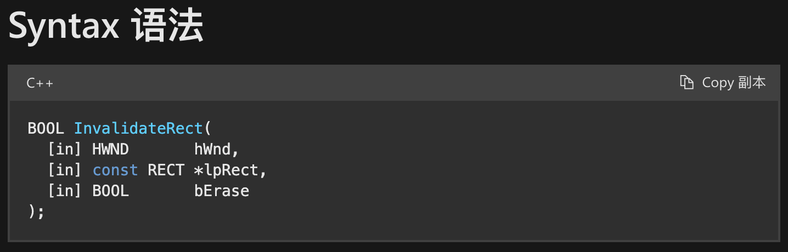

# 目的
把原先集中在`wWinMain`函数的繁重流程拆分为面向对象模式。
`wWinMain`的任务：[Windows_wchar和wmain](Windows_wchar和wmain.md)
1. 初始化窗口类对象`WNDCLASSEX wcex`的各种成员值。最重要的一步是lpfnWndProc绑定回调函数。
2. 注册该窗口类对象。
3. 创建窗口，返回HWND。
4. 显示窗口
5. 更新窗口
6. 消息循环

以上是窗口类的启动职责。
除此之外就是消息处理职责了。
总体上，[使用模板方法设计模式进行相应的消息处理的方法封装](#使用模板方法设计模式进行相应的消息处理的方法封装)。
# 准备项目

编译之前，要配置好VS项目的属性，右键项目选择Properties，左边栏选择Linker，然后选择System。右边详细条目"SubSystem"需下拉选择Windows。

在Header Files中创建Window.h，代表一个窗口。因为本文编写的应用程序是简化的项目，只包含一个进程，代表整个应用程序，所以生命周期和这个窗口是绑定的。目的是为了学习如何封装一个窗口程序的技术。

```cpp
// Window.h

#include <Windows.h>
#include <string>

#pragma once

namespace afk
{
    class Window
    {
        // ...
    };
}
```
# Window类设计

需要封装什么属性？
1. `app_name`
2. HWND窗口对象

需要封装什么行为？
1. 窗口的创建（构造函数）
2. 显示窗口
3. 消息循环

Window类初步定义
```cpp
class Window
{
public:
    Window(std::wstring const & app_name);
    void show_window(bool show = true);
    int run(void);
protected:
    HWND        _wnd{ nullptr };
};
```
Window类初步实现：
```cpp
// Window.cpp
#include "Window.h"
afk::Window::Window(std::wstring const & app_name)
{
    WNDCLASSEX wcex = { 0 };
    wcex.cbSize = sizeof(wcex);
    wcex.style = CS_HREDRAW | CS_VREDRAW;
    // 绑定CALLBACK，见后面解释
    wcex.lpfnWndProc = &window_procedure;
    // wcex.... = ...;
    wcex.lpszClassName = app_name.c_str();
    // wcex.... = ...;

    if (!::RegisterClassEx(&wcex))
        return;
    
    // 定义一个窗口对象的句柄
    // HWND: 窗口类型的句柄，也叫内核对象
    _wnd = ::CreateWindowEx(
        WS_EX_OVERLAPPEDWINDOW,
        app_name.c_str(),
        L"App",
        WS_OVERLAPPEDWINDOW,
        CW_USEDEFAULT, 0, CW_USEDEFAULT, 0,
        nullptr,
        nullptr,
        hInstance,
        nullptr);
    if (!_wnd)
    {
        int i = ::GetLastError();
        return;
    }
}
```
show_window实现
```cpp
void afk::Window::show_window(bool show /*= true*/)
{
    if(_wnd)
    {
        int nShowCmd = show ? SW_NORMAL : SW_HIDE;
        // 显示窗口，nShowCmd可以指定窗口以最小/最大/正常状态显示
        ::ShowWindow(_wnd, nShowCmd);
        // 更新窗口，绘制窗口。刚显示出来可能是无效的，需要在显示后绘制。
        ::UpdateWindow(_wnd);
    }
}
```
run实现
```cpp
int afk::Window::run(void)
{
    MSG msg;
    while (::GetMessage(&msg, nullptr, 0, 0))
    {
        // 翻译消息，比如输入法通过‘wo’生成‘我’
        ::TranslateMessage(&msg);
        // 发送消息，调用刚才注册的callback窗口处理函数
        ::DispatchMessage(&msg);
    }
    return 0;
}
```
还有一些问题需要解决：
hInstance暂无；回调函数需要自定义；注册时，需要进行异常处理。
## CALLBACK写到哪？
可以写到类中，但是，CALLBACK必须符合Windows的范式，即函数签名一致。则不能有this指针，因此需要设置为static。
```cpp
class Window
{
public:
    // ...
    static LRESULT CALLBACK window_procedure(HWND wnd, UINT message, WPARAM wparam, LPARAM lparam);
protected:
    HWND        _wnd{ nullptr };
};
```
实现：
```cpp
LRESULT afk::Window::window_procedure(HWND wnd, UINT message, WPARAM wparam, LPARAM lparam)
{
    return LRESULT();
}
```
## hInstance怎么处理
hInstance需要被`window_procedure`访问，因此也需要设置为static的。
```cpp
class Window
{
public:
    // ...
protected:
    static HINSTANCE  _instance;
};
```
静态变量，需要在`.cpp`文件中，全局初始化。
最好标记为constinit，以保证其在静态编译时就初始化。
```cpp
// Window.cpp
constinit HINSTANCE afk::Window::_instance{ nullptr };
```
# 如何封装消息处理方法？如何实现CALLBACK具体逻辑？
## 使用模板方法设计模式进行相应的消息处理的方法封装

比如，处理`WM_LBUTTONDOWN`消息，就为Window类增加一个`on_lbtndown`的成员方法，在CALLBACK中相应的case中调用该方法。  
注意，考虑继承性，需要设置其为virtual。  
还需要考虑，要显示出有没有经过用户重写？所以需要返回bool，false代表默认的空操作。

此项目我们需要封装的消息处理方法有：
1. 左键按下
2. 左键抬起
3. 画
```cpp
class Window
{
public:
    // ...
protected:
    virtual bool on_lbtndown(POINT& pt);
    virtual bool on_lbtnup(POINT& pt);
    // HDC本身就是指针，没必要传递引用
    virtual bool on_paint(HDC dc, PAINTSTRUCT& ps);
protected:
    // ...
};
```
此处默认返回false表示用户没有处理此消息。
>on_paint的参数：
>1. HDC是BeginPaint的返回值。见：[Windows_wchar和wmain](Windows_wchar和wmain.md)中的[BeginPaint](https://learn.microsoft.com/en-us/windows/win32/api/winuser/nf-winuser-beginpaint)。
>2. PAINTSTRUCT是BeginPaint的第2个参数，本项目中实际上暂未使用ps。
```cpp
bool afk::Window::on_lbtndown(POINT& pt)
{
    return false;
}

bool afk::Window::on_lbtnup(POINT& pt)
{
    return false;
}

bool afk::Window::on_paint(HDC dc, PAINTSTRUCT& ps)
{
    return false;
}
```
需要考虑，CALLBACK是静态方法，不能直接调用**非静态的成员方法**（即各种消息处理函数）。就需要定义一个静态成员变量`Window* _window`来间接调用，相当于自创this指针。
```cpp
class Window
{
public:
    // ...
protected:
    // ...
    static Window*    _window;
};
```
编译时的初始化先填一个nullptr值。
```cpp
// Window.cpp
constinit afk::Window* afk::Window::_window{ nullptr };
```
在Window构造时，创建窗口前，使用this指针进行真正的初始化。
```cpp
afk::Window::Window(std::wstring const & app_name)
{
    _window = this;
    // ...
}
```
## CALLBACK具体实现
```cpp
LRESULT afk::Window::window_procedure(HWND wnd, UINT message, WPARAM wparam, LPARAM lparam)
{
    if(!_window)
        return ::DefWindowProc(wnd, message, wparam, lparam);

    PAINTSTRUCT ps;

    switch (message)
    {
    case WM_CREATE:
        break;
    case WM_LBUTTONDOWN:
    {
        // GET_X/Y_LPARAM From <windowsx.h> 
        int x_coord = GET_X_LPARAM(lparam);
        int y_coord = GET_Y_LPARAM(lparam);
        POINT pt{ x_coord, y_coord };
        // true代表用户处理完毕
        if (_window->on_lbtndown(pt))
            return 1;
    }
        break;
    case WM_LBUTTONUP:
    {
        // GET_X/Y_LPARAM From <windowsx.h> 
        int x_coord = GET_X_LPARAM(lparam);
        int y_coord = GET_Y_LPARAM(lparam);
        POINT pt{ x_coord, y_coord };
        // true代表用户处理完毕
        if (_window->on_lbtnup(pt))
            return 1;
    }
        break;
    case WM_PAINT:
    {
        HDC dc = ::BeginPaint(wnd, &ps);
        bool result = _window->on_paint(dc, ps);
        ::EndPaint(wnd, &ps);
        if (result)
            return 1;
    }
        break;
    case WM_DESTROY:
        ::PostQuitMessage(0);
        break;
    //default:
    //    ;
    }
    return ::DefWindowProc(wnd, message, wparam, lparam);
}
```
# wWinMain放到哪里？

用户不可见，所以可以放到`.cpp`文件中。

涉及到一个问题：`_instance`即使是静态的，但其是非public成员变量，可以用友元来解决类外部函数的访问问题。
```cpp
class Window
{
    friend int ::wWinMain(HINSTANCE, HINSTANCE, LPWSTR, int);
public:
    // ...
protected:
    // ...
};
```
其次，wWinMain函数比较复杂，为了便于用户操作，再封装一层main，是供用户使用的接口，即这个函数相对于Window类来讲是用户提供的外部函数，因此标注extern。[用户main](#用户main)
```cpp
// Window.cpp

// ...

extern int main(std::wstring const & args);

// ...
int wWinMain(
    HINSTANCE hInstance,
    HINSTANCE hPrevInstance,
    LPWSTR lpCmdLine,
    int nShowCmd)
{
    afk::Window::_instance = hInstance;

    return main(lpCmdLine);
}
```

以上即为一个Window程序的框架。用户可以使用此框架开发自己的程序。
# 基于框架开发
定义MyApp类继承Window类。
```cpp
// MyApp.h
#pragma once
#include "Window.h"
class MyApp : public afk::Window
{
public:
    MyApp(std::wstring const & name) : Window{name}
    {
        //
    }
    bool on_paint(HDC dc, PAINTSTRUCT & ps)
    {
        // 测试：画一个矩形
        //Rectangle(dc, 100, 100, 200, 200);
        return true;
    }
    bool on_lbtndown(POINT& pt)
    {
        _pt = pt;
        return true;
    }
    bool on_lbtnup(POINT& pt)
    {
        HDC dc = ::GetDC(_wnd);
        // 从左键按下鼠标点 画直线到 左键弹起的点
        ::MoveToEx(dc, _pt.x, _pt.y, nullptr);
        ::LineTo(dc, pt.x, pt.y);
        
        ::ReleaseDC(_wnd, dc);
        return true;
    }
private:
    POINT          _pt;
};
```
## 技术点：GetDC
由于绘制需要得到HDC才可以，而dc只传给了on_paint函数，on_lbtnup中没有dc。
可以通过`HWND`找到当前窗口的HDC，需要调用`GetDC(HWND)`方法。
但是要记得，用完之后要ReleaseDC，需要2个参数，1是窗口句柄，2是HDC。
## 测试
```cpp
// main.cpp
#include "MyApp.h"
int main(std::wstring const & args)
{
    MyApp app{L"app"};
    app.show_window();
    return app.run();
}
```
至此，可以实现左键按下、抬起画直线了。但是一旦改变窗口就导致系统`WM_PAINT`消息重绘窗口，因为暂时没有处理`on_paint`函数，所以已经画上的线条会消失。需要把线条重绘操作集成在`on_paint`方法中，这些线条使用数据结构进行存储。
## 总结：模板方法模式
以上方法是模板方法设计模式。主要思想就是围绕一个Framework引擎，本身是可以直接使用的，行为是默认的配置。可以继承以重写一些的方法来完成特定的功能。多用于游戏引擎、应用框架，在底层隐藏了很多细节、可重用的部分。
## 完善细节：创建窗口前用户自定义配置
我们想给用户提供一个方法，就是改变窗口的属性。
需要在wcex注册前对wcex进行更改。

在Window类中封装`pre_create`方法：用于在`WNDCLASSEX`注册之前，用户修改配置。
```cpp
class Window
{
    // ...
public:
    // ...
protected:
    // ...
    virtual void pre_create(WNDCLASSEX& wcex);
}
```
默认的pre_create实现：
```cpp
// Window.cpp

// ...
void afk::Window::pre_create(WNDCLASSEX& wcex)
{
    // 默认不操作
    return;
}
// ...
```
Window构造函数在注册wcex窗口前加入pre_create
```cpp
afk::Window::Window(std::wstring const & app_name)
{
    _window = this;

    WNDCLASSEX wcex = { 0 };
    wcex.cbSize = sizeof(wcex);
    wcex.style = CS_HREDRAW | CS_VREDRAW;
    wcex.lpfnWndProc = &window_procedure;
    wcex.cbClsExtra = 0;
    wcex.cbWndExtra = 0;
    wcex.hInstance = _instance;
    wcex.hIcon = LoadIcon(nullptr, IDI_SHIELD);
    wcex.hCursor = LoadCursor(nullptr, IDC_ARROW);
    wcex.hbrBackground = (HBRUSH)(GetStockObject(LTGRAY_BRUSH));
    wcex.lpszMenuName = NULL;
    wcex.lpszClassName = app_name.c_str();
    wcex.hIconSm = wcex.hIcon;

    pre_create(wcex);

    if (!::RegisterClassEx(&wcex))
        return;

    // ...
}
```
用户自定义`pre_create`：此例中我们修改浅灰色背景为黑色背景。
```cpp
class MyApp : public afk:Window
{
public:
    // ...
protected:
    void pre_create(WNDCLASSEX& wcex)
    {
        // 改变背景色
        wcex.hbrBackground = (HBRUSH)(GetStockObject(BLACK_BRUSH));
    }

    // ...
}
```
## 问题解决：不能在构造函数中调用虚方法
此时测试，发现并没有更改成功。因为我们的设计出现了一个结构性问题：我们在构造Window函数中调用了虚函数`pre_create`，由于虚表是在构造对象的过程中还没被定义，所以会出现失效。所以我们要长个教训，不能在构造函数中赋予太多任务，尤其不能调用虚函数。
因此需要分解Window构造函数的任务。把其中的`创建窗口`和此处要做的`预创建`剥离出来。实际上，凡是和成员变量无关的，都要剥离。

Window构造函数剥离出create_window：
```cpp
// Window.h
class Window
{
    // ...
public:
    // ...
    bool create_window(void);
    // ...
protected:
    // ...
}
```
被剥离后的Window构造函数：
```cpp
// Window.cpp

// ...
afk::Window::Window(std::wstring const & app_name)
{
    _window = this;
    // app_name ??? 见下文
}
```
create_window实现，在注册窗口前调用pre_create，此时this指针、虚表已经构造完毕，虚函数行为得到纠正：
```cpp
bool afk::Window::create_window(void)
{
    WNDCLASSEX wcex = { 0 };
    wcex.cbSize = sizeof(wcex);
    wcex.style = CS_HREDRAW | CS_VREDRAW;
    wcex.lpfnWndProc = &window_procedure;
    wcex.cbClsExtra = 0;
    wcex.cbWndExtra = 0;
    wcex.hInstance = _instance;
    wcex.hIcon = LoadIcon(nullptr, IDI_SHIELD);
    wcex.hCursor = LoadCursor(nullptr, IDC_ARROW);
    wcex.hbrBackground = (HBRUSH)(GetStockObject(LTGRAY_BRUSH));
    wcex.lpszMenuName = NULL;
    wcex.lpszClassName = _app_name.c_str();
    wcex.hIconSm = wcex.hIcon;

    // 用户自定义配置
    pre_create(wcex);

    // 注册
    if (!::RegisterClassEx(&wcex))
        return false;

    // 创建窗口
    _wnd = ::CreateWindowEx(
        WS_EX_OVERLAPPEDWINDOW,
        _app_name.c_str(), L"App",
        WS_OVERLAPPEDWINDOW,
        CW_USEDEFAULT, 0, CW_USEDEFAULT, 0,
        nullptr, nullptr, _instance, nullptr);
    if (!_wnd)
    {
        int i = ::GetLastError();
        return false;
    }
    return true;
}

// ...
```
此时发现，`create_window`函数中不认识`app_name`。这个变量我们目前只在构造函数中作为参数传入，没有设计为成员变量，需要增加。
```cpp
// Window.h
class Window
{
public:
    // ...
protected:
    // ...
    std::wstring     _app_name;
}
```
最终的Window构造函数
```cpp
// Window.cpp
// ...
afk::Window::Window(std::wstring const & app_name)
{
    _window = this;
    _app_name = app_name;
}
// ...
```
## 用户main
用户自己编写的main如下：[wWinMain放到哪里？](#wWinMain放到哪里？)
```cpp
// MyApp.cpp
#include "MyApp.h"
int main()
{
    MyApp app{ L"app" };
    app.create_window(); // add
    app.show_window();
    return app.run();
}
```
## 处理重绘

至此，可以实现左键按下、抬起画直线了，并且可以在创建窗口前让用户自定义配置。

现在我们着眼于解决：改变窗口（如改变大小）后导致重绘窗口。

因为没有处理重绘，所以已经画上的线条会消失。俗称：脏矩形，指窗口被污染或被其他窗口覆盖。

Windows操作系统其实也是保留了一些东西的：鼠标箭头样式、菜单条区域。其他的图形不予保留，需要程序员自行处理。

每当改变窗口时，相当于发送了`PAINT`消息，我们需要把操作集成在`on_paint`方法中，并使用数据结构对图形进行暂存。
### LineManager：单例模式
LineManager类设计：（除了和单例有关的）
1. 成员：list容器，存放Line
2. add_line：存储Line
3. render：渲染Line
4. clear_all：析构所有Line
```cpp
// LineManager.h
#include <list>
#include <Windows.h>

// 不完全类型定义
class Line;

class LineManager
{
public:
    static LineManager* instance_ptr(void);
    static LineManager& instance(void);
    static void destroy_instance(void);

    void add_line(Line* line);
    void clear_all(void);
    // 渲染
    void render(HDC dc);
private:
    LineManager(void) = delete;
    LineManager(LineManager const&) = delete;
    LineManager(LineManager&&) noexcept = delete;
    ~LineManager();
private:
    static LineManager*       _manager;
    std::list<Line*>          _line_container;
}
```
#### LineManager单例实现
以下是懒汉式单例模式，即对象的指针一开始是空的，只有在第一次获取单例对象时，才开始构造单例对象。（线程不安全，因为new是分3个步骤的，可能导致`_manager`是否为空判断有误）
```cpp
// LineManager.cpp
#include "LineManager.cpp"
#include <algorithm>
#include <ranges>
#include "Line.h"

constinit LineManager* LineManager::_manager{ nullptr };

LineManager::LineManager(void)
{
}
LineManager::~LineManager()
{
    clear_all();
}

/* inline */ LineManager* LineManager::instance_ptr(void)
{
    if(!_manager)
        _manager = new LineManager;
    return _manager;
}

LineManager& LineManager::instance(void)
{
    if(!_manager)
        _manager = new LineManager;
    return *_manager;
}

void LineManager::destroy_instance(void)
{
    if(_manager)
    {
        delete _manager;
        _manager = nullptr;
    }
}
```
问题：内联函数不能访问private成员。把`LineManager::instance_ptr`前的inline标记去掉即可编译成功。
#### LineManager的add_line、clear_all实现
```cpp
void LineManager::add_line(Line* line)
{
    if(!line)
        return;
    _line_container.emplace_back(line);
}

void LineManager::clear_all(void)
{
    std::for_each(
        _line_container.begin(),
        _line_container.end(),
        [](auto&& line) -> void
        {
            delete line;
        });
    _line_container.clear();
}
```
#### LineManager的render实现
需要HDC参数，即Device Context的句柄。
然后传给每一个line，让他们在该DC上各自render。
```cpp
void LineManager::render(HDC dc)
{
    if(!dc)
        return;
    std::ranges::for_each(
        _line_container,
        [&dc](auto&& line) -> void /* dc是临时变量，需要在[]中捕获 */
        {
            line->render(dc);
        });
}
```
### Line
Line类设计：
1. 2个POINT成员，即两个点的坐标
2. render渲染
```cpp
// Line.h
#pragma once
#include <Windows.h>
class Line
{
public:
    Line(POINT const& pt1, POINT const& pt2);
    ~Line();
    void render(HDC dc);
private:
    POINT         _pt1, _pt2;
}
```
Line实现：
```cpp
// Line.cpp
#include "Line.h"
Line::Line(POINT const& pt1, POINT const& pt2) :
    _pt1{ pt1 }, _pt2{ pt2 }
{

}
Line::~Line()
{

}
```
#### Line的render实现
需要HDC参数，即Device Context的句柄。
是由LineManager传入的，调用MoveToEx，LineTo，在该DC上进行绘制直线。
```Cpp
void Line::render(HDC dc)
{
    ::MoveToEx(dc, _pt1.x, _pt1.y, nullptr);
    ::LineTo(dc, _pt2.x, _pt2.y);
}
```
### MyApp支持重绘的版本
1. 在`on_paint`使用LineManager进行render。
2. 每次抬起左键，就存一个Line对象。
3. 
```cpp
// MyApp.h

#include "Window.h"
#include "LineManager.h"
#include "Line.h"

class MyApp
{
public:
    // ...
    
    bool on_paint(HDC dc, PAINTSTRUCT& ps)
    {
        LineManager::instance().render(dc);
        return true;
    }
    
    // ...

    bool on_lbtnup(POINT& pt)
    {
        HDC dc = ::GetDC(_wnd);
        LineManager::instance_ptr()->add_line(new Line{ _pt, pt });
        ::ReleaseDC(_wnd, dc);
        ::InvalidateRect(_wnd, nullptr, true);
        return true;
    }
private:
    // ...
}
```
>[技术点：GetDC](#技术点：GetDC)
#### 技术点：InvalidateRect
[InvalidateRect函数 - InvalidateRect function](https://learn.microsoft.com/en-us/windows/win32/api/winuser/nf-winuser-invalidaterect)
函数的作用：在指定窗口的更新区域中添加一个矩形。更新区域代表窗口的工作区中必须重绘的部分。

1. 参数1：已更改的窗口的句柄。如果此参数为**NULL**，则系统将使所有窗口无效并重新绘制，而不仅仅是此应用程序的窗口。
2. 参数2：指向[RECT](https://learn.microsoft.com/en-us/windows/desktop/api/windef/ns-windef-rect)结构的指针，该结构包含要添加到更新区域的矩形的工作区坐标。如果此参数为**NULL**，则将整个客户区添加到更新区域。
3. 参数3：指定在处理更新区域时是否要擦除更新区域内的背景。如果此参数为**TRUE**，则在调用[BeginPaint](https://learn.microsoft.com/en-us/windows/desktop/api/winuser/nf-winuser-beginpaint)函数时擦除背景。如果此参数为**FALSE**，则背景保持不变。

这个是主动让窗口失效的函数，从而刺激系统发出`WM_PAINT`的消息，然后就调用`on_paint`，让窗口重绘。如果不加这一句的话，我们只是画完线后，窗口上不会出现东西，因为我们现在画线的逻辑只是往容器中储存了Line，真正画出来是on_paint导致LineManager调用render，从而每个Line最后render。
# 精细化管理：智能指针
## 容器内容对象的智能指针管理

目前的程序只能做成图形的`clear_all`，但如果当我们有精确删除某个、某些图形的需求时，甚至有撤销删除的需求，就容易忘记、遗漏delete，因此需要智能指针来做管理。

修改 LineManager 中的 list 成员的模板参数，以及add_line中参数由裸指针改为智能指针。
>见旧实现：[LineManager的add_line、clear_all实现](#LineManager的add_line、clear_all实现)
```cpp
// LineManager.h

#pragma once

// ...

#include <memory>

class LineManager
{
public:
    // ...

    void add_line(std::shared_ptr<Line> line);

    // ...
private:
    // ...
    std::list<std::shared_ptr<Line>> _line_container;
}
```
修改 LineManager 中的`add_line`的参数类型为智能指针，函数体内容不变。
```cpp
// LineManager.cpp
void LineManager::add_line(std::shared_ptr<Line> line)
{
    if(!line)
        return;
    _line_container.emplace_back(line);
}
```
修改 LineManager 中的`clear_all`的函数体，不用进行遍历delete了，一键 clear 即可以完成 Line 的自动析构。
```cpp
// LineManager.cpp
void LineManager::clear_all(void)
{
    _line_container.clear();
}
```
修改 MyApp 中的`on_lbtnup`，传入智能指针。
```cpp
// MyApp.h

// ...

class MyApp
{
public:
    
    // ...

    bool on_lbtnup(POINT& pt)
    {
        // ...
        LineManager::instance_ptr()->add_line(std::shared_ptr<Line>(new Line{ _pt, pt }));
        // ...
    }
private:
    // ...
}
```
## 单例对象的智能指针管理：自定义deleter

```cpp
// LineManager.h
// ...
class LineManager
{
public:
    static std::shared_ptr<LineManager> instance_ptr(void);
    // ...
private:
    // ...
private:
    static std::shared_ptr<LineManager>  _manager;
    std::list<std::shared_ptr<Line>>     _line_container;
};
```
因为改用智能指针来管理此单例对象了，所以之前其涉及到单例对象的new、delete的函数都需要修改。
```cpp
// LineManager.cpp
constinit std::shared_ptr<LineManager> LineManager::_manager{ nullptr };

std::shared_ptr<LineManager> LineManager::instance_ptr(void)
{
    if(!_manager)
        // error
        _manager = std::shared_ptr<LineManager>(new LineManager /* 需要一个deleter */);
    return _manager;
}
LineManager& LineManager::instance(void)
{
    if(!_manager)
        // error
        _manager = std::shared_ptr<LineManager>(new LineManager /* 需要一个deleter */);
    return *_manager;
}
void LineManager::destroy_instance(void)
{
    if(_manager)
    {
        // 无需delete
        _manager = nullptr;
    }
}
```
由于`shared_ptr`在销毁时，默认绑定的deleter需要访问`LineManager`的析构函数，而单例的析构函数是私有的，因此需要加一个自定义deleter。
```cpp
// LineManager.cpp
std::shared_ptr<LineManager> LineManager::instance_ptr(void)
{
    if(!_manager)
        _manager = std::shared_ptr<LineManager>(new LineManager, [](LineManager* p) { delete p; });
    return _manager;
}
LineManager& LineManager::instance(void)
{
    if(!_manager)
        _manager = std::shared_ptr<LineManager>(new LineManager, [](LineManager* p) { delete p; });
    return *_manager;
}
```
### 更简洁的deleter
单独定义一个类中private的deleter函数。
>如果不写成静态的，传deleter时还需要binder此对象的this指针，失去了简洁性。
```cpp
// LineManager.h
// ...
class LineManager
{
public:
    // ...
private:
    // ...
    static void manager_deleter(LineManager* p);
private:
    // ...
};
```
实现
```cpp
// LineManager.cpp
void LineManager::manager_deleter(LineManager* p)
{
    if (p)
    {
        delete p;
    }
}
std::shared_ptr<LineManager> LineManager::instance_ptr(void)
{
    if(!_manager)
        _manager = std::shared_ptr<LineManager>(new LineManager, &LineManager::manager_deleter);
    return _manager;
}
LineManager& LineManager::instance(void)
{
    if(!_manager)
        _manager = std::shared_ptr<LineManager>(new LineManager, &LineManager::manager_deleter);
    return *_manager;
}
```
### destroy_instance 和 deleter 的关系是什么？
我们发现，单例类自己也有一个 destroy_instance ，这个是用户自己调用的。

deleter是智能指针管理的，在new的时候，就要同时绑定此deleter，当时deleter已经记录下来new返回的裸指针p了，在没有任何一个智能指针引用此对象的情况下，就会通过delete p来进行对象的析构。
在智能指针接管之前，`delete _manager`的操作是我们用户自己在destroy_instance中进行的，而后还要置空`_manager = nullptr`。

现在智能指针接管之后，是否可以把destroy_instance 方法删除呢？
不可以。
虽然我们无需自己`delete _manager`，但仍需要`_manager = nullptr`，因此 destroy_instance 还是有用的，即指针置空操作。