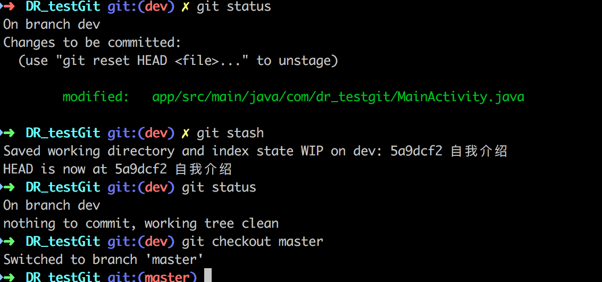
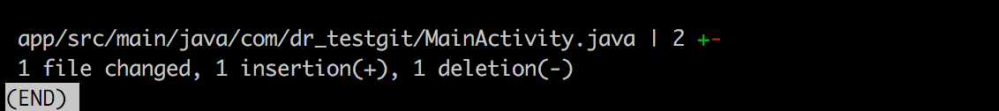
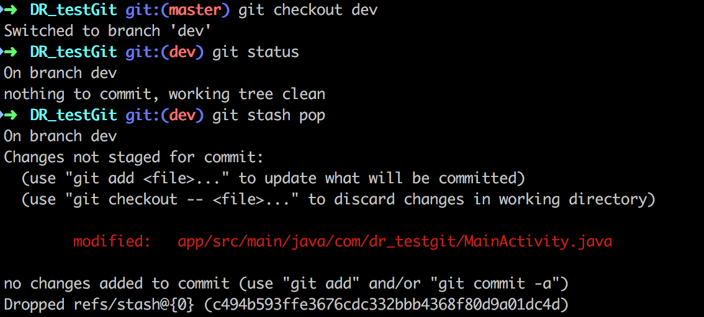
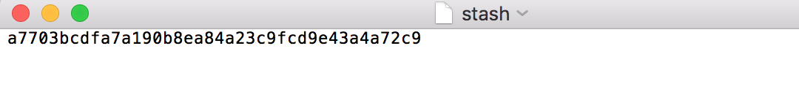
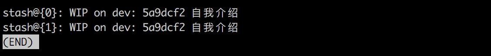
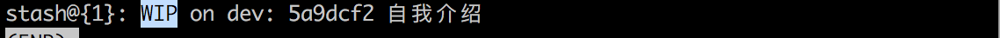

参考文章：https://blog.csdn.net/qq_32452623/article/details/76100140

# 一句话解释stash的工作

将修改存储到暂存区，工作区会删除这些修改。

总的来说，git stash命令的作用就是将目前还不想提交的但是已经修改的内容进行保存至堆栈中，后续可以在某个分支上恢复出堆栈中的内容。这也就是说，**stash中的内容不仅仅可以恢复到原先开发的分支，也可以恢复到其他任意指定的分支上**。

git stash作用的范围包括工作区和暂存区中的内容，也就是说没有提交的内容都会保存至堆栈中。

# 为什么我们需要它

使用这个命令的场景：

此时我在`feature_666`分支非常聚精会神加持高专注地实现一个功能`666`模块，简直键盘如飞的编写代码。

然后这时，客户反馈出一个bug，非常严重，必须立马解决，优先级为0！

于是，需要去到`release`分支去checkout新的分支去工作了，但是`666`功能还没完成怎么办？

此时面临着一个选择题：

A：提交后切换，代码保存到分支`feature_666`，却产生一个无意义的提交

B：不提交直接切换，然而这个选项根本没人会选。

是不是很难选，此时，别忘记还有C选项！

C：使用`git stash`，将当前修改(未提交的代码)存入缓存区，切换分支修改bug，回来再通过`git stash pop`取出来。

```bash
git stash save "本地缓存内容标识" # 把本地当前改动暂存起来，此时master分支就恢复到了上次拉取时的状态
git checkout test # 切换到需要改动的分支
git stash pop　　　 # 将改动pop到自己当前的分支
```


## 还有一种场景 - 代码冲突

我在本地修改好后，发现远程分支已经被改动了，此时我本地也被改动了就造成了冲突，**无法push或者pull**。

此时可以使用`git stash`：

```bash
git stash save "本地缓存内容标识" # 把本地的改动暂存起来;
git pull # 拉取远端分支（此时本地分支会回滚到上次commit的情况，新的改动都已保存在了stash中）;
git stash pop # 将栈顶改动内容重新加回本地分支，就可以继续修改了，当然，如果改好了就是add,commit,push操作。
```

# 例子

## 存储修改

OK， 上一个commit的时候，代码快照是这个样子的

```java
public class MainActivity extends AppCompatActivity {
    @Override
    protected void onCreate(Bundle savedInstanceState) {
        super.onCreate(savedInstanceState);
        setContentView(R.layout.activity_main);

        String s = "大家好，我是xcg";
    }
}
```

此时的我在写代码如下：

```java
public class MainActivity extends AppCompatActivity {
    @Override
    protected void onCreate(Bundle savedInstanceState) {
        super.onCreate(savedInstanceState);
        setContentView(R.layout.activity_main);

        String s = "大家好，我是xcg";
        String s1 = "我现在在写一个超级厉害的功能，但是我还没写完,甚至还有点地方在报错";
    }
}
```
代码到此处，紧急bug出现了，一秒都不能等， 选择下列操作。

```bash
git stash #将修改存储到暂存区，工作区会删除这些修改
git checkout <bug_branch>
```



暂存后的工作区代码会恢复到最后一次提交时的代码：

```java
public class MainActivity extends AppCompatActivity {
    @Override
    protected void onCreate(Bundle savedInstanceState) {
        super.onCreate(savedInstanceState);
        setContentView(R.layout.activity_main);

        String s = "大家好，我是xcg";
    }
}
```

## 查看修改

如果你有丢失代码的经历，肯定会对这个之前没接触的新命令不放心，那么怎么确定你操作成功了呢？

```bash
git stash show #查看刚才暂存的修改
```



## 取出修改

现在bug改完了，要重新回来开发了，取出修改

```bash
git checkout <feture_branch> # 切换刚才功能开发的分支
git stash pop # 取出修改
```



取出修改后的工作区代码为：

```java
public class MainActivity extends AppCompatActivity {
    @Override
    protected void onCreate(Bundle savedInstanceState) {
        super.onCreate(savedInstanceState);
        setContentView(R.layout.activity_main);

        String s = "大家好，我是段小憨";
        String s1 = "我现在在写一个超级厉害的功能，但是我还没写完,甚至还有点地方在报错";
    }
}
```

# 关于stash更多的细节

通过上面的例子，已经知道如何使用git stash了，但是，如果理解它的一些细节的话，会使用得更加灵活和得心应手。

## 修改存储到什么位置了?

当我们使用`git init`给项目添加版本控制的时候，会在项目路径下生成一个`.git`隐藏文件夹。`.git`中存储着版本管理的所有信息。`.git/refs/stash`中，存储的是最后一个`stash`对应的节点指针。



同样，在`.git/log/refs/stash`中可以看到我们全部的stash记录信息。

## 存储多个stash的情况

我们来尝试一下修改文件，然后再次使用`git stash`，此时我们有个两个暂存修改，那么怎么查看呢？

```bash
git stash list # 查看暂存区的所有暂存修改记录
```



此时你有没有发现，这两个的名称是一样，这是个什么鬼？

别怕，名称是一样的，但是指向的修改是不一样的，我们从`.git/log/refs/stash`中可以看到两者的对应的节点指针是不一样的。

### 增删查

如果再次执行git stash，新的改动将会出现在栈顶，栈中元素会越来越多，此时可以使用`git stash list`命令查看栈中元素，此时每个栈中元素会有自己对应的编号。

使用`git stash apply stash@{0}`（0可以换成对应编号），来添加不同改动。同样，也可以`git stash drop stash@{0}`来删除对应改动。`git stash clear`可以清空。

## stash的存储的名称是怎么来的，可以修改吗？

当使用`git stash`创建stash的时候，会给stash一个默认的名称。



之前有说，stash存储的内容就是，当前工作区距当前分支最后一次提交时的修改。所以，stash的默认命名规则就是：
`WIP on <branch_name> : <latest_commit_id> <latest_commit_message>`。

其中WIP解释如下：`Work In Progess`的简称，说明代表了工作区进度。

同样的还有Index，代表的是已经被add但是还未被提交的进度。

如果在未提交的情况下，执行`git stash`两次，就如上图，无法准确分辨两个`stash`具体修改的是哪些内容，这样用，显的伟大的Git一点都不智能，怎么可以！

所以，在这种情况下，给stash存储的修改起个名字，显然非常重要，方式如下：`git stash save <message>`。

## 取出也有好几种方式

上面的演示中，取出stash的方式都是

```bash
git stash pop  # 取出最近一次暂存并删除记录列表中对应记录
```


这是一个非常好用的取出方式，一般使用的频率最高，但并非适用所有情况。

因为`git stash pop`是弹出栈顶的一个`stash`，也就是最后一次存储的`stash`。在存储多个stash ，想**取出非栈顶**的一个的情况下，是不适用的。

这个时候要使用：

```bash
git stash list # 查看暂存区的所有暂存修改
git stash apply stash@{X} # 取出相应的暂存
git stash drop stash@{X} # 将记录列表中取出的对应暂存记录删除
```

# git stash与add关系

git add只是把文件加到git版本控制里，并不等于就被stash起来了，git add和git stash没有必然关系，但是执行git stash能正确存储的前提是文件必须在git版本控制中才行。

常规git stash的一个限制是它会暂存所有的文件。有时，只备份某些文件更为方便，让另外一些与代码库保持一致。一个非常有用的技巧，用来备份部分文件：

1. add那些你不想备份的文件（例如：`git add file1.js, file2.js`）；
2. 调用`git stash –keep-index`。只会备份那些没有被add的文件。
3. 调用`git reset`取消已经add的文件的备份，继续自己的工作。
