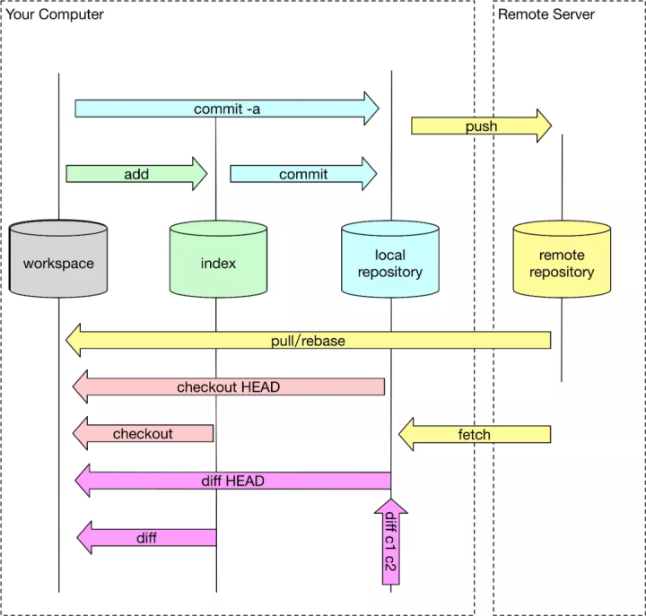

参考文章：一文讲透 Git 底层数据结构和原理 - 阿里开发者的文章 - 知乎 https://zhuanlan.zhihu.com/p/142289703



# 简要说明

| 命令     | 描述                                          |
| -------- | --------------------------------------------- |
| checkout | Switch branches or restore working tree files |
| reset    | Reset current HEAD to the specified state     |
| revert   | Revert some existing commits                  |
| rebase   | Reapply commits on top of another base tip    |
| switch   | Switch branches                               |
| restore  | Restore working tree files                    |

可以看出，checkout实际上是switch和restore的结合。

# 对应的场景

## checkout

两个作用，一是切换分支，二是恢复工作区代码。如果checkout相同分支，则作用就是恢复工作区代码。因此，可以作用于，想要把未add的代码恢复到最新commit的状态。

## reset

1. `git reset --mixed`：此为默认方式，等同于不带任何参数的git reset。这种方式，只保留源码，回退commit和index信息
2. `git reset --soft`：回退到某个版本，只回退了commit的信息，如果还要提交，直接commit即可（修改的内容变成未add的状态），索引（暂存区）和工作目录的内容是不变的，在三个命令中对现有版本库状态改动最小。
3. `git reset --hard`：彻底回退到某个版本，本地的源码也会变为上一个版本的内容，所有修改的内容都会丢失， (修改的代码 不会变成未add的状态)。索引（暂存区）内容和工作目录内容都会变给定提交时的状态。

## revert

revert我们commit了三个版本（版本一、版本二、 版本三），突然发现版本二不行（如：有bug），想要撤销版本二，但又不想影响撤销版本三的提交就可以用 git revert 命令来反做版本二，生成新的版本四，这个版本四里会保留版本三的东西，但撤销了版本二的东西

参考链接：https://www.jianshu.com/p/ef34fa4c8bf8

## rebase

https://blog.csdn.net/weixin_42310154/article/details/119004977

# git回退

## 只回退单个文件

https://zhuanlan.zhihu.com/p/267141048

Git在2.17中新增两个命令，restore和switch，分担checkout的职责；

```
# 放弃工作区的内容，使保持与暂存区一致
git restore src/index.js src/images/file.png
```

> 这里的默认参数是`--worktree`（工作区）

暂存区单个文件放弃修改：

```
# 放弃暂存区的内容，使与最近一次提交保持一致（HEAD）
git restore --stage src/index.js src/images/file.png
```

> 这里是暂存区的内容发生了变化，工作区的内容不会受影响

工作区单个文件恢复到某个提交版本

```
# 恢复工作区的某个文件到指定的某个版本，如果文件有修改也会被覆盖
git restore --source HEAD src/index.js src/images/file.png
git restore --source d68fsdf68s6df src/index.js src/images/file.png
```

> 恢复操作执行后需要add

暂存区单个文件恢复到某个提交版本

```
# 恢复暂存区的某个文件到指定的某个版本，如果暂存区文件有未提交也会被覆盖
git reset HEAD src/index.js src/images/file.png
git reset d68fsdf68s6df src/index.js src/images/file.png
```

如果需要将工作区与暂存区的某个文件都恢复到之前某个提交版本，则使用checkout来操作，简称co

```
# 同时将工作区与暂存区的某个文件恢复到指定版本
git co HEAD src/index.js src/images/file.png
git co d68fsdf68s6df src/index.js src/images/file.png
```

