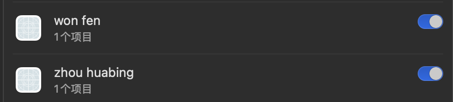
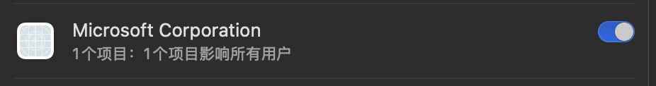

参考文章：https://www.cnblogs.com/Flat-White/p/18095629

许多软件卸载后在“登陆项 - 允许在后台”会出现残留项目

# 删除卸载残留“允许在后台”项目

Terminal运行以下命令
```bash
sudo -- bash -c 'echo " - $(date) -"; while IFS= read -r eachPlist; do echo "-$eachPlist"; /usr/bin/defaults read "$eachPlist"; done <<< "$(/usr/bin/find /Library/LaunchDaemons /Library/LaunchAgents ~/Library/LaunchAgents /private/var/root/Library/LaunchAgents /private/var/root/Library/LaunchDaemons -name "*.plist")"; /usr/bin/defaults read com.apple.loginWindow LogoutHook; /usr/bin/defaults read com.apple.loginWindow LoginHook' > ~/Desktop/launch.json
```
查看桌面生成的JSON文件后寻找需要删除项目

可以通过`WorkingDirectory`项目判断是否该项目为卸载残留

例如下面项目需要删除
```json
-/Users/saber/Library/LaunchAgents/com.shoplex.pandaclearproxy.plist
{
    EnvironmentVariables =     {
        "DYLD_LIBRARY_PATH" = "/Applications/Plex/Contents/Frameworks/";
    };
    KeepAlive = 0;
    Label = "com.shoplex.pandaclearproxy";
    ProgramArguments =     (
        "/Applications/Panda.app/Contents/MacOS/CloseProxy"
    );
    RunAtLoad = 1;
    WorkingDirectory = "/Applications/Panda.app/Contents/MacOS";
    version = "1.1.1";
}
```
根据路径执行以下命令即可删除
```bash
sudo rm -f ~/Library/LaunchAgents/com.shoplex.pandaclearproxy.plist
```

# 详细检索“允许在后台”项目
如果仍然有项目无法搜索到，运行以下命令并且查看生成的`BTM.json`
```bash
sfltool dumpbtm > ~/Desktop/BTM.json
```
查看后发现部分 “允许在后台” 项目在设置面板显示的是`Developer Name`健值

也有部分显示的是`Assoc. Bundle IDs`健值

具体情况可以自行对比上述命令生成的`BTM.json`与设置面板

例如下图的中的项目在查看了`BTM.json`后发现都是目前仍然在使用的应用程序

如：



won fen是Clash Verge的开发者
zhou huabing是RustDesk的开发者


Microsoft Corporation是Remote Desktop相关的服务

因此不建议删除

如果需要删除

使用如下命令行
```bash
sudo find /Library/LaunchDaemons /Library/LaunchAgents ~/Library/LaunchAgents -name "com.west2online.ClashXPro" -type f -delete
```

`com.west2online.ClashXPro`可以替换为其他需要删除的`Assoc. Bundle IDs`对应健值