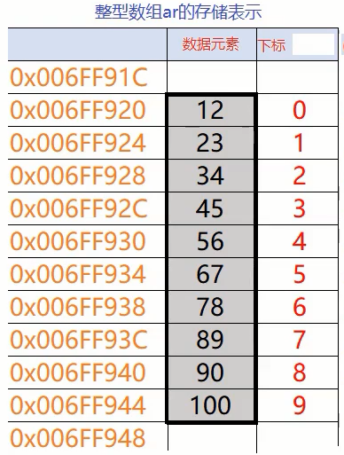

# 线性表

线性表(linear_list)是最常用且最简单的一种数据结构。简言之，**一个线性表是n个数据元素的有限序列**。至于每个数据元素的具体含义，在不同的情况下各不相同，它可以是一个整数或一个字符，也可以是一页书，甚至其他更复杂的信息。

## 线性结构的特点

1. 存在惟一的一个被称作“第一个”的数据元素；
2. 存在惟一的一个被称作“最后一个”的数据元素；
3. 除第一个之外，集合中的每个数据元素均只有一个前驱；
4. 除最后一个之外，集合中每个数据元素均只有一个后继；


概括来讲，最大的特点就是“**元素之间一对一**”的特点，即特点3和4；另外的一个标志就是，**它是连续不间断的**。

最后还要说明的是，虽然我们对线性表的定义中没有要求n个数据元素是相同类型的，但是**我们在编程的实际应用中只研究数据元素具有相同类型的线性表**。因为无类型的泛型线性表没有研究价值和意义。

```c
int main()
{
    int ar[10] = {12,23,34,45,56,67};
    double dx[10] = {12.23, 23.34, 34.45};
    
    //以下泛型线性表我们不做研究
    {12, 45.56, 'a', {"09001","yhping","man"}, "hmin"};
}
```

数据元素类型相同的线性表的相邻数据元素之间存在序偶关系。若将含有n个元素的线性表记为：
$$
(a_0,a_1,...,a_{i-1},a_i,a_{i+1},...,a_{n-1})
$$
则表中$a_{i-1}$领先于$a_{i}$，$a_{i}$领先于$a_{i+1}$。称$a_{i-1}$是$a_{i}$的直接前驱元素，$a_{i+1}$是$a_{i}$的直接后继元素。当$i=0,2,...,n-2$时，$a_{i}$有且仅有一个直接后继，当$i=1,2,...,n-1$时，$a_{i}$有且仅有一个直接前驱。

## 总结

线性表的决定性特征：

1. 一对一
2. 连续不间断

# 顺序表

顺序表是线性表的一种表示和实现方式。指的是用一组地址连续的存储单元依次存储线性表的数据元素。

示例：

```c
int main()
{
    int ar[10]={12,23,34,45,56,67,78,89,90,100};
  //位序、数组下标:0  1  2  3  4  5  6  7  8  9
    return 0;
}
```


## 容量固定的顺序表

有缺陷。容量固定的顺序表的数据元素一般都是直接以数组的形式在栈空间中存放，顺序表一旦定义在内存中，则存储空间就定死了。而栈的空间资源是很宝贵的，默认情况下栈的大小只有1M，导致固定的顺序表最大容量受到限制。

```c
#define SEQ_INIT_SIZE 1024*1024	//1M，将会栈溢出
typedef char ElemType;
typedef struct
{
    ElemType data[SEQ_INIT_SIZE];
    int cursize;
}SeqList;
```
## 容量可变顺序表

当顺序表需要扩容时，我们需要重新给顺序表分配存储空间，即调用动态内存管理函数realloc。我们在这里默认一个新的顺序表的初始容量是10，扩容后的容量是原容量的2倍。

```c
#define SEQ_INIT_SIZE 10
#define SEQ_INC_SIZE 2
```

### 结构体设计

```c
typedef struct
{
    ElemType *data;	//专门定义一个指针，指向动态空间的首地址
    int capacity;	//容量
    int cursize;	//现存元素个数
}SeqList;
```


```c
int main()
{
    SeqList myseq;
    InitSeqList(&myseq);
    return 0;
}
```

以下即是声明了SeqList myseq;后，myseq在内存中的情况。


### 初始化

即如何编写InitSeqList(&myseq);函数

```c
//最原始的写法
#define SEQ_INIT_SIZE 10
#define SEQ_INC_SIZE 2
typedef int ElemType;
void InitSeqList(SeqList seq)
{
    seq.capacity = SEQ_INIT_SIZE;
    seq.cursize = 0;
    seq.data = (ElemType*)malloc(seq.capacity);
}
int main()
{
    SeqList myseq = {};	//把成员都初始化为0，否则在VS2012环境下的代码运行过程中会报错。即运行时值传递不会进行。就比如int a;printf("%d\n",a);主要是因为没有进行初始化的值是随机值，某些运行环境会认为此时进行值传递是毫无意义的。
    InitSeqList(myseq);
    return 0;
}
```

以上写法是不可使myseq正确初始化的，因为**函数只对子函数域的形参myseq初始化**，函数执行完毕后，子函数域的myseq就被收回资源，而**主函数域中的myseq的实际内容丝毫无影响**。因为InitSeqList(myseq)只是相当于复制了一个myseq，即把自身的成员值传递给了一个其他域的myseq。

这是第一个问题。

除了这个问题，因为：子函数执行完毕后，子函数域的myseq就被收回资源，而此时data指针所指向的动态空间未被释放，导致内存泄漏。

所以这个初始化函数的写法是错上加错的。

正确的做法应该是传递主函数域中myseq的自身地址，从而实现对主函数域的myseq进行初始化。

下一个问题，(ElemType\*)malloc(seq.capacity);，malloc的参数是存储单元数，即字节数。此处的元素类型是ElemType即int型，int型每一个元素占4个字节，所以应该在参数中再乘以4。即seq.capacity\*4

第一次改进后的代码

```c
//第一次改进
#define SEQ_INIT_SIZE 10
#define SEQ_INC_SIZE 2
typedef int ElemType;
void InitSeqList(SeqList *plist)
{
    plist->capacity = SEQ_INIT_SIZE;
    plist->cursize = 0;
    plist->data = (ElemType*)malloc(plist->capacity*sizeof(ElemType));
}
int main()
{
    SeqList myseq = {};
    InitSeqList(&myseq);
    return 0;
}
```

还有一些细节上的问题，函数在执行前，**要进行判空处理**，即传入的plist不要是NULL指针。第二，malloc是向堆区申请空间，堆区大小也是有限的，所以有可能申请不到，我们**要对失败情况进行处理**。

第二次改进后的代码

```c
void InitSeqList(SeqList *plist)
{
    assert(plist!=NULL);
    plist->capacity = SEQ_INIT_SIZE;
    plist->cursize = 0;
    plist->data = (ElemType*)malloc(plist->capacity*sizeof(ElemType));
	if(NULL == plist->data)
    {
        printf("error \n");
        exit(EXIT_FAILURE);
    }
}
```

### 整表打印

```c
void PrintSeqList(SeqList *plist)
{
    assert(plist!=NULL);
    printf("Capacity: %d\n",plist->capacity);
    printf("Cursize: %d\n",plist->cursize);
    for(int i = 0; i < plist->cursize; ++i)
    {
        printf("%3d",plist->data[i]);
    }
    printf("\n");
}
```

### 查询某值的下标位置

```c
//第一次写
int FindValue(SeqList *plist, ElemType val)
{
    assert(plist!=NULL);
    int pos = -1;
    for(int i = 0; i < plist->cursize; ++i)
    {
        if(val == plist->data[i])
        {
            pos = i;
            break;
        }
    }
    return pos;
}
```


```c
//改进，巧妙地运用“找到”情况下的返回值和“未找到”情况下返回值的关联。使代码的逻辑如行云流水一般顺畅。
int FindValue(SeqList *plist, ElemType val)
{
    assert(plist!=NULL);
    int pos = plist->cursize - 1;
    while(pos>=0 && plist->data[pos]!=val)//有两个出口：一是pos<0即为-1，表示整个表中未找到val；另一个出口是data[pos]==val，此时的pos即为val值的下标。
    {
        --pos;
    }
    return pos;
}
```

### 未考虑容量问题

在指定位置插入数据元素

```c
bool InsertItem(SeqList *plist, int pos, ElemType val)
{
    assert(plist!=NULL);
    if(pos<0 || pos > plist->cursize)
    {
        return false;
	}
    //该位置之后的元素全都向后移一位。
    for(int i = plist->cursize; i>pos; --i)
    {
        plist->data[i]=plist->data[i-1];//存在漏洞，如果表满，i越界
    }
    plist->data[pos] = val;
    plist->cursize += 1;
    return true;
}
//尾插
void Push_Back(SeqList *plist, ElemType val)
{
    assert(plist!=NULL);
    InsertItem(plist, plist->cursize, val);
}
//头插
void Push_Front(SeqList *plist, ElemType val)
{
    assert(plist!=NULL);
    InsertItem(plist, 0, val);
}
```

### 考虑容量问题

#### 获取大小、容量

```c
int GetSize(SeqList *plist)
{
    assert(plist!=NULL);
    return plist->cursize;
}
int GetCapacity(SeqList *plist)
{
    assert(plist!=NULL);
    return plist->capacity;
}
```


#### 判空、判满

```c
bool IsEmpty(SeqList *plist)
{
    assert(plist!=NULL);
    return GetSize(plist) == 0;
}
bool IsFull(SeqList *plist)
{
    assert(plist!=NULL);
    return GetSize(plist) == GetCapacity(plist);
}
```


#### 增容

##### 用malloc实现的增容

完成的动作：

1. malloc
2. myseq.data所有数据移动到新空间
3. free原空间
4. data指针指向新空间的首地址
5. 更新capacity

```c
bool Inc_Capacity(SeqList *plist)
{
    assert(plist!=NULL);
    ElemType *newdata = NULL;
    int newcap = GetCapacity(plist)*SEQ_INC_SIZE;
    newdata = (ElemType*)malloc(newcap*sizeof(ElemType));
    if(NULL == newdata)
    {
        return false;
    }
    
    for(int i = 0;i < plist->GetCapacity(plist);++i)
    {
        newdata[i] = plist->data[i];
    }
    
    free(plist->data);
    
    plist->data = newdata;
    
    plist->capacity = newcap;
    return true;
}
```

优化-移动数据

```c
	/*for(int i = 0;i < plist->GetCapacity(plist);++i)
    {
        newdata[i] = plist->data[i];
    }*/
	//可以换为
	memmove(newdata, plist->data, plist->cursize*sizeof(ElemType));
```

##### 用realloc实现的增容

```c
bool Inc_Capacity(SeqList *plist)
{
    assert(plist!=NULL);
    int newcap = GetCapacity(plist)*SEQ_INC_SIZE;
    
    //不要直接把realloc的返回值赋给plist->data，因为可能返回NULL，导致数据空间丢失。
    ElemType *newdata = (ElemType*)realloc(plist->data, newcap*sizeof(ElemType));
    if(NULL == newdata)
    {
        return false;
    }
    
    plist->data = newdata;
    
    plist->capacity = newcap;
    return true;
}
```


#### 在指定位置插入数据元素


```c
bool InsertItem(SeqList *plist, int pos, ElemType val)
{
    assert(plist!=NULL);
    if(pos<0 || pos > plist->cursize)
    {
        return false;
	}
    if(IsFull(plist) && !Inc_Capacity(plist))//表满且扩容失败
    {
        return false;
    }
    //该位置之后的元素全都向后移一位。
    for(int i = plist->cursize; i>pos; --i)
    {
        plist->data[i]=plist->data[i-1];//永远不会越界，因为移动前已经确保空间充足
    }
    plist->data[pos] = val;
    plist->cursize += 1;
    return true;
}
```

优化-返回状态值

```c
//infeasible:不可行
//overflow:空间不足，内存溢出
#define TRUE 1
#define FALSE 0
#define OK 1
#define ERROR 0

#define INFEASIBLE -1
#define OVERFLOW -2

typedef int Status;

Status InsertItem(SeqList *plist, int pos, ElemType val)
{
    assert(plist!=NULL);
    if(pos<0 || pos > plist->cursize)
    {
        return INFEASIBLE;
	}
    if(IsFull(plist) && !Inc_Capacity(plist))//表满且扩容失败
    {
        return OVERFLOW;
    }
    //该位置之后的元素全都向后移一位。
    for(int i = plist->cursize; i>pos; --i)
    {
        plist->data[i]=plist->data[i-1];//永远不会越界，因为移动前已经确保空间充足
    }
    plist->data[pos] = val;
    plist->cursize += 1;
    return OK;
}

int main()
{
    Status tag = InsertItem(&myseq,12,23);
    if(tag == INFEASIBLE)
    {
        printf("位置不可行");
    }
    else if(tag == OVERFLOW)
    {
        printf("内存溢出");
    }
    else if(tag == OK)
    {
        printf("成功");
    }
}
```


#### 尾插、头插

```c
void Push_Back(SeqList *plist, ElemType val)
{
    assert(plist!=NULL);
    InsertItem(plist, plist->cursize, val);
}
```

```c
void Push_Front(SeqList *plist, ElemType val)
{
    assert(plist!=NULL);
    InsertItem(plist, 0, val);
}
```

#### 插数据测试

```c
int main()
{
    SeqList myseq = {};
    InitSeqList(&myseq);
    for(int i = 0; i<20; ++i)
    {
        Push_Back(&myseq,i);
        PrintSeqList(&myseq);
	}
    return 0;
}
```

#### 删

```c
Status EraseItem(SeqList *plist, int pos)
{
    assert(plist!=NULL);
    if(pos < 0 || pos > plist->cursize - 1)
    {
        return INFEASIBLE;
    }
    for(int i = pos; i < plist->cursize - 1; i++)
    {
        plist->data[i] = plist->data[i+1];
    }
    plist->cursize -= 1;
    return OK;
}
```

#### 头删、尾删

```c
void Pop_Front(SeqList *plist)
{
    assert(plist!=NULL);
    EraseItem(plist, 0);
}
void Pop_Back(SeqList *plist)
{
    assert(plist!=NULL);
    EraseItem(plist, plist->cursize-1);
}
```

#### 判断数据元素是否在表中

```c
bool LocateElem(const SeqList *plist, ElemType val)
{
    assert(plist!=NULL);
    return FindValue(plist,val) != -1;
}
```

#### 删除最后一个数据元素val

因为Find函数是从后向前找的。

```c
Status Remove(SeqList *plist, ElemType val)
{
    assert(plist!=NULL);
    return EraseItem(plist, FindValue(plist, val));
}
```

#### 置空、摧毁

```c
void ClearSeqList(SeqList *plist)
{
    assert(plist!=NULL);
    plist->cursize = 0;
}
void Destroy(SeqList *plist)
{
    assert(plist!=NULL);
    plist->cursize = 0;
    plist->capacity = 0;
    free(plist->data); 
}
```


#### 删除所有val元素

```c
void Remove_All(SeqList *plist, ElemType val)
{
    assert(plist!=NULL);
    int j = 0;
    for(int i = 0;i<plist->cursize; ++i)
    {
        if(val != plist->data[i])
        {
            plist->data[j]=plist->data[i];
            j++;
        }
    }
    plist->cursize = j;
}
```

### 整理代码+const

#### 头文件

```c
//My_SeqList.h
#ifndef MY_SEQLIST_H
#define MY_SEQLIST_H

//infeasible:不可行
//overflow:空间不足，内存溢出
#define TRUE 1
#define FALSE 0
#define OK 1
#define ERROR 0

#define INFEASIBLE -1
#define OVERFLOW -2

typedef int Status;
#define SEQ_INIT_SIZE 4
#define SEQ_INC_SIZE 2
typedef int ElemType;
typedef struct
{
    ElemType *data;
    int capacity;
    int cursize;
}SeqList;

void InitSeqList(SeqList *plist);
void DestroySeqList(SeqList *plist);

void ClearSeqList(SeqList *plist);

int GetSize(const SeqList *plist);
int GetCapacity(const SeqList *plist);
bool IsEmpty(const SeqList *plist);
bool IsFull(const SeqList *plist);

int FindValue(const SeqList *plist, ElemType val);

bool Inc_Capacity(SeqList *plist);
Status InsertItem(SeqList *plist, int pos, ElemType val);
void Push_Back(SeqList *plist, ElemType val);
void Push_Front(SeqList *plist, ElemType val);

Status EraseItem(SeqList *plist, int pos);
void Pop_Back(SeqList *plist);
void Pop_Front(SeqList *plist);
bool LocateElem(const SeqList *plist, ElemType val);
Status Remove(SeqList *plist, ElemType val);

void PrintSeqList(const SeqList *plist);
#endif
```

#### cpp文件

```c
//My_SeqList.cpp
#include<stdio.h>
#include<stdlib.h>
#include<string.h>
#include<assert.h>
#include"My_SeqList.h"

void InitSeqList(SeqList seq)
{
    seq.capacity = SEQ_INIT_SIZE;
    seq.cursize = 0;
    seq.data = (ElemType*)malloc(seq.capacity);
}
void ClearSeqList(SeqList *plist)
{
    assert(plist!=NULL);
    plist->cursize = 0;
}
void DestroySeqList(SeqList *plist)
{
    assert(plist!=NULL);
    plist->cursize = 0;
    plist->capacity = 0;
    free(plist->data); 
}

int GetSize(const SeqList *plist)
{
    assert(plist!=NULL);
    return plist->cursize;
}
int GetCapacity(const SeqList *plist)
{
    assert(plist!=NULL);
    return plist->capacity;
}
bool IsEmpty(const SeqList *plist)
{
    assert(plist!=NULL);
    return GetSize(plist) == 0;
}
bool IsFull(const SeqList *plist)
{
    assert(plist!=NULL);
    return GetSize(plist) == GetCapacity(plist);
}

int FindValue(const SeqList *plist, ElemType val)
{
    assert(plist!=NULL);
    int pos = plist->cursize - 1;
    while(pos>=0 && plist->data[pos]!=val)
    {
        --pos;
    }
    return pos;
}
bool Inc_Capacity(SeqList *plist)
{
    assert(plist!=NULL);
    int newcap = GetCapacity(plist)*SEQ_INC_SIZE;
    
    ElemType *newdata = (ElemType*)realloc(plist->data, newcap*sizeof(ElemType));
    if(NULL == newdata)
    {
        return false;
    }
    
    plist->data = newdata;
    
    plist->capacity = newcap;
    return true;
}

Status InsertItem(SeqList *plist, int pos, ElemType val)
{
    assert(plist!=NULL);
    if(pos<0 || pos > plist->cursize)
    {
        return INFEASIBLE;
	}
    if(IsFull(plist) && !Inc_Capacity(plist))//表满且扩容失败
    {
        return OVERFLOW;
    }
    //该位置之后的元素全都向后移一位。
    for(int i = plist->cursize; i>pos; --i)
    {
        plist->data[i]=plist->data[i-1];//永远不会越界，因为移动前已经确保空间充足
    }
    plist->data[pos] = val;
    plist->cursize += 1;
    return OK;
}

void Push_Back(SeqList *plist, ElemType val)
{
    assert(plist!=NULL);
    InsertItem(plist, plist->cursize, val);
}

void Push_Front(SeqList *plist, ElemType val)
{
    assert(plist!=NULL);
    InsertItem(plist, 0, val);
}


Status EraseItem(SeqList *plist, int pos)
{
    assert(plist!=NULL);
    if(pos < 0 || pos > plist->cursize - 1)
    {
        return INFEASIBLE;
    }
    for(int i = pos; i < plist->cursize - 1; i++)
    {
        plist->data[i] = plist->data[i+1];
    }
    plist->cursize -= 1;
    return OK;
}

void Pop_Front(SeqList *plist)
{
    assert(plist!=NULL);
    EraseItem(plist, 0);
}
void Pop_Back(SeqList *plist)
{
    assert(plist!=NULL);
    EraseItem(plist, plist->cursize-1);
}

bool LocateElem(const SeqList *plist, ElemType val)
{
    assert(plist!=NULL);
    return FindValue(plist,val) != -1;
}

Status Remove(SeqList *plist, ElemType val)
{
    assert(plist!=NULL);
    return EraseItem(plist, FindValue(plist, val));
}

void Remove_All(SeqList *plist, ElemType val)
{
    assert(plist!=NULL);
    int j = 0;
    for(int i = 0;i<plist->cursize; ++i)
    {
        if(val != plist->data[i])
        {
            plist->data[j]=plist->data[i];
            j++;
        }
    }
    plist->cursize = j;
}
void PrintSeqList(const SeqList *plist)
{
    assert(plist!=NULL);
    printf("Capacity: %d\n",plist->capacity);
    printf("Cursize: %d\n",plist->cursize);
    for(int i = 0; i < plist->cursize; ++i)
    {
        printf("%3d",plist->data[i]);
    }
    printf("\n");
}
```

```c
int main()
{
    SeqList myseq;
    InitSeqList(&myseq);
    
    
    
    DestroySeqList(&myseq);
}
```

# 面试题

## 查表法找数组中重复的值

```c
//
int FindDuplicate(int *nums, int size)
{
    assert(nums!=NULL);
    int res = 0;
    int *ar = (int*)calloc(size,sizeof(int));
    if(NULL == ar)
    {
        exit(1);
    }
    for(int i = 0;i<size;++i)
    {
        if(ar[nums[i]]++!=0)
        {
         	res = nums[i];
            break;
        }
    }
    free(ar);
    ar = NULL;
    return res;
}
```

