# 内容

1. 单链表的操作
2. 单链表的经典题目

# 单链表经典题目

## Remove

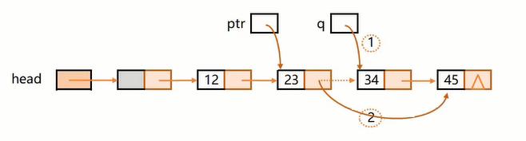

* 删除单个元素--按值

比如删除34。

第1种做法，双指针

```c
void Remove(LinkList head, ElemType val)
{
    assert(head != NULL);
    ListNode* back = head;
    ListNode* front = head->next; 
    while(front != NULL && front->data != val)
    {
        back = front;
        front = front->next;
    }
    if(front == NULL)return;
    back->next = front->next;
    free(front);
    front = NULL;
    return;
}
```

第2种做法，结合API。按值找到该值节点的前驱(调用FindValue_Prev)，然后调用删除Erase_Next。

```c
bool Erase_Next(LinkList head, ListNode *ptr);
bool Remove(LinkList head, ElemType val)
{
    assert(head != NULL);
    return Erase_Next(head, FindValue_Prev(head, val));
}
```

* 删除所有val值节点

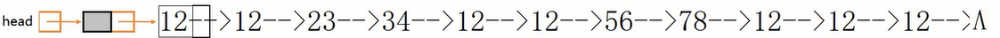

第1种做法，每次从头开始找val，重复若干次，直到找不到为止。时间复杂度为$O(n^2)$

```c
bool Erase_Next(LinkList head, ListNode *ptr);
ListNode * FindValue_Prev(LinkList head, ElemType val);
void Remove_All(LinkList head, ElemType val)
{
    assert(head != NULL);
    ListNode * p = NULL;
    while((p = FindValue_Prev(head, val)) != NULL)
    {
        Erase_Next(head, p);
    }
}
```

第2种做法，思想：back指针在后面守护，front在前面探测：**front遇到非val值时back前移，然后交换此时back和front的数据域**。每轮front都前移一次，直到遍历完毕。

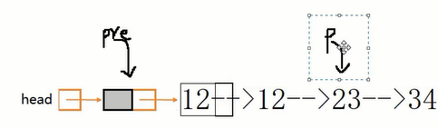

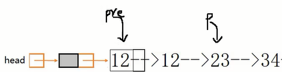

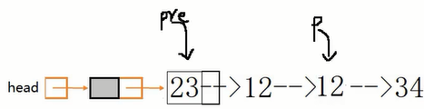

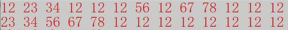

```c
void Remove_All(LinkList head, ElemType val)
{
    assert(head != NULL);
    ListNode * back = head;
    ListNode * front = head->next;
    while(front != NULL)
    {
        if(front->data != val)
        {
            back = back->next;
            Swap(&back->data, &front->data);
        }
        front = front->next;
    }
    // 此时，所有val节点都集中在back指向的节点之后，while直到删完
    while(back->next != NULL)
    {
        Erase_Next(head, pre);
    }
}
```

## Reverse

### 三指针

时间复杂度$O(n)$，空间复杂度$O(1)$

```c
void ReverseList(LinkList head)
{
    assert(head != NULL);
    ListNode *back = NULL;
    ListNode *temp = NULL;
    ListNode *front = head->next;
    while(front != NULL)
    {
        temp = front;
        front = front->next;
        temp->next = back;
        back = temp;
    }
    head->next = back;
}
```


### 二指针（头插）

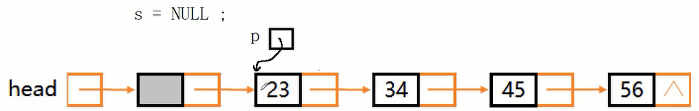

时间复杂度$O(n)$，空间复杂度$O(1)$

```c
void ReverseList(LinkList head)
{
    ListNode *front = head->next;
    ListNode *temp = NULL;
    head->next = NULL;	// ready to push_front
    while(front != NULL)
    {
        // front will move, avoid front->next change, temp log. 
        temp = front;
        front = front->next;
        // the next 2 steps : push front
        temp->next = head->next;
        head->next = temp;
    }
}
```

头插法逆置还有一种单指针的做法，遍历把每个节点的值取出，调用Push_Front按值购买节点头插。这种做法的空间复杂度是$O(n)$，同时还会涉及到内存泄漏的问题，因为旧有遍历过的节点没有释放。如果要在代码中主动释放，则又需要加个temp指针来记录了。一边申请，一边释放，这种做法是及其耗费资源的，不推荐。

```c
void ReverseList(LinkList head)
{
    ListNode *front = head->next;
    head->next = NULL;
    while(front != NULL)
    {
        ElemType val = front->val;
        Push_Front(head, val);
        
    /*  ListNode *temp = front;	*/
        front = front->next;
    /*	free(temp);				*/
    }
}
```


### 栈

栈的特性：后进先出

用一个连续空间和push_back/pop_back/get_back模拟一个栈。

时间复杂度$O(n)$，空间复杂度$O(n)$

```c
void ReverseList(LinkList head)
{
    assert(head != NULL);
    int len = 0;
    ListNode *front = head->next;
    while(p != NULL)
    {
        ++len;
        front = front->next;
    }
    ElemType *stack = (ElemType*)malloc(sizeof(ElemType)*len);
    int top = -1;
    front = head->next;
    while(p != NULL)
    {
        top += 1;
        stack[top] = p->data;
        front = front->next;
    }
    front = head->next;
    while(front != NULL)
    {
        p->data = stack[top];
        top -= 1;
        front = front->next;
    }
    free(stack);
    stack = NULL;
}
```


### 递归

分析最小的递归单元：两个节点的逆置。


两个节点的逆置动作：**首先first指针指向23**，然后分析：要逆置23和34，需要先把23之后的逆置，而34只是一个节点，不做动作直接return自身，**则last指针指向34**。然后first->next->next指向first，即34指向自己，先画一个环；然后first->next = NULL，23与34切断连接。如此即完成两个节点的逆置。以此类推即是链表逆置的递归过程。

时间复杂度$O(n)$，空间复杂度$O(n)$

```c
ListNode * Reverse(ListNode *first)	//此函数也可以处理不带头节点的单链表逆置
{
    if(pnode==NULL || pnode->next==NULL)return first;
    ListNode * last = Reverse(first->next);
    first->next->next = first;
    first->next = NULL;
    return last;
}
void ReverseList(LinkList head)
{
    assert(head != NULL);
    ListNode *front = head->next;
    head->next = Reverse(front);
}
```

举例：

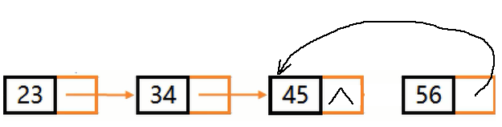

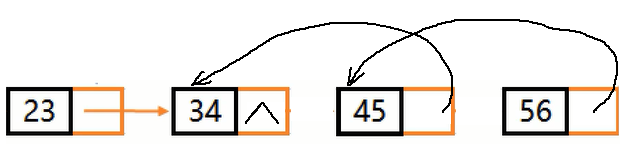

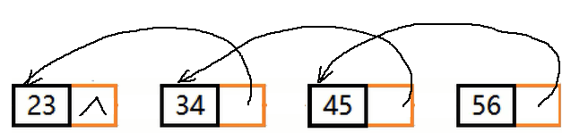

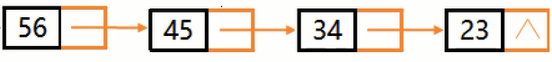

### 不带头结点单链表的非递归逆置--三指针法

```c
ListNode * NiceReverseList(LinkList head)
{
    if(head == NULL || head->next == NULL)return head;
    ListNode *front = head;
    ListNode *back = NULL;
    ListNode *temp = NULL;
    while(front != NULL)
    {
        temp = front;
        front = front->next;
        temp->next = back;
        back = temp;
    }
    return back;
}
```

## 倒数第k

打印不带头节点的单链表中倒数第k个节点的数据。

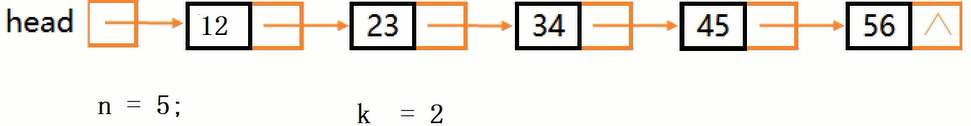

### len减k法

打印第n-k+1个节点。

比如，我们有5个节点，要求打印倒数第2个节点。则等效于打印正数第5-2+1个节点。

```c
void PrintKth_List(LinkList head, int k)
{
    if(head == NULL || k < 1)return;
    int count = 0;
    ListNode *front = head;
    while(front != NULL)
    {
        ++count;
        front = front->next;
    }
    if(k > n)return;
    
    front = head;
    while(count-- > k)
    {
        front = front->next;
    }
    printf("%dth data of LinkList : %d. \n", front->data);
    return;
}
```

### 递归

时间复杂度$O(n)$，空间复杂度$O(n)$

```c
int PrintKth(ListNode * head, int k)
{
    if(head == NULL)return 0;
    int count = PrintKth(head->next, k) + 1;
    if(count == k)
    {
        printf("%dth data of LinkList : %d. \n", front->data);
    }
    return count;
}
void PrintKth_List(LinkList head, int k)
{
    if(head == NULL || k < 1)return;
    PrintKth(head, k);
}
```

### 栈

### 双指针

即快慢指针法，使快慢指针相差k距离，同时步进，当快指针空时，则慢指针指向倒数第k值。

```c
void PrintKth_List(LinkList head, int k)
{
    if(head == NULL || k < 1)return;
    ListNode *front = head;
    ListNode *back = head;
    int count = k;
    while(front!=NULL && count>0)	//front==NULL 或 k==0退出，front==NULL退出是因为k>=n；front!=NULL&&k==0退出 则k<n，正常。
    {
        front = front->next;
        --count;
    }
    if(count != 0)
    {
        if(front == NULL)return;//k超出节点数量范围
        while(front != NULL)
        {
            front = front->next;
            back = back->next;
        }
    }
    printf("%dth data of LinkList : %d. \n", back->data);
    return;
}
```

## 返回中间节点

快慢指针法，快指针一次走两个，慢指针一次走一个。

```c
ListNode * GetMidNode(LinkList head)
{
    if(head==NULL || head->next==NULL)return head;
    ListNode * front = head;
    ListNode * back = head;
    while(front->next!=NULL && front->next->next!=NULL)
    {
        front = front->next->next;
        back = back->next;
    }
    return back;
}
```

## 环路

### 数组中的重复数字


# 刷题


```c
void deleteNode(struct ListNode* node) 
{
    struct ListNode *p = node->next;
    *node=*p;
    free(p);
}
```

如果考虑最后节点，就没办法用这种方法了，因为最多只能给最后的节点的信息全赋零值，并且前继节点的next指向的地址是无法改变的。


