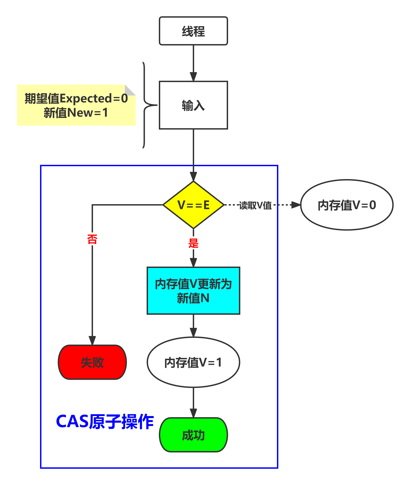

# 内容

1. CAS原理
2. 原子操作
3. 栈
4. 汇编层面
# CAS

CAS(compare And Swap)也叫比较交换，是一种无锁原子算法，映射到操作系统就是一条cmpxchg硬件汇编指令(**保证原子性**)，其作用是让CPU将内存值更新为新值，但是有个条件，内存值必须与期望值相同，并且CAS操作**无需用户态与内核态切换，直接在用户态对内存进行读写**操作(意味着不会阻塞/线程上下文切换)。

它包含3个参数CAS(V，E，N) ，**V表示待更新的内存值，E表示预期值**，N表示新值，当V值等于E值时，才会将V值更新成N值，如果V值和E值不等，不做更新，这就是一次CAS的操作。



# 链栈

```cpp
#include<mutex>
#include<thread>
template<class T>
class Stack
{
private:
struct StackNode
{
	T data;
	StackNode* next;
};
StackNode* Buynode()
{
	StackNode* s = (StackNode*)malloc(sizeof(StackNode));
	if (NULL == s)exit(1);
	memset(s, 0, sizeof(StackNode));
	return s;
}
void Freenode(StackNode* pnode)
{
	free(pnode);
}
private:
	StackNode* base;
	size_t cursize;
	//mutable std::mutex mtx;
	mutable std::recursive_mutex mtx;
	Stack(const Stack&) = delete;
	Stack& operator=(const Stack&) = delete;
public:
	Stack()
		:base(nullptr), cursize(0)
	{

	}
	~Stack()
	{
		clear();
	}
	void clear()
	{
		std::lock_guard<std::recursive_mutex> locker(mtx);
		while (base != nullptr)
		{
			StackNode* q = base;
			base = q->next;
			(&(q->data))->~T();
			Freenode(q);
			cursize -= 1;
		}
	}
	void push(const T& x)
	{
		std::lock_guard<std::recursive_mutex> locker(mtx);
		StackNode* s = Buynode();
		new(&(s->data)) T(x);	//定位new构造对象
		s->next = base;
		base = s;
		cursize += 1;
	}
	const T& top() const
	{
		std::lock_guard<std::recursive_mutex> locker(mtx);
		return base->data;
	}
	T& top()
	{
		std::lock_guard<std::recursive_mutex> locker(mtx);
		return base->data;
	}
	void pop()
	{
		std::lock_guard<std::recursive_mutex> locker(mtx);
		if (base != nullptr)
		{
			StackNode* q = base;
			base = q->next;
			(&(q->data))->~T();	//定位析构
			Freenode(q);
			cursize -= 1;
		}
	}
public:
	size_t get_size() const
	{
		std::lock_guard<std::recursive_mutex> locker(mtx);
		return cursize;
	}
	bool is_empty() const
	{
		std::lock_guard<std::recursive_mutex> locker(mtx);
		return get_size() == 0;
	}
};
#define _TEST1
#ifdef _TEST1
#include<iostream>
#include<thread>
void thread_funa(Stack<int>& s)
{
	for (int i = 1; i <= 10; i += 2)
	{
		std::cout << i << std::endl;
		s.push(i);
	}
}
void thread_funb(Stack<int>& s)
{
	for (int i = 2; i <= 10; i += 2)
	{
		std::cout << i << std::endl;
		s.push(i);
	}
}
int main()
{
	Stack<int> ist;
	std::thread tha(thread_funa, std::ref(ist));
	std::thread thb(thread_funb, std::ref(ist));

	tha.join();
	thb.join();
	std::cout << "push over." << std::endl;
	while (!ist.is_empty())
	{
		int val = ist.top();
		std::cout << val << std::endl;
		ist.pop();
	}
}
#endif
```

结果

```
12

43

65

87

109

push over.
9
10
7
8
5
6
3
4
1
2
```

# 标准库原子操作API

## 构造函数

原型：`std::atomic<T>::atomic`

```cpp
atomic() noexcept = default;
constexpr atomic() = noexcept(std::is_nothrow_default_constructible_v<T>);
constexpr atomic(T desired) noexcept;
atomic(const atomic&) = delete;
```

有默认无参构造；拷贝构造删除。

## operator=

```cpp
T operator=(T desired) noexcept;
T operator=(T desired) volatile noexcept;
atomic& operator=(const atomic&) = delete;
atomic& operator=(const atomic&) volatile = delete;
```

两个原子对象之间不可相互赋值。

### 代码示例

```cpp
#include<atomic>
int main()
{
    atomic<int> iat;
    atomic<int> iat2;
    //iat = iat2; //error
    iat = 10;
}
```

## load

原子地加载并返回原子对象的当前值。安装order的值影响内存。

```cpp
T load(std::memory_order order = std::memory_order_seq_cst) const noexcept;
T load(std::memory_order order = std::memory_order_seq_cst) const volatile noexcept;
参数：
    order	- 强制的内存顺数
返回值：
    原子变量的当前值
```


```cpp
#include<atomic>
int main()
{
    atomic<int> iat;
    atomic<int> iat2;
    iat = 10;
    int val = iat.load();
}
```

存在的问题：

语义是获取原子对象的值没错，但是获取的此值只作为当时的瞬时值。

在多线程中，可能获得的是脏数据。

## compare_exchange

有两个函数。`compare_exchange_weak`、`compare_exchange_strong`。

原子地比较原子对象与的非原子参数的值，若相等进行交换，若不相等则进行加载。

```cpp
bool compare_exchange_weak(T & expected, T desired, std::memory_order order = std::memory_order_seq_cst) noexcept;
参数：
	expected - 到期待在原子对象中找到的值的引用。若比较失败则被存储*this的实际值。
	desired  - 若符合期待则存储于原子对象的值
	success  - 若比较成功,则读修改写操作所用的内存同步顺序。容许所有值。
	failure  - 若比较失败,则加载操作所用的内存同步顺序。不能为std::memory_order_release或std::memory_order_acq_rel，且不能指定强于success 的顺序(C++17前)
    order 	 - 两个操作所用的内存同步顺序
返回值：
	若成功更改底层原子值则为true，否则为false
```

原子地比较`*this`原子对象与`expected`的`对象表示(C++20前) | 值表示(C++20起)`，而若它们逐位相等则以`desired`替换前者（进行读修改写操作）。否则，将`*this`中的实际值加载进`expected`（进行加载操作）。

读修改写和加载操作的内存模型分别为`success`和`failure`。在上面这个函数中，order用于读修改写操作和加载操作，除了若`order == std::memory_order_acq_rel`或`order== std::memory_order_release`，则加载操作分别使用`std::memory_order_acquire`和`std::memory_order_relaxed`。

# 改写链栈

```cpp
#include<mutex>
#include<thread>
template<class T>
class Stack
{
private:
struct StackNode
{
	T data;
	StackNode* next;
};
StackNode* Buynode()
{
	StackNode* s = (StackNode*)malloc(sizeof(StackNode));
	if (NULL == s)exit(1);
	memset(s, 0, sizeof(StackNode));
	return s;
}
void Freenode(StackNode* pnode)
{
	free(pnode);
}
private:
	mutable std::atomic<StackNode*> pHead;
	Stack(const Stack&) = delete;
	Stack& operator=(const Stack&) = delete;
public:
	Stack()
		:pHead(nullptr)
	{

	}
	~Stack()
	{
		
	}
    void push(const T& val)
    {
        StackNode * newnode = Buynode();
        new(&(newnode->data)) T(val);
        newnode->next = pHead;
        pHead = newnode;
    }
};
int main()
{
    Stack<int> ist;
    
}
```

对`newnode->next = pHead; pHead = newnode;`进行原子化。
即转为：`while(!pHead.compare_exchange_weak(newnode->next, newnode));`

```cpp
    void push(const T& val)
    {
        StackNode * newnode = Buynode();
        new(&(newnode->data)) T(val);
        
        newnode->next = pHead.load();
        while(!pHead.compare_exchange_weak(newnode->next, newnode));
    }
```

判断`pHead`是否等于`newnode->next`，如果相等，则把`newnode`赋值给`pHead`。
