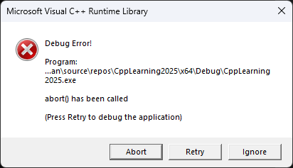
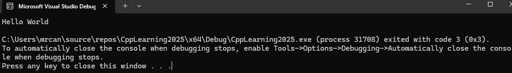
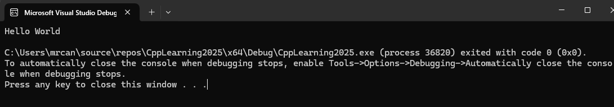
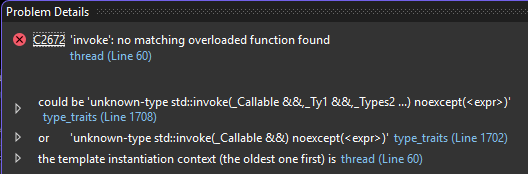
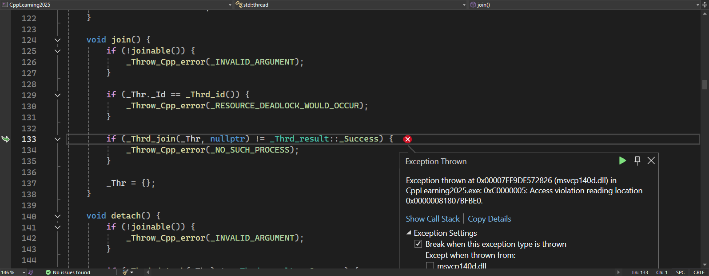
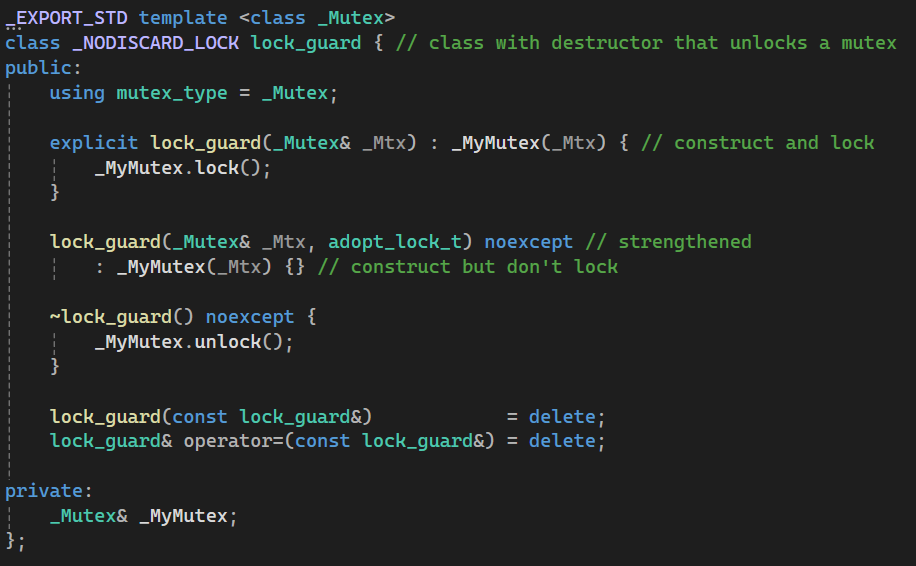

# 进程和线程
进程是运行中的程序。线程是进程中的进程。
# C++11 Thread库
## 创建线程
创建线程需要一个可调用的函数或函数对象，作为线程的入口点。在C++11中，可以使用函数指针、函数对象或lambda表达式来实现。
```cpp
#include <iostream>
#include <thread>
void printHelloWorld()
{
    std::cout << "Hello World" << std::endl;
}
int main()
{
    // 1 create a thread
    std::thread thread1(printHelloWorld);
    return 0;
}
```
上面这个程序运行后，可能会报错。


因为主线程main开启线程后，继续执行自己的内容，不会等待子线程。
但是一旦主线程结束，控制台窗口就会结束。因此子线程可能打印不全。这会导致运行结果不符预期。
## join - 主线程等待子线程
为了让子线程执行完毕，我们需要在主线程中加入`join()`。这样，如果子线程没有结束，则主线程也不会退出。
```cpp
int main()
{
    // 1 create a thread
    std::thread thread1(printHelloWorld);
    
    thread1.join();
    return 0;
}
```

### join是阻塞的：等待子线程执行完毕，主线程才会继续执行join后面的内容
```cpp
#include <iostream>
#include <thread>
void printHelloWorld(std::string msg)
{
    //std::cout << "Hello World" << std::endl;
    std::cout << msg << std::endl;
    std::cin >> msg;
}
int main()
{
    // 1 create a thread
    std::thread thread1(printHelloWorld, "Hello Thread");
    
    thread1.join();
    std::cout << "Hello World" << std::endl;
    return 0;
}
```
执行后发现，由于主线程的打印是在join后面的，当我们在键盘上输入字符串后回车，主线程才会继续打印。
执行结果：
```
Hello Thread    # 子线程打印
123             # 我们自己输入的
Hello World     # 主线程打印
```
## 传参
主线程可以给子线程传入参数。
```cpp
#include <iostream>
#include <thread>
void printHelloWorld(std::string msg)
{
    //std::cout << "Hello World" << std::endl;
    std::cout << msg << std::endl;
}
int main()
{
    // 1 create a thread
    std::thread thread1(printHelloWorld, "Hello Thread");
    
    thread1.join();
    return 0;
}
```
执行结果：
```
Hello Thread
```
## detach
分离线程。
这会让子线程在后台运行，脱离主线程的管制。
```cpp
#include <iostream>
#include <thread>
void printHelloWorld(std::string msg)
{
    //std::cout << "Hello World" << std::endl;
    std::cout << msg << std::endl;
}
int main()
{
    // 1 create a thread
    std::thread thread1(printHelloWorld, "Hello Thread");

    thread1.detach();
    
    return 0;
}
```
此时执行结果为空：
```
（空）
```
这是因为子线程还没来得及打印，主线程就已经结束了，但是不会报错。
## joinable()方法
```cpp
int main()
{
    // 1 create a thread
    std::thread thread1(printHelloWorld, "Hello Thread");

    bool canJoin = thread1.joinable();
    if (canJoin)
    {
        thread1.join();
    }
    
    return 0;
```
会返回一个bool值，为真时，这个线程才能join或者detach。
如果线程不是joinable的话，去强行join，系统就会报错：`system_error`。
严谨起见，在项目中应该先判断线程是否joinable。
# 传参：传递引用类型
我们知道，函数参数为引用时，不可以传入纯右值。
```cpp
#include <iostream>
#include <thread>
void foo(int& x)
{
    x += 1;
}
int main()
{
    int a = 1;  

    foo(1);     // error
}// 无法编译
```
能不能传入普通变量呢？间接操作源头数据。
普通函数可以。
```cpp
#include <iostream>
#include <thread>
void foo(int& x)
{
    x += 1;
}
int main()
{
    int a = 1;  

    foo(a);     // a = 2
}// 可以编译通过、运行
```
## 线程函数为引用类型时
但是当**线程函数**参数为引用时，我们不能传入普通变量类型。
传入普通变量类型，编译不通过。
```cpp
#include <iostream>
#include <thread>
void foo(int& x)
{
    x += 1;
}
int main()
{
    int a = 1;
    std::thread t(foo, a); // error
    t.join();
    return 0;
}// 编译不通过
```

## `std::ref`
上面的编译不通过的问题是因为普通变量类型和线程函数参数的左值引用类型不匹配。可以使用`std::ref`包装传入。
```cpp
#include <iostream>
#include <thread>
void foo(int& x)
{
    x += 1;
}
int main()
{
    int a = 1;
    std::thread t(foo, std::ref(a)); // a = 2
    t.join();

    return 0;
}// 编译没问题，运行没问题。
```
上面这个程序：编译没问题，运行没问题。
# 线程执行时的问题
## 传递引用类型后的未定义行为
虽然传入`std::ref`让程序编译成功，但是实际上线程函数执行时，可能源头a被析构，从而导致未定义行为。
```cpp
#include <iostream>
#include <thread>
std::thread t;
void foo(int& x)
{
    x += 1;
}
void test()
{
    int a = 1;       // error
    t = std::thread(foo, std::ref(a)); // 开始执行线程
    // test 函数 结束，a销毁。
}
int main()
{
    test();
    t.join();
    return 0;
}
```

上面这个程序，**编译可以通过，但执行时报空指针异常**。

再来看一个程序：
```cpp
#include <iostream>
#include <thread>
std::thread t;
void foo(int* x)
{
    std::cout << *x << std::endl;
}
int main()
{
    int* ptr = new int{ 1 };
    std::thread t(foo, ptr);
    delete ptr;             // 在子线程操作结束前销毁ptr指向的变量
    t.join();
    return 0;
}
```
上面这个程序，**编译可以通过，但输出结果是错误的**。
输出：-572662307。
这是明显的未定义行为。

解决方案是将该变量的生命期延长到子线程结束，即先存到一个持久的对象中，再把该对象的引用传递给线程。
我们把`int a = 1;`挪到全局定义即可。
```cpp
#include <iostream>
#include <thread>
std::thread t;
int a = 1;       // ok
void foo(int& x)
{
    x += 1;
}
void test()
{
    t = std::thread(foo, std::ref(a));
}
int main()
{
    test();     // a = 2
    t.join();
    return 0;
}
```
此时，编译成功，运行也正确。

## 线程函数为成员函数时需要注意的
```cpp
#include <iostream>
#include <thread>
#include <memory>
class A
{
private:
    friend int main();
    void foo()
    {
        std::cout << value << std::endl;
    }
    int value = 1;
};
int main()
{
    A* a = new A();
    std::thread t(&A::foo, a);
    delete a;
    t.join();
}
```
此时编译通过，输出结果错误：-572662307。
我们可以通过shared智能指针来解决。
```cpp
#include <iostream>
#include <thread>
#include <memory>
class A
{
private:
    friend int main();
    void foo()
    {
        std::cout << value << std::endl;
    }
    int value = 1;
};
int main()
{
    std::shared_ptr<A> a = std::make_shared<A>();
    std::thread t(&A::foo, a);
    a.reset();   // 模拟主线程在子线程执行前销毁A对象
    t.join();
}
```
此时编译通过，输出结果正确：1。
# 互斥量 `std::mutex`
对一个共享变量，每个线程都去对其加1，10000次。
```cpp
#include<iostream>
#include<thread>
#include<mutex>
int a = 0;
void func()
{
    for (int i = 0; i < 10000; ++i)
    {
        a = a + 1;
    }
}
int main()
{
    std::thread t1(func);
    std::thread t2(func);

    t1.join();
    t2.join();

    std::cout << a << std::endl;
}
```
运行结果：11083

我们的预期是20000。
运行结果不符是因为，两个线程可能同时读到了相同的数据，而后加1返回给a，相当于少加了1次。

可以给互斥量加锁解决：
```cpp
#include<iostream>
#include<thread>
#include<mutex>
int a = 0;
std::mutex mtx;
void func()
{
    for (int i = 0; i < 10000; ++i)
    {
        mtx.lock();
        a += 1;
        mtx.unlock();
    }
}
int main()
{
    std::thread t1(func);
    std::thread t2(func);

    t1.join();
    t2.join();

    std::cout << a << std::endl;
}
```
运行结果20000。
## 线程安全的定义？
如果多线程程序每一次的运行结果和单线程运行的结果始终是一样的，那么就是线程安全的。
## 互斥量死锁
```cpp
#include<iostream>
#include<thread>
#include<mutex>
int a = 0;
std::mutex mtx1;
std::mutex mtx2;
void func1()
{
    for (int i = 0; i < 50; ++i)
    {
        mtx1.lock();
        mtx2.lock();
        mtx1.unlock();
        mtx2.unlock();
    }
}
void func2()
{
    for (int i = 0; i < 50; ++i)
    {
        mtx2.lock();
        mtx1.lock();
        mtx2.unlock();
        mtx1.unlock();
    }
}
int main()
{
    std::cout << "begin" << std::endl;

    std::thread t1(func1);
    std::thread t2(func2);

    t1.join();
    t2.join();

    std::cout << "over" << std::endl;
}
```
运行结果：
```
begin
...（死锁）
```
## `std::lock_guard`
`std::lock_guard`是`C++`标准库中的一种互斥量封装类，特点如下：
* 构造函数被调用时，互斥量会被自动锁定
* 析构函数被调用时，互斥量会被自动解锁
* lock_guard对象不能复制或移动。

```cpp
#include<iostream>
#include<thread>
#include<mutex>
int a = 0;
std::mutex mtx;
void func()
{
    for (int i = 0; i < 10000; ++i)
    {
        std::lock_guard<std::mutex> lg(mtx);
        a = a + 1;
    }
}
int main()
{
    std::thread t1(func);
    std::thread t2(func);

    t1.join();
    t2.join();

    std::cout << a << std::endl;
}//20000
```
### 源码实现
很简单。就是在构造函数中加锁，在析构函数中解锁。

### explicit构造
```cpp
explicit lock_guard(_Mutex& _Mtx) : _MyMutex(_Mtx)
{
    _MyMutex.lock();
}
```
指示禁止隐式转换进行构造函数传参，必须指明mutex类型。
### `adopt_lock`
如果构造时除了传入`std::mutex`，还传入了`adopt_lock`，就只构造，而不对`mutex`进行`lock`。这可以用到在已经掌握了互斥量的情况下使用。
但是析构是一定会对mutex进行解锁的。
```cpp
#include<iostream>
#include<thread>
#include<mutex>
int a = 0;
std::mutex mtx;
void func()
{
    for (int i = 0; i < 10000; ++i)
    {
        std::lock_guard<std::mutex> lg(mtx, std::adopt_lock);
        mtx.lock();
        a = a + 1;
    }
}
int main()
{
    std::thread t1(func);
    std::thread t2(func);

    t1.join();
    t2.join();

    std::cout << a << std::endl;
}// 20000
```

## `std::unique_lock`
`std::unique_lock`是`C++`标准库中的一种互斥量封装类。可以看作`std::lock_guard`的增强版，可以对互斥量进行更加灵活的管理。
* 延迟加载
* 条件变量
* 超时

```cpp
#include<iostream>
#include<thread>
#include<mutex>
int a = 0;
std::mutex mtx;
void func()
{
    for (int i = 0; i < 10000; ++i)
    {
        std::unique_lock<std::mutex> ul(mtx);
        a = a + 1;
    }
}
int main()
{
    std::thread t1(func);
    std::thread t2(func);

    t1.join();
    t2.join();

    std::cout << a << std::endl;
}//20000
```
### 常见的成员函数
* `lock()`：尝试对互斥量进行加锁操作，如果当前互斥量已经被其他线程持有，则阻塞，直到成功加锁。
* `unlock()`：对互斥量解锁。
* `try_lock()`：尝试对互斥量进行加锁操作，如果当前互斥量已经被其他线程持有，则函数**立即**返回false，否则返回true。
* `try_lock_for(const std::chrono::duration<Rep, Period>&)`：尝试对互斥量进行加锁操作，如果当前互斥量已经被其他线程持有，则阻塞，直到成功加锁，或者**超过了某一时间段**就返回。
* `try_lock_until(const std::chrono::time_point<Clock, Duration>&)`：和`try_lock_for`的区别在于，**超过了设定的时间点**就返回。
### 如何做到延迟加锁 - `defer_lock`
当传入第二个参数：`defer_lock_t`这个常量时，`unique_lock`不加锁，需要手动加锁。但是析构时`unique_lock`还是会自动解锁的。
```cpp
#include<iostream>
#include<thread>
#include<mutex>
int a = 0;
std::mutex mtx;
void func()
{
    for (int i = 0; i < 10000; ++i)
    {
        std::unique_lock<std::mutex> ul(mtx, std::defer_lock);
        ul.lock();
        a = a + 1;
    }
}
int main()
{
    std::thread t1(func);
    std::thread t2(func);

    t1.join();
    t2.join();

    std::cout << a << std::endl;
}//20000
```
`defer_lock`是延迟加锁的实现基础。
### `std::timed_mutex`和`try_lock_for`搭配
1. 由于涉及到时间，必须使用`std::timed_mutex`。
2. 如果不传入`std::std::defer_lock`，程序会报错。

```cpp
#include<iostream>
#include<thread>
#include<mutex>
int a = 0;
std::timed_mutex t_mtx;
void func()
{
    for (int i = 0; i < 10000; ++i)
    {
        std::unique_lock<std::timed_mutex> ul(t_mtx, std::defer_lock);
        ul.try_lock_for(std::chrono::seconds(5));
        a = a + 1;
    }
}
int main()
{
    std::thread t1(func);
    std::thread t2(func);

    t1.join();
    t2.join();

    std::cout << a << std::endl;
}// 20000
```
# `call_once`
见《设计模式》之《单例模式》篇的：线程安全的懒汉式 - `call_once`一章节。
# 生产者消费者
```cpp
#include<iostream>
#include<thread>
#include<mutex>
#include<condition_variable>
#include<queue>

std::queue<int> g_queue;
std::condition_variable g_cv;
using namespace std::chrono_literals;

void Producer()
{
    int i = 0;
    while (1)
    {

        while (g_queue.size() < 10)
        {
            std::this_thread::sleep_for(3ms);
            g_queue.push(i);
            std::cout << "push " << i++ << std::endl;
        }
    }
}
void Consumer()
{
    while (1)
    {
        while (!g_queue.empty())
        {
            std::this_thread::sleep_for(100ms);
            int value = g_queue.front();
            g_queue.pop();
            std::cout << "pop " << value << std::endl;
        }
        std::this_thread::sleep_for(100ms);
    }
}
int main()
{
    std::thread t1(Producer);
    std::thread t2(Consumer);
    std::thread t3(Consumer);
    std::thread t4(Consumer);
    t1.join();
    t2.join();
    t3.join();
    t4.join();
}
```
输出结果
```bash
push 0
push 1
push 2
push 3
push 4
push 5
push 6
push 7
push 8
push 9
pop 0
pop 2
pop 0
push 10
push 11
push 12
pop 3
pop 3
pop 5
push 13
push 14
push 15
pop 6
pop 6
pop 8
push 16
push 17
push 18
pop 9
pop 11pop 9
...
```
出错。数据竞态。
## 用`unique_lock`配合sleep解决
```cpp
#include<iostream>
#include<thread>
#include<mutex>
#include<condition_variable>
#include<queue>

std::queue<int> g_queue;
std::condition_variable g_cv;
using namespace std::chrono_literals;
std::mutex mtx;
void Producer()
{
    int i = 0;
    while (1)
    {
        std::unique_lock<std::mutex> ul(mtx);
        while (g_queue.size() < 10)
        {
            std::this_thread::sleep_for(10ms);
            g_queue.push(i);
            std::cout << "push " << i++ << std::endl;
        }
    }
}
void Consumer()
{
    while (1)
    {
        std::unique_lock<std::mutex> ul(mtx);
        while (!g_queue.empty())
        {
            std::this_thread::sleep_for(1ms);
            int value = g_queue.front();
            g_queue.pop();
            std::cout << "pop " << value << std::endl;
        }
    }
}
int main()
{
    std::thread t1(Producer);
    std::thread t2(Consumer);
    std::thread t3(Consumer);
    std::thread t4(Consumer);
    t1.join();
    t2.join();
    t3.join();
    t4.join();
}
```
输出结果，正确。
```bash
push 0
push 1
push 2
push 3
push 4
push 5
push 6
push 7
push 8
push 9
pop 0
pop 1
pop 2
pop 3
pop 4
pop 5
pop 6
pop 7
pop 8
pop 9
```
## 用`unique_lock`配合cv解决
```cpp
#include<iostream>
#include<thread>
#include<mutex>
#include<condition_variable>
#include<queue>

std::queue<int> g_queue;
std::condition_variable g_cv;
using namespace std::chrono_literals;
std::mutex mtx;
void Producer()
{
    for (int i = 0; i < 10; ++i)
    {
        std::unique_lock<std::mutex> lock(mtx);
        g_queue.push(i);
        std::cout << "push " << i << std::endl;
        // 通知
        g_cv.notify_all();
    }
}
void Consumer()
{
    while (1)
    {
        std::unique_lock<std::mutex> ul(mtx);
        while (g_queue.empty())
        {
            g_cv.wait(ul);
        }
        int value = g_queue.front();
        g_queue.pop();
        std::cout << "pop " << value << std::endl;
    }
}
int main()
{
    std::thread t1(Producer);
    std::thread t2(Consumer);
    std::thread t3(Consumer);
    std::thread t4(Consumer);
    t1.join();
    t2.join();
    t3.join();
    t4.join();
}
```

```bash
push 0
pop 0
push 1
pop 1
push 2
pop 2
push 3
pop 3
push 4
pop 4
push 5
pop 5
push 6
pop 6
push 7
push 8
push 9
pop 7
pop 8
pop 9
```
其中，还可以用lambda表达式指示wait的行为。等效于上面的代码。
```cpp
void Consumer()
{
    while (1)
    {
        std::unique_lock<std::mutex> ul(mtx);
        g_cv.wait(ul, []() -> bool {return !g_queue.empty(); });
        int value = g_queue.front();
        g_queue.pop();
        std::cout << "pop " << value << std::endl;
    }
}
```
# 线程池
需要的组件：
1. 任务队列，用queue。
    1. 里面装的是`function`
2. 互斥量，mutex
3. 条件变量，cv
4. 线程数组，vector
    1. 里面装的是`thread`

```cpp
#include<iostream>
#include<thread>
#include<mutex>
#include<condition_variable>
#include<queue>
#include<vector>
#include<functional>
class ThreadPool
{
public:
    ThreadPool(int threadNum) : stop(false)
    {
        for (int i = 0; i < threadNum; ++i)
        {
            threads.emplace_back([this]() {
                while (1)
                {
                    std::unique_lock<std::mutex> u_lock(mtx);
                    condition.wait(u_lock, [this]() {
                        return !tasks.empty() || stop;
                        });
                    if (stop && tasks.empty()) // 如果只是stop但任务队列不空，则需要直到取完任务才能退出
                    {
                        return; // 退出本线程
                    }
                    std::function<void()> task(std::move(tasks.front()));
                    tasks.pop();
                    u_lock.unlock(); // ???
                    task();  // 执行任务
                }
                });
        }
    }
    ~ThreadPool()
    {
        {
            std::unique_lock<std::mutex> u_lock(mtx);
            stop = true;
        }
        condition.notify_all();  // ???
        for (auto& t : threads)
        {
            t.join();  // ???
        }
    }
    template<class F, class ... Args>
    void enqueue(F&& f, Args&& ...args)
    {
        std::function<void()> task =
            std::bind(std::forward<F>(f), std::forward<Args>(args)...); // ???
        {
            std::unique_lock<std::mutex> u_lock(mtx);
            tasks.emplace(std::move(task)); // ??? // queue 没有emplace_back方法
        }
        condition.notify_one(); // ????
    }
private:
    std::vector<std::thread> threads;
    std::queue<std::function<void()>> tasks;
    std::mutex mtx;
    std::condition_variable condition;
    bool stop;
};
int main()
{
    ThreadPool threadpool(4);
    for (int i = 0; i < 20; ++i)
    {
        threadpool.enqueue([i]() {
            std::cout << "consuming task: " << i << std::endl;
            std::this_thread::sleep_for(std::chrono::milliseconds(100));
            std::cout << "task " << i << " done" << std::endl;
            });
    }
}
```
输出结果：
```
consuming task: consuming task: 1consuming task: 3

0
consuming task: 2
task 1 donetask 2 done
task task 3 done
consuming task: 5
0
consuming task: 4
 doneconsuming task: 6

consuming task: 7
task 5 donetask 7 done

task 4 done
task 6 done
consuming task: 8
consuming task: 11
consuming task: 9consuming task: 10

task 11task 9 done done
task 8 done

task 10 done
consuming task: 12consuming task: 14

consuming task: 15
consuming task: 13
task 13 donetask task task 15 done12 done14


 done
consuming task: 17consuming task: 16

consuming task: 19
consuming task: 18
task 16 donetask 18 done
task 19 done

task 17 done

```
几个疑点：
1. 析构函数中，切换状态到stop后，为什么是`notify_all`，而生产者enqueue时，为什么是`notify_one`？能不能也用`notify_all`？
2. 在线程lambda函数中，`task();`执行任务前，进行`u_lock.unlock()`解锁，而执行任务后，`u_lock`（`unique_lock`）会析构，会导致重复`unlock`，有影响吗？

知识点：
1. functional，函数对象
2. `emplace_back`
3. lambda

关键点：
1. 线程池状态切换会牵一发而动全身：
    1. 线程函数在wait被唤醒时要看stop条件决定是否退出
    2. 析构函数中，切换stop状态，不要忘记给stop加锁。使用到了局部作用域。
    3. 在取出task时，用move，是为了避免拷贝吗？
    4. 析构函数中，stop后，需要最后手动唤醒一次，让线程池处理残留的任务
2. 变参模板，生产者放入任务的enqueue函数，使用到了：
        1. 可变参模板
        2. 万能引用（转发引用）
        3. 引用折叠
        4. bind函数绑定器
        5. 可变参填写实参的`<Args>(args)...`写法形式
        6. `std::move`（取出任务、放入任务时均使用）
        7. 局部作用域（在unique_lock外加大括号）

# future
future这个东西，主要用于表示异步操作的结果。
## `std::async`
类似于`std::thread`，可以理解为异步的线程。用于异步执行一个函数。
使用它，可以避免手动创建线程和管理线程的麻烦。
```cpp
#include<iostream>
#include<future>
int func()
{
    for (int i = 0; i < 1000; ++i)
    {
        ++i;
    }
    return i;
}
int main()
{
    // 子线程异步执行
    std::future<int> future_result = std::async(std::launch::async, func);
    // 主线程执行
    std::cout << func() << std::endl; 
    // 主线程get等待，直到返回结果。
    std::cout << future_result.get() << std::endl;
}
```
结果：
```
1000
1000
```
## `packaged_task`
是一个类模板，用于将一个可调用对象（比如函数、函数对象、lambda表达式）封装为一个异步操作，并且可以返回一个`std::future`对象，可以用于表示异步操作的结果。

封装好的这个packaged_task可以供其他线程使用。

相当于，可以暂时不用async去执行异步操作，而是先封装起来，便于在想用的时候开箱即用。（个人理解）
```cpp
#include<iostream>
#include<future>
int func()
{
    int i = 0;
    for (; i < 1000; ++i)
    {
        ++i;
    }
    return i;
}
int main()
{
    std::packaged_task<int()> task(func);
    auto future_task = task.get_future();
    // 子线程执行一遍task中的func
    std::thread t1(std::move(task)); // 记得move，不然编译不通过
    // 主线程执行一遍func
    std::cout << func() << std::endl;

    t1.join(); // 既然下面有了get等待，还需要去join吗？ // 需要！不然会崩溃
    // 等待task执行完毕
    std::cout << future_task.get() << std::endl;
}
```
结果
```
1000
1000
```
## promise
是一个类模板，用于在子线程中设置一个值，并在主线程中获取这个值。值通过promise内部的future读取。

通常于future和async一起使用，用于实现异步编程。

>在A线程有一个值，B线程怎么获得它？

参数传递、共享变量都可以。
promise提供了新方法。
```cpp
#include<iostream>
#include<future>
void func(std::promise<int> &f)
{
    f.set_value(1000);
    
}
int main()
{
    std::promise<int> f;
    auto future_result = f.get_future();
    std::thread t1(func, std::ref(f));   // 在子线程中设置值

    t1.join();
    // 在主线程中获得值
    std::cout << future_result.get() << std::endl;
    return 0;
}// 1000
```
# atomic - 轻量解决数据竞态
`std::atomic`是`C++11`标准库中的一个模板类，用于实现多线程环境下的原子操作。
它提供了一种线程安全的方式来访问和修改共享变量，可以避免多线程环境中的数据竞争问题。
`std::atomic`的使用方式类似于普通的变量，不同之处是它的操作是原子性的。
以下是常用的`std::atomic`操作：
* `load()`，相当于读值。
* `store(val)`，相当于写值。是原子性的操作。
* 

测试用mutex互斥量，开5个线程，加到50000的时间：
```cpp
#include<iostream>
#include<thread>
#include<mutex>
int a = 0;
std::mutex mtx;
void func()
{
    for (int i = 0; i < 10000; ++i)
    {
        mtx.lock();
        a += 1;
        mtx.unlock();
    }
}
int main()
{
    auto cur = std::chrono::duration_cast<std::chrono::microseconds>
        (std::chrono::system_clock::now().time_since_epoch()).count();
    std::thread t1(func);
    std::thread t2(func);
    std::thread t3(func);
    std::thread t4(func);
    std::thread t5(func);

    t1.join();
    t2.join();
    t3.join();
    t4.join();
    t5.join();

    std::cout << a << std::endl;
    auto last = std::chrono::duration_cast<std::chrono::microseconds>
        (std::chrono::system_clock::now().time_since_epoch()).count();
    std::cout << last - cur << std::endl;

}
```
8000到9000微秒。

测试int原子变量，开5个线程，加到50000的时间：
```cpp
#include<iostream>
#include<thread>
#include<mutex>
std::atomic<int> a = 0;
void func()
{
    for (int i = 0; i < 10000; ++i)
    {
        a += 1;
    }
}
int main()
{
    auto cur = std::chrono::duration_cast<std::chrono::microseconds>
        (std::chrono::system_clock::now().time_since_epoch()).count();
    std::thread t1(func);
    std::thread t2(func);
    std::thread t3(func);
    std::thread t4(func);
    std::thread t5(func);

    t1.join();
    t2.join();
    t3.join();
    t4.join();
    t5.join();

    std::cout << a << std::endl;
    auto last = std::chrono::duration_cast<std::chrono::microseconds>
        (std::chrono::system_clock::now().time_since_epoch()).count();
    std::cout << last - cur << std::endl;

}
```
6000到7000微秒。
提升了20%到30%。
## 知识点
1. `duration_cast<std::chrono::microseconds>`是把`std::chrono::system_clock::now().time_since_epoch()`转成了设定的时间格式，此例转的是微秒。