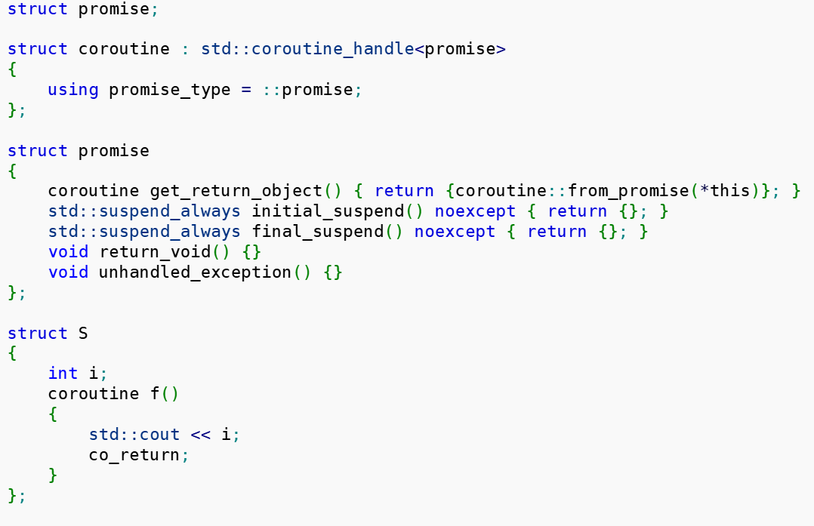

# 项目介绍
Agave(TM) `C++20`标准协程库框架
1. 严格遵循C++20标准，并对其进行了深度设计、封装，性能优良，易用，适用于协程库开发厂商和终端用户使用
2. 设计了通用协程类型返回对象：`AsyncAction`、`AsyncActionWithProgress`、`AsyncOperation`、`AsyncOperationWithProgress`，开发方式合二为一，无论库厂商还是最终用户，使用方式完全相同，并可再次`co_await`等待，轻松构成协程任务链
3. 只使用co_await标准关键字几乎可以完成所有操作，如：进行环境切换、功能设置等等。
    1. `co_await agave::resume_background();`进入后台线程环境
    2. `co_await agave::resume_foreground();`进入前台线程环境
    3. `co_await agave::get_cancellation_token();`获取停止token。
4. 深度整合了`chrono`库，并设计了`BJobScheduler`并行协程调度器，支持便捷语法：`co_await 30ms;`暂停当前协程，并送入调度器待后续唤醒执行。
5. 高度可扩展设计，所有执行环境均可配置，如前台、后台、时间调度等，均可以配置连接自定义的高效线程池
6. 协程返回对象中均配置了`condition variable`对象，包含于`get`方法中，既可以使用异步功能又可兼容经典同步模型使用方法。
7. 支持`progress`自定义进度类型，并通过`co_await`即可获得（内部使用`co_yield`实现，可多次`co_await`）
8. 现有多个基于此框架的商业项目已运行至少 2 年：`DevilStation`、`TeXsh`等，性能稳定
# C++协程的样子
```cpp
RTN_OBJ MyCoroutine()
{
    co_await / co_yield / co_return;
}
```
# 官方示例


# RTN_OBJ中有个promise_type
```cpp
class RTN_OBJ
{
public:
    class promise_type
    {
    public:
        RTN_OBJ get_return_object(){ return {}; }
        std::suspend_never initial_suspend() noexcept { return {}; }
        std::suspend_never final_suspend() noexcept { return {}; }
        void return_void() {}
        //int return_value(int v) { return v; }
        void unhandled_exception() {}
    };
};
RTN_OBJ MyCoroutine()
{
    co_return;
}
int main()
{
    auto promise = new RTN_OBJ::promise_type;
    RTN_OBJ rtn_obj = promise->get_return_object();
    return 0;
}
```
经过promise_type创建。RTN_OBJ的内容与promise绑定。promise的接口函数可以直接操作RTN_OBJ。

RTN_OBJ是实例。
promise_type是在RTN_OBJ中的一个指针。

promise_type是系统控制和协程内部交互的。就像是协程的总经理的地位，可以在`initial_suspend`、`final_suspend`函数体内写明要做的事务。
除了这两个接口，还要实现`return_void`或`return_value`，和`unhandled_exception`。
这样，C++才认为你是一个合格的经理。

总的来说，记住，promise_type用于控制协程内部行为。
```cpp
class promise_type
{
public:
    RTN_OBJ get_return_object()
    {
        auto h = std::coroutine_handle<promise_type>::from_promise(*this);
    }
};
```
比如，可以在promise_type成员函数体中：通过`promise_type`作为模板参数，调用`from_promise(*this)`，获得此协程的内部句柄。
可以通过这个句柄，调用destroy等等，比如用来控制协程帧。[std::coroutine_handle, std::noop_coroutine_handle - cppreference.com](https://en.cppreference.com/w/cpp/coroutine/coroutine_handle.html)
# Awaiter
可以`co_await`的对象。
里面必须有接口：`bool await_ready`、`void await_suspend(coroutine_handle<>)`、`void await_resume()`（最后一个，返回值不一定是void，可以是其他）。

`await_suspend(std::coroutine_handle<> h)`中的h是外部传入的。用于和外界发送信号。
当外界`co_await`此`Awaiter`时，外部h传入，则`await_suspend`函数在执行过程中（比如读取文件完成）可以调用`h.resume`，唤醒外部。
如果`await_suspend`函数中起了一个新线程，那么这个线程可以异步IO（detach）。`await_suspend`可以返回了。
异步线程函数可以择机调用`h.resume`。则该Awaiter此时就要转向执行`await_resume()`，执行完后，外部的`co_await`就完毕，恢复执行下一步。
```cpp
struct Awaiter
{
    constexpr bool await_ready() const noexcept
    {
        return false;
    }
    /* constexpr */ void await_suspend(std::coroutine_handle<> h) const noexcept
    {
        // create a new thread for IO operation...
        std::thread t([h]() -> void)
        {
            // IO operation...
            // h.resume
        });
        t.detach();
        return;
    }
    constexpr int await_resume() const noexcept
    {
        return 100;
    }
};
RTN_OBJ MyCoroutine(void)
{
    std::println("running MyCoroutine...");
    int res = co_await Awaiter{}; // 可以接收await_resume()的返回值。
    co_return;
}
```
实际上，Awaiter，是`ReadFileAsync`这样的异步操作对象的本质。

我们要做的是，怎么包装这样的Awaiter，让用户用起来简单？
## suspend_always / suspend_never
```cpp
_EXPORT_STD struct suspend_never
{
    _NODISCARD constexpr bool await_ready() const noexcept
    {
        return true;
    }
    constexpr void await_suspend(coroutine_handle<>) const noexcept
    {
    }
    constexpr void await_resume() const noexcept
    {
    }
}
```
# 测试
```cpp
#include <iostream>
#include <coroutine>
#include <thread>
#include <chrono>
#include <print>
using namespace std::chrono_literals;
class RTN_OBJ
{
public:
    class promise_type
    {
    public:
        RTN_OBJ get_return_object()
        {
            std::println("get_return_object()...");
            return {};
        }
        std::suspend_never initial_suspend() noexcept
        {
            std::println("initial_suspend()...");
            return {};
        }
        std::suspend_never final_suspend() noexcept
        {
            std::println("final_suspend()...");
            return {};
        }
        void return_void()
        {
            std::println("return_void()...");
        }
        void unhandled_exception()
        {
            std::println("unhandled_exception()...");
        }
    };
};
struct Awaiter
{
    /*constexpr*/ bool await_ready() const noexcept
    {
        std::println("{} {}", std::this_thread::get_id(), "await_ready()...");
        return false;
    }
    // 往往开辟一个新线程，异步进行耗时的IO操作
    // 操作完毕后，调用h的resume
    /*constexpr*/ void await_suspend(std::coroutine_handle<> h) noexcept
    {
        std::println("{} {}", std::this_thread::get_id(), "await_suspend()...");

        std::thread t([h](int &m_res) -> void 
        {
            // IO operation...
            std::println("{} {}", std::this_thread::get_id(), "sleep 5s...");
            std::this_thread::sleep_for(5s);
            m_res = 100;
            std::println("{} {} {}{}", std::this_thread::get_id(), "write m_res", m_res, "...");
        }, std::ref(m_res));
        t.join();
        h.resume();
        return;
    }
    /*constexpr*/ int await_resume() const noexcept
    {
        std::println("{} {}", std::this_thread::get_id(), "await_resume()...");
        return m_res;
    }
    int m_res;
};
RTN_OBJ MyCoroutine()
{
    std::println("{} {}", std::this_thread::get_id(), "Running MyCoroutine...");
    // 进去先看await_ready()是否为true，是true则不会等待。
    // 是false则执行await_suspend()，
    // 执行完await_suspend()后，放弃运行权。交给caller
    // 直到h.resume()。获得执行权后，co_await结束，接着去执行await_resume()
    // 可以接收到await_resume()的返回值。
    auto res = co_await Awaiter{};
    std::println("{} {} {}", std::this_thread::get_id(), "After Awaiter get res:", res);
    co_return;
}

int main()
{
    std::println("{} {}", std::this_thread::get_id(), "Create MyCoroutine");
    // 返回一个RTN_OBJ对象
    auto rtn = MyCoroutine();
    std::println("{} {}", std::this_thread::get_id(), "Finish MyCoroutine");
    return 0;
}
```
我们可以看到，主线程的操作：
1. 调用协程函数，一旦调用了协程函数，就会触发`promise_type`的成员函数，类似于构造的`await_ready()`。然后主线程继续调用协程函数的每一句。
2. 直到遇到了`co_await`，则就掉到了Awaiter对象内部的操作，如`await_ready()`、`await_suspend()`。
3. 新协程（Awaiter）内部，起线程。进行`await_suspend()`的内部操作。
4. 操作完后，主动`h.resume`，回到了主线程。执行`await_resume()`。
5. 之后，回到一开始的协程函数。`co_await`这一行结束。主线程继续执行`co_await`的下面的内容。
6. 主线程执行协程函数中的`co_return`。会触发协程内部`promise_type`的成员函数，`return_void()`，和类似于析构的`final_suspend()`。

```
100592 Create MyCoroutine
get_return_object()...
initial_suspend()...
100592 Running MyCoroutine...
100592 await_ready()...
100592 await_suspend()...
101320 sleep 5s...
101320 write m_res 100...
100592 await_resume()...
100592 After Awaiter get res: 100
return_void()...
final_suspend()...
100592 Finish MyCoroutine

```
# 如何包装简单易用的`Awaiter`
奇技淫巧：重载`operator co_await`。

```cpp
//--------------------------------------------------------------------
//  overload co_await for async action.
//--------------------------------------------------------------------
template <typename P>
inline
agave::details::async_action_t<P>
operator co_await(agave::details::async_action_base_t<P> const& async)
{
    return agave::details::async_action_t<P>{ async };
}


//--------------------------------------------------------------------
//  overload co_await for async operation.
//--------------------------------------------------------------------
template <typename T, typename P>
inline
agave::details::async_operation_t<T, P>
operator co_await(agave::details::async_operation_base_t<T, P> const& async)
{
    return agave::details::async_operation_t<T, P>{ async };
}
```
## AsyncAction / AsyncOperation

```cpp
    //--------------------------------------------------------------------
    //	*** for asynchronous function with no returned value ***
    //--------------------------------------------------------------------
    template <typename Progress = void, typename Action = async_action_t<Progress>>
    class async_action_base_t : public async_progress_base_t<Progress>

    //--------------------------------------------------------------------
    //	implementations for async_action_base_t.
    //--------------------------------------------------------------------
    template <typename Progress = void>
    class async_action_t : public async_action_base_t<Progress, async_action_t<Progress>>
```

```cpp
    //--------------------------------------------------------------------
    //  *** for asynchronous function with returned value of T ***
    //--------------------------------------------------------------------
    template <typename T, typename Progress = void, typename Operation = async_operation_t<T, Progress>>
        requires(!std::is_void_v<T>)
    class async_operation_base_t : public async_progress_base_t<Progress>

    //--------------------------------------------------------------------
    //	implementations for async_operation_base_t.
    //--------------------------------------------------------------------
    template <typename T, typename Progress = void>
    class async_operation_t : 
        public async_operation_base_t<T, Progress, async_operation_t<T, Progress>>
```

```cpp
    //--------------------------------------------------------------------
    //  specializations for async_progress_base_t class.
    //--------------------------------------------------------------------
    template <>
    class async_progress_base_t<void>
    {
    public:
        //

    };
```

类`async_action_t`与`async_operation_t`。内部都定义了`await_ready()`、`await_suspend()`、`await_resume()`。是个Awaiter对象。
## 用户接口
```cpp
    //--------------------------------------------------------------------
    //	*** returned objects for asynchronous functions ***
	//--------------------------------------------------------------------
	using AsyncAction = details::async_action_base_t<>;

    //--------------------------------------------------------------------
    template <typename P>
    using AsyncActionWithProgress = details::async_action_base_t<P>;

    //--------------------------------------------------------------------
    template <typename T>
    using AsyncOperation = details::async_operation_base_t<T>;

    //--------------------------------------------------------------------
	template <typename T, typename P>
	using AsyncOperationWithProgress = details::async_operation_base_t<T, P>;
```

