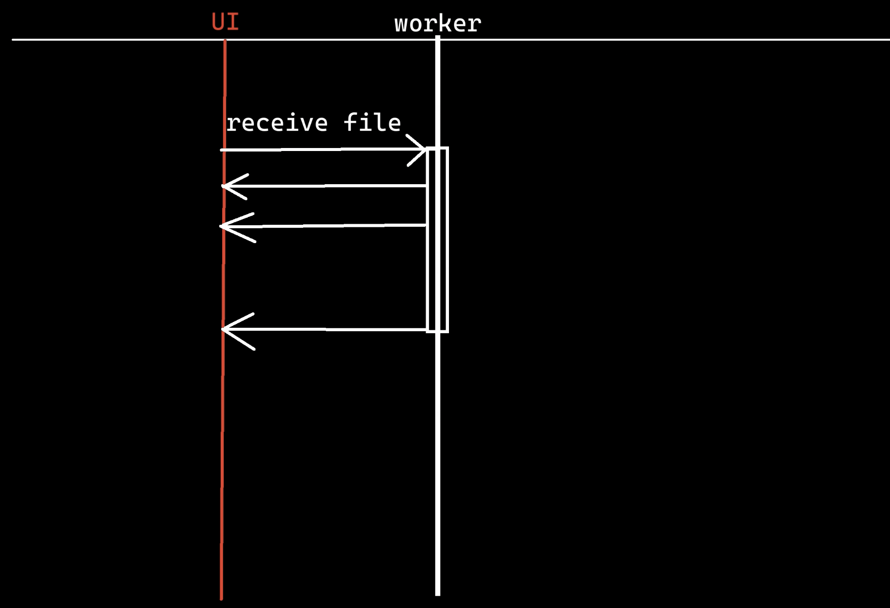

# 以UI线程和工作线程之间的交互为切入点
有两个线程，UI线程和文件下载线程（下面成为称为工作者线程）。UI线程点“接收文件”按钮后启动工作者线程，之后两线程异步执行。假设工作者线程每下载、传输文件的10%都要通知UI线程，以在UI界面进度条显示进度。
由于两线程是异步、无关联的，那么就涉及到工作者线程怎么与UI线程交互的问题。工作者线程不能直接操作UI线程，否则会扰乱UI线程中的部件、内容等，而是要通过发送一个消息，指示UI线程自己去调整。
可以考虑设置一个回调函数。

# 简单示例
```cpp
#include <iostream>
#include <thread>
#include <chrono>
#include <functional>
using namespace std::chrono_literals;
void worker(std::function<void(std::wstring const& str)> callback)
{
    std::wcout << L"doing something in " << std::this_thread::get_id() << std::endl;
    std::this_thread::sleep_for(3s);
    std::wcout << L"call callback!" << std::endl;
    callback(L"worker called");
    std::this_thread::sleep_for(3s);
    std::wcout << L"worker finished!" << std::endl;
}
int main()
{
    std::wcout << L"UI: " << std::this_thread::get_id() << std::endl;
    // 工作者线程
    std::jthread t(&worker, [](std::wstring const& str) -> void
        {
            std::wcout << str << L" in " << std::this_thread::get_id() << std::endl;
        });
}
```
输出：
```
UI: 1452
doing something in 8864
call callback!
worker called in 8864
worker finished!
```
UI线程ID号为1452，工作者线程ID号为8864。
而回调函数是在工作者线程中调用的。
现在我们的需求就是工作者线程要和UI线程产生关联，所以要想办法如何转移线程，让回调函数被UI线程调用。

以上程序：
1. UI线程通过向线程构造函数传参，为worker函数绑定一个回调函数，这个回调函数以lambda表达式定义。
2. worker函数很容易调用参数“callback”。
3. 问题是，worker线程怎么通过“callback”与UI线程交互？
4. 答案就是让它们以消息队列为媒介。worker线程择机（比如每下载10%）把callback和一些实时数据信息打包发到消息队列中，UI线程监听消息队列消息，只要有了，就自己亲自调用一遍worker线程踢回来的callback函数。
5. UI线程为什么不自己早早地亲自调用callback，还要踢皮球？区别是什么呢？是因为worker线程可以夹带实时数据信息。
# 消息循环队列
## 自旋锁版本1
以下是，取一次消息则上一次锁、开一次锁。
```cpp
std::list<std::function<void(void)>> msg_queue;
std::mutex mx;

int main()
{
    std::wcout << L"UI: " << std::this_thread::get_id() << std::endl;
    std::jthread t(&worker, []() -> void
        {
            std::wcout << L"callback" << L" in " << std::this_thread::get_id() << std::endl;
        });
    
    while (true)
    {
        if (mx.try_lock())
        {
            if (msg_queue.size() > 0)
            {
                auto cb = msg_queue.front();
                msg_queue.pop_front();
                cb();  // call back in UI
            }
            mx.unlock();
        }
    }
}
```
## 自旋锁版本2
还有一种效率较高的方法：把消息队列和一个空队列交换，即一次性抽空队列中所有的消息，之后及时加锁，然后就可以放心地去处理消息了。这样避免了频繁加锁。
>以下的机制是自旋锁。
```cpp
int main()
{
    std::wcout << L"UI: " << std::this_thread::get_id() << std::endl;
    std::jthread t(&worker, []() -> void
        {
            std::wcout << L"callback" << L" in " << std::this_thread::get_id() << std::endl;
        });
        
    while (true)
    {
        if (mx.try_lock())
        {
            if (msg_queue.size() > 0)
            {
                std::list<std::function<void(void)>> tmp_msg_queue;
                msg_queue.swap(tmp_msg_queue);
                mx.unlock();
                std::ranges::for_each(tmp_msg_queue, [](auto && cb) -> void
                    {
                        cb();
                    });
            }
            else mx.unlock();
        }
        std::this_thread::sleep_for(10ms);
    }
}
```
怎么让worker踢皮球给UI线程呢？那就是worker线程拿到控制消息队列的锁，然后发送消息和数据到消息队列中。这两个步骤可以集成一个`run_in_main(callback)`函数。
```cpp
void run_in_main(std::function<void(void)> cb);
void worker(std::function<void(void)> callback)
{
    // ...
    run_in_main(callback);
    // ...
}
void run_in_main(std::function<void(void)> cb)
{
    std::unique_lock lck(mx);
    msg_queue.push_back(cb);
}
```
输出：
```
UI: 2060
doing something in 13436
call callback!
callback in 2060
worker finished!
```
发现，现在的回调函数调用者成为了UI线程。
## 条件变量版本
>条件变量控制版本：比自旋锁节省CPU

```cpp
// ...
void run_in_main(std::function<void(void)> cb)
{
    {
        std::unique_lock lck(mx);
        msg_queue.push_back(cb);
    }   
    cv.notify_all();
}
int main()
{
    std::wcout << L"UI: " << std::this_thread::get_id() << std::endl;
    std::jthread t(&worker, []() -> void
        {
            std::wcout << L"callback" << L" in " << std::this_thread::get_id() << std::endl;
        });
    while (true)
    {
        std::unique_lock lck{ mx };
        if (msg_queue.size() > 0)
        {
            std::list<std::function<void(void)>> tmp_msg_queue;
            msg_queue.swap(tmp_msg_queue);
            lck.unlock();
            std::ranges::for_each(tmp_msg_queue,
                [](auto && cb) -> void
                {
                    cb();
                });
        }
        else
        {
            cv.wait(lck);
        }
    }
}
```
测试：以下worker线程模拟向消息队列投放了两次消息。
```cpp
void worker(std::function<void(void)> callback)
{
    std::wcout << L"doing something in " << std::this_thread::get_id() << std::endl;
    std::this_thread::sleep_for(3s);
    std::wcout << L"call callback!" << std::endl;
    run_in_main(callback);
    std::this_thread::sleep_for(3s);
    std::wcout << L"call callback!" << std::endl;
    run_in_main(callback);
    std::this_thread::sleep_for(3s);
    std::wcout << L"worker finished!" << std::endl;
}
```
输出：
```
UI: 5888
doing something in 18988
call callback!
callback in 5888
call callback!
callback in 5888
worker finished!
```
# bind函数绑定
怎么把`有参数的函数`传给`无参数的函数对象`？
```cpp
void bar(int v)
{
    std::cout << v << std::endl;
}
int main()
{
    std::function<void(void)> foo = &bar;  // error
}
```
正确：
```cpp
void bar(int v)
{
    std::wcout << L"bar(int): " << v << std::endl;
}
int main()
{
    std::function<void(void)> foo = std::bind(&bar, 5); // ok
    foo();
}
```
输出：5
## 结合callback
```cpp
void run_in_main(std::function<void(void)> cb);
void bar(int v);

void worker(std::function<void(void)> callback)
{
    // ...
    run_in_main(std::bind(&bar, 555));
    // ...
}
```
输出：
```
UI: 23520
doing something in 4556
call callback!
callback in 23520
bar(int): 555
worker finished!
```
那么，我们可以在main线程创建子线程时，直接给子线程传入一个函数绑定器：
```cpp
int main()
{
    std::jthread t(&worker, std::bind(&bar, 555));
}
```
这样，就不拘泥于worker函数参数callback的`<void(void)>`形式了。
### 完整测试代码
```cpp
#include <functional>
#include<list>
#include<iostream>
#include<mutex>
#include<condition_variable>
#include<thread>
#include<chrono>
#include<algorithm>
using namespace std::chrono_literals;
std::list<std::function<void(void)>> msg_queue;
std::mutex mx;
std::condition_variable cv;
void bar(int v)
{
    std::wcout << L"bar(int): " << v << std::endl;
}
void run_in_main(std::function<void(void)> cb)
{
    {
        std::unique_lock lck(mx);
        msg_queue.push_back(cb);
    }
    cv.notify_all();
}
void worker(std::function<void(void)> callback)
{
    std::wcout << L"doing something in " << std::this_thread::get_id() << std::endl;
    std::this_thread::sleep_for(3s);
    std::wcout << L"call callback!" << std::endl;
    run_in_main(callback);
    std::this_thread::sleep_for(3s);
    std::wcout << L"call callback!" << std::endl;
    run_in_main(callback);
    std::this_thread::sleep_for(3s);
    std::wcout << L"worker finished!" << std::endl;
}
int main()
{
    std::wcout << L"UI: " << std::this_thread::get_id() << std::endl;
    std::jthread t(&worker, std::bind(&bar, 555));
    while (true)
    {
        std::unique_lock lck{ mx };
        if (msg_queue.size() > 0)
        {
            std::list<std::function<void(void)>> tmp_msg_queue;
            msg_queue.swap(tmp_msg_queue);
            lck.unlock();
            std::ranges::for_each(tmp_msg_queue,
                [](auto&& cb) -> void
                {
                    cb();
                });
        }
        else
        {
            cv.wait(lck);
        }
    }
}
```
输出：
```
UI: 82576
doing something in 84588
call callback!
bar(int): 555
call callback!
bar(int): 555
worker finished!
```
