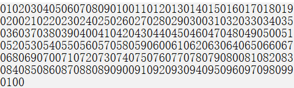

# 内容

1. 打印奇偶数
2. 打印0~100
3. 三线程依次打印A、B、C
# 两线程交替打印奇偶数

```c
#include<thread>
#include<mutex>
#include<condition_variable>
#include<iostream>
std::mutex data_mutex;
std::condition_variable data_cv;
bool oddtag = true;
void printodd()//打印奇数
{
    std::unique_lock<std::mutex> ulock(data_mutex);
    for(int odd = 1; odd <= 100; odd+=2)
    {
        while(oddtag != true)
        {
            data_cv.wait(ulock);
        }
        std::cout << "odd: " << odd << std::endl;
        oddtag = false;
        data_cv.notify_all();
    }
}
void printeven()//打印偶数
{
    std::unique_lock<std::mutex> ulock(data_mutex);
    for(int even = 2; even <= 100; even+=2)
    {
        while(oddtag == true)
        {
            data_cv.wait(ulock);
        }
        std::cout << "even: " << even << std::endl;
        oddtag = true;
        data_cv.notify_all();
    }
}
int main()
{
    std::thread thodd(printodd);
    std::thread theven(printeven);

    thodd.join();
    theven.join();
    return 0;
}
```

# 三线程打印0~100

## 最原始的忙等待版本

```cpp
#include<iostream>
using namespace std;
std::mutex g_mtx;
std::condition_variable cv;
int number = 0;
void fun0()
{
    while(number <= 100)
    {
        while(number%3 == 0 && number <= 100)
        {
            cout << "fun0 : " << number << endl;
            number += 1;
        }
    }
}
void fun1()
{
    while(number <= 100)
    {
        while(number%3 == 1 && number <= 100)
        {
            cout << "fun0 : " << number << endl;
            number += 1;
        }
    }
}
void fun2()
{
    while(number <= 100)
    {
        while(number%3 == 2 && number <= 100)
        {
            cout << "fun0 : " << number << endl;
            number += 1;
        }
    }
}
```

以上虽然也可以达到多线程打印0~100，但是存在忙等待问题。

## 尝试加锁

```cpp
#include<iostream>
std::mutex g_mtx;
std::condition_variable cv;
int number = 0;
void fun0()
{
    unique_lock<std::mutex> locker(g_mtx);
    while(number <= 100)
    {
        while(number%3==0 && number <= 100)
        {
            cout << "fun : 0" << number << endl;
            number += 1;
            cv.notify_one();
        }
        cv.wait(locker);
    }
}
//...
```

但是这里又有问题了，有时候程序可以正常地打印完毕，而有时候则会死在某个位置。

因为`notify_one`有可能没有叫醒那个让程序正常运行下去的线程。

所以需要用到`notify_all()`。

```cpp
#include<iostream>
std::mutex g_mtx;
std::condition_variable cv;
int number = 0;
void fun0()
{
    unique_lock<std::mutex> locker(g_mtx);
    while(number <= 100)
    {
        while(number%3==0 && number <= 100)
        {
            cout << "fun : 0" << number << endl;
            number += 1;
            cv.notify_all();
        }
        cv.wait(locker);
    }
}
//...
```

又有了新问题，为什么程序结束不了了？

最后一个人（其实是线程fun1）把自己wait挂起了，睡在了那里。因为它是最后打印的，wait了。别人都因为while退出了，没人去管他了。

所以需要在fun0或fun2线程退出外层while循环时进行再次notify_all进行解除。

```cpp
#include<iostream>
#include<thread>
#include<mutex>
#include<condition_variable>
using namespace std;
mutex mtx;
condition_variable cv;
int count = 1;

void print_1()
{
    unique_lock<mutex> locker(mtx);
    while(count <= 100)
    {
        while(count%3 == 1 && count <= 100)
        {
            cout << "print_1 : " << count << endl;
            count += 1;
            cv.notify_all();
        }
        cv.wait(locker);
    }
}
void print_2()
{
    unique_lock<mutex> locker(mtx);
    while(count <= 100)
    {
        while(count%3 == 2 && count <= 100)
        {
            cout << "print_2 : " << count << endl;
            count += 1;
            cv.notify_all();
        }
        cv.wait(locker);
    }
}
void print_3()
{
    unique_lock<mutex> locker(mtx);
    while(count <= 100)
    {
        while(count%3 == 0 && count <= 100)
        {
            cout << "print_3 : " << count << endl;
            count += 1;
            cv.notify_all();
        }
        cv.wait(locker);
    }
    cv.notify_all();
}
int main()
{
    thread t1(print_1);
    thread t2(print_2);
    thread t3(print_3);
    t1.join();
    t2.join();
    t3.join();
}
```

## 问题代码 - 未过滤边界, 造成数据溢出

```cpp
#include<iostream>
#include<thread>
#include<mutex>
#include<condition_variable>
using namespace std;
mutex mtx;
condition_variable cv;
int count = 1;

void print_1()
{
    unique_lock<mutex> locker(mtx);
    while(count<= 100)
    {
        while(count%3 != 1)
        {
            cv.wait(locker);
        }
        cout << count << endl;
        ++count;
        cv.notify_all();
    }
}
void print_2()
{
    unique_lock<mutex> locker(mtx);
    while(count<= 100)
    {
        while(count%3 != 2)
        {
            cv.wait(locker);
        }
        cout << count << endl;
        ++count;
        cv.notify_all();
    }
}
void print_3()
{
    unique_lock<mutex> locker(mtx);
    while(count<= 100)
    {
        while(count%3 != 0)
        {
            cv.wait(locker);
        }
        cout << count << endl;
        ++count;
        cv.notify_all();
    }
}
int main()
{
    thread t1(print_1);
    thread t2(print_2);
    thread t3(print_3);
    t1.join();
    t2.join();
    t3.join();
}
```

运行结果是打印`1`到`102`。为什么呢？因为在`while(count%3 != x){cv.wait(locker)}`跳出后没有过滤`count`的大小是否超过了`100`。最外层的`while(count <= 100)`时，`count==99`时，线程1、线程2、线程3都进入其中，线程1顺利执行完毕，线程2、线程3被唤醒后，由于没有判断、过滤`count`的大小是否超过了`100`，则顺利走到下面打印代码部分，相当于漏网之鱼。

## 问题代码 - 某线程退出时未及时更新标识变量导致其他线程阻塞

```cpp
#include<iostream>
#include<thread>
#include<mutex>
#include<condition_variable>
using namespace std;
mutex mtx;
condition_variable cv;
int count = 1;

void print_1()
{
    unique_lock<mutex> locker(mtx);
    while(count<= 100)
    {
        while(count%3 != 1)
        {
            cv.wait(locker);
        }
        if(count <= 100)
        {
            cout << count << endl;
            ++count;
        }
        cv.notify_all();
    }
}
void print_2()
{
    unique_lock<mutex> locker(mtx);
    while(count<= 100)
    {
        while(count%3 != 2)
        {
            cv.wait(locker);
        }
        if(count <= 100)
        {
            cout << count << endl;
            ++count;
        }
        cv.notify_all();
    }
}
void print_3()
{
    unique_lock<mutex> locker(mtx);
    while(count<= 100)
    {
        while(count%3 != 0)
        {
            cv.wait(locker);
        }
        if(count <= 100)
        {
            cout << count << endl;
            ++count;
        }
        cv.notify_all();
    }
}
int main()
{
    thread t1(print_1);
    thread t2(print_2);
    thread t3(print_3);
    t1.join();
    t2.join();
    t3.join();
}
```

这次的打印效果是：`1`到`100`，数目是正确的，不多不少。但是，更尴尬的问题来了，居然在打印100之后阻塞死了！这说明有的线程再也跳不出条件变量上的等待队列了。

关键的解决方法：把每条线程中最后的`++count`语句放到`if(count <= 100)`语句外边。

为什么呢？因为如果`++count`在`if(count <= 100)`才能执行时，就会造成一个问题：线程1判断`count <= 100`通过，可以打印100，之后，`++count`，此时count为101；**此时关键处**：线程2，判断`count <= 100`不通过，那么，`++count`未能执行；这给线程3造成了很大的麻烦：来到了线程3，由于它处在`while(count%3 != x){cv.wait(locker)}`语句中，被线程2唤醒后判断`count%3 == 0`，由于count在上个线程没有更新，所以`count%3 != 0`，这让线程3没能够跳出wait的魔爪。之后，线程1、线程2开心的自己走了，丢下线程3沉睡致死，没人再去唤醒她了......

## 改进版 - 更符合套路的

```cpp
#include<iostream>
#include<thread>
#include<mutex>
#include<condition_variable>
using namespace std;
mutex mtx;
condition_variable cv;
int count = 1;

void print_1()
{
    unique_lock<mutex> locker(mtx);
    while(count<= 100)
    {
        while(count%3 != 1)
        {
            cv.wait(locker);
        }
        if(count <= 100)
        {
            cout << count << endl;
        }
        ++count;
        cv.notify_all();
    }
}
void print_2()
{
    unique_lock<mutex> locker(mtx);
    while(count<= 100)
    {
        while(count%3 != 2)
        {
            cv.wait(locker);
        }
        if(count <= 100)
        {
            cout << count << endl;
        }
        ++count;
        cv.notify_all();
    }
}
void print_3()
{
    unique_lock<mutex> locker(mtx);
    while(count<= 100)
    {
        while(count%3 != 0)
        {
            cv.wait(locker);
        }
        if(count <= 100)
        {
            cout << count << endl;
        }
        ++count;
        cv.notify_all();
    }
}
int main()
{
    thread t1(print_1);
    thread t2(print_2);
    thread t3(print_3);
    t1.join();
    t2.join();
    t3.join();
}
```

# 三线程循环打印若干次ABC

如果不加任何控制，则代码如下

```cpp
#include<iostream>
#include<thread>
#include<mutex>
#include<condition_variable>
using namespace std;
void print_a()
{
    for(int i = 0; i < 10; ++i)
    {
        cout << "A";
    }
}
void print_b()
{
    for(int i = 0; i < 10; ++i)
    {
        cout << "B";
    }
}
void print_c()
{
    for(int i = 0; i < 10; ++i)
    {
        cout << "C";
    }
}
int main()
{
    thread t1(print_a);
    thread t2(print_b);
    thread t3(print_c);
    t1.join();
    t2.join();
    t3.join();
}
```

这样的打印将会错乱无章。

需要加线程控制。

下面来说一种方案 - **互斥量+条件变量+标记**

```cpp
std::mutex mtx;
std::condition_variable cv;
int isReady = 0;	//标记该打印第几个字母了
```

## 常犯的错误

### 没有初始化locker

应在三个函数最开始初始化locker。

```cpp
mutex mtx;
void print_a()
{
    unique_lock<mutex> locker(mtx);	// must have
    for(int i = 0; i<10; ++i)
    {
        ...
    }
}
void print_b()
{
    unique_lock<mutex> locker(mtx);	// must have
    for(int i = 0; i<10; ++i)
    {
        ...
    }
}
void print_c()
{
    unique_lock<mutex> locker(mtx);	// must have
    for(int i = 0; i<10; ++i)
    {
        ...
    }
}
```

### wait外围的条件写的是if而不是while

以`print_a`函数举例。

```cpp
if(isReady%3 != 0)
{
    cv.wait(locker);
}
```

这是错误的，因为一共有三个线程，每次唤醒时，另外两个人不一定谁能抢到锁，如果唤醒后就直接退出wait，则无法保证线程同步。

## 最终正确的代码

```cpp
#include<iostream>
#include<thread>
#include<mutex>
#include<condition_variable>
using namespace std;
mutex mtx;
condition_variable cv;
int isReady = 0;

void print_a()
{
    unique_lock<mutex> locker(mtx);
    for(int i = 0; i < 10; ++i)
    {
        while(isReady != 0)
        {
            cv.wait(locker);
        }
        cout << "A";
        isReady = 1;
        cv.notify_all();
    }
}
void print_b()
{
    unique_lock<mutex> locker(mtx);
    for(int i = 0; i < 10; ++i)
    {
        while(isReady != 1)
        {
            cv.wait(locker);
        }
        cout << "B";
        isReady = 2;
        cv.notify_all();
    }
}
void print_c()
{
    unique_lock<mutex> locker(mtx);
    for(int i = 0; i < 10; ++i)
    {
        while(isReady != 2)
        {
            cv.wait(locker);
        }
        cout << "C";
        isReady = 0;
        cv.notify_all();
    }
}
int main()
{
    thread t1(print_a);
    thread t2(print_b);
    thread t3(print_c);
    t1.join();
    t2.join();
    t3.join();
}
```

另外，还有一个容易出错的地方，必须`notify_all()`，而不能`notify_one()`。因为如果只唤醒1个的话，有可能是A打印完之后唤醒C，这样C线程不符合条件，继续沉睡，而B线程再也没人唤醒它了，之后三人就都沉睡下去了。

# 打印奇偶数进阶版

现有函数`printNumber`可以用一个整数参数调用，并输出该整数到控制台。
例如，调用`printNumber(7)`将会输出`7`到控制台。

给你类`ZeroEvenOdd`的一个实例，该类中有三个函数：`zero`、`even`和`odd`。`ZeroEvenOdd`的相同实例将会传递给三个不同线程：

线程`A`：调用`zero()`，只输出`0`
线程`B`：调用`even()`，只输出偶数
线程`C`：调用`odd()`，只输出奇数
修改给出的类，以输出序列`010203040506070809010011012...`，其中总共打印的数字数目必须为`2n`。

实现`ZeroEvenOdd`类：

`ZeroEvenOdd(int n)`用数字`n`初始化对象，表示需要输出的数。
`void zero(printNumber)`调用`printNumber`以输出一个`0`。
`void even(printNumber)`调用`printNumber`以输出偶数。
`void odd(printNumber)`调用`printNumber`以输出奇数。

示例1：
```
输入：n = 2
输出："0102"
解释：三条线程异步执行，其中一个调用 zero()，另一个线程调用 even()，最后一个线程调用odd()。正确的输出为 "0102"。
```

示例 2：
```
输入：n = 5
输出："0102030405"
```

提示：`1 <= n <= 1000`

## Leet-code AC版代码

```cpp
class ZeroEvenOdd {
private:
    int n;
    mutex mtx;
    condition_variable cv;
    int num = 1;
    bool flag = true;
public:
    ZeroEvenOdd(int n) {
        this->n = n;
    }

    // printNumber(x) outputs "x", where x is an integer.
    void zero(function<void(int)> printNumber)
    {
        unique_lock<mutex> locker(mtx);
        while(num <= n)
        {
            while(flag != true)
            {
                cv.wait(locker);
            }
            if(num <= n)
            {
                printNumber(0);
            }
            flag = false;
            cv.notify_all();
        }
    }
    // 偶数
    void even(function<void(int)> printNumber)
    {
        unique_lock<mutex> locker(mtx);
        while(num <= n)
        {
            while(flag == true || num%2 != 0)
            {
                cv.wait(locker);
            }
            if(num <= n)
            {
                printNumber(num);
            }
            ++num;
            flag = true;
            cv.notify_all();
        }
    }
    // 奇数
    void odd(function<void(int)> printNumber)
    {
        unique_lock<mutex> locker(mtx);
        while(num <= n)
        {
            while(flag == true || num%2 != 1)
            {
                cv.wait(locker);
            }
            if(num <= n)
            {
                printNumber(num);
            }
            ++num;
            flag = true;
            cv.notify_all();
        }
    }
};
```

## 自测试版代码

```cpp
#include<thread>
#include<mutex>
#include<condition_variable>
#include<functional>
#include<iostream>
using namespace std;
int n = 100;
mutex mtx;
condition_variable cv;
int num = 1;
bool flag = true;

void zero()
{
    unique_lock<mutex> locker(mtx);
    while (num <= n)
    {
        while (flag != true)
        {
            cv.wait(locker);
        }
        if (num <= n)
        {
            cout << 0;
        }
        flag = false;
        cv.notify_all();
    }
}
// 偶数
void even()
{
    unique_lock<mutex> locker(mtx);
    while (num <= n)
    {
        while (flag == true || num % 2 != 0)
        {
            cv.wait(locker);
        }
        if (num <= n)
        {
            cout << num;
        }
        ++num;
        flag = true;
        cv.notify_all();
    }
}
// 奇数
void odd()
{
    unique_lock<mutex> locker(mtx);
    while (num <= n)
    {
        while (flag == true || num % 2 != 1)
        {
            cv.wait(locker);
        }
        if (num <= n)
        {
            cout << num;
        }
        ++num;
        flag = true;
        cv.notify_all();
    }
}
int main()
{
    thread t0(zero);
    thread t1(odd);
    thread t2(even);

    t0.join();
    t1.join();
    t2.join();
}
```

结果



