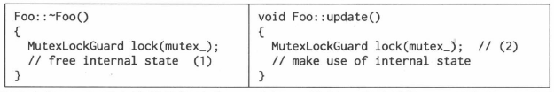
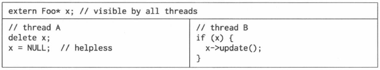

# 内容

1. 线程安全的定义
2. 对象的创建
3. 对象的销毁
4. 线程安全的Observer
5. 解决方案
6. 陷阱
# 线程安全的定义

依据`[JCP]`，一个线程安全的class应当满足以下三个条件：

* 多个线程同时访问时，其表现出正确的行为。
* 无论操作系统如何调度这些线程，无论这些线程的执行顺序如何交织。
* 调用端代码无须额外的同步或其他协调动作。

依据这个定义，C++标准库里的大多数class都不是线程安全的，包括`std::string`、`std::vector`、`std::map`等。这些class通常需要在外部加锁才能供多个线程同时访问。

## 以Counter为例说明问题

```cpp
class Counter : boost::nocopyable
{
public:
    Counter() : value_(0)
    {}
    int64_t value() const;
    int64_t getAndIncrease();
private:
    int64_t value_;
    mutable MutexLock mutex_;
    
};
int64_t Counter::value() const
{
    MutexLockGuard lock(mutex_);
    int64_t ret = value_++;
    return ret;
}
```

这个class很直白，一看就明白，也容易验证它是线程安全的。每个Counter对象有自己的`mutex_`，因此不同对象之间不构成**锁争用(lock contention)**。如果是同一个Counter对象则不可同时访问`value_++`。

注意到，其`mutex_`成员是`mutable`的，意味着`const`成员函数如`Counter::value()`也能直接使用`non-const`的`mutex_`。

尽管这个`Counter`毫无疑问是线程安全的，但是如果`Counter`是动态创建的，并通过指针来访问，则对象销毁的**竞态条件(race condition)**仍然存在。

### 当析构函数遇到多线程

与其他面向对象语言不同，Cpp要求程序员自己管理对象的生命期，这在多线程环境下显得尤为困难。

**当一个对象能被多个线程同时看到时，那么对象的销毁时机就变得模糊不清，可能出现多种竞态条件**。

* 在即将析构一个对象时，从何而知此刻是否有别的线程正在执行该对象的成员函数？
* 如何保证在执行成员函数期间，对象不会在另一个线程被析构？
* 在调用某个对象的成员函数之前，如何得知这个对象还活着？它的析构函数会不会碰巧执行到一半？

这些竞态条件问题是C++多线程编程面临的基本问题。

# 对象的创建

对象构造要做到线程安全，唯一的要求是在构造期间不要给其他对象泄露this指针（其自身创建的子对象除外）。即：

* 不要在构造函数中注册任何回调；
* 不要在构造函数中把this传给跨线程的对象；
* 即便在构造函数的最后一行也不行。

之所以这样规定，是因为在构造函数执行期间，对象还没有完成初始化工作，如果这时this泄露给了其他对象（其自身创建的子对象除外），那么别的线程有可能访问这个半成品对象，这会造成难以预料的后果。

```cpp
#include <algorithm>
#include <vector>
#include <stdio.h>

class Observable;

class Observer
{
 public:
  virtual ~Observer();
  virtual void update() = 0;

  void observe(Observable* s);

 protected:
  Observable* subject_;
};

class Observable
{
 public:
  void register_(Observer* x);
  void unregister(Observer* x);

  void notifyObservers()
  {
    for (size_t i = 0; i < observers_.size(); ++i)
    {
      Observer* x = observers_[i];
      if (x) {
        x->update(); // (3)
      }
    }
  }

 private:
  std::vector<Observer*> observers_;
};

Observer::~Observer()
{
  subject_->unregister(this);
}

void Observer::observe(Observable* s)
{
  s->register_(this);
  subject_ = s;
}

void Observable::register_(Observer* x)
{
  observers_.push_back(x);
}

void Observable::unregister(Observer* x)
{
  std::vector<Observer*>::iterator it = std::find(observers_.begin(), observers_.end(), x);
  if (it != observers_.end())
  {
    std::swap(*it, observers_.back());
    observers_.pop_back();
  }
}
```

```cpp
/* 错误 */
class Foo : public Observer
{
public:
    Foo(Observer * s)
    {
        s->register_(this);
    }
    virtual void update();
};
```

```cpp
/* 正确 */
class Foo : public Observer
{
public:
    Foo();
    virtual void update();
    void observe(Observer * s)
    {
        s->register_(this);
    }
};
Foo* pFoo = new Foo;
Observer * s = getSubject();
pFoo->observer(s);	//二段式构造，或者直接写s->register_(pFoo);
```

二段式构造——即构造函数+initialize()——有时会是好办法，这虽然不符合C++教条，但是多线程下别无选择。

另外，既然允许二段式构造，那么构造函数不必主动抛异常，调用方靠initialize()的返回值来判断对象是否构造成功，这能简化错误处理。

即使是构造函数的最后一行，也不要泄露this指针，因为Foo有可能是个基类，基类先于派生类构造，执行完`Foo::Foo()`的最后一行代码还会继续执行派生类的构造函数，这时`most-derived class`的对象还处于构造中，仍然不安全。

# 对象的销毁

对象的析构，在单线程里不构成问题，最多需要注意避免空悬指针和野指针。

而在多线程程序中，存在了太多的竞态条件。对**一般成员函数**而言，做到线程安全的办法是让它们顺次执行，而不要并发执行（关键是不要同时读写共享状态），也就是让每个成员函数的临界区不重叠。这是显而易见的，不过有一个隐含条件或许不是每个人都能立刻想到：成员函数用来保护临界区的**互斥器本身必须是有效的。而析构函数破坏了这一假设，它会把mutex成员变量销毁掉**。悲剧啊！

* mutex不是办法。

mutex只能保证函数一个接一个地执行，考虑下面两个代码（并行），它试图用互斥锁来保护析构函数：



此时，有A、B两个线程都能看到Foo对象x，线程A即将销毁x，而线程B正准备调用`x->update()`。



尽管线程A在销毁对象之后把指针置为了`NULL`，尽管线程B在调用x的成员函数之前检查了指针x的值，但还是无法避免一种竞态条件：

1. 线程A执行到了析构函数的`(1)`处，已经持有了互斥锁，即将继续往下执行。
2. 线程B通过了`if(x)`检测，阻塞在`(2)`处。

接下来会发生什么，只有天晓得。因为析构函数会把`mutex_`销毁，那么`(2)`处有可能永远阻塞下去，有可能进入“临界区”，然后`core dump`，或者发生其他更糟糕的情况。

这个例子至少说明`delete`对象之后把指针置为`NULL`根本没用，如果一个程序要靠这个来防止二次释放，说明代码逻辑出了问题。

* 作为数据成员的mutex不能保护析构

前面的例子说明，作为class数据成员的`MutexLock`只能用于同步本class的其他数据成员的读和写，它不能保护安全地析构。因为`MutexLock`成员的生命期最多与对象一样长，而析构动作可说是发生在对象死亡之后（或者说死亡之时）。另外，对于基类对象，调用到基类析构函数的时候，派生类对象的那部分已经析构完毕了，那么基类对象拥有的`MutexLock`不能保护整个析构过程。

其实，析构过程本来也不需要保护，因为只有别的线程都访问不到这个对象时，析构才是安全的，否则会有竞态条件发生。

## 死锁

如果要同时读写一个class的两个对象，有潜在的死锁可能。比方说有`swap()`这个函数。

```cpp
void swap(Counter & a, Counter & b)
{
    MutexLockGuard aLock(a.mutex_);
    MutexLockGuard bLock(b.mutex_);
    int64_t value = a.value_;
    a.value_ = b.value_;
    b.value_ = value;
}
```

如果线程A执行`swap(a, b);`而同时线程B执行`swap(b, a);`，就有可能死锁。`operator=()`也是类似的道理。

```cpp
Counter& Counter::operator=(const Counter& rhs)
{
    if(this == &rhs)return *this;
    MutexLockGuard myLock(mutex_);
    MutexLockGuard itsLock(rhs.mutex_);
    /* 不要写成 value_ = rhs.value()，会死锁； 
     * rhs.value() --> 
     *		MutexLockGuard lock(mutex_);
     *		int64_t ret = value_++;
     *		return ret;
     */
    value_ = rhs.value_;
    return *this;
}
```

一个函数如果要锁住相同类型的多个对象，为了保证始终按相同的顺序加锁，我们可以比较mutex对象的地址，始终先加锁地址较小的mutex。？？？

# 线程安全的Observer

一个动态创建的对象是否还活着，光看指针（或引用）看不出来。指针就是指向了一块内存，这块内存上的对象如果已经销毁，那么根本就不能访问（就像`free(3)`之后的地址不能访问一样），既然不能访问又如何知道对象的状态？换句话说，**没有高效的办法判断一个指针是否是合法指针，这是C/C++指针问题的根源**。（万一原址又创建了一个新的对象呢？再万一这个新的对象的类型异于老的对象呢？）

## 对象之间关系的三种主要类型

`composition`（组合/复合）、`aggregation`（聚合）、`association`（关联）。

* 组合关系

组合关系在多线程里不会遇到什么麻烦，因为对象x的生命期由其唯一的拥有者owner控制，owner析构的时候会把x也析构掉。从形式上看，x是owner的直接数据成员，或者`scoped_ptr/unique_ptr`成员，抑或owner持有的容器的元素。

后两种关系在C++里比较难办，处理不好就会造成内存泄露或者重复释放。

* 关联关系

关联是一种很宽泛的关系，它表示一个对象a用到了另一个对象b，调用了后者的成员函数。从代码形式上看，**a持有b的指针或引用，但是b的生命期不由a单独控制**。

* 聚合关系

聚合关系从形式上看与关联关系相同，除了a和b有逻辑上的整体与部分的关系。如果b是动态创建的并在整个程序结束前有可能被释放，那么就会出现前文提到的竞态条件。

## 如何避免访问失效对象

似乎有一个简单的解决方法：只创建不销毁。程序使用一个对象池来暂存用过的对象，下次申请新对象时，如果对象池里有存货就拿一个利用，否则就新建一个；对象用完之后不是直接释放掉而是放回池子里。这个办法虽然有很多缺点，但是却能避免访问失效对象的情况发生。

缺点和问题：

* 对象池的线程安全，如何安全地、完整地把对象放回池子里，防止出现“部分放回”的竞态？（线程A任务对象x已经放回了，而线程B以为对象x还活着。）
* 全局共享数据引发的lock contention，这个集中化的对象池可能会把多线程并发操作退化为串行。
* 如果共享对象的类型不止一种，那么是重复实现对象池还是使用类模板呢？
* 会不会造成内存泄漏与分片？因为对象池占用的内存只增不减，而且多个对象池不能共享内存。

## Observer模式

回到正题上来，如果对象x注册了任何非静态成员函数回调，那么必然在某处持有了指向x的指针，这就暴露在了竞态条件下。

一个典型的场景是Observer模式。

```cpp
/* 观察者 */
class Observer //: boost::noncopyable
{
public:
    virtual ~Observer();
    virtual void update() = 0;
    /* ... */
};
/* 观察目标 */
class Observable //: boost::noncopyable
{
public:
    void register_(Observer * x);	//因为和关键字冲突了，所以加个_
    void unregister(Observer * x);
    void notifyObservers()
    {
        for(Observer * x : observers_)
        {
            x->update();
        }
    }
private:
    std::vector<Observer*> observers_;
}
```

当Observable通知每一个Observer时（`x->update();`），它从何得知Observer对象x还活着？要不试试在Observer的析构函数里调用`unregister()`来解注册？恐难奏效。

```cpp
class Observer //: boost::noncopyable
{
public:
    // 同前
    void observe(Observable * s)
    {
        s->register_(this);
        subject_ = s;
    }
    virtual ~Observer()
    {
        subject_->unregister(this);
    }
    Observable* subject_;
    /* ... */
};
```

我们试着让Observer的析构函数去调用`unregister(this)`，这里有两个竞态条件。其一：`subject_->unregister(this)`中如何得知`subject_`还活着？其二：就算`subject_`指向某个永久存在的对象，那么还是险象环生：

1. 线程A执行到`subject_->unregister(this)`之前，还没有来得及`unregister`本对象。
2. 线程B执行到`x->update();`，x正好指向是`subject_->unregister(this)`正在析构的对象。

这时悲剧又发生了，既然x所指的Observer对象正在析构，调用它的任何非静态成员函数都是不安全的，何况是虚函数（C++标准对在构造函数和析构函数中调用虚函数的行为有明确规定，但是没有考虑并发调用的情况。）。更糟糕的是，Observer是个基类，执行到`subject_->unregister(this)`时，派生类对象已经析构掉了，这时候整个对象处于将死未死的状态，`core dump`恐怕是最幸运的结果。

这些竞态条件似乎可以通过加锁来解决，但在哪儿加锁？谁持有这些互斥锁？似乎不是那么显而易见。要是有一个活着的对象能帮帮我们就好了，这个对象需要提供一个`isAlive()`之类的程序函数，告诉我们某个对象还在不在。可惜指针和引用都不是对象，它们是内建类型。（这时候就要引出来智能指针了）

## 不要使用原始指针

指向对象的原始指针(raw pointer)是坏的，尤其当暴露给别的线程时。Observable应当保存的不是原始的`Observer*`，而是一个能够分辨Observer对象是否存活的东西。类似地，如果Observer要在析构函数里解注册（这虽然不能解决前面提到的竞态条件，但是在析构函数中打扫战场还是应该的），那么`subject_`的类型也不能是原始的`Observable*`（因为解注册用到了`Obervable`，它的`unregister`成员函数）。

可以**使用引用计数型智能指针**，即`shared_ptr`。用一层间接性（二级指针）保证了避免释放空悬指针，也通过引用计数解决了释放对象期间的竞态条件问题。

## 一个万能的解决方案

引如另外一层间接性，用对象来管理共享资源，亦即`handle/body`惯用技法。用标准库中的一对“神兵利器”可助我们完美解决原始指针的问题。

即`share_ptr`+`weak_ptr`。

* `shared_ptr`控制对象的生命期。
  * `shared_ptr`是强引用(想象成用铁丝绑住堆上的对象)，只要有一个指向x对象的`shared_ptr`存在，该x对象就不会析构。
  * 当指向对象x的最后一个`shared_ptr`析构或`reset()`的时候，x保证会被销毁。
* `weak_ptr`不控制对象的生命期，但是它知道对象是否还活着(想象成用棉线轻轻拴住堆上的对象)。
  * 如果对象还活着,那么它可以提升为有效的`shared_ptr`；
  * 如果对象已经死了，提升会失败，返回一个空的`shared_ptr`。提升`lock()`行为是线程安全的。
* `shared_ptr`/`weak_ptr`的“计数”在主流平台上是原子操作，没有用锁，性能不俗。
* `shared_ptr`/`weak_ptr`的线程安全级别与`std::string`和STL容器一样。

孟岩在《垃圾收集机制批判》中一针见血地点出智能指针的优势：“C++利用智能指针达成的效果是：一旦某对象不再被引用，系统刻不容缓，立刻回收内存。这通常发生在关键任务完成后的清理时期，不会影响关键任务的实时性，同时，内存里所有的对象都是有用的，绝对没有垃圾空占内存。”

# C++的内存问题很容易解决

C++里可能出现的内存问题大致有这么几个方面：

1. 缓冲区溢出(buffer overrun)
2. 空悬指针/野指针
3. 重复释放(double delete)
4. 内存泄漏(memory leak)
5. 不配对的`new[]/delete`
6. 内存碎片(memory fragmentation)

在这几种错误里边，内存泄漏的危害相对较小，因为它只是借了东西不还，程序功能在一段时间内还算正常；而其他如缓冲区溢出或重复释放等致命错误可能会造成安全性(security和data safety)方面的严重后果。

正确使用智能指针能很轻易地解决前面5个问题。解决第6个问题——内存碎片需要别的思路。

* 缓冲区溢出
  * 用`std::vector<char>/std::string`或自己编写`Buffer class`来管理缓冲区，自动记住用缓冲区的长度，并通过成员函数而不是裸指针来修改缓冲区。
* 空悬指针/野指针
  * 用`shared_ptr/weak_ptr`
* 重复释放
  * 用`scoped_ptr`，只在对象析构的时候释放一次。
* 内存泄漏
  * 用`scoped_ptr`，对象析构的时候自动释放内存。
* 不配对的`new[]/delete`
  * 把`new[]`统统替换为`std::vector/scoped_array`。

注意：`scoped_ptr`、`shared_ptr`、`weak_ptr`都是值语义。要么是栈上对象，或是其他对象的直接数据成员，或是标准库容器里的元素，即不会出现下面这种形式：`shared_ptr<Foo>* pFoo = new shared_ptr<Foo>(new Foo);`

现代的C++程序中一般不要出现delete语句，资源（包括复杂对象本身）都要通过对象（智能指针或容器）来管理，不要让程序员还要为此操心。

# 应用到Observer上

Observer模式的竞态条件的核心问题是被观察者如何探查观察者的生死，可以通过`weak_ptr`解决，只要让`Observable`保存`weak_ptr<Observer>`即可。

```cpp
class Observable
{
public:
    void register_(weak_ptr<Observer x);	//参数类型可用const weak_ptr<Observer>&
    // void unregister(weak_ptr<Observer> x);	//不需要了，已经有下边的代码帮我们解决把失效观察者从observers_中删除了。相应地，Observer的析构函数也不用调用Observable的unregister了。
    void notifyObservers();
private:
    mutable MutexLock mutex_;
    std::vector<weak_ptr<Observer>> observers_;
    using Iterator = std::vector<weak_ptr<Observer>>::iterator;
};
void Observable::notifyObservers()
{
    MutexLockGuard lock(mutex_);
    Iterator it = observers_.begin();
    while(it != observers_.end())
    {
        shared_ptr<Observer> obj(it->lock());	//weak_ptr的lock函数，尝试提升为shared_ptr，这一步是线程安全的。
        if(obj)
        {
            obj->update();	//没有竞态条件，因为obj在栈上，对象不可能在本作用域内销毁。
            ++it;
        }
        else
        {
            // 观察者对象已经销毁，从容器中删除weak_ptr，即做了unregister的工作。
            it = observers_.erase(it);
        }
    }
}
```

经过把`Observer*`替换为`weak_ptr<Observer>`，部分解决了`Observer`模式的线程安全问题，但还有以下疑点。

* 侵入性
  * 强制要求`Observer`必须以`shared_ptr`来管理
* 不是完全线程安全
* 锁争用(lock contention)
  * 即`Observable`的三个成员函数都用了互斥器来同步，这会造成`register_`
