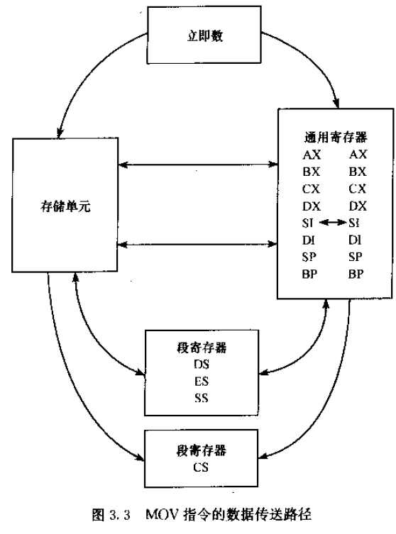

# 二进制转化为十进制

https://blog.csdn.net/weixin_42857472/article/details/103966229

## 除10取余法

设计程序时候的二进制转化为十进制的算法
二进制转化为十进制（除10取余法）

除10取余法中，对于二进制转化为10进制来讲要除于1010，就是把10转化为二进制数，再用二进制数除于1010

例如：二进制11101除于1010，余数1001，转化为十进制数为9，这个是相当于十进制数的个位，再用中间商0010再除于1010，余数为0010，转化为十进制数为2，相当于十进制数的十位。


## 比较法

假如一个数393
最高位为百位，所以让393和100比较
如果393>=100
则393减去100，然后统计百位的数＋1，然后用结果差继续和100比较，也就是293和100比较，仍然大于，所以293再减去100，统计一百的数再+1，直到不大于一百了，说明这个数没有百位只有十位和个位了，所以和10比较，类似的减去10，然后统计十位的数+1，再继续比较，知道不大于十，那么剩下的就是个位的数了。

二进制转化为十进制的话比较的对象100就要化成二进制，即1100100
十的二进制就是1010。

比如(11101)2-->(29)10：11101>1010，十位+1；11101-1010=10011>1010，十位+1；10011-1010=1001<1010，十位结束，(1001)2=(9)10。则结果为(29)10。

# 8位寄存器

以8086为例，虽然8086是16位处理器，但也可以以8位方式存储数据到寄存器中。

8位寄存器有：AH、AL。H代表高八位，L代表低八位，AH与AL一起组成AX寄存器即16位寄存器。相应地，BH、BL；CH、CL；DH、DL，也是8位寄存器。BX、CX、DX是16位寄存器。

# 二进制数的运算

## 算术运算+、-、*、/

比如97+89

```x86asm
mov AL,97	;汇编后:B0 61	;B0h就表示“把一个字节数传送给AL寄存器中”的机器源代码，61h代表97的十六进制。
add AL,89	;(AL)=BAh	;带括号就表示括号中地址的内容，此处表示AL寄存器的内容
```


mov AL,97 <---> B0 61    ;B0h就表示“把一个字节数传送给AL寄存器中”的机器源代码，61h代表97的十六进制。


# 处理器状态字寄存器PSW

也称为标志寄存器，主要用于CPU运算后根据结果设置各个标志，一个标志一个状态，一个状态用一个bit位表示。

# 补码

补码的范围有一个疑惑点。假如一个8位补码，可以表示的范围是-128~+127，如果只是按照老师上课讲的“取反加一法”来看，就会不清楚-128这个数是怎么来的。因为带符号位（带符号位这种说法是有误的，下面会提到）的8位二进制码的绝对值最大是127。

这时，我们要深刻地纠正我们对补码概念的误区。

补码的范围https://www.zhihu.com/question/20458542/answer/40759880
补码的定义https://blog.csdn.net/xiang_shao344/article/details/118490004

第一步，就像练北冥神功要先散功一样，先把你心中对原码，反码，补码的一套认识全部忘掉。

第二步，正式开讲	

首先灌输一个新的概念叫，**模**
什么是“模”，想象日常使用的钟表，它可以显示0～12点的时间，假设现在是2点钟，请用手动拨动时针的方式将时间减4小时，你会怎么做？
有两种方式：

1. 逆时针将时针拨4小时
2. 顺时针将时针拨8（12-4）小时

这里要讲的是第二种方式，为什么顺时针拨12-4也可以达到和正常思维的第一种方式一样的位置。
12就是模。
同样的，如果是十进制的两位数，80-10 和 80＋90在不考虑百位数的基础上都是70。这里的90就是100-10得来的，这种情况下100就是模
模就好比是一个极限，在它的范围内，两个相加等于模的数互为补数，还是举100的例子
90和10， 55和45，68和32，互为补数
在模的范围内做减法，可以将“X－Y”的减法变更为“X＋Y的补数“的加法，当然前提是不考虑百位数。

**思考题**，*上面举的例子是大数减小数，那么如果是小数减大数会怎么样呢？*

如果是10-80，结果应该是－70，但如果按照10+（100-80），结果是30。
而很明显－70和30不是一回事，这里也没有百位数的问题，这种情况应该怎么破？
当初的那些先贤们想出来的办法很简单，就是把这两个数直接划上等号，正好顺便解决了负数的表达方式。再来仔细看看这两个数的关系：－70绝对值的补数就正好是30
所以在计算机中，**负数的表达方式就是它绝对值的补数**
但是问题又来了，看起来这个解决方式很完美了，但别忘了，30他已经代表了正数的30了，现在又要用来代表负数的－70，谁知道它出现的时候到底是代表哪个数？
为了解决这个问题，需要给这套规则划定一个范围，原来是0～99的正数，现在既然要用部分正数来代替负数了，那就要规定一个范围来使得一个数只代表一个含义，正好一人一半，0～49这个区间就代表正数，50～99的区间就用来代表各自补数的负值，例：98就代表－2

第三步，现在回到二进制的计算机世界

8位二进制数一共可以表示2的8次方，256个数，即0～255 （别忘了0也要占一位的），他们的极限就是256，即256是8位二进制数的模 ，应该不难理解吧，同上十进制的两位数0～99的模是100。
还是用二进制来说明清楚，8位二进制能表示的数的极限是
1 1 1 1 1 1 1 1， 就是255，在这基础上加0 0 0 0 0 0 0 1，出现了进一位 即 1 0 0 0 0 0 0 0 0
这个1 0 0 0 0 0 0 0 0就是8位二进制数的模，256

同样按照第二步讲的逻辑，一半的数0～127，代表其正数本身，另一半的数 128～255，代表其补数的负值，即“－1～－128”的区间。
而 “X－Y”的减法 就用 “X＋Y的补数” 的加法来表示，完美！ 唯一需要注意的事情是任何计算的输入值和输出结果值都需要严格遵守－128～127的范围，一旦溢出就会报错。
这也就是我们在编程里强调的为什么 byte＋byte还得是byte，int＋int还得是int，数据溢出问题也是每一个程序员都需要注意的问题。

这样一说是不是可以理解－128的补码是怎么来的了吧？ 他就是256 - |-128|＝128
二进制的128是不是就是1 0 0 0 0 0 0 0 ？

最终问题，那书和老师为什么要用原码，反码来讲补码 ？

空穴来风，未必无因
那是因为计算机就是这样求负数的补码的，我们在键盘上敲一个负数的时候，计算机要把它用补码的形式存储下来，还记得上面我们讲的补码是怎么来的吗？
模－绝对值，这是不是个减法公式？但计算机没有减法逻辑，我们费了那么大的劲搞了一套补码的规则就是为了用加法来替代减法，但为了实现这么套规则，却跨不过一个坎，就是把负数计算成补码仍然是需要减法逻辑的。怎么办呢，那些伟大的先贤们 （膜拜）就想出了这么个办法：
首位不变，其余位取反后，再加一

问题：上面说到了，负数计算成补码需要取反加1，但-128在8位数中，没有其原码表示形式，如果要人工手工计算，将-128先看做是9位带符号数，再转换为补码：1 1000 0000首位不变，其余取反加1会变成1 1000 0000，进位溢出舍去，即为1000 0000。

下面是吐槽

不知道是哪个书呆子教书，照搬了机器的逻辑，把取反加一的方法当做补码的计算逻辑就这么教下来了。搞笑的是，还保留了补码这个名字，照理说这种教法应该叫 取反加一码 更合理，你还补什么啊？
不仅如此，还搞出了个首位符号位的说法，弄出了个正0负0，还用负0来充当－128，真是不把人弄疯不罢休啊！！

# 寄存器

## 通用寄存器

### 数据寄存器

#### AX

累加

#### BX

基址寄存器

#### CX

计数器

#### DX

数据寄存器。在I/O端口的IN/OUT操作中充当I/O地址寄存器。

### 地址指针与变址寄存器

#### 地址指针寄存器

##### SP

堆栈指针寄存器--用来指示PUSH/POP堆栈操作时所操作单元的段内16位地址的寄存器。

##### BP

地址指针寄存器--作用和BX基址寄存器是一样的，都可以存放16位段内偏移地址，但是是有区别的，存放16位段内偏移地址不在同一个逻辑段，CPU默认BX在DS数据段，BP在SS堆栈段。CPU默认BP指向的是SS段的地址。
当然，想要BP指向数据段也可以，必须在汇编语句中写明前缀，称之为**段超越前缀**，如：

```X86ASM
MOV AL,56H
MOV BP,0003H
MOV DS:[BP],AL
```

#### 变址寄存器

##### SI

源变址寄存器

##### DI

目的变址寄存器


#### 总结

用BX/SI/DI外加中括号即间接找到的地址都默认在DS段内。只用BP中括号间接找到的地址默认在SS段内。


## 段寄存器

分别放的是各自逻辑段的段地址

### CS

代码段寄存器。CS的值指明的是，程序代码所在的那个逻辑段的段地址。

CS初始化的值用户不可设置，由操作系统决定。

### DS

数据段寄存器

### ES

附加数据段寄存器

### SS

堆栈段寄存器

## 控制寄存器

### IP

指令指针寄存器。等效于一般处理器中程序计数器PC的作用。即用于CPU取指令时需要用到的偏移地址寄存器。与CS（代码段）不可分家，CS:IP。

### PSW

处理器状态字寄存器。16位寄存器，但有用的只有9位。


9位分为两类标志。

#### 状态标志（6个）

ZF、CF、PF、OF、SF、AF。反映的是ALU运算后结果的状态。

只有运算指令执行后才会影响这些状态值的改变。

#### 控制标志（3个）

IF、PF、TF。用来控制CPU的运行状态的。

##### DF

方向控制标志。用于控制字符串操作中SI和DI变址的方向。

```X86ASM
CLD	;DF=0;控制SI/DI加1或2
STD	;DF=1;控制SI/DI减1或2
```


##### IF

中断允许标志。

执行用户程序期间，某个特殊事件发生，让CPU暂时停止正在执行的程序，转去为该事件服务，即去执行中断服务子程序。服务完成后，CPU尚可返回到刚才中止的位置继续执行。

CLI会置0，STL会置1。

如果IF为0，则会屏蔽外部中断请求（8086的18脚INTR输入）。但CPU芯片内部中断不可屏蔽。

##### TF

陷阱（单步）标志。Debug专用。

没有清零置一的指令。那该如何设计程序使TF置1？


以上程序：先PUSHF（F即PSW），再POP给AX赋值；再OR把AX中第九位置1；将AX压栈，在POPF给PSW赋值。

TF在PSW寄存器的第九位（如果从0开始，是第8位），我们知道，OR语句可以让数据置1，则让PSW或上0000 0001 0000 0000即可使TF置1。

如果TF标志为1，则程序将进行单步操作。常用于Debug调试。

# 8086存储器和I/O组织

## 存储器地址空间与数据存放格式

### 地址空间

A_19\~A_16/A_15\~A_10/A_9\~A_0：均为外部存储器编址。所以能寻址的空间为2^20字节即1MB。

低16位给外部I/O端口编址。I/O地址空间为2^16字节=64KB。

在IBM PC机中只用了低10位给I/O分配地址，地址空间为1KB。前512个I/O地址即000H\~1FFH给主板上的I/O分配地址；后512个I/O地址即200H\~3FFH给插件版上的I/O分配地址。

### 数据存放格式

字节型、字型、双字型。

#### 字节型数据

字节型数据定义伪指令：DB（Data Byte）

字型数据定义伪指令：DW（Data Word）

双字型数据定义伪指令：DD（Data Double）

## 存储器的分段与物理地址的形成

### 分段

#### 1、为什么分段？

地址线有20根，而寄存器只有16位，无法直接管理2^20位空间。我们可以通过给内存分段使16位寄存器有效管理若干段（最少2^4=16段）的每个逻辑段的2^16位信息。

#### 2、怎么分？

根据需求进行分段，每段最大2^16=64KB。每个逻辑段的起始地址必须能被16整除。

### 已知某存储器单元的逻辑地址，求物理地址

 PA（Physical Address）=段地址\*10H + 段内偏移地址（也称段内有效地址EA(Effective Address)）

段地址\*10H 就相当于左移一位。

例：逻辑地址0001H: 0010H，PA=0001H*10H + 0010H=00010H+0010H=00020H

# 8086CPU的指令系统

## 名词解释

指令：

指令系统：CPU能识别的所有指令的集合

机器语言：指令代码语言

机器语言程序：用户用机器语言编写的程序

汇编语言：一种符号化语言，用一组符号和数字替代CPU能认识的指令。如MOV AL,12H替换了B0 12。

汇编语言（源）程序：用户用汇编语言编写的程序，但CPU不能直接执行，必须要翻译为机器语言程序

汇编：将汇编语言（源）程序翻译为机器语言程序的过程。

反汇编：将机器语言程序翻译为汇编语言（源）程序的过程。

# 8086汇编语言程序

## 语句的种类

### 指令语句

CPU能执行的语句称为指令语句；

能汇编/翻译成二进制指令代码的语句，称为指令语句。

### 伪指令语句

CPU不能执行的语句称为指令语句；

汇编时不能汇编/翻译成二进制指令代码的语句，称为伪指令语句。如"DB"，只是告诉汇编程序（masm.exe）开始定义字节型数据，开始分配空间。这条语句是汇编时完成的，并不是执行时完成的。

### 宏指令语句

本身是8086指令系统没有的指令，是用户用**宏定义伪指令**定义的一条新的语句。

## 汇编语言中语句的组成

名称+助记符+操作数+注释

变量名称、标号名必须以字母打头，操作数必须以0~9打头。

```x86asm
DAT1 DB 12H,-12,12	;注释	;DAT1为变量名
DAT2 DW ?	;定义时若不赋值，则需标问号;可以MOV DAT2,AX写入数据
...
NEXT: MOV AX,BX		;NEXT为标号名，将此处语句的地址符号化
...
ADD AX,DAT2			;
JZ NEXT				;判ZF标志是否为1，若为1则说明AX加和为0，则跳转的条件满足，则跳至NEXT
```

## 汇编语言中的常数及表达式

### 常数

十六进制常数，以H结尾；二进制常数，以B结尾；十进制常数，以D结尾，可以缺省

字符常数'A'；字符串常数'THIS IS A ...'

### 表达式

#### 算术表达式

#### 逻辑表达式

AND/OR/NOT

#### 关系表达式

LT: 小于


#### 属性表达式

##### 标号

标号一旦定义了，就具有3个属性。

1. 16位段地址。获取属性操作符：SEG

2. 16位段内偏移地址。获取属性操作符：**OFFSET（常用）**

   ```x86asm
   MOV BX,OFFSET NEXT	;NEXT是标号名称
   ```

   

3. 类型。获取标号对应的类型：TYPE

   有两种类型，一种是跳转目的地和跳转语句在同一个代码段，则为段内NEAR近程型，值为-1；一种是跳转目的地和跳转语句不在同一个代码段，则是段间FAR远程型，值为-2。

##### 变量及变量定义伪指令

| 变量定义伪指令 | 用途                 |
| -------------- | -------------------- |
| DB             | 定义字节型变量，8位  |
| DW             | 定义字型变量，16位   |
| DD             | 定义双字型变量，32位 |

变量一旦定义了，就具有5个属性。

1. 16位段地址。获取属性操作符：SEG

2. 16位段内偏移地址。获取属性操作符：**OFFSET（常用）**

3. 类型。获取标号对应的类型：TYPE

   | 变量定义伪 | 类型       | 类型值（字节数） |
   | ---------- | ---------- | ---------------- |
   | DB         | 字节型变量 | 1                |
   | DW         | 字型变量   | 2                |
   | DD         | 双字型变量 | 4                |

   ```x86asm
   MOV AL,TYPE DAT1	;等效于MOV AL,1
   ```

4. 长度。获取属性操作符：LENGTH

   变量的长度指在变量名定义语句中，所定义的**变量的个数**。比如在变量定义的语句中出现了DUP重复操作符，那么重复操作符前的数值便是定义的**变量的个数**；如果没有出现DUP重复操作符，则认为只定义了一个变量。

5. 大小。获取属性操作符：SIZE

   变量的长度指在变量名定义语句中，所定义的**所有变量占用的总的字节数**。那么，SIZE=TYPE\*LENGTH

##### 总结

OFFSET获取的段内偏移地址属性最好赋给地址寄存器，BX/BP为基址寄存器，SI/DI为变址寄存器。如果赋给AX没有意义。

##### 例

在DS段有以下变量定义

```x86asm
DAT1 DB 12,12H,-12,'1'
```


在masm.exe编译过程中，有一个"\$"符号——位置计数器，记录偏移地址。每定义一个变量，$则会指向下一个将要被使用的存储单元地址。是16位变量。本身的值也是一个常数，既然是常数，那么在程序中也可以引用。

```x86asm
DAT1 DB 12,12H,-12,'1'
;DAT2 DB $	;DB定义不对，因为$是16位数据。
DAT2 DW $	;当执行到这一句时，$已经指向了下一个将要被使用的存储单元地址，即$中的值是0004H，则这条语句的意思是将0004H存入0004H存储单元，其中，低地址存放低位数据04H，高地址存放高位数据00H。
```


```x86asm
;假设DAT3的段地址是1500H，偏移地址是000AH；DAT6的偏移地址是0016H
DAT6 DW DAT3	;此语句的意思不是取DAT3的值给DAT6，而是把DAT3的偏移地址赋给DAT6。即把000AH赋给DAT6存储空间。
DAT7 DD DAT3	;此时DAT7对应的偏移地址是0018H，DD变量将占用4个字节存储单元，由于4个字节可以分为2个双字空间，则汇编时会将DAT3的偏移地址和段地址都存放到DAT7中。
```


###### 重复操作符(DUP)

```x86asm
DAT8 DB 4 DUP(?)	;DUB为重复操作符，左边的4是指要重复的次数，括号内是要重复定义的值，这里的?代表随机值。
```


```x86asm
DAT9 DW 3 DUP(?)
```


##### 注意区分

要区分变量定义和赋值时的区别。

```x86asm
MOV AL,DAT1+2	;指的是把(DAT1+2)存储单元中的“内容”赋给AL寄存器。(DAT1+2)存储单元中的内容目前是“F4H”，则把“F4H”传给了AL。采用的寻址方式是直接寻址。
DAT123 DW DAT1	;指的是把DAT1的偏移地址存到DAT123的存储单元中去。 
```

##### 属性临时修改操作符(PTR)

```x86asm
MOV AX,DAT1	;此句语法错误，因为AX是16位寄存器，而DAT1是DB类型的变量，占8位。类型不匹配，无法完成赋值。
```

类型不一致无法赋值时，可以使用PTR

```x86asm
MOV AX,WORD PTR DAT1	;将DAT1在这条语句中临时转换为字型数据。脱离这条语句后仍然是字节型变量。
```

###### 应用

BYTE PTR [BX]

```x86asm
MOV [BX],10H	;语法错误，因为不知道[BX]找到的地址的那个存储单元是什么类型的，就不知道那个存储单元占几字节，那么就不知道10H该如何处理（是处理为10H还是0010H）。
MOV BYTE PTR [BX],10H	;运用PTR操作符正确处理
```

# 数据与转移地址的寻址方式

寻址方式就是求操作数的**所在地**或者**所在存储器单元地址**的方式。求得的操作数一是可以用来作为数据用，二是可以用来作为转移地址用。那么寻址方式就分为了两大类，第一大类是取数据的寻址方式，第二大类是关于转移到目的地地址的操作数在哪放着的寻址方式。如果是段内转移，则要求得16位偏移地址给IP，如果是段间转移，还要求得16位段地址给CS。

## 关于寻找数据的寻址方式（8种）

### 立即数寻址

立即数只能做源操作数，不能做目的操作数。

MOV AX,1234H

#### 注意

立即数只能传送给通用寄存器和存储器单元。

当段寄存器DS/ES/SS作为DST操作数时，SRC操作数不能是立即数寻址。

### 寄存器寻址

要寻找的操作数在寄存器当中。则是寄存器寻址。

```x86asm
MOV AX,BX
```

#### 注意

##### MOV两个操作数时类型要一致

```X86ASM
MOV AX,CL	;ERROR
```

##### 类型要明确

```x86asm
MOV [0200H],56H				;ERROR
MOV WORD PTR [0200H],56H	;指明了该单元是一个字单元
```

##### 当段寄存器DS/ES/SS作为DST操作数时，SRC操作数不能是立即数寻址。

但可以采用寄存器寻址作为中介。

```x86asm
MOV DS,1500H	;ERROR
MOV AX,1500H
MOV DS,AX
```

##### CS/IP只能作源操作数

CS代码段寄存器，IP指令指针寄存器，都不可作DST操作数。往往只读不写。用户无权主观更改CS/IP的值，CS/IP的值一是在初始值是程序中的内存启动时由操作系统赋予的。二是执行期间由转移指令CPU执行后改变而赋予的。

### 存储器寻址（5种）

要寻找的OPR（操作数）在存储器某单元中，存储操作数单元的EA（段内偏移地址）可以由以下5种寻址方式求得。

#### 直接寻址

操作数所在单元的EA指令中直接给出。

```x86asm
MOV AL,[2000H]	;实际编程中，2000H将会符号化为变量
;在ds段：
		dat1 DB 12H
		dat2 DB 34H
		...
;在CS段：
		...
		MOV AL,dat1		;AL是寄存器寻址，dat1是直接寻址。语句执行完成后，AL中的内容则为(AL)=12H
```

##### 注意

两个存储器单元之间不能直接传送数据

```x86asm
MOV DAT2,DAT1	;错误，两存储器单元之间不能直接进行一切的操作
MOV AL,DAT1
MOV DAT2,AL
```

#### 寄存器间接寻址

[BX/SI/DI]

三个寄存器都是默认存放的DS中的地址。


```x86asm
MOV BX,OFFSET DAT1	;将dat1的16位偏移地址给了BX
MOV AL,[BX]			;(DS:(BX))-->AL	;AL默认是字节型数据，则把12H给AL
```

```x86asm
MOV [BX],56H	;ERROR,因为源操作数是立即数寻址而[BX]没有说明类型。
```

```x86asm
MOV BX,OFFSET DAT1
MOV SI,OFFSET DAT2
MOV [BX],[SI]	;ERROR,两存储器单元之间不能直接传送数据。
MOV AL,[SI]
MOV [BX],AL
```


#### 寄存器相对寻址

EA=[BX/BP/SI/DI] + 8/16位disp(相对位移量)

例：MOV **[BX]+3**,AL	;也可等效为**[BX+3]或3+[BX]**,**如果相对位移量写在左边，则+号可以缺省。**

如果相对位移量为常数：如果寄存器是BX,SI,DI则段地址默认在DS段；如果寄存器是BP则段地址在SS段。

```x86asm
MOV BX,OFFSET DAT1
MOV [BX]+3,AL	;也可等效为[BX+3]或3+[BX],如果相对位移量写在左边，则+号可以缺省。
```


**如果相对位移量是变量：段地址由变量的段地址决定。**

```x86asm
MOV BX,0
MOV AL,0
MOV DAT1[BX],AL	;完成的功能是：先计算16位偏移地址，即OFFSET DAT1+(BX)作为偏移地址，段地址由DAT1决定，再把AL的内容赋给SEG DAT1:BX+OFFSET DAT1这个存储单元中。
```


##### 通过一个例子体现为何要设计一个默认在SS段的BP


```x86asm
MOV BP,SP
MOV DX,[BP]+4
```


该例说明了，如果不想破坏SP栈顶指针，则可以方便的用BP来替代其指向栈顶，而且默认的段地址在堆栈段，所以操作栈比较方便。

#### 基址、变址寻址

基址：[BX/BP]，变址：[SI/DI]。EA=[BX/BP]+[SI/DI]

段地址的确认以基址寄存器来决定。BX默认为DS，BP默认为SS。

```x86asm
	DAT1 DB 12H
	DAT2 DB 34H
	...
	MOV CX,10
	MOV BX,OFFSET DAT1
	MOV SI,0
	MOV AL,0
NEXT: MOV [BX][SI],AL
	INC SI			;SI的值增1
	LOOP NEXT		;CX的值循环减1，若不为0则跳转到NEXT
```


#### 基址、变址且相对寻址

基址：[BX/BP]，变址：[SI/DI]。EA=[BX/BP]+[SI/DI]+8/16disp

如果相对位移量是变量，则段地址以变量的段地址为准。

### 隐含寻址

指令中并未写出操作数，但CPU执行指令时知道操作数在哪里。

```x86asm
...
PUSH AX
...
;1.        SP <-- (SP)-2
;2. (SS:(SP)) <-- (AX)
```

## 关于转移地址的寻址方式

