# Debug是什么

Debug是DOS、Windows都提供的实模式（8086方式）程序的调试工具。使用它，可以查看CPU各种寄存器中的内容、内存的情况和在机器码级跟踪程序的运行。

# 挂载磁盘

下载masm文件夹，是四个可执行文件，放在宿主系统磁盘下的某个位置。

需要在DosBox中进行挂载。

即在dos中输入以下命令：参数1为要挂载到dos系统的某个位置，参数2为要挂载的宿主系统中的内容

```
mount C D:\masm
```

输入后，成功时会显示：`Drive C is mounted as local directory D:\masm\`

可以在dos中进入C盘进行执行文件了。

# 调节窗口大小

1. https://blog.51cto.com/sxhelijian/4895116
2. https://blog.csdn.net/wxw1920/article/details/120716642

# 基本命令

1. 用Debug的R命令查看、改变CPU寄存器的内容；
2. 用Debug的D命令查看内存中的内容；
3. 用Debug的E命令改写内存中的内容；
4. 用Debug的U命令将内存中的机器指令翻译成汇编指令；
5. 用Debug的T命令执行一条机器指令；
6. 用Debug的A命令以汇编指令的格式在内存中写入一条机器指令。

## R命令查看、改变CPU寄存器内容

输入`r`，回车。可打印若干寄存器内容。在所有寄存器的下方，Debug还列出了CS:IP所指向的内存单元处所存放的机器码，并将它翻译为汇编指令。输出的右下角还有一个信息"`DS:0000=CD`"。

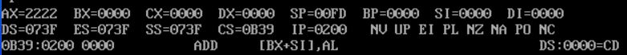

若要修改一个寄存器中的值，比如AX中的值，可用R命令后加寄存器名来进行，输入"`r ax`"后按Enter键，将出现"`:`"作为输入提示，在后面输入要写入的数据后按Enter键，即完成了对AX中内容的修改。若想看一下修改的结果，可再用R命令查看。

## D命令查看内存中的内容

`d 段地址:偏移地址`，可以来查看指定内存地址初的默认128个字节的内容。在使用"`d 段地址:偏移地址`"之后，接着再次使用D命令，可再次列出后续128字节的内容。

可以指定D命令的查看范围，此时采用"`d 段地址:起始偏移地址 结尾偏移地址`"的格式。比如要看`1000:0~1000:9`中的内容，可以用"`d1000:0 9`"实现，如图所示。若结尾偏移地址小于起始偏移地址将会报错。

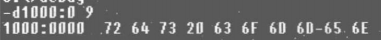

如果想看特定内存单元`10000H`中的内容，可以用图中任何一种方法看到。图中三种方式`段地址:偏移地址`都表示了`10000H`这一物理地址。（别忘了，8086下的段地址需要乘以16，相当于$1000H*10H=10000H$；$0FFFH*10H+10H=FFF0H+10H=10000H$）

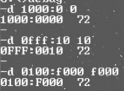

## E命令修改内存中的内容

比如要将内存`1000:0~1000:9`单元中的内容分别写为`0~9`。可以使用`e 起始地址 数据 数据 数据 ...`的格式来进行。

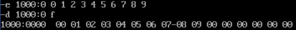

也可以用E命令以提问的方式来逐个地修改从某一地址开始的内存单元中的内容，以从`1000:10`单元开始为例，步骤如下。

1. 输入`e 1000:10`，按 Enter键。
2. Debug显示起始地址`1000:0010`，和第一单元（即`1000:0010`单元）的原始内容6D，然后光标停在"`.`"的后面提示输入想要写入的数据，此时可以有两个选择：
   1. 输入数据，然后按`空格键`，即用输入的数据改写当前的内存单元
   2. 不输入数据，直接按`空格键`，则不对当前内存单元进行改写。
3. 当前单元处理完成后（不论是改写或没有改写，只要按了空格键，就表示处理完成），Debug将接着显示下一个内存单元的原始内容，并提示进行修改，可以用同样的方法处理。
4. 所有希望改写的内存单元改写完毕后，按`Enter`键，E命令操作结束。

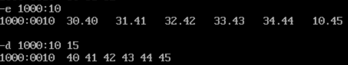

还可以用E命令向内存中写入字符，比如，用E命令从内存`1000:0`开始写入数值1、字符"a"、数值2、字符"b"、数值3、字符"c"，可采用图中所示的方法进行。

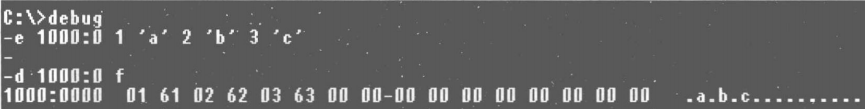

也可以用E命令向内存中写入字符串，比如，用E命令从内存`1000:0`开始写入数值1、字符串"a+b"、数值2、字符串"c++"、字符 3、字符串"IBM"。

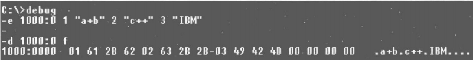

## E命令写入机器码，用U命令查看机器码含义，T命令执行

可以用E命令向内存中写入机器码，用U命令查看内存中机器码的含义，用T命令执行内存中的机器码。

机器码也是数据，当然可以用E命令将机器码写入内存。比如我们要从内存`1000:0`单元开始写入这样一段机器码：

| 机器码 | 对应的汇编指令 |
| ------ | -------------- |
| b80100 | mov ax, 0001   |
| b90200 | mov cx, 0002   |
| 01c8   | add ax, cx     |

可以用E命令这样输入：

```
e 1000:0 b8 01 00 b9 02 00 01 c8
```

可以使用U命令查看写入的或内存中原有的机器码所对应的汇编指令。比如可以用U命令将从`1000:0`开始的内存单元中的内容翻译为汇编指令，并显示出来。

下图：首先用E命令向从`1000:0`开始的内存单元中写入了8个字节的机器码；然后用D命令查看内存`1000:0~1000:1f`中的数据（从数据的角度看一下写入的内容）；最后用U命令查看从`1000:0`开始的内存单元中的机器指令和它们所对应的汇编指令。

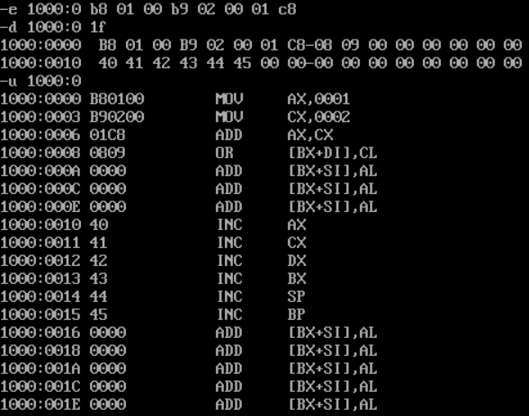

U命令的显示输出分为3部分，每一条机器指令的地址、机器指令、机器指令所对应的汇编指令。

内存中的数据和代码没有任何区别，关键在于如何解释。

使用T命令执行写入的机器指令可以执行一条或多条指令。

简单地使用T命令，可以执行`CS:IP`指向的指令。

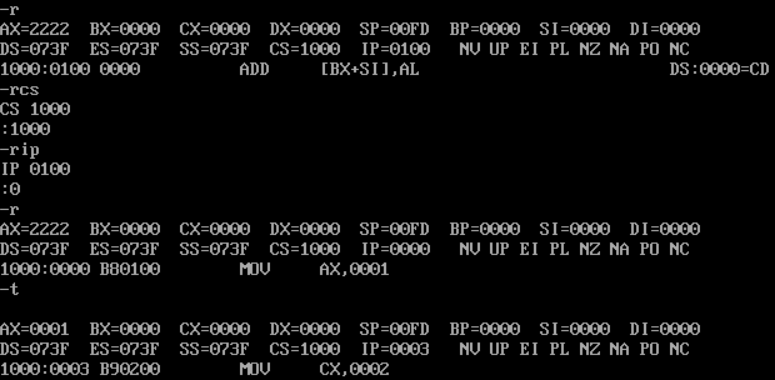

先修改cs、ip，使下一条命令对准`1000:0`，即`mov ax, 1`。`t`命令执行后，发现，ax变为了1；ip改变为3（指向下一条）。

## A命令以汇编指令的形式在内存中写入机器指令

A命令使能直接以汇编指令的形式写入指令。

首先用A命令，以汇编语言向从`1000:0`开始的内存单元中写入了几条指令，然后用D命令查看A命令的执行结果。可以看到，在使用A命令写入指令时，我们输入的是汇编指令，Debug将这些汇编指令翻译为对应的机器指令，将它们的机器码写入内存。

不再继续写入时，直接按Enter键表示操作结束。

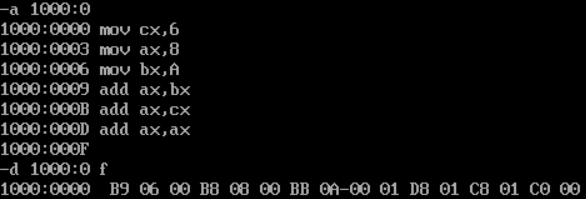

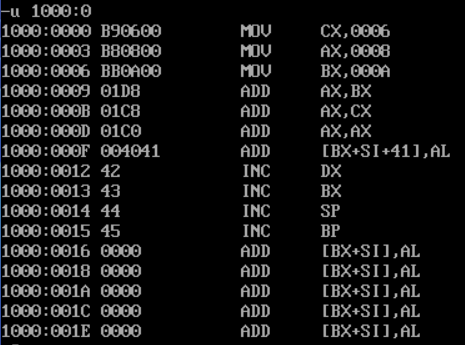
