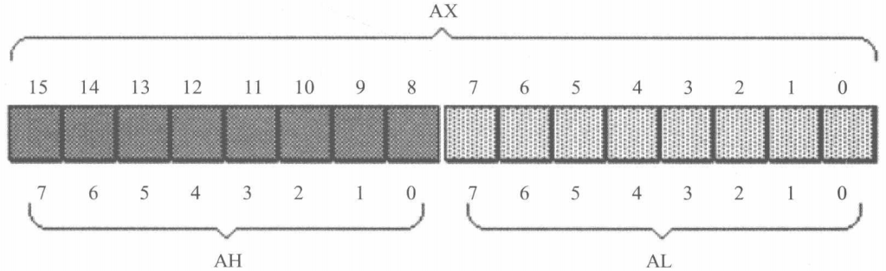
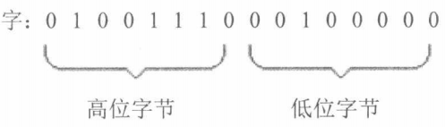

# CPU

一个典型的CPU（此处讨论的不是某一具体的CPU）由运算器、控制器、寄存器等构成，这些器件靠**内部总线**相连。内部总线实现CPU内部各个器件之间的联系；外部总线实现CPU和主板上其他器件的联系。简单地说，在CPU中：

* **运算器**进行信息处理；
* **寄存器**进行信息存储；
* **控制器**控制各种器件进行工作；
* **内部总线**连接各种器件，在它们之间进行数据的传送。

对于一个汇编程序员来说，CPU中的主要部件是寄存器。寄存器是CPU中程序员可以用指令读写的部件。程序员通过改变各种寄存器中的内容来实现对CPU的控制。不同的CPU，寄存器的个数、结构是不相同的。8086有14个寄存器，每个寄存器有一个名称。这些寄存器是：AX、BX、CX、DX、SI、DI、SP、BP、IP、CS、SS、DS、ES、PSW。

# 通用寄存器--AX/BX/CX/DX

8086的所有寄存器都是16位的，可以存放两个字节。AX、BX、CX、DX这4个寄存器通常用来存放一般性的数据，被称为通用寄存器。

8086的上一代CPU中的寄存器都是8位的，为了保证兼容，使原来基于上代CPU编写的程序稍加修改就可以运行在8086之上，8086的AX、BX、CX、DX这4个寄存器都可分为两个可独立使用的8位寄存器来用：

1. AX可分为AH和AL
2. BX可分为BH和BL
3. CX可分为CH和CL
4. DX可分为DH和DL



# 字在寄存器中的存储

出于对兼容性的考虑，8086可以一次性处理以下两种尺寸的数据。

1. 字节：记为byte，一个字节由8个bit组成，可以存在8位寄存器中。
2. 字：记为word，一个字由两个字节组成，这两个字节分别称为这个**字的高位字**
   **节和低位字节**。



一个字可以存在一个16位寄存器中，这个字的高位字节和低位字节自然就存在这个寄存器的高8位寄存器和低8位寄存器中。如上图所示，一个字型数据20000，存在AX寄存器中，在AH中存储了它的高8位，在AL中存储了它的低8位。AH和AL中的数据，既可以看成是一个字型数据的高8位和低8位，这个字型数据的大小是20000；又可以看成是两个独立的字节型数据，它们的大小分别是78和32。

# 几条汇编指令

| 汇编指令   | 控制CPU完成的操作                  | 用高级语言的语法描述 |
| ---------- | ---------------------------------- | -------------------- |
| mov ax, 18 | 将18送入寄存器AX                   | AX=18                |
| mov ah, 78 | 将78送入寄存器AH                   | AH=78                |
| add ax, 8  | 将寄存器AX中的数值加上8            | AH=AX+8              |
| mov ax, bx | 将寄存器BX中的数据送入寄存器AX     | AX=BX                |
| add ax, bx | 将AX和BX中的数值相加，结果存在AX中 | AX=AX+BX             |

在写一条汇编指令或一个寄存器的名称时不区分大小写。如mov ax, 18和MOV AX, 18的含义相同。

## 越位的问题

| 汇编指令    | AX中的数据 | BX中的数据 |
| ----------- | ---------- | ---------- |
| {start}     | 00C5H      | 4026H      |
| add al, 93H | ?          | 4026H      |

指令执行后AX中的数据为多少？

分析：

程序段中的最后一条指令`add al, 93H`，在执行前，`al`中的数据为`C5H`，相加后所得的值为`158H`，但是`al`为8位寄存器，只能存放两位十六进制的数据，所以最高位的`1`丢失，`ax`中的数据为`0058H`。（这里的丢失，指的是进位值不能在8位寄存器中保存，但是CPU并不是真的丢弃这个进位值）

> 注意，此时al是作为一个独立的8位寄存器来使用的，和ah没有关系，CPU在执行这条指令时认为ah和al是两个不相关的寄存器。不要错误地认为add al, 93H的指令产生的进位会存储在ah中，add al, 93H进行的是8位运算。
>
> 如果执行add ax, 93H，低8位的进位会存储在ah中，CPU在执行这条指令时认为只有一个16位寄存器ax，进行的是16 位运算。指令`add ax, 93H`执行后，ax中的值为：0158H。此时，使用的寄存器是16位寄存器ax，`add ax, 93H`相当于将ax中的16位数据00C5H和另一个16位数据0093H相加，结果是16位的0158H。

## 操作对象的位数应当是一致的

在进行数据传送或运算时，要注意指令的两个操作对象的位数应当是一致的，例如：

```x86asm
mov ax, bx
mov bx, cx
mov ax, 18H
mov al, 18H
add ax, bx
add ax, 20000
```

等都是正确的指令，而：

```x86asm
mov ax, bl    ; 在8位寄存器和16位寄存器之间传送数据
mov bh, ax    ; 在16位寄存器和8位寄存器之间传送数据
mov al, 20000 ; 8位寄存器最大可存放值为255的数据
add al, 100H  ; 将一个高于8位的数据加到一个8位寄存器中
```


等都是错误的指令，错误的原因都是指令的两个操作对象的位数不一致。

# 物理地址

CPU访问内存单元时，要给出内存单元的地址。即，CPU通过地址总线送入存储器的，必须是一个内存单元的物理地址。

所有的内存单元构成的存储空间是一个一维的线性空间，每一个内存单元在这个空间中都有唯一的地址，我们将这个唯一的地址称为物理地址。

在CPU向地址总线上发出物理地址之前，必须要在内部先形成这个物理地址。不同的CPU可以有不同的形成物理地址的方式。

下面分析8086是如何在内部形成内存单元的物理地址的。

# 16位CPU

什么是16位结构（16位机、字长为16位等常见说法，与16位结构的含义相同）的CPU？概括地讲，16位结构描述了一个CPU具有下面几方面的结构特性。

* 运算器一次最多可以处理16位的数据；
* 寄存器的最大宽度为16位；
* 寄存器和运算器之间的通路为16位。

8086是16位结构的CPU，这也就是说，在8086内部，能够一次性处理、传输、暂时存储的信息的最大长度是16位的。内存单元的地址在送上地址总线之前，必须在CPU中处理、传输、暂时存放，对于16位CPU，能一次性处理、传输、暂时存储16位的“单位”地址。

# 8086CPU给出物理地址的方法

8086是16位结构，在内部一次性处理、传输、暂时存储的地址为16位。但是8086有20位地址总线，可以传送20位地址，达到1MB寻址能力。从8086CPU的内部结构来看，如果将地址从内部简单地发出，那么它只能送出16位的地址，表现出的寻址能力只有64K“单位”个地址。

8086CPU采用一种在内部**用两个16位地址合成**的方法来形成一个20位的物理地址。

当8086CPU要读写内存时：

1. CPU中的相关部件提供两个16位的地址，一个称为段地址，另一个称为偏移地址；
2. 段地址和偏移地址通过**内部总线**送入一个称为**地址加法器**的部件；
3. 地址加法器将两个16位地址合成为一个20位的物理地址；
4. 地址加法器通过内部总线将20位物理地址送入输入/输出控制电路（可以看到，地址加法器到输入/输出控制电路之间的内部总线需要有20位）；
5. 输入/输出控制电路将20位物理地址送上其与内存之间的地址总线；
6. 20位物理地址被地址总线传送到存储器。

地址加法器采用$物理地址=段地址×16(左移4位)+偏移地址$的方法用段地址和偏移地址合成物理地址。

# 段

其实，内存并没有分段，段的划分来自于CPU，由于8086CPU用“基础地址+偏移地址=物理地址”的方式给出内存单元的物理地址，使得我们在逻辑上可以用分段的方式来管理内存。可以根据需要，将地址连续、起始地址为16的倍数的一组内存单元定义为一个段。

在8086机中，存储单元的地址用两个元素来描述，即段地址和偏移地址。"数据在21F60H内存单元中。"这句话对于8086机一般不这样讲，取而代之的是两种类似的说法：1、数据存在内存2000:1F60单元中；2、数据存在内存的2000H段中的1F60H单元中。这两种描述都表示"数据在内存21F60H单元中"。

# 段寄存器--CS为例

我们前面讲到，8086在访问内存时要由相关部件提供内存单元的段地址和偏移地址，送入地址加法器合成物理地址。这里，需要看一下，是什么部件提供段地址。段地址在8086的段寄存器中存放。8086有4个段寄存器CS、DS、SS、ES。当8086要访问内存时由这4个段寄存器提供内存单元的段地址。看一下CS（CS，全拼为Code Segment）。

CS和IP是8086中两个最关键的寄存器，它们指示了CPU当前要读取指令的地址。CS为代码段寄存器，IP为指令指针寄存器，从名称上可以看出它们和指令的关系。

在8086PC机中，任意时刻，设CS中的内容为M，IP中的内容为N，8086将从内存M×16+N单元开始，读取一条指令并执行。

也可以这样表述：8086机中，任意时刻，CPU将CS:IP指向的内容当作指令执行。

在内存中，指令和数据没有任何区别，都是二进制信息，CPU在工作的时候把有的信息看作指令，有的信息看作数据。现在，如果提出一个问题：**CPU根据什么将内存中的信息看作指令？可以说，CPU将CS:IP指向的内存单元中的内容看作指令**，因为，在任何时候，CPU将CS、IP中的内容当作指令的段地址和偏移地址，用它们合成指令的物理地址，到内存中读取指令码，执行。如果说，内存中的一段信息曾被CPU执行过的话，那么，它所在的内存单元必然被CS:IP指向过。

## 修改CS、IP的指令--转移指令

CPU从何处执行指令是由CS、IP中的内容决定的，在CPU中，程序员能够用指令读写的部件只有寄存器，程序员可以通过改变寄存器中的内容实现控制CPU的执行目标指令。

如何改变CS、IP的值呢？显然，8086必须提供相应的指令。我们如何修改AX中的值？可以用mov指令，如`mov ax, 123`将ax中的值设为123。显然，我们也可以用同样的方法设置其他寄存器的值，如`mov bx, 123`，`mov cx, 123`，`mov dx, 123`等。

其实，**8086大部分寄存器的值，都可以用mov指令来改变，mov指令被称为传送指令**。

但是，mov指令不能用于设置CS、IP的值，原因很简单，因为8086没有赋予mov这样的权限。8086为CS、IP提供了另外的指令来改变它们的值。能够改变CS、IP的内容的指令被统称为**转移指令**。看一个最简单的可以修改CS、IP的指令：`jmp`指令。

### jmp 段地址:偏移地址

若想同时修改CS、IP的内容，可用形如"`jmp 段地址:偏移地址`"的指令完成，如`jmp 2AE3:3`，执行后：`CS=2AE3H`，`IP=0003H`，CPU将从`2AE33H`处读取指令。`jmp 3:0B16`，执行后：`CS=0003H`，`IP=0B16H`，CPU将从`00B46H`处读取指令。

"`jmp 段地址:偏移地址`"指令的功能为：用指令中给出的段地址修改CS，偏移地址修改IP。

### jmp 某一合法寄存器

若想仅修改IP的内容，可用形如"`jmp 某一合法寄存器`"的指令完成，如`jmp ax`，指令执行前：`ax=1000H`，`CS=2000H`，`IP=0003H`；指令执行后：`ax=1000H`，`CS=2000H`，`IP=1000H`。`jmp bx`，指令执行前：`bx=0B16H`，`CS=2000H`，`IP=0003H`。指令执行后：`bx=0B16H`，`CS=2000H`，`IP=0B16H`。

"jmp 某一合法寄存器"指令的功能为：用寄存器中的值修改IP。

`jmp ax`，在含义上好似：`mov IP, ax`。

### 用汇编解释汇编

"用汇编解释汇编"能更好地理解汇编指令的功能，要强调的是，是用"已知的汇编指令的语法"进行描述，并不是用"已知的汇编指令"来描述，比如，我们用`mov IP, ax`来描述`jmp ax`，并不是说真有`mov IP, ax`这样的指令，而是用mov指令的语法来说明`jmp`指令的功能。我们可以用同样的方法描述`jmp 3:01B6`的功能：`jmp 3:01B6`在含义上好似`mov CS, 3`, `mov IP, 01B6`。

## 总结

1. 段地址在8086的段寄存器中存放。当8086要访问内存时，由段寄存器提供内存单元的段地址。8086有4个段寄存器，其中CS用来存放指令的段地址。
2. CS存放指令的段地址，IP存放指令的偏移地址。8086机中，任意时刻，CPU将CS:IP指向的内容当作指令执行。
3. 8086的工作过程
   1. 从CS:IP指向的内存单元读取指令，读取的指令进入指令缓冲器；
   2. IP指向下一条指令；
   3. 执行指令。（转到步骤1，重复这个过程。）
4. 8086提供转移指令修改CS、IP的内容

# 访问内存的角度

