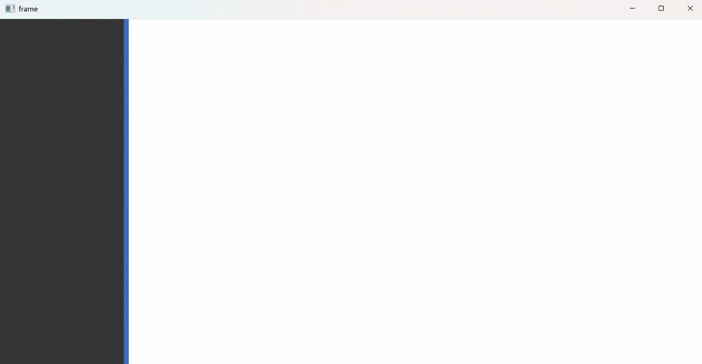
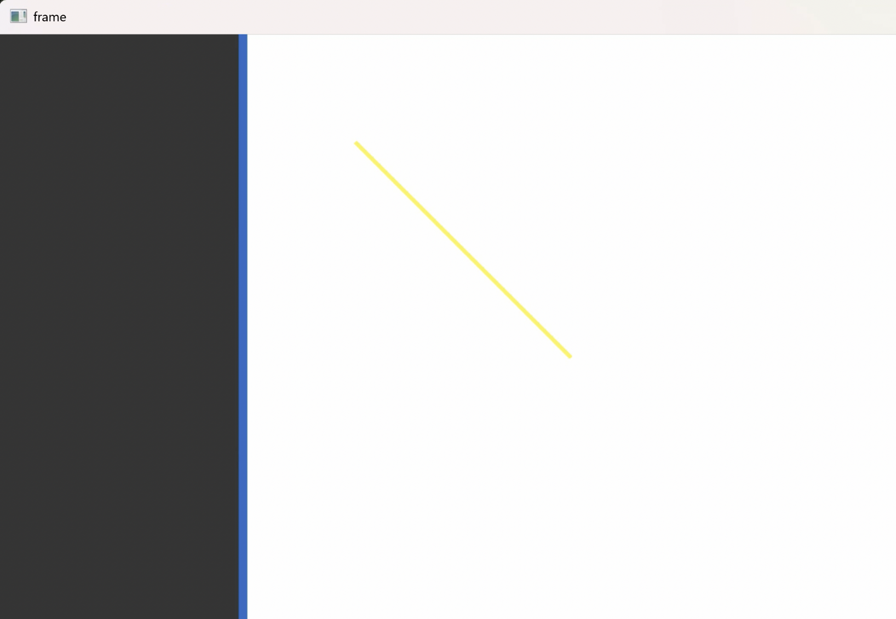
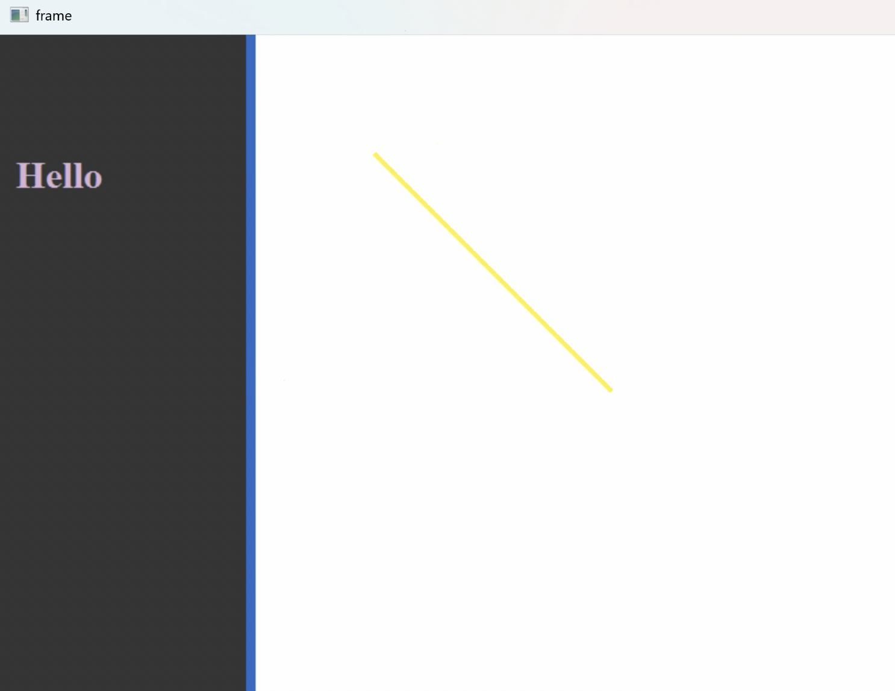
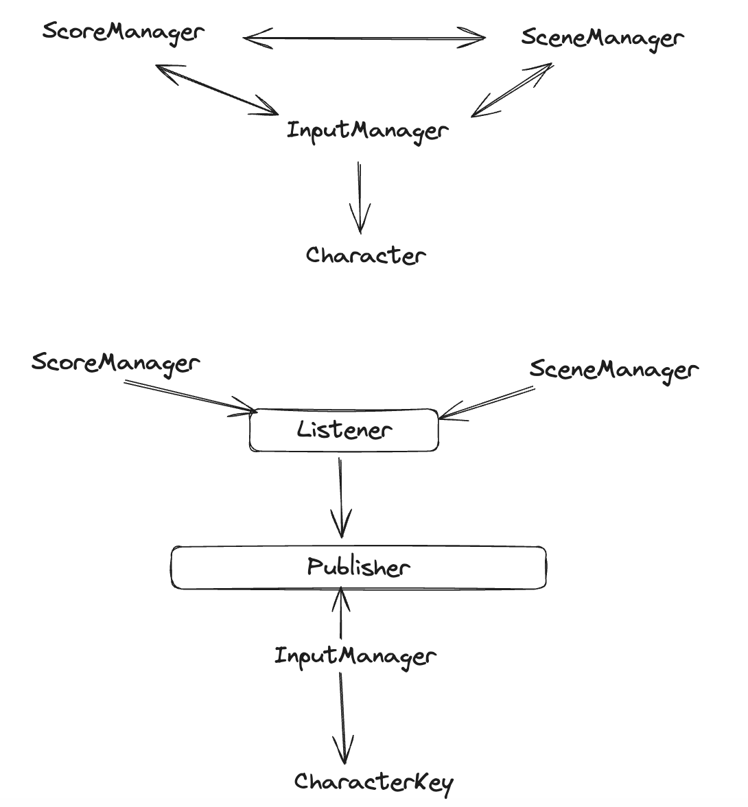

# 准备项目

用VS向导创建项目。新建一个项目，选择"Windows Desktop Wizard"，取名为"TemplatedFramework"。点击创建按钮后，弹出配置窗口，Application type选择："Desktop Application (.exe)"，Additional options中勾选"Empty project"。

配置VS项目的属性，右键项目选择Properties，左边栏选择Linker，然后选择System。右边详细条目"SubSystem"暂时下拉选择Console，后续需要窗口程序时再调整为Windows。

目前的工作是编写一个模板文件。模板不是编译单位，因此取后缀名为`.hpp`，如果写为`.cpp`后缀则无法通过默认一键编译。因此，`.hpp`的文件通常被理解为无需再去寻找相应的`.cpp`实现文件，而是在自身文件中已实现。所以基于模板开发的代码，最基础的模板代码文件是必须提供开源的。

因此，新建一个`.hpp`头文件，名为`TWindow.hpp`。
```cpp
// TWindow.hpp

#pragma once

namespace tfk
{
    template <typename T>
    class TWindow
    {
        // ...
    };
}
```
# TWindow类设计

和面向对象设计的Window类很相似。
之前的`Window.h`文件：
```cpp
// Window.h
class Window
{
public:
    friend int ::wWinMain(HINSTANCE, HINSTANCE, LPWSTR, int);
public:
    Window(std::wstring const& app_name);
    bool create_window(void);
    void show_window(bool show = true);
    int run(void);

    static LRESULT CALLBACK window_procedure(
        HWND wnd, UINT message, WPARAM wparam, LPARAM lparam);
protected:
    virtual void pre_create(WNDCLASSEX& wcex);
    virtual bool on_lbtndown(POINT& pt);
    virtual bool on_lbtnup(POINT& pt);
    virtual bool on_rbtndown(POINT& pt);
    virtual bool on_paint(HDC dc, PAINTSTRUCT& ps);
protected:
    HWND              _wnd{ nullptr };
    static HINSTANCE  _instance;
    static Window*    _window;
    std::wstring      _app_name;
};
```
现在我们是模板类（没有具体类，因此不存在静态变量），而且不依赖于动态多态，因此，不会用到virtual属性和static属性。
1. 改类名为`TWindow`
2. 改成员变量`_window`的类型为`TWindow<T>*`
3. 删去`create_window`函数。
   `pre_create`可以集成在构造函数中了。当时设计Window类将创建窗口的工作从构造函数中剥离的原因是`pre_create`无法在构造函数中调用，而`pre_create`又必须和`create_window`的其他动作绑定（wcex的赋初值工作），因此需要单独抽出来作为`create_window`。现在，没有虚函数特性了，因此，`pre_create`可以直接写在构造函数中。因此，也无需再剥离出`create_window`函数，即原先`create_window`函数的工作全在构造函数中铺开。
2. 删去成员变量`_app_name`，因为可以直接通过参数在构造函数中赋予wcex属性。
3. `pre_create`删去virtual。
4. 四个`on_...`消息处理函数删去virtual。
```cpp
template <typename T>
class TWindow
{
public:
    friend int ::wWinMain(HINSTANCE, HINSTANCE, LPWSTR, int);
public:
    TWindow(std::wstring const& app_name);
    bool create_window(void);
    void show_window(bool show = true);
    int run(void);

    static LRESULT CALLBACK window_procedure(
        HWND wnd, UINT message, WPARAM wparam, LPARAM lparam);
protected:
    void pre_create(WNDCLASSEX& wcex);
    bool on_lbtndown(POINT& pt);
    bool on_lbtnup(POINT& pt);
    bool on_rbtndown(POINT& pt);
    bool on_paint(HDC dc, PAINTSTRUCT& ps);
protected:
    HWND                 _wnd{ nullptr };
    static HINSTANCE     _instance;
    static TWindow<T>*   _window;
};
```
# TWindow类模板的函数实现
直接在`TWindow.hpp`文件中的类模板定义的尾部编写函数实现。
```cpp
// TWindow.hpp
namespace tfk
{
    template <typename T>
    class TWindow
    {
        // ...
    };

    // 在这里写 implementation
}
```

```cpp

// TWindow<T> implementation

// TWindow.hpp

// ...

#include <string>
#include <Windows.h>

template <typename T>
TWindow<T>::TWindow(std::wstring const& app_name)
{
    _window = this;

    WNDCLASSEX wcex = { 0 };
    wcex.cbSize = sizeof(wcex);
    wcex.style = CS_HREDRAW | CS_VREDRAW;
    wcex.lpfnWndProc = &window_procedure;
    wcex.cbClsExtra = 0;
    wcex.cbWndExtra = 0;
    wcex.hInstance = _instance;
    wcex.hIcon = LoadIcon(nullptr, IDI_SHIELD);
    wcex.hCursor = LoadCursor(nullptr, IDC_ARROW);
    wcex.hbrBackground = (HBRUSH)(GetStockObject(LTGRAY_BRUSH));
    wcex.lpszMenuName = NULL;
    wcex.lpszClassName = app_name.c_str();
    wcex.hIconSm = wcex.hIcon;
    
    pre_create(wcex);  // 此处有隐患：见下文CALLBACK实现

    if (!::RegisterClassEx(&wcex))
        return;
    // 定义一个窗口对象的句柄
    // HWND: 窗口类型的句柄，也叫内核对象
    _wnd = ::CreateWindowEx(
        WS_EX_OVERLAPPEDWINDOW,
        app_name.c_str(),
        L"App",
        WS_OVERLAPPEDWINDOW,
        CW_USEDEFAULT, 0, CW_USEDEFAULT, 0,
        nullptr,
        nullptr,
        hInstance,
        nullptr);
    if (!_wnd)
    {
        int i = ::GetLastError();
        return;
    }
}

template <typename T>
void TWindow<T>::show_window(bool show)
{
    if(_wnd)
    {
        int nShowCmd = show ? SW_NORMAL : SW_HIDE;
        // 显示窗口，nShowCmd可以指定窗口以最小/最大/正常状态显示
        ::ShowWindow(_wnd, nShowCmd);
        // 更新窗口，绘制窗口。刚显示出来可能是无效的，需要在显示后绘制。
        ::UpdateWindow(_wnd);
    }
}

template <typename T>
int TWindow<T>::run(void)
{
    MSG msg;
    while (::GetMessage(&msg, nullptr, 0, 0))
    {
        // 翻译消息，比如输入法通过‘wo’生成‘我’
        ::TranslateMessage(&msg);
        // 发送消息，调用刚才注册的callback窗口处理函数
        ::DispatchMessage(&msg);
    }
    return 0;
}

template <typename T>
void TWindow<T>::pre_create(WNDCLASSEX& wcex)
{
    // 空操作
}
```
## CALLBACK实现
主要分析一下类模板下的CALLBACK如何实现。
由于此模式的多态是静态多态，所以需要把`_window`（值为this指针）从`TWindow<T>*`强转为`T*`，赋给window变量。
把原先面向对象模式下用`_window`调用方法全部替换为`window`调用。
```cpp
template <typename T>
LRESULT TWindow<T>::window_procedure(
    HWND wnd, UINT message,
    WPARAM wparam, LPARAM lparam)
{

    T* window = static_cast<T*>(_window);

    if(!window)
        return ::DefWindowProc(wnd, message, wparam, lparam);

    PAINTSTRUCT ps;

    switch (message)
    {
    case WM_CREATE:
        break;
    case WM_LBUTTONDOWN:
    {
        // GET_X/Y_LPARAM From <windowsx.h> 
        int x_coord = GET_X_LPARAM(lparam);
        int y_coord = GET_Y_LPARAM(lparam);
        POINT pt{ x_coord, y_coord };
        // true代表用户处理完毕
        if (window->on_lbtndown(pt))
            return 1;
    }
        break;
    case WM_LBUTTONUP:
    {
        // GET_X/Y_LPARAM From <windowsx.h> 
        int x_coord = GET_X_LPARAM(lparam);
        int y_coord = GET_Y_LPARAM(lparam);
        POINT pt{ x_coord, y_coord };
        // true代表用户处理完毕
        if (window->on_lbtnup(pt))
            return 1;
    }
        break;
    case WM_RBUTTONDOWN:
    {
        int x_coord = GET_X_LPARAM(lparam);
        int y_coord = GET_Y_LPARAM(lparam);
        POINT pt{ x_coord, y_coord };
        if (window->on_rbtndown(pt))
            return 1;
    }
        break;
    case WM_PAINT:
    {
        HDC dc = ::BeginPaint(wnd, &ps);
        bool result = window->on_paint(dc, ps);
        ::EndPaint(wnd, &ps);
        if (result)
            return 1;
    }
        break;
    case WM_DESTROY:
        ::PostQuitMessage(0);
        break;
    //default:
    //    ;
    }
    return ::DefWindowProc(wnd, message, wparam, lparam);
}
```
>此时有一个隐患，由于静态多态，所以构造函数中的`pre_create`不能使用默认类型this调用，需要强转为`T*`才能成功调用用户自定义的方法。
```cpp
template <typename T>
TWindow<T>::TWindow(std::wstring const& app_name)
{
    _window = this;

    // ...
    
    static_cast<T*>(_window)->pre_create(wcex);  // 此处有隐患：见下文CALLBACK实现

    // ...
}
```
# wWinMain放到哪
写到`TWindow.cpp`里面。
```cpp
#include "TWindow.hpp"

extern int main(std::wstring const& args);

int wWinMain(
    HINSTANCE hInstance,
    HINSTANCE hPrevInstance,
    LPWSTR lpCmdLine,
    int nShowCmd)
{
    // error
    tfk::TWindow<?>::_instance = hInstance;
    return main(lpCmdLine);
}
```
但是，又遇到一个模板编程中的问题：此时`TWindow`缺少一个模板参数。而这个类模板的具体定义却又是在main函数后完成定义的。所以这个模板参数无法填写。
因此，这里的`_instance`就不能作为类的属性了，而是作为类之外的全局属性。

改写：把`_instance`剥离类外，定义为extern。
```cpp
// TWindow.hpp
namespace tfk
{
    extern HINSTANCE gInstance;

    template <typename T>
    class TWindow
    {
        // ...
    }
}
```
然后在`TWindow.cpp`里面定义它。在这个文件中也开一个tfk名字空间。
```cpp
// TWindow.cpp

#include "TWindow.hpp"

namespace tfk
{
    constinit HINSTANCE ginstance{ nullptr };
}

// ...
```
至此，就可以在wWinMain中把hInstance值赋给`TWindow<T>`要使用的gInstace变量了。完整、正确的`TWindow.cpp`内容：
```cpp
#include "TWindow.hpp"

namespace tfk
{
    constinit HINSTANCE ginstance{ nullptr };
}

extern int main(std::wstring const& args);

int wWinMain(
    HINSTANCE hInstance,
    HINSTANCE hPrevInstance,
    LPWSTR lpCmdLine,
    int nShowCmd)
{
    tfk::gInstance = hInstance;
    return main(lpCmdLine);
}
```
最后，改写一下TWindow构造函数中涉及到`_instance`的地方，替换为`gInstance`。还有，之前因为类外的wWinMain要用到成员变量`_instance`，我们设置了一个友元，现在也可以删去了。
```cpp
// TWindow.hpp

class TWindow
{
/* public:
    friend int ::wWinMain(HINSTANCE, HINSTANCE, LPWSTR, int); */

// ...
};
```

```cpp
// TWindow.hpp implementaion

TWindow<T>::TWindow(std::wstring const& app_name)
{
    // ...

    wcex.hInstance = gInstance;

    // ...

    _wnd = ::CreateWindowEx(
        WS_EX_OVERLAPPEDWINDOW,
        app_name.c_str(),
        L"App",
        WS_OVERLAPPEDWINDOW,
        CW_USEDEFAULT, 0, CW_USEDEFAULT, 0,
        nullptr, nullptr, gInstance, nullptr);
}

```
# `_window`怎么初始化
`_window`是静态变量。在类模版下的静态变量，在类外不能直接填参数。因此类似于gInstace的初始化写法，写在`TWindow.cpp`中的另一个tfk名字空间中。
先用泛化的方式写一下试试：
```cpp
#include "TWindow.hpp"

namespace tfk
{
    // ...
    
    template<typename T> TWindow<T>* TWindow<T>::_window{ nullptr };
}
```
小小测试一下：
```cpp
// MyTApp.h
#pragma once
#include "TWindow.hpp"
class MyTApp : public tfk::TWindow<MyTApp>
{
public:
    MyTApp(std::wstring const & name) : TWindow{name}
    {
        //
    }
};
```

```cpp
// Source.app
#include "MyTApp.h"
int main(void)
{
    MyTApp my_app;
    my_app.show_window();
    return my_app.run();
}
```
测试，以上写法编译不通过：
```
error: LNK2001: unresolved symbol "protected: static class tfk::TWindow<class MyTApp> * tfk::TWindow<class MyTApp>::_window" (?_window@?$TWindow@VMyTApp@@@tfk@@1PEAV12@EA)
```
链接器失败，证明类模板下静态变量的初始化不能这么写。
那么，就需要让用户在其main函数所在的文件外部进行初始化了：
```cpp
// main.cpp
#include "MyTApp.h"

tfk::TWindow<MyTApp>* tfk::TWindow<MyTApp>::_window{ nullptr };

int main(void)
{
    // ...
}
```
也有更简化的写法，利用宏定义：
```cpp
#define Tinit(app)   tfk::TWindow<app>* tfk::TWindow<app>::_window{ nullptr }

Tinit(MyTApp);
```
可以把宏定义写在`TWindow.hpp`尾部：
```cpp
// TWindow.hpp
//...

#define Tinit(app)   tfk::TWindow<app>* tfk::TWindow<app>::_window{ nullptr }
```
除了把这个问题抛给用户处理，还有一个方案，即类似于`gInstance`的处理，就是把`_window`提升为模板类外的全局变量。
# 基于模板框架开发

```cpp
// MyTApp.h
#pragma once
#include "TWindow.hpp"
class MyTApp : public tfk::TWindow<MyTApp>
{
public:
    MyTApp(std::wstring const & name) : TWindow{name}
    {
        //
    }

    void pre_create(WNDCLASSEX& wcex)
    {
        wcex.hbrBackground = reinterpret_cast<HBRUSH>(::GetStockObject(BLACK_BRUSH));
    }
};
```

```cpp
// Source.app
#include "MyTApp.h"
int main(void)
{
    MyTApp my_app;
    my_app.show_window();
    return my_app.run();
}
```

# 基于GeometryUI开发打字游戏
## 整体布局
一个大窗口包含两个子窗口，左右分布。左窗口记录实时分数Score，右窗口为游戏画面，显示一些从上方落下的圆圈字母，玩家按下看到的字母可以将其消除，当有字母接触到底部边框时，游戏结束。
## 项目配置
新建项目，同样选择Windows Desktop Wizard。起名`Typist`，Application Type选择Desktop Application，Addition options选择Empty project。
新建Source Files，`main.cpp`。

打开`Typist`的Open Containing Folder，和QuickGeometryUI的Open Containing Folder。把所有相关的代码文件（`.h`、`.hpp`、`.inl`、`.cpp`（除了测试文件））拷贝到Typist目录。

引入外部文件后，右键Header Files，Add Existing Files，选择`.h`、`.hpp`、`.inl`文件（`inl`表示inline）；右键Source Files，Add Existing Files，选择`.cpp`文件。

下面新建并编写文件`TypistWindow.h`（建在Filter `Typist Box`中）：
右键项目名`Typist`，Add，New Filter，取名为`Typist Box`。再在这个建好的Filter名字上右键，Add New Item，取名`TypistWindow.h`。
该文件声明3个类：
1. TypistFrame
2. TypistLeftBox
3. TypistCentralBox
需要引入`QuickGeometryUI.hpp`
```cpp
// TypistWindow.h

#pragma once

#include "QuickGeometryUI.hpp"
namespace typist
{
    // Window Frame
    class TypistFrame : public harbin::GeometryFrameBox<TypistFrame>
    {
        // ...
    };

    // Left window
    // 模板参数1: ParentBox
    // 模版参数2: InheritedT（当前窗口）
    class TypistLeftBox : public harbin::GeometryBox<TypistFrame, TypistLeftBox>
    {
        // ...
    };

    class TypistCentralBox : public harbin::GeometryBox<TypistFrame, TypistCentralBox>
    {
        // ...
    };
}
```
## 构造
```cpp
// TypistWindow.h

// ...
#include <string>
#include "QuickGeometryUI.hpp"
namespace typist
{
class TypistFrame : public harbin::GeometryFrameBox<TypistFrame>
{
public:
    TypistFrame(std::wstring const& name);
};

class TypistLeftBox : public harbin::GeometryBox<TypistFrame, TypistLeftBox>
{
public:
    TypistLeftBox(TypistFrame * frame, std::wstring const& name);
};

class TypistCentralBox : public harbin::GeometryBox<TypistFrame, TypistCentralBox>
{
public:
    TypistCentralBox(TypistFrame * frame, std::wstring const& name);
};
}
```
### 实现
`TypistWindow.cpp`建在Filter `Typist Box`中。
```cpp
// TypistWindow.cpp
#include "TypistWindow.h"
typist::TypistFrame::TypistFrame(std::wstring const& name) : 
    GeometryFrameBox{ name.c_str() }
{

}

typist::TypistLeftBox::TypistLeftBox(TypistFrame* frame, std::wstring const& name) : 
    GeometryFrameBox{ frame, name.c_str() }
{

}

typist::TypistCentralBox::TypistCentralBox(TypistFrame* frame, std::wstring const& name) : 
    GeometryFrameBox{ frame, name.c_str() }
{

}
```
## main函数
1. 入口函数规定为GeometryMain，需要改main函数名字
2. 定义窗口Frame，再定义中央窗口、左窗口。
3. AddSubBox，向父窗口中添加两个子窗口。
    1. 第1个参数指定哪个作为子窗口
    2. 第2个参数指定位置布局到哪里
    3. 第3个参数是iDockModes
        1. 这个是做什么的呢？假设同时有左盒子、下盒子，这个参数就是指定谁占用左下角的位置。则参数选项中谁名字在前面谁占，如`DM_LEFT_BOTTOM`是左盒子占用。
        2. 我们此例没有下盒子，可以省略。
4. show，3个盒子
5. run，消息循环放到了frame_box中。
`main.cpp`建在Source Files中。
```cpp
// main.cpp

#include "TypistWindow.h"
int GeometryMain(void)
{
    typist::TypistFrame frame_box{ L"frame" };
    typist::TypistCentralBox central_box{ &frame_box, L"central" };
    typist::TypistLeftBox left_box{ &frame_box, L"left" };

    frame_box.AddSubBox(&central_box, BP_CENTRAL);
    frame_box.AddSubBox(&left_box, BP_LEFT);

    frame_box.ShowBox();
    central_box.ShowBox();
    left_box.ShowBox();

    frame_box.Run();
    
    return 0;
}
```
运行效果如下：

## 换子窗口背景颜色
可以重写`template<typename ParentBox, typename InheritedT> class GeometryBox`中的方法`void PreCreateBox(WNDCLASSEX&)`。
我们更换的是CentralBox的颜色。
```cpp
// TypistWindow.h

// ...

class TypistCentralBox : public harbin::GeometryBox<TypistFrame, TypistCentralBox>
{
public:
    // ...
    void PreCreateBox(WNDCLASSEX&);
}
```
实现：
```cpp
// TypistWindow.cpp
void typist::TypistCentralBox::PreCreateBox(WNDCLASSEX& wcex)
{
    wcex.hbrBackground = reinterpret_cast<HBRUSH>(::GetStockObject(WHITE_BRUSH));
}
```
运行效果如下：

## OnPaint绘制图形
可以重写`template<typename ParentBox, typename InheritedT> class GeometryBox`中的方法`void OnPaint(Graphics&, HDC, PAINTSTRUCT*, bool)`。
```cpp
// TypistWindow.h
// ...
class TypistCentralBox : public harbin::GeometryBox<TypistFrame, TypistCentralBox>
{
public:
    // ...
    void typist::TypistCentralBox::OnPaint(
        Graphics& graphics,
        HDC hDC,
        PAINTSTRUCT* pPS,
        bool bDragRepaint = false);
}
```
其中Graphics指定的是绘制图形的接口，有GDI和GDI+。
因为我们在`TypistWindow.h`中引入了`QuickGeometry.hpp`，而`QuickGeometry.cpp`中引入了`<gdiplus.h>`，因此无需再次引入。
```cpp
// TypistWindow.cpp
// ...
void typist::TypistCentralBox::OnPaint(
    Graphics& graphics,
    HDC hDC,
    PAINTSTRUCT* pPS,
    bool bDragRepaint /* = false */)
{
    Gdiplus::Color color(200, 255, 255, 0);
    Gdiplus::Pen pen(color, 3.0f);
    Gdiplus::PointF pt{ 100.0f, 100.0f };
    Gdiplus::PointF pt2{ 300.0f, 300.0f };
    graphics.DrawLine(&pen, pt, pt2);
}
```
效果如下：

### 关于GDI
GDI（Graphics Device Interface）是Windows的子系统，意为图形设备接口，是策略模式的一种。
GDI用于在DC（Device Context）上绘画。

GDI 主要用于绘制图形和文本，以及管理显示设备（如显示器和打印机）。它提供了基本的绘图功能，包括线条、矩形、椭圆、位图、字体等。

GDI 是一个成熟但相对低级的接口，提供的图形功能比较基础，性能较高，但不支持复杂的图形效果和抗锯齿等现代图形技术。
### GDI+
GDI+ 是 GDI 的增强版，他们都是Windows操作系统中的图形编程接口。GDI+提供了更现代化和丰富的图形功能，有更多高级功能和更高的抽象层次。包括矢量图形、浮点坐标、颜色渐变、复杂区域填充、透明度和抗锯齿等。它简化了许多图形编程任务，并且能更好地处理复杂的图形效果。但相对而言，性能可能不如 GDI 高。
## 左窗口画文字
TypistLeftBox 类重写`template<typename ParentBox, typename InheritedT> class GeometryBox`中的方法`void OnPaint(Graphics&, HDC, PAINTSTRUCT*, bool)`。
```cpp
// TypistWindow.h
// ...
class TypistLeftBox : public harbin::GeometryBox<TypistFrame, TypistCentralBox>
{
public:
    // ...
    void typist::TypistLeftBox::OnPaint(
        Graphics& graphics,
        HDC hDC,
        PAINTSTRUCT* pPS,
        bool bDragRepaint = false);
}
```
实现
```cpp
// TypistWindow.cpp
// ...
void typist::TypistLeftBox::OnPaint(
    Graphics& graphics,
    HDC hDC,
    PAINTSTRUCT* pPS,
    bool bDragRepaint /* = false */)
{
    Gdiplus::FontFamily fontFamily(L"Times New Roman");
    Gdiplus::Font font(&fontFamily, 24, Gdiplus::FontStyle::FontStyleBold, Gdiplus::UnitPoint);
    Gdiplus::PointF pf(10.0f, 100.0f);
    Gdiplus::SolidBrush br(Color(200, 255, 200, 255));
    graphics.DrawString(L"Hello", -1, &font, pt, &br);
}
```
效果如下：


## 类设计

1. ScoreManager：积分管理
2. SceneManager：游戏主场景管理，主要管理画面中的Character
3. Character：屏幕上显示的一个个字符
4. InputManager：输入管理，包括键盘输入、手柄输入、网络事件
n个Character受1个SceneManager管理，而ScoreManager、SceneManager、InputManager三者均有可能相互通信，如果直接面向具体的对象进行编程，是不符合依赖倒转原则、迪米特原则的。应该设计抽象的接口，使这三者通过接口进行联系。


总体的流程：
1. ScoreManager、SceneManager在Publisher处订阅消息。publisher将其加入记录。
2. InputManager是Publisher。InputManager依赖Character，管理、生成着CharacterArg。
3. 当Windows系统监听到按键后，调用InputManager的`key_down`，即被触发激活，InputManager包装消息、内容（键字母）打包给对应的监听者并notify，即调用其update。
4. 各自处理消息。

消息类型：
1. 按下字符消息
2. 加分消息
3. 字符死亡消息（字符落到底线）
4. 更新画面消息
5. 新的字符生成消息
## 观察者模式

右键项目名称，Add New Filter，取名`Typist Game`。在此Filter下新建`IListener.h`等文件。
### IArgument
IArgument接口类规范：每个Argument类都要实现对外实现一个`publisher`接口，该接口主要用于外部获取当前Argument的消息来源。

Argument 类的作用：用于IListener中update接口中参数2包装消息。

该文件还定义了消息类型，以枚举类实现。
```cpp
// IArgument.h
// ...
namespace typist
{
class IPublisher;
class IArgument
{
public:
    // 消息来源
    virtual IPublisher* publisher(void) const = 0;
};

enum class TPMSG
{
    Character,
    IncreaseScore,
    Stop,
    Update,
    Generate
};
}
```
### IListener
总览
```cpp
// IListener.h
#pragma once
namespace typist
{
    // Typist Messages
    enum TPMSG
    {
        // ...
    };

    // incomplete type claim
    class IPublisher;

    class Argument
    {
        // ...
    };
    
    class IListener
    {
        // ...
    };
}
```
#### update接口
```cpp
// IListener.h
// ...
#include <memory>
#include "IArgument.h"
class IListener
{
public:
    // 响应事件
    // 参数1: 事件类型  参数2: 事件所携带的内容
    virtual bool update(TPMSG msg, std::shared_ptr<IArgument> arg) = 0;
};
```
### IPublisher
在Typist Game下创建`IPubilisher.h`
总览：
```cpp
// IPublisher.h
#pragma once

namespace typist
{
    class IPublisher
    {
        // ...
    };
}
```
#### 接口
```cpp
// IPublisher.h
// ...

#include "IListener.h"
class IPublisher
{
public:
    // 参数1: 关注哪个消息
    virtual void add_listener(TPMSG msg, std::shared_ptr<IListener> listener) = 0;
    virtual void remove_listener(TPMSG msg, std::shared_ptr<IListener> listener) = 0;
    virtual void notify(TPMSG msg) = 0;
};
```
### InputManager
InputManager是一个信息发布者。所以需要引入`IPublisher.h`并且继承（实现接口）。
```cpp
// InputMgr.h
#pragma once

#include "IPublisher.h"
namespace typist
{
    class InputMgr : IPublisher
    {
        // ...
    };
}
```
#### 单例模式
InputMgr整个系统只需一个，应用单例模式。
```cpp
// InputMgr.h
// ...
class InputMgr : IPublisher
{
public:
    static std::shared_ptr<InputMgr> instance_ptr(void);
    static InputMgr& instance(void);
    static void destroy_instance(void);
private:
    InputMgr();
    InputMgr(InputMgr const&) = delete;
    InputMgr(InputMgr&&) noexcept = delete;
    ~InputMgr();
    static void delete_self(InputMgr* p);
private:
    static std::shared_ptr<InputMgr> _input_mgr;
};
```
#### 实现IPublisher接口

解决完单例的特性，来看InputMgr作为一个Publisher的本职工作：首先需要实现IPublisher的抽象方法。
```cpp
// InputMgr.h
// ...
class InputMgr : IPublisher
{
public:
    // ...

    // implementation of IPublisher
    void add_listener(TPMSG msg, std::shared_ptr<IListener> listener) override;
    void remove_listener(TPMSG msg, std::shared_ptr<IListener> listener) override;
    void notify(TPMSG msg) override;
private:
    // ...
};
```
<span id="jump"></span>
其次，一个Publisher需要提供让其他人订阅的功能，因此要提供一个容器，保存Listener的信息。
以消息为Key，对应多个Listener。
##### 为什么需要weak_ptr
1. 总体用map来封装，其中键用TPMSG枚举类，值用list容器装，不要使用`shared_ptr`而是使用`weak_ptr`，因为Listener的生命不能由Publisher做主，Publisher只是一个通知方。这个list容器是对内部提供的。 
2. 对外部，需要提供一个激活函数。比如外部感知到按下键盘后，外部调用`key_down`函数，等于通知InputMgr，然后，InputMgr就调用自己的notify通知对应的Listener。
3. `_current_key`用于记录监听到`key_down`时的信息，之后用于`notify`。[为什么需要_current_key](#notify实现)
```cpp
// InputMgr.h
// ...
#include <map>
class InputMgr : IPublisher
{
public:
    // ...
    void key_down(unsigned int key);
private:
    // ...
    std::map<TPMSG, std::list<std::weak_ptr<IListener>>> _listeners;
    unsigned int   _current_key;
}
```
### InputManager实现
`InputMgr.cpp`建在 Filter `Typist Game`中。

单例模式的创建、销毁的实现略。
#### add、remove listener
`add_listener`虽然参数2是强共享指针，但经过隐式转换后，到了Publisher的`_listeners[msg]`容器中，就成了弱指针。[为什么需要weak_ptr](#为什么需要weak_ptr)
```cpp
// InputMgr.cpp

#include <algorithm>. // remove_if

void typist::InputMgr::add_listener(
    TPMSG msg, std::shared_ptr<IListener> listener)
{
    _listeners[msg].emplace_back(listener);
}

void typist::InputMgr::remove_listener(
    TPMSG msg, std::shared_ptr<IListener> listener)
{
    auto it = _listeners.find(msg);
    if (it != _listeners.end())
    {
        auto it2 = std::remove_if(
            it->second.begin(),
            it->second.end(),
            [&listener](auto&& v) -> bool
            {
                return v.lock() == listener;
            });

        while (it2 != it->second.end())
        {
            it2 = it->second.erase(it2);
        }
    }
}
// 第2种写法：
    if (it != _listeners.end())
    {
        auto it2 = std::remove_if(
            it->second.begin(),
            it->second.end(),
            [&listener](auto&& v) -> bool
            {
                return v.lock() == listener;
            });

        it->second.erase(it2, it->second.end());
    }
// 第3种写法：（C++20标准，用到了ranges）
    if (it != _listeners.end())
    {
        auto it2 = std::ranges::remove_if(
            it->second,
            [&listener](auto&& v) -> bool
            {
                return v.lock() == listener;
            });
        // error，不行，下去得看看为啥
        it->second.erase(it2, it->second.end());
    }
```
#### notify实现
```cpp
void typist::InputMgr::notify(TPMSG msg)
{
    auto it = _listeners.find(msg);
    if (it == _listeners.end())
        return;

    std::shared_ptr<IArgument> arg;
    if (msg == TPMSG::Character)
    {
        // 此处的_current_key在key_down后存储到成员变量中
        arg.reset(new CharacterArg{ this, _current_key });
    }
    std::ranges::for_each(
        it->second,
        [&msg, arg](auto&& v) -> void
        {
            if (auto&& listener = v.lock())
            {
                listener->update(msg, arg);
            }
        });
}
```
#### key_down
本方法由外部的窗口类调用。当窗口监听到键盘按下的系统消息(OnKeyDown)时，通过InputMgr的单例对象来调用`key_down`，具体操作是设置`_current_key`。
然后窗口类再调用InputMgr的notify。
```cpp
void typist::InputMgr::key_down(unsigned int key)
{
    _current_key = key;
}
```
#### update_time
成员方法。处理Update消息。Update消息对应于：每隔2秒钟，游戏主场景中的字母要下落。
```cpp
// InputMgr.h
// ...
class InputMgr : IPublisher
{
public:
    // ...
    void update_time(void);
private:
    // ...
}
```
实现
```cpp
void typist::InputMgr::update_time(void)
{
    notify(TPMSG::Update);
}
```
增设notify中消息的if判断条件：
```cpp
void typist::InputMgr::notify(TPMSG msg)
{
    // ...
    if (/* ... */)
    {
        // ...
    }
    else if (msg == TPMSG::Update)
    {
        arg.reset(new UpdateArg{ this });
    }
    // ...
}
```
#### generate_time
成员方法。用于处理Generate消息，对应于每隔几秒，产生新的字符的需求。
```cpp
// InputMgr.h
// ...
class InputMgr : IPublisher
{
public:
    // ...
    void generate_time(void);
private:
    // ...
}
```
实现
```cpp
void typist::InputMgr::generate_time(void)
{
    notify(TPMSG::Generate);
}
```
增设notify中消息的if判断条件：
```cpp
void typist::InputMgr::notify(TPMSG msg)
{
    // ...
    if (/* ... */)
    {
        // ...
    }
    // ...
    else if (msg == TPMSG::Generate)
    {
        arg.reset(new GenerateArg{ this });
    }
    // ...
}
```
### CharacterArg
```cpp
// CharacterArg.h
#pragma once
#include "IArgument.h"
namespace typist
{
    class CharacterArg : public IArgument
    {
        // ...
    };
}
```
自己的东西：一个publisher指针，一个key
```cpp
// CharacterArg.h

// ...

class CharacterArg : public IArgument
{
public:
    CharacterArg(IPublisher* publisher, unsigned int key)
        : _publisher{ publisher }, _key{ key }
    {
        
    }
    unsigned int key(void) const
    {
        return _key;
    }
private:
    IPublisher*  _publisher;
    unsigned int _key;
};
```

还需实现IArgument的接口：publisher，用于外部获取Arg的私有变量`_publisher`，即该消息的发布者。[为什么？IArgument](#IArgument)
```cpp
// CharacterArg.h

// ...

class CharacterArg : public Argument
{
public:
    // ...
    IPublisher* publisher(void) const
    {
        return _publisher;
    }
private:
    // ...
};
```
至此，CharacterArg可以被包含在InputMgr中了
### UpdateArg
对应Update消息。主要作用是生成一个当前的时间戳。
```cpp
#include "IArgument.h"
namespace typist
{
class UpdateArg : public IArgument
{
public:
    UpdateArg(IPublisher* publisher)
        : _publisher{ publisher },
          _tp{ std::chrono::high_resolution_clock::now() }
    {
    }
    virtual IPublisher* publisher(void) const
    {
        return _publisher;
    }
    std::chrono::time_point<std::chrono::high_resolution_clock> time(void) const
    {
        return _tp;
    }
private:
    IPublisher*     _publisher;
    std::chrono::time_point<std::chrono::high_resolution_clock> _tp;
};
}
```
#### Modern Cpp表达时间的方式
由`<chrono>`库提供。
主要有3个概念：
1. Durations（持续时间）：时间段
2. Time points（时间点）：时刻，两个时刻相减是时间段
3. Clocks（时钟）：用于把时间点和物理意义上的时间相关联的框架。提供了3个时钟，可以将当前时间表示为`time_point`
    1. system_clock（以系统的时间为准，但是如果系统时钟被改了会导致程序错乱）
    2. steady_clock（以程序自身的时间为准，不易混乱）
    3. high_resolution_clock（推荐用）

### GenerateArg
对应 Generate 消息。主要作用是生成一个当前的时间戳。
```cpp
#include "IArgument.h"
namespace typist
{
class GenerateArg : public IArgument
{
public:
    GenerateArg(IPublisher* publisher)
        : _publisher{ publisher }
    {
    }
    virtual IPublisher* publisher(void) const
    {
        return _publisher;
    }
private:
    IPublisher*     _publisher;
};
}
```
### Character 类、ChPoint 类
Character做字符的渲染工作。
ChPoint是字符的坐标的封装。
```cpp
// Character.h
#include <gdiplus.h>
namespace typist
{
class ChPoint
class Character
{
public:
    Character(wchar_t ch, int x, int y);
    ChPoint xy(void) const;
    void xy(ChPoint pt);
    void render(Gdiplus::Graphics& graphics) const;
private:
    wchar_t _ch;
    int     _x, _y; // pos
};
}
```
实现
```cpp
// Character.cpp
typist::Character::Character(wchar_t ch, int x, int y)
    : _x{ x }, _y{ y }, _ch{ ch }
{
}
typist::ChPoint typist::Character::xy(void) const
{
    return { _x, _y };
}
void typist::Character::xy(ChPoint pt)
{
    _x = pt._x;
    _y = pt._y;
}
```
渲染实现：
DrawString参数：
1. 内容
2. 画多少内容（-1代表一直画到字符串的`\0`）
3. 字体的指针
4. 坐标
5. 画刷的指针
```cpp
void typist::Character::render(Gdiplus::Graphics& graphics) const
{
    Gdiplus::FontFamily fontFamily(L"Times New Roman");
    Gdiplus::Font font(&fontFamily, 18, Gdiplus::FontStyle::FontStyleBold, Gdiplus::UnitPoint);
    Gdiplus::PointF pf(static_cast<float>(_x), static_cast<float>(_y));
    Gdiplus::SolidBrush br(Color(200, 55, 100, 255));
    graphics.DrawString(&_ch, 1, &font, pt, &br);
}
```
### SceneManager 场景类
场景管理类用于重绘窗口、相应事件、画图形。

`SceneMgr.h`建在Filter `Typist Game`中。
```cpp
#include<gdiplus.h>
#include "IListener.h"
namespace typist
{
class Character;
class UpdateArg;
class GenerateArg;
class SceneMgr : public IListener
{
public:
    SceneMgr();
    ~SceneMgr();
    void render(Graphics& graphics) const;
    // implementation for IListener
    bool update(TPMSG msg, std::shared_ptr<IArgument> arg) override;

private:
    void on_update(std::shared_ptr<UpdateArg> arg);
    void on_generate(std::shared_ptr<UpdateArg> arg);

private:
    std::list<std::shared_ptr<Character>> _chs;
};
}
```
实现
`SceneMgr.cpp`建在Filter `Typist Game`中。
```cpp
#include "SceneMgr.h"
#include "Character.h"
#include "UpdateArg.h"
#include "GenerateArg.h"
#include <algorithm>
#include <ranges> 
typist::SceneMgr::SceneMgr()
{
    srand(time(NULL));
}
typist::SceneMgr::~SceneMgr()
{
}
void typist::SceneMgr::render(Graphics& graphics) const
{
    std::ranges::for_each(_chs, [&graphics](auto&& ch) -> void
        {
            ch->render(graphics);
        });
}

bool ypist::SceneMgr::update(TPMSG msg, std::shared_ptr<IArgument> arg)
{
    if (msg == TPMSG::Update)
    {
        on_update(std::dynamic_pointer_cast<UpdateArg>(arg));
        return true;
    }
    else if (msg == TPMSG::Generate)
    {
        on_generate(std::dynamic_pointer_cast<GenerateArg>(arg));
    }
    return false;
}
// private内部调用的方法可以写为inline的
inline void typist::SceneMgr::on_update(std::shared_ptr<UpdateArg> arg)
{
    std::ranges::for_each(_chs, [](auto&& ch) -> void
        {
            // structured binding
            auto && [x, y] = ch->xy();
            ch->xy({ x, y + 5 });
        });
}
// 使用到随机数，随机种子在构造函数中初始化。
inline void typist::SceneMgr::on_generate(std::shared_ptr<UpdateArg> arg)
{
    _chs.emplace_back(
        std::shared_ptr<Character>(
            new Character('A' + rand() % 26, rand() % 500, -20)));
}
```
#### 技术点
1. private内部调用的方法可以写为inline的
2. 一般用`dynamic_cast`转换多态指针。但是如果涉及到了智能指针，如上述代码中的`update`方法中`shared_ptr<IArgument> arg`，则我们的目的是转换智能指针包含的内容。此时有对应的`std::dynamic_pointer_cast<T>`。模板参数填写要转换的子类型。
```cpp
std::dynamic_pointer_cast<UpdateArg>(arg)
```
3. 结构化绑定：能把key和value分开提取：叫做结构化绑定（structured binding）[Cpp_STL_关联容器](../Cpp/Cpp_STL_关联容器.md)
### TypistWindow编写
#### 对SceneMgr的处理
```cpp
// TypistWindow.h

#include <memory>
#include <string>
#include "QuickGeometryUI.hpp"
namespace typist
{
class SceneMgr;

// ...

class TypistCentralBox : public harbin::GeometryBox<TypistFrame, TypistCentralBox>
{
public:
    // ...
private:
    std::shared_ptr<SceneMgr> _scene_mgr;
}
}
```
构造函数初始化`_scene_mgr`：
```cpp
// TypistWindow.cpp
typist::TypistCentralBox::TypistCentralBox(TypistFrame* frame, std::wstring const& name)
    : GeometryBox{ frame, name.c_str() }
{
    _scene_mgr = std::shared_ptr<SceneMgr>(new SceneMgr);
}   
```
OnPaint实现：
```cpp
typist::TypistCentralBox::OnPaint(Graphics& graphics, HDC hDC, PAINTSTRUCT* pPS, bool bDragRepaint/* = false */)
{
    if (_scene_mgr)
    {
        _scene_mgr->render(graphics);
    }
}
```
#### 对InputMgr的处理
构造函数中订阅InputMgr：
```cpp
// TypistWindow.cpp
typist::TypistCentralBox::TypistCentralBox(TypistFrame* frame, std::wstring const& name)
    : GeometryBox{ frame, name.c_str() }
{
    // ...
        
    InputMgr::instance_ptr()->add_listener(TPMSG::Generate, _scene_mgr);
    InputMgr::instance_ptr()->add_listener(TPMSG::Update, _scene_mgr);
    
}   
```
析构函数中注销订阅InputMgr：
```cpp
typist::TypistCentralBox::~TypistCentralBox()
{
    if (_scene_mgr)
    {
        InputMgr::instance_ptr()->remove_listener(TPMSG::Generate, _scene_mgr);
        InputMgr::instance_ptr()->remove_listener(TPMSG::Update, _scene_mgr);
    }
}
```
#### 定时器
定时器的功能继承于基类`GeometryBox`
```cpp
// TypistWindow.h
class TypistCentralBox : public harbin::GeometryBox<TypistFrame, TypistCentralBox>
{
public:
    // ...
    void OnTimer(int iIdentifier);
private:
    // ...
}
```
构造函数中SetTimer：
1. 参数1是ID号，宏定义给出
2. 参数2是interval，间隔多久更新一次，单位为ms
```cpp
// TypistWindow.cpp

#define UPDATE_TIMER_ID   10
#define GENERATE_TIMER_ID 11

typist::TypistCentralBox::TypistCentralBox(TypistFrame* frame, std::wstring const& name)
    : GeometryBox{ frame, name.c_str() }
{
    // ...
        
    SetTimer(UPDATE_TIMER_ID, 500);   // 500ms刷新一次
    SetTimer(GENERATE_TIMER_ID, 3000);// 3s 产生一个字符
    
}   
```
析构函数中 KillTimer：
```cpp
typist::TypistCentralBox::~TypistCentralBox()
{
    KillTimer(UPDATE_TIMER_ID);
    KillTimer(GENERATE_TIMER_ID);
    // ...
}
```
实现OnTimer：
1. 处理TIMER，进行notify相应的消息
2. ReDrawBox重绘，是基类的方法
```cpp
void typist::TypistCentralBox::OnTimer(int iIdentifier)
{
    switch (iIdentifier)
    {
    case UPDATE_TIMER_ID:
        InputMgr::instance_ptr()->notify(TPMSG::Update);
        ReDrawBox();
        break;
    case GENERATE_TIMER_ID:
        InputMgr::instance_ptr()->notify(TPMSG::Generate);
        ReDrawBox();
        break;
    default:
        break;
    }
}
```