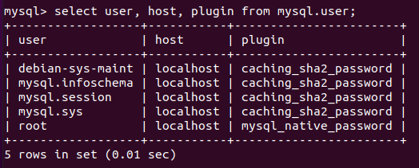

# 内容

1. C/C++连接数据库 -- C/S结构通式
2. 基本sql语句
3. 视图、索引、事务

# 数据库的构成

1. 数据文件--存在磁盘上
2. 数据库管理系统

# 基本模式

基本模式就是用客户端连接数据库服务器，使用TCP连接。

1. 首先要启动数据库服务，即先把TCP服务端运行起来
2. 通过客户端连接数据库


# 相关命令

## linux命令

```bash
service mysql status 	# 查看状态
netstat -natp			# 查看端口状态（看是否有3306即可知mysql服务是否启动）
service mysql restart
service mysql stop
service mysql start


```

连接数据库命令

```bash
mysql -uroot -p
mysql -u用户名 -h主机地址(省略代表本机) -p密码(最好不要在此明文写出)
```

## mysql命令

```sql
select user,host,plugin from mysql.user;
ALTER user 'root'@'localhost' IDENTIFIED WITH mysql_native_password BY
'123'; #注册用本地登录方式的root用户，并且设置密码
```

### 创建数据库

```sql
create database xcg charset=utf8;
select database();
drop database xcg;	#删除
```

### 创建数据表

```sql
```

### 用户管理与授权

* 查看已注册用户信息

相同名字的user可能有不同的登陆方式，这被认为是两个不同的用户，以host字段区分，有两种host，一种是%，一种是localhost。%是远程登录，localhost是本地登录。

```mysql
select user, host, plugin from mysql.user;
```



* 创建用户

```mysql
#创建用户示例
create user 'stu'@'localhost' identified by '123';
#创建用户 并 指定加密方式
create user 'stu1'@'localhost' identified WITH mysql_native_password by '123';
#创建root的远程登录用户	'%'
create user 'root'@'%' identified WITH mysql_native_password by '123';
```

# 远程登录

条件有二

1. 有远程登陆方式的用户以及设置了密码
2. 配置文件中要设置可以远程登陆

配置文件位置在如下位置，需要修改可以用vi打开。注意，修改前需要切换为管理员模式。

```bash
vi /etc/mysql/mysql.conf.d/mysqld.cnf
```

修改完后，需要重启mysql服务器

```bash
service mysql restart
```

# C语言访问mysql

1. 连接数据库使用的头文件和库文件

   ```c
   #include<mysql/mysql.h>	//有的是#include<mysql.h>
   ```

   注意，程序中使用了访问mysql的有关函数接口，需要在代码链接时指定库名: -lmysqlclient

2. 初始化连接句柄

   ```c
   MYSQL *mysql_init(MYSQL *mysql);
   ```

3. 连接数据库

   ```c
   MYSQL *mysql_real_connect(MYSQL *mysql, const char* host,
                             const char* user, const char* passwd
                             const char* db,	unsigned int port
                             const char* unix_socket,
                             unsigned long clientflag);
   ```

   

## 读

1. 指定select语句

   ```c
   char * sql = "select * from student";
   if(n != 0)
   {
       mysql_close(mysql);
       exit(1);
   }
   ```

2. 获取结果集

   ```c
   MYSQL_RES * res = mysql_store_result(mysql);
   if(res == NULL)
   {
       mysql_close(mysql);
       exit(1);
   }
   ```

3. 获取结果集的行数、列数

   ```c
   int num = mysql_num_rows(res);
   int count = mysql_field_count(mysql);
   ```

4. 遍历

   ```c
   for(int i = 0; i<num; ++i)
   {
       MYSQL_ROW row = mysql_fetch_row(res);
       for(int j = 0; j<count; ++j)
       {
           printf("%s\t",row[j]);
       }
       printf("\n");
   }
   ```

5. 收尾工作

   ```c
   mysql_free_result(res);
   mysql_close(mysql);
   exit(0);
   ```

   

# 视图

# 事务

# 索引

创建索引

```mysql
create index t_index on test_index(title(20));
```

