# 内容

1. SQL(Structure Query Language, 结构化查询语言)
2. SQL划分为3个类别，DD(Definition)L、DM(Manipulation)L、DC(Control)L
3. 库操作
4. 表操作
5. CRUD
6. SQL语句和索引的关系

# SQL

SQL即Structure Query Language，结构化查询语言。它是关系型数据库的通用语言。

SQL可划分为以下三种类别：

1. DDL(Data Definition Language)
   * 数据定义语言，与数据库、表、列、索引等数据库对象的定义有关。
   * 常用的语句关键字主要包括`create`、`drop`、`alter`等。
2. DML(Data Manipulation Language)
   * 数据操纵语句，用于添加、删除、更新和查询数据库记录，并检查数据完整性。
   * 常用的语句关键字主要包括`insert`、`delete`、`update`、`select`等。
3. DCL(Data Control Language)
   * 数据控制语句，用于控制不同的许可和访问级别的语句。与数据库、表、字段、用户的访问权限和安全级别有关。
   * 主要的语句关键字包括`grant`、`revoke`。

# 库操作

查询数据库：`show databases;`

创建数据库：`create database dbname;`

删除数据库：`drop database dbname;`

选择数据库：`use dbname;`

我们下面以学校的数据库为例，创建库表。

```mysql
CREATE DATABASE school;
USE school;
```

# 表操作

表的设计要素：

1. 字段的数据类型
2. 完整性约束条件的规范
3. 一对一/一对多/多对多实体关系对应的表设计原则

* 创建表

```mysql
CREATE TABLE user(
    id INT UNSIGNED PRIMARY KEY NOT NULL AUTO_INCREMENT,
    name VARCHAR(50) UNIQUE NOT NULL,
    age TINTINT NOT NULL,
    sex ENUM('M', 'W') NOT NULL
)ENGINE=INNODB DEFAULT CHARSET=utf8;
```

> 对于存储引擎以及默认字符集的配置文件，
> 在windows下为mysql安装目录下的`my.ini`；
> linux下为`/etc/my.cnf`。
> 配置字段为`[mysqld]`

* 查看表

```mysql
show tables;
```


* 查看表的描述信息

```mysql
DESC user;
describe user; # 全拼
```


* 表已创建后，查看表的创建语句

```mysql
SHOW CREATE TABLE user;
SHOW CREATE TABLE user\G # \G结尾和;结尾的区别在于显示方式不同
```


* 删除表 - drop (不光是表的内容，整个表的结构都没了)

```mysql
DROP TABLE user;
```
# 不常用的操作
## View（视图）
在数据库中，左边栏，存在一个view，可以存放一个表中的多个字段的查询结果，也可以存放多个表连接之后的临时结果。
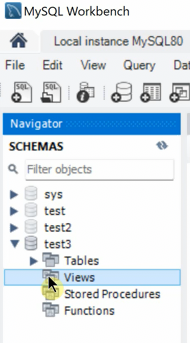

实际用途中，视图可以用于屏蔽与实际数据库的差异，比如数据库的实际字段可能不是用户请求的字段，视图起了个别名。
也可以用于隐藏一些细节。把实际数据库中的内容提取出来的不敏感的部分放到视图里，建立虚拟的字段，供用户使用。
## 存储过程
类似于批处理脚本。可以没有返回值。
## 函数
封装操作过程，可以定义变量，可以有控制语句、循环语句等。必须有返回值。
## 触发器
触发器的作用：比如插入、删除一条记录等等操作，可以进行相应的回调。
触发器是基于行的，即基于记录的。当操作很多行时，不建议使用触发器。
## 总结
存储过程和函数一般是专门操作数据库的后端人员负责的。实际上，存储过程和函数的操作，完全可以在上层服务用高级语言（`C++`等）完成。数据库可以只负责简单的计算。
# CRUD

## Create - 插入

```mysql
INSERT INTO user VALUES(1, 'zhangsan', 20, 'M'); #如果不指明插入的属性，则必须按照字段的顺序全部填入
INSERT INTO user(name,age,sex) VALUES('lisi', 22, 'W'); #指明插入的属性，由于id设置为自增性，所以不用填写。
```

* 每次添加一个

```mysql
INSERT INTO user(name,age,sex) VALUES('zhangsan', 20, 'M');
INSERT INTO user(name,age,sex) VALUES('gaoyang', 22, 'W');
INSERT INTO user(name,age,sex) VALUES('chenwei', 20, 'M');
INSERT INTO user(name,age,sex) VALUES('zhangfan', 21, 'W');
INSERT INTO user(name,age,sex) VALUES('zhanglan', 21, 'W');
```

* 批量增加

```mysql
INSERT INTO user(name,age,sex) VALUES
('zhangsan', 20, 'M'),
('gaoyang', 22, 'W'),
('chenwei', 20, 'M'),
('zhangfan', 21, 'W'),
('zhanglan', 21, 'W');
```

### 最终表中存放的数据是一致的。有啥区别？

我们使用sql，相当于mysql server的一个client。

每次添加一个：

1. client和server进行tcp三次握手，建立通信链路；
2. client发送sql语句到server上接收并处理，返回处理结果；
3. server和client断开连接，tcp四次挥手，释放通信链路。

把每次添加一条记录的操作抽象为3次步骤。则总共需要`3*n`个步骤。

而如果是批量添加：

1. client和server进行tcp三次握手，建立通信链路；
2. client发送sql语句到server上接收并处理，返回处理结果；
3. server和client断开连接，tcp四次挥手，释放通信链路。

则总共仅需`3`个步骤，即可全部插入。

## Delete - 删除

```mysql
DELETE FROM user;				#删除表中所有数据
DELETE FROM user WHERE id=1; 	#只删除id为1的记录
```

## Update - 更新

```mysql
UPDATE user SET age=age+1 WHERE name='gaoyang';	#调正gaoyang的年龄+1
```

## Retrieve - 查询

在这里我们示例一些简单的查询语句。

* 无条件查询全部字段

```mysql
SELECT * FROM user;	#不推荐，最好还是老老实实地写出所有字段名称，因为表的结构之后可能会变更，可能会影响业务代码。
```

* 条件查询指定字段

```mysql
SELECT name,age,sex FROM user WHERE age>=21;
SELECT name,age,sex FROM user WHERE age>20 AND age<22;
SELECT name,age,sex FROM user WHERE BETWEEN 20 AND 22;#闭区间
```

```mysql
# 以下两个sql语句效果一致。
SELECT name,age,sex FROM user WHERE age=20 OR age=21;
SELECT name,age,sex FROM user WHERE age IN (20,21);
```

* 使用通配符查询

```mysql
SELECT name,age,sex FROM user WHERE name LIKE "zhang%";#必须用LIKE，不能用=等号，否则会把%通配符看作实际字符。
```

* 判断为空不用`=`，而用`IS NULL`

```mysql
SELECT name,age,sex FROM user WHERE name IS NULL;
SELECT name,age,sex FROM user WHERE name IS NOT NULL;
```

### 去重

有两种去重的方式

1. `distinct` - 简单地去重
2. `group by` - 功能强大，耗时

```mysql
SELECT DISTINCT age FROM user;
```


### 合并查询 - union

格式如下

```
SELECT expression1, expression2, ..., expression
FROM table1 [WHERE conditions]
UNION [ALL | DISTINCT(default)]
SELECT expression1, expression2, ..., expression
FROM table2 [WHERE conditions];
# union默认为distinct去重，all表示显示重复的记录项
```

```mysql
SELECT name,age,sex
FROM user WHERE age>=21
UNION ALL
SELECT name,age,sex
FROM user WHERE sex='M';
```


# SQL语句和索引的关系

```mysql
SELECT name,age,sex FROM user WHERE age=20 OR age=21;
```

通常都说带`逻辑与`的SQL语句会用到索引，带`逻辑或`的SQL语句不会用到索引。比如上面这句带`逻辑或`的SQL语句不会用到索引吗？错误。

如果仅仅是对于这个SQL语句的表象来说，是不会用到索引的。但是MySQL实际运行过程中是会对用户提交的SQL语句进行优化的。

`OR`的语义是：`要么..., 要么...`。对于逻辑或语句，MySQL有可能将其转化为`union`合并查询，即前后分别执行两个不同的不带逻辑或的SQL语句，这样的SQL语句是完全可以用不到索引的。

类似地，带`in`的SQL语句，表面上是能用到索引；带`not in`的SQL语句，表面上用不到索引。带仅仅限于MySQL不做优化的情况。

所以，会不会用到索引不能只看表面的SQL语句，而要看MySQL实际如何优化。

# 连接查询

表1：Employees

|EmployeeID|Name|DepartmentID|
|---|---|---|
|1|张三|101|
|2|李四|102|
|3|王五|102|
|4|赵六|103|
|​**​5​**​|​**​钱七​**​|​**​NULL​**|

表2：Departments

| DepartmentID | DepartmentName |
| ------------ | -------------- |
| 101          | 人事部            |
| 102          | 技术部            |
| 104          | 财务部            |
## 笛卡尔积（交叉查询）
```mysql
SELECT
    e.EmployeeID AS EmpID,
    e.Name AS EmpName,
    e.DepartmentID AS A_DeptID,
    d.DepartmentID AS B_DeptID,
    d.DepartmentName AS DeptName
FROM Employees e -- 给表起别名 'e'
CROSS JOIN Departments d; -- 给表起别名 'd'
-- 没有 ON 子句！
```

| EmpID | EmpName | A_DeptID | B_DeptID | DeptName |
| ----- | ------- | -------- | -------- | -------- |
| ​​1​​ | 张三      | 101      | ​​101​​  | 人事部      |
| ​​1​​ | 张三      | 101      | ​​102​​  | 技术部      |
| ​​1​​ | 张三      | 101      | ​​104​​  | 财务部      |
| ​​2​​ | 李四      | 102      | ​​101​​  | 人事部      |
| ​​2​​ | 李四      | 102      | ​​102​​  | 技术部      |
| ​​2​​ | 李四      | 102      | ​​104​​  | 财务部      |
| ​​3​​ | 王五      | 102      | ​​101​​  | 人事部      |
| ​​3​​ | 王五      | 102      | ​​102​​  | 技术部      |
| ​​3​​ | 王五      | 102      | ​​104​​  | 财务部      |
| ​​4​​ | 赵六      | 103      | ​​101​​  | 人事部      |
| ​​4​​ | 赵六      | 103      | ​​102​​  | 技术部      |
| ​​4​​ | 赵六      | 103      | ​​104​​  | 财务部      |
| 5     | 钱七      | NULL     | 101      | 人事部      |
| 5     | 钱七      | NULL     | 102      | 技术部      |
| 5     | 钱七      | NULL     | 104      | 财务部      |
## 内连接 (INNER JOIN / JOIN)
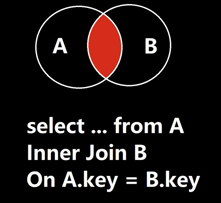


**通俗解释：只保留“两头都能配上对”的数据。​**​ 两边都有记录的才显示出来。

```mysql
SELECT Employees.EmployeeID, Employees.Name, Departments.DepartmentName
FROM Employees
INNER JOIN Departments
ON Employees.DepartmentID = Departments.DepartmentID;
```

结果：

|EmployeeID|Name|DepartmentName|
|---|---|---|
|1|张三|人事部|
|2|李四|技术部|
|3|王五|技术部|

- `赵六`(员工ID4) 的部门ID是103，而部门表里没有103号部门，所以被​**​过滤掉​**​了。
- `财务部`(部门ID 104) 没有任何员工，也​**​没出现​**​。

## 左连接 (LEFT JOIN / LEFT OUTER JOIN)
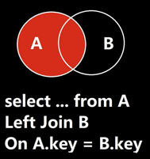


**通俗解释：“左边表全保，右边表尽量配”。​**​ 左表所有记录都显示，右表有匹配的也显示出来，​**​没匹配的补空值（NULL）​**​。

**场景：​**​ 列出​**​所有员工​**​（不管有没有部门），​**​同时​**​如果员工有部门，就显示部门名称（没有部门的员工，部门名称显示为空）。

```mysql
SELECT Employees.EmployeeID, Employees.Name, Departments.DepartmentName
FROM Employees
LEFT JOIN Departments
ON Employees.DepartmentID = Departments.DepartmentID;
```

结果：

| EmployeeID | Name | DepartmentName | DepartmentID |
| ---------- | ---- | -------------- | ------------ |
| 1          | 张三   | 人事部            | 101          |
| 2          | 李四   | 技术部            | 102          |
| 3          | 王五   | 技术部            | 102          |
| 4          | 赵六   | ​**​NULL​**    | 103          |
| 5          | 钱七   | **NULL**       | **NULL**     |

- 左边员工表 (`Employees`) 的 5 条记录​**​全部保留​**​。
- `张三`、`李四`、`王五` 在部门表里找到了匹配 (`101`, `102`)，所以显示部门名称。
- `赵六`(部门ID `103`) 在部门表里没找到对应的名字，所以部门名称显示为 ​**​`NULL`​**​。
- `钱七`（员工ID `5`）的部门 ID 本来就是 NULL，所以无法查询，显示 NULL。
- 部门表中孤立的 `财务部`(`104`) ​**​没出现​**​。
### 如何筛选出A表中外键为NULL的记录
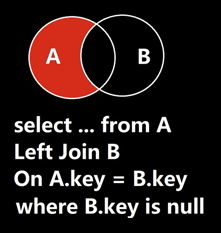
如此查询，便能筛选出钱七。
这个图的意思是：在外面的红色部分，与B没有交集，意思就是说，外面这部分没有记录来自B的外键信息，与B无关联。

## 右连接 (RIGHT JOIN / RIGHT OUTER JOIN)
（其实相当于左连接的镜像，左连接时，A和B表交换书写位置就是他们的右连接）

**通俗解释：“右边表全保，左边表尽量配”。​**​ 右表所有记录都显示，左表有匹配的也显示出来，​**​没匹配的补空值（NULL）​**​。​**​（和左连接方向相反）​**
​
**​场景：​**​ 列出​**​所有部门​**​（不管有没有员工），​**​同时​**​如果部门下有员工，就列出员工姓名；没人的部门，员工信息显示为空。

```mysql
SELECT Employees.EmployeeID, Employees.Name, Departments.DepartmentName
FROM Employees
RIGHT JOIN Departments
ON Employees.DepartmentID = Departments.DepartmentID;
```

结果：

| EmployeeID   | Name         | DepartmentName |
| ------------ | ------------ | -------------- |
| 1            | 张三           | 人事部（101）       |
| 2            | 李四           | 技术部（102）       |
| 3            | 王五           | 技术部（102）       |
| ​**​NULL​**​ | ​**​NULL​**​ | 财务部（104）       |
- 右边部门表 (`Departments`) 的 3 条记录(`101`,`102`,`104`)​**​全部保留​**​。
- `人事部`(`101`)、`技术部`(`102`) 找到了员工 (`张三` / `李四`, `王五`)，显示姓名。
- `财务部`(`104`) 在员工表里没任何员工，所以员工ID和姓名都是 ​**​`NULL`​**​。
- 员工 `赵六` (部门ID `103`)、`钱七`（员工ID `5`，部门ID `NULL`） ​**​没出现​**​（因为它的部门103在部门表里不存在，不属于右表保留范围）。

## 全连接 (FULL JOIN / FULL OUTER JOIN)
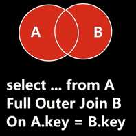


**通俗解释：“两个表我都全要！管你配不配得上！”​**​ 两个表的所有记录都保留。能配上对的就合并成一行显示。配不上对的，各自那边的空缺就用 ​**​`NULL`​**​ 填充。

**​场景：​**​ 想做一个​**​完整的组织结构/花名册快照​**​，既要看到所有员工（包括没部门的），也要看到所有部门（包括没员工的）。信息齐全！

```mysql
SELECT Employees.EmployeeID, Employees.Name, Departments.DepartmentName
FROM Employees
FULL JOIN Departments
ON Employees.DepartmentID = Departments.DepartmentID;
```
结果：

| EmployeeID   | Name         | DepartmentName | DepartmentID |
| ------------ | ------------ | -------------- | ------------ |
| 1            | 张三           | 人事部            | 101          |
| 2            | 李四           | 技术部            | 102          |
| 3            | 王五           | 技术部            | 102          |
| 4            | 赵六           | ​**​NULL​**​   | 103          |
| 5            | 钱七           | **NULL**       | NULL         |
| ​**​NULL​**​ | ​**​NULL​**​ | 财务部            | 104          |
- ​**​全部 6 种情况都展示出来了：​**​
    1. 有员工有部门 (`张三-人事部`, `李四-技术部`, `王五-技术部`)。
    2. 有员工​**​没​**​(匹配的)部门 (`赵六`、`钱七`)。
    3. 有部门​**​没​**​(匹配的)员工 (`财务部`)。
### 如何筛选出A表或B表的外键为NULL的记录
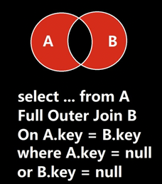

如此查询，便能筛选出钱七。

由于本例中B表没有外键，因此无法体现B表中没有外键的记录。


## 连接查询（Join）和联合查询（Union）的区别
​**​联合查询（Union Query）：​**​ 这个概念容易和连接混淆。
- ​**​通俗解释：​**​ 把两张结构_相似_的表 ​**​上下拼起来​**​。就像把《番茄供应商名单》和《鸡蛋供应商名单》摞在一起，变成《食材供应商总名单》。注意：是垂直叠加！
- ​**​核心要求：​**​
    - 两张表查询结果的​**​列数必须一样​**​。
    - 对应列的数据类型要​**​兼容​**​（比如数字对数字，字符串对字符串）。

```mysql
SELECT EmployeeID, Name FROM Employees -- 查员工ID和名字
UNION -- 或者 UNION ALL (包含重复行)
SELECT DepartmentID, DepartmentName FROM Departments; -- 查部门ID和名字
```

| EmployeeID/DepartmentID | Name/DepartmentName |
| ----------------------- | ------------------- |
| 1                       | 张三                  |
| 2                       | 李四                  |
| 3                       | 王五                  |
| 4                       | 赵六                  |
| 5                       | 钱七                  |
| 101                     | 人事部                 |
| 102                     | 技术部                 |
| 104                     | 财务部                 |
注意：这个例子不常用，只是为了展示UNION效果。UNION更常用于合并同类型数据，比如不同年份的销售记录表

## `SELECT ... FROM A, B WHERE ...`和`SELECT ... FROM A JOIN B ON ...`的区别
这两者​**​功能上对于内连接(INNER JOIN)是等效的​**​，但存在关键区别：​**​语法标准、可读性、维护性以及错误预防能力​**​。

| 特性                | `SELECT ... FROM A, B WHERE ...` (隐式连接)      | `SELECT ... FROM A JOIN B ON ...` (显式连接)      |
| ----------------- | -------------------------------------------- | --------------------------------------------- |
| ​**​语法本质​**​      | 老式SQL标准，FROM子句用逗号分隔表，WHERE定义条件和连接            | 新式SQL-92标准，用JOIN关键字明确指定连接类型和条件                |
| ​**​连接类型​**​      | 默认是​**​交叉连接(CROSS JOIN)​**​，需要WHERE过滤才能变成内连接 | ​**​明确指出连接类型​**​ (INNER/LEFT/RIGHT/FULL JOIN) |
| ​**​连接条件位置​**​    | 和过滤条件​**​混在WHERE子句中​**​                      | 连接条件在​**​独立的ON子句​**​，过滤条件在WHERE（逻辑分离）         |
| ​**​可读性 & 维护性​**​ | 差（复杂查询时条件混乱）                                 | 优（清晰区分连接条件和过滤逻辑）                              |
| ​**​防止笛卡尔积错误​**​  | 弱（忘记WHERE会导致全组合）                             | 强（JOIN必须配ON或USING，否则语法错误）                     |
| ​**​支持外连接​**​     | 部分数据库不支持（如Oracle老语法用`(+)`）                   | ​**​所有数据库都支持​**​标准外连接写法(LEFT/RIGHT/FULL JOIN) |
| ​**​现代推荐度​**​     | ⚠️ 不推荐（尤其复杂查询）                               | ✅ ​**​强烈推荐​**                                 |
# 练习
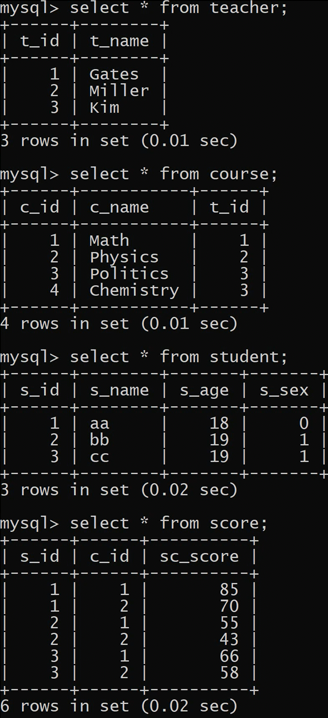

查询平均成绩大于60分的同学的学号和平均成绩。
```mysql
select s_id, avg(sc_score)
from score
group by s_id
having avg(sc_score)>60
```
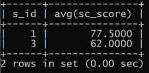


查询所有同学的学号、姓名、选课总数、总成绩。
```mysql
select s_id, s_name, count(c_id), sum(sc_score) from student left join score on student.s_id = score.s_id;
```
也可以这么写，嵌套select：
```mysql
select student.s_id, student.s_name, count_id as XKS, sum_id as ZCJ
from student
left join
(select s_id, count(c_id), as count_id, sum(sc_score) as sum_id from score group by s_id) as ss
on student.s_id = ss.s_id;
```
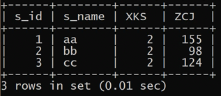

查询没有选全部课的同学的学号、姓名。
```mysql
select student.s_id, student.s_name from student, score
where student.s_id = score.s_id
group by student.s_id
having count(score.c_id) < (select count(c_id) from course);
```

先让score表补充一列学生的姓名。
再让此临时表，按学号（确定1人）分组，每一组的`s_id`数就是这个人选的课程数。

结果
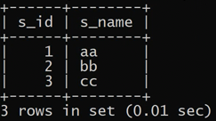

删除`Kim`老师课的Score表记录
为了看到效果，临时增加一条成绩。
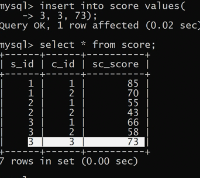

```mysql
delete from score
where c_id in
(select course.c_id from course inner join teacher on course.t_id = teacher.t_id where teacher.t_name = 'Kim');
```
后面的select，先让course表补充一列老师的名字，之后筛选出老师名字是Kim的course；
in用于批量处理。

结果：
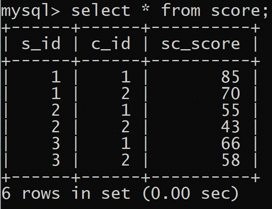

