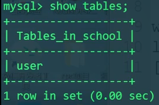
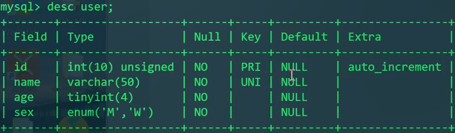
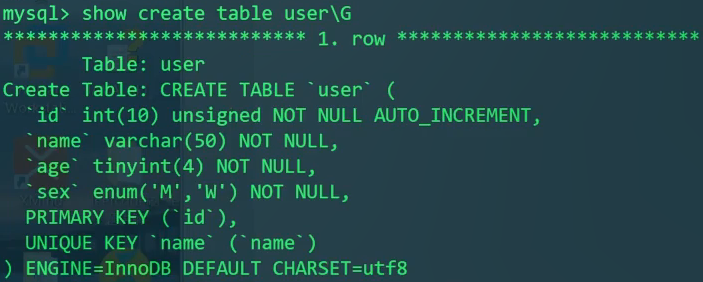
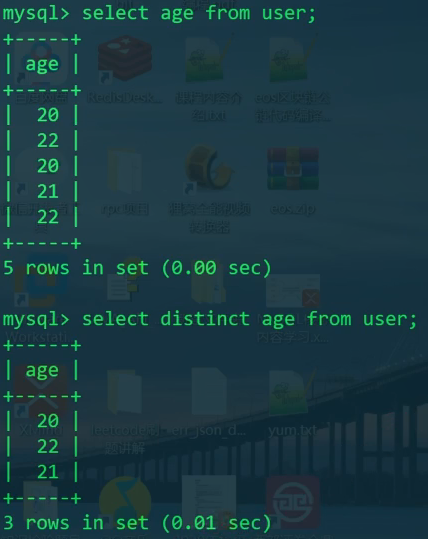
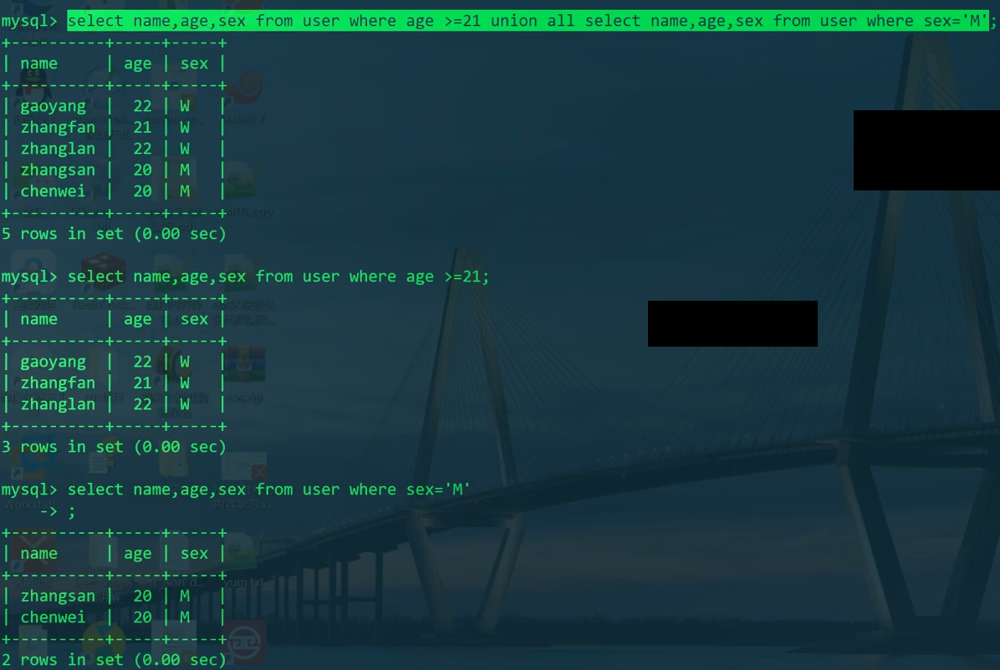

# 内容

1. SQL(Structure Query Language, 结构化查询语言)
2. SQL划分为3个类别，DD(Definition)L、DM(Manipulation)L、DC(Control)L
3. 库操作
4. 表操作
5. CRUD
6. SQL语句和索引的关系

# SQL

SQL即Structure Query Language，结构化查询语言。它是关系型数据库的通用语言。

SQL可划分为以下三种类别：

1. DDL(Data Definition Language)
   * 数据定义语言，与数据库、表、列、索引等数据库对象的定义有关。
   * 常用的语句关键字主要包括`create`、`drop`、`alter`等。
2. DML(Data Manipulation Language)
   * 数据操纵语句，用于添加、删除、更新和查询数据库记录，并检查数据完整性。
   * 常用的语句关键字主要包括`insert`、`delete`、`update`、`select`等。
3. DCL(Data Control Language)
   * 数据控制语句，用于控制不同的许可和访问级别的语句。与数据库、表、字段、用户的访问权限和安全级别有关。
   * 主要的语句关键字包括`grant`、`revoke`。

# 库操作

查询数据库：`show databases;`

创建数据库：`create database dbname;`

删除数据库：`drop database dbname;`

选择数据库：`use dbname;`

我们下面以学校的数据库为例，创建库表。

```mysql
CREATE DATABASE school;
USE school;
```

# 表操作

表的设计要素：

1. 字段的数据类型
2. 完整性约束条件的规范
3. 一对一/一对多/多对多实体关系对应的表设计原则

* 创建表

```mysql
CREATE TABLE user(
    id INT UNSIGNED PRIMARY KEY NOT NULL AUTO_INCREMENT,
    name VARCHAR(50) UNIQUE NOT NULL,
    age TINTINT NOT NULL,
    sex ENUM('M', 'W') NOT NULL
)ENGINE=INNODB DEFAULT CHARSET=utf8;
```

> 对于存储引擎以及默认字符集的配置文件，
> 在windows下为mysql安装目录下的`my.ini`；
> linux下为`/etc/my.cnf`。
> 配置字段为`[mysqld]`

* 查看表

```mysql
show tables;
```



* 查看表的描述信息

```mysql
DESC user;
describe user; # 全拼
```



* 表已创建后，查看表的创建语句

```mysql
SHOW CREATE TABLE user;
SHOW CREATE TABLE user\G # \G结尾和;结尾的区别在于显示方式不同
```



* 删除表 - drop (不光是表的内容，整个表的结构都没了)

```mysql
DROP TABLE user;
```

# CRUD

## Create - 插入

```mysql
INSERT INTO user VALUES(1, 'zhangsan', 20, 'M'); #如果不指明插入的属性，则必须按照字段的顺序全部填入
INSERT INTO user(name,age,sex) VALUES('lisi', 22, 'W'); #指明插入的属性，由于id设置为自增性，所以不用填写。
```

* 每次添加一个

```mysql
INSERT INTO user(name,age,sex) VALUES('zhangsan', 20, 'M');
INSERT INTO user(name,age,sex) VALUES('gaoyang', 22, 'W');
INSERT INTO user(name,age,sex) VALUES('chenwei', 20, 'M');
INSERT INTO user(name,age,sex) VALUES('zhangfan', 21, 'W');
INSERT INTO user(name,age,sex) VALUES('zhanglan', 21, 'W');
```

* 批量增加

```mysql
INSERT INTO user(name,age,sex) VALUES
('zhangsan', 20, 'M'),
('gaoyang', 22, 'W'),
('chenwei', 20, 'M'),
('zhangfan', 21, 'W'),
('zhanglan', 21, 'W');
```

### 最终表中存放的数据是一致的。有啥区别？

我们使用sql，相当于mysql server的一个client。

每次添加一个：

1. client和server进行tcp三次握手，建立通信链路；
2. client发送sql语句到server上接收并处理，返回处理结果；
3. server和client断开连接，tcp四次挥手，释放通信链路。

把每次添加一条记录的操作抽象为3次步骤。则总共需要`3*n`个步骤。

而如果是批量添加：

1. client和server进行tcp三次握手，建立通信链路；
2. client发送sql语句到server上接收并处理，返回处理结果；
3. server和client断开连接，tcp四次挥手，释放通信链路。

则总共仅需`3`个步骤，即可全部插入。

## Delete - 删除

```mysql
DELETE FROM user;				#删除表中所有数据
DELETE FROM user WHERE id=1; 	#只删除id为1的记录
```

## Update - 更新

```mysql
UPDATE user SET age=age+1 WHERE name='gaoyang';	#调正gaoyang的年龄+1
```

## Retrieve - 查询

在这里我们示例一些简单的查询语句。

* 无条件查询全部字段

```mysql
SELECT * FROM user;	#不推荐，最好还是老老实实地写出所有字段名称，因为表的结构之后可能会变更，可能会影响业务代码。
```

* 条件查询指定字段

```mysql
SELECT name,age,sex FROM user WHERE age>=21;
SELECT name,age,sex FROM user WHERE age>20 AND age<22;
SELECT name,age,sex FROM user WHERE BETWEEN 20 AND 22;#闭区间
```

```mysql
# 以下两个sql语句效果一致。
SELECT name,age,sex FROM user WHERE age=20 OR age=21;
SELECT name,age,sex FROM user WHERE age IN (20,21);
```

* 使用通配符查询

```mysql
SELECT name,age,sex FROM user WHERE name LIKE "zhang%";#必须用LIKE，不能用=等号，否则会把%通配符看作实际字符。
```

* 判断为空不用`=`，而用`IS NULL`

```mysql
SELECT name,age,sex FROM user WHERE name IS NULL;
SELECT name,age,sex FROM user WHERE name IS NOT NULL;
```

### 去重

有两种去重的方式

1. `distinct` - 简单地去重
2. `group by` - 功能强大，耗时

```mysql
SELECT DISTINCT age FROM user;
```



### 合并查询 - union

格式如下

```
SELECT expression1, expression2, ..., expression
FROM table1 [WHERE conditions]
UNION [ALL | DISTINCT(default)]
SELECT expression1, expression2, ..., expression
FROM table2 [WHERE conditions];
# union默认为distinct去重，all表示显示重复的记录项
```

```mysql
SELECT name,age,sex
FROM user WHERE age>=21
UNION ALL
SELECT name,age,sex
FROM user WHERE sex='M';
```



# SQL语句和索引的关系

```mysql
SELECT name,age,sex FROM user WHERE age=20 OR age=21;
```

通常都说带`逻辑与`的SQL语句会用到索引，带`逻辑或`的SQL语句不会用到索引。比如上面这句带`逻辑或`的SQL语句不会用到索引吗？错误。

如果仅仅是对于这个SQL语句的表象来说，是不会用到索引的。但是MySQL实际运行过程中是会对用户提交的SQL语句进行优化的。

`OR`的语义是：`要么..., 要么...`。对于逻辑或语句，MySQL有可能将其转化为`union`合并查询，即前后分别执行两个不同的不带逻辑或的SQL语句，这样的SQL语句是完全可以用不到索引的。

类似地，带`in`的SQL语句，表面上是能用到索引；带`not in`的SQL语句，表面上用不到索引。带仅仅限于MySQL不做优化的情况。

所以，会不会用到索引不能只看表面的SQL语句，而要看MySQL实际如何优化。
