# 内容

1. 排序 - order by
   1. 升序 - asc (默认)
   2. 降序 - desc
2. 分组 - group by

# 排序

格式如下：

```mysql
SELECT * FROM tablename ORDER BY 字段1,字段2,... [ASC(default) | DESC];
```

其中，`ORDER BY`后面的条件是优先级规则。先比照`字段1`，若相同则比照`字段2`，以此类推；其次，后面的`ASC`表示升序排列，是默认选项，如果欲按照降序排列则需指明`DESC`。

## 排序查询性能分析

```mysql
SELECT * FROM user ORDER BY age;
EXPLAIN SELECT * FROM user ORDER BY age;
```

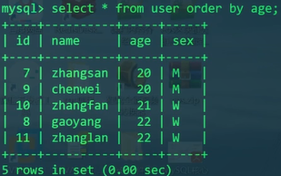

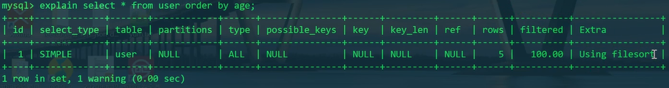

explain之后发现`rows=5`，如果单纯地进行排序而不加任何条件，将会进行整表查询。

`type`为`ALL`，意为整表查询，以前我们用带索引的查询此处为`const`，表示常量时间，此处的`ALL`则代表复杂度较高；`Extra`为`Using filesort`，这个标志意味着，此查询涉及到磁盘IO和外排序，将严重影响性能。

外排序的意思就是，有时磁盘的数据量很大，无法全部装到内存中处理，一般会采用n路归并排序思想，这将会涉及很多磁盘IO，效率低下。

再来看一个。

```mysql
EXPLAIN SELECT * FROM user ORDER BY name;
```

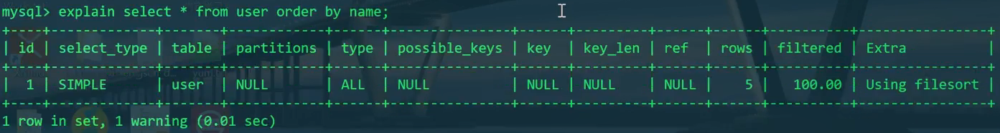

explain发现即使按照字段`name`排序，结果还是与上面的效果一致。

再来一个。

```mysql
EXPLAIN SELECT name FROM user ORDER BY name;
```

这次我们没有查按name排序结果后的所有字段，而是只查了字段`name`。

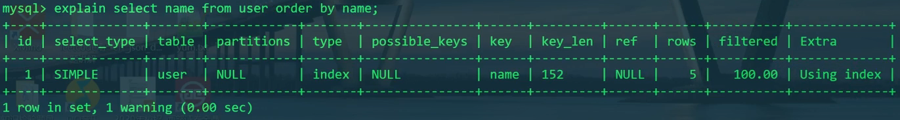

explain发现，变化显著。

首先`type`变为`index`；`key`变为`name`；最后，`Extra`变为`Using index`。

再试一个。

```mysql
EXPLAIN SELECT age FROM user ORDER BY age;
```

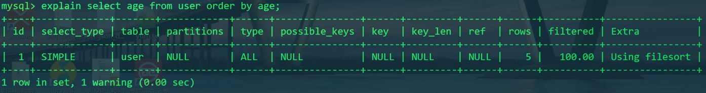

explain发现，并不是说按啥排序并且只查啥的话性能就高。我们发现按age排序，只查age的话Extra仍是`Using filesort`。

结论就是：order by的性能不仅与待排序的字段是否有索引有关，还与select选择的列字段有关系。这与主索引树、辅助索引树有关，也就是聚集索引和非聚集索引的搜索过程有关，也涉及到回表问题。

# 分组

按照字段分组，字段内容相同的放在一组。

```mysql
SELECT * FROM user;
```

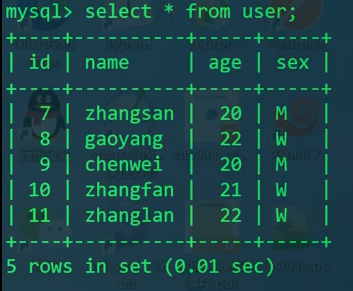

```mysql
SELECT DISTINCT age FROM user;
```

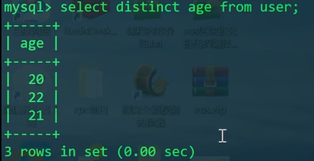

```mysql
SELECT age FROM user GROUP BY age;
```


## 常用语句

### 分组并显示该组记录的条数

```mysql
SELECT age,COUNT(age) AS number FROM user GROUP BY age;#AS可省略
```

### 分组后条件筛选 - HAVING

```mysql
SELECT age,COUNT(age) number FROM user GROUP BY age HAVING age>20;
```

也可以分组前条件筛选 - where

```mysql
SELECT age,COUNT(age) number FROM user WHERE age>20 GROUP BY age;
```

### 多字段分组

```mysql
SELECT age,sex FROM user GROUP BY age,sex;
```

这个语句将会把age和sex同时一样的记录分组。

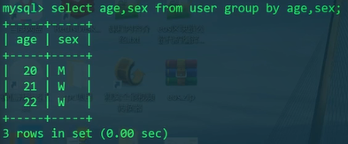

```mysql
SELECT age,sex,COUNT(*) FROM user GROUP BY age,sex;
```


`count(*)`相当于求的是记录的行数。

### 与排序结合

```mysql
SELECT age,sex,COUNT(*) FROM user GROUP BY age,sex ORDER BY age;
```

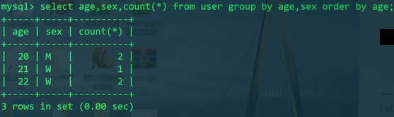

## 性能分析

首先我们先确定一下此表的结构属性。再用Explain进行性能分析。

```mysql
DESC user;
EXPLAIN SELECT age FROM user GROUP BY age;
```

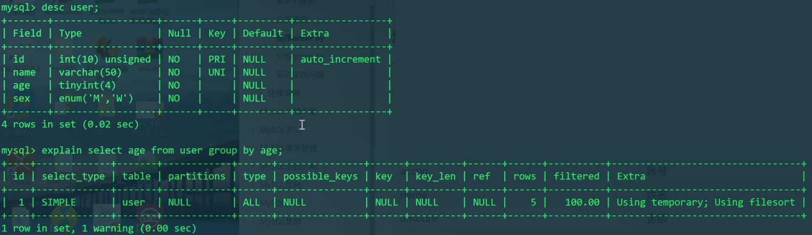

desc发现，id有主键索引，name有唯一性索引。其他的age、sex无索引。

explain发现，`Extra`中为`Using temporary; Using filesort`。说明此分组查询需要：产生临时表+使用外排序。效率极差。

实际上group by也会进行类似order by的排序。分组查询是先把分组以后的数据放到临时表中，然后在临时表中进行排序。由于age没有索引，所以需要使用外排序。

试试按name分组。

```mysql
EXPLAIN SELECT name FROM user GROUP BY name;
```

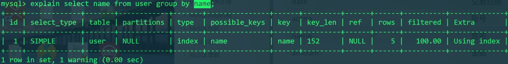

explain发现，`Extra`为`Using index`。变化是很显著的。所以GROUP BY后面加索引也是非常有必要的。

# 练习

某银行代缴话费主流水表（`bank_bill`）结构：

| 字段名 | 描述     |
| ------ | -------- |
| serno  | 流水号   |
| date   | 交易日期 |
| accno  | 账号     |
| name   | 姓名     |
| amount | 金额     |
| brno   | 缴费网点 |

题目：1）统计表中缴费的总笔数和总金额；2）给出一个SQL，按网点和日期统计每个网点每天的营业额，并按照营业额进行倒序排序。

```mysql
CREATE TABLE bank_bill(
    serno BIGINT UNSIGNED PRIMARY KEY NOT NULL AUTO_INCREMENT,
    date DATE NOT NULL,
    accno VARCHAR(100) NOT NULL,
    name VARCHAR(50) NOT NULL,
    amount DECIMAL(10,1) NOT NULL,
    brno VARCHAR(150) NOT NULL
);
INSERT INTO bank_bill VALUES
('101000','2022-3-1','111','zhang',100,'高新区支行'),
('101001','2022-3-1','222','liu',200,'碑林区支行'),
('101002','2022-3-1','333','gao',300,'高新区支行'),
('101003','2022-3-1','444','lian',150,'雁塔区支行'),
('101004','2022-3-1','555','lan',360,'雁塔区支行'),
('101005','2022-3-1','666','wang',300,'碑林区支行'),
('101006','2022-3-2','777','wei',500,'碑林区支行'),
('101007','2022-3-2','888','yao',50,'碑林区支行'),
('101008','2022-3-2','111','zhang',100,'高新区支行'),
('101009','2022-3-2','222','liu',200,'雁塔区支行'),
('101010','2022-3-3','333','gao',300,'高新区支行'),
('101011','2022-3-3','444','lian',150,'雁塔区支行'),
('101012','2022-3-3','555','lan',360,'雁塔区支行'),
('101013','2022-3-3','666','wang',300,'碑林区支行');
```

1）总笔数、总金额：

```mysql
SELECT COUNT(serno),SUM(amount) FROM bank_bill;
```

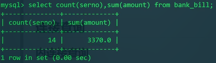

2）按网点和日期统计每天营业额，倒序。

```mysql
SELECT brno,date,sum(amount) AS total FROM bank_bill GROUP BY brno,date ORDER BY brno,total DESC;
```

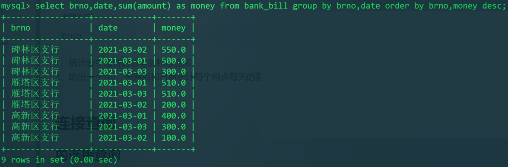