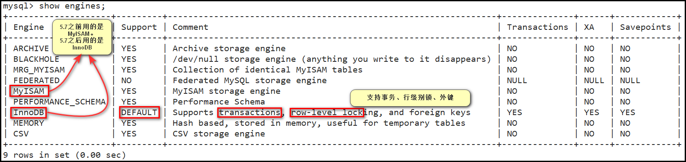

# 内容

1. 存储引擎

# 存储引擎

MySQL的一大特点就是支持插件式的存储引擎，即其存储引擎是可更换的，支持不同的存储引擎。

那么，存储引擎代表的是什么呢？

在创建/使用表时，有三大部分需要管理：

1. 表的结构（有几个字段，字段的类型，约束条件）
2. 数据
3. 索引（有利于加速表的查询）

存储引擎直接影响以上三大部分内容的存储方式。即，不同的存储引擎，对应的数据及其结构的存储方式是不一样的。

# 配置文件

windows下是`my.ini`

Linux下是`my.cnf`，在`/etc`下。

# 数据库、表对应的文件

都存到了`/var/lib/mysql`下。

对该目录进行读取时需要进入root用户模式。

1. `ls`后发现，每个数据库都会有一个同名的文件夹，里面存放着库中的表。
2. 进一个文件夹，发现里面每一张表都对应有多种后缀名不同的文件。
   1. `.frm`表示表的框架信息，即frame。MyISAM和InnoDB存储引擎都要用。
   2. `.MYD`、`.MYI`是MyISAM存储引擎下的数据表的文件。
      1. `.MYD`表示使用MyISAM引擎的表的数据信息，即MyISAM Data。
      2. `.MYI`表示使用MyISAM引擎的表的索引信息，即MyISAM Index。
   3. `.ibd`是InnoDB存储引擎下的数据表的文件，同时存储了表的数据信息和索引信息。

> 可以从表的数据文件的存储方式 - 延伸到索引上

## 总结

1. InnoDB的底层文件存储是`.frm`+`.ibd`，其中`.frm`存储的是表的结构，`.ibd`存储的是数据+索引；
2. MyISAM的底层文件，表结构、表数据、表索引，各有一个对应的文件。

# 相关命令

```mysql
SHOW engines;
```



# 各存储引擎区别

| 存储引擎 | 锁机制 | B树索引 | 哈希索引 | 外键   | 事务   | 索引缓存 | 数据缓存 |
| -------- | ------ | ------- | -------- | ------ | ------ | -------- | -------- |
| MyISAM   | 表锁   | 支持    | 不支持   | 不支持 | 不支持 | 支持     | 不支持   |
| InnoDB   | 行锁   | 支持    | 不支持   | 支持   | 支持   | 支持     | 支持     |
| Memory   | 表锁   | 支持    | 支持     | 不支持 | 不支持 | 支持     | 支持     |

**锁机制**：表示数据库在并发请求访问的时候，多个事务在操作时，并发操作的粒度。

**B树索引、哈希索引**：加速SQL的查询速度。

**外键**：子表的字段依赖父表的主键，设置了两张表的依赖关系。

**事务**：多个SQL语句，保证它们共同执行的原子操作，要么全部成功，要么失败。不能只成功一部分，失败后需要回滚事务。

**索引缓存和数据缓存**：和MySQL Server的查询缓存相关，在没有对数据和索引做修改之前，重复查询可以不用进行磁盘IO，读取上一次内存中查询的缓存就可以了，提升数据库的性能。

## 数据的存储方式

MyISAM不支持事务、也不支持外键。索引采用**非聚集索引**，其优势是访问的速度快，对事务完整性没有要求，以`SELECT`、`INSERT`为主的应用基本上都可以使用这个存储引擎来创建表。

**MyISAM**的表在磁盘上存储成 3 个文件，其文件名都和表名相同，扩展名分别是：
`.frm`（存储表定义）
`.MYD`（MYData，存储数据）
`.MYI `（MYIndex，存储索引）

**InnoDB**存储引擎提供了具有提交、回滚和崩溃恢复能力的事务安全，支持自动增长列，外键等功能，索引采用**聚集索引**，索引和数据存储在同一个文件，所以InnoDB的表在磁盘上有两个文件，其文件名都和表名相同，扩展名分别是：
`.frm`（存储表的定义）
`.ibd`（存储数据和索引）

**MEMORY**存储引擎使用存在内存中的内容来创建表。每个MEMORY表实际**只对应一个磁盘文件，格式是.frm**（表结构定义）。
MEMORY类型的表访问非常快，因为它的数据是放在内存中的，并且默认使用**HASH索引**（不适合做范围查询），但是一旦服务关闭，表中的数据就会丢失掉。

