# 内容

1. 简单的查询语句
2. 分页查询 - limit
3. 排序、分组
4. 连接查询（多表查询）

# 存储过程

为了模拟实际中的大数据场景，我们创建一个`t_user`数据库，`t_user`表，向其中添加200万条记录。

表的创建：

```mysql
create table t_user(
    id int(11) NOT NULL AUTO_INCREMENT,
    email varchar(255) DEFAULT NULL,
    password varchar(255) DEFAULT NULL,
    PRIMARY KEY(id)
)engine=InnoDB AUTO_INCREMENT=1000001 DEFAULT CHARSET=utf8;
```


需要用到存储过程。

1. 首先改变分隔符`delimiter $`
2. 创建存储过程

```mysql
Create Procedure add_t_user(IN n INT)
BEGIN
DECLARE i INT;
SET i=0;

WHILE i<n DO
INSERT INTO t_user VALUES(NULL, CONCAT(i+1,'@xcg.com'),i+1);
SET i=i+1;
END WHILE;
END$
```

创建好后，可以`show create procedure add_t_user\G`查看此存储过程。

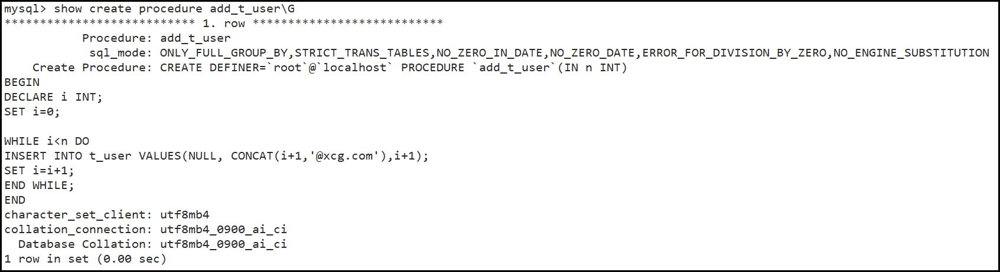

3. 改回分隔符`delimiter ;`
4. 调用存储过程`call add_t_user(2000000);`，括号内的参数为要添加的记录数。

插入数据成功后，可以对其测试

```mysql
SELECT COUNT(*) FROM t_user;	#应为2000000
```

```mysql
SELECT * FROM t_user LIMIT 10;
```

```mysql
SELECT * FROM t_user WHERE email='1@xcg.com';
EXPLAIN SELECT * FROM t_user WHERE email='1@xcg.com';
```

# 简单的查询语句

在这里我们示例一些简单的查询语句。

* 无条件查询全部字段

```mysql
SELECT * FROM user;	#不推荐，最好还是老老实实地写出所有字段名称，因为表的结构之后可能会变更，可能会影响业务代码。
```

* 条件查询指定字段

```mysql
SELECT name,age,sex FROM user WHERE age>=21;
SELECT name,age,sex FROM user WHERE age>20 AND age<22;
SELECT name,age,sex FROM user WHERE BETWEEN 20 AND 22;#闭区间
```

```mysql
# 以下两个sql语句效果一致。
SELECT name,age,sex FROM user WHERE age=20 OR age=21;
SELECT name,age,sex FROM user WHERE age IN (20,21);
```

* 使用通配符查询

```mysql
SELECT name,age,sex FROM user WHERE name LIKE "zhang%";#必须用LIKE，不能用=等号，否则会把%通配符看作实际字符。
```

* 判断为空不用`=`，而用`IS NULL`

```mysql
SELECT name,age,sex FROM user WHERE name IS NULL;
SELECT name,age,sex FROM user WHERE name IS NOT NULL;
```

## 去重

有两种去重的方式

1. `distinct` - 简单地去重
2. `group by` - 功能强大，耗时

```mysql
SELECT DISTINCT age FROM user;
```


## 合并查询 - union

格式如下

```
SELECT expression1, expression2, ..., expression
FROM table1 [WHERE conditions]
UNION [ALL | DISTINCT(default)]
SELECT expression1, expression2, ..., expression
FROM table2 [WHERE conditions];
# union默认为distinct去重，all表示显示重复的记录项
```

```mysql
SELECT name,age,sex
FROM user WHERE age>=21
UNION ALL
SELECT name,age,sex
FROM user WHERE sex='M';
```


# 分页查询 - limit

需要掌握的内容：

1. limit分页查询的语法
2. `explain`可以查看SQL语句大致的执行计划
3. limit在何种情况下能够提升查询效率，使用limit需要注意哪些
4. 项目中用到分页处理时，如何编写相应的SQL语句

## 语法

### limit M,N - limit N

```mysql
SELECT * FROM user LIMIT N;		#表示取user表第0~N条记录的所有字段，相当于取前N条
SELECT * FROM user LIMIT M,N;	#表示取user表第M~(M+N)条记录的所有字段，相当于先偏移M条，再取N条。
SELECT * FROM user LIMIT N OFFSET M;	#同LIMIT M,N
```

limit只是改变了数据显示的效果吗？对查询的效率有没有提升呢？先引入一个关键字`explain`。

>explain是一个关键字，是定位SQL、索引性能的有利工具。
>
>使用它加载SQL语句开头，可以查看SQL语句的执行计划。
>
>explain展示的字段：
>
>1. id: 编号
>2. `select_type`: 如`SIMPLE`，表示查询语句的复杂程度类型
>3. table: 如`user`，当前表
>4. partitions: NULL
>5. type: const
>6. `possible_keys`: name，可能用到的索引
>7. key: name，实际用到的索引
>8. `key_len`: 152
>9. ref: const
>10. rows: 1，查询语句可能需要扫描的行数。
>11. filtered: 100.00
>12. Extra: NULL

```mysql
EXPLAIN SELECT * FROM user WHERE name='zhangsan';
```

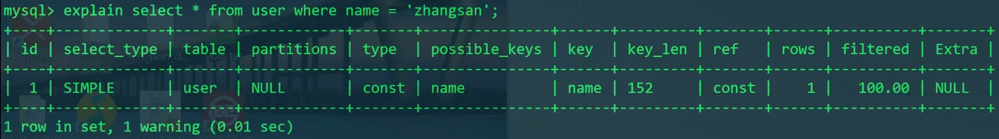

我们发现，搜索"zhangsan"只扫了1行。可能你会猜测是因为他在表的第一行，那么试试查找其他人扫描几行呢？

```mysql
EXPLAIN SELECT * FROM user WHERE name='chenwei';
EXPLAIN SELECT * FROM user WHERE name='zhanglan';
```

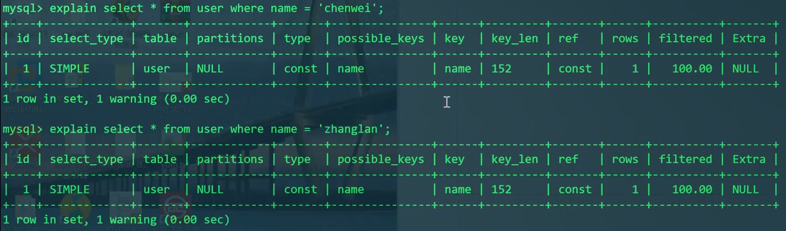

发现仍是`row=1`。

这是因为name有索引。

我们再试试与age有关的查询语句。

```mysql
EXPLAIN SELECT * FROM user WHERE age=20;
```

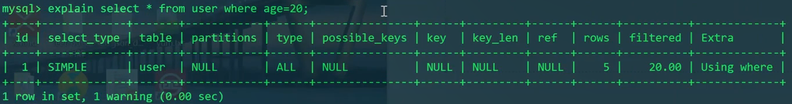

我们发现现在的row为5。相当于把user表进行了全表搜索。

相比于与name有关的查询语句，由于age没有索引，查询的效率就很低。

怎么尽可能提高效率呢？

如果我们只想得到第一个满足条件的记录，那么可以用limit。

```mysql
SELECT * FROM user WHERE age=20 LIMIT 1;
```

理论上，EXPLAIN此语句的rows应较小，但实际上rows还是5。

```mysql
EXPLAIN SELECT * FROM user WHERE age=20 LIMIT 1;
```

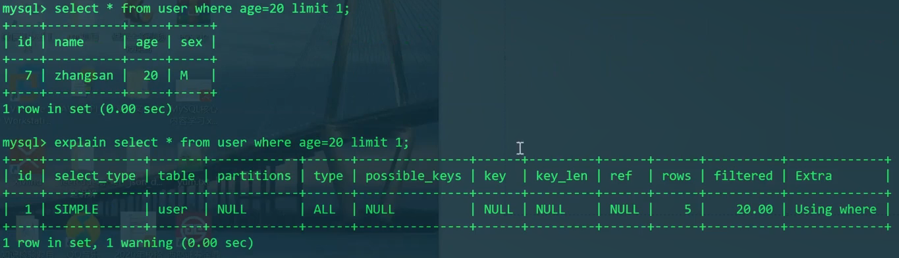

说明EXPLAIN不能看到limit的作用。

---

我们现在对拥有200w条记录的`t_user`表进行测试。

```mysql
SELECT * FROM t_user WHERE email='1@xcg.com';		#约0.44s
EXPLAIN SELECT * FROM t_user WHERE email='1@xcg.com';
SELECT * FROM t_user WHERE email='1@xcg.com' LIMIT 1;#约0.00s
```

```mysql
SELECT * FROM t_user LIMIT 1000000, 1;#约0.20s，说明偏移也很费时
SELECT * FROM t_user WHERE email='1000001@xcg.com';	#约0.44s
SELECT * FROM t_user WHERE email='1000001@xcg.com' LIMIT 1;	#约0.23s
```

## 分页需要注意的事情

首先需要明白分页的参数`pagenum=20`，表示每页显示的记录数为20；`pageno`表示当前的页码。

那么，根据LIMIT的`M,N`规则，计算出下面的语句公式：

```mysql
SELECT * FROM user LIMIT (pageno-1)*pagenum, pagenum;
```

这样就实现了每一页显示对应位置的20条记录。

但是，有个很现实的性能问题，我们总不能让越往后的页数查出来的时间越久吧？因为LIMIT M,N默认是全表顺序查询，查后面的数据时，会在前面查很多冗余的信息，浪费了时间。

```mysql
SELECT * FROM t_user LIMIT 0, 20;	#0.00s
SELECT * FROM t_user LIMIT 1000000, 20;	#0.23s
```

可以用一个思想来优化性能——过滤。

我们知道，其主键id是有规律的，可根据对id的限制来进行过滤。

```mysql
SELECT * FROM t_user WHERE id>2000000 LIMIT 0, 20;#0.00s
```

上面的语句和`SELECT * FROM t_user LIMIT 1000000, 20;`查询出来的结果一样。但是性能却大大提升。

即

```mysql
SELECT * FROM user WHERE id>上一页最后一条数据的id值 LIMIT 0, 20;
```

但是，不是每个分页都通过id来解决，具体问题具体分析，选择合适的索引去过滤，不一定非要选id。

LIMIT可以很好地帮助我们在没有索引的情况下，以相应的列作为过滤条件时，提高效率。

# 连接查询

分为两种

1. 内连接查询
2. 外连接查询
   1. left连接查询
   2. right连接查询

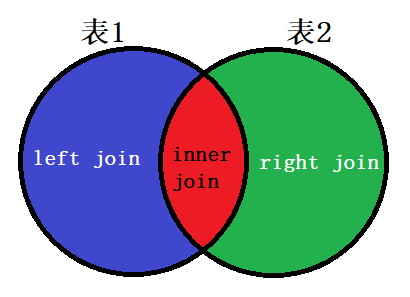

## 内连接

场景分析：学生、课程、考试结果

student: `uid、name、age、sex`

course: `cid、cname、credit`

exam: `uid、cid、time、score`

```mysql
CREATE TABLE student(
    uid INT UNSIGNED PRIMARY KEY NOT NULL AUTO_INCREMENT,
    name VARCHAR(50) NOT NULL,
    age TINYINT UNSIGNED NOT NULL,
    sex ENUM('M', 'W') NOT NULL
);
CREATE TABLE course(
    cid INT UNSIGNED PRIMARY KEY NOT NULL AUTO_INCREMENT,
    cname VARCHAR(50) NOT NULL,
    credit TINYINT UNSIGNED NOT NULL
);
CREATE TABLE exam(
    uid INT UNSIGNED NOT NULL,
    cid INT UNSIGNED NOT NULL,
    time DATE NOT NULL,
    score FLOAT NOT NULL
    PRIMARY KEY(uid,cid) #联合主键
);
DESC student;
DESC course;
DESC exam;
INSERT INTO student(name,age,sex) VALUES
('zhangsan', 18, 'M'),
('gaoyang', 20, 'W'),
('chenwei', 22, 'M'),
('liufeng', 21, 'W'),
('liuxiang', 19, 'W');
INSERT INTO course(cname,credit) VALUES
('C++基础课程', 5),
('C++高级课程', 10),
('C++项目开发', 8),
('C++算法课程', 12),
INSERT INTO exam(uid,cid,time,score) VALUES
(1, 1, '2022-04-09', 99.0),
(1, 2, '2022-04-10', 90.0),
(2, 2, '2022-04-10', 90.0),
(2, 3, '2022-04-12', 85.0),
(3, 1, '2022-04-09', 56.0),
(3, 2, '2022-04-10', 93.0),
(3, 3, '2022-04-12', 89.0),
(3, 4, '2022-04-11', 100.0),
(4, 4, '2022-04-11', 99.0),
(5, 2, '2022-04-10', 59.0),
(5, 3, '2022-04-12', 94.0),
(5, 4, '2022-04-11', 95.0);
```

zhangsan同学某门课的考试成绩，假设知道预置条件：学号uid: 1、课程号cid: 2

```mysql
SELECT score FROM exam WHERE uid=1 AND cid=2;
```

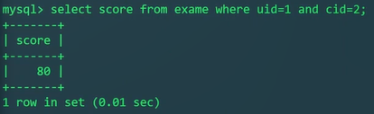

按上面这样查，只能查出score: 80。其他的信息没有，这样给出的信息过少。

怎么进行内连接查询，以获取更多信息呢？

先查学生表和考试创建表：由于学生中要根据uid，考试成绩中也是要根据uid，所以属于公有的内容，属于内连接。

下面是两个表单独的SQL：

```mysql
SELECT uid,name,age,sex FROM student WHERE uid=1;
SELECT score FROM exam WHERE uid=1 AND cid=2;
```

我们把它想办法合并：

各表中可能有重复的字段名，所以需要给表起别名

```mysql
SELECT S.uid,S.name,S.age,S.sex FROM student S WHERE S.uid=1;

SELECT E.score FROM exam E WHERE E.uid=1 AND E.cid=2;
```

我们发现，两个SQL语句的共同点是uid为1。则是按uid来进行关联的。

```mysql
SELECT S.uid,S.name,S.age,S.sex,E.score FROM student S
INNER JOIN exam E
ON S.uid=E.uid	#拿什么来关联
WHERE E.uid=1 AND E.cid=2;	#过滤的条件，即1、查的是某个人；2、查的是某门课
```

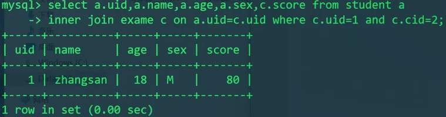

连接查询的性能分析：

`on S.uid=E.uid`按照表中记录的数目来区分大表和小表，小表永远是整表扫描，然后去大表搜索。即从`student`小表中取出所有的`S.uid`，然后拿着这些`uid`去`exam`大表中搜索。

继续：现在只有学生信息、分数，但是没有课程信息。

现在我们发现，如果基于`select ... from student`的话，无法与course表进行关联。因为student表中无cid。而如果基于eaxm查的话，就很顺利，因为exam表既有uid又有cid，既可与student表关联，又可与course表关联。

于是我们就需要改造select语句的第一句中的`FROM ...`。把`FROM student`改为`FROM exam`。

```mysql
SELECT S.uid,S.name,S.age,S.sex,E.score FROM eaxm E
INNER JOIN student S
ON S.uid=E.uid
...
```

然后，我们接下来要做的就是再去内连接course表，以产生exam与其的关联。先写出要查course表信息的单独的SQL语句：

```mysql
SELECT cid,cname,credit FROM course C WHERE C.cid=2;
```

然后再加入到内连接语句中去：

```mysql
SELECT  S.uid,S.name,S.age,S.sex,
		C.cid,C.cname,C.credit,
		E.score FROM eaxm E
INNER JOIN student S ON E.uid=S.uid
INNER JOIN course C ON E.cid=C.cid
WHERE E.uid=1 AND E.cid=2;
```

以上就是三表内连接查询的标准写法。

## 内连接的应用 - 与分页结合提升性能

前面我们研究过了，如果直接按LIMIT M,N进行先偏移后查询的方法来进行的话，越往后性能越差。

分页 - 第一个方案，最差：

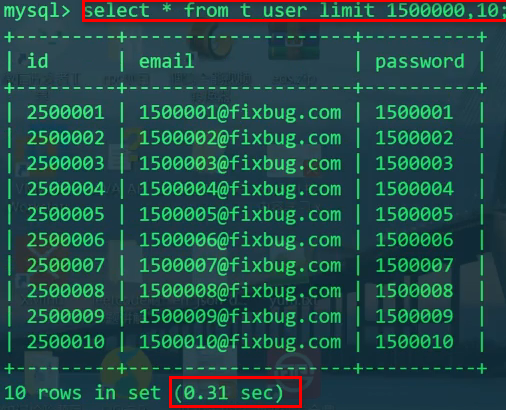

同时我们也发现，查询的效率也与查询的字段个数有关系，比如只查id的话，性能就会有所提升。

分页 - 第二个方案，适中，但是信息少：

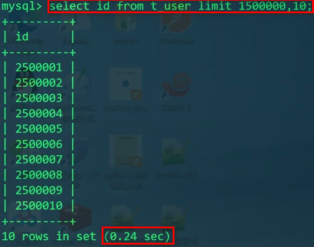

最极致性能的办法，但是常常不通用——先过滤id，直接从过滤完的位置LIMIT查询N条记录。但是这要求我们知道当前的id值及其条件，通常情况下不能实现，我们只清楚目前偏移到了多少位置，一次取多少条。

分页 - 第三个方案，极致，但是往往不能实现：

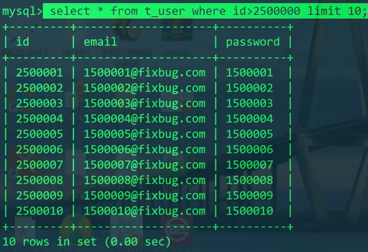

我们再把目光转到第二个方案 - 即只查id。

为了尽可能提高性能，我们只查出了id这一列。目前的信息量过少。但是**我们却可以利用查出的id数据，与自己的原表进行内连接**。这是基本思想。

```mysql
SELECT U.id,U.email,U.password FROM t_user U
INNER JOIN (SELECT id FROM t_user LIMIT 1500000,10) temp ON U.id=temp.id;
```

如此不仅仅可以得到更多信息，而且效率和只查id这一列一致。

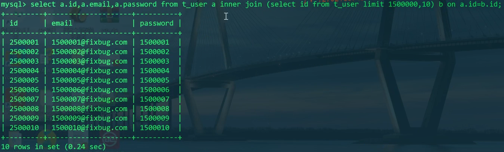

explain此语句的结果：

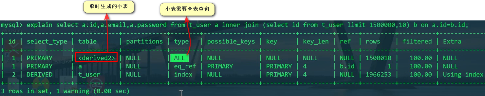

### 总结 - 内连接的过程

> 在做实验之前，先声明一下表中的最新内容
> 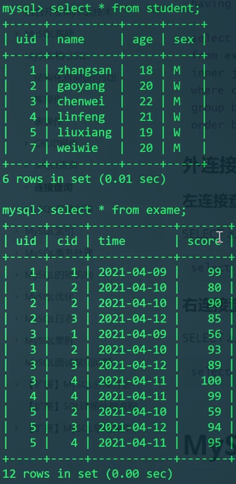

```mysql
SELECT S.*,E.* FROM student S
INNER JOIN exam E ON S.uid=E.uid;
```

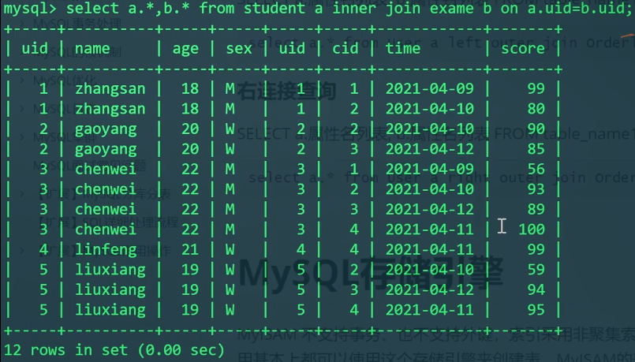

```mysql
EXPLAIN
SELECT S.*,E.* FROM student S
INNER JOIN exam E ON S.uid=E.uid;
```

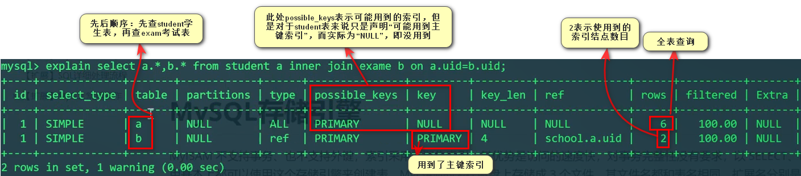

如果我们通过where过滤条件使Exam从大表变小表呢？

```mysql
SELECT S.*,E.* FROM student S
INNER JOIN exam E ON S.uid=E.uid
WHERE E.cid=3;
```

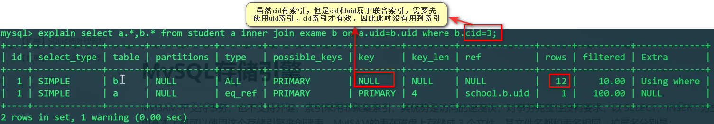

我们看到，在E表进行内连接时，需要先过滤，即E需要进行全表扫描，然后E成为小表（相比于S表），然后，再拿剩下的记录与S表比对。

E表没有用到cid的索引，因为uid和cid是联合索引，只有先用uid索引，cid才有效。

再看一个 - 把where的过滤条件改到on中。和上面有区别吗？

```mysql
SELECT S.*,E.* FROM student S
INNER JOIN exam E ON S.uid=E.uid and E.cid=3;
```

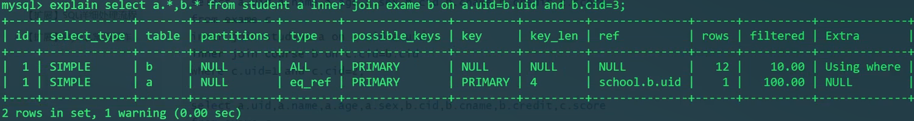

发现，对于`inner join`内连接，过滤条件不管写在where的后面和on连接条件里面，效果是一样的。而且extra里写明第一个是`Using where`，说明mysql为我们做了优化，改成了where过滤，因为where过滤后再查询的效率会更好。

## 外连接

格式：

```
#左连接查询
#显示left表所有数据，右表中如果不存在相应数据则显示NULL
SELECT a.属性名列表, b.属性名列表 FROM table_a a
LEFT [OUTER] JOIN table_b b ON a.id=b.id;

#右连接查询
#显示right表所有数据，左表中如果不存在相应数据则显示NULL
SELECT a.属性名列表, b.属性名列表 FROM table_a a
RIGHT [OUTER] JOIN table_b b ON a.id=b.id;
```


```mysql
SELECT S.*,E.* FROM student S
LEFT JOIN exam E ON S.uid=E.uid;
```

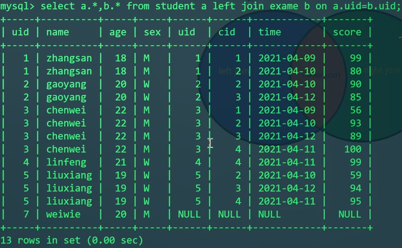

```mysql
SELECT S.*,E.* FROM student S
RIGHT JOIN exam E ON S.uid=E.uid;
```

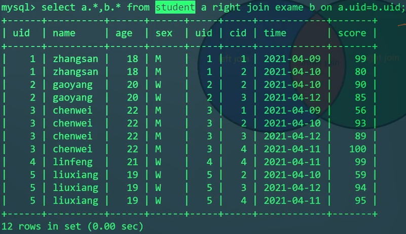

```mysql
EXPLAIN SELECT S.*,E.* FROM student S
INNER JOIN exam E ON S.uid=E.uid;

EXPLAIN SELECT S.*,E.* FROM student S
LEFT JOIN exam E ON S.uid=E.uid;

EXPLAIN SELECT S.*,E.* FROM student S
RIGHT JOIN exam E ON S.uid=E.uid;
```

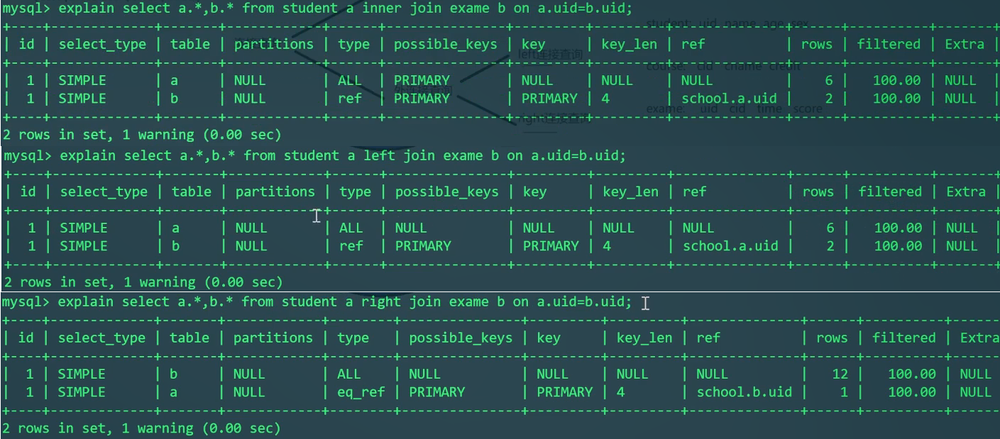

---

实际的问题：能不能查出来谁没参加考试？

```mysql
SELECT * FROM student WHERE uid NOT IN (SELECT DISTINCT uid FROM exam);
```

上面这个SQL虽然可以完成，但是NOT IN是否能够用到索引是不容易确定的。另外，子查询的结果可能会生成临时表。

用外连接来解决：

```mysql
SELECT S.* FROM student S
LEFT JOIN exam E ON S.uid=E.uid
WHERE E.cid IS NULL;
```

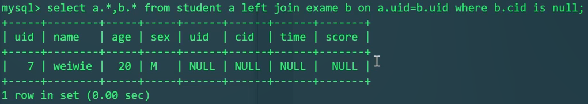

Explain查看查询流程：

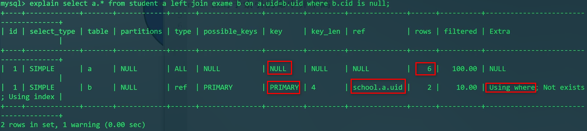

拿student表所有数据与exam表对比。exam表中的uid和cid是联合主键，因为uid是第一列索引，所以可以使用uid索引。

---

## 外连接和内连接的区别

参加过某一门考试的人

先用内连接来写：

```mysql
SELECT S.* FROM student S
INNER JOIN exam E ON S.uid=E.uid
WHERE E.cid=3;
```

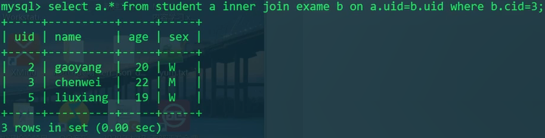

没有参加cid为3的考试的人

```mysql
SELECT S.* FROM student S
LEFT JOIN exam E
ON S.uid=E.uid
WHERE E.uid=3
AND E.cid IS NULL;
```

```mysql
SELECT S.* FROM student S
LEFT JOIN exam E
ON S.uid=E.uid
WHERE E.uid=3;
```

```mysql
SELECT S.* FROM student S
LEFT JOIN exam E
ON S.uid=E.uid AND E.cid=3;
```

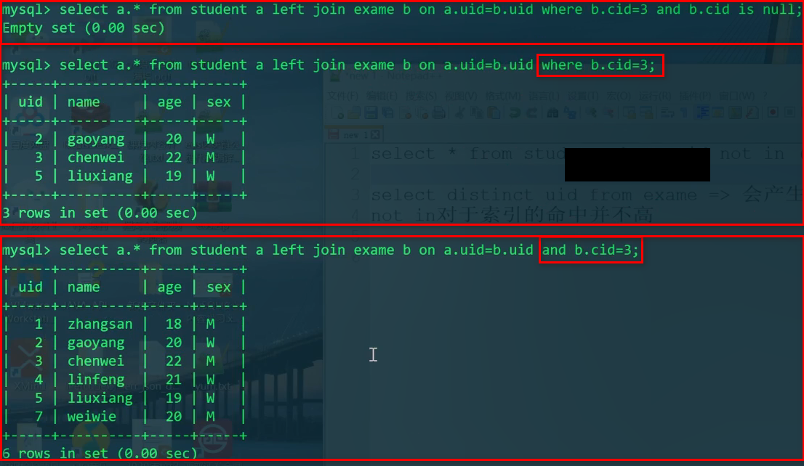

```mysql
SELECT S.* FROM student S
LEFT JOIN exam E
ON S.uid=E.uid AND E.cid=3
WHERE E.cid IS NULL;
```

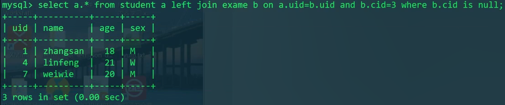

我们发现，where条件和on条件在内外连接上需要斟酌。

---

explain分析

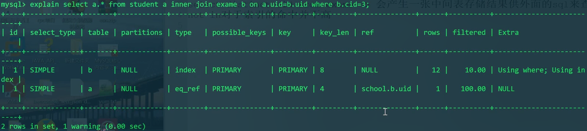

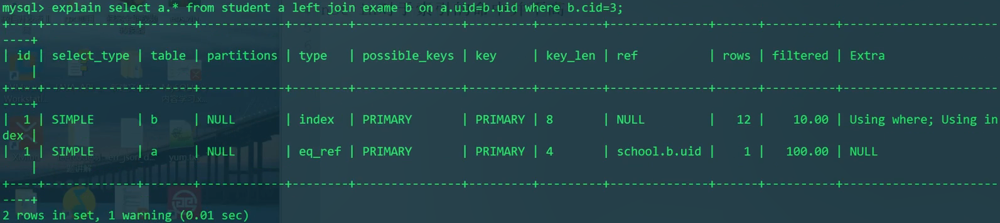

这样写内连接和外连接无区别。都是先使用where过滤，然后exam变为小表。拿exam全部数据（主键）去student搜索。这样的外连接是不正确的。

```mysql
EXPLAIN SELECT S.* FROM student S
LEFT JOIN exam E ON S.uid=E.uid AND E.uid=3;
```

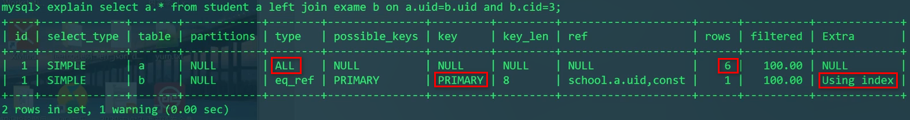

把`E.uid=3`放在on后面才会对student表进行全表扫描。进而去exam表中匹配。

然后我们再在这个正确外连接后的基础上，再加`WHERE E.cid IS NULL`，这才能正确显示未参加cid为的考试的学生。

```mysql
SELECT S.* FROM student S
LEFT JOIN exam E ON S.uid=E.uid AND E.uid=3
WHERE E.cid IS NULL;
```

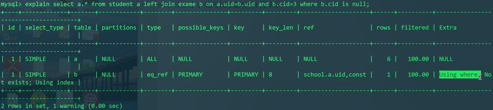

因此我们总结出了一条经验：外连接中，连接时的限制条件要放到ON后面，然后把NULL的过滤条件放到最后的where中。
