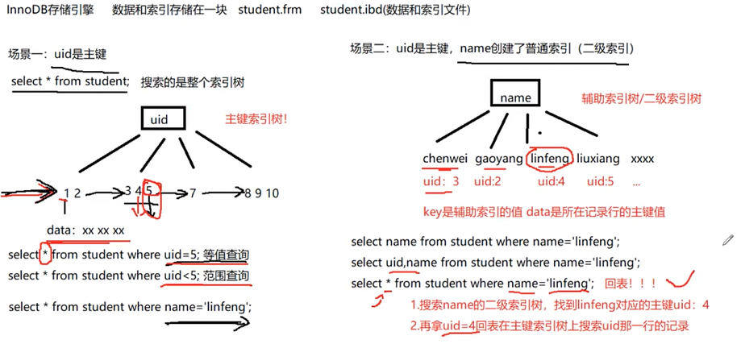
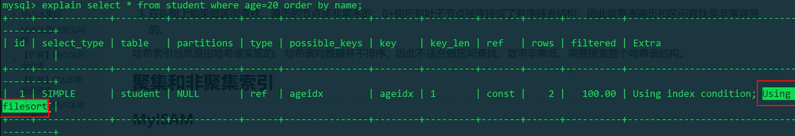
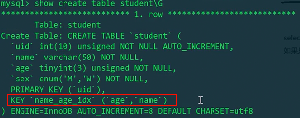
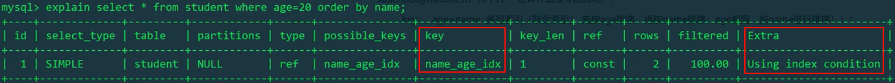
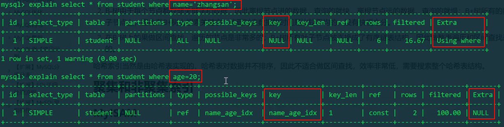
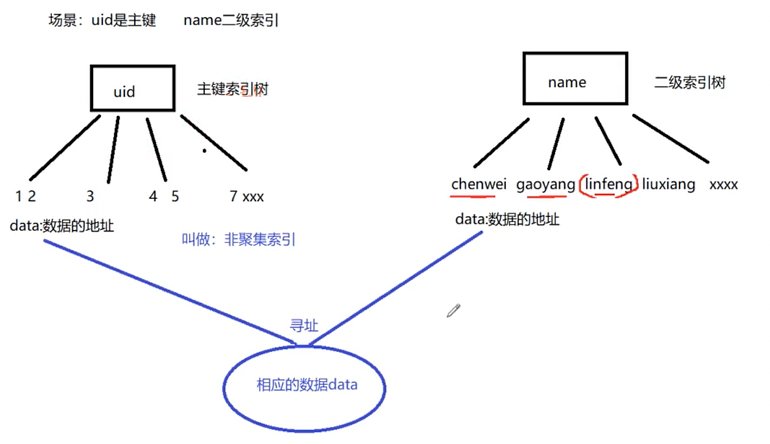
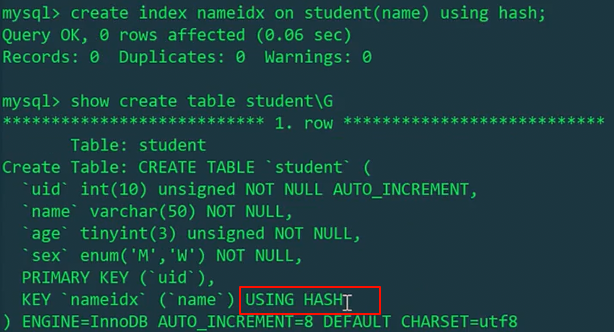
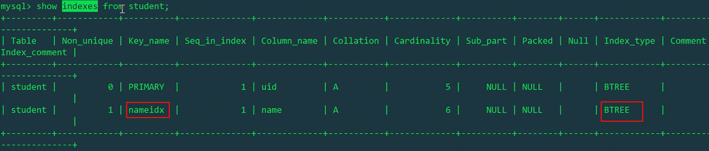
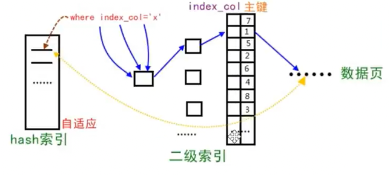

# 内容
1. 索引
2. 怎么创建索引
3. 怎么优化索引
4. 怎么分析索引的好坏
5. 索引的创建、删除、使用
6. explain分析相关SQL语句
7. 总结 - 使用索引时需要注意的
# 数据库文件存在哪里？
同一数据库的不同表，存放在不同的文件里。
详见《[MySQL_存储引擎 - 数据的存储方式](MySQL_存储引擎#数据的存储方式)》
# 为什么要有索引

当表中的数据量到达几十万甚至上百万的时候，SQL查询所花费的时间会很长，导致业务超时出错，此时就需要用索引来加速SQL查询。
# 索引的本质

索引也是一个数据结构，B+树。不用的时候，也是会存在磁盘上的。
# 索引的双面性
由于索引也是需要存储成索引文件的，因此对索引的使用也会涉及磁盘I/O操作。如果索引创建过多，使用不当，会造成SQL查询时大量无用的磁盘I/O操作，降低了SQL的查询效率，就会适得其反，因此掌握良好的索引创建原则非常重要！

除此之外，如果要对某列建立索引，存储引擎会对列对应的行进行排列，当更新表内容时，不仅仅会改变数据，索引的文件也是要改动的。如果索引数目过多，则牵扯到的改动也会过多。
# 索引的分类
从两个方面来看：物理上/逻辑上
## 物理上
可分为：聚集索引、非聚集索引（有的高大上的叫法也叫“聚簇”）
## 逻辑上
可分为：
1. 普通索引（又称为二级索引）：主动、手动创建的索引。
    1. 没有任何限制条件，可以给任何类型的字段创建普通索引。
    2. 可在创建新表时指定建立索引，也可给已创建表指定建立索引
    3. 索引数量不限，但是不建议过多；有的存储引擎可能对表的索引数量有限制。
    4. 一张表的一次SQL查询只能用1个索引，通常是用where的过滤条件中的某个字段。
2. 唯一性索引
    1. 使用UNIQUE修饰的字段，值不能重复，主键索引也属于唯一性索引。
3. **主键索引（自动创建索引）**
    1. 使用Primary Key修饰的字段会自动创建索引
    2. 要注意主键和主键索引的区分，MyISAM存储引擎下，如果没有设置主键，也不会自动添加一列主键列。只有主动设置主键才会有主键存储。因为它的索引和数据是分开存放的；但在InnoDB存储引擎下，如果没有设置主键，会默认添加一列整型字段的列，作为主键。因为数据和索引是存在一个文件`.idb`中的，如果没有索引树，数据无处存放。
4. 单列索引
    1. 在一个字段上创建的索引
5. 多列索引（联合索引）
    1. 在表的多个字段上创建的索引，常出现于联合主键上。
    2. 也可以用在普通字段。
6. 全文索引
    1. 主要用于字符串搜索
    2. 使用`FULLTEXT`参数可以设置全文索引，只支持`CHAR`、`VARCHAR`和`TEXT`类型的字段上，常用于数据量较大的字符串类型上，可以提高查询速度。
    3. 但是一般不在本地数据库中使用全文索引，而是给后台服务器另外增设专门的搜索引擎模块，如`elasticSearch, ES`。
# 索引的创建与删除

## 创建表的时候指定索引字段

```mysql
CREATE TABLE user(
    id INT,
    name VARCHAR(20),
    sex ENUM('male', 'female'),
    INDEX(id)
);
```

## 在已创建的表上添加索引

```mysql
CREATE [UNIQUE] INDEX [索引名]
ON 表名 (字段名(长度) [ASC | DESC]);
```

## 删除索引

```mysql
DROP INDEX 索引名 ON 表名;
```
# 一次select where过滤条件查询所经历的事情
```mysql
SELECT * from student WHERE uid = 5;
```
UID为主键，默认有索引。
查询一次的全流程：
1. 存储引擎启动
2. kernel space
3. 磁盘IO（读取索引文件）
4. 内存上，用索引的数据构建B树
5. 查找数据，内存上二分找到索引节点，**value为一行记录的文件指针或者一行记录的数据（根据不同存储引擎实现）**。
    1. MyISAM的索引文件和数据文件是分离的，因此索引节点的value为一行记录的文件指针，需要去磁盘中读取。
    2. InnoDB的索引文件和数据文件是一起的，因此以及把索引的数据提前读取到了内存中，所以value值直接是一行记录的数据。
6. kernel space
7. 磁盘IO返回内存。
# 实操探索索引

首先`su root` + `netstat -natp | grep mysqld`查看mysql守护进程是否正在运行，默认工作在3306端口。

我们先拿小表来探索。


## 查看表的结构 - 看主键索引
```mysql
SHOW CREATE TABLE student\G #查看表的结构
```


发现此表只有一个uid主键索引。
## explain命令查看select where的性能分析
```mysql
EXPLAIN SELECT * FROM student WHERE uid = 3;
```


由于uid上有主键索引，所以不管此表中有多少数据，只要是按照uid过滤条件来查找，直接就可以找到，不受查找的数据的位置的影响（不会在后面就找得慢，在前面就找得快）。

explain结果中**type为const表示常量时间**，`key_len`为4，对应了uid的int型的4字节大小。

```mysql
EXPLAIN SELECT * FROM student WHERE name = 'linfeng';
```


由于`name`没有索引，所以explain分析出的性能显示`type`字段为`ALL`。
通过name进行查找只能进行全表检索，效率较低。
## 非主键字段创建索引，前后区别
我们给name字段建立一个索引。

```mysql
CREATE INDEX nameidx ON student(name);
SHOW CREATE TABLE student\G
```


发现，下面多了一个`KEY nameidx(name)`。
但是，**建立了索引之后，不一定会用到索引，
MySQL会进行性能分析，如果使用索引后需要搜索的数目和整表搜索的数目差不多的话，就不会使用索引**，
因为通过索引来检索也是需要消耗磁盘IO的，恐会适得其反。

对name加完索引之后，再来分析按`name`搜索的性能：

```mysql
EXPLAIN SELECT * FROM student WHERE name='zhangsan';
```


这里我们看到，加了索引后，`type`的内容变为`ref`。

还有一个可以优化的点，我们发现，`key_len`为152，这个值是索引的字长。

我们可以在创建索引时在字段后加一个`(长度)`，以限制索引的字长。
**通过控制索引的字长，避免索引长度过大，来提高搜索效率**。

通常对字符串索引进行控制。
### 非主键索引（普通索引/二级索引）的结构 - 回表
以下讨论的是InnoDB存储引擎的情况。

创建普通字段索引的实现原理是，普通字段（如name）充当key，value变成uid。

回表是指，查到name索引树中linfeng对应的uid后，去主键索引树再找uid对应的一整行记录。

涉及到回表时，磁盘IO会增加，效率降低。
## 测试InnoDB的数据缓存

现在来测试`t_user`表，此表中有2000000条数据。

现在测试查找同一个password的用户。（注意，我们用的是整型的1000000）

```mysql
SELECT * FROM t_user WHERE password = 1000000;
```


再运行一次相同的SQL。（测试InnoDB的数据缓存）

```mysql
SELECT * FROM t_user WHERE password = 1000000;
```


我们发现，由于两次相同的查找之间没有对数据库表进行修改、添加、删除操作，利用了存储引擎的缓存机制，比第一次查找出的时间快了，因为不用花费磁盘IO。
## 测试有无索引的性能区别（涉及到类型转换时索引失效的问题）
现在给password字段添加个索引。

```mysql
CREATE INDEX pwdidx ON t_user(password);
SHOW CREATE TABLE t_user\G
```


现在再来试试查password。（故意写成整型）

```mysql
SELECT * FROM t_user WHERE password = 1000000;
```


感觉性能并未大幅提升！这是为啥呢？

```mysql
EXPLAIN SELECT * FROM t_user WHERE password = 1000000;
```


Explain发现：`key`值为`NULL`，意思就是：在执行SELECT where过滤password字段时，索引失效！

原因是因为在查询过程的过滤过程中，涉及到了一个**类型转换操作**。
（数据表原本设计password是字符串，而我们是用整型值传递的查询命令），如此就会让索引失效。

我们把它写正确：

```mysql
SELECT * FROM t_user WHERE password = '1000000';
```


```mysql
EXPLAIN SELECT * FROM t_user WHERE password = '1000000';
```


可以发现，如果没有类型强转，则一切恢复正常，索引发挥了它原有的功力——即使是在百万数据集中，也能瞬间找到要找的记录。
## 测试删除索引

最后我们测试一下删除索引

```mysql
DROP INDEX pwdidx ON t_user;
SHOW CREATE TABLE t_user\G
```


# 多列索引（联合索引）
一次SQL查询中，一张表只能使用一次索引。否则使用多个索引会耗费成倍的磁盘IO。
```mysql
explain select * from student where age = 20 order by name;
```
创建多列索引，用在这种场景：过滤条件为非主键，排序条件为非主键。
如果只建立了两个独立的单列age、name索引，那么：

虽然用到了age索引，但是依然会出现using filesort，这是由于name索引失效的问题。
我们可以创建age、name的联合索引。实际的实现原理是，索引节点的key是age，value域一起绑定了name、uid。
那么，最终的效果就是：先按age排序，再按name排序；age相同，按name排序。

```mysql
create index name_age_idx on student(age, name);
```



但是，如果只有age、name的联合索引，当我们用name过滤条件查询时，age、name的联合索引会失效。

这是因为age排在age、name的前面，age充当索引的key。
# 聚集索引（聚簇索引）
聚集索引指的是，索引和数据在一起。（比如InnoDB）
非聚集索引指的是，索引和数据是分开的，索引的value保存的是数据的文件地址。（比如MyISAM）

因此，MyISAM二级索引树，查询其他非索引字段时，不用进行回表操作，因为可以直接访问数据地址。

# 创建索引时指定索引结构
```mysql
create index nameidx on student(name) using hash;
```

虽然指定了使用哈希索引，并且表结构也显示USING HASH，但实际上用的什么索引结构是不确定的。
需要查看：
```mysql
show indexes drom student;
```


可以看到，实际上，刚才创建的nameidx依然为BTREE索引结构。
# 哈希索引
memory存储引擎支持哈希索引。
memory存储引擎是基于内存的，掉电数据会丢失。

虽然查询的效率很高，为`O(1)`，但是：哈希表中的元素没有任何顺序可言，只适合等值比较。
```mysql
select * from student where name = 'zhangsan';
```
如果一旦涉及：范围查找，或者前缀查找，或者order by排序，则效率不高，只能遍历搜索哈希表了。
zhangsan、zhangyang、zhangcheng，大概率不在一个桶中。
```mysql
select * from student where name like 'zhang%';
```
而且，哈希表的结构很分散，无法利用计算机存储结构的局部性原理。磁盘IO会很频繁。

因此哈希索引的场景：只适合把索引和数据全部加载到内存上。并且只做等值比较查询。
## InnoDB自适应哈希索引
InnoDB存储引擎会监测：如果同样的二级索引不断被使用，那么它会根据这个二级索引，在内存上根据二级索引树（B+树）上的二级索引值，在内存上构建一个哈希索引，来加索搜索。


自适应哈希索引本身的数据维护也是要耗费性能的，并不是说自适应哈希索引在任何情况下都会提升二级索引的查询性能。
需要根据参数指标，来具体分析是否打开或者关闭自适应哈希索引。

以下命令能看到两个比较重要的信息：
1. RW-latch等待的线程数量（自适应哈希索引默认分配了8个分区），
2. 走自适应哈希索引搜索的频率（低）和二级索引树搜索的频率（高）

```mysql
show engine innodb status\G 
```
如果观察到同一个分区等待的线程数量过多，走哈希索引搜索频率低、二级索引树频率高，则最好关掉自适应哈希索引。
# 总结 - 索引要注意的点
1. 经常作为where条件过滤的字段考虑添加索引
2. 针对字符串列创建索引时，尽量规定索引的长度，避免索引值的长度`key_len`过长
3. 索引字段涉及类型强转、mysql函数调用、表达式计算等，索引就失效了。