# 内容

1. 索引
1. 怎么创建索引
1. 怎么优化索引
1. 怎么分析索引的好坏
1. 索引的创建、删除、使用
1. explain分析相关SQL语句
1. 总结 - 使用索引时需要注意的

# 为什么要有索引

当表中的数据量到达几十万甚至上百万的时候，SQL查询所花费的时间会很长，导致业务超时出错，此时就需要用索引来加速SQL查询。

# 索引的本质

索引也是一个数据结构，B+树。不用的时候，也是会存在磁盘上的。

# 索引的双面性

由于索引也是需要存储成索引文件的，因此对索引的使用也会涉及磁盘I/O操作。如果索引创建过多，使用不当，会造成SQL查询时大量无用的磁盘I/O操作，降低了SQL的查询效率，就会适得其反，因此掌握良好的索引创建原则非常重要！

除此之外，如果要对某列建立索引，存储引擎会对列对应的行进行排列，当更新表内容时，不仅仅会改变数据，索引的文件也是要改动的。如果索引数目过多，则牵扯到的改动也会过多。

# 索引的分类

从两个方面来看：物理上/逻辑上

物理上又可分为：聚集索引、非聚集索引

逻辑上又可分为：

1. 普通索引（又称为二级索引）
   1. 没有任何限制条件，可以给任何类型的字段创建普通索引。
   2. 可在创建新表时指定建立索引，也可给已创建表指定建立索引
   3. 索引数量不限，但是不建议过多；有的存储引擎可能对表的索引数量有限制。
   4. 一张表的一次SQL查询只能用1个索引，通常是用where的过滤条件中的某个字段。
2. 唯一性索引
   1. 使用UNIQUE修饰的字段，值不能重复，主键索引也属于唯一性索引。
3. 主键索引
   1. 使用Primary Key修饰的字段会自动创建索引
   2. 要注意主键和主键索引的区分，MyISAM存储引擎下，如果没有设置主键，也不会自动添加一列主键列。只有主动设置主键才会有主键存储。因为它的索引和数据是分开存放的；但在InnoDB存储引擎下，如果没有设置主键，会默认添加一列整型字段的列，作为主键。因为数据和索引是存在一个文件`.idb`中的，如果没有索引树，数据无处存放。
4. 单列索引
   1. 在一个字段上创建的索引
5. 多列索引
   1. 在表的多个字段上创建的索引，常出现于联合主键上。
   2. 多列索引必须先使用到第一个主键字段，才可能用到多列索引，否则失效。
6. 全文索引
   1. 主要用于字符串搜索
   2. 使用`FULLTEXT`参数可以设置全文索引，只支持`CHAR`、`VARCHAR`和`TEXT`类型的字段上，常用于数据量较大的字符串类型上，可以提高查询速度。
   3. 但是一般不在本地数据库中使用全文索引，而是给后台服务器另外增设专门的搜索引擎模块，如`elasticSearch, ES`。

# 索引的创建与删除

创建表的时候指定索引字段

```mysql
CREATE TABLE user(
    id INT,
    name VARCHAR(20),
    sex ENUM('male', 'female'),
    INDEX(id)
);
```

在已创建的表上添加索引

```
CREATE [UNIQUE] INDEX [索引名]
ON 表名 (字段名(长度) [ASC | DESC]);
```

删除索引

```
DROP INDEX 索引名 ON 表名;
```

# 实操探索索引

首先`su root` + `netstat -natp | grep mysqld`查看mysql守护进程是否正在运行，默认工作在3306端口。

我们先拿小表来探索。

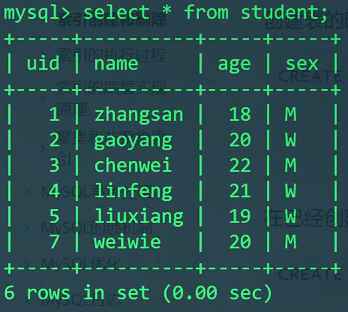

```mysql
SHOW CREATE TABLE student\G #查看表的结构
```

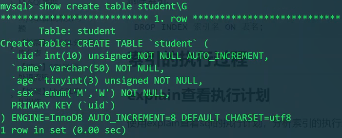

发现此表只有一个uid主键索引。

```mysql
EXPLAIN SELECT * FROM student WHERE uid=3;
```

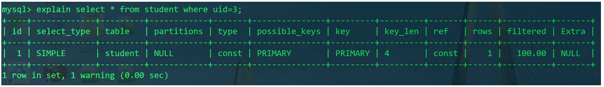

由于uid上有主键索引，所以不管此表中有多少数据，只要是按照uid过滤条件来查找，直接就可以找到，不收查找的数据的位置的影响（不会在后面就找得慢，在前面就找得快）。explain结果中type为const表示常量时间，`key_len`为4，对应了uid的int型的4字节大小。

```mysql
EXPLAIN SELECT * FROM student WHERE name='linfeng';
```

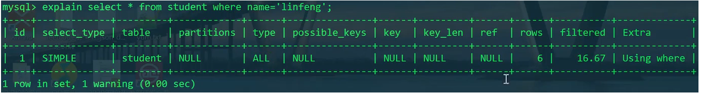

由于`name`没有索引，所以explain分析出的性能显示此次查找未能使用索引。而且通过name进行查找只能进行全表检索。效率较低。`type`字段为`ALL`。

我们给name字段建立一个索引

```mysql
CREATE INDEX nameidx ON student(name);
SHOW CREATE TABLE student\G
```

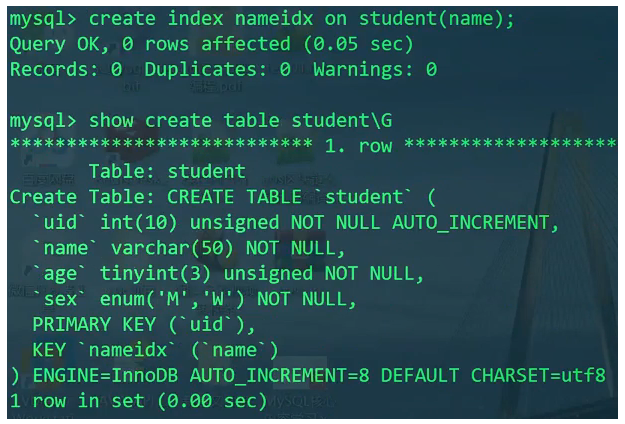

发现，下面多了一个`KEY nameidx(name)`。但是，**建立了索引之后，不一定会用到索引，MySQL会进行性能分析，如果使用索引后需要搜索的数目和整表搜索的数目差不多的话，就不会使用索引**，因为通过索引来检索也是需要消耗磁盘IO的，恐会适得其反。

对name加完索引之后，再来分析按`name`搜索的性能：

```mysql
EXPLAIN SELECT * FROM student WHERE name='zhangsan';
```

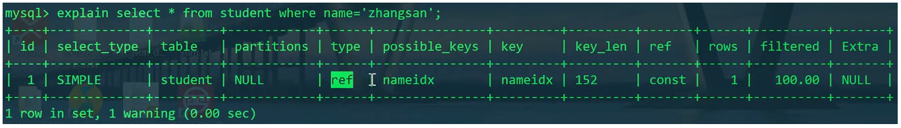

这里我们看到，加了索引后，`type`的内容变为`ref`，`key`的内容是`nameidx`。还有一个可以优化的点，我们发现，`key_len`为152，这个值**我们可以在创建索引时在字段后加一个`(长度)`，以限制索引的字长，通过控制索引的字长，避免索引长度过大，来提高搜索效率**。通常对字符串索引进行控制。

---

现在来测试`t_user`表，此表中有2000000条数据。

现在测试查找同一个password的用户。（注意，我们用的是整型的1000000）

```mysql
SELECT * FROM t_user WHERE password=1000000;
```

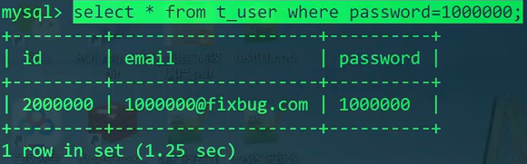

再运行一次相同的SQL。（测试InnoDB的数据缓存）

```mysql
SELECT * FROM t_user WHERE password=1000000;
```

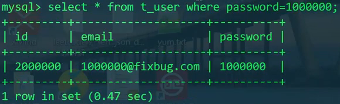

我们发现，由于两次相同的查找之间没有对数据库表进行修改、添加、删除操作，利用了存储引擎的缓存机制，比第一次查找出的时间快了，因为不用花费磁盘IO。

现在给password字段添加个索引。

```mysql
CREATE INDEX pwdidx ON t_user(password);
SHOW CREATE TABLE t_user\G
```

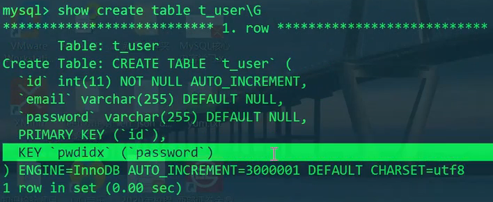

现在再来试试查password。（故意写成整型）

```mysql
SELECT * FROM t_user WHERE password=1000000;
```

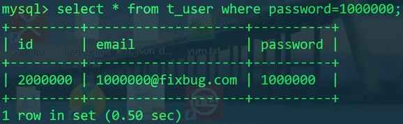

感觉性能并未大幅提升！这是为啥呢？

```mysql
EXPLAIN SELECT * FROM t_user WHERE password=1000000;
```

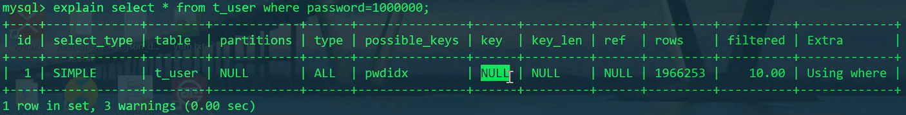

Explain发现索引失效！

原因是因为在查询过程的过滤过程中，涉及到了一个类型转换操作，如此就会让索引失效。

我们把它写正确：

```mysql
SELECT * FROM t_user WHERE password='1000000';
```

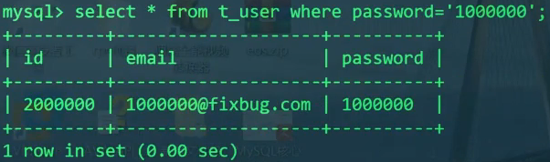

```mysql
EXPLAIN SELECT * FROM t_user WHERE password='1000000';
```

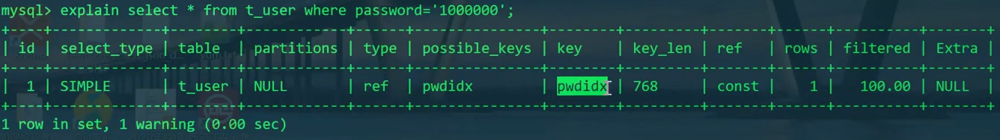

可以发现，如果没有类型强转，则一切恢复正常，索引发挥了它原有的功力——即使是在百万数据集中，也能瞬间找到要找的记录。

---

最后我们测试一下删除索引

```mysql
DROP INDEX pwdidx ON t_user;
SHOW CREATE TABLE t_user\G
```

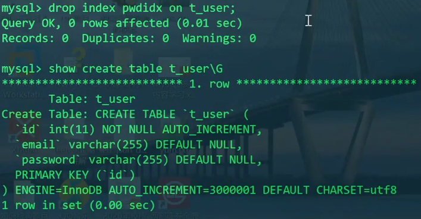

# 总结 - 索引要注意的点

1. 经常作为where条件过滤的字段考虑添加索引
2. 针对字符串列创建索引时，尽量规定索引的长度，避免索引值的长度`key_len`过长
3. 索引字段涉及类型强转、mysql函数调用、表达式计算等，索引就失效了。
