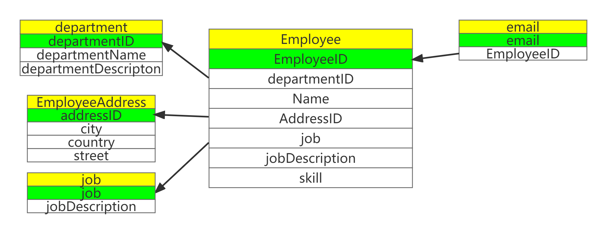

# 内容

1. 关系型数据库范式
2. 应用范式的好处
3. 第一范式
4. 第二范式
5. 第三范式
6. BC范式
7. 第四范式

# 应用范式的好处

范式和表的设计有什么关系呢？可以说是息息相关，表设计过程中需要知道的规则，在范式设计中，都会有所提及。可以说，范式是表设计原则的提炼。

表设计原则是告诉我们怎么设计表之间的关联，并且尽量减少数据冗余。

而应用范式最重要的好处也是**减少数据冗余**。由此带来的好处有：

1. 消除异常（插入异常、更新异常、删除异常）
2. 让数据组织地更加和谐

# 第一范式

> 1. 每一列保持原子特性
> 2. 不符合第一范式则不能称作关系型数据库。比如key-value，因为key对应的value可能包含了各种杂乱的信息，例如json数据。

列都是基本数据项，不能再进行分割，否则设计成一对多的实体关系。

例如表中的地址字段，可以再细分为省、市、区等不可再分割的字段。


上图的Employee表中的Address字段，就没有遵循第一范式。即地址信息可以细分为很多详细的地址。如果没有去规范地址的分类，则就会造成地址数据粒度太粗。如果我们要查询某一特定地址的雇员信息，还要从地址字符串中提取相关信息，过于麻烦。


我们现在将Address抽取出来作为一个单独的表，让地址字段分成更详细的city、country、street三个字段。再让Employee表与其关联，则可解决Address粒度过粗的问题。

查询指定EmployeeID的职员的地址信息。

```mysql
# 方法一：带in的子查询，子查询效率较低
select * from EmployeeAddress where addressID in (select AddressID from Employee where EmployeeID=1);
# 用连接查询效率高一些。
```

# 第二范式

> 属性完全依赖于主键 - 主要针对联合主键

非主属性（不是主键的字段）必须完全依赖主关键字（包括联合主键的每一列），如果不是完全依赖主键，应该拆分成新的实体，设计成一对多的实体关系。

例如教务系统中的选课：
选课关系表为`SelectCourse(学号, 姓名, 年龄, 课程名称, 成绩, 学分)`。
则`(学号, 课程名称)`是联合主键，
但是**学分字段只与课程名称有关，与学号无关**，相当于只依赖联合主键的其中一个字段 - `课程名称`，不符合第二范式。
姓名、年龄只和学号有关，与课程名称无关。只依赖联合主键的其中一个字段 - `学号`，不符合第二范式。

总之，学分在此表中属于冗余存储。`姓名`和`年龄`字段也属于冗余存储。

学生和课程之间，属于多对多的关系。

学生表：

| 学号  | 姓名  | 年龄  |
| --- | --- | --- |

课程表：

| 课程id | 课程名称 | 学分 |
| ------ | -------- | ---- |

选课情况（中间表）：

| 学号 | 课程id | 成绩 |
| ---- | ------ | ---- |

---

再例如，上面的Employee表。经历了第一范式之后，仍存在问题。

该表存在联合主键`(EmployeeID, departmentName)`。表中`Name`字段明显与`departmentName`不存在关系。因此不符合第二范式。

则把department有关信息


# 第三范式

> 属性不依赖于其他非主属性。
>
> 一般的关系型数据库满足第三范式就足够了。

要求一个数据表中不包含已在其他表中已包含的非主关键字信息。

示例：
学生关系表为`Student(学号, 姓名, 年龄, 所在学院, 学院地点, 学院电话)`，
字段`学号`是主键。
但是，字段`学院地点`、`学院电话`依赖于非主属性`所在学院`，并不依赖于主键`学号`。
因此该设计不符合第三范式。
应该把学院单独设计成一张表，学院和学生是一对多的关系。

---

再如Employee表中的问题，发现字段`jobDescription`并不依赖于主键`EmployeeID`，而是依赖非主属性`job`。不符合第三范式。因此把`job`有关的属性抽取出来单独作为`job`表。工作和雇员也是一对多的关系。


# BC范式

> 每个表中只有一个候选键

BC范式是在第三范式的基础上的一种特殊情况，即每个表中只有一个**候选键**（在一个数据库中，每行的值都不相同，则可称为候选键）。Employee表中可以看出，每一个员工的`email`都是唯一的（逻辑上来说，邮箱是单人单用），则上表不符合BC范式。

应把邮箱单独抽出作为一张表。邮箱与雇员属于一对一的关系。



# 第四范式

> 消除表中的多值依赖

简单来说，第四范式就是要消除表中的多值依赖，也就是说可以减少数据一致性的工作。比如Employee表中的字段`skill`，有的人是`"java, mysql"`，有的人是`"Java, MySQL"`，这样数据就不一致了。

解决方案就是将多值属性放入一个新表。Employee表则是把`skill`抽出作为一张表。雇员和技能是一对多的关系。


| skill  | EmployeeID |
| ------ | ---------- |
| C++    | 1000       |
| Java   | 1000       |
| MySQL  | 2000       |
| Golang | 2000       |
| Rust   | 1000       |
| C++    | 2000       |

# 总结

* 范式含义
* 好处：应用数据库范式可以带来许多好处,但是最重要的好处归结为三点：
    1. 减少数据沉余(这是最主要的好处，其他好处都是由此而附带的)
    2. 消除异常(插入异常、更新异常、删除异常
    3. 让数据组织的更加和谐
* 缺点：但是数据库范式绝对不是越高越好，范式越高，意味着表越多，多表联合查询的机率就越大，SQL的效率就变低。