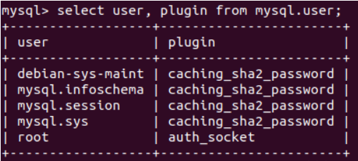
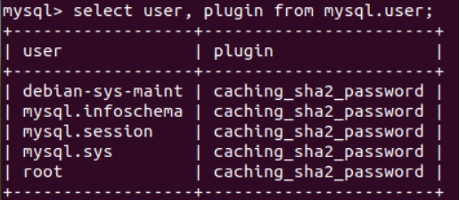
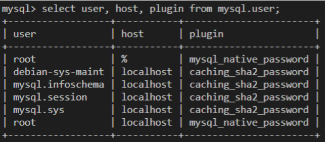

### 下载安装

下载mysql命令：

```bash
sudo apt-get update  #更新软件源
sudo apt-get install mysql-server  #安装mysql
```

### 服务启动/停止

启动/关闭mysql服务：

```bash
service mysql start
service mysql stop
```

### 修改root用户密码

查看默认用户名及密码：

```bash
# 首先，切换到管理员身份
su
sudo cat /etc/mysql/debian.cnf
```

使用显示的默认user及password登录：

```bash
mysql -u debian-sys-maint -pXXX
```

执行下列命令：

```sql
use mysql;
select user, plugin from mysql.user;
```



```sql
update user set plugin='caching_sha2_password' where user='root';
```



设置`mysql root`账户密码：

```sql
ALTER USER 'root'@'localhost' IDENTIFIED WITH mysql_native_password BY '123';
FLUSH PRIVILEGES;
Exit;
```

使用`mysql -u root -p`尝试登录：

```bash
mysql -u root -p123
```

### 用户管理（Navicat远程登录配置）

MySQL8.0后的登录方式分为了两种。

```sql
select user, host, plugin from mysql.user;
```



`localhost`表示本地登录的用户。
`%`表示可以远程登录的用户。默认是没有的，需要手动创建。

**创建用户示例**

```sql
create user 'xcg'@'localhost' identified by '123'; #创建名为xcg的本地用户，密码为123
create user 'root'@'%' identified WITH mysql_native_password by '123'; #创建名为root的远程用户，密码为123，指定加密方式。
```

**修改用户密码，指定加密方式。示例**

```sql
ALTER user 'root'@'localhost' IDENTIFIED WITH mysql_native_password by '123456';
```

**授权用户对哪些数据库的哪些表可以进行操作**

```sql
grant all privileges on *.* to root@'%' with grant option; # *.* 表示所有数据库的所有表
```

**删除用户**

```sql
drop user 'name'@'localhost';
```

### 导入数据库sql脚本

在登录mysql之后，用`source`命令+sql脚本文件路径导入脚本命令。
可以用vscode远程登录后，将sql文件拖进一个容易找到的位置。
导入之前需要提前创建好数据库，并且use。

```sql
create database test;
use test;
source /home/xcg/vscode/chat.sql #不用带分号
```

导入后，可以`show tables;`查看是否成功。