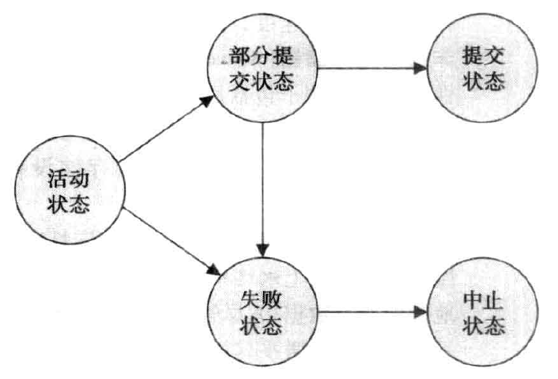
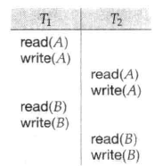
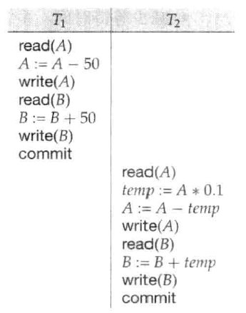
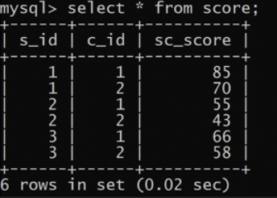
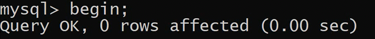
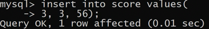
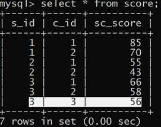
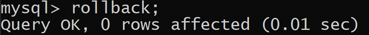
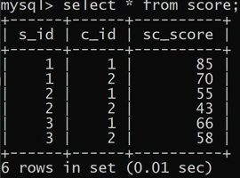

事务就像是批处理一样，可以有多条SQL语句、函数等等，按照流程进行操作。比如公司引进一个新人，事务不仅是简单的插入一个表，而是插入存在依赖关系的部门员工表、工资表、人事表等等。事务完成后，才完成了数据的持久化。如果中间除了问题，可以进行选择性的回退、或完全回退。

实际上事务一直都有，每次我们提交SQL语句时，数据库就默认提交了一个事务。

# 关键字

## Transaction
Transaction(Read, Write, Commit, Abort)
事务（读取、写入、提交、中止）

从程序角度来说，事务就是一组原子性的SQL语句，或者说是一个独立的工作单元。如果数据库引擎能够成功地对数据库应用该语句，那么就执行；如果其中有任何一条语句因为崩溃或其他原因无法执行，那么所有的语句都不会执行。也就是说，事务内的语句要么全部执行成功，要么全部执行失败。

事务并非总能成功地执行完成。这种事务称为**中止(aborted)**。我们如果要确保原子性，中止事务必须对数据库的状态不造成影响。因此，中止事务对数据库所做的任何改变必须撤销。一旦中止事务造成的变更被撤销，我们就说事务**已回滚(rolledback)**。恢复机制负责管理事务中止。典型的方法是维护一个日志(log)。每个事务对数据库的修改都首先会记录到日志中。我们记录执行修改的事务标识符、修改的数据项标识符以及数据项的旧值（修改前的）和新值（修改后的）。然后数据库才会修改。维护日志提供了重做修改以保证原子性和持久性的可能，以及撤销修改以保证在事务执行发生故障时的原子性的可能。

成功完成执行的事务称为**已提交(committed)**。一个对数据库进行过更新的已提交事务使数据库**进入一个新的一致状态**，即使出现系统故障，这个状态也必须保持。

一旦事务已提交，我们不能通过中止它来撤销其造成的影响。撤销已提交事务所造成影响的唯方法是执行一个**补偿事务(compensating transaction)**。例如，如果一个事务给一个账户加上了`$20`，其补偿事务应当从该账户减去`$20`。然而，我们不总是能够创建这样的补偿事务。因此，书写和执行一个补偿事务的责任就留给了用户，而不是通过数据库系统来处理。

我们需要更准确地定义一个事务成功完成的含义。为此我们建立了一个简单的抽象事务模型。事务必须处于以下状态之一。

1. 活动的(active)：初始状态，事务执行时处于这个状态。
2. 部分提交的(partially committed)：最后一条语句执行后。
3. 失败的(failed)：发现正常的执行不能继续后。
4. 中止的(aborted)：事务回滚并且数据库已恢复到事务开始执行前的状态后。
5. 提交的(committed)：成功完成后。

事务相应的状态图如图所示。只有在事务已进入提交状态后，我们才说事务已提交。类似地，仅当事务已进入中止状态，我们才说事务已中止。如果事务是提交的或中止的，它称为已经结束的(terminated)。



事务从活动状态开始。**当事务完成它的最后一条语句后就进入了部分提交状态。此刻，事务已经完成执行，但由于实际输出可能仍临时驻留在主存中，因此一个硬件故障可能阻止其成功完成，于是事务仍有可能不得不中止。**

接着数据库系统往磁盘上**写入**(write)足够的信息，确保即使出现故障时事务所做的更新也能在系统重启后重新创建。当最后一条这样的信息写完后，事务就进入提交状态。

系统判定事务不能继续正常执行后（例如，由于硬件或逻辑错误），事务就进入失败状态。这种事务必须回滚。这样，事务就进人中止状态。此刻，系统有两种选择。

1. 它可以重启(restart)事务，但仅当引起事务中止的是硬件错误或不是由事务的内部逻辑所产生的软件错误时。重启的事务被看成是一个新事务。
2. 它可以杀死(kill)事务，这样做通常是由于事务的内部逻辑造成的错误，只有重写应用程序才能改正，或者由于输入错误，或所需数据在数据库中没有找到。

在处理可见的外部写(observable external write)，比如写到用户屏幕，或者发送电子邮件时，我们必须要小心。由于写的结果可能已经在数据库系统之外看到，因此一旦发生这种写操作，就不能再抹去。大多数系统只允许这种写操作在事务进入提交状态后发生。实现这种模式的一种方法是在非易失性存储设备中临时写下与外部写相关的所有数据，然后在事务进入提交状态后再执行真正的写操作。

如果在事务已进入提交状态而外部写操作尚未完成之时，系统出现了故障，数据库系统就可以在重启后（用存储在非易失性设备中的数据）执行外部写操作。

在某些情况下处理外部写操作会更复杂，例如，我们假设外部动作是在自动取款机上支付现金，并且系统恰好在支付现金之前发生故障（我们假定现金能自动支付），当系统重新启动时再执行现金支付将毫无意义，因为用户可能已经离开。在这种情况下，重新启动时系统应该执行一个补偿事务，比如将现金存回用户的账户。

## Serializability

如果并发执行的控制完全由操作系统负责，许多调度都是可能的，包括像上述调度那样使数据库处于不一致状态的调度。保证所执行的任何调度都能使数据库处于一致状态，这是数据库系统的任务，数据库系统中负责完成此任务的是并发控制(concurrency-control)部件。

在并发执行中，**通过保证所执行的任何调度的效果都与没有并发执行的调度效果一样，我们可以确保数据库的一致性**。也就是说，调度应该在某种意义上等价于一个串行调度。这种调度称为**可串行化**(serializable)调度。

事务处理系统通常允许多个事务并发地执行。正如我们先前看到的，允许多个事务并发更新数据引起许多数据一致性的复杂问题。在存在事务并发执行的情况下保证一致性需进行额外工作；如果我们强制事务串行地(serially)执行将简单得多次执行一个事务，每个事务仅当前一事务执行完后才开始。

在我们考虑数据库系统并发控制部件如何保证串行化之前，我们考虑如何确定一个调度是可串行化的。显然，串行调度是可串行化的，但是如果许多事务的步骤交错执行，则很难确定一个调度是否是可串行化的。由于事务就是程序，因此要确定一个事务有哪些操作、多个事务的操作如何相互作用是有困难的。由于这个缘故，我们将不会考虑一个事务对某一数据项可执行的各种不同类型的操作， 而只考虑两种操作：**read和write**。

我们这样假设， 在数据项Q上的read(Q)和write(Q)指令之间，事务可以对驻留在事务局部缓冲区中的Q的拷贝执行任意操作序列。按这种模式， 从调度的角度来看， 事务唯一重要的操作是read与write指令。commit操作尽管相关， 但是我们后面才考虑它。因此，我们在调度中通常只显示read与write指令，正如图所示。



## History

## Schedule

执行顺序称为调度(schedule)。它们表示指令在系统中执行的时间顺序。显然，一组事务的一个**调度必须包含这一组事务的全部指令**，并且必须保持指令在各个事务中出现的顺序。例如，在任何一个有效的调度中，事务T1中指令write(A)必须在指令read(B)之前出现。请注意，我们在调度中包括了commit操作来表示事务已经进入提交状态。在下面的讨论中，我们将称第一种执行顺序为调度1（T2跟在T1之后），称第二种执行顺序为调度2（T1跟在T2之后）。



这两个调度是串行的(serial)。每个串行调度由来自各事务的指令序列组成，其中属于同一事务的指令在调度中紧挨在一起。回顾组合数学中一个众所周知的阶乘公式，我们知道，对于有n个事务的事务组，共有`n!`个不同的有效串行调度。

## Conflict graph
Conflict graph(WW, WR, RW)

为确定一个调度是否冲突可串行化，我们这里给出了一个简单有效的等价的一个串行调度方法。设S是一个调度，我们由S构造一个有向图，称为**优先图**(precedence graph)。该图由两部分组成`G=(V,E)`，其中V是顶点集，E是边集，顶点集由所有参与调度的事务组成，边集由满足下列三个条件之一的边`Ti -> Tj`组成。

1. 在Tj执行read(Q)之前，Ti执行write(Q)。
2. 在Tj执行write(Q)之前，Ti执行read(Q)。
3. 在Tj执行write(Q)之前，Ti执行write(Q)。

## Isolation levels
Isolation levels(Serializable, Snapshot Isolation, Repeatable Read, Read Committed, Read Uncommitted)

可串行性是一个有用的概念，因为当程序员对事务编码时，它允许程序员忽略与并发性相关的问题。如果事务在独立执行时保证数据库一致性，那么可串行性就能确保并发执行时也具有一致性。然而，对于某些应用，保证可串行性的那些协议可能只允许极小的并发度。

在这种情况下,我们采用较弱级别的一致性。为了保证数据库的正确性，使用较弱级别一致性给程序员增加了额外负担。

SQL标准也允许一个事务这样规定：它可以以一种与其他事务不可串行化的方式执行。例如，一个事务可能在未提交读级别上操作，这里允许事务读取甚至还未提交的记录。SQL为那些不要求精确结果的长事务提供这种特征。如果这些事务要在可串行化的方式下执行，它们就会干扰其他事务，造成其他事务执行的延迟。
SQL标准规定的隔离性级别如下。

1. **可串行化(serializable)**：通常保证可串行化调度。然而，正如我们将要解释的，一些数据库系统对该隔离性级别的实现在某些情况下允许非可串行化执行。
2. **可重复读(repeatable read)**：只允许读取已提交数据， 而且在一个事务两次读取一个数据项期间，其他事务不得更新该数据。但该事务不要求与其他事务可串行化。例如：当一个事务在查找满足某些条件的数据时，它可能找到一个已提交事务插入的一些数据，但可能找不到该事务插入的其他数据。
3. **已提交读(read committed)**：只允许读取已提交数据， 但不要求可重复读。比如， 在事务两次读取一个数据项期间，另一个事务更新了该数据并提交。
4. **未提交读(read uncommitted)**：允许读取未提交数据。这是SQL允许的最低一致性级别。

许多数据库系统运行时的默认隔离性级别是已提交读。

## Anomalies
Anomalies(Dirty Write, Dirty Read, Non-repeatable Read, Phantom Read)

以上所有隔离性级别都不允许**脏写(dirty write)**，即如果一个数据项已经被另外一个尚未提交或中止的事务写人，则不允许对该数据项执行写操作。

根据违反可串行化的三种现象，SQL标准定义了不同的隔离性级别。这三种现象称作：读脏数据不可重复读和读幻象，定义如下：

1. **读脏数据(dirty read)**。事务读了由另一个尚未提交事务所写的值。
2. **不可重复读(non-repeatable read)**。一个事务在执行过程中对同一对象读了两次，第二次得到了不同的值，尽管在此期间该事务并没有改变其值。
3. **读幻象(phantom read)**。事务重新执行返回结果为满足某搜索条件的行集合的查询，发现满足条件的行集合已经改变，这是由于另一个事务最近提交了。

很显然上述每种现象都破坏了事务的隔离性，因此违反了可串行化。
# ACID原则
SQL Transaction
这些原则只是指导性意见。而不是强制、实际的。这是给程序员遵循的，而不是数据库本身的能力。

Atomicity ensures that all operations within the work unit are completed successfully. Otherwise, the transaction is aborted at the point of failure and all the previous
operations are rolled back to their former state.
要么是操作完毕的，要么是没动过的（恢复原样的）。

Consistency ensures that the database properly changes states upon a successfully committed transaction.
在事务提交后，数据库要有合理地改变。（中文翻译为一致性，比英文的定义要狭义）

Isolation **enables** transactions to operate independently of and transparent to each other.
事务彼此独立、透明。即要达到可以同时执行，如果有人读，有人写，要达到隔离，就要用锁来同步。

Durability ensures that the result or effect of a committed transaction persists in case of a system failure.
以防系统崩溃，提交事务之后的结果应该持久地保存下来。


SQL语句、存储过程、函数等那么死板的语法，熟练了就会了。
而数据库开发的难点，就在于，ACID原则这4个原则下，如何在不同的应用场景去设计、平衡。
# 事务 SQL操作

开启事务
```mysql
begin;
```

SQL操作
```mysql
insert into score values(3, 3, 56);
```



回滚事务操作
```mysql
rollback;
```


结束事务
```mysql
commit;
```

事务主要是记录了中间的操作步骤，相当于可以do、undo。

事务兼容了性能和关键的操作。

事务还能生成子任务，在begin之后可以建立还原点，而不是回滚全部操作。
# 事务并发存在的问题
事务处理不经隔离，并发执行事务时通常会发生以下的问题：
## 脏读（Dirty Read）
一个事务读取了另一个事务未提交的数据。
例如当事务A和事务B并发执行时，当事务A更新后，事务B查询读取到A尚未提交的数据，此时事务A回滚，则事务B读到的数据就是无效的脏数据。
（事务B读取了事务A尚未提交的数据）

## 不可重复读（NonRepeatable Read）
一个事务的操作导致另一个事务前后两次读取到不同的数据。
例如当事务A和事务B并发执行时，当事务B查询读取数据后，事务A更改事务B查询到的数据，此时事务B再次去读该数据，发现前后两次读的数据不一样。
（事务B读取了事务A已提交的数据）

## 幻读（Phantom Read）（虚读）
一个事务的操作导致另一个事务前后两次查询的结果数据量不同。
例如当事务A和事务B并发执行时，当事务B查询读取数据后，事务A新增或者删除了一条满足事务B查询条件的记录，此时事务B再去查询，发现查询到前一次不存在的记录，或者前一次查询的一些记录不见了。
（事务B读取了事务A新增加的数据或者读不到事务A删除的数据）
# 事务的隔离级别
MySQL支持的四种隔离级别是：
1. TRANSACTION_READ_UNCOMMITTED。未提交读。说明在提交前一个事务可以看到另一个事务的变化。这样会读到脏数据，不可重复读和幻读都是被允许的。
2. TRANSACTION_READ_COMMITTED。已提交读。说明读取未提交的数据是不允许的。不会读到脏数据，但这个级别仍然允许不可重复读和幻读产生。
3. TRANSACTION_REPEATABLE_READ。**可重复读**。保证能够再次读取相同的数据而不会失败，但幻读仍然会出现。
4. TRANSACTION_SERIALIZABLE。串行化。最高的事务级别，防止读脏数据，防止不可重复读，防止幻读。

事务隔离级别越高，为避免冲突所花费的性能也就越多。
Oracle默认工作在“已提交读”级别。
MySQL默认工作在"可重复读"级别，实际上可以解决部分的幻读问题，但是不能防止update更新产生的幻读问题，要禁止虚读产生，还是需要设置串行化隔离级别。
