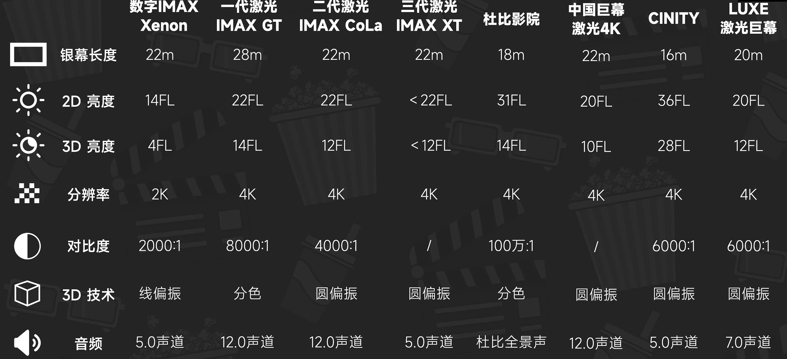

# 对比图

【全球 IMAX 及其他影厅数据】链接：https://docs.qq.com/sheet/DQ3FEUUZJdklNSWJP?tab=240rc1
# 总结
优选IMAX GT（中国只有北京电影博物馆一家商业开放的）。
次选CINITY、杜比影院。
次之IMAX CoLa（Commercial Laser）、中国巨幕CGS。
IMAX XT虽然是激光但是减配。
没有标注激光的普通IMAX就是数字IMAX Xenon（氙灯）。