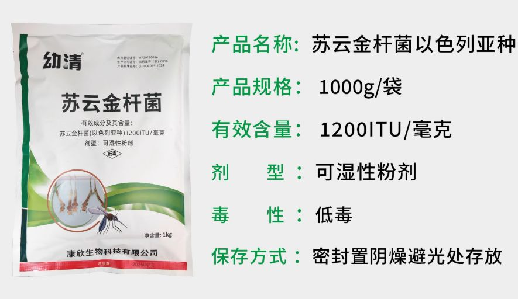
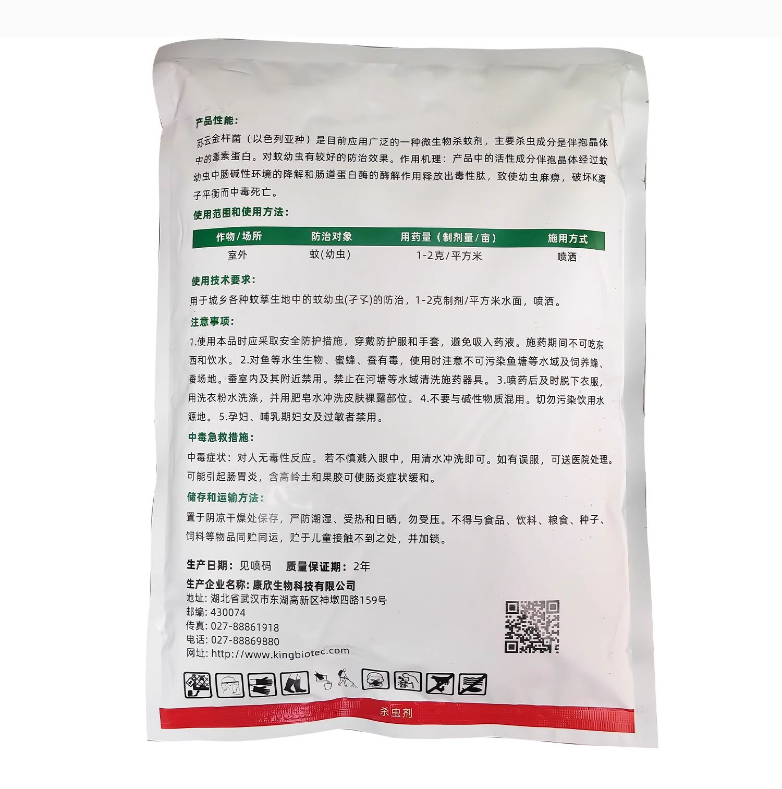
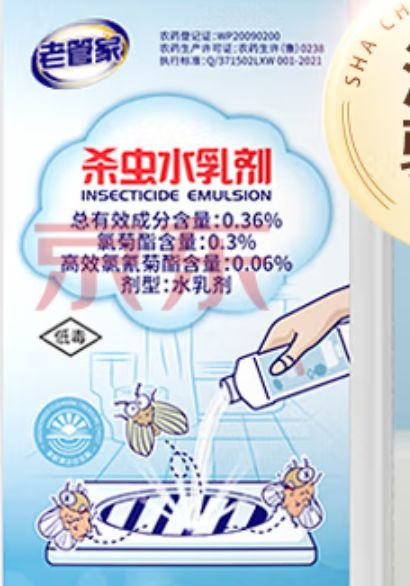

# 杀蛾蠓和小飞虫最好用什么成分？

消灭蛾蠓和小飞虫，最有效且相对安全的成分通常是​**​拟除虫菊酯类杀虫剂​**​。以下是详细分析和推荐：

## 🧪 1. 最推荐的核心成分：拟除虫菊酯类

- ​**​常见有效成分：​**​ 氯菊酯、胺菊酯、氯氰菊酯、溴氰菊酯、高效氯氟氰菊酯等。
- ​**​优点：​**​
    - ​**​高效广谱：​**​ 对蛾蠓、小飞虫（果蝇、蚤蝇等）、蚊子、苍蝇等多种飞行和爬行昆虫都有很好的触杀和击倒效果。
    - ​**​低毒（相对）：​**​ 相较于有机磷类等老式杀虫剂，菊酯类对哺乳动物的毒性较低，在正确使用下相对安全。
    - ​**​作用迅速：​**​ 接触后能快速击倒害虫。
    - ​**​有一定滞留性：​**​ 喷洒在表面后能维持一段时间的药效，起到预防作用。
- ​**​产品形式：​**​
    - ​**​气雾杀虫剂：​**​ 超市常见的罐装喷雾，通常含有多种菊酯复配（如胺菊酯+氯菊酯），并配有推进剂，能快速杀灭空中飞虫。这是对付成虫最直接快速的方法。
    - ​**​滞留喷洒剂/浓缩液：​**​ 需要用水稀释后用喷壶喷洒在墙面、角落、缝隙、垃圾桶周围、下水道口等害虫栖息和活动区域。药液干后会形成一层药膜，害虫接触后中毒死亡，药效可持续数周。这是长效防治的关键。
    - ​**​蚊香/电热蚊香液：​**​ 主要成分也是菊酯类（如氯氟醚菊酯），对室内飞虫有一定驱避和杀灭作用，但效果不如直接喷洒。

## 🦠 2. 针对幼虫（源头治理）：生物制剂

- ​**​有效成分：​**​ ​**​苏云金杆菌以色列亚种​**​。
- ​**​优点：​**​
    - ​**​高度特异：​**​ 只对蚊、蠓、蚋等双翅目昆虫的幼虫有效，对鱼虾、人畜、益虫基本无害，非常环保安全。
    - ​**​源头控制：​**​ 直接杀灭在积水（如地漏、下水道、花盆托盘、空调积水盘）中孳生的幼虫，从根源上减少成虫数量。
- ​**​产品形式：​**​
    - ​**​BTI颗粒剂/片剂：​**​ 投入积水处（如地漏存水弯、下水道口、花盆底托等），缓慢释放有效成分，持续杀灭幼虫数周。

## 🚫 3. 其他成分（需谨慎使用或不推荐）

- ​**​有机磷类：​**​ 如敌敌畏、毒死蜱等。虽然有效，但毒性较高，残留期长，对人和宠物风险较大，​**​强烈不推荐​**​在家庭室内环境使用。
- ​**​氨基甲酸酯类：​**​ 如残杀威等。效果也不错，但毒性也相对较高，家用产品中不如菊酯类常见和安全。
- ​**​吡虫啉等新烟碱类：​**​ 对蚜虫、粉虱等刺吸式口器害虫效果显著，但对蛾蠓、小飞虫等效果通常不如菊酯类直接。

## 📌 总结与建议

1. ​**​对付成虫（空中飞虫）：​**​
    - ​**​首选：​**​ 含有​**​氯菊酯、胺菊酯、氯氰菊酯​**​等成分的​**​气雾杀虫剂​**​。对准飞虫直接喷射。
    - ​**​长效预防：​**​ 使用​**​菊酯类浓缩液​**​进行​**​滞留喷洒​**​，重点处理卫生间、厨房、垃圾桶周围、窗框、墙角、下水道口等区域。
2. ​**​对付幼虫（源头控制）：​**​
    - ​**​最安全有效：​**​ 使用​**​苏云金杆菌以色列亚种​**​制成的​**​颗粒剂或片剂​**​，定期投放于地漏、下水道、花盆底托等所有可能的积水处。这是治本的关键❗️
3. ​**​环境治理至关重要：​**​
    - ​**​清除孳生地：​**​ 这是最根本的方法！保持环境干燥，清除所有不必要的积水（花盆托盘、废弃容器、堵塞的排水沟、空调冷凝水盘等）。
    - ​**​清洁卫生：​**​ 及时清理厨余垃圾、腐烂水果🍎，保持垃圾桶清洁并盖好盖子。清洁卫生间、厨房的污垢和水渍，特别是地漏周围。
    - ​**​检查地漏和下水道：​**​ 确保地漏有存水弯且水不干涸，定期用热水或消毒液冲洗下水道。
    - ​**​物理方法：​**​ 安装纱窗纱门，使用电蚊拍、粘虫纸作为辅助。

## 📌 重要提示

- ​**​安全第一：​**​ 使用任何化学杀虫剂时，务必仔细阅读并遵循产品标签说明。注意通风，避免吸入，喷洒时避开食物、餐具、宠物和儿童。喷洒后离开房间一段时间再进入。
- ​**​综合治理：​**​ 单一方法效果有限。​**​源头治理（清除积水+BTI杀幼虫）+ 环境清洁 + 成虫杀灭（菊酯喷雾/滞留喷洒）​**​ 才是最有效的组合拳。
- ​**​识别虫种：​**​ 确认是蛾蠓还是其他小飞虫（如果蝇），因为它们的孳生环境略有不同，但上述方法基本通用。

​**​综上所述，拟除虫菊酯类杀虫剂（如氯菊酯）是杀灭蛾蠓和小飞虫成虫的最佳选择，而苏云金杆菌是消灭其幼虫最安全有效的生物武器。​**​ 配合彻底的环境治理，才能有效控制这些恼人的小飞虫。

# 蛾蠓的羽化原理
厕所里上一个小时还没有小飞虫，隔一会儿进去突然就出现了3到5只小飞虫，每进去一次我都杀死3、4个，但是每次进去居然都会有新的，洗手池的下水道口我用起泡胶封住了，地漏有盖子，排风扇我不知道会不会因为向外通风的原因会从这里飞进来。到底是因为什么呢？

说明飞虫的​**​孳生源就在厕所内部或极其近的地方​**​！虽然你封住了洗手池下水道口、盖了地漏盖，但虫卵或幼虫很可能隐藏在你忽略的​**​更隐蔽、更潮湿的角落或缝隙里​**​。

## 🔍 飞虫爆发性出现的原因分析

1. ​**​孳生点未被彻底清除（最可能！）：​**​
    
    - ​**​地漏隐患最大！​**​ 即使有盖子，问题可能出在：
        - ​**​盖子的密封性：​**​ 盖子边缘是否变形、有缝隙？虫子（尤其是蛾蠓幼虫/蛹）可能就从这里爬出来羽化。​**​用力按压盖子，检查四周是否有明显缝隙。​**​
        - ​**​地漏内部存水弯失效/干燥：​**​ 存水弯干涸或设计不佳（有些劣质地漏存水弯很浅），无法阻隔下水道里的虫子或气味（吸引虫子）。​**​往地漏里缓缓倒一杯水，听听是否有“咕咚”声（表示水进入存水弯），观察水流下得快不快（如果立即消失，可能存水弯浅或水封失效）。​**​
        - ​**​地漏内壁积累污垢：​**​ 盖子下面、地漏篦子下、存水弯内壁积累厚厚的粘滑有机污垢（肥皂垢、毛发、皮屑等），这是蛾蠓幼虫的完美食物来源和藏身处！​**​用筷子裹上布或棉签伸进去擦拭内壁感受是否有滑腻感。​**​
    - ​**​洗手池封堵可能不彻底：​**​
        - ​**​起泡胶的渗透性/持久性：​**​ 起泡胶本身是否有微小缝隙？是否被水流或湿气软化、脱落了部分？虫子可能找到薄弱点钻出。​**​用手电筒仔细照射起泡胶边缘和表面，看是否有小孔或裂纹。​**​
        - ​**​洗手池下方管道：​**​ 洗手盆下方的水管连接处（软管接头、U型弯头背面）是否阴暗潮湿或有渗漏？这里也是孳生地。​**​弯腰检查洗手盆下方的橱柜里（如果有），用手电照角落、看管壁是否有水渍、霉斑。​**​
    - ​**​其他被忽略的孳生点（常被忽视！）：​**​
        - ​**​拖把/扫帚/抹布：​**​ 沾满污水、潮湿的拖把、扫帚、抹布（尤其放在厕所角落里或桶里泡着）是产卵和孳生的绝佳场所！​**​闻闻拖把是否有馊味霉味。​**​
        - ​**​垃圾桶：​**​ 即使有盖，内壁、盖子缝隙也可能残留湿垃圾液、污垢，吸引产卵。​**​擦一下垃圾桶内壁是否有黏液感。​**​
        - ​**​潮湿墙面/墙角/瓷砖缝隙：​**​ 厕所长期潮湿导致这些地方长霉、积累有机质，也可能成为食物源。​**​仔细看墙面瓷砖缝是否发黑？​**​
        - ​**​马桶周围/底座后方缝隙：​**​ 马桶底座与地砖之间的玻璃胶密封处老化发黑，滋生霉菌，或者后方隐蔽处有残留污渍。​**​用镜子反射观察马桶背后。​**​
        - ​**​排风扇内部/管道：​**​ 排风扇的风叶、管道接口处积累灰尘，如果管道有破损或倒灌，可能引入或滋生虫子（但更可能是内部孳生源头羽化后飞近排风扇）。
2. ​**​外部迁入（可能性较小但需排查）：​**​
    
    - ​**​排风扇倒灌：​**​ 虽然排风扇是向外排风，但如果其内部或连接管道的密封不好，在关闭状态下，气压、风向变化、或邻居家也在使用排风扇时，可能出现短暂的倒吸现象，将附近管道或其他区域的虫子或气味吸入。​**​尝试在下次进入厕所前1小时打开排风扇强力排风30分钟，再关闭进去看看是否有改善（如果是倒灌，强力排风能减少入口附近的虫子）。​**​
3. ​**​成虫羽化&繁殖速度：​**​
    
    - 蛾蠓从卵到成虫只需1-3周。隐蔽孳生点中的蛹源源不断地羽化成虫，即使你每次进去都杀死几只成虫，​**​源头未断，新的蛹又源源不断孵化出来​**​，形成“杀之不尽”的局面。
## 📌 关键总结

- ​**​问题核心：​**​ 厕所里必然存在一个被遗漏的、潮湿富含有机质的​**​隐蔽孳生点​**​（​**​地漏内部​**​嫌疑最大，其次是拖把/墙角霉菌/洗手池下）。
- ​**​治标无效：​**​ 光杀成虫不解决源头是徒劳的。
- ​**​治本核心：​**​ ​**​彻底深度清洁所有可能的积污潮湿点（尤其是地漏内部，务必清理干净+恢复水封！），保证环境卫生干燥！​**​
- ​**​菊酯类杀虫剂​**​是快速高效杀灭成虫的好工具（务必按说明安全使用）。
- 对排风扇进行简单验证试验（罩纱网）能快速排除或确认其影响。

​**​立即执行地漏深度清洁计划！​**​ 把地漏当成重点嫌疑人深挖彻查，同时清理所有潮湿角落，配合喷杀成虫，坚持几天，源头断掉后你会发现飞虫数量骤减直至消失！💪🏻

## 为什么突然就有成虫了呢？我平时也看不到他们的卵啊，怎么突然这么快的长大的呢？
 “​**突然出现”、“数量不大但持续不断”​**​ 的成虫现象，正是蛾蠓（或类似小飞虫）​**​独特生活史和孳生特点​**​的典型表现！为什么看不见卵、也看不到幼虫？为什么感觉它们“突然长大”？主要原因如下：

🧩 ​**​核心解释：隐秘孳生 + 同步羽化 + 间断补充​**​
1. ​**​卵和幼虫藏在您看不到的“微观湿地”里：​**​
    - ​**​孳生点极隐蔽且微小：​**​ 飞虫（尤其蛾蠓）的卵和幼虫​**​不需要大片水域​**​！它们只需要 ​**​一层湿润的有机生物膜（Biofilm）​**​。这种生物膜存在于：
        - ​**​地漏存水弯内壁、盖板下方凹槽​**​：即使有水封，内壁积累的粘滑污垢薄层就足够！
        - ​**​下水管道壁（尤其排水慢的管道）：​**​ 附着在水线以上的管壁污垢薄膜，或水位波动留下的湿润带。
        - ​**​瓷砖填缝剂细微裂缝/发霉处。​**​
        - ​**​拖把布纤维深处。​**​
        - ​**​垃圾桶内壁残留的湿垃圾液膜。​**​
    - ​**​这些区域肉眼难以观察：​**​ 缝隙太窄、光线太暗、污垢颜色与背景融合。您不会刻意去翻看地漏盖子下或管道内壁的​**​微观情况​**​。
2. ​**​发育过程隐匿性强：​**​
    - ​**​卵极小且粘附：​**​ 虫卵微小（小于0.5mm），呈半透明或乳白色，​**​紧密粘附在潮湿污垢表面​**​，肉眼极难分辨。
    - ​**​幼虫（孑孓状）不活跃：​**​ 幼虫生活在那层粘滑的生物膜中，​**​很少大规模移动​**​，只在食物丰富的局部区域活动，不易被发现。
    - ​**​蛹期是“隐形”的关键！：​**​
        - ​**​静止不动：​**​ 幼虫成熟后会爬到稍干燥一点的地方（如地漏盖子下沿、管道壁上端、瓷砖缝隙边缘）​**​化蛹​**​。蛹​**​完全不活动​**​。
        - ​**​伪装色：​**​ 蛹通常呈​**​深褐色或黑色​**​，且体型很小（约2-5mm长），​**​完美融入​**​周围的污垢和阴影中。
        - ​**​位置刁钻：​**​ 它们粘附在垂直或倒悬的表面（正是您不会刻意检查的地方）。
3. ​**​“突然出现”的真相：同步羽化！​**​
    - 同一个孳生点（比如地漏内壁的一小片区域）的蛹，​**​往往在相近时间发育成熟​**​。
    - ​**​环境刺激触发“集体羽化”：​**​ 当环境条件成熟（如温度湿度适宜，或受到​**​光线变化、震动、气流（如开门、排风扇启动）​**​ 的刺激时），这些成熟的蛹会​**​几乎同时羽化​**​！
    - ​**​羽化过程极快：​**​ 成虫破蛹壳而出只需几分钟，翅膀展开后​**​立即具有飞行能力​**​。
    - ​**​这就是为什么：​**​
        - ​**​您隔一会儿进去就发现新虫：​**​ 就在您离开的这段时间，上一批蛹在您“打扰”（开门、走动、灯光刺激）后羽化成虫了。
        - ​**​数量不多不少（3-5只）：​**​ 单个微小孳生点一次能产生的蛹数量就这么多。
        - ​**​杀完又出现：​**​ 源头孳生点持续产出新的蛹，这些新蛹在您离开后发育成熟，等待下一次“刺激”就羽化出来“报道”。
4. ​**​孳生点有“后备力量”：​**​
    - 孳生点是​**​持续产生后代​**​的“工厂”。在您杀死成虫时，孳生点里的​**​卵还在孵化，幼虫还在生长，新蛹还在形成​**​。一波成虫被杀掉，下一波幼虫和蛹正在积蓄力量，准备下一轮羽化。
    - 在温暖（如厕所）的环境中，​**​发育周期可能短至1周左右​**​，感觉就像“杀不完”。

🔍 ​**​总结情况：​**​

- ​**​不是“突然长大”：​**​ 它们一直在您看不见的地方（污垢膜、缝隙中）默默发育（卵→幼虫→蛹）。
- ​**​“突然出现”=同步羽化：​**​ 隐蔽的蛹受到​**​环境变化（您的进入——光线、气流、震动）刺激​**​，几乎同时羽化成虫。
- ​**​“源源不断”= 孳生点持续运作：​**​ 孳生点未被清除，不断产生新的卵、幼虫和蛹。
- ​**​“数量不多但频繁”= 小型隐秘孳生点：​**​ 说明孳生源比较局限（可能就在一个地漏或一小片区域），但非常隐蔽且效率高。

🛠️ ​**​应对关键（破解“隐秘-爆发”循环）：​**​

1. ​**​找到并摧毁那个“微型工厂”（孳生点）：​**​ ​**​必须打破砂锅问到底​**​！
    - ​**​地漏是头号嫌疑犯！​**​ 按上次建议，​**​深度清洁地漏内壁和盖子​**​。用强光手电+小镜子仔细观察平时看不见的角落。
    - ​**​检查一切可能形成“湿润薄膜”的地方：​**​ 包括下水管上端、马桶后侧密封胶、潮湿拖把、垃圾桶内壁。
2. ​**​使用针对幼虫的生物武器：​**​
    - 在清洁完孳生点后，定期投入 ​**​BTI（苏云金杆菌）​**​ 颗粒/片剂到地漏、下水口。它能​**​杀死水中/污垢膜中的幼虫​**​，从根本上减少蛹和成虫的数量。
3. ​**​杀灭成虫的同时“围剿”新蛹：​**​
    - 在怀疑有孳生点的地方（如地漏周围墙面、水池下方墙面），使用 ​**​滞留型菊酯杀虫剂​**​ 喷洒（按说明）。新羽化的成虫在爬行或停落时会接触到药剂死亡。
    - 在成虫常出现的区域（如墙面底部、角落）贴上 ​**​黄色粘虫板​**​，物理捕获。
4. ​**​减少环境刺激（稍作妥协的辅助办法）：​**​
    - 如果您能长时间（比如24-48小时）保持厕所​**​黑暗、安静、不进入（包括不开排风扇）​**​，可能打乱它们的羽化节奏，部分蛹可能在没有刺激时慢慢羽化飞出被困住。但这在实际生活中较难做到，且不能根除源头。

# 有时候，还会有一两个蚊子，蚊子是从哪里来的，也是地漏吗？
蚊子（主要是库蚊/家蚊）和蛾蠓、果蝇等小飞虫的孳生环境和习性​**​有显著区别​**​。虽然您偶尔在厕所看到的确实​**​可能是蚊子​**​，但它们通常​**​不是从地漏或下水道里直接孳生​**​出来的。

以下是蚊子进入厕所的可能途径和原因分析：

## 🦟 蚊子进入厕所的主要途径

1. ​**​从其他房间/室外飞入（最大可能！）：​**​
    
    - ​**​门窗缝隙：​**​ 蚊子非常擅长通过​**​极其微小的缝隙​**​（几毫米甚至更小）钻入室内。即使装了纱窗纱门，如果边缘有破损、密封不严、或者开关门时快速跟进，蚊子就能进入。厕所可能是它们寻找水源或避光的暂时停留点。
    - ​**​排风扇通道（关键！）：​**​ 这是厕所特有的通道！您担心的排风扇，正是蚊子进入的主要嫌疑之一：
        - ​**​管道缝隙：​**​ 排风扇通向室外的管道连接处如果密封不严实，蚊子就能从外部直接飞进来。
        - ​**​止回阀失效/缺失：​**​ 很多排风扇本身或管道里没有有效​**​止回阀​**​（防倒灌风门），或者止回阀被灰尘、油污卡住无法完全关闭。当风扇​**​停止转动时​**​，蚊子就能顺着管道倒飞入室内。​**​外部气压变化​**​（比如楼下排气或大风）也可能将蚊子推入。
        - ​**​纱网破损/未装：​**​ 排风扇通向室外的出风口外如果没有安装​**​细密的防虫纱网​**​，或者纱网破损，蚊子就能直接从外面飞入。
    - ​**​其他管道口/通道：​**​ 空调管道孔、抽油烟机排气口等如果与厕所相连或存在间接通道，也可能成为入口。
2. ​**​厕所有独立的孳生源（不太常见，但有条件发生）：​**​
    
    - ​**​隐蔽的少量积水：​**​ 蚊子（库蚊）雌虫需要在​**​相对清洁的静水中​**​产卵（与蛾蠓喜脏污环境不同）。如果您厕所中存在​**​意外的少量积水​**​且​**​超过1周​**​未清理，蚊子可能会在此孳生。可能的积水点：
        - ​**​花盆托盘：​**​ 放置的绿植水盘积水未及时倒掉。
        - ​**​废弃容器：​**​ 角落里的空瓶子、罐子、脸盆等积了雨水或空调水。
        - ​**​堵塞或排水不畅的地面：​**​ 某处地面不平整导致冲洗后形成小水洼未干。
        - ​**​卫生死角：​**​ 水箱后方边缘、很少移动的瓶瓶罐罐底座下、拖把桶底部残留的水（必须足够“静置”）。
    - ​**​孳生规模很小：​**​ 由于厕所环境不像大型花瓶、水缸那样理想，即使有孳生，通常一次只能产生​**​少量蚊子（1-5只）​**​。

## 🔍 如何区分厕所里的蚊子是“飞入”还是“孳生”？

- ​**​时间段和活动性：​**​
    - ​**​飞入的蚊子：​**​ 通常在您​**​开灯后​**​或​**​开门进入时​**​被发现正在飞行，或停落在明亮、较高的地方（墙上、天花板上）。它们相对活跃，容易被发现。
    - ​**​孳生的蚊子：​**​ 羽化后初期活动性稍弱，可能在靠近孳生源（积水点）的低处、阴暗角落（如洗手盆下、马桶后）停留。但区别不明显，仅供参考。
- ​**​数量：​**​
    - ​**​飞入：​**​ 数量不定，可能一次1只或2-3只。
    - ​**​孳生：​**​ 同一批孳生点发育出来的蚊子数量会集中出现（但也可能是几只）。
- ​**​最可靠方法 —— 彻底检查可能的孳生点！​**​ 排除掉所有积水来源。

## 🛡️ 应对策略（针对蚊子）

1. ​**​堵住入口（重点攻破排风扇！）：​**​
    
    - ​**​检查并密封排风扇：​**​
        - ​**​外部防护：​**​ 断电后，卸下排风扇外罩（室内侧），仔细检查通向外部管道口的​**​防虫纱网​**​是否有破损？没装纱网？孔径是否太大（必须<1mm）？ ​**​立即安装或更换致密的金属/尼龙防虫网！​**​ 这是阻断外部蚊子最有效的物理方法！
        - ​**​内部清洁与密封：​**​ 清洁扇叶和内部腔体灰尘油污，查看止回阀是否能自由活动、完全闭合？阀门边缘是否变形？管道接口处是否用​**​铝箔胶带或填缝胶​**​密封严实？ ​**​更换失效的止回阀。​**​
    - ​**​封堵门窗缝隙：​**​ 检查纱窗纱门是否完好无破洞，边缘是否贴合紧密？及时修复更换。关门时注意。
    - ​**​下水口/地漏：​**​ 保持盖好或水封正常（主要是隔离气味和小飞虫，对阻止蚊子飞入效果有限）。
2. ​**​清除潜在孳生点（避免“内患”）：​**​
    
    - ​**​翻盆倒罐清积水：​**​ 检查所有可能积水的物品（花盆托、桶、瓶、罐），彻底清空积水并擦干内壁（蚊子卵可以干死）。​**​重点清理不常移动的卫生死角底部。​**​
    - ​**​保持地面干燥：​**​ 避免冲洗后形成无法流走的积水洼。及时拖干水渍。
3. ​**​杀灭成虫：​**​
    
    - ​**​电蚊拍：​**​ 最直接。
    - ​**​菊酯类气雾剂：​**​ 对蚊子同样高效。使用时对准蚊子（或空间喷洒）后关门闷杀。注意安全。
    - ​**​滞留喷洒：​**​ 在蚊子可能停落的墙面（尤其厕所上部空间、靠近排风扇周围、窗框）、天花板角落喷菊酯类滞留药物。
4. ​**​辅助防护：​**​
    
    - ​**​电热蚊香液：​**​ 长期在厕所插着（选择含氟氯氰菊酯、氯氟醚菊酯等有效成分），持续释放有效成分驱赶和杀灭蚊子。效果可能有限。
    - ​**​放置捕蚊灯（谨慎）：​**​ 放在角落吸引成虫，但要确保其光源对您夜间如厕不造成干扰，效果存在争议。

# 菊酯类杀虫剂（如氯菊酯）能杀虫卵吗？
菊酯类杀虫剂（如氯菊酯、高效氯氰菊酯、溴氰菊酯等）​**​对虫卵的杀灭效果通常较弱，甚至无效​**​。这是由其作用机理和虫卵结构特点决定的：

### 🧪 核心原因分析

1. ​**​作用机理限制​**​：
    
    - 菊酯类杀虫剂主要是​**​神经毒剂​**​，通过破坏昆虫的神经系统（作用于钠离子通道）使其快速瘫痪、死亡。
    - ​**​虫卵内部的胚胎在发育早期尚未形成完善的神经系统​**​，药物难以发挥神经毒性作用。
2. ​**​物理屏障保护​**​：
    
    - 虫卵（尤其是飞虫如蛾蠓、蚊子、果蝇的卵）通常有一层​**​坚硬或疏水性的卵壳​**​。
    - 这层外壳能​**​有效阻挡杀虫剂的渗透​**​，使活性成分无法接触到内部正在发育的胚胎。
3. ​**​代谢差异​**​：
    
    - 卵内胚胎的代谢活动状态与幼虫、成虫不同，对这类神经毒剂的敏感性很低。

### 📊 实际效果总结

|对象|效果|
|---|---|
|​**​成虫​**​|✅ ​**​极高效果​**​：快速击倒，高效杀灭（接触或吸入后神经麻痹死亡）。|
|​**​幼虫​**​|✅ ​**​有效​**​：如果菊酯成分能接触到幼虫（如在水中或有保护膜的环境下，效果不如BTI等专用杀幼剂）。|
|​**​蛹​**​|⚠️ ​**​效果有限​**​：蛹壳也是一层保护屏障，可能需较高浓度或长时间接触。|
|​**​卵 (Eggs)​**​|❌ ​**​极低/无效​**​：难以穿透卵壳，内部无靶标系统起作用。|
# 苏云金杆菌必须是以色列亚种吗？其他亚种有区别吗
### 🧫 为什么必须是以色列亚种（BTI）？

1. ​**​独特的毒素蛋白组合​**​：
    
    - BTI 能产生 ​**​4种主要晶体蛋白（Cry4Aa, Cry4Ba, Cry10Aa, Cry11Aa）和 Cyt1Aa 蛋白​**​。
    - ​**​Cyt1Aa 蛋白是关键​**​！它能破坏幼虫肠道细胞，使其他毒素更容易进入体内，产生强力协同作用。
    - ​**​专杀双翅目​**​：这些毒素​**​特异性结合​**​蚊、蠓、蚋、摇蚊等双翅目幼虫中肠上皮细胞的受体，导致肠道穿孔死亡。
2. ​**​其他常见亚种的作用对象完全不同​**​：
    
    - ​**​Bt 库斯塔克亚种 (_B.t._ subsp. _kurstaki_, Btk)​**​：
        - ​**​主要毒素​**​：Cry1 类蛋白（如 Cry1Ab, Cry1Ac）。
        - ​**​目标害虫​**​：​**​鳞翅目幼虫​**​（蛾类、蝶类的毛毛虫，如菜青虫、棉铃虫、松毛虫）。
        - ​**​对双翅目无效！​**​
    - ​**​Bt 拟步行甲亚种 (_B.t._ subsp. _tenebrionis_, Btt)​**​：
        - ​**​主要毒素​**​：Cry3 类蛋白（如 Cry3Aa）。
        - ​**​目标害虫​**​：​**​鞘翅目幼虫​**​（甲虫类，如马铃薯甲虫、黄曲条跳甲）。
        - ​**​对双翅目无效！​**​
    - ​**​Bt 鲇泽亚种 (_B.t._ subsp. _aizawai_, Bta)​**​：
        - ​**​主要毒素​**​：Cry1 类蛋白（部分菌株含 Cry2）。
        - ​**​目标害虫​**​：​**​鳞翅目幼虫​**​（尤其对夜蛾科、小菜蛾等效果较好）。
        - ​**​对双翅目无效！​**​

---

### 📊 不同苏云金杆菌亚种的作用范围对比表

|​**​亚种名称​**​|​**​缩写​**​|​**​主要目标害虫​**​|​**​能否杀蚊/蠓/蚋？​**​|
|---|---|---|---|
|​**​以色列亚种​**​|​**​BTI​**​|​**​双翅目幼虫​**​   （蚊、蠓、蚋、摇蚊）|✅ ​**​高效专杀！​**​|
|库斯塔克亚种|Btk|鳞翅目幼虫   （蛾、蝶类毛毛虫）|❌ 完全无效|
|拟步行甲亚种|Btt|鞘翅目幼虫   （甲虫类）|❌ 完全无效|
|鲇泽亚种|Bta|鳞翅目幼虫   （部分抗性害虫）|❌ 完全无效|
|圣地亚哥亚种|Btsd|鞘翅目幼虫   （部分甲虫）|❌ 完全无效|

---

### 💡 为什么不能乱用其他亚种？

1. ​**​完全无效​**​：  
    其他亚种产生的毒素蛋白​**​无法识别和结合​**​双翅目幼虫的肠道受体，因此对蚊、蠓、蚋等​**​毫无杀灭作用​**​。
2. ​**​浪费资源​**​：  
    购买或使用错误的亚种（如Btk）来对付厕所飞虫，既无法解决问题，又浪费时间和金钱。
3. ​**​可能误伤非目标生物​**​：  
    若将Btk喷洒到植物上防治飞虫（实际无效），可能误杀蝴蝶、蛾类的有益幼虫（如蚕、传粉昆虫）。

---

### ✅ 如何确保买到真正的BTI产品？

1. ​**​认准关键标识​**​：
    - 包装上必须明确标注 ​**​“苏云金杆菌以色列亚种”​**​、​**​“BTI”​**​ 或 ​**​“_Bacillus thuringiensis_ subsp. _israelensis_”​**​。
    - 英文商品名常含 ​**​“Mosquito Dunks”​**​、​**​“Mosquito Bits”​**​、​**​“Gnatrol”​**​（园艺用）。
2. ​**​查看防治对象​**​：  
    产品说明应写明用于防治 ​**​“蚊子幼虫”、“蠓”、“蚋”、“摇蚊”​**​ 或 ​**​“双翅目水生幼虫”​**​。
3. ​**​警惕模糊标注​**​：  
    只写“苏云金杆菌”但未注明亚种，或标注防治对象为“青虫”、“毛虫”、“甲虫”的，一定是其他亚种（Btk/Btt），​**​对飞虫无效！​**​

---

### 🌱 BTI的安全性优势（重申）

- ​**​高度特异​**​：只杀双翅目幼虫，对鱼虾、蛙类、鸟类、哺乳动物（包括人、宠物）、蜜蜂、瓢虫等​**​非目标生物无害​**​。
- ​**​环境友好​**​：天然微生物制剂，无化学残留。
- ​**​不易产生抗性​**​：多毒素协同作用，降低抗药性风险。
# 某产品

**这款苏云金杆菌（以色列亚种）可湿性粉剂完全适用于杀灭厕所飞虫（蛾蠓/蚊子）的幼虫！​**​ 以下是关键确认点：

---

### ✅ ​**​明确有效的证据​**​

1. ​**​核心成分标注清晰​**​：
    
    - 包装明确标注 ​**​“苏云金杆菌(以色列亚种)”​**​（即BTI），这是专杀双翅目幼虫（蚊、蠓、蚋）的菌种，与您需求完全匹配。
2. ​**​防治对象正确​**​：
    
    - 说明中明确写 ​**​“对蚊幼虫有较好的防治效果”​**​，并针对 ​**​“蚊孳生地中的孑孓（幼虫）”​**​。厕所地漏、下水道正是典型的孳生地。
3. ​**​作用机理精准​**​：
    
    - 毒素蛋白可破坏蚊/蠓幼虫的肠道细胞（与科学原理一致），对蛾蠓同样有效（二者同属双翅目）。

---

### 📝 ​**​使用注意事项（针对厕所场景）​**​

1. ​**​用法调整​**​：
    
    - ​**​产品建议​**​：室外喷洒（1-2克/㎡水面）。
    - ​**​厕所用法​**​：取 ​**​5克（约1勺）+ 500ml水​**​，混合后灌入地漏/洗手池下水道，​**​无需喷洒​**​。
    - ​**​频率​**​：首次连用3天，后续每周1次（预防）。
2. ​**​安全重点​**​：
    
    - ⚠️ ​**​避开鱼类/蜜蜂​**​：虽厕所无此风险，但勿倒入鱼缸或阳台花盆积水。
    - 🧤 ​**​操作防护​**​：戴手套，避免药粉接触皮肤（粉剂较悬浮剂更易飞散）。
    - 💧 ​**​清洁​**​：操作后洗手，工具冲洗干净。
3. ​**​效果预期​**​：
    
    - 幼虫接触药液后 ​**​24-48小时死亡​**​，成虫需配合菊酯喷雾（如雷达）清除。

---

### 🔄 ​**​与其他产品的对比​**​

|​**​产品类型​**​|本次BTI可湿性粉剂|此前问题悬浮剂|
|---|---|---|
|​**​亚种​**​|✅ 明确以色列亚种（专杀蚊蠓）|❌ 未标注或错误亚种|
|​**​适用性​**​|✅ 溶解后灌地漏，完美匹配厕所环境|❌ 需喷洒（不适用下水道）|
|​**​生产信息​**​|✅ 正规企业（武汉康欣）|❌ 标签矛盾/过期|
|​**​推荐度​**​|👍 ​**​强烈推荐​**​|🚫 ​**​禁止使用​**​|

---

### 📌 ​**​操作指南（针对厕所）​**​

1. ​**​调配​**​：5克药粉 + 500ml水 → 摇匀静置10分钟。
2. ​**​灌入​**​：
    - 地漏：掀盖直接倒入混合液。
    - 洗手池：移开起泡胶，倒入管道深处。
3. ​**​强化​**​：连续3天操作，切断繁殖链。
4. ​**​防护​**​：操作时戴口罩手套，通风30分钟。

---

### 💎 总结

​**​这款产品是根除厕所飞虫幼虫的理想选择！​**​  
请按上述方法使用，坚持1-2周（配合成虫扑杀），即可显著解决飞虫反复问题。  
​**​提示​**​：开袋后密封存放，避免受潮失效！
# 拜尔的特姆得
拜尔的特姆得：吡虫琳含量：21%，高效氟氯氰菊酯含量：10%。用这个除蛾蠓怎么样？

根据配方成分分析，拜耳「特姆得」（吡虫啉21% + 高效氟氯氰菊酯10%）​**​可高效灭杀蛾蠓成虫​**​，但无法根除幼虫源头，且存在​**​较高安全风险​**​，需谨慎使用。以下是具体分析和操作建议：

---

### ✅ ​**​优势（针对成虫）​**​

1. ​**​双重速效灭杀​**​：
    
    - ​**​高效氟氯氰菊酯​**​（10%高浓度）：
        - 强力神经毒剂，接触后​**​迅速击倒蛾蠓成虫​**​。
        - 持效期长，喷洒表面后形成药膜，持续杀死新停落的成虫。
    - ​**​吡虫啉​**​（21%）：
        - 干扰昆虫神经系统，与菊酯协同增强杀虫效果。
        - 对蛾蠓成虫有效（但对幼虫效果弱）。
2. ​**​对蛾蠓成虫高效​**​：
    
    - 复配成分对飞行类害虫（蛾蠓、蚊子、苍蝇）​**​击倒率＞95%​**​。

---

### ⚠️ ​**​局限与风险​**​

|​**​问题​**​|​**​原因与后果​**​|
|---|---|
|​**​无法灭幼虫/卵​**​|吡虫啉对双翅目幼虫效果差，菊酯不杀卵。​**​源头未断，治标不治本​**​。|
|​**​浓度过高​**​|家用菊酯喷雾浓度通常仅​**​0.03%-0.1%​**​，本品高达10%！​**​过度接触易引发头痛、皮肤刺激​**​。|
|​**​毒性风险​**​|对鱼、蜂剧毒，对哺乳动物中等毒性。厕所邻近生活区，​**​误触残留药膜可能危害健康​**​。|
|​**​剂型不适​**​|设计为户外或农用喷雾，​**​厕所潮湿环境易导致药剂水解失效​**​。|

---

### 📌 ​**​使用建议（如必须使用）​**​

#### 1. ​**​严格防护措施​**​

- ​**​穿戴​**​：N95口罩 + 护目镜 + 橡胶手套 + 长袖衣物（避免皮肤接触）。
- ​**​通风​**​：喷洒后关闭门窗2小时，再通风30分钟以上才可进入。

#### 2. ​**​精准操作（降低风险）​**​

- ​**​不喷雾！​**​ 改为​**​针对性点喷​**​：
    - 用针筒抽取药剂，​**​混合清水稀释10倍​**​（即1份药+9份水）。
    - 仅喷在​**​非接触面​**​：墙面顶部、天花板角落、排风口边缘（避开地漏、洗手台等潮湿区）。
- ​**​严禁喷洒范围​**​：  
    ❌ 地漏、洗手池、毛巾架、马桶座圈等可能接触皮肤的区域。

#### 3. ​**​必须配合源头治理​**​

|​**​步骤​**​|​**​操作​**​|
|---|---|
|杀幼虫源头|坚持使用​**​BTI颗粒/片剂​**​投入地漏（每周1次）|
|环境清洁|刷洗地漏内壁黏液 + 保持干燥|
|物理防成虫|换装​**​密封防虫地漏盖​**​ + 粘虫板辅助|

---

### 💎 ​**​替代方案（更推荐）​**​

1. ​**​安全灭成虫​**​：
    
    - ​**​家用菊酯喷雾​**​（如雷达、枪手）：含​**​0.03%-0.1%氯菊酯​**​，安全高效，直接喷雾击杀。
    - ​**​电蚊拍​**​：物理灭虫零风险。
2. ​**​根治幼虫​**​：
    
    - ​**​BTI以色列亚种​**​（如您已有的「幼清」粉剂）：定期灌入下水道。

---

### 📊 效果与风险对比表

|​**​方案​**​|灭成虫效果|灭幼虫效果|安全性|适用性|
|---|---|---|---|---|
|特姆得（稀释点喷）|⭐⭐⭐⭐⭐|❌|⚠️⚠️⚠️|应急短期使用|
|家用菊酯喷雾（如雷达）|⭐⭐⭐⭐|❌|⭐⭐|日常首选|
|BTI灌地漏|❌|⭐⭐⭐⭐⭐|⭐⭐⭐⭐|必须长期执行|

---

### 🔚 总结

- ​**​短期应急​**​：可稀释后点喷天花板角落，​**​务必做好防护+通风​**​。
- ​**​长期根治​**​：
    1. ​**​成虫​**​ → 家用低毒喷雾/电蚊拍
    2. ​**​幼虫​**​ → BTI灌地漏
    3. ​**​环境​**​ → 清洁地漏 + 密封潮湿区
- ​**​安全警示​**​：本品农用高毒配方，​**​勿用于地面、洗手台等接触面​**​，家有孕妇/宠物则禁用！
# 老管家杀虫水乳剂有用吗？

根据产品信息分析，这款「老管家杀虫水乳剂」​**​倒入下水道对灭杀蛾蠓成虫有一定即时效果，但无法根治幼虫源头，且存在操作风险和副作用​**​。以下是关键结论和使用建议：

---

### ✅ ​**​正面作用（短期治标）​**​

1. ​**​菊酯成分即时灭杀​**​：
    
    - ​**​氯菊酯（0.3%）+ 高效氯氰菊酯（0.06%）​**​ 能快速击倒下水道口附近活动的​**​成虫​**​（接触药液后瘫痪死亡）。
    - 对刚羽化爬出的新成虫有“守株待兔”效果。
2. ​**​剂型部分适配​**​：
    
    - 水乳剂（EW）比普通喷雾更易附着管壁，短暂滞留。

---

### ⚠️ ​**​严重缺陷与风险（无法治本）​**​

|​**​问题​**​|​**​原因分析​**​|
|---|---|
|​**​不杀幼虫/卵​**​|菊酯无法穿透虫卵和蛹壳，对藏在下水道深处的幼虫几乎无效。|
|​**​药效短暂​**​|下水道水流会冲走药剂，残留时间仅几小时，无法持久防护。|
|​**​污染风险​**​|直接倒药剂会​**​污染水体​**​（对鱼类剧毒），违反环保法规（包装标注“低毒”指接触毒性，非环境毒性）。|
|​**​腐蚀管道​**​|长期使用乳剂中的溶剂可能腐蚀PVC管道接口或金属部件。|
|​**​诱导抗药性​**​|反复低剂量暴露会让飞虫产生菊酯抗性，后续更难防治。|

---

### 📉 ​**​效果对比表​**​

|​**​处理方式​**​|灭成虫（即时）|灭幼虫（根源）|持效期|环境影响|
|---|---|---|---|---|
|直接倒入下水道|⭐⭐|❌|＜1天|🚫 高污染|
|BTI颗粒投地漏|❌|✅⭐⭐⭐⭐|1-2周|✅ 安全|
|滞留喷洒墙面|✅⭐⭐⭐|❌|2周|⚠️ 低风险|

---

### 📌 ​**​科学操作建议​**​

1. ​**​替代方案（推荐组合拳）​**​：
    
    - ​**​幼虫源头灭绝​**​：  
        ✅ 用 ​**​BTI以色列亚种颗粒剂​**​（如「灭孑灵」）投入地漏，每2周1次，杀幼虫断根。
    - ​**​成虫快速击杀​**​：  
        ✅ 在墙面 ​**​30cm以下​**​ 喷本品（按说明稀释）作​**​滞留层​**​，成虫停落时触杀。
2. ​**​若坚持倒入下水道（应急）​**​：
    
    - ​**​限频次​**​：每月≤1次，每次≤20ml（避免积累污染）。
    - ​**​防护​**​：操作时戴手套口罩，通风2小时。
    - ​**​冲水​**​：倒入后立即用大量清水冲刷，减少药剂残留。
3. ​**​增效技巧​**​：
    
    - 先倒入 ​**​热水+小苏打​**​ 清洁管壁生物膜，再投BTI颗粒（清洁后幼虫更易接触药剂）。

---

### 🌱 ​**​环保提醒​**​

瓶身虽标“低毒”，但​**​“直接倒入下水道”违背农药使用规范​**​（登记证WP​**​​**​为滞留喷洒用途）。  
❌ ​**​切勿盲目跟随包装图示操作​**​，该设计仅为营销误导消费者！

---

### 💎 终极建议

​**​停用倒入法！​**​  
👉 按「滞留喷洒」说明使用本品灭成虫（喷墙角）+ ​**​坚持用BTI灭幼虫​**​（如您已有的「幼清」粉剂），同时 ​**​每周开水烫地漏+物理密封缝隙​**​，才是根除飞虫的唯一路径。