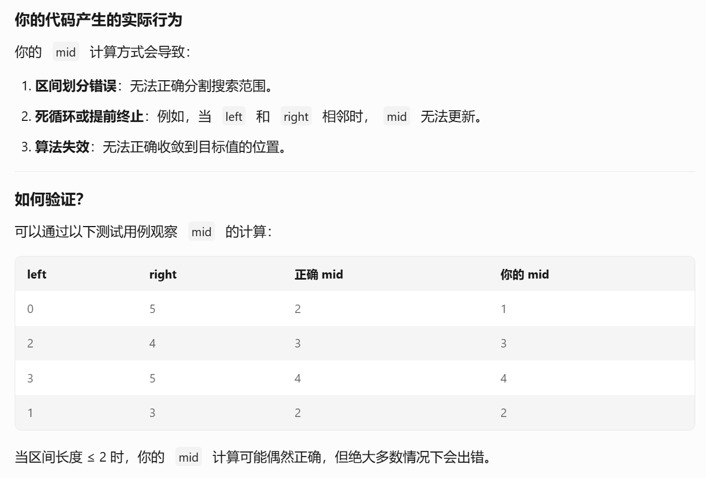

https://leetcode.cn/problems/binary-search/
# 内容

给定一个 `n` 个元素有序的（升序）整型数组 `nums` 和一个目标值 `target`  ，写一个函数搜索 `nums` 中的 `target`，如果目标值存在返回下标，否则返回 `-1`。

**示例 1:**

**输入:** `nums` = `[-1,0,3,5,9,12]`, `target` = 9
**输出:** 4
**解释:** 9 出现在 `nums` 中并且下标为 4

**示例 2:**

**输入:** `nums` = `[-1,0,3,5,9,12]`, `target` = 2
**输出:** -1
**解释:** 2 不存在 `nums` 中因此返回 -1

**提示：**

1. 你可以假设 `nums` 中的所有元素是不重复的。
2. `n` 将在 `[1, 10000]`之间。
3. `nums` 的每个元素都将在 `[-9999, 9999]`之间。
# 代码（线性探测重复值）
```cpp
class Solution {
public:
    int search(vector<int>& nums, int target) {
        int pos = -1;
        int left = 0;
        int right = nums.size() - 1;
        while (left <= right)
        {
            int mid = ((right - left) >> 1) + left;
            if (target < nums[mid])
            {
                right = mid - 1;
            }
            else if (target > nums[mid])
            {
                left = mid + 1;
            }
            else // ==
            {
                pos = mid;
                while (pos > left && nums[pos - 1] == target)
                {
                    --pos;
                }
                break;
            }
        }
        return pos;
    }
};
```
## 坑1
我第一次在线性向前探测重复值的时候写错了 while 的判断条件，不应该是`pos > 0`，而是`pos > left`
## 坑2
第一次写的时候，把`>> 2`右移运算符写成了大于号`> 2`，而且，不应该是`>> 2`，应该是`>> 1`右移1位，也就是对应着除以2。这是致命的错误。

但是测试用例居然全都通过了！这可能是因为我用到了线性探测，让算法实际以遍历的形式找到了正确答案......
# 心得
在做二分查找或者分治思想类的题目，最难、最重要的把握点是物理下标和逻辑下标的关系。
像这个题目中，`left`、`right`、`mid`都是物理下标。
物理下标应该实时更新。
不应该只出现逻辑下标。
就像线性探测时的 while 条件中判断`pos > 0`就是错误使用了逻辑下标去充当条件。应当是`pos > left + 0`，省略`+ 0`即为`pos > left`。
# 优化代码（继续二分探测）
```cpp
class Solution {
public:
    int search(vector<int>& nums, int target) {
        int pos = -1;
        int left = 0;
        int right = nums.size() - 1;
        while (left <= right)
        {
            int mid = ((right - left) >> 1) + left;
            if (target < nums[mid])
            {
                right = mid - 1;
            }
            else if (target > nums[mid])
            {
                left = mid + 1;
            }
            else // ==
            {
                pos = mid;
                right = mid - 1;
            }
        }
        return pos;
    }
};
```
这能让探测行为继续保持二分的$O(\log {n})$的复杂度进行。
从 $O(\log {n} + k)$（k为重复次数）优化至 $O(\log {n})$，完全消除了线性探测的开销。
# 总结
