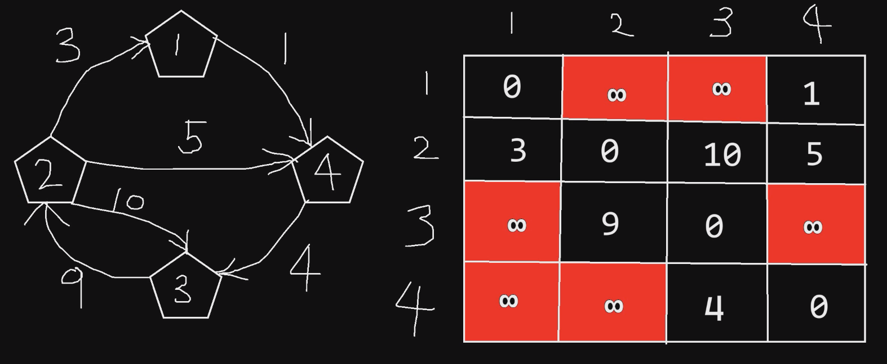
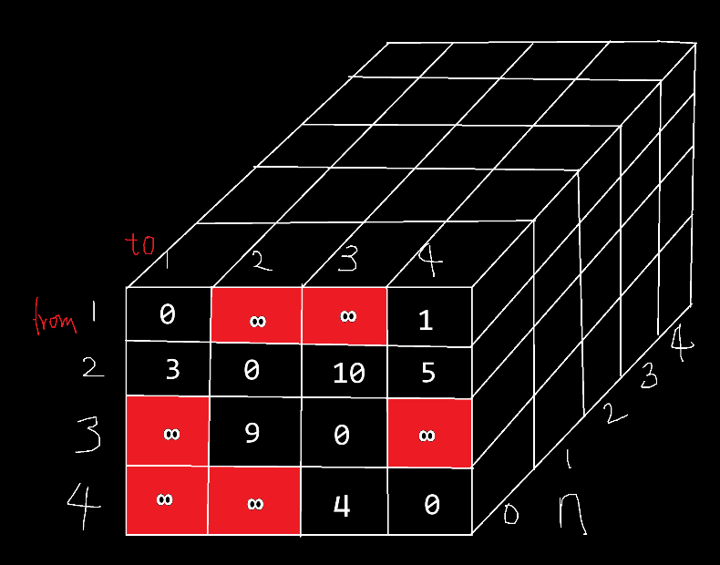

# Floyd

Floyd是图的经典算法，可以使用动态规划方法解决。但是真正写图搜索算法时不要用Floyd算法，因为它比Dijkstra较慢。但是Floyd对于算法思想的启发很有研究价值。实用价值、研究价值要辩证看。
# 图

和树一样，有好多节点，但没有树的规律。树是图的子集。

1. 节点和节点之间可以是连通的也可以是不连通的。
2. 连通的线如果没有方向则称之为无向图，如果有方向则为有向图。
3. 如果有循环，则是有环图；如果没有循环则是无环图。

1. 节点的出度：离开这个节点的线的个数；
2. 节点的入度：进入这个节点的线的个数。

应用：地图算法，搜索、寻路；软件工程中Element Block利用有向无环图进行拓扑排序，根据依赖关系、前置关系进行排序。但是还是没有树的应用范围广。

网络路由选择：OSPF（开放式最短路径优先）中就用到了Dijkstra算法。配置路由表。

## 术语

1. 逆时针：CCW (Counter Clock Wise)
2. 顺时针：CW (Clock Wise)

## 计算机处理图实际的数据结构



# Floyd - 动态规划思想

从某一点到某一点，选择通路，求最短的路径长度。

第一个参数是始发节点，第二个参数是目的节点。第三个参数是可以参与的节点范围（如果是4，则表示1、2、3、4节点全都可以参与），如果是0的话，表示没有中间节点参与。

比如说：`floyd(from, to, n)`表示：从节点from走到节点to，节点1到n可以参与。求最短路径长度。

运用背包问题的思想。

```c
floyd(from, to, n)
    不选择第n节点：floyd(from, to, n - 1)
    选择第n节点：  floyd(from, n, n - 1) + floyd(n, to, n - 1)
    最终结果：min {不选择, 选择}
终止条件：
    （1）没有节点参与时，即n == 0 - 结果值为权重表对应数值(某点直接到某点的距离)
    （2）from == to，到达自身。  - 结果值为0
递归方法的时间复杂度：3^n
```

## 递归法

如果不选择节点n，则`from`到`to`还需在剩下的`n-1`节点中走。
如果选择节点n，则问题分解成了`from`到节点`n`（确定走`n`，所以可以少走最后的一个节点，因此是`n-1`），加上剩下的`n`到`to`，需要在`n-1`个节点中走（因为已经到达了节点`n`，因此可以少走1个）（至于后半段的节点数为什么不是1？要正确理解参数3的意思，指的是可参与的节点，并不是说必须走n个（多于、少于n都可以））。


```c
int path[5][5] = {
    { 0,   0,   0,   0,   0 },
    { 0,   0, 100, 100,   1 },
    { 0,   3,   0,  10,   5 },
    { 0, 100,   9,   0, 100 },
    { 0, 100, 100,   4,   0 }
};
int floyd_recur(int from, int to, int n)
{
    if (from == to)return 0;
    if (n == 0)
    {
        return path[from][to];
    }
    int no = floyd_recur(from, to, n - 1);
    int yes = floyd_recur(from, n, n - 1) + floyd_recur(n, to, n - 1);
    return no <= yes ? no : yes;
}
```

### 测试
```c
int floyd_recur(int from, int to, int n);
int main()
{
    int shortest = floyd_recur(2, 3, 4); // 8
    return 0;
}
```
### 复杂度分析
递归方法的时间复杂度：$3^n$
## 迭代法



因为有三个参数，所以需要三维数组来进行迭代。$n$的有效取值范围为$[0,4]$，0代表没有节点参与。而$from$和$to$的有效取值范围为$[1,4]$，即0是多余的，数组给出多余的1行1列只是为了方便编程。

```c
int shortpath[5][5][5];
int floyd(int from, int to, int n)
{
    // n == 0 时
    // 把path表格复制到第0面
    // 行
    for(int i = 0; i <= n; ++i)
    {
        // 列
        for(int j = 0; j <= n; ++j)
        {
            shortpath[0][i][j] = path[i][j];
        }
    }
    // 每一面的from == to 时，等于0
    for(int k = 1; k <= n; ++k)
    {
        for(int i = 0; i <= n; ++i)
        {
            shortpath[k][i][i] = 0;
        }
    }
    //根据第0面迭代
    // k为对应n的面  i为对应from的行 j为对应to的列
    // shortpath 第一个数为面 第二个数为from 第三个数为to
    for(int k = 1; k <= n; ++k)
    {
        for(int i = 1; i <= n; ++i)
        {
            for(int j = 1; j <= n; ++j)
            {
                int no = shortpath[k - 1][i][j];
                int yes = shortpath[k - 1][i][k] + shortpath[k - 1][k][j];
                
                shortpath[k][i][j] = no <= yes ? no : yes;
            }
        }
    }
    return shortpath[n][from][to];
}
int main()
{
    int shortest = floyd(2, 3, 4); // 8
    return 0;
}
```
### 复杂度分析

$O(n^3)$

# 各种图算法
BFS、DFS、Dijkstra、Bellman-Ford（BF）、Floyd、Prim和Kruskal 等算法是图论和搜索领域中的核心算法，它们各有用途、适用场景和特性。在面试中，通常会从算法的**原理**、**适用场景**、**时间复杂度**、**空间复杂度**、以及一些**优化细节**来考查。因此，了解它们的关联与区别是非常重要的。

1. 遍历算法
    1. DFS
    2. BFS
2. 最短路径算法
    1. Dijkstra（好）
    2. Bellman-Ford（好、使用领域广泛，但是最坏性能差）
    3. Floyd（性能不好）
    4. 拓扑排序
3. 最小生成树算法（连通图的子图）
    1. Prim（不好）
    2. Kruskal（好）
## 1. 广度（BFS）和深度优先搜索（DFS）

### 关联
- BFS和DFS都是**图搜索算法**，用于遍历或搜索图的节点。
- 两者都可以用于无向图和有向图，能够找到**可达性**，即从一个节点到其他节点的路径。
### 区别
- **BFS**：逐层扩展节点，适合寻找**最短路径（无权图）**。
- **DFS**：沿路径深入搜索，适合找到**所有路径**或用于**图的拓扑排序**和**强连通分量**等应用。
### 关键点
- **时间复杂度**：O(V + E)，其中V是节点数，E是边数。
- **应用场景**：BFS常用于无权最短路径、迷宫等问题；DFS常用于路径搜索、连通分量检测等。
## 2. Dijkstra算法
### 关联
- **Dijkstra**是单源最短路径算法，与BFS类似，都用于路径搜索，但**适用于带权图**。
- 与Bellman-Ford的区别在于它**不能处理负权边**。
### 关键点
- **时间复杂度**：$O((V + E) * log V)$（使用优先队列）。
- **适用场景**：地图导航、网络路由（OSPF）、带权路径问题。
- **限制**：不能处理负权边。面试中可能会询问原因，重点在于算法的贪心性质。
### 与Floyd算法相比
当我们主要用于搜索图时（搜索单源路径），尽量用Dijkstra算法，因为Floyd太耗时了。
## 3. Bellman-Ford算法

### 关联
- 与Dijkstra一样，Bellman-Ford也用于单源最短路径。
- Bellman-Ford与Dijkstra的不同之处在于它**可以处理负权边**，且可以检测**负权环**。
### 关键点
- **时间复杂度**：O(V * E)。
- **适用场景**：处理负权边的路径问题，如金融图表中的盈亏边。
- **特点**：可以检测负权环。面试中可能会问到与Dijkstra的区别以及负权环检测方法。
## 4. Floyd算法

### 关联

- **Floyd**用于**多源最短路径**问题，与Bellman-Ford和Dijkstra不同，它直接求解图中**任意两点间的最短路径**。
- 与Prim和Kruskal不同，它不用于生成树，而是直接在**邻接矩阵**上处理所有对路径的情况。
### 关键点

- **时间复杂度**：O(V^3)。
- **适用场景**：计算稠密图中所有节点对的最短路径，尤其是对小规模图的处理。
- **优缺点**：算法简单但复杂度较高；适用于小图。面试中可能会问到Floyd的实现及其适用范围。

## 5. Prim算法和Kruskal算法

### 关联

- Prim和Kruskal都是最小生成树（MST）算法，通常用于无向图。
- 它们都是贪心算法，通过不同的方法来构造最小生成树。
### 区别

- **Prim**：逐步扩展生成树的节点，适合稠密图。
- **Kruskal**：通过选择最小的边逐步合并生成树，适合稀疏图。
### 关键点

- **时间复杂度**：Prim为O(E log V)（堆优化），Kruskal为O(E log E)。
- **适用场景**：网络设计、最小代价连接等。
- **优缺点**：Prim对稠密图较好，Kruskal对稀疏图较好。面试中常问到如何实现Union-Find（用于Kruskal中的连通性检测）。
## 总结与面试中的关键考查点

1. **算法适用场景**：每种算法都有特定的应用场景，面试中可能会考查候选人能否识别何时使用BFS、DFS、Dijkstra、Floyd或MST算法。
2. **算法的优化和复杂度**：了解时间和空间复杂度，尤其是如何优化（如Dijkstra的优先队列优化，Kruskal的Union-Find等），可以帮助在面试中展示优化思维。
3. **差异点**：
    - Dijkstra与Bellman-Ford的差异：特别在处理负权边的能力上。
    - Prim与Kruskal：适用图密度的不同，考查对图结构的理解。
    - 多源最短路径（Floyd）与单源最短路径（Dijkstra、Bellman-Ford）的区别，考查对路径搜索的理解。
4. **细节实现和边界情况**：面试中可能会问到实现细节和一些边界情况，比如：
    - Dijkstra的贪心限制，无法处理负权边。
    - Bellman-Ford如何检测负权环。
    - Union-Find在Kruskal中的应用及优化。
# Union-Find 并查集
**Union-Find**（联合-查找）是一种用于处理**动态连通性**问题的数据结构，通常用于图的连通性检测、最小生成树（如Kruskal算法中的使用）、网络连接问题等。
## 主要功能

Union-Find 数据结构主要提供两个操作：

1. **Find**（查找）：用于查找某个元素所在的集合（也可以理解为查找某个元素的代表元素或根节点）。
2. **Union**（合并）：将两个元素所属的集合合并成一个集合。

这两个操作支持**高效的动态连接操作**，适用于处理图的连通性问题。例如，判断图中两个节点是否在同一连通分量中，或合并两个节点所属的连通分量。

## 数据结构实现

Union-Find 使用一棵**树**来表示每个集合的结构。每个节点指向一个父节点，根节点代表整个集合。通过路径压缩和按秩合并（按大小合并）这两种技术，可以使操作的时间复杂度接近常数时间（$O(α(n))$，其中α是反阿克曼函数，是非常慢增长的）。
### Find 操作
- **目标**：查找一个元素属于哪个集合。即找到该元素的根节点。
- **路径压缩**：为了优化后续查询，我们将路径中的所有节点都直接连接到根节点上，使得树更平衡，从而提高效率。

```cpp
int find(int x)
{
    if (parent[x] != x)
    {
        parent[x] = find(parent[x]);
        // 递归查找并压缩路径
    }
    return parent[x];
}
```
### Union操作

- **目标**：将两个元素合并到同一个集合中。
    
- **按秩合并（Union by Rank/Size）**：将树小的根节点连接到大的根节点，保持树的平衡，避免树变得过高。

```cpp
void union(int x, int y)
{
    int rootX = find(x);
    int rootY = find(y);
    if (rootX != rootY)
    {  // 如果 x 和 y 不在同一集合
        if (rank[rootX] > rank[rootY])
        {
            parent[rootY] = rootX;
        }
        else if(rank[rootX] < rank[rootY])
        {
            parent[rootX] = rootY;
        }
        else
        {    
            parent[rootY] = rootX;
            rank[rootX]++;
            // 增加秩
        }
    }
}
```
## 时间复杂度

- **Find** 和 **Union** 的时间复杂度是接近 O(α(n))，其中 **α(n)** 是反阿克曼函数，它增长非常慢，实际上几乎可以认为是常数时间（对于实际应用，α(n) 小于 5 即可）。
- 因此，Union-Find 数据结构非常高效，适用于处理大规模的连通性问题。
## 应用场景

1. **判断两个元素是否在同一个集合中**：比如判断图中的两个节点是否连通。
2. **最小生成树**：Kruskal 算法中用于判断两条边是否连接在同一个连通分量中，若是，则跳过；若不是，则合并两个分量。
3. **网络连接问题**：如社交网络中的朋友关系，或者计算机网络中设备的连通性。
4. **动态连通性**：例如实时地在网络中查询两个节点是否连通，并合并它们的连接。

## 例子

假设有一个图，节点为 0, 1, 2, 3，边为 (0,1), (1,2), (2,3)，我们可以用 Union-Find 来检测这些节点是否在同一个连通分量内，并且合并这些连通分量。

```cpp
#include <iostream>
#include <vector>

class UnionFind {
private:
    std::vector<int> parent;
    std::vector<int> rank;

public:
    UnionFind(int n) {
        parent.resize(n);
        rank.resize(n, 0);
        for (int i = 0; i < n; ++i) {
            parent[i] = i;  // 初始化每个元素的父节点为自身
        }
    }

    int find(int x) {
        if (parent[x] != x) {
            parent[x] = find(parent[x]);  // 路径压缩
        }
        return parent[x];
    }

    void unionSets(int x, int y) {
        int rootX = find(x);
        int rootY = find(y);

        if (rootX != rootY) {
            if (rank[rootX] > rank[rootY]) {
                parent[rootY] = rootX;
            } else if (rank[rootX] < rank[rootY]) {
                parent[rootX] = rootY;
            } else {
                parent[rootY] = rootX;
                rank[rootX]++;
            }
        }
    }
};

int main() {
    UnionFind uf(4);

    // 合并 (0, 1), (1, 2), (2, 3)
    uf.unionSets(0, 1);
    uf.unionSets(1, 2);
    uf.unionSets(2, 3);

    // 判断是否连通
    std::cout << "Is 0 and 3 connected? " << (uf.find(0) == uf.find(3)) << std::endl;  // 输出 1，表示连通
    std::cout << "Is 0 and 2 connected? " << (uf.find(0) == uf.find(2)) << std::endl;  // 输出 1，表示连通
    std::cout << "Is 0 and 4 connected? " << (uf.find(0) == uf.find(4)) << std::endl;  // 输出 0，表示不连通

    return 0;
}

```

## 关键特性

- **路径压缩**：使得树更加扁平化，提高查询效率。
- **按秩合并**：合并两个集合时，保持树的平衡，减少树的高度，进一步优化性能。

## 面试中可能的考点

1. Union-Find的基本原理，尤其是如何实现`Find`和`Union`操作。
2. **路径压缩**和**按秩合并**的优化思路及其时间复杂度。
3. 在图算法中（特别是Kruskal算法）如何利用Union-Find来解决连通性问题。
4. 处理**动态连通性**时的常见问题，如如何动态添加边、合并不同的子图等。

总之，Union-Find 是一种非常高效的解决动态连通性问题的数据结构，是图论问题中不可或缺的工具之一，特别在处理大规模图的场景中表现尤为突出。