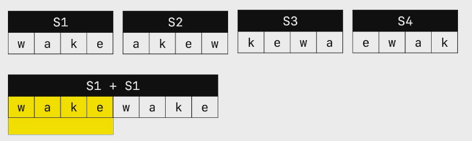
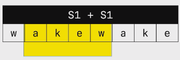
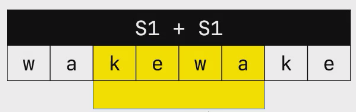

# 内容

原题名叫做：[字符串轮转](https://leetcode.cn/problems/string-rotation-lcci/description/)。给定两个字符串`s1`和`s2`，请编写代码检查`s2`是否为`s1`旋转而成。比如，waterbottle是erbottlewat旋转后的字符串）

示例：输入`s1 = "back", s2 = "ackb"`，则输出`True`；
输入`s1 = "aa", s2 = "aba"`，则输出`False`。

# 分析

拿wake举例，它的旋转词有4种情况：
```
Sa:wake
Sb:akew
Sc:kewa
Sd:ewak
```
发现，可以让原串重复一次，成为`wakewake`。发现，wake的旋转词都能在这个重复串中找到子串。
那么，问题就转化为从原串中匹配s2，即匹配字符串。




# 代码

## 解1_调库_调用Java库函数contains

```java
package 字符串;
/**
 * https://leetcode.cn/problems/string-rotation-lcci/
 * 
 */
public class 面试题01_09_字符串轮转 {
    public static boolean isRevolving(String s1, String s2)
    {
        if(s1 == null || s2 == null) return false;
        if(s1.length() != s2.length()) return false;
        return (s1 + s1).contains(s2);
    }
    public static void main(String[] args)
    {
        System.out.println(isRevolving("wake", "ewak"));
    }
}
```

## 解2_编写KMP

一般来说，面试手撕KMP的可能性还是比较低的，除非面试官时间很充足。
如果是用的提供库调用的在线编译平台，则优先调用库函数：因为是java代码，而且contains有可能是暴力匹配，可能性能比较底下，先尝试能不能符合编译器最小时间需求。
如果不让用库函数，或者java库函数代码性能低下，则只能手撕KMP了。
如果实在没时间了，或者手撕不出来，则可以与面试官讲自己非常理解KMP的思路，毕竟思路是最重要的，代码是第二位。

# 心得

这个题目给了字符串类问题一个解决思路：**原串重复两次——即原串再次拼接一个原串**，有些问题可能就迎刃而解了。多去想想，就能转化成两个拼接的串中匹配一个子串的问题。