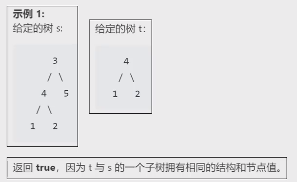
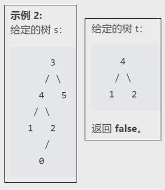

# 内容

原题名叫做：[另一个树的子树](https://leetcode.cn/problems/subtree-of-another-tree/description/)。总的来说就是找一个树T1中有没有和T2完全结构一样的子树。
# 分析

要判断树中是否包含某个具体的结构，可以使用遍历序列来判断。
但是要注意：示例2就是一种容易忽略的情况。如果仅仅依靠非空节点的遍历序列去判断，则就会忽略掉T1中的比T2多余的部分，比如：T1的前序遍历为`341205`，T2的前序遍历为`412`。虽然T1包含T2的序列`412`，但是T1的`2`节点下面还挂着左孩子`0`。这就导致实际上T1中这个子树和T2结构不完全一样！
所以，还要给叶子节点的空孩子加标记符，比如`#`代表空。
如此，T1的前序遍历为`341##20#5##`，T2的前序遍历为`41##2##`，这样就能区分了。
除此之外：还要在每次写val值（包括空）之后附加个`!`标记，因为`122334`有可能是`12,23,34`，也有可能是`1,223,34`。这就造成了歧义。
补充一句，前序、中序、后序选择哪一个都可以，只要给出有效节点值、空节点以及访问节点结束标志，就能完全确定一个树的结构。


# 代码

## 解1_两树序列化为字符串，判断是否包含子串

Java中字符串不断的拼接一定要用StringBuilder。可以提高效率。
```java
package 字符串;
import common.TreeNode;
public class _572_另一个树的子树 {
    public boolean isSubtree(TreeNode root, TreeNode subRoot) {
         
    }
    // 此处用后序遍历序列来表达树的结构。换成前序、中序也可以。
    private String postSerialize(TreeNode root)
    {
        StringBuilder sb = postSerialize(root, sb);
        return sb.toString();
    }
    private void postSerialize(TreeNode root, StringBuilder sb)
    {
        if(root != null)
        {
            postSerialize(root.left, sb);
            postSerialize(root.right, sb);
            sb.append(root.val);
        }
        else
        {
            sb.append("#");
        }
        sb.append("!");
        return;
    }
}

```
测试
```java
import common.TreeNode;
import common.printer.BinaryTreeInfo;
import common.printer.BinaryTrees;

    public static void main(String[] args)
    {
        TreeNode root = new TreeNode(3);
        root.right = new TreeNode(5);
        root.left = new TreeNode(4);
        TreeNode curRoot = root.left;
        curRoot.left = new TreeNode(1);
        curRoot.right = new TreeNode(2);
        BinaryTrees.println(new BinaryTreeInfo() {
            @Override
            public Object root() {
                return root;
            }
            @Override
            public Object left(Object node) {
                return ((TreeNode)node).left;
            }
            @Override
            public Object right(Object node) {
                return ((TreeNode)node).right;
            }
            public Object string(Object node) {
                return ((TreeNode)node).val;
            }
        });
        System.out.println(postSerialize(root));
    }
```
结果：
```
  ┌─3─┐
  │   │
┌─4─┐ 5
│   │
1   2
#!#!1!#!#!2!4!#!#!5!3!
```
isSubtree函数：对比两个字符串，判断T1字符串是否包含T2字符串。可以调用java的库函数contains。但据说contains用的不是KMP，因此效率可能较低，最好调用KMP算法。
```java
    public boolean isSubtree(TreeNode root, TreeNode subRoot) {
        if(root == null || subRoot == null) return false;
        return postSerialize(root).contains(postSerialize(subRoot));
    }
```
### 坑

虽然前序、中序、后序都可以，但是以上先序遍历转化的字符串有缺陷，仍不能通过T1先序字符串包含T2先序字符串就断定T2一定是T1的子树。比如：T1是33单节点，那么T1的字符串为`33!#!#!`，T2为3单节点，那么T2的字符串为`3!#!#!`，可以看到，虽然T1字符串包含T2字符串，但是T2的3节点压根就跟T1的33节点没关系！
于是，可以看到，前序遍历是存在缺陷的，这个缺陷只出现在顶点打印的歧义。
中序、后序都没有这样的问题。所以，如果是用前序遍历来序列化树，那么要在打印的最开始再另加一个标志如`?`，如此：T1字符串变为`?33!#!#!`，T2字符串变为`?3!#!#!`，由此就可以判别出，T1字符串不包含T2字符串了，因此可以正确判断出，T2不是T1的子树。
# 心得

这个题目属于二叉树的结构方面的问题，类似这类题型，考虑利用二叉树序列的特点和意义，转化为字符串序列，相当于把不好解决的树形结构降维打击成了一维结构。所以，本质上，这个题目考察的是二叉树的序列化、反序列化。

# 总结

1. 非空节点：`值!`，空节点：`#!`
2. 空节点也必须序列化，才能完整地表达唯一的一棵树，而且前序、中序、后序遍历都可以确定一棵树，但是层序遍历不可以。