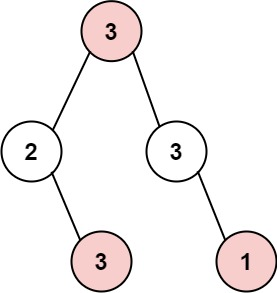

# 打家劫舍

你是一个专业的小偷，计划偷窃沿街的房屋。每间房内都藏有一定的现金，影响你偷窃的唯一制约因素就是相邻的房屋装有相互连通的防盗系统，**如果两间相邻的房屋在同一晚上被小偷闯入，系统会自动报警**。

给定一个代表每个房屋存放金额的非负整数数组，计算你**不触动警报装置的情况下** ，一夜之内能够偷窃到的最高金额。

示例 1：

```
输入：[1,2,3,1]
输出：4
解释：偷窃 1 号房屋 (金额 = 1) ，然后偷窃 3 号房屋 (金额 = 3)。
     偷窃到的最高金额 = 1 + 3 = 4 。
```


示例 2：

```
输入：[2,7,9,3,1]
输出：12
解释：
    偷窃1号房屋(金额=2),偷窃3号房屋(金额=9)，接着偷窃5号房屋(金额=1)。
    偷窃到的最高金额 = 2 + 9 + 1 = 12 。
```

提示：

```
1 <= nums.length <= 100
0 <= nums[i] <= 400
```

## 代码

```cpp
class Solution {
public:
    int rob(vector<int>& nums) {
        vector<int> ar;
        ar.reserve(nums.size()+1);
        ar[0] = 0;
        ar[1] = nums[0];
        int max = ar[1];
        for(int i = 2; i<=nums.size(); ++i)
        {
            ar[i] = std::max(ar[i-2]+nums[i-1],ar[i-1]);
            if(ar[i]>max)max = ar[i];
        }
        return max;
    }
};
```

# 打家劫舍2

你是一个专业的小偷，计划偷窃沿街的房屋，每间房内都藏有一定的现金。这个地方所有的房屋都**围成一圈**，这意味着**第一个房屋和最后一个房屋是紧挨着**的。同时，相邻的房屋装有相互连通的防盗系统，**如果两间相邻的房屋在同一晚上被小偷闯入，系统会自动报警**。

给定一个代表每个房屋存放金额的非负整数数组，计算你**在不触动警报装置的情况下** ，今晚能够偷窃到的最高金额。

示例 1：

```
输入：nums = [2,3,2]
输出：3
解释：你不能先偷窃 1 号房屋（金额 = 2），然后偷窃 3 号房屋（金额 = 2）, 因为他们是相邻的。
```


示例 2：

```
输入：nums = [1,2,3,1]
输出：4
解释：你可以先偷窃 1 号房屋（金额 = 1），然后偷窃 3 号房屋（金额 = 3）。
     偷窃到的最高金额 = 1 + 3 = 4 。
```

示例 3：

```
输入：nums = [1,2,3]
输出：3
```

提示：

```
1 <= nums.length <= 100
0 <= nums[i] <= 1000
```

## 题解

这道题是**打家劫舍**的进阶，和初级版的不同之处是，这道题中的房屋是首尾相连的，第一间房屋和最后一间房屋相邻，因此第一间房屋和最后一间房屋不能在同一晚上偷窃。

和其相似，这道题也可以使用动态规划解决。建议首先了解动态规划的思想。

---

首先考虑最简单的情况。如果只有一间房屋，则偷窃该房屋，可以偷窃到最高总金额。如果只有两间房屋，则由于两间房屋相邻，不能同时偷窃，只能偷窃其中的一间房屋，因此选择其中金额较高的房屋进行偷窃，可以偷窃到最高总金额。

注意到当房屋数量不超过两间时，最多只能偷窃一间房屋，因此不需要考虑首尾相连的问题。如果房屋数量大于两间，就必须考虑首尾相连的问题，第一间房屋和最后一间房屋不能同时偷窃。

如何才能保证第一间房屋和最后一间房屋不同时偷窃呢？如果偷窃了第一间房屋，则不能偷窃最后一间房屋，因此偷窃房屋的范围是第一间房屋到最后第二间房屋；如果偷窃了最后一间房屋，则不能偷窃第一间房屋，因此偷窃房屋的范围是第二间房屋到最后一间房屋。

假设数组$nums$的长度为$n$。如果不偷窃最后一间房屋，则偷窃房屋的下标范围是$[0, n-2]$；如果不偷窃第一间房屋，则偷窃房屋的下标范围是$[1,n−1]$。在确定偷窃房屋的下标范围之后，即可用第1题的方法解决。对于两段下标范围分别计算可以偷窃到的最高总金额，其中的最大值即为在$n$间房屋中可以偷窃到的最高总金额。

假设偷窃房屋的下标范围是$[start,end]$，用$dp[i]$表示在下标范围$[start,i]$内可以偷窃到的最高总金额，那么就有如下的状态转移方程：

$dp[i]=max(dp[i−2]+nums[i],dp[i−1])$

边界条件为：

$$
\begin{cases} \textit{dp}[\textit{start}] = \textit{nums}[\textit{start}] & 只有一间房屋，则偷窃该房屋 \\ \textit{dp}[\textit{start}+1] = \max(\textit{nums}[\textit{start}], \textit{nums}[\textit{start}+1]) & 只有两间房屋，偷窃其中金额较高的房屋 \end{cases}
$$
 计算得到$dp[end]$即为下标范围$[start,end]$内可以偷窃到的最高总金额。

分别取$(start,end)=(0,n−2)$和$(start,end)=(1,n−1)$进行计算，取两个$dp[end]$中的最大值，即可得到最终结果。

根据上述思路，可以得到时间复杂度$O(n)$和空间复杂度$O(n)$的实现。

考虑到每间房屋的最高总金额只和该房屋的前两间房屋的最高总金额相关，因此可以使用滚动数组，在每个时刻只需要存储前两间房屋的最高总金额，将空间复杂度降到$O(1)$。

```cpp
class Solution {
public:
    int robRange(vector<int>& nums, int start, int end) {
        int first = nums[start], second = max(nums[start], nums[start + 1]);
        for (int i = start + 2; i <= end; i++) {
            int temp = second;
            second = max(first + nums[i], second);
            first = temp;
        }
        return second;
    }

    int rob(vector<int>& nums) {
        int length = nums.size();
        if (length == 1) {
            return nums[0];
        } else if (length == 2) {
            return max(nums[0], nums[1]);
        }
        return max(robRange(nums, 0, length - 2), robRange(nums, 1, length - 1));
    }
};
```

# 打家劫舍3

小偷又发现了一个新的可行窃的地区。这个地区只有一个入口，我们称之为`root`。

除了`root`之外，每栋房子有且只有一个“父“房子与之相连。一番侦察之后，聪明的小偷意识到“这个地方的所有房屋的排列类似于一棵二叉树”。 如果**两个直接相连的房子在同一天晚上被打劫**，房屋将自动报警。

给定二叉树的`root`。返回**在不触动警报的情况下**，小偷能够盗取的最高金额 。

**示例 1:**



```
输入: root = [3,2,3,null,3,null,1]
输出: 7 
解释: 小偷一晚能够盗取的最高金额 3 + 3 + 1 = 7
```

**示例 2:**


```
输入: root = [3,4,5,1,3,null,1]
输出: 9
解释: 小偷一晚能够盗取的最高金额 4 + 5 = 9
```

**提示：**

- 树的节点数在 `[1, 104]` 范围内
- `0 <= Node.val <= 104`

## 题解

思路与算法

简化一下这个问题：一棵二叉树，树上的每个点都有对应的权值，每个点有两种状态（选中和不选中），问在不能同时选中有父子关系的点的情况下，能选中的点的最大权值和是多少。

我们可以用$f(o)$表示选择$o$节点的情况下，$o$节点的子树上被选择的节点的最大权值和；$g(o)$表示不选择$o$节点的情况下，$o$节点的子树上被选择的节点的最大权值和；$l$和$r$代表$o$的左右孩子。

* 当$o$被选中时，$o$的左右孩子都不能被选中，故$o$被选中情况下子树上被选中点的最大权值和为$l$和$r$不被选中的最大权值和相加，即$f(o)=g(l)+g(r)$。
* 当$o$不被选中时，$o$的左右孩子可以被选中，也可以不被选中。对于$o$的某个具体的孩子$x$，它对$o$的贡献是$x$被选中和不被选中情况下权值和的较大值。故$g(o)=max\{f(l),g(l)\}+max\{f(r),g(r)\}$。

至此，我们可以用哈希表来存$f$和$g$的函数值，用深度优先搜索的办法后序遍历这棵二叉树，我们就可以得到每一个节点的$f$和$g$。根节点的$f$和$g$的最大值就是我们要找的答案。

我们不难给出这样的实现：

```cpp
class Solution {
public:
    unordered_map <TreeNode*, int> f, g;

    void dfs(TreeNode* node) {
        if (!node) {
            return;
        }
        dfs(node->left);
        dfs(node->right);
        f[node] = node->val + g[node->left] + g[node->right];
        g[node] = max(f[node->left], g[node->left]) + max(f[node->right], g[node->right]);
    }

    int rob(TreeNode* root) {
        dfs(root);
        return max(f[root], g[root]);
    }
};
```

假设二叉树的节点个数为$n$。

我们可以看出，以上的算法对二叉树做了一次后序遍历，时间复杂度是$O(n)$；由于递归会使用到栈空间，空间代价是$O(n)$，哈希表的空间代价也是$O(n)$，故空间复杂度也是$O(n)$。

我们可以做一个小小的优化，我们发现无论是$f(o)$还是$g(o)$，他们最终的值只和$f(l)$、$g(l)$、$f(r)$、$g(r)$有关，所以对于每个节点，我们只关心它的孩子节点们的$f$和$g$是多少。我们可以设计一个结构，表示某个节点的$f$和$g$值，在每次递归返回的时候，都把这个点对应的$f$和$g$返回给上一级调用，这样可以省去哈希表的空间。

代码如下。

```cpp
struct SubtreeStatus {
    int selected;
    int notSelected;
};

class Solution {
public:
    SubtreeStatus dfs(TreeNode* node) {
        if (!node) {
            return {0, 0};
        }
        auto l = dfs(node->left);
        auto r = dfs(node->right);
        int selected = node->val + l.notSelected + r.notSelected;
        int notSelected = max(l.selected, l.notSelected) + max(r.selected, r.notSelected);
        return {selected, notSelected};
    }

    int rob(TreeNode* root) {
        auto rootStatus = dfs(root);
        return max(rootStatus.selected, rootStatus.notSelected);
    }
};
```

复杂度分析

时间复杂度：$O(n)$。上文中已分析。

空间复杂度：$O(n)$。虽然优化过的版本省去了哈希表的空间，但是栈空间的使用代价依旧是$O(n)$，故空间复杂度不变。
