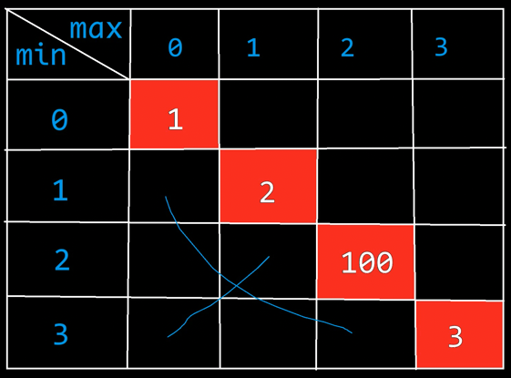

# 动态规划

高阶马尔科夫模型。

一个问题是否是动态规划，决定因素在于某一状态是否依赖于前面的一些状态，至少要依赖多于一种的状态才行。贪心算法其实也是动态规划的一种，可以转化为简单的动态规划。而动态规划与贪心的区别就在于动态规划的眼光比较长远，而贪心只顾及眼前的利益。

动态规划常能解决的有：01背包问题。

简单来说动态规划就是把难以解决的问题分割为很多结构相似的小问题。

# Fibonacci

斐波那契数列。

```
1 1 2 3 5 8 13 21 34 55 89

```

## 递归法

```c
int fibo(int n)
{
    if(n == 1 || n == 2)
    {
        return 1;
    }
    return fibo(n - 1) + fibo(n - 2);
}
```

测试

```c
int main(void)
{
    int i = fibo(8);
    return 0;
}
```

## 迭代法

即循环，无需硬件栈，速度更快，状态不重复，但是需要依赖表格。

```c
int fibo2(int n)
{
    int dp[50] = {0};
    dp[1] = 1;
    dp[2] = 1;
    for(int i = 3; i <= n; ++i)
    {
        dp[i] = dp[i - 1] + dp[i - 2];
    }
}
```

# 背包

起始于一种状态：有一个包，小偷偷东西，有大有小，有贵有贱。那么小偷就要考虑如何在有限的容量下拿尽多价值的东西。

| item | Value | Weight |
| ---- | ----- | ------ |
| 0    | 5     | 9      |
| 1    | 9     | 11     |
| 2    | 7     | 6      |
| 3    | 11    | 15     |
| 4    | 16    | 18     |
| 5    | 13    | 14     |

## 递归法

```c
int vals[] = {5, 9, 7, 11, 16, 13};
int weights[] = {9, 11, 6, 15, 18, 14};
int ks(int n, int cap)
{
    if(n == 0)
    {
        return cap >= weights[n] ? vals[n] : 0;
    }
    // 如果不选，则价值为：
    int no = ks(n - 1, cap);
    // 如果选择的价值：（先初始化为不选）
    int yes = no;
    if(cap >= weights[n])
    {
        yes = ks(n - 1, cap - weights[n]) + vals[n];
    }
    return no >= yes ? no : yes;
}
```

测试，结果应为45

```c
int main()
{
    int i = ks(5, 50);
}
```

## 迭代法

```c
int vals[] = {5, 9, 7, 11, 16, 13};
int weights[] = {9, 11, 6, 15, 18, 14};
int ks2(int n, int cap)
{
    // 6行 51列
    int res[6][51] = {0};
    // 初始化表格
    // i指的是背包目前的容量
    for(int i = 0; i <= 50; ++i)
    {
        if(i < weights[0])// weights[0]对应于 第0号物品的重量
        {
            res[0][i] = 0;
        }
        else
        {
            res[0][i] = vals[0];
        }
    }
    // 遍历计算每一个状态
    // 行 对应于n
    for(int i = 1; i <= n; ++i)
    {
        // 列 对应于cap
        for(int j = 0; j <= cap; ++j)
        {
            int no = res[i - 1][j];
            int yes = no;
            if(j >= weights[i])
            {
                yes = vals[i] + res[i - 1][j - weights[i]];
            }
            res[i][j] = no >= yes ? no : yes;
        }
    }
    return res[n][c];
}
```

测试，结果应为45

```c
int main()
{
    int i = ks2(5, 50);
}
```

# 背包变型 - 凑数

```c
nums[] = 5 8 1 3 9 2 4 7 6 -> 能不能凑出25
bool mk_sum(n, target_val)
不取：mk_sum(n - 1, target_val)           ->能不能从剩下的n-1个中凑出tar
取： mk_sum(n - 1, target_val - nums[n])  ->能不能从剩下的n-1中凑出tar-nums[n]
    
两个状态之间应该取OR（或）的关系，只要有一边可以达到，则就可以凑出25
    
终止条件：
    （1）n = 0，此时看target_get和第0个数是否相等。
    （2）或者target_val为0（全不选即可凑为0）
```

```c
int sums[] = {5, 8, 1, 3, 9, 2, 4, 7, 6};//9个数
int mk_sum(int n, int target_val)
{   
    // 终止条件
    if(target_val == 0)return 1; //true
    if(n == 0)return target_val == nums[0];
    int no = mk_sum(n - 1, target_val);
    int yes = no;
    if(target_val >= nums[n])
    {
        yes = mk_sum(n - 1, target_val - nums[n]);
    }
    return no || yes;
}
```

## 迭代法

```
n ∈ [0, 8]
target ∈ [0, 99] //其实target应该无上限才对，本例只看99以下的凑数情况
所以需要 9 × 100 的数组
```


```c
int sums[] = {5, 8, 1, 3, 9, 2, 4, 7, 6};
int mk_sum2(int n, int target_val)
{
    char res[9][100] = {0};//因为表中的值只能有0、1，为了节省空间，用char
    for(int i = 0; i <= n; ++i)
    {
        res[i][0] = 1;// 第0列，代表target_val为0，此时为凑0，即全不选即可
    }
    // 以下for其实可以替换为一句话：res[0][nums[0]] = 1
    for(int j = 1; j <= target_val; ++j)
    {
        // 在第0个数时，为一个终止条件，看j正好与自身nums[0]相等时正好能凑
        res[0][j] = j == nums[0];
    }
    // 计算表格中每一个状态
    for(int i = 1; i <= n; ++i)
    {
        for(int j = 1; j <= target_val; ++j)
        {
            char no = res[i - 1][j];
            char yes = no;
            if(nums[i] <= j)
            {
                yes = res[i - 1][j - nums[i]];
            }
            res[i][j] = yes || no;
        }
    }
    return res[n][target_val];
}
```

测试，结果应为1

```c
int main()
{
    char i = mk_sum2(8, 45);//从八个数中凑45
}
```

# 每次两边二选一最后总数最大
若干个小球排列成一排，每个小球上面写有一个整数。
玩家a和玩家b依次拿走小球，一名玩家一次只能拿一个球，规定玩家a先拿，玩家b后拿，但是每个玩家每次只能拿走最左或最右的球。
游戏结束时，每个玩家已经拿走的球上面的数字之和就是他得到的分数。
玩家a和玩家b都绝顶聪明，他们总会采用最优策略。
请返回最后获胜者的分数。

示例：
小球序列用一个整型数组 A 表示。
如：`arr = [1,2,100,3]`
开始时玩家A只能拿走`1`或`3`。如果玩家A拿走1，则排列变为`[2,100,3]`，接下来玩家B可以拿走`2`或`3`，然后继续轮到玩家A。如果开始时玩家A拿走`3`，则排列变为`[1,2,100]`，接下来玩家B可以拿走`1`或`100`，然后继续轮到玩家A。玩家A作为绝顶聪明的人不会先拿`3`，因为拿了`3`之后玩家B将拿走`100`。所以玩家A会先拿`1`，让排列变为`[2,100,3]`，接下来玩家B不管怎么选，`100`都会被玩家A拿走、玩家A会获胜，分数为`101`。所以返回`101`。
如：`arr = [1,100,2]`
开始时玩家A不管拿`1`还是`2`，玩家B作为绝顶聪明的人，都会把`100`拿走。玩家B会获胜，分数为`100`，所以返回`100`。
## 结构体
可以自定义一个结构体，最后返回这个结构体，从而可以分析两个记录值。
```cpp
typedef struct _Score
{
    int current;
    int other;
}Score;
```
current代表当前人的总分数，other代表另一个人的总分数。
第一次选时，假设current是A，other是B。
则第二次选时（问题深度加1），current是B，other是A。
可以用king代表函数名，函数中有两个参数，`left`代表最左数的下标，`right`代表最右数的下标。
`king(left, right)`表示A先选，返回值`current`表示A在`left`到`right`之间，和B一起轮流选后的总分，other表示B的总分。
通过分析，可以清晰地知道，只有`left`和`right`两个通路，以此可以递推出两个迭代函数。
```
1 2 100 3

king(left, right) = ?

最后最高得分：
第1人（A）选择left:  king(left + 1, right)  -- 此时Current变为B
第1人（A）选择right: king(left, right - 1)  -- 此时Current变为B
```
## 递归法
```c
#include<iostream>
typedef struct _Score
{
    int current;
    int other;
}Score;
int arr[] = { 1, 2, 100, 3 };

Score king_recur(int left, int right)
{
    Score score;
    if (left == right)
    {
        score.current = arr[left]; // left == right, 只有一个数
        score.other = 0;
        return score;
    }
    Score left_score  = king_recur(left + 1, right);
    Score right_score = king_recur(left, right - 1);
    // left_score.other + arr[left]   表示 上次选的人 选择左之后 的分数
    // left_score.other + arr[right]  表示 上次选的人 选择右之后 的分数
    // left_score.current             表示  这次要选的人        的分数
    // 如果 上次的人选 左边 之后 的 分数 减去 这次要选的人 的分数，
    // 比  上次的人选 右边 之后 的 分数 减去 这次要选的人 的分数大，则 上次的人（current）选左边：
    if (left_score.other + arr[left] - left_score.current >= right_score.other + arr[right] - right_score.current)
    {
        // 上次的other成为了这次的current，选了左边，因此current = other+arr[left]
        score.current = left_score.other + arr[left];
        // 上次的current成为了这次的other
        score.other   = left_score.current;
    }
    else // 否则，上次的人（current）就选右边。
    {
        score.current = right_score.other + arr[right];
        score.other   = right_score.current;
    }
    return score;
}
int main()
{
    Score score = king_recur(0, 3);
    std::cout << "A: " << score.current << ", B: " << score.other << std::endl;
}
```

测试：A: 101, B: 5
### 复杂度分析
每一次迭代有2个分支，因此递归法的时间复杂度为$O(2^n)$。
## 迭代法

终止条件是：`left == right`。这时只剩下一个球，只能选择这个球，此时值为这个球的数字。
因此，在迭代法中，就可以先以对角线斜行进行初始化。
还有一些可以轻松排除的：left不可能大于right，这些位置的值都无效，左下半角数值无意义。


接下来，我们再来分析`left = 0, right = 1`的情况：
1. 如果上一次的人选走了0号（1），那么`king(0, 1) => current = 2, other = 1`
2. 如果上一次的人选走了1号（2），那么`king(0, 1) => current = 1, other = 2`
3. 即每一个格子的值都依赖于左边的格或下边的格。
    1. 如果选了左边，则和下方格的other加和，作为当前current，与下方格的current对比，求差值=`左other+下数字价值-左current`
    2. 如果选了下边，则和左方格的other加和，作为当前current，与左方格的current对比，求差值=`下other+左数字价值-下current`
    3. 如果差值1大于差值2，则选左边；如果差值2大于差值1，则选右边。

这种需要依赖左1和下1的，需要斜着迭代，而不是简单地一行一行、一列一列地。
```c
int arr[] = { 1, 2, 100, 3 };
Score scores[4][4];
Score king_interation(int left, int right)
{
    for (int i = left; i <= right; ++i)
    {
        scores[i][i].current = arr[i];
        scores[i][i].other   = 0;
    }
    std::cout << "Matrix:" << std::endl;
    for (int i = 0; i < 4; ++i)
    {
        for (int j = 0; j < 4; ++j)
        {
            std::cout << scores[i][j].current << "," << scores[i][j].other << " ";
        }
        std::cout << std::endl;
    }
    for (int j = left + 1; j <= right; )
    {
        int i;
        for (i = left; i <= right - (j - i); ++i, ++j)
        {
            // i小，j大
            // 选右边的情况 优于 选左边的情况
            if (scores[i][j - 1].other + arr[j] - scores[i][j - 1].current >= scores[i + 1][j].other + arr[i] - scores[i + 1][j].current)
            {
                // 左边的other（以前选的）+ 这次选的右边
                scores[i][j].current = scores[i][j - 1].other + arr[j];
                scores[i][j].other = scores[i][j - 1].current;
            }
            else// 选右边的情况 差于 选左边的情况
            {
                // 右边的other（以前选的）+ 这次选的左边
                scores[i][j].current = scores[i + 1][j].other + arr[i];
                scores[i][j].other = scores[i + 1][j].current;
            }
        }
        j = j - i + 1;
    }
    return scores[left][right];
}
int main()
{
    score = king_interation(0, 3);
    std::cout << "Matrix:" << std::endl;
    for (int i = 0; i < 4; ++i)
    {
        for (int j = 0; j < 4; ++j)
        {
            std::cout << scores[i][j].current << "," << scores[i][j].other << " ";
        }
        std::cout << std::endl;
    }
    std::cout << "A: " << score.current << ", B: " << score.other << std::endl;
}
```
### 优化逻辑
其实可以直接比较得分而无需计算差值。
我们之所以不使用“差值”进行比较，是因为这里的目标并不是仅仅**最大化与对手的得分差**，而是**获得尽可能多的分数**。在这个游戏的规则下：
- 每个回合的目标是为当前玩家（无论是A还是B）取得当前回合的最高得分；
- 同时，下一轮再以递归的方式计算对手得分的最大化策略。

因此，**差值并不能准确反映最佳选择**，因为差值只考虑到某一轮次的得失，而不是整个局面的最优解。而在动态规划中，我们将所有可能的得分组合记录下来，从而避免错过任何潜在的最优策略。
```cpp
Score king_interation(int left, int right)
{
    for (int i = left; i <= right; ++i)
    {
        scores[i][i].current = arr[i];
        scores[i][i].other   = 0;
    }
    std::cout << "Matrix:" << std::endl;
    for (int i = 0; i < 4; ++i)
    {
        for (int j = 0; j < 4; ++j)
        {
            std::cout << scores[i][j].current << "," << scores[i][j].other << " ";
        }
        std::cout << std::endl;
    }
    for (int j = left + 1; j <= right; )
    {
        int i;
        for (i = left; i <= right - (j - i); ++i, ++j)
        {
            // 选择左边或右边球
            int pickLeft = arr[i] + scores[i + 1][j].other;
            int pickRight = arr[j] + scores[i][j - 1].other;
        
            // 选择更优策略
            if (pickLeft > pickRight) {
                scores[i][j].current = pickLeft;
                scores[i][j].other = scores[i + 1][j].current;
            }
            else {
                scores[i][j].current = pickRight;
                scores[i][j].other = scores[i][j - 1].current;
            }
        }
        j = j - i + 1;
    }
    return scores[left][right];
}
```
### 动态规划与贪心的区别

在这个动态规划的方案中：
1. **完整性**：动态规划表记录了从每一个子问题的解开始，构建整个问题的解。这样就保证了即使在更早的步骤中没有获得“局部最高得分”，也能通过累计得到最终的最优解。
2. **非贪心性**：如果采用贪心策略，每一步都会选择当前“最显眼”的得分选项（例如，选择最大值或最小值），忽视之后的可能得分。然而动态规划在 `scores[i][j]` 中记录了所有可能选项带来的得分情况，使得每一步都是基于整体最优，而非局部最优。对于 `[0, 3]` 的序列，不直接依赖于局部差值，而是递归地从 `scores[0][1], scores[1][3]` 等子问题的最优解构建整个区间的最优解。
## 总结
这道题的难点在于：current、other这两个变量名我们是固定好的，但是每一次选完之后，current和other的实际身份互换。要在错综复杂的分析中明确迭代方程在本层与上一层之间的联系、区别。同时，if条件表达式比较长，需要保持清楚的逻辑分析出，究竟需要看什么条件，此题不只是简单的看谁最终取得最大值，而是在过程中，看A选左边或右边之后，与B的差值，哪个大。
# Playing with Beads
There are `N` people in a group labeled from `1` to `N`. People are connected to each other via threads in the following manner.
The person with label number `K` is connected to all the persons with label `J` such that `J` exactly divides `K`. Beads can be passed through the threads. If a person `P` has a bead, in how many ways can the bead be passed in the network of threads so that it returns to the same person within `X` moves or less?

MOVE: Passing the bead from one person to the other.

Input specification:
input1: `N`, denoting the number of people.
input2: `P`, label of the person having the bead
input3: `X`, maximum number of moves that can be made

Output specification:
Your function should return the total number of ways in which the bead will return to its initial position within `X` moves.

Example 1:
```
input1: 3
input2: 2
input3: 2

Output: 1

Explanation:
Only 1 way:
2->1->2
```
Example 2:
```
input1: 3
input2: 2
input3: 4

Output: 3

Explanation:
3 ways:
2->1->2
2->1->3->1->2
2->1->2->1->2
```
## 分析
假如K可以被J整除，则K和J相连。相连者可以互传球。
1. 输入1：共有N个人。标记为1到N。
2. 输入2：从P开始传球
3. 输入3：在X步内，有多少种方法可以传回同一人？

## 递归法
```cpp
#include<iostream>
int n;
int begin;
int playbeads_recur(int p, int x)
{
    int sum = 0;
    if (x == 0)
    {
        std::cout << "End" << std::endl;
    }
    else
    {
        for (int i = 1; i <= n; ++i)
        {
            if ((i % p == 0 || p % i == 0) && (i != p))
            {
                std::cout << p << "->" << i << ", " << std::endl;
                if (i == begin)
                {
                    sum += 1;
                    std::cout << "This is a Way" << std::endl;
                }
                sum += playbeads_recur(i, x - 1);
            }
        }
    }
    return sum;
}
int main()
{
    n = 3;
    begin = 2;
    int x = 4;
    int sum = playbeads_recur(begin, x);

    std::cout << "Total Ways: " << sum << std::endl;
}
```
结果：
```
2->1,
1->2,
This is a Way
2->1,
1->2,
This is a Way
End
1->3,
End
1->3,
3->1,
1->2,
This is a Way
End
1->3,
End
Total Ways: 3
```
## 迭代法
```cpp
#include<iostream>
int n;
int begin;
int arr[4][5];
int playbeads(int p, int x)
{
    for (int i = 0; i <= n; ++i)
    {
        for (int j = 0; j <= x; ++j)
        {
            arr[i][j] = 0;
        }
    }
    for (int i = 1; i <= n; ++i)
    {
        if (begin == i)
        {
            arr[i][0] = 1;
        }
    }
    std::cout << "Matrix" << std::endl;

    for (int i = 0; i <= n; ++i)
    {
        for (int j = 0; j <= x; ++j)
        {
            std::cout << arr[i][j] << " ";
        }
        std::cout << std::endl;
    }
    // i 是 第几人
    // j 是 剩下几步
    for (int j = 1; j <= x; ++j)
    {
        for (int i = 1; i <= n; ++i)
        {
            // 注意，i==begin 且 j==x时表示第一步球在p手中，不能算
            if (i == begin && j != x)
            {
                arr[i][j] += 1;
            }
            for (int k = 1; k <= n; ++k)
            {
                if ((i != k) && (i % k == 0 || k % i == 0))
                {
                    arr[i][j] += arr[k][j-1];
                }
            }
        }
    }
    std::cout << "Matrix" << std::endl;
    for (int i = 0; i <= n; ++i)
    {
        for (int j = 0; j <= x; ++j)
        {
            std::cout << arr[i][j] << " ";
        }
        std::cout << std::endl;
    }
    return arr[p][x];
}
int main()
{
    n = 3;
    begin = 2;
    int x = 4;
    //int sum = playbeads_recur(begin, x);
    int sum = playbeads(begin, x);
    std::cout << "Total Ways: " << sum << std::endl;
}
```
输出：
```
Matrix
0 0 0 0 0
0 0 0 0 0
1 0 0 0 0
0 0 0 0 0
Matrix
0 0 0 0 0
0 1 1 3 3
1 1 2 2 3
0 0 1 1 3
Total Ways: 3
```
# 